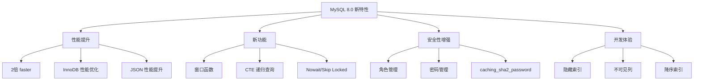

# ：MySQL 8.0 完全指南

> **难度等级**：⭐ 入门 | **学习时长**：6小时 | **实战项目**：用户管理系统

## 📚 本章目录

- [3.1 MySQL 8.0 新特性](#31-mysql-80-新特性)
- [3.2 安装与配置](#32-安装与配置)
- [3.3 存储引擎](#33-存储引擎)
- [3.4 数据类型优化](#34-数据类型优化)
- [3.5 索引优化](#35-索引优化)
- [3.6 查询优化](#36-查询优化)
- [3.7 主从复制](#37-主从复制)
- [3.8 备份与恢复](#38-备份与恢复)

---

## MySQL 8.0 新特性

### 核心新特性



### 详细特性列表

| 特性 | 说明 |
|-----|------|
| **窗口函数** | ROW_NUMBER()、RANK()、DENSE_RANK() 等 |
| **CTE** | 公用表表达式，支持递归查询 |
| **JSON 增强** | JSON 函数性能提升，部分索引支持 |
| **降序索引** | 支持 DESC 索引 |
| **隐藏索引** | 优化器不使用，用于测试删除索引影响 |
| **不可见列** | 对应用不可见，用于兼容性 |
| **NOWAIT/SKIP LOCKED** | 跳过锁等待的行 |
| **角色管理** | 支持角色，简化权限管理 |
| **默认认证** | caching_sha2_password 替代 mysql_native_password |

---

## 安装与配置

### Docker 安装（推荐）

```bash
# 1. 拉取 MySQL 8.0 镜像
docker pull mysql:8.0

# 2. 启动容器
docker run -d \
  --name mysql8 \
  -p 3306:3306 \
  -e MYSQL_ROOT_PASSWORD=your_password \
  -e MYSQL_DATABASE=testdb \
  -v /data/mysql:/var/lib/mysql \
  -v /data/mysql/conf:/etc/mysql/conf.d \
  mysql:8.0 \
  --character-set-server=utf8mb4 \
  --collation-server=utf8mb4_unicode_ci

# 3. 连接 MySQL
docker exec -it mysql8 mysql -uroot -p

# 4. 查看日志
docker logs -f mysql8
```

### Linux 安装

```bash
# Ubuntu/Debian
sudo apt update
sudo apt install mysql-server -y

# CentOS/RHEL
sudo yum install mysql-server -y

# 启动服务
sudo systemctl start mysql
sudo systemctl enable mysql

# 安全初始化
sudo mysql_secure_installation
```

### 配置文件 (my.cnf)

```ini
[mysqld]
# 基础配置
port = 3306
datadir = /var/lib/mysql
socket = /var/lib/mysql/mysql.sock
pid-file = /var/run/mysqld/mysqld.pid

# 字符集
character-set-server = utf8mb4
collation-server = utf8mb4_unicode_ci

# 连接配置
max_connections = 500
max_connect_errors = 100
wait_timeout = 28800
interactive_timeout = 28800

# InnoDB 配置
default-storage-engine = INNODB
innodb_buffer_pool_size = 1G
innodb_log_file_size = 256M
innodb_flush_log_at_trx_commit = 2
innodb_flush_method = O_DIRECT

# 慢查询日志
slow_query_log = 1
slow_query_log_file = /var/log/mysql/slow.log
long_query_time = 2

# 二进制日志
log_bin = mysql-bin
binlog_format = ROW
expire_logs_days = 7

# 时区
default-time-zone = '+8:00'

# SQL 模式
sql_mode = STRICT_TRANS_TABLES,NO_ZERO_IN_DATE,NO_ZERO_DATE,ERROR_FOR_DIVISION_BY_ZERO,NO_ENGINE_SUBSTITUTION

[mysql]
default-character-set = utf8mb4

[client]
default-character-set = utf8mb4
```

---

## 存储引擎

### 查看存储引擎

```sql
-- 查看所有引擎
SHOW ENGINES;

-- 查看当前默认引擎
SHOW VARIABLES LIKE 'default_storage_engine';

-- 查看表使用的引擎
SHOW TABLE STATUS WHERE Name = 'users';

-- 查看表引擎
SHOW CREATE TABLE users;
```

### InnoDB vs MyISAM

| 特性 | InnoDB | MyISAM |
|-----|--------|--------|
| **事务** | 支持 | 不支持 |
| **外键** | 支持 | 不支持 |
| **锁粒度** | 行锁 | 表锁 |
| **崩溃恢复** | 自动恢复 | 需手动修复 |
| **并发性能** | 高 | 低 |
| **全文索引** | 5.6+ 支持 | 支持 |
| **空间索引** | 支持 | 不支持 |
| **适用场景** | 高并发、事务 | 只读、归档 |

### InnoDB 核心特性

**1. 事务支持**：

```sql
-- 自动提交
SET autocommit = 0;  -- 关闭自动提交
SET autocommit = 1;  -- 开启自动提交（默认）

-- 手动事务
BEGIN;
UPDATE accounts SET balance = balance - 100 WHERE id = 1;
UPDATE accounts SET balance = balance + 100 WHERE id = 2;
COMMIT;
-- 或 ROLLBACK;
```

**2. 隔离级别**：

```sql
-- 查看隔离级别
SELECT @@transaction_isolation;

-- 设置隔离级别
SET SESSION TRANSACTION ISOLATION LEVEL READ UNCOMMITTED;
SET SESSION TRANSACTION ISOLATION LEVEL READ COMMITTED;
SET SESSION TRANSACTION ISOLATION LEVEL REPEATABLE READ;  -- MySQL 默认
SET SESSION TRANSACTION ISOLATION LEVEL SERIALIZABLE;
```

**3. 外键约束**：

```sql
CREATE TABLE orders (
    id BIGINT AUTO_INCREMENT PRIMARY KEY,
    user_id BIGINT NOT NULL,
    order_no VARCHAR(50) NOT NULL,
    created_at TIMESTAMP DEFAULT CURRENT_TIMESTAMP,
    FOREIGN KEY (user_id) REFERENCES users(id) ON DELETE CASCADE ON UPDATE CASCADE
);
```

**4. 行锁**：

```sql
-- 共享锁（S锁）
SELECT * FROM users WHERE id = 1 LOCK IN SHARE MODE;

-- 排他锁（X锁）
SELECT * FROM users WHERE id = 1 FOR UPDATE;

-- 跳过锁定的行
SELECT * FROM users WHERE id = 1 FOR UPDATE SKIP LOCKED;

-- 不等待锁
SELECT * FROM users WHERE id = 1 FOR UPDATE NOWAIT;
```

---

## 数据类型优化

### 整数类型选择

```sql
-- 根据数据范围选择合适类型

TINYINT    -- 1字节，-128~127，适用于：状态、枚举值
SMALLINT   -- 2字节，-32768~32767，适用于：小范围计数
MEDIUMINT  -- 3字节，-8388608~8388607
INT        -- 4字节，-21亿~21亿，适用于：普通ID、计数
BIGINT     -- 8字节，超大范围，适用于：订单号、交易ID

-- 无符号整数（扩大正数范围）
INT UNSIGNED  -- 0~42亿
```

### 字符串类型选择

```sql
-- CHAR vs VARCHAR
CHAR(10)      -- 固定长度，适合：MD5、UUID、手机号
VARCHAR(255)   -- 可变长度，适合：用户名、标题

-- TEXT 类型
TINYTEXT       -- 255字节，短文本
TEXT           -- 64KB，文章内容
MEDIUMTEXT     -- 16MB，长文档
LONGTEXT       -- 4GB，超大文档

-- 优化建议
-- 1. 固定长度用 CHAR
phone CHAR(11) NOT NULL  -- 手机号固定11位

-- 2. 可变长度用 VARCHAR
username VARCHAR(50) NOT NULL  -- 用户名长度不一

-- 3. 大文本用 TEXT
content TEXT  -- 文章内容
```

### 日期时间类型

```sql
-- DATE：日期 2024-01-15
CREATE TABLE events (
    event_date DATE
);

-- DATETIME：日期时间 2024-01-15 14:30:00
CREATE TABLE orders (
    order_time DATETIME(3)  -- 毫秒精度
);

-- TIMESTAMP：时间戳 1970-2038
CREATE TABLE logs (
    created_at TIMESTAMP DEFAULT CURRENT_TIMESTAMP
);

-- YEAR：年份
CREATE TABLE employees (
    birth_year YEAR
);

-- 选择建议
-- DATETIME：不涉及时区，手动管理
-- TIMESTAMP：自动转换时区，自动更新
```

### JSON 类型

```sql
-- 创建 JSON 列
CREATE TABLE products (
    id BIGINT AUTO_INCREMENT PRIMARY KEY,
    name VARCHAR(200),
    attributes JSON,  -- JSON 类型
    created_at TIMESTAMP DEFAULT CURRENT_TIMESTAMP
);

-- 插入 JSON 数据
INSERT INTO products (name, attributes) VALUES
('iPhone', '{"color": "black", "storage": "256GB", "price": 7999}');

-- 查询 JSON 数据
SELECT name, attributes->>'$.color' as color FROM products;
SELECT name, attributes->>'$.price' as price FROM products;

-- JSON 函数
JSON_EXTRACT(attributes, '$.color')   -- 提取值
JSON_SET(attributes, '$.price', 6999) -- 设置值
JSON_INSERT(attributes, '$.weight', '200g')  -- 插入值
JSON_REMOVE(attributes, '$.storage')  -- 删除值
JSON_KEYS(attributes)                 -- 获取所有键
JSON_ARRAY(attributes)                -- 转为数组

-- JSON 索引（MySQL 8.0.17+）
CREATE INDEX idx_attributes ON products((CAST(attributes->>'$.price' AS UNSIGNED)));
```

---

## 索引优化

### 索引类型

```sql
-- 1. 主键索引
PRIMARY KEY

-- 2. 唯一索引
UNIQUE INDEX

-- 3. 普通索引
INDEX

-- 4. 全文索引（MySQL 5.6+）
FULLTEXT INDEX

-- 5. 空间索引
SPATIAL INDEX
```

### 创建索引

```sql
-- 创建表时创建索引
CREATE TABLE users (
    id BIGINT AUTO_INCREMENT PRIMARY KEY,
    username VARCHAR(50) NOT NULL,
    email VARCHAR(100) NOT NULL,
    age TINYINT,
    status TINYINT,
    created_at TIMESTAMP,
    UNIQUE KEY uk_username (username),
    UNIQUE KEY uk_email (email),
    KEY idx_age (age),
    KEY idx_status_created (status, created_at)
);

-- 创建索引
CREATE INDEX idx_age ON users(age);
CREATE UNIQUE INDEX idx_username ON users(username);

-- 复合索引（最左前缀原则）
CREATE INDEX idx_status_age_created ON users(status, age, created_at);

-- 全文索引
CREATE FULLTEXT INDEX ft_index ON articles(title, content);

-- 查看索引
SHOW INDEX FROM users;

-- 删除索引
DROP INDEX idx_age ON users;
ALTER TABLE users DROP INDEX idx_age;
```

### 索引设计原则

**最左前缀原则**：

```sql
-- 复合索引 (status, age, created_at)
CREATE INDEX idx_status_age_created ON users(status, age, created_at);

-- 可以使用索引的查询
WHERE status = 1                                    -- ✅
WHERE status = 1 AND age = 20                       -- ✅
WHERE status = 1 AND age = 20 AND created_at > '2024-01-01'  -- ✅

-- 不能使用索引的查询
WHERE age = 20                                      -- ❌
WHERE age = 20 AND created_at > '2024-01-01'        -- ❌
WHERE created_at > '2024-01-01'                     -- ❌
```

**索引选择性**：

```sql
-- 计算索引选择性（越高越好）
SELECT COUNT(DISTINCT email) / COUNT(*) FROM users;  -- 接近 1，适合建索引
SELECT COUNT(DISTINCT status) / COUNT(*) FROM users;  -- 接近 0，不适合建索引

-- 高选择性列适合建索引
CREATE INDEX idx_email ON users(email);

-- 低选择性列不适合建索引
-- CREATE INDEX idx_status ON users(status);  -- ❌ 不推荐
```

### 覆盖索引

```sql
-- 复合索引包含所有查询列
CREATE INDEX idx_username_email_status ON users(username, email, status);

-- 查询只使用索引，不需要回表
SELECT username, email, status FROM users WHERE username = 'alice';

-- 查看执行计划
EXPLAIN SELECT username, email, status FROM users WHERE username = 'alice';
-- Extra: Using index（使用覆盖索引）
```

### 隐藏索引

```sql
-- 创建隐藏索引（MySQL 8.0+）
CREATE INDEX idx_age ON users(age) INVISIBLE;

-- 修改索引可见性
ALTER TABLE users ALTER INDEX idx_age VISIBLE;
ALTER TABLE users ALTER INDEX idx_age INVISIBLE;

-- 优化器是否使用隐藏索引
SET optimizer_switch = 'use_invisible_indexes=on';
```

---

## 查询优化

### EXPLAIN 执行计划

```sql
-- 查看执行计划
EXPLAIN SELECT * FROM users WHERE email = 'alice@example.com';

-- 关键字段：
-- id: 查询序号
-- select_type: 查询类型（SIMPLE, PRIMARY, SUBQUERY, DERIVED, UNION）
-- table: 表名
-- type: 访问类型（ALL < index < range < ref < eq_ref < const < system）
-- possible_keys: 可能使用的索引
-- key: 实际使用的索引
-- key_len: 使用的索引长度
-- ref: 索引比较的列
-- rows: 扫描的行数（估算）
-- filtered: 过滤的比例
-- Extra: 额外信息（Using index, Using where, Using filesort, Using temporary）

-- 详细执行计划（MySQL 8.0+）
EXPLAIN FORMAT=JSON SELECT * FROM users WHERE email = 'alice@example.com';

-- 分析执行计划
EXPLAIN ANALYZE SELECT * FROM users WHERE email = 'alice@example.com';
```

### 优化建议

**1. 避免 SELECT \***：

```sql
-- ❌ 慢
SELECT * FROM users WHERE id = 1;

-- ✅ 快
SELECT id, username, email FROM users WHERE id = 1;
```

**2. 利用索引**：

```sql
-- ❌ 不走索引（函数破坏索引）
SELECT * FROM users WHERE DATE(created_at) = '2024-01-15';

-- ✅ 走索引
SELECT * FROM users WHERE created_at >= '2024-01-15' AND created_at < '2024-01-16';
```

**3. 避免 OR，使用 UNION**：

```sql
-- ❌ 可能不走索引
SELECT * FROM users WHERE status = 1 OR age > 30;

-- ✅ 使用索引
SELECT * FROM users WHERE status = 1
UNION
SELECT * FROM users WHERE age > 30;
```

**4. LIKE 优化**：

```sql
-- ❌ 不走索引
SELECT * FROM users WHERE username LIKE '%alice%';

-- ✅ 走索引
SELECT * FROM users WHERE username LIKE 'alice%';

-- 全文索引替代
SELECT * FROM articles WHERE MATCH(title, content) AGAINST('keyword' IN NATURAL LANGUAGE MODE);
```

**5. LIMIT 优化**：

```sql
-- ❌ 深分页慢
SELECT * FROM users LIMIT 1000000, 10;

-- ✅ 使用上一次的最大ID
SELECT * FROM users WHERE id > 1000000 LIMIT 10;

-- ✅ 使用延迟关联
SELECT * FROM users u
INNER JOIN (SELECT id FROM users LIMIT 1000000, 10) t
ON u.id = t.id;
```

**6. 子查询优化**：

```sql
-- ❌ 子查询可能低效
SELECT * FROM users WHERE id IN (SELECT user_id FROM orders);

-- ✅ 使用 JOIN
SELECT DISTINCT u.* FROM users u
INNER JOIN orders o ON u.id = o.user_id;
```

### 窗口函数（MySQL 8.0+）

```sql
-- ROW_NUMBER：连续排名
SELECT username, salary,
       ROW_NUMBER() OVER (ORDER BY salary DESC) as rank
FROM employees;

-- RANK：相同值排名相同，跳号
SELECT username, salary,
       RANK() OVER (ORDER BY salary DESC) as rank
FROM employees;

-- DENSE_RANK：相同值排名相同，不跳号
SELECT username, salary,
       DENSE_RANK() OVER (ORDER BY salary DESC) as rank
FROM employees;

-- 分组排名
SELECT department, username, salary,
       RANK() OVER (PARTITION BY department ORDER BY salary DESC) as dept_rank
FROM employees;

-- 累计求和
SELECT username, amount,
       SUM(amount) OVER (ORDER BY created_at) as running_total
FROM orders;
```

### CTE 公用表表达式

```sql
-- 非递归 CTE
WITH user_stats AS (
    SELECT user_id, COUNT(*) as order_count, SUM(amount) as total_amount
    FROM orders
    GROUP BY user_id
)
SELECT u.username, us.order_count, us.total_amount
FROM users u
INNER JOIN user_stats us ON u.id = us.user_id
WHERE us.order_count > 10;

-- 递归 CTE（MySQL 8.0+）
WITH RECURSIVE category_path AS (
    -- 基础查询
    SELECT id, name, parent_id, 1 as level
    FROM categories
    WHERE id = 1

    UNION ALL

    -- 递归查询
    SELECT c.id, c.name, c.parent_id, cp.level + 1
    FROM categories c
    INNER JOIN category_path cp ON c.parent_id = cp.id
)
SELECT * FROM category_path;
```

---

## 主从复制

### 复制原理

```
主库（Master）                    从库（Slave）
     │                               │
     ├─ 1. 写操作                    │
     ├─ 2. 记录 Binlog               │
     │                               │
     ├───────────────────────────────┼─ 3. IO Thread 读取 Binlog
     │                               │
     │                               ├─ 4. 写入 Relay Log
     │                               │
     │                               └─ 5. SQL Thread 执行 Relay Log
     │
     └─ 6. 返回结果
```

### 主库配置

```ini
# /etc/mysql/conf.d/master.cnf
[mysqld]
server-id = 1
log_bin = mysql-bin
binlog_format = ROW
binlog_do_db = mydb
expire_logs_days = 7
```

```sql
-- 创建复制用户
CREATE USER 'repl'@'%' IDENTIFIED WITH mysql_native_password BY 'replica_password';
GRANT REPLICATION SLAVE ON *.* TO 'repl'@'%';
FLUSH PRIVILEGES;

-- 查看主库状态
SHOW MASTER STATUS;
-- +------------------+----------+--------------+------------------+-------------------+
-- | File             | Position | Binlog_Do_DB | Binlog_Ignore_DB | Executed_Gtid_Set |
-- +------------------+----------+--------------+------------------+-------------------+
-- | mysql-bin.000001 |      154 | mydb         |                  |                   |
-- +------------------+----------+--------------+------------------+-------------------+
```

### 从库配置

```ini
# /etc/mysql/conf.d/slave.cnf
[mysqld]
server-id = 2
relay_log = mysql-relay-bin
read_only = 1
```

```sql
-- 配置主库信息
CHANGE MASTER TO
  MASTER_HOST='master_ip',
  MASTER_USER='repl',
  MASTER_PASSWORD='replica_password',
  MASTER_LOG_FILE='mysql-bin.000001',
  MASTER_LOG_POS=154;

-- 启动复制
START SLAVE;

-- 查看从库状态
SHOW SLAVE STATUS\G

-- 关键指标：
-- Slave_IO_Running: Yes
-- Slave_SQL_Running: Yes
-- Seconds_Behind_Master: 0（延迟时间）

-- 停止复制
STOP SLAVE;

-- 重置复制（清除所有复制配置）
RESET SLAVE ALL;
```

### GTID 复制

```sql
-- 主库启用 GTID
[mysqld]
gtid_mode = ON
enforce_gtid_consistency = ON

-- 从库配置
CHANGE MASTER TO
  MASTER_HOST='master_ip',
  MASTER_USER='repl',
  MASTER_PASSWORD='replica_password',
  MASTER_AUTO_POSITION = 1;

START SLAVE;
```

---

## 备份与恢复

### 逻辑备份（mysqldump）

```bash
# 备份单个数据库
mysqldump -uroot -p mydb > mydb_backup.sql

# 备份所有数据库
mysqldump -uroot -p --all-databases > all_backup.sql

# 备份指定表
mysqldump -uroot -p mydb users orders > tables_backup.sql

# 压缩备份
mysqldump -uroot -p mydb | gzip > mydb_backup.sql.gz

# 只备份结构
mysqldump -uroot -p --no-data mydb > mydb_schema.sql

# 只备份内容
mysqldump -uroot -p --no-create-info mydb > mydb_data.sql

# 恢复
mysql -uroot -p mydb < mydb_backup.sql
gunzip < mydb_backup.sql.gz | mysql -uroot -p mydb
```

### 物理备份（xtrabackup）

```bash
# 安装 Percona XtraBackup
# Ubuntu/Debian
sudo apt install percona-xtrabackup-80

# 全量备份
xtrabackup --backup --target-dir=/backup/full \
  --user=root --password=your_password

# 增量备份
xtrabackup --backup --target-dir=/backup/inc1 \
  --incremental-basedir=/backup/full \
  --user=root --password=your_password

# 准备备份
xtrabackup --prepare --target-dir=/backup/full

# 恢复备份
xtrabackup --copy-back --target-dir=/backup/full
chown -R mysql:mysql /var/lib/mysql
```

### 二进制日志备份

```sql
-- 查看当前 Binlog
SHOW MASTER STATUS;

-- 刷新日志
FLUSH LOGS;

-- 查看日志内容
mysqlbinlog mysql-bin.000001

-- 恢复到指定时间点
mysqlbinlog --start-datetime="2024-01-15 10:00:00" \
            --stop-datetime="2024-01-15 11:00:00" \
            mysql-bin.000001 | mysql -uroot -p

-- 恢复到指定位置
mysqlbinlog --start-position=154 \
            --stop-position=1000 \
            mysql-bin.000001 | mysql -uroot -p
```

---

## ✅ 本章小结

### 学习检查清单

完成本章学习后，请确认你能够：

- [ ] 了解 MySQL 8.0 新特性
- [ ] 使用 Docker 安装配置 MySQL
- [ ] 理解 InnoDB 存储引擎特性
- [ ] 优化数据类型选择
- [ ] 设计高效的索引
- [ ] 使用 EXPLAIN 优化查询
- [ ] 配置主从复制
- [ ] 进行备份与恢复

### 核心要点回顾

1. **MySQL 8.0 特性**：窗口函数、CTE、降序索引、隐藏索引
2. **InnoDB 特性**：事务、行锁、外键、自动崩溃恢复
3. **索引优化**：最左前缀、覆盖索引、索引选择性
4. **查询优化**：利用索引、避免函数破坏索引、LIMIT 优化
5. **主从复制**：Binlog、Relay Log、IO/SQL Thread

## 📚 延伸阅读

- [第2章：关系型数据库基础 - SQL →](./chapter-02)
- [第4章：PostgreSQL 16 高级特性 →](./chapter-04)
- [第9章：数据库性能优化 →](./chapter-08)

---

**更新时间**：2026年2月 | **版本**：v1.0
