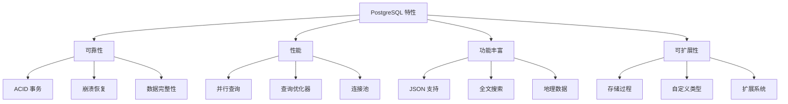

# ：PostgreSQL 16 高级特性

> **难度等级**：⭐⭐ 进阶 | **学习时长**：6小时 | **实战项目**：地理信息系统

## 📚 本章目录

- [4.1 PostgreSQL 概述](#41-postgresql-概述)
- [4.2 安装与配置](#42-安装与配置)
- [4.3 高级数据类型](#43-高级数据类型)
- [4.4 索引类型与优化](#44-索引类型与优化)
- [4.5 查询性能优化](#45-查询性能优化)
- [4.6 并发控制](#46-并发控制)
- [4.7 复制与高可用](#47-复制与高可用)
- [4.8 扩展与插件](#48-扩展与插件)

---

## PostgreSQL 概述

### 什么是 PostgreSQL？

**PostgreSQL** 是世界上最先进的开源关系型数据库：



### PostgreSQL vs MySQL

| 特性 | PostgreSQL | MySQL |
|-----|-----------|-------|
| **复杂查询** | 强 | 较弱 |
| **并发性能** | MVCC | MVCC |
| **数据完整性** | 强（外键、检查约束） | 较弱 |
| **JSON 支持** | 完整 | 基础 |
| **全文搜索** | 内置 | 基础 |
| **地理数据** | PostGIS 插件 | 需要第三方 |
| **存储过程** | PL/pgSQL | 较弱 |
| **学习曲线** | 陡 | 平缓 |

### 应用场景

- **地理信息系统 (GIS)**：地图应用、位置服务
- **数据分析**：复杂查询、报表
- **金融系统**：事务完整性要求高
- **科学计算**：数组、复杂数据类型
- **企业应用**：ERP、CRM

---

## 安装与配置

### Docker 安装

```bash
# 拉取 PostgreSQL 16 镜像
docker pull postgres:16

# 启动容器
docker run -d \
  --name postgres16 \
  -p 5432:5432 \
  -e POSTGRES_USER=postgres \
  -e POSTGRES_PASSWORD=your_password \
  -e POSTGRES_DB=mydb \
  -v /data/postgres:/var/lib/postgresql/data \
  postgres:16

# 连接数据库
docker exec -it postgres16 psql -U postgres -d mydb
```

### Linux 安装

```bash
# Ubuntu/Debian
sudo apt install postgresql-16 postgresql-contrib-16 -y

# 启动服务
sudo systemctl start postgresql
sudo systemctl enable postgresql

# 切换到 postgres 用户
sudo -i -u postgres

# 连接数据库
psql
```

### 配置文件

```ini
# /etc/postgresql/16/main/postgresql.conf

# 连接配置
listen_addresses = '*'
port = 5432
max_connections = 200

# 内存配置
shared_buffers = 256MB
effective_cache_size = 1GB
maintenance_work_mem = 64MB
work_mem = 16MB

# WAL 配置
wal_level = replica
max_wal_size = 1GB
min_wal_size = 80MB

# 查询优化
random_page_cost = 1.1
effective_io_concurrency = 200

# 日志配置
logging_collector = on
log_directory = 'log'
log_filename = 'postgresql-%Y-%m-%d_%H%M%S.log'
log_statement = 'mod'  # 记录所有修改语句
```

### 用户权限管理

```sql
-- 创建用户
CREATE USER alice WITH PASSWORD 'secure_password';

-- 创建数据库
CREATE DATABASE mydb OWNER alice;

-- 授予权限
GRANT ALL PRIVILEGES ON DATABASE mydb TO alice;

-- 连接数据库
\c mydb

-- 授予 schema 权限
GRANT ALL ON SCHEMA public TO alice;

-- 授予表权限
GRANT ALL ON ALL TABLES IN SCHEMA public TO alice;

-- 创建角色
CREATE ROLE read_only;
GRANT SELECT ON ALL TABLES IN SCHEMA public TO read_only;

-- 将角色授予用户
GRANT read_only TO alice;
```

---

## 高级数据类型

### 数组类型

```sql
-- 创建数组列
CREATE TABLE posts (
    id BIGSERIAL PRIMARY KEY,
    title VARCHAR(200),
    tags TEXT[],
    categories INT[]
);

-- 插入数组数据
INSERT INTO posts (title, tags, categories)
VALUES ('PostgreSQL入门', ARRAY['数据库', 'SQL'], ARRAY[1, 2, 3]);

-- 查询数组
SELECT title, tags FROM posts WHERE '数据库' = ANY(tags);

-- 数组函数
SELECT title, array_length(tags, 1) as tag_count FROM posts;
SELECT title, unnest(tags) as tag FROM posts;

-- 数组追加
UPDATE posts SET tags = array_append(tags, '新标签') WHERE id = 1;

-- 数组去重
UPDATE posts SET tags = array(SELECT DISTINCT unnest(tags)) WHERE id = 1;
```

### JSON/JSONB 类型

```sql
-- JSON vs JSONB
-- JSON：存储原始文本，写入快，查询慢
-- JSONB：存储二进制格式，写入慢，查询快

CREATE TABLE products (
    id BIGSERIAL PRIMARY KEY,
    name VARCHAR(200),
    attributes JSONB,
    created_at TIMESTAMP DEFAULT CURRENT_TIMESTAMP
);

-- 插入 JSON 数据
INSERT INTO products (name, attributes) VALUES
('iPhone', '{"color": "black", "storage": "256GB", "price": 7999}');

-- 查询 JSON 数据
SELECT name, attributes->>'color' as color FROM products;

-- JSON 函数
jsonb_extract_path_text(attributes, '{color}')  -- 提取值
jsonb_set(attributes, '{price}', '6999')        -- 设置值
jsonb_insert(attributes, '{weight}', '"200g"')  -- 插入值
jsonb_delete(attributes, '{storage}')           -- 删除值
jsonb_keys(attributes)                           -- 获取所有键

-- JSON 索引（GIN 索引）
CREATE INDEX idx_attributes ON products USING GIN (attributes);

-- JSON 查询优化
SELECT name FROM products WHERE attributes @> '{"color": "black"}';
SELECT name FROM products WHERE attributes ? 'storage';
SELECT name FROM products WHERE attributes ?| array['color', 'storage'];
```

### 全文搜索

```sql
-- 创建全文搜索列
CREATE TABLE articles (
    id BIGSERIAL PRIMARY KEY,
    title TEXT,
    content TEXT,
    tsv tsvector GENERATED ALWAYS AS (to_tsvector('english', title || ' ' || content)) STORED
);

-- 全文搜索查询
SELECT title, content
FROM articles
WHERE tsv @@ to_tsquery('english', 'PostgreSQL & database');

-- 创建 GIN 索引
CREATE INDEX idx_tsv ON articles USING GIN (tsv);

-- 相关性排序
SELECT title, ts_rank(tsv, query) as rank
FROM articles, to_tsquery('english', 'PostgreSQL') query
WHERE tsv @@ query
ORDER BY rank DESC;

-- 高亮关键词
SELECT title,
       ts_headline('english', content,
         to_tsquery('english', 'PostgreSQL'),
         'StartSel=<mark>, StopSel=</mark>') as highlighted
FROM articles
WHERE tsv @@ to_tsquery('english', 'PostgreSQL');
```

### UUID 类型

```sql
-- 启用 UUID 扩展
CREATE EXTENSION IF NOT EXISTS "uuid-ossp";

-- 创建 UUID 列
CREATE TABLE users (
    id UUID PRIMARY KEY DEFAULT uuid_generate_v4(),
    username VARCHAR(50),
    email VARCHAR(100)
);

-- 插入数据
INSERT INTO users (username, email) VALUES ('alice', 'alice@example.com');

-- UUID 版本
uuid_generate_v1()  -- 基于时间和MAC地址
uuid_generate_v4()  -- 随机生成
uuid_generate_v5(namespace, name)  -- 基于命名空间和名称
```

---

## 索引类型与优化

### 索引类型

```sql
-- 1. B-tree 索引（默认）
CREATE INDEX idx_username ON users(username);

-- 2. Hash 索引（等值查询）
CREATE INDEX idx_hash_email ON users USING HASH (email);

-- 3. GIN 索引（数组、JSONB、全文搜索）
CREATE INDEX idx_tags ON posts USING GIN (tags);
CREATE INDEX idx_attributes ON products USING GIN (attributes);
CREATE INDEX idx_tsv ON articles USING GIN (tsv);

-- 4. GiST 索引（地理数据、范围）
CREATE INDEX idx_location ON places USING GIST (location);

-- 5. BRIN 索引（大表，有序数据）
CREATE INDEX idx_created_at ON logs USING BRIN (created_at);

-- 6. 部分索引（只索引符合条件的行）
CREATE INDEX idx_active_users ON users (username) WHERE status = 1;

-- 7. 唯一索引
CREATE UNIQUE INDEX idx_unique_email ON users(email);

-- 8. 表达式索引
CREATE INDEX idx_lower_username ON users (LOWER(username));

-- 9. 复合索引
CREATE INDEX idx_status_created ON orders (status, created_at);

-- 10. 并发创建索引（不锁表）
CREATE INDEX CONCURRENTLY idx_email ON users(email);
```

### 索引维护

```sql
-- 查看索引大小
SELECT
    schemaname,
    tablename,
    indexname,
    pg_size_pretty(pg_relation_size(indexname::regclass)) as size
FROM pg_indexes
WHERE schemaname = 'public';

-- 查看索引使用情况
SELECT
    schemaname,
    tablename,
    indexname,
    idx_scan as index_scans,
    idx_tup_read as tuples_read,
    idx_tup_fetch as tuples_fetched
FROM pg_stat_user_indexes
ORDER BY idx_scan ASC;

-- 重建索引
REINDEX INDEX idx_username;
REINDEX TABLE users;

-- 并发重建索引
REINDEX INDEX CONCURRENTLY idx_username;

-- 删除未使用的索引
SELECT
    schemaname || '.' || tablename as table,
    indexname
FROM pg_stat_user_indexes
WHERE idx_scan = 0
  AND indexname NOT LIKE '%_pkey';
```

---

## 查询性能优化

### EXPLAIN ANALYZE

```sql
-- 执行计划分析
EXPLAIN ANALYZE
SELECT * FROM orders WHERE user_id = 1;

-- 输出说明：
-- Seq Scan: 全表扫描（慢）
-- Index Scan: 索引扫描
-- Index Only Scan: 只读索引（最快）
-- Bitmap Scan: 位图扫描
-- Hash Join: 哈希连接
-- Nested Loop: 嵌套循环连接
-- Merge Join: 归并连接

-- 详细执行计划
EXPLAIN (ANALYZE, BUFFERS, VERBOSE)
SELECT * FROM orders WHERE user_id = 1;
```

### 查询优化技巧

**1. 使用 CTE 优化复杂查询**：

```sql
-- 公用表表达式
WITH user_stats AS (
    SELECT user_id, COUNT(*) as order_count, SUM(amount) as total
    FROM orders
    GROUP BY user_id
)
SELECT u.username, us.order_count, us.total
FROM users u
JOIN user_stats us ON u.id = us.user_id
WHERE us.order_count > 10;
```

**2. 窗口函数**：

```sql
-- 排名
SELECT username, salary,
       RANK() OVER (ORDER BY salary DESC) as rank
FROM employees;

-- 分组排名
SELECT department, username, salary,
       RANK() OVER (PARTITION BY department ORDER BY salary DESC) as dept_rank
FROM employees;

-- 累计求和
SELECT username, amount, order_date,
       SUM(amount) OVER (ORDER BY order_date) as running_total
FROM orders;
```

**3. LATERAL JOIN**：

```sql
-- 关联子查询优化
SELECT u.username, o.order_count, o.total_amount
FROM users u,
LATERAL (
    SELECT COUNT(*) as order_count, SUM(amount) as total_amount
    FROM orders
    WHERE user_id = u.id
) o;
```

**4. 物化视图**：

```sql
-- 创建物化视图
CREATE MATERIALIZED VIEW mv_user_stats AS
SELECT
    u.id,
    u.username,
    COUNT(o.id) as order_count,
    COALESCE(SUM(o.amount), 0) as total_amount
FROM users u
LEFT JOIN orders o ON u.id = o.user_id
GROUP BY u.id, u.username
WITH DATA;

-- 刷新物化视图
REFRESH MATERIALIZED VIEW mv_user_stats;
REFRESH MATERIALIZED VIEW CONCURRENTLY mv_user_stats;

-- 删除物化视图
DROP MATERIALIZED VIEW mv_user_stats;
```

---

## 并发控制

### MVCC 多版本并发控制

```sql
-- 查看事务 ID
SELECT txid_current();

-- 查看行的事务信息
SELECT xmin, xmax, * FROM users;

-- 查看表的年龄（多久没 VACUUM）
SELECT relname, age(relfrozenxid) as age
FROM pg_class
WHERE relkind = 'r'
ORDER BY age DESC
LIMIT 10;
```

### 事务隔离级别

```sql
-- 查看当前隔离级别
SHOW transaction_isolation;

-- 设置隔离级别
SET TRANSACTION ISOLATION LEVEL READ UNCOMMITTED;
SET TRANSACTION ISOLATION LEVEL READ COMMITTED;  -- 默认
SET TRANSACTION ISOLATION LEVEL REPEATABLE READ;
SET TRANSACTION ISOLATION LEVEL SERIALIZABLE;

-- 行级锁
SELECT * FROM users WHERE id = 1 FOR UPDATE;      -- 排他锁
SELECT * FROM users WHERE id = 1 FOR SHARE;       -- 共享锁
SELECT * FROM users WHERE id = 1 FOR NO KEY UPDATE;  -- 不获取锁

-- 表级锁
LOCK TABLE users IN ACCESS EXCLUSIVE MODE;
```

### 乐观锁

```sql
-- 添加版本号列
CREATE TABLE products (
    id BIGSERIAL PRIMARY KEY,
    name VARCHAR(200),
    stock INT,
    version INT DEFAULT 0
);

-- 更新时检查版本号
UPDATE products
SET stock = stock - 1, version = version + 1
WHERE id = 1 AND version = 5;

-- 检查更新是否成功
IF NOT FOUND THEN
    -- 版本号冲突，处理并发冲突
END IF;
```

---

## 复制与高可用

### 流复制

**主库配置**：

```ini
# /etc/postgresql/16/main/postgresql.conf
listen_addresses = '*'
wal_level = replica
max_wal_senders = 10
wal_keep_size = 1GB
synchronous_commit = on
```

```sql
-- 创建复制用户
CREATE USER replicator WITH REPLICATION ENCRYPTED PASSWORD 'password';
```

**从库配置**：

```bash
# 停止 PostgreSQL
sudo systemctl stop postgresql

-- 清空数据目录
sudo rm -rf /var/lib/postgresql/16/main/*

# 使用 pg_basebackup 复制主库数据
sudo -u postgres pg_basebackup -h master_ip -D /var/lib/postgresql/16/main -U replicator -P

# 创建 standby.signal 文件
sudo -u postgres touch /var/lib/postgresql/16/main/standby.signal

# 配置 recovery.conf
echo "primary_conninfo = 'host=master_ip port=5432 user=replicator password=password'" | sudo -u postgres tee -a /var/lib/postgresql/16/main/postgresql.conf
echo "restore_command = 'cp /var/lib/postgresql/archive/%f %p'" | sudo -u postgres tee -a /var/lib/postgresql/16/main/postgresql.conf

# 启动从库
sudo systemctl start postgresql
```

**检查复制状态**：

```sql
-- 主库查看复制状态
SELECT client_addr, state, sync_state, replay_lag
FROM pg_stat_replication;

-- 从库查看接收状态
SELECT now() - pg_last_xact_replay_timestamp() AS replication_lag;
```

### 逻辑复制

```sql
-- 主库：创建发布
CREATE PUBLICATION my_publication FOR TABLE users, orders;

-- 从库：创建订阅
CREATE SUBSCRIPTION my_subscription
CONNECTION 'host=master_ip port=5432 dbname=mydb user=postgres password=password'
PUBLICATION my_publication;

-- 查看订阅状态
SELECT * FROM pg_stat_subscription;
```

---

## 扩展与插件

### PostGIS 地理信息

```sql
-- 启用 PostGIS
CREATE EXTENSION postgis;

-- 创建地理表
CREATE TABLE places (
    id BIGSERIAL PRIMARY KEY,
    name VARCHAR(200),
    location GEOGRAPHY(POINT, 4326)  -- WGS84 坐标系
);

-- 插入地理数据（经度, 纬度）
INSERT INTO places (name, location) VALUES
('天安门', ST_MakePoint(116.397128, 39.916527)::geography),
('故宫', ST_MakePoint(116.397477, 39.918058)::geography);

-- 地理查询
-- 查找附近 5km 的地点
SELECT name, ST_Distance(location, ST_MakePoint(116.397128, 39.916527)::geography) / 1000 as distance_km
FROM places
WHERE ST_DWithin(location, ST_MakePoint(116.397128, 39.916527)::geography, 5000)
ORDER BY distance_km;

-- 创建空间索引
CREATE INDEX idx_location ON places USING GIST (location);
```

### 其他常用扩展

```sql
-- UUID 生成
CREATE EXTENSION IF NOT EXISTS "uuid-ossp";

-- 全文搜索（中文）
CREATE EXTENSION IF NOT EXISTS zhparser;
CREATE TEXT SEARCH CONFIGURATION chinese (COPY = simple);

-- 数据库加密
CREATE EXTENSION IF NOT EXISTS pgcrypto;

SELECT encrypt('secret', 'key', 'aes');
SELECT decrypt(encrypted_data, 'key', 'aes');

-- 统计函数
CREATE EXTENSION IF NOT EXISTS tablefunc;

-- 时间序列数据
CREATE EXTENSION IF NOT EXISTS timescaledb;
```

---

## ✅ 本章小结

### 学习检查清单

完成本章学习后，请确认你能够：

- [ ] 了解 PostgreSQL 特性和优势
- [ ] 安装和配置 PostgreSQL
- [ ] 使用高级数据类型（数组、JSONB、UUID）
- [ ] 创建各种类型的索引
- [ ] 使用 EXPLAIN ANALYZE 优化查询
- [ ] 理解 MVCC 和并发控制
- [ ] 配置主从复制
- [ ] 使用 PostGIS 处理地理数据

### 核心要点回顾

1. **PostgreSQL 特性**：ACID、MVCC、丰富数据类型、可扩展
2. **高级数据类型**：数组、JSONB、UUID、全文搜索
3. **索引类型**：B-tree、Hash、GIN、GiST、BRIN
4. **查询优化**：CTE、窗口函数、物化视图
5. **复制方式**：流复制（物理）、逻辑复制

## 📚 延伸阅读

- [第3章：MySQL 8.0 完全指南 →](./chapter-03)
- [第6章：Redis 缓存设计与实战 →](./chapter-05)
- [PostgreSQL 官方文档](https://www.postgresql.org/docs/)

---

**更新时间**：2026年2月 | **版本**：v1.0
