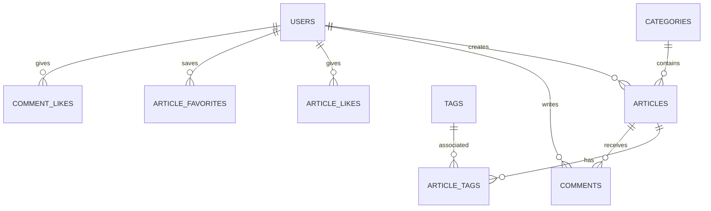

# ：实战项目1 - 个人博客数据库设计

> **难度等级**：⭐ 入门 | **学习时长**：4小时 | **实战项目**：个人博客系统

## 📚 本章目录

- [6.1 项目需求分析](#61-项目需求分析)
- [6.2 数据库设计](#62-数据库设计)
- [6.3 表结构实现](#63-表结构实现)
- [6.4 基础CRUD操作](#64-基础crud操作)
- [6.5 索引优化](#65-索引优化)
- [6.6 查询实践](#66-查询实践)
- [6.7 数据备份与恢复](#67-数据备份与恢复)
- [6.8 项目总结](#68-项目总结)

---

## 项目需求分析

### 功能需求

个人博客系统需要以下核心功能：

- **用户管理**：注册、登录、个人信息
- **文章管理**：发布、编辑、删除、查看
- **分类标签**：文章分类、标签管理
- **评论系统**：用户评论、回复
- **点赞收藏**：文章点赞、收藏功能

### 数据库选型

**MySQL 8.0** 作为主数据库：
- 成熟稳定，社区活跃
- 支持事务，保证数据一致性
- 索引优化，查询性能好
- 支持全文搜索

---

## 数据库设计

### ER图



### 表设计

```sql
-- 用户表
CREATE TABLE users (
    id BIGINT UNSIGNED AUTO_INCREMENT PRIMARY KEY,
    username VARCHAR(50) NOT NULL UNIQUE COMMENT '用户名',
    email VARCHAR(100) NOT NULL UNIQUE COMMENT '邮箱',
    password VARCHAR(255) NOT NULL COMMENT '密码（加密）',
    nickname VARCHAR(50) DEFAULT NULL COMMENT '昵称',
    avatar VARCHAR(255) DEFAULT NULL COMMENT '头像URL',
    bio TEXT DEFAULT NULL COMMENT '个人简介',
    status TINYINT DEFAULT 1 COMMENT '状态：1正常，0禁用',
    created_at DATETIME DEFAULT CURRENT_TIMESTAMP,
    updated_at DATETIME DEFAULT CURRENT_TIMESTAMP ON UPDATE CURRENT_TIMESTAMP,
    INDEX idx_email (email),
    INDEX idx_username (username)
) ENGINE=InnoDB DEFAULT CHARSET=utf8mb4 COLLATE=utf8mb4_unicode_ci COMMENT='用户表';

-- 分类表
CREATE TABLE categories (
    id BIGINT UNSIGNED AUTO_INCREMENT PRIMARY KEY,
    name VARCHAR(50) NOT NULL UNIQUE COMMENT '分类名称',
    slug VARCHAR(50) NOT NULL UNIQUE COMMENT 'URL别名',
    description TEXT DEFAULT NULL COMMENT '分类描述',
    sort_order INT DEFAULT 0 COMMENT '排序',
    created_at DATETIME DEFAULT CURRENT_TIMESTAMP,
    updated_at DATETIME DEFAULT CURRENT_TIMESTAMP ON UPDATE CURRENT_TIMESTAMP
) ENGINE=InnoDB DEFAULT CHARSET=utf8mb4 COLLATE=utf8mb4_unicode_ci COMMENT='分类表';

-- 标签表
CREATE TABLE tags (
    id BIGINT UNSIGNED AUTO_INCREMENT PRIMARY KEY,
    name VARCHAR(50) NOT NULL UNIQUE COMMENT '标签名称',
    slug VARCHAR(50) NOT NULL UNIQUE COMMENT 'URL别名',
    created_at DATETIME DEFAULT CURRENT_TIMESTAMP,
    updated_at DATETIME DEFAULT CURRENT_TIMESTAMP ON UPDATE CURRENT_TIMESTAMP
) ENGINE=InnoDB DEFAULT CHARSET=utf8mb4 COLLATE=utf8mb4_unicode_ci COMMENT='标签表';

-- 文章表
CREATE TABLE articles (
    id BIGINT UNSIGNED AUTO_INCREMENT PRIMARY KEY,
    title VARCHAR(200) NOT NULL COMMENT '标题',
    slug VARCHAR(200) NOT NULL UNIQUE COMMENT 'URL别名',
    summary VARCHAR(500) DEFAULT NULL COMMENT '摘要',
    content LONGTEXT NOT NULL COMMENT '内容',
    cover_image VARCHAR(255) DEFAULT NULL COMMENT '封面图',
    author_id BIGINT UNSIGNED NOT NULL COMMENT '作者ID',
    category_id BIGINT UNSIGNED DEFAULT NULL COMMENT '分类ID',
    status TINYINT DEFAULT 0 COMMENT '状态：0草稿，1发布，2下架',
    view_count INT UNSIGNED DEFAULT 0 COMMENT '浏览次数',
    comment_count INT UNSIGNED DEFAULT 0 COMMENT '评论数',
    like_count INT UNSIGNED DEFAULT 0 COMMENT '点赞数',
    is_top TINYINT DEFAULT 0 COMMENT '是否置顶',
    created_at DATETIME DEFAULT CURRENT_TIMESTAMP,
    updated_at DATETIME DEFAULT CURRENT_TIMESTAMP ON UPDATE CURRENT_TIMESTAMP,
    published_at DATETIME DEFAULT NULL COMMENT '发布时间',
    FOREIGN KEY (author_id) REFERENCES users(id) ON DELETE CASCADE,
    FOREIGN KEY (category_id) REFERENCES categories(id) ON DELETE SET NULL,
    INDEX idx_author (author_id),
    INDEX idx_category (category_id),
    INDEX idx_status (status),
    INDEX idx_created (created_at),
    INDEX idx_published (published_at),
    FULLTEXT INDEX ft_title_content (title, content) WITH PARSER ngram
) ENGINE=InnoDB DEFAULT CHARSET=utf8mb4 COLLATE=utf8mb4_unicode_ci COMMENT='文章表';

-- 文章标签关联表
CREATE TABLE article_tags (
    id BIGINT UNSIGNED AUTO_INCREMENT PRIMARY KEY,
    article_id BIGINT UNSIGNED NOT NULL COMMENT '文章ID',
    tag_id BIGINT UNSIGNED NOT NULL COMMENT '标签ID',
    created_at DATETIME DEFAULT CURRENT_TIMESTAMP,
    FOREIGN KEY (article_id) REFERENCES articles(id) ON DELETE CASCADE,
    FOREIGN KEY (tag_id) REFERENCES tags(id) ON DELETE CASCADE,
    UNIQUE KEY uk_article_tag (article_id, tag_id),
    INDEX idx_tag (tag_id)
) ENGINE=InnoDB DEFAULT CHARSET=utf8mb4 COLLATE=utf8mb4_unicode_ci COMMENT='文章标签关联表';

-- 评论表
CREATE TABLE comments (
    id BIGINT UNSIGNED AUTO_INCREMENT PRIMARY KEY,
    article_id BIGINT UNSIGNED NOT NULL COMMENT '文章ID',
    user_id BIGINT UNSIGNED NOT NULL COMMENT '评论用户ID',
    parent_id BIGINT UNSIGNED DEFAULT NULL COMMENT '父评论ID',
    content TEXT NOT NULL COMMENT '评论内容',
    like_count INT UNSIGNED DEFAULT 0 COMMENT '点赞数',
    status TINYINT DEFAULT 1 COMMENT '状态：1正常，0隐藏',
    created_at DATETIME DEFAULT CURRENT_TIMESTAMP,
    updated_at DATETIME DEFAULT CURRENT_TIMESTAMP ON UPDATE CURRENT_TIMESTAMP,
    FOREIGN KEY (article_id) REFERENCES articles(id) ON DELETE CASCADE,
    FOREIGN KEY (user_id) REFERENCES users(id) ON DELETE CASCADE,
    FOREIGN KEY (parent_id) REFERENCES comments(id) ON DELETE CASCADE,
    INDEX idx_article (article_id),
    INDEX idx_user (user_id),
    INDEX idx_parent (parent_id),
    INDEX idx_created (created_at)
) ENGINE=InnoDB DEFAULT CHARSET=utf8mb4 COLLATE=utf8mb4_unicode_ci COMMENT='评论表';

-- 文章点赞表
CREATE TABLE article_likes (
    id BIGINT UNSIGNED AUTO_INCREMENT PRIMARY KEY,
    article_id BIGINT UNSIGNED NOT NULL COMMENT '文章ID',
    user_id BIGINT UNSIGNED NOT NULL COMMENT '用户ID',
    created_at DATETIME DEFAULT CURRENT_TIMESTAMP,
    FOREIGN KEY (article_id) REFERENCES articles(id) ON DELETE CASCADE,
    FOREIGN KEY (user_id) REFERENCES users(id) ON DELETE CASCADE,
    UNIQUE KEY uk_article_user (article_id, user_id),
    INDEX idx_user (user_id)
) ENGINE=InnoDB DEFAULT CHARSET=utf8mb4 COLLATE=utf8mb4_unicode_ci COMMENT='文章点赞表';

-- 文章收藏表
CREATE TABLE article_favorites (
    id BIGINT UNSIGNED AUTO_INCREMENT PRIMARY KEY,
    article_id BIGINT UNSIGNED NOT NULL COMMENT '文章ID',
    user_id BIGINT UNSIGNED NOT NULL COMMENT '用户ID',
    created_at DATETIME DEFAULT CURRENT_TIMESTAMP,
    FOREIGN KEY (article_id) REFERENCES articles(id) ON DELETE CASCADE,
    FOREIGN KEY (user_id) REFERENCES users(id) ON DELETE CASCADE,
    UNIQUE KEY uk_article_user (article_id, user_id),
    INDEX idx_user (user_id)
) ENGINE=InnoDB DEFAULT CHARSET=utf8mb4 COLLATE=utf8mb4_unicode_ci COMMENT='文章收藏表';

-- 评论点赞表
CREATE TABLE comment_likes (
    id BIGINT UNSIGNED AUTO_INCREMENT PRIMARY KEY,
    comment_id BIGINT UNSIGNED NOT NULL COMMENT '评论ID',
    user_id BIGINT UNSIGNED NOT NULL COMMENT '用户ID',
    created_at DATETIME DEFAULT CURRENT_TIMESTAMP,
    FOREIGN KEY (comment_id) REFERENCES comments(id) ON DELETE CASCADE,
    FOREIGN KEY (user_id) REFERENCES users(id) ON DELETE CASCADE,
    UNIQUE KEY uk_comment_user (comment_id, user_id),
    INDEX idx_user (user_id)
) ENGINE=InnoDB DEFAULT CHARSET=utf8mb4 COLLATE=utf8mb4_unicode_ci COMMENT='评论点赞表';
```

---

## 表结构实现

### 创建数据库

```sql
-- 创建数据库
CREATE DATABASE blog_db
CHARACTER SET utf8mb4
COLLATE utf8mb4_unicode_ci;

-- 使用数据库
USE blog_db;
```

### 数据规范化

本项目遵循 **第三范式（3NF）**：

1. **第一范式（1NF）**：所有字段都是原子值
2. **第二范式（2NF）**：消除部分依赖
3. **第三范式（3NF）**：消除传递依赖

**优点**：
- 减少数据冗余
- 避免更新异常
- 保证数据一致性

---

## 基础CRUD操作

### 用户注册

```sql
-- 插入用户（密码应该使用应用层加密）
INSERT INTO users (username, email, password, nickname)
VALUES ('zhangsan', 'zhangsan@example.com', '$2a$10$encrypted...', '张三');
```

### 发布文章

```sql
-- 发布文章
INSERT INTO articles (title, slug, summary, content, author_id, category_id, status, published_at)
VALUES ('MySQL 8.0 新特性详解',
        'mysql-8-new-features',
        'MySQL 8.0 带来了许多新特性...',
        '<p>详细内容...</p>',
        1,
        1,
        1,
        NOW());

-- 添加标签关联
INSERT INTO article_tags (article_id, tag_id)
VALUES
    (LAST_INSERT_ID(), 1),  -- MySQL
    (LAST_INSERT_ID(), 2);  -- 数据库
```

### 查询文章列表

```sql
-- 查询文章列表（带作者和分类）
SELECT
    a.id,
    a.title,
    a.summary,
    a.cover_image,
    a.view_count,
    a.like_count,
    a.comment_count,
    a.created_at,
    u.username AS author_name,
    u.avatar AS author_avatar,
    c.name AS category_name
FROM articles a
INNER JOIN users u ON a.author_id = u.id
LEFT JOIN categories c ON a.category_id = c.id
WHERE a.status = 1
ORDER BY a.is_top DESC, a.created_at DESC
LIMIT 10;
```

### 文章详情

```sql
-- 查询文章详情（含标签）
SELECT
    a.*,
    u.username AS author_name,
    u.avatar AS author_avatar,
    u.bio AS author_bio,
    c.name AS category_name
FROM articles a
INNER JOIN users u ON a.author_id = u.id
LEFT JOIN categories c ON a.category_id = c.id
WHERE a.id = 1;

-- 查询文章标签
SELECT t.id, t.name, t.slug
FROM tags t
INNER JOIN article_tags at ON t.id = at.tag_id
WHERE at.article_id = 1;
```

### 发表评论

```sql
-- 发表评论
INSERT INTO comments (article_id, user_id, parent_id, content)
VALUES (1, 2, NULL, '很好的文章！');

-- 更新文章评论数
UPDATE articles
SET comment_count = comment_count + 1
WHERE id = 1;
```

### 文章点赞

```sql
-- 点赞（使用 INSERT IGNORE 避免重复）
INSERT IGNORE INTO article_likes (article_id, user_id)
VALUES (1, 2);

-- 更新点赞数
UPDATE articles
SET like_count = (SELECT COUNT(*) FROM article_likes WHERE article_id = 1)
WHERE id = 1;

-- 取消点赞
DELETE FROM article_likes WHERE article_id = 1 AND user_id = 2;
```

---

## 索引优化

### 常用查询场景分析

1. **用户登录**：通过 email 或 username 查询
2. **文章列表**：按 status、created_at 排序
3. **文章详情**：按 id、slug 查询
4. **分类文章**：按 category_id 查询
5. **作者文章**：按 author_id 查询
6. **全文搜索**：按 title、content 搜索

### 索引使用策略

```sql
-- 1. 主键索引（自动创建）
PRIMARY KEY (id)

-- 2. 唯一索引（保证唯一性）
UNIQUE KEY uk_email (email)
UNIQUE KEY uk_username (username)

-- 3. 普通索引（加速查询）
INDEX idx_category (category_id)
INDEX idx_author (author_id)
INDEX idx_status (status)

-- 4. 复合索引（覆盖多条件查询）
INDEX idx_status_created (status, created_at)

-- 5. 全文索引（支持中文分词）
FULLTEXT INDEX ft_title_content (title, content) WITH PARSER ngram
```

### 查询优化示例

```sql
-- ❌ 全表扫描
SELECT * FROM articles WHERE content LIKE '%MySQL%';

-- ✅ 使用全文索引
SELECT
    id,
    title,
    summary,
    MATCH(title, content) AGAINST('MySQL 8.0 新特性' IN NATURAL LANGUAGE MODE) AS score
FROM articles
WHERE MATCH(title, content) AGAINST('MySQL 8.0 新特性' IN NATURAL LANGUAGE MODE)
ORDER BY score DESC
LIMIT 10;
```

---

## 查询实践

### 首页文章列表

```sql
-- 首页文章列表（分页）
SELECT
    a.id,
    a.title,
    a.summary,
    a.cover_image,
    a.view_count,
    a.like_count,
    a.comment_count,
    a.created_at,
    u.username AS author_name,
    u.avatar AS author_avatar,
    c.name AS category_name,
    GROUP_CONCAT(t.name) AS tags
FROM articles a
INNER JOIN users u ON a.author_id = u.id
LEFT JOIN categories c ON a.category_id = c.id
LEFT JOIN article_tags at ON a.id = at.article_id
LEFT JOIN tags t ON at.tag_id = t.id
WHERE a.status = 1
GROUP BY a.id
ORDER BY a.is_top DESC, a.created_at DESC
LIMIT 10 OFFSET 0;
```

### 分类文章列表

```sql
-- 某分类下的文章
SELECT
    a.*,
    u.username AS author_name
FROM articles a
INNER JOIN users u ON a.author_id = u.id
WHERE a.category_id = 1 AND a.status = 1
ORDER BY a.created_at DESC
LIMIT 10;
```

### 标签文章列表

```sql
-- 某标签下的文章
SELECT DISTINCT
    a.*,
    u.username AS author_name
FROM articles a
INNER JOIN users u ON a.author_id = u.id
INNER JOIN article_tags at ON a.id = at.article_id
WHERE at.tag_id = 1 AND a.status = 1
ORDER BY a.created_at DESC
LIMIT 10;
```

### 热门文章

```sql
-- 按浏览量排行
SELECT
    a.id,
    a.title,
    a.summary,
    a.view_count,
    a.like_count,
    u.username AS author_name
FROM articles a
INNER JOIN users u ON a.author_id = u.id
WHERE a.status = 1
ORDER BY a.view_count DESC
LIMIT 10;
```

### 评论列表（含树形结构）

```sql
-- 查询文章的所有评论
SELECT
    c.id,
    c.content,
    c.like_count,
    c.created_at,
    u.username,
    u.avatar,
    p.content AS parent_content
FROM comments c
INNER JOIN users u ON c.user_id = u.id
LEFT JOIN comments p ON c.parent_id = p.id
WHERE c.article_id = 1 AND c.status = 1
ORDER BY c.created_at ASC;
```

### 文章归档

```sql
-- 按月份归档
SELECT
    DATE_FORMAT(created_at, '%Y年%m月') AS month,
    COUNT(*) AS count
FROM articles
WHERE status = 1
GROUP BY month
ORDER BY month DESC;
```

---

## 数据备份与恢复

### 数据备份

```bash
# 备份整个数据库
mysqldump -u root -p blog_db > blog_backup_$(date +%Y%m%d).sql

# 备份特定表
mysqldump -u root -p blog_db articles users > tables_backup.sql

# 压缩备份
mysqldump -u root -p blog_db | gzip > blog_backup_$(date +%Y%m%d).sql.gz
```

### 数据恢复

```bash
# 恢复数据库
mysql -u root -p blog_db < blog_backup_20240101.sql

# 从压缩文件恢复
gunzip < blog_backup_20240101.sql.gz | mysql -u root -p blog_db
```

### 定期备份脚本

```bash
#!/bin/bash
# backup.sh

BACKUP_DIR="/data/backups/mysql"
DATE=$(date +%Y%m%d_%H%M%S)
DB_NAME="blog_db"

# 创建备份目录
mkdir -p $BACKUP_DIR

# 备份数据库
mysqldump -u root -p$MYSQL_ROOT_PASSWORD $DB_NAME | gzip > $BACKUP_DIR/blog_$DATE.sql.gz

# 删除30天前的备份
find $BACKUP_DIR -name "blog_*.sql.gz" -mtime +30 -delete

echo "Backup completed: blog_$DATE.sql.gz"
```

---

## 项目总结

### 学习收获

完成本章后，你掌握了：

1. **数据库设计**：
   - 需求分析方法
   - ER图设计
   - 表结构设计规范
   - 三范式应用

2. **SQL基础**：
   - DDL：CREATE TABLE
   - DML：INSERT、UPDATE、DELETE
   - DQL：SELECT 查询
   - 多表关联查询

3. **索引优化**：
   - 索引类型选择
   - 复合索引设计
   - 全文索引应用

4. **数据管理**：
   - 备份与恢复
   - 外键约束
   - 数据一致性

### 核心要点

1. **设计原则**：遵循第三范式，减少冗余
2. **索引策略**：根据查询场景设计索引
3. **查询优化**：避免全表扫描，使用覆盖索引
4. **数据安全**：定期备份，设置外键约束

### 下一步

- [ ] 第8章：MySQL 8.0+ 新特性深度解析 →
- [ ] 第9章：PostgreSQL 16+ 高级特性 →

---

**更新时间**：2026年2月 | **版本**：v1.0
