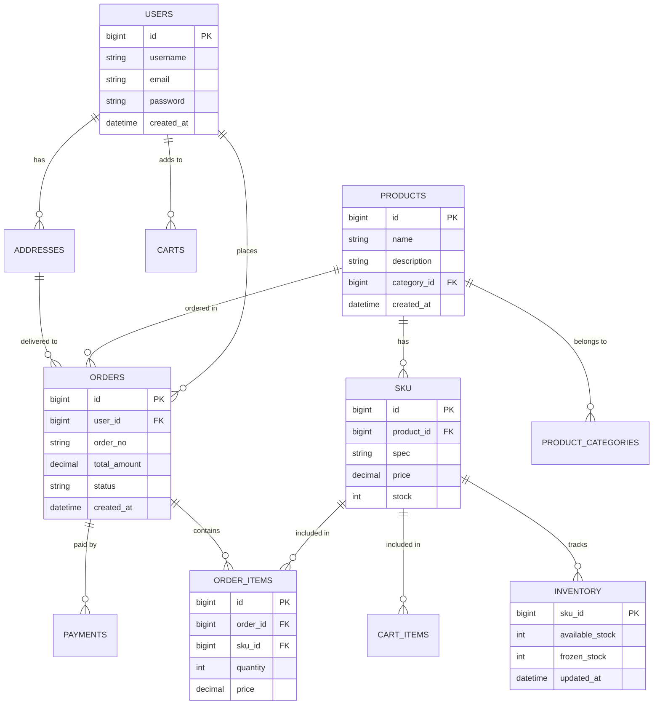

# ：实战项目2 - 电商数据库设计

> **难度等级**：⭐⭐⭐⭐ 高级 | **学习时长**：16小时 | **实战项目**：完整电商系统数据库设计

## 📚 本章目录

- [12.1 项目需求分析](#121-项目需求分析)
- [12.2 数据库设计](#122-数据库设计)
- [12.3 核心表结构](#123-核心表结构)
- [12.4 事务处理](#124-事务处理)
- [12.5 缓存设计](#125-缓存设计)
- [12.6 读写分离实现](#126-读写分离实现)
- [12.7 性能优化](#127-性能优化)
- [12.8 项目部署](#128-项目部署)

---

## 项目需求分析

### 业务背景

设计一个**中型电商平台**的数据库系统，支持以下功能：

```
核心功能：
  1. 用户管理
     ├─ 注册/登录
     ├─ 个人信息
     └─ 收货地址

  2. 商品管理
     ├─ 商品分类
     ├─ 商品信息（SKU/SPU）
     ├─ 库存管理
     └─ 价格管理

  3. 订单管理
     ├─ 下单流程
     ├─ 订单支付
     ├─ 订单状态流转
     └─ 订单查询

  4. 购物车
     ├─ 添加商品
     ├─ 修改数量
     └─ 购物车结算

  5. 营销系统
     ├─ 优惠券
     ├─ 满减活动
     └─ 秒杀活动

  6. 数据统计
     ├─ 销售统计
     ├─ 用户行为分析
     └─ 报表查询
```

### 非功能需求

| 需求 | 说明 | 指标 |
|-----|------|-----|
| **并发量** | 支持10000+ TPS | 峰值10万 |
| **数据量** | 商品1000万+，订单1亿+ | 年增50% |
| **可用性** | 99.99% | 年停机<1小时 |
| **延迟** | 查询<100ms，下单<500ms | P99 |
| **一致性** | 库存不超卖、金额不丢失 | 强一致 |

### 技术栈选择

```
数据库选型：
  主数据库：MySQL 8.0
    - 成熟稳定、生态完善
    - 支持事务、适合电商场景

  从数据库：MySQL 8.0（多个）
    - 读写分离
    - 负载均衡

  缓存：Redis 7.x
    - 热点数据缓存
    - 分布式锁
    - 计数器

  搜索：Elasticsearch
    - 商品搜索
    - 日志分析

  消息队列：RabbitMQ
    - 异步处理
    - 削峰填谷
```

---

## 数据库设计

### ER 图



### 分库分表设计

```
数据库分库：
  user_db      - 用户相关表
  product_db   - 商品相关表
  order_db     - 订单相关表
  payment_db   - 支付相关表
  marketing_db - 营销相关表

表分表策略：
  1. 水平分表（订单表）
     - 按 user_id 取模分表
     - order_0, order_1, ..., order_15（16张表）
     - 路由：table = order_{user_id % 16}

  2. 时间分区（订单表）
     - 按创建时间分区
     - 按月分区：orders_202401, orders_202402, ...
     - 归档策略：6个月前数据归档

  3. 垂直分表（商品表）
     - 商品基础表：products
     - 商品详情表：product_details
     - 商品扩展表：product_ext
```

---

## 核心表结构

### 用户模块

```sql
-- 用户表
CREATE TABLE users (
    id BIGINT UNSIGNED NOT NULL AUTO_INCREMENT COMMENT '用户ID',
    username VARCHAR(50) NOT NULL COMMENT '用户名',
    password VARCHAR(255) NOT NULL COMMENT '密码（bcrypt）',
    email VARCHAR(100) NOT NULL COMMENT '邮箱',
    mobile VARCHAR(20) COMMENT '手机号',
    nickname VARCHAR(50) COMMENT '昵称',
    avatar VARCHAR(500) COMMENT '头像URL',
    status TINYINT NOT NULL DEFAULT 1 COMMENT '状态：1正常，0禁用',
    register_ip VARCHAR(50) COMMENT '注册IP',
    last_login_at TIMESTAMP NULL COMMENT '最后登录时间',
    last_login_ip VARCHAR(50) COMMENT '最后登录IP',
    created_at TIMESTAMP DEFAULT CURRENT_TIMESTAMP COMMENT '创建时间',
    updated_at TIMESTAMP DEFAULT CURRENT_TIMESTAMP ON UPDATE CURRENT_TIMESTAMP COMMENT '更新时间',

    PRIMARY KEY (id),
    UNIQUE KEY uk_username (username),
    UNIQUE KEY uk_email (email),
    UNIQUE KEY uk_mobile (mobile),
    KEY idx_status (status),
    KEY idx_created_at (created_at)
) ENGINE=InnoDB DEFAULT CHARSET=utf8mb4 COMMENT='用户表';

-- 收货地址表
CREATE TABLE user_addresses (
    id BIGINT UNSIGNED NOT NULL AUTO_INCREMENT COMMENT '地址ID',
    user_id BIGINT UNSIGNED NOT NULL COMMENT '用户ID',
    consignee VARCHAR(50) NOT NULL COMMENT '收货人',
    mobile VARCHAR(20) NOT NULL COMMENT '手机号',
    province VARCHAR(50) NOT NULL COMMENT '省',
    city VARCHAR(50) NOT NULL COMMENT '市',
    district VARCHAR(50) NOT NULL COMMENT '区',
    detail_address VARCHAR(200) NOT NULL COMMENT '详细地址',
    postal_code VARCHAR(10) COMMENT '邮编',
    is_default TINYINT NOT NULL DEFAULT 0 COMMENT '是否默认：1是，0否',
    created_at TIMESTAMP DEFAULT CURRENT_TIMESTAMP COMMENT '创建时间',
    updated_at TIMESTAMP DEFAULT CURRENT_TIMESTAMP ON UPDATE CURRENT_TIMESTAMP COMMENT '更新时间',

    PRIMARY KEY (id),
    KEY idx_user_id (user_id)
) ENGINE=InnoDB DEFAULT CHARSET=utf8mb4 COMMENT='收货地址表';
```

### 商品模块

```sql
-- 商品分类表
CREATE TABLE categories (
    id BIGINT UNSIGNED NOT NULL AUTO_INCREMENT COMMENT '分类ID',
    parent_id BIGINT UNSIGNED NOT NULL DEFAULT 0 COMMENT '父分类ID',
    name VARCHAR(100) NOT NULL COMMENT '分类名称',
    icon VARCHAR(500) COMMENT '图标URL',
    level TINYINT NOT NULL COMMENT '层级：1一级，2二级，3三级',
    sort_order INT NOT NULL DEFAULT 0 COMMENT '排序',
    status TINYINT NOT NULL DEFAULT 1 COMMENT '状态：1启用，0禁用',
    created_at TIMESTAMP DEFAULT CURRENT_TIMESTAMP COMMENT '创建时间',
    updated_at TIMESTAMP DEFAULT CURRENT_TIMESTAMP ON UPDATE CURRENT_TIMESTAMP COMMENT '更新时间',

    PRIMARY KEY (id),
    KEY idx_parent_id (parent_id),
    KEY idx_level (level)
) ENGINE=InnoDB DEFAULT CHARSET=utf8mb4 COMMENT='商品分类表';

-- 商品SPU表（标准化产品）
CREATE TABLE products (
    id BIGINT UNSIGNED NOT NULL AUTO_INCREMENT COMMENT '商品ID',
    category_id BIGINT UNSIGNED NOT NULL COMMENT '分类ID',
    brand_id BIGINT UNSIGNED COMMENT '品牌ID',
    name VARCHAR(200) NOT NULL COMMENT '商品名称',
    sub_title VARCHAR(200) COMMENT '副标题',
    description TEXT COMMENT '商品描述',
    detail HTML TEXT COMMENT '商品详情（富文本）',
    main_image VARCHAR(500) COMMENT '主图',
    images JSON COMMENT '图片列表（JSON数组）',
    video VARCHAR(500) COMMENT '视频URL',
    unit VARCHAR(20) COMMENT '单位（件、盒、箱）',
    status TINYINT NOT NULL DEFAULT 1 COMMENT '状态：1上架，0下架',
    sort_order INT NOT NULL DEFAULT 0 COMMENT '排序',
    created_at TIMESTAMP DEFAULT CURRENT_TIMESTAMP COMMENT '创建时间',
    updated_at TIMESTAMP DEFAULT CURRENT_TIMESTAMP ON UPDATE CURRENT_TIMESTAMP COMMENT '更新时间',

    PRIMARY KEY (id),
    KEY idx_category_id (category_id),
    KEY idx_brand_id (brand_id),
    KEY idx_status (status),
    FULLTEXT KEY ft_name_description (name, description) WITH PARSER ngram
) ENGINE=InnoDB DEFAULT CHARSET=utf8mb4 COMMENT='商品SPU表';

-- 商品SKU表（库存单位）
CREATE TABLE skus (
    id BIGINT UNSIGNED NOT NULL AUTO_INCREMENT COMMENT 'SKU ID',
    product_id BIGINT UNSIGNED NOT NULL COMMENT '商品ID',
    sku_code VARCHAR(50) NOT NULL COMMENT 'SKU编码',
    spec JSON COMMENT '规格（JSON：{"颜色":"红色","尺寸":"XL"}）',
    price DECIMAL(10,2) NOT NULL COMMENT '销售价',
    original_price DECIMAL(10,2) COMMENT '原价',
    cost_price DECIMAL(10,2) COMMENT '成本价',
    stock INT NOT NULL DEFAULT 0 COMMENT '库存',
    sales INT NOT NULL DEFAULT 0 COMMENT '销量',
    image VARCHAR(500) COMMENT 'SKU图片',
    status TINYINT NOT NULL DEFAULT 1 COMMENT '状态：1上架，0下架',
    created_at TIMESTAMP DEFAULT CURRENT_TIMESTAMP COMMENT '创建时间',
    updated_at TIMESTAMP DEFAULT CURRENT_TIMESTAMP ON UPDATE CURRENT_TIMESTAMP COMMENT '更新时间',

    PRIMARY KEY (id),
    UNIQUE KEY uk_sku_code (sku_code),
    KEY idx_product_id (product_id)
) ENGINE=InnoDB DEFAULT CHARSET=utf8mb4 COMMENT='商品SKU表';

-- 库存表（独立管理）
CREATE TABLE inventory (
    id BIGINT UNSIGNED NOT NULL AUTO_INCREMENT COMMENT 'ID',
    sku_id BIGINT UNSIGNED NOT NULL COMMENT 'SKU ID',
    warehouse_id BIGINT UNSIGNED NOT NULL COMMENT '仓库ID',
    available_stock INT NOT NULL DEFAULT 0 COMMENT '可用库存',
    frozen_stock INT NOT NULL DEFAULT 0 COMMENT '冻结库存',
    total_stock INT NOT NULL DEFAULT 0 COMMENT '总库存',
    version INT NOT NULL DEFAULT 0 COMMENT '乐观锁版本号',
    created_at TIMESTAMP DEFAULT CURRENT_TIMESTAMP COMMENT '创建时间',
    updated_at TIMESTAMP DEFAULT CURRENT_TIMESTAMP ON UPDATE CURRENT_TIMESTAMP COMMENT '更新时间',

    PRIMARY KEY (id),
    UNIQUE KEY uk_sku_warehouse (sku_id, warehouse_id),
    KEY idx_warehouse_id (warehouse_id)
) ENGINE=InnoDB DEFAULT CHARSET=utf8mb4 COMMENT='库存表';
```

### 订单模块

```sql
-- 订单表（分表）
CREATE TABLE orders_0 (
    id BIGINT UNSIGNED NOT NULL AUTO_INCREMENT COMMENT '订单ID',
    order_no VARCHAR(50) NOT NULL COMMENT '订单号',
    user_id BIGINT UNSIGNED NOT NULL COMMENT '用户ID',
    total_amount DECIMAL(10,2) NOT NULL COMMENT '订单总金额',
    discount_amount DECIMAL(10,2) NOT NULL DEFAULT 0 COMMENT '优惠金额',
    freight_amount DECIMAL(10,2) NOT NULL DEFAULT 0 COMMENT '运费',
    payable_amount DECIMAL(10,2) NOT NULL COMMENT '应付金额',
    status TINYINT NOT NULL DEFAULT 1 COMMENT '状态：1待支付，2待发货，3待收货，4已完成，5已取消',
    payment_status TINYINT NOT NULL DEFAULT 0 COMMENT '支付状态：0未支付，1已支付',
    payment_time TIMESTAMP NULL COMMENT '支付时间',
    shipment_time TIMESTAMP NULL COMMENT '发货时间',
    receipt_time TIMESTAMP NULL COMMENT '收货时间',

    -- 收货信息（冗余，避免关联查询）
    consignee VARCHAR(50) NOT NULL COMMENT '收货人',
    mobile VARCHAR(20) NOT NULL COMMENT '手机号',
    province VARCHAR(50) NOT NULL COMMENT '省',
    city VARCHAR(50) NOT NULL COMMENT '市',
    district VARCHAR(50) NOT NULL COMMENT '区',
    detail_address VARCHAR(200) NOT NULL COMMENT '详细地址',

    -- 备注
    user_remark VARCHAR(500) COMMENT '用户备注',
    admin_remark VARCHAR(500) COMMENT '管理员备注',

    created_at TIMESTAMP DEFAULT CURRENT_TIMESTAMP COMMENT '创建时间',
    updated_at TIMESTAMP DEFAULT CURRENT_TIMESTAMP ON UPDATE CURRENT_TIMESTAMP COMMENT '更新时间',

    PRIMARY KEY (id),
    UNIQUE KEY uk_order_no (order_no),
    KEY idx_user_id (user_id),
    KEY idx_status (status),
    KEY idx_created_at (created_at)
) ENGINE=InnoDB DEFAULT CHARSET=utf8mb4 COMMENT='订单表';

-- 订单商品明细表
CREATE TABLE order_items_0 (
    id BIGINT UNSIGNED NOT NULL AUTO_INCREMENT COMMENT '明细ID',
    order_id BIGINT UNSIGNED NOT NULL COMMENT '订单ID',
    user_id BIGINT UNSIGNED NOT NULL COMMENT '用户ID',
    product_id BIGINT UNSIGNED NOT NULL COMMENT '商品ID',
    sku_id BIGINT UNSIGNED NOT NULL COMMENT 'SKU ID',
    sku_name VARCHAR(200) NOT NULL COMMENT 'SKU名称（冗余）',
    sku_spec JSON COMMENT 'SKU规格（冗余）',
    sku_image VARCHAR(500) COMMENT 'SKU图片（冗余）',
    price DECIMAL(10,2) NOT NULL COMMENT '单价',
    quantity INT NOT NULL COMMENT '数量',
    total_amount DECIMAL(10,2) NOT NULL COMMENT '小计金额',

    created_at TIMESTAMP DEFAULT CURRENT_TIMESTAMP COMMENT '创建时间',

    PRIMARY KEY (id),
    KEY idx_order_id (order_id),
    KEY idx_user_id (user_id)
) ENGINE=InnoDB DEFAULT CHARSET=utf8mb4 COMMENT='订单商品明细表';

-- 购物车表
CREATE TABLE cart_items (
    id BIGINT UNSIGNED NOT NULL AUTO_INCREMENT COMMENT 'ID',
    user_id BIGINT UNSIGNED NOT NULL COMMENT '用户ID',
    sku_id BIGINT UNSIGNED NOT NULL COMMENT 'SKU ID',
    quantity INT NOT NULL COMMENT '数量',
    is_checked TINYINT NOT NULL DEFAULT 1 COMMENT '是否选中：1是，0否',
    created_at TIMESTAMP DEFAULT CURRENT_TIMESTAMP COMMENT '创建时间',
    updated_at TIMESTAMP DEFAULT CURRENT_TIMESTAMP ON UPDATE CURRENT_TIMESTAMP COMMENT '更新时间',

    PRIMARY KEY (id),
    UNIQUE KEY uk_user_sku (user_id, sku_id),
    KEY idx_user_id (user_id)
) ENGINE=InnoDB DEFAULT CHARSET=utf8mb4 COMMENT='购物车表';
```

### 营销模块

```sql
-- 优惠券表
CREATE TABLE coupons (
    id BIGINT UNSIGNED NOT NULL AUTO_INCREMENT COMMENT '优惠券ID',
    name VARCHAR(100) NOT NULL COMMENT '优惠券名称',
    type TINYINT NOT NULL COMMENT '类型：1满减券，2折扣券，3无门槛券',
    discount_type TINYINT NOT NULL COMMENT '优惠类型：1金额，2折扣',
    discount_value DECIMAL(10,2) NOT NULL COMMENT '优惠值',
    min_amount DECIMAL(10,2) NOT NULL DEFAULT 0 COMMENT '最小使用金额',
    max_discount DECIMAL(10,2) COMMENT '最大优惠金额',
    total_count INT NOT NULL COMMENT '发行总量',
    received_count INT NOT NULL DEFAULT 0 COMMENT '已领取数量',
    used_count INT NOT NULL DEFAULT 0 COMMENT '已使用数量',
    per_user_limit INT NOT NULL DEFAULT 1 COMMENT '每人限领',
    valid_days INT NOT NULL COMMENT '有效天数',
    start_time TIMESTAMP NULL COMMENT '开始时间',
    end_time TIMESTAMP NULL COMMENT '结束时间',
    status TINYINT NOT NULL DEFAULT 1 COMMENT '状态：1启用，0禁用',
    created_at TIMESTAMP DEFAULT CURRENT_TIMESTAMP COMMENT '创建时间',
    updated_at TIMESTAMP DEFAULT CURRENT_TIMESTAMP ON UPDATE CURRENT_TIMESTAMP COMMENT '更新时间',

    PRIMARY KEY (id),
    KEY idx_type (type),
    KEY idx_status (status),
    KEY idx_time (start_time, end_time)
) ENGINE=InnoDB DEFAULT CHARSET=utf8mb4 COMMENT='优惠券表';

-- 用户优惠券表
CREATE TABLE user_coupons (
    id BIGINT UNSIGNED NOT NULL AUTO_INCREMENT COMMENT 'ID',
    user_id BIGINT UNSIGNED NOT NULL COMMENT '用户ID',
    coupon_id BIGINT UNSIGNED NOT NULL COMMENT '优惠券ID',
    coupon_name VARCHAR(100) NOT NULL COMMENT '优惠券名称（冗余）',
    status TINYINT NOT NULL DEFAULT 1 COMMENT '状态：1未使用，2已使用，3已过期',
    order_id BIGINT UNSIGNED COMMENT '使用订单ID',
    receive_time TIMESTAMP DEFAULT CURRENT_TIMESTAMP COMMENT '领取时间',
    use_time TIMESTAMP NULL COMMENT '使用时间',
    expire_time TIMESTAMP NOT NULL COMMENT '过期时间',

    PRIMARY KEY (id),
    KEY idx_user_id (user_id),
    KEY idx_coupon_id (coupon_id),
    KEY idx_status (status),
    KEY idx_expire_time (expire_time)
) ENGINE=InnoDB DEFAULT CHARSET=utf8mb4 COMMENT='用户优惠券表';

-- 秒杀活动表
CREATE TABLE seckill_activities (
    id BIGINT UNSIGNED NOT NULL AUTO_INCREMENT COMMENT '活动ID',
    name VARCHAR(100) NOT NULL COMMENT '活动名称',
    sku_id BIGINT UNSIGNED NOT NULL COMMENT 'SKU ID',
    seckill_price DECIMAL(10,2) NOT NULL COMMENT '秒杀价',
    stock INT NOT NULL COMMENT '秒杀库存',
    limit_per_user INT NOT NULL DEFAULT 1 COMMENT '每人限购',
    start_time TIMESTAMP NOT NULL COMMENT '开始时间',
    end_time TIMESTAMP NOT NULL COMMENT '结束时间',
    status TINYINT NOT NULL DEFAULT 1 COMMENT '状态：1未开始，2进行中，3已结束',
    created_at TIMESTAMP DEFAULT CURRENT_TIMESTAMP COMMENT '创建时间',
    updated_at TIMESTAMP DEFAULT CURRENT_TIMESTAMP ON UPDATE CURRENT_TIMESTAMP COMMENT '更新时间',

    PRIMARY KEY (id),
    KEY idx_sku_id (sku_id),
    KEY idx_time (start_time, end_time),
    KEY idx_status (status)
) ENGINE=InnoDB DEFAULT CHARSET=utf8mb4 COMMENT='秒杀活动表';
```

---

## 事务处理

### 下单事务

```python
import mysql.connector
from mysql.connector import pooling
from redis import Redis

class OrderService:
    def __init__(self):
        # 连接池
        self.db_pool = pooling.MySQLConnectionPool(
            pool_name="order_pool",
            pool_size=20,
            host="192.168.1.10",
            port=3306,
            user="root",
            password="Root@2024",
            database="order_db"
        )

        # Redis
        self.redis = Redis(host="192.168.1.20", port=6379, decode_responses=True)

    def create_order(self, user_id, address_id, cart_items, coupon_id=None):
        """创建订单"""
        conn = self.db_pool.get_connection()

        try:
            # 开始事务
            conn.start_transaction()

            cursor = conn.cursor(dictionary=True)

            # 1. 查询收货地址
            cursor.execute("""
                SELECT * FROM user_addresses
                WHERE id = %s AND user_id = %s
            """, (address_id, user_id))

            address = cursor.fetchone()
            if not address:
                raise Exception("收货地址不存在")

            # 2. 锁定购物车商品（Redis + 数据库）
            sku_ids = [item['sku_id'] for item in cart_items]

            # Redis 预扣减库存（原子操作）
            pipe = self.redis.pipeline()
            for item in cart_items:
                key = f"stock:{item['sku_id']}"
                pipe.hget(key, 'available')
                pipe.hget(key, 'frozen')

            results = pipe.execute()

            # 检查库存
            stock_info = {}
            for i, item in enumerate(cart_items):
                sku_id = item['sku_id']
                available = int(results[i*2] or 0)
                frozen = int(results[i*2+1] or 0)
                stock_info[sku_id] = {'available': available, 'frozen': frozen}

                if available < item['quantity']:
                    raise Exception(f"商品 {item['sku_id']} 库存不足")

            # 3. 查询商品信息（加锁）
            placeholders = ','.join(['%s'] * len(sku_ids))
            cursor.execute(f"""
                SELECT
                    s.id AS sku_id,
                    s.price,
                    s.stock,
                    p.name AS product_name,
                    p.id AS product_id
                FROM skus s
                INNER JOIN products p ON s.product_id = p.id
                WHERE s.id IN ({placeholders})
                FOR UPDATE
            """, sku_ids)

            skus = cursor.fetchall()
            sku_dict = {s['sku_id']: s for s in skus}

            # 4. 冻结库存
            for item in cart_items:
                sku_id = item['sku_id']
                quantity = item['quantity']

                cursor.execute("""
                    UPDATE inventory
                    SET available_stock = available_stock - %s,
                        frozen_stock = frozen_stock + %s,
                        version = version + 1
                    WHERE sku_id = %s AND available_stock >= %s
                """, (quantity, quantity, sku_id, quantity))

                if cursor.rowcount == 0:
                    raise Exception(f"商品 {sku_id} 库存不足")

                # 同步到 Redis
                self.redis.hincrby(f"stock:{sku_id}", 'available', -quantity)
                self.redis.hincrby(f"stock:{sku_id}", 'frozen', quantity)

            # 5. 计算金额
            total_amount = 0
            order_items = []

            for item in cart_items:
                sku = sku_dict[item['sku_id']]
                subtotal = sku['price'] * item['quantity']
                total_amount += subtotal

                order_items.append({
                    'product_id': sku['product_id'],
                    'sku_id': item['sku_id'],
                    'sku_name': sku['product_name'],
                    'price': sku['price'],
                    'quantity': item['quantity'],
                    'total_amount': subtotal
                })

            discount_amount = 0

            # 6. 使用优惠券
            if coupon_id:
                # 查询优惠券
                cursor.execute("""
                    SELECT * FROM user_coupons
                    WHERE id = %s AND user_id = %s AND status = 1
                    FOR UPDATE
                """, (coupon_id, user_id))

                user_coupon = cursor.fetchone()

                if user_coupon:
                    # 查询优惠券信息
                    cursor.execute("""
                        SELECT * FROM coupons WHERE id = %s
                    """, (user_coupon['coupon_id'],))

                    coupon = cursor.fetchone()

                    # 计算优惠
                    if coupon['min_amount'] <= total_amount:
                        if coupon['discount_type'] == 1:  # 金额
                            discount_amount = coupon['discount_value']
                        elif coupon['discount_type'] == 2:  # 折扣
                            discount_amount = total_amount * (1 - coupon['discount_value'])

                        # 标记优惠券已使用
                        cursor.execute("""
                            UPDATE user_coupons
                            SET status = 2, order_id = %s, use_time = NOW()
                            WHERE id = %s
                        """, ('ORDER_NO', coupon_id))

                        cursor.execute("""
                            UPDATE coupons
                            SET used_count = used_count + 1
                            WHERE id = %s
                        """, (coupon['id'],))

            freight_amount = 10  # 运费（简化）
            payable_amount = total_amount - discount_amount + freight_amount

            # 7. 创建订单
            order_no = self._generate_order_no()

            cursor.execute("""
                INSERT INTO orders_0 (
                    order_no, user_id,
                    total_amount, discount_amount, freight_amount, payable_amount,
                    consignee, mobile,
                    province, city, district, detail_address
                ) VALUES (%s, %s, %s, %s, %s, %s, %s, %s, %s, %s, %s, %s)
            """, (
                order_no, user_id,
                total_amount, discount_amount, freight_amount, payable_amount,
                address['consignee'], address['mobile'],
                address['province'], address['city'],
                address['district'], address['detail_address']
            ))

            order_id = cursor.lastrowid

            # 8. 创建订单明细
            for item in order_items:
                cursor.execute("""
                    INSERT INTO order_items_0 (
                        order_id, user_id, product_id, sku_id,
                        sku_name, price, quantity, total_amount
                    ) VALUES (%s, %s, %s, %s, %s, %s, %s, %s)
                """, (
                    order_id, user_id, item['product_id'], item['sku_id'],
                    item['sku_name'], item['price'], item['quantity'], item['total_amount']
                ))

            # 9. 清空购物车
            placeholders = ','.join(['%s'] * len(cart_items))
            cursor.execute(f"""
                DELETE FROM cart_items
                WHERE user_id = %s AND sku_id IN ({placeholders})
            """, [user_id] + [item['sku_id'] for item in cart_items])

            # 提交事务
            conn.commit()

            return {
                'order_id': order_id,
                'order_no': order_no,
                'payable_amount': payable_amount
            }

        except Exception as e:
            # 回滚事务
            conn.rollback()

            # 恢复 Redis 库存
            for item in cart_items:
                sku_id = item['sku_id']
                quantity = item['quantity']
                self.redis.hincrby(f"stock:{sku_id}", 'available', quantity)
                self.redis.hincrby(f"stock:{sku_id}", 'frozen', -quantity)

            raise

        finally:
            conn.close()

    def _generate_order_no(self):
        """生成订单号"""
        import time
        import random

        timestamp = int(time.time() * 1000)
        random_num = random.randint(1000, 9999)
        return f"{timestamp}{random_num}"
```

### 支付事务

```python
class PaymentService:
    def __init__(self):
        self.db_pool = pooling.MySQLConnectionPool(...)
        self.redis = Redis(...)

    def pay_order(self, order_no, payment_method):
        """支付订单"""
        conn = self.db_pool.get_connection()

        try:
            conn.start_transaction()
            cursor = conn.cursor(dictionary=True)

            # 1. 查询订单（加锁）
            cursor.execute("""
                SELECT * FROM orders_0
                WHERE order_no = %s
                FOR UPDATE
            """, (order_no,))

            order = cursor.fetchone()

            if not order:
                raise Exception("订单不存在")

            if order['status'] != 1:
                raise Exception("订单状态异常")

            if order['payment_status'] == 1:
                raise Exception("订单已支付")

            # 2. 扣减用户余额（简化）
            cursor.execute("""
                UPDATE user_accounts
                SET balance = balance - %s
                WHERE user_id = %s AND balance >= %s
            """, (order['payable_amount'], order['user_id'], order['payable_amount']))

            if cursor.rowcount == 0:
                raise Exception("余额不足")

            # 3. 更新订单状态
            cursor.execute("""
                UPDATE orders_0
                SET status = 2,
                    payment_status = 1,
                    payment_time = NOW()
                WHERE order_no = %s
            """, (order_no,))

            # 4. 扣减库存（冻结 -> 已扣）
            cursor.execute("""
                SELECT sku_id, quantity
                FROM order_items_0
                WHERE order_id = %s
            """, (order['id'],))

            items = cursor.fetchall()

            for item in items:
                cursor.execute("""
                    UPDATE inventory
                    SET frozen_stock = frozen_stock - %s
                    WHERE sku_id = %s
                """, (item['quantity'], item['sku_id']))

                # 同步到 Redis
                self.redis.hincrby(f"stock:{item['sku_id']}", 'frozen', -item['quantity'])

            # 5. 创建支付记录
            cursor.execute("""
                INSERT INTO payments (order_no, user_id, amount, payment_method)
                VALUES (%s, %s, %s, %s)
            """, (order_no, order['user_id'], order['payable_amount'], payment_method))

            # 提交事务
            conn.commit()

            # 6. 发送消息（异步）
            self._send_payment_message(order)

            return True

        except Exception as e:
            conn.rollback()
            raise

        finally:
            conn.close()

    def _send_payment_message(self, order):
        """发送支付成功消息"""
        # 发送到消息队列
        # ...
        pass
```

---

## 缓存设计

### 缓存架构

```
多级缓存：
  L1: 应用本地缓存（Caffeine）
      - 配置数据
      - 热点商品

  L2: Redis 分布式缓存
      - 商品详情
      - 库存数据
      - 用户信息
      - 购物车

  L3: MySQL 数据库
      - 持久化存储
```

### 商品缓存

```python
import json
from redis import Redis

class ProductCache:
    def __init__(self):
        self.redis = Redis(host="localhost", port=6379, decode_responses=True)
        self.cache_expire = 3600  # 1小时

    def get_product(self, product_id):
        """获取商品（缓存优先）"""
        # 1. 查询缓存
        cache_key = f"product:{product_id}"
        cached = self.redis.get(cache_key)

        if cached:
            return json.loads(cached)

        # 2. 查询数据库
        product = self._get_product_from_db(product_id)

        # 3. 写入缓存
        self.redis.setex(cache_key, self.cache_expire, json.dumps(product))

        return product

    def _get_product_from_db(self, product_id):
        """从数据库查询商品"""
        # 实现省略
        pass

    def update_product(self, product_id, data):
        """更新商品（同时更新缓存）"""
        # 1. 更新数据库
        self._update_product_to_db(product_id, data)

        # 2. 删除缓存（等待下次查询时重建）
        cache_key = f"product:{product_id}"
        self.redis.delete(cache_key)

    def batch_get_products(self, product_ids):
        """批量获取商品"""
        # 1. 批量查询缓存
        cache_keys = [f"product:{pid}" for pid in product_ids]
        cached_values = self.redis.mget(cache_keys)

        # 2. 分类：缓存命中和未命中
        results = {}
        missing_ids = []

        for i, pid in enumerate(product_ids):
            if cached_values[i]:
                results[pid] = json.loads(cached_values[i])
            else:
                missing_ids.append(pid)

        # 3. 查询未命中的商品
        if missing_ids:
            db_results = self._batch_get_products_from_db(missing_ids)

            # 4. 写入缓存
            pipe = self.redis.pipeline()
            for pid, product in db_results.items():
                results[pid] = product
                cache_key = f"product:{pid}"
                pipe.setex(cache_key, self.cache_expire, json.dumps(product))

            pipe.execute()

        return results
```

### 库存缓存

```python
class StockCache:
    def __init__(self):
        self.redis = Redis(host="localhost", port=6379, decode_responses=True)

    def init_stock(self, sku_id, stock):
        """初始化库存到 Redis"""
        key = f"stock:{sku_id}"
        self.redis.hset(key, 'available', stock)
        self.redis.hset(key, 'frozen', 0)

    def get_stock(self, sku_id):
        """获取库存"""
        key = f"stock:{sku_id}"
        stock_info = self.redis.hgetall(key)

        if not stock_info:
            # 缓存未命中，从数据库加载
            stock_info = self._load_stock_from_db(sku_id)
            self.redis.hset(key, 'available', stock_info['available'])
            self.redis.hset(key, 'frozen', stock_info['frozen'])

        return {
            'available': int(stock_info.get('available', 0)),
            'frozen': int(stock_info.get('frozen', 0))
        }

    def deduct_stock(self, sku_id, quantity):
        """扣减库存（原子操作）"""
        # Lua 脚本保证原子性
        lua_script = """
        local key = KEYS[1]
        local quantity = tonumber(ARGV[1])

        local available = tonumber(redis.call('HGET', key, 'available'))
        local frozen = tonumber(redis.call('HGET', key, 'frozen'))

        if available >= quantity then
            redis.call('HINCRBY', key, 'available', -quantity)
            redis.call('HINCRBY', key, 'frozen', quantity)
            return 1
        else
            return 0
        end
        """

        result = self.redis.eval(lua_script, 1, f"stock:{sku_id}", quantity)
        return result == 1

    def restore_stock(self, sku_id, quantity):
        """恢复库存"""
        key = f"stock:{sku_id}"
        self.redis.hincrby(key, 'available', quantity)
        self.redis.hincrby(key, 'frozen', -quantity)
```

### 缓存更新策略

```python
# Cache Aside（旁路缓存）- 推荐

def get_product(product_id):
    # 1. 查缓存
    product = redis.get(f"product:{product_id}")
    if product:
        return json.loads(product)

    # 2. 查数据库
    product = db.query("SELECT * FROM products WHERE id = %s", product_id)

    # 3. 写缓存
    redis.setex(f"product:{product_id}", 3600, json.dumps(product))

    return product

def update_product(product_id, data):
    # 1. 更新数据库
    db.execute("UPDATE products SET ... WHERE id = %s", product_id, data)

    # 2. 删除缓存（不是更新缓存）
    redis.delete(f"product:{product_id}")
```

---

## 读写分离实现

### 数据库中间件

```python
import mysql.connector
from mysql.connector import pooling

class ReadWriteSplitRouter:
    def __init__(self, master_config, slave_configs):
        # 主库连接池
        self.master_pool = pooling.MySQLConnectionPool(
            pool_name="master",
            pool_size=10,
            **master_config
        )

        # 从库连接池
        self.slave_pools = []
        for i, config in enumerate(slave_configs):
            pool = pooling.MySQLConnectionPool(
                pool_name=f"slave_{i}",
                pool_size=10,
                **config
            )
            self.slave_pools.append(pool)

    def get_connection(self, read_only=False):
        """获取连接"""
        if read_only:
            # 随机选择从库
            import random
            pool = random.choice(self.slave_pools)
            return pool.get_connection()
        else:
            return self.master_pool.get_connection()

    def execute_read(self, query, params=None):
        """执行读操作"""
        conn = self.get_connection(read_only=True)
        cursor = conn.cursor(dictionary=True)
        cursor.execute(query, params or ())
        return cursor.fetchall()

    def execute_write(self, query, params=None):
        """执行写操作"""
        conn = self.get_connection(read_only=False)
        cursor = conn.cursor()
        cursor.execute(query, params or ())
        conn.commit()
        return cursor.lastrowid

# 配置
router = ReadWriteSplitRouter(
    master_config={
        'host': '192.168.1.10',
        'port': 3306,
        'user': 'root',
        'password': 'Root@2024',
        'database': 'order_db'
    },
    slave_configs=[
        {
            'host': '192.168.1.11',
            'port': 3306,
            'user': 'root',
            'password': 'Root@2024',
            'database': 'order_db'
        },
        {
            'host': '192.168.1.12',
            'port': 3306,
            'user': 'root',
            'password': 'Root@2024',
            'database': 'order_db'
        }
    ]
)

# 使用示例
class OrderService:
    def __init__(self):
        self.router = router

    def get_order(self, order_id):
        """查询订单（读从库）"""
        return self.router.execute_read(
            "SELECT * FROM orders_0 WHERE id = %s",
            (order_id,)
        )

    def create_order(self, order_data):
        """创建订单（写主库）"""
        return self.router.execute_write(
            "INSERT INTO orders_0 (...) VALUES (...)",
            order_data
        )
```

### 处理读写延迟

```python
import time
import redis

class OrderServiceWithConsistency:
    def __init__(self):
        self.router = router
        self.redis = redis.Redis(...)

    def create_order(self, order_data):
        """创建订单"""
        order_id = self.router.execute_write(
            "INSERT INTO orders_0 (...) VALUES (...)",
            order_data
        )

        # 标记订单已创建（用于后续查询）
        self.redis.setex(f"order_created:{order_id}", 5, "1")

        return order_id

    def get_order(self, order_id):
        """查询订单（处理读写延迟）"""
        # 1. 检查是否刚创建
        if self.redis.exists(f"order_created:{order_id}"):
            # 刚创建，从主库读
            conn = self.router.get_connection(read_only=False)
            cursor = conn.cursor(dictionary=True)
            cursor.execute("SELECT * FROM orders_0 WHERE id = %s", (order_id,))
            return cursor.fetchone()

        # 2. 否则从从库读
        return self.router.execute_read(
            "SELECT * FROM orders_0 WHERE id = %s",
            (order_id,)
        )
```

---

## 性能优化

### 索引优化

```sql
-- 订单表索引
CREATE INDEX idx_user_status_time ON orders_0(user_id, status, created_at);
CREATE INDEX idx_user_created ON orders_0(user_id, created_at DESC);

-- 商品搜索索引（全文）
CREATE FULLTEXT INDEX ft_name ON products(name) WITH PARSER ngram;
CREATE FULLTEXT INDEX ft_description ON products(description) WITH PARSER ngram;

-- 库存查询索引
CREATE INDEX idx_sku_available ON inventory(sku_id, available_stock);
CREATE INDEX idx_warehouse_sku ON inventory(warehouse_id, sku_id);

-- 优惠券查询索引
CREATE INDEX idx_user_status_expire ON user_coupons(user_id, status, expire_time);
```

### 查询优化

```sql
-- 1. 避免 SELECT *
-- ❌ 查询所有列
SELECT * FROM orders_0 WHERE user_id = 123;

-- ✅ 只查询需要的列
SELECT id, order_no, total_amount, status FROM orders_0 WHERE user_id = 123;

-- 2. 分页优化
-- ❌ 深分页慢
SELECT * FROM orders_0 WHERE user_id = 123 ORDER BY id DESC LIMIT 100000, 20;

-- ✅ 使用游标分页（基于上次查询的最大ID）
SELECT * FROM orders_0
WHERE user_id = 123 AND id < 999999
ORDER BY id DESC LIMIT 20;

-- 3. 覆盖索引
-- 创建覆盖索引
CREATE INDEX idx_user_status ON orders_0(user_id, status);

-- ✅ 查询只使用索引，无需回表
SELECT status FROM orders_0 WHERE user_id = 123;

-- 4. 批量操作
-- ❌ 逐条插入
INSERT INTO order_items_0 (...) VALUES (...);
INSERT INTO order_items_0 (...) VALUES (...);

-- ✅ 批量插入
INSERT INTO order_items_0 (...) VALUES (...), (...), (...);
```

### 分区表

```sql
-- 订单表按月分区
CREATE TABLE orders_2024 (
    id BIGINT UNSIGNED NOT NULL AUTO_INCREMENT,
    order_no VARCHAR(50) NOT NULL,
    user_id BIGINT UNSIGNED NOT NULL,
    total_amount DECIMAL(10,2) NOT NULL,
    status TINYINT NOT NULL,
    created_at TIMESTAMP DEFAULT CURRENT_TIMESTAMP,

    PRIMARY KEY (id, created_at),
    KEY idx_user_id (user_id),
    KEY idx_order_no (order_no)
) ENGINE=InnoDB
PARTITION BY RANGE (YEAR(created_at) * 100 + MONTH(created_at)) (
    PARTITION p202401 VALUES LESS THAN (202402),
    PARTITION p202402 VALUES LESS THAN (202403),
    PARTITION p202403 VALUES LESS THAN (202404),
    -- ...
    PARTITION pmax VALUES LESS THAN MAXVALUE
);

-- 查询只扫描对应分区
SELECT * FROM orders_2024
WHERE created_at >= '2024-02-01'
  AND created_at < '2024-03-01';
```

---

## 项目部署

### Docker Compose 部署

```yaml
version: '3.8'

services:
  # MySQL 主库
  mysql-master:
    image: mysql:8.0
    container_name: mysql-master
    ports:
      - "3306:3306"
    environment:
      MYSQL_ROOT_PASSWORD: Root@2024
      MYSQL_DATABASE: order_db
    volumes:
      - mysql-master-data:/var/lib/mysql
      - ./mysql/master.cnf:/etc/mysql/conf.d/custom.cnf
    command: --server-id=1 --log-bin=mysql-bin --binlog-format=ROW

  # MySQL 从库
  mysql-slave:
    image: mysql:8.0
    container_name: mysql-slave
    ports:
      - "3307:3306"
    environment:
      MYSQL_ROOT_PASSWORD: Root@2024
    volumes:
      - mysql-slave-data:/var/lib/mysql
      - ./mysql/slave.cnf:/etc/mysql/conf.d/custom.cnf
    command: --server-id=2 --relay-log=relay-bin --read-only=1

  # Redis
  redis:
    image: redis:7
    container_name: redis
    ports:
      - "6379:6379"
    volumes:
      - redis-data:/data
    command: redis-server --appendonly yes

  # RabbitMQ
  rabbitmq:
    image: rabbitmq:3-management
    container_name: rabbitmq
    ports:
      - "5672:5672"
      - "15672:15672"
    environment:
      RABBITMQ_DEFAULT_USER: admin
      RABBITMQ_DEFAULT_PASS: Admin@2024

  # Elasticsearch
  elasticsearch:
    image: elasticsearch:8.10.0
    container_name: elasticsearch
    ports:
      - "9200:9200"
    environment:
      - discovery.type=single-node
      - "ES_JAVA_OPTS=-Xms512m -Xmx512m"
    volumes:
      - es-data:/usr/share/elasticsearch/data

volumes:
  mysql-master-data:
  mysql-slave-data:
  redis-data:
  es-data:
```

### 监控部署

```bash
# Prometheus + Grafana 监控
docker run -d \
  --name prometheus \
  -p 9090:9090 \
  -v ./prometheus.yml:/etc/prometheus/prometheus.yml \
  prom/prometheus

docker run -d \
  --name grafana \
  -p 3000:3000 \
  grafana/grafana

# MySQL Exporter
docker run -d \
  --name mysql-exporter \
  -p 9104:9104 \
  -e DATA_SOURCE_NAME="root:Root@2024@(192.168.1.10:3306)/" \
  prom/mysqld-exporter

# Redis Exporter
docker run -d \
  --name redis-exporter \
  -p 9121:9121 \
  -e REDIS_ADDR="redis://192.168.1.20:6379" \
  oliver006/redis_exporter
```

---

## ✅ 本章小结

### 学习检查清单

完成本章学习后，请确认你能够：

- [ ] 分析电商系统的业务需求
- [ ] 设计完整的数据库表结构
- [ ] 实现下单事务处理
- [ ] 设计多级缓存架构
- [ ] 实现读写分离
- [ ] 处理高并发场景（秒杀）
- [ ] 优化查询性能
- [ ] 使用 Docker Compose 部署项目

### 核心要点回顾

1. **需求分析**：明确功能需求和非功能需求
2. **数据库设计**：ER 图、分库分表、索引设计
3. **事务处理**：ACID、隔离级别、死锁处理
4. **缓存设计**：多级缓存、缓存更新策略
5. **读写分离**：应用层路由、中间件代理
6. **性能优化**：索引优化、查询优化、分区表
7. **项目部署**：Docker Compose、监控告警

## 📚 延伸阅读

- [第3章：MySQL 8.0 完全指南 →](./chapter-03)
- [第6章：Redis 缓存设计与实战 →](./chapter-05)
- [第11章：事务与锁机制 →](./chapter-10)
- [第12章：主从复制与高可用 →](./chapter-11)

**完整项目代码**：
- [GitHub: 电商数据库设计实战](https://github.com/your-repo/ecommerce-db)

**推荐阅读**：
- [高性能MySQL](https://www.amazon.com/High-Performance-MySQL-Baron-Schwartz/dp/1449314287)
- [数据库索引设计与优化](https://www.amazon.com/dp/7115339706)

---

**更新时间**：2026年2月 | **版本**：v1.0
