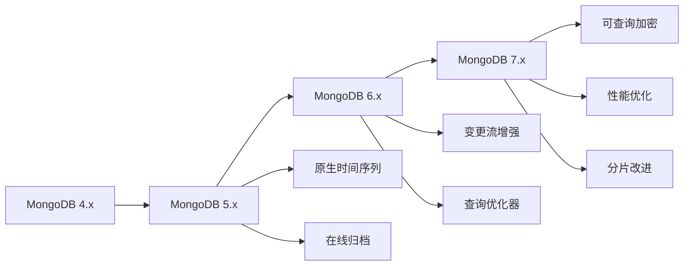

# ：MongoDB 文档数据库

> **难度等级**：⭐⭐⭐ 中高级 | **学习时长**：8小时 | **实战项目**：电商订单系统

## 📚 本章目录

- [20.1 MongoDB 7.x 新特性](#201-mongodb-7x-新特性)
- [20.2 文档模型设计](#202-文档模型设计)
- [20.3 聚合管道高级应用](#203-聚合管道高级应用)
- [20.4 事务处理](#204-事务处理)
- [20.5 分片集群实践](#205-分片集群实践)

---

## MongoDB 7.x 新特性

### 版本演进



### MongoDB 7.x 核心特性

**1. 可查询加密（Queryable Encryption）**

```javascript
// 自动加密字段
const { MongoClient } = require("mongodb");

const secureClient = new MongoClient(
  "mongodb://localhost:27017/encrypted",
  {
    autoEncryption: {
      keyVaultNamespace: "encryption.__keyVault",
      kmsProviders: {
        aws: {
          accessKeyId: process.env.AWS_ACCESS_KEY_ID,
          secretAccessKey: process.env.AWS_SECRET_ACCESS_KEY
        }
      }
    }
  }
);

// 插入自动加密的数据
await secureClient.db("hr").collection("employees").insertOne({
  name: "张三",
  salary: 50000,  // 自动加密
  ssn: "123-45-6789"  // 自动加密
});

// 查询时自动解密，可基于加密字段查询
const results = await secureClient.db("hr")
  .collection("employees")
  .find({ salary: { $gt: 40000 } })  // 在加密字段上查询
  .toArray();
```

**2. 性能优化**

```javascript
// 7.x 查询性能提升
db.orders.createIndex({ customer_id: 1, order_date: -1 });

// 覆盖索引查询优化
db.orders.find(
  { customer_id: ObjectId("..."), status: "completed" },
  { projection: { order_date: 1, total_amount: 1 } }
);

// 新的查询优化器
db.orders.explain("executionStats").find({
  customer_id: ObjectId("..."),
  order_date: { $gte: ISODate("2024-01-01") }
});
```

**3. 分片改进**

```javascript
// 更灵活的分片键选择
sh.shardCollection("mydb.orders", {
  region: 1,  // 范围分片
  customer_id: "hashed"  // 哈希分片
});

// 基于哈希和范围的复合分片
sh.shardCollection("mydb.events", {
  event_type: "hashed",
  event_time: 1
});

// resharding 无需停机
sh.reshardCollection(
  "mydb.orders",
  { new_shard_key: { customer_id: 1, order_date: -1 } }
);
```

**4. 时间序列集合增强**

```javascript
// 创建时间序列集合
db.createCollection("weather", {
  timeseries: {
    timeField: "timestamp",
    metaField: "location",
    granularity: "minutes"
  },
  expireAfterSeconds: 2592000  // 30天自动删除
});

// 插入时间序列数据
db.weather.insertMany([
  {
    location: { city: "北京", station: "朝阳" },
    timestamp: ISODate("2024-02-11T10:00:00Z"),
    temperature: 15.5,
    humidity: 65
  },
  {
    location: { city: "北京", station: "海淀" },
    timestamp: ISODate("2024-02-11T10:00:00Z"),
    temperature: 14.8,
    humidity: 62
  }
]);

// 聚合优化（自动使用桶优化）
db.weather.aggregate([
  {
    $setWindowFields: {
      sortBy: { timestamp: 1 },
      output: {
        avgTemp: {
          $avg: "$temperature",
          window: {
            range: [-3600, 0]  // 前1小时
          }
        }
      }
    }
  }
]);
```

---

## 文档模型设计

### 嵌入 vs 引用

**嵌入模式**：

```javascript
// 适合：一对少、一起查询、数据相对稳定
db.users.insertOne({
  _id: ObjectId("..."),
  username: "alice",
  email: "alice@example.com",
  addresses: [  // 嵌入地址（用户通常有少量地址）
    {
      street: "中关村大街1号",
      city: "北京",
      country: "中国",
      is_default: true
    },
    {
      street: "南京路100号",
      city: "上海",
      country: "中国",
      is_default: false
    }
  ]
});
```

**引用模式**：

```javascript
// 适合：一对多、独立查询、频繁更新
// 用户集合
db.users.insertOne({
  _id: ObjectId("..."),
  username: "alice",
  email: "alice@example.com"
});

// 订单集合
db.orders.insertMany([
  {
    _id: ObjectId("..."),
    user_id: ObjectId("..."),  // 引用用户
    order_date: ISODate("2024-02-11"),
    total_amount: 299.00,
    status: "pending"
  },
  {
    _id: ObjectId("..."),
    user_id: ObjectId("..."),
    order_date: ISODate("2024-02-10"),
    total_amount: 599.00,
    status: "shipped"
  }
]);

// 使用 $lookup 关联查询
db.orders.aggregate([
  { $match: { status: "shipped" } },
  {
    $lookup: {
      from: "users",
      localField: "user_id",
      foreignField: "_id",
      as: "user"
    }
  },
  { $unwind: "$user" },
  {
    $project: {
      order_id: "$_id",
      order_date: 1,
      total_amount: 1,
      username: "$user.username",
      email: "$user.email"
    }
  }
]);
```

**混合模式**：

```javascript
// 订单嵌入少量商品
db.orders.insertOne({
  _id: ObjectId("..."),
  user_id: ObjectId("..."),
  order_date: ISODate("2024-02-11"),
  status: "completed",
  items: [  // 嵌入商品详情
    {
      product_id: ObjectId("..."),
      name: "iPhone 15",
      price: 5999.00,
      quantity: 1,
      snapshot: {  // 保存快照防止商品信息变化
        image: "iphone15.jpg",
        description: "最新款iPhone"
      }
    },
    {
      product_id: ObjectId("..."),
      name: "AirPods",
      price: 1299.00,
      quantity: 2,
      snapshot: {
        image: "airpods.jpg",
        description: "无线耳机"
      }
    }
  ],
  total_amount: 8597.00,
  shipping_address: {
    province: "北京",
    city: "北京",
    district: "朝阳区",
    detail: "中关村大街1号",
    postal_code: "100080"
  }
});
```

### 数据建模原则

**1. 需要一起访问的数据放在一起**

```javascript
// 好的设计
db.posts.insertOne({
  _id: ObjectId("..."),
  title: "MongoDB 入门教程",
  content: "...",
  author: {
    _id: ObjectId("..."),
    name: "张三",
    avatar: "avatar.jpg"
  },
  tags: ["mongodb", "database", "nosql"],
  comments: [  // 嵌入评论（通常不会太多）
    {
      _id: ObjectId("..."),
      user: { name: "李四", avatar: "avatar2.jpg" },
      content: "很好的文章！",
      created_at: ISODate("2024-02-11T10:00:00Z")
    }
  ],
  views: 1250,
  created_at: ISODate("2024-02-11T08:00:00Z")
});
```

**2. 避免无限增长数组**

```javascript
// 不好的设计：评论数组会无限增长
db.posts.updateOne(
  { _id: ObjectId("...") },
  { $push: { comments: newComment } }
);

// 好的设计：评论单独存储
db.comments.insertOne({
  _id: ObjectId("..."),
  post_id: ObjectId("..."),
  user_id: ObjectId("..."),
  content: "很好的文章！",
  created_at: ISODate("2024-02-11T10:00:00Z")
});

db.posts.updateOne(
  { _id: ObjectId("...") },
  { $inc: { comment_count: 1 } }
);
```

**3. 使用合适的字段类型**

```javascript
db.products.insertOne({
  name: "iPhone 15",
  price: NumberDecimal("5999.00"),  // 精确的货币计算
  stock: 100,  // 使用数值而非字符串
  attributes: {
    color: "黑色",
    storage: "256GB",
    model: "A2848"
  },
  tags: ["smartphone", "apple", "5G"],  // 数组适合多值属性
  dimensions: {
    length: 14.76,
    width: 7.15,
    height: 0.71,
    unit: "cm"
  },
  specifications: {
    cpu: "A16 Bionic",
    ram: "6GB",
    storage: "256GB",
    battery: "3279 mAh",
    display: {
      size: 6.1,
      resolution: "2556x1179",
      technology: "OLED"
    }
  },
  is_active: true,
  created_at: ISODate("2024-02-11T08:00:00Z"),
  updated_at: ISODate("2024-02-11T08:00:00Z")
});
```

### Schema 验证

```javascript
// 创建集合时定义验证规则
db.createCollection("users", {
  validator: {
    $jsonSchema: {
      bsonType: "object",
      required: ["username", "email", "age"],
      properties: {
        username: {
          bsonType: "string",
          minLength: 3,
          maxLength: 30,
          description: "用户名，3-30个字符"
        },
        email: {
          bsonType: "string",
          pattern: "^[a-zA-Z0-9._%+-]+@[a-zA-Z0-9.-]+\\.[a-zA-Z]{2,}$",
          description: "有效的邮箱地址"
        },
        age: {
          bsonType: "int",
          minimum: 18,
          maximum: 120,
          description: "年龄，18-120岁"
        },
        address: {
          bsonType: "object",
          properties: {
            city: { bsonType: "string" },
            country: { bsonType: "string" }
          }
        }
      }
    }
  },
  validationLevel: "moderate",  // moderate: 只验证插入和修改的字段
  validationAction: "error"     // error: 拒绝不符合的文档
});

// 测试验证
db.users.insertOne({
  username: "alice",
  email: "alice@example.com",
  age: 25
});  // 成功

db.users.insertOne({
  username: "bob",
  email: "invalid-email",
  age: 15
});  // 失败：邮箱格式错误且年龄不符合
```

---

## 聚合管道高级应用

### 基础聚合

```javascript
// 统计各分类商品数量和平均价格
db.products.aggregate([
  // 阶段1: 匹配活跃商品
  { $match: { is_active: true } },

  // 阶段2: 按分类分组
  {
    $group: {
      _id: "$category",
      total_products: { $sum: 1 },
      avg_price: { $avg: "$price" },
      min_price: { $min: "$price" },
      max_price: { $max: "$price" }
    }
  },

  // 阶段3: 排序
  { $sort: { total_products: -1 } },

  // 阶段4: 限制结果数量
  { $limit: 10 }
]);
```

### 复杂聚合示例

**电商订单分析**：

```javascript
db.orders.aggregate([
  // 1. 匹配指定时间范围的订单
  {
    $match: {
      order_date: {
        $gte: ISODate("2024-01-01"),
        $lt: ISODate("2024-02-01")
      },
      status: { $in: ["completed", "shipped"] }
    }
  },

  // 2. 展开商品数组
  { $unwind: "$items" },

  // 3. 计算每个商品的销售额
  {
    $project: {
      order_id: "$_id",
      order_date: 1,
      user_id: 1,
      product_id: "$items.product_id",
      product_name: "$items.name",
      quantity: "$items.quantity",
      unit_price: "$items.price",
      subtotal: { $multiply: ["$items.quantity", "$items.price"] }
    }
  },

  // 4. 按商品分组统计
  {
    $group: {
      _id: "$product_id",
      product_name: { $first: "$product_name" },
      total_sold: { $sum: "$quantity" },
      total_revenue: { $sum: "$subtotal" },
      avg_price: { $avg: "$unit_price" },
      order_count: { $sum: 1 },
      unique_customers: { $addToSet: "$user_id" }
    }
  },

  // 5. 计算客户数量
  {
    $project: {
      product_name: 1,
      total_sold: 1,
      total_revenue: 1,
      avg_price: 1,
      order_count: 1,
      unique_customer_count: { $size: "$unique_customers" }
    }
  },

  // 6. 按销售额排序
  { $sort: { total_revenue: -1 } },

  // 7. 限制前20名
  { $limit: 20 }
]);
```

**用户行为漏斗分析**：

```javascript
// 分析用户购买流程：浏览 → 加购 → 下单 → 支付
db.user_actions.aggregate([
  // 按用户分组，统计各阶段行为
  {
    $group: {
      _id: "$user_id",
      viewed: {
        $sum: { $cond: [{ $eq: ["$action", "view"] }, 1, 0] }
      },
      added_to_cart: {
        $sum: { $cond: [{ $eq: ["$action", "add_to_cart"] }, 1, 0] }
      },
      ordered: {
        $sum: { $cond: [{ $eq: ["$action", "order"] }, 1, 0] }
      },
      paid: {
        $sum: { $cond: [{ $eq: ["$action", "pay"] }, 1, 0] }
      },
      first_action: { $min: "$timestamp" },
      last_action: { $max: "$timestamp" }
    }
  },

  // 计算转化率
  {
    $project: {
      user_id: "$_id",
      viewed: 1,
      added_to_cart: 1,
      ordered: 1,
      paid: 1,
      view_to_cart_rate: {
        $cond: [
          { $gt: ["$viewed", 0] },
          { $multiply: [{ $divide: ["$added_to_cart", "$viewed"] }, 100] },
          0
        ]
      },
      cart_to_order_rate: {
        $cond: [
          { $gt: ["$added_to_cart", 0] },
          { $multiply: [{ $divide: ["$ordered", "$added_to_cart"] }, 100] },
          0
        ]
      },
      order_to_pay_rate: {
        $cond: [
          { $gt: ["$ordered", 0] },
          { $multiply: [{ $divide: ["$paid", "$ordered"] }, 100] },
          0
        ]
      }
    }
  },

  // 只保留有转化的用户
  { $match: { viewed: { $gt: 0 } } }
]);
```

### 窗口函数

```javascript
// 计算移动平均和排名
db.sales.aggregate([
  {
    $setWindowFields: {
      sortBy: { sale_date: 1 },
      output: [
        // 累计求和
        {
          cumulative_amount: {
            $sum: "$amount",
            window: {
              documents: ["unbounded", "current"]
            }
          }
        },
        // 3天移动平均
        {
          moving_avg_3days: {
            $avg: "$amount",
            window: {
              range: [-2, 0],  // 当前及前2天
              unit: "day"
            }
          }
        },
        // 按金额排名
        {
          amount_rank: {
            $rank: {}
          }
        },
        // 日期差异
        {
          days_since_first_sale: {
            $dateDiff: {
              startDate: "$$FIRST.sale_date",
              endDate: "$sale_date",
              unit: "day"
            }
          }
        }
      ]
    }
  }
]);
```

### 图遍历

```javascript
// 社交网络好友推荐
db.users.aggregate([
  // 查找用户的好友
  { $match: { _id: ObjectId("user_id") } },

  // 展开 friends 数组
  { $unwind: "$friends" },

  // 查找好友的好友（二度好友）
  {
    $graphLookup: {
      from: "users",
      startWith: "$friends",
      connectFromField: "friends",
      connectToField: "_id",
      as: "friends_of_friends",
      maxDepth: 2,
      depthField: "depth"
    }
  },

  // 展开结果
  { $unwind: "$friends_of_friends" },

  // 排除已是好友的用户
  {
    $match: {
      "friends_of_friends._id": { $nin: ["$friends", "$_id"] }
    }
  },

  // 统计推荐频率
  {
    $group: {
      _id: "$friends_of_friends._id",
      name: { $first: "$friends_of_friends.name" },
      mutual_friends_count: { $sum: 1 }
    }
  },

  // 按共同好友数量排序
  { $sort: { mutual_friends_count: -1 } },

  { $limit: 10 }
]);
```

---

## 事务处理

### 多文档事务

```javascript
// 订单支付事务
const session = client.startSession();

try {
  await session.withTransaction(async () => {
    const ordersCollection = client.db("ecommerce").collection("orders");
    const paymentsCollection = client.db("ecommerce").collection("payments");
    const inventoryCollection = client.db("ecommerce").collection("inventory");

    // 1. 更新订单状态
    const orderResult = await ordersCollection.updateOne(
      { _id: orderId, status: "pending" },
      {
        $set: {
          status: "paid",
          paid_at: new Date(),
          payment_method: "alipay"
        }
      },
      { session }
    );

    if (orderResult.matchedCount === 0) {
      throw new Error("订单不存在或已处理");
    }

    // 2. 创建支付记录
    await paymentsCollection.insertOne(
      {
        order_id: orderId,
        user_id: userId,
        amount: order.total_amount,
        payment_method: "alipay",
        transaction_id: "TXN" + Date.now(),
        status: "success",
        created_at: new Date()
      },
      { session }
    );

    // 3. 扣减库存
    for (const item of order.items) {
      const inventoryResult = await inventoryCollection.updateOne(
        {
          product_id: item.product_id,
          stock: { $gte: item.quantity }
        },
        {
          $inc: { stock: -item.quantity, sold: item.quantity }
        },
        { session }
      );

      if (inventoryResult.matchedCount === 0) {
        throw new Error(`商品 ${item.product_id} 库存不足`);
      }
    }
  }, {
    readPreference: 'primary',
    readConcern: { level: 'local' },
    writeConcern: { w: 'majority' }
  });

  console.log("事务提交成功");
} catch (error) {
  console.error("事务回滚:", error.message);
} finally {
  await session.endSession();
}
```

### 事务配置选项

```javascript
// 读关注级别
const readConcernLevels = {
  local: "返回大多数节点的最新数据",
  available: "返回最快可用的数据（可能过时）",
  majority: "返回已被大多数节点确认的数据",
  linearizable: "可线性化读取（最强一致性）",
  snapshot: "快照读取"
};

// 写关注级别
const writeConcernLevels = {
  w: 1,           // 等待主节点确认
  w: "majority",  // 等待大多数节点确认
  w: 0,           // 不等待确认（最快但可能丢失）
  j: true,        // 等待日志写入磁盘
  wtimeout: 5000  // 超时时间（毫秒）
};

// 事务选项配置
const transactionOptions = {
  readPreference: 'primary',           // 从主节点读取
  readConcern: { level: 'snapshot' },  // 快照读
  writeConcern: {
    w: 'majority',
    j: true
  },
  maxCommitTimeMS: 10000  // 最大提交时间
};
```

### 重试逻辑

```javascript
// 可重试的事务
async function executeTransactionWithRetry(operation, maxRetries = 3) {
  let attempt = 0;
  const session = client.startSession();

  while (attempt < maxRetries) {
    try {
      await session.withTransaction(async () => {
        await operation(session);
      }, {
        readPreference: 'primary',
        readConcern: { level: 'local' },
        writeConcern: { w: 'majority' }
      });

      console.log(`事务成功（尝试 ${attempt + 1}）`);
      return true;
    } catch (error) {
      attempt++;

      // 判断是否可重试的错误
      const isTransientError =
        error.hasErrorLabel('TransientTransactionError') ||
        error.code === 6 ||  // HostUnreachable
        error.code === 89 ||  // NetworkTimeout
        error.code === 91;   // ShutdownInProgress

      if (!isTransientError || attempt >= maxRetries) {
        console.error(`事务失败: ${error.message}`);
        throw error;
      }

      console.log(`事务失败，正在重试... (${attempt}/${maxRetries})`);

      // 指数退避
      await new Promise(resolve =>
        setTimeout(resolve, Math.min(1000 * Math.pow(2, attempt), 10000))
      );
    } finally {
      await session.endSession();
    }
  }

  return false;
}
```

---

## 分片集群实践

### 分片架构

```
┌──────────────────────────────────────────────────────────────────┐
│                        MongoDB 分片集群                          │
├──────────────────────────────────────────────────────────────────┤
│                                                                   │
│  ┌──────────────┐  ┌──────────────┐  ┌──────────────┐           │
│  │  应用程序    │  │  应用程序    │  │  应用程序    │           │
│  └──────┬───────┘  └──────┬───────┘  └──────┬───────┘           │
│         │                 │                 │                     │
│         └─────────────────┴─────────────────┘                     │
│                           │                                       │
│         ┌─────────────────┴─────────────────┐                     │
│         │        mongos 路由器（多个）        │                     │
│         └─────────────────┬─────────────────┘                     │
│                           │                                       │
│         ┌─────────────────┴─────────────────┐                     │
│         │       Config Server（3节点副本集）  │                     │
│         │       （集群元数据和配置）          │                     │
│         └───────────────────────────────────┘                     │
│                                                                   │
│  ┌─────────────────────────────────────────────────────────┐    │
│  │                       Shard 1                           │    │
│  │  ┌─────────────┐  ┌─────────────┐  ┌─────────────┐    │    │
│  │  │  Primary    │  │  Secondary  │  │  Secondary  │    │    │
│  │  │  (Port 27001)│  │  (Port 27002)│  │  (Port 27003)│    │    │
│  │  └─────────────┘  └─────────────┘  └─────────────┘    │    │
│  │           Chunk Range: -∞ ~ 1000                        │    │
│  └─────────────────────────────────────────────────────────┘    │
│                                                                   │
│  ┌─────────────────────────────────────────────────────────┐    │
│  │                       Shard 2                           │    │
│  │  ┌─────────────┐  ┌─────────────┐  ┌─────────────┐    │    │
│  │  │  Primary    │  │  Secondary  │  │  Secondary  │    │    │
│  │  │  (Port 27011)│  │  (Port 27012)│  │  (Port 27013)│    │    │
│  │  └─────────────┘  └─────────────┘  └─────────────┘    │    │
│  │           Chunk Range: 1000 ~ 5000                      │    │
│  └─────────────────────────────────────────────────────────┘    │
│                                                                   │
│  ┌─────────────────────────────────────────────────────────┐    │
│  │                       Shard 3                           │    │
│  │  ┌─────────────┐  ┌─────────────┐  ┌─────────────┐    │    │
│  │  │  Primary    │  │  Secondary  │  │  Secondary  │    │    │
│  │  │  (Port 27021)│  │  (Port 27022)│  │  (Port 27023)│    │    │
│  │  └─────────────┘  └─────────────┘  └─────────────┘    │    │
│  │           Chunk Range: 5000 ~ +∞                        │    │
│  └─────────────────────────────────────────────────────────┘    │
│                                                                   │
└───────────────────────────────────────────────────────────────────┘
```

### 分片键选择

**好的分片键示例**：

```javascript
// 1. 基数高的字段
// 好的分片键：user_id（基数高，分布均匀）
sh.shardCollection("ecommerce.orders", {
  user_id: 1  // 范围分片，适合时间序列查询
});

// 2. 哈希分片（均匀分布）
sh.shardCollection("ecommerce.products", {
  product_id: "hashed"  // 哈希分片，负载均衡
});

// 3. 复合分片键（更细粒度）
sh.shardCollection("ecommerce.orders", {
  user_id: 1,
  order_date: -1
});

// 4. 地理位置
sh.shardCollection("geo.locations", {
  "coordinates.lat": 1,
  "coordinates.lng": 1
});
```

**不好的分片键示例**：

```javascript
// ❌ 低基数字段
sh.shardCollection("ecommerce.users", {
  status: 1  // 只有几个值，会导致数据分布不均
});

// ❌ 单调递增字段（会写入热点）
sh.shardCollection("ecommerce.logs", {
  _id: 1  // ObjectId 是单调递增的
});

// ✅ 使用哈希分片解决热点问题
sh.shardCollection("ecommerce.logs", {
  _id: "hashed"  // 哈希分片，写入分散
});
```

### 分片操作

```javascript
// 启动分片
sh.enableSharding("ecommerce");

// 分片集合
sh.shardCollection(
  "ecommerce.orders",
  { user_id: 1 }
);

// 查看分片状态
sh.status();

// 查看分片信息
db.orders.getShardDistribution();

// 添加分片
sh.addShard("shard1.example.com:27017");
sh.addShard("shard2.example.com:27017");

// 移除分片（会自动迁移数据）
sh.removeShard("shard1.example.com:27017");

// 平衡集群
sh.startBalancer();
sh.stopBalancer();

// 查看平衡状态
sh.getBalancerState();
sh.isBalancerRunning();
```

### 分片查询优化

```javascript
// 针对分片键的查询（高效）
db.orders.find({ user_id: ObjectId("...") });

// 包含分片键的范围查询（高效）
db.orders.find({
  user_id: ObjectId("..."),
  order_date: {
    $gte: ISODate("2024-01-01"),
    $lt: ISODate("2024-02-01")
  }
});

// 不包含分片键的查询（scatter-gather，慢）
db.orders.find({ status: "completed" });

// 优化：添加分片键或使用覆盖索引
db.orders.createIndex({ status: 1, user_id: 1 });
```

---

## ✅ 本章小结

### 学习检查清单

完成本章学习后，请确认你能够：

- [ ] 理解 MongoDB 7.x 的新特性和改进
- [ ] 设计合理的文档数据模型（嵌入 vs 引用）
- [ ] 使用 Schema 验证确保数据完整性
- [ ] 编写复杂的聚合管道查询
- [ ] 使用窗口函数进行高级分析
- [ ] 实现多文档事务处理
- [ ] 设计和部署分片集群
- [ ] 选择合适的分片键
- [ ] 优化分片查询性能

### 核心要点回顾

1. **文档模型**：嵌入用于一对少，引用用于一对多
2. **聚合管道**：强大的数据处理和分析能力
3. **事务支持**：从 MongoDB 4.0 开始支持多文档 ACID 事务
4. **分片架构**：水平扩展的关键，分片键选择至关重要
5. **性能优化**：索引设计、查询模式、分片策略

## 📚 延伸阅读

- [第22章：Redis 高级应用 →](./chapter-21)
- [第23章：Elasticsearch 搜索引擎 →](./chapter-22)
- [MongoDB 官方文档](https://www.mongodb.com/docs/)
- [MongoDB University 免费课程](https://university.mongodb.com/)

---

**更新时间**：2026年2月 | **版本**：v1.0
