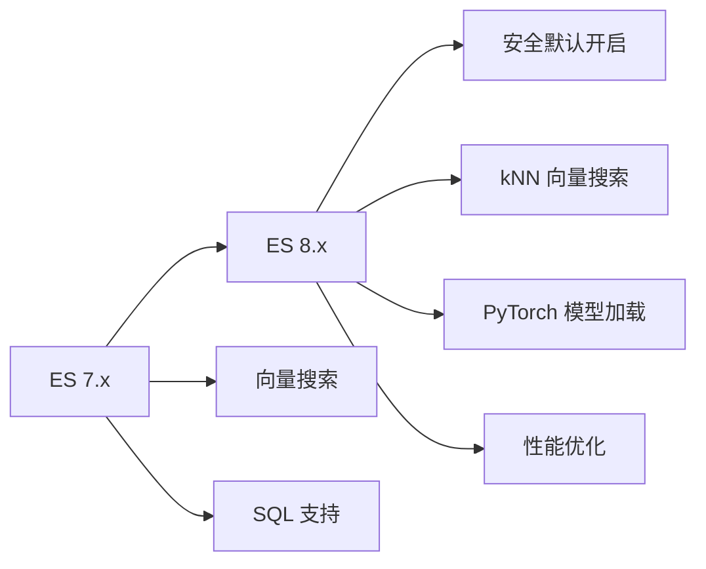

# ：Elasticsearch 搜索引擎

> **难度等级**：⭐⭐⭐⭐ 高级 | **学习时长**：12小时 | **实战项目**：全文搜索系统

## 📚 本章目录

- [22.1 Elasticsearch 8.x 新特性](#221-elasticsearch-8x-新特性)
- [22.2 索引设计](#222-索引设计)
- [22.3 复杂查询](#223-复杂查询)
- [22.4 聚合分析](#224-聚合分析)
- [22.5 集群运维](#225-集群运维)

---

## Elasticsearch 8.x 新特性

### 版本演进



### Elasticsearch 8.x 核心特性

**1. 安全性默认开启**

```bash
# 8.x 安装后自动生成密码和证书
./bin/elasticsearch-certutil ca
./bin/elasticsearch-certutil cert --ca elastic-stack-ca.p12

# 内置用户
elastic # 超级用户
kibana_system
logstash_system

# 首次启动输出随机密码
Generated password for the [elastic] user: xyz123...
```

**2. kNN 向量搜索**

```json
// 创建向量索引
PUT images
{
  "mappings": {
    "properties": {
      "image_vector": {
        "type": "dense_vector",
        "dims": 512,
        "index": true,
        "similarity": "l2_norm"
      }
    }
  }
}

// kNN 搜索
GET images/_search
{
  "knn": {
    "field": "image_vector",
    "query_vector": [0.1, 0.2, ...],
    "k": 10,
    "num_candidates": 100
  }
}
```

**3. PyTorch 模型加载**

```python
# 上传 PyTorch 模型
from eland.ml.pytorch import PyTorchModel

model = PyTorchModel(
    es_client,
    model_id='text-embedding-model',
    model_path='model.pt'
)
model.upload()

// 使用模型进行推理
GET _ml/trained_models/text-embedding-model/deployment/_infer
{
  "docs": [
    { "text_field": "Hello world" }
  ]
}
```

**4. 性能优化**

```json
// 向量索引优化
PUT index/_settings
{
  "index": {
    "knn": true,
    "knn.algo_param.ef_search": 100
  }
}

// 查询缓存优化
GET index/_search
{
  "request_cache": true
}
```

---

## 索引设计

### Mapping 设计

```json
// 创建产品索引
PUT products
{
  "settings": {
    "number_of_shards": 3,
    "number_of_replicas": 2,
    "analysis": {
      "analyzer": {
        "ik_max_word_analyzer": {
          "type": "custom",
          "tokenizer": "ik_max_word"
        },
        "pinyin_analyzer": {
          "type": "custom",
          "tokenizer": "ik_max_word",
          "filter": ["lowercase", "pinyin"]
        }
      }
    }
  },
  "mappings": {
    "properties": {
      "product_id": {
        "type": "long"
      },
      "name": {
        "type": "text",
        "analyzer": "ik_max_word_analyzer",
        "fields": {
          "keyword": {
            "type": "keyword",
            "ignore_above": 256
          },
          "pinyin": {
            "type": "text",
            "analyzer": "pinyin_analyzer"
          }
        }
      },
      "description": {
        "type": "text",
        "analyzer": "ik_max_word_analyzer"
      },
      "category": {
        "type": "keyword"
      },
      "brand": {
        "type": "keyword"
      },
      "price": {
        "type": "double"
      },
      "stock": {
        "type": "integer"
      },
      "tags": {
        "type": "keyword"
      },
      "attributes": {
        "type": "nested",
        "properties": {
          "key": { "type": "keyword" },
          "value": { "type": "keyword" }
        }
      },
      "location": {
        "type": "geo_point"
      },
      "created_at": {
        "type": "date",
        "format": "yyyy-MM-dd HH:mm:ss||yyyy-MM-dd||epoch_millis"
      },
      "updated_at": {
        "type": "date"
      }
    }
  }
}
```

### 字段类型选择

| 类型 | 说明 | 适用场景 |
|-----|------|---------|
| **text** | 全文检索，分词 | 商品名称、文章内容 |
| **keyword** | 精确匹配，不分词 | ID、状态、标签 |
| **numeric** | 数值类型 | 价格、库存、评分 |
| **date** | 日期时间 | 创建时间、更新时间 |
| **boolean** | 布尔值 | 是否上架、是否推荐 |
| **nested** | 嵌套对象 | 商品属性、评论 |
| **geo_point** | 地理位置 | 附近店铺、距离搜索 |

### 分词器配置

```json
// 安装 IK 分词器
./bin/elasticsearch-plugin install https://github.com/medcl/elasticsearch-analysis-ik/releases/download/v8.x.x/elasticsearch-analysis-ik-8.x.x.zip

// 测试分词
POST _analyze
{
  "analyzer": "ik_max_word",
  "text": "中华人民共和国国歌"
}

// 自定义分词器
PUT custom_analyzer_test
{
  "settings": {
    "analysis": {
      "filter": {
        "my_pinyin": {
          "type": "pinyin",
          "keep_separate_first_letter": false,
          "keep_full_pinyin": true,
          "keep_original": true,
          "limit_first_letter_length": 16
        }
      },
      "analyzer": {
        "my_analyzer": {
          "type": "custom",
          "tokenizer": "ik_max_word",
          "filter": ["lowercase", "my_pinyin"]
        }
      }
    }
  }
}
```

### 索引模板

```json
// 索引模板（组件模板 + 索引模板）
PUT _component_template/logs-mappings
{
  "template": {
    "mappings": {
      "properties": {
        "@timestamp": { "type": "date" },
        "level": { "type": "keyword" },
        "message": { "type": "text" }
      }
    }
  }
}

PUT _component_template/logs-settings
{
  "template": {
    "settings": {
      "number_of_shards": 3,
      "number_of_replicas": 1
    }
  }
}

PUT _index_template/logs
{
  "index_patterns": ["logs-*"],
  "composed_of": ["logs-mappings", "logs-settings"],
  "priority": 100
}
```

---

## 复杂查询

### 基础查询

```json
// 1. 全文搜索
GET products/_search
{
  "query": {
    "match": {
      "name": "iPhone 15"
    }
  }
}

// 2. 精确匹配
GET products/_search
{
  "query": {
    "term": {
      "category.keyword": "手机"
    }
  }
}

// 3. 范围查询
GET products/_search
{
  "query": {
    "range": {
      "price": {
        "gte": 1000,
        "lte": 5000
      }
    }
  }
}

// 4. 前缀查询
GET products/_search
{
  "query": {
    "prefix": {
      "name.keyword": "iPhone"
    }
  }
}

// 5. 通配符查询
GET products/_search
{
  "query": {
    "wildcard": {
      "name.keyword": "iPhone*"
    }
  }
}
```

### 组合查询

```json
// 1. bool 查询（must、should、must_not）
GET products/_search
{
  "query": {
    "bool": {
      "must": [
        { "match": { "name": "iPhone" } }
      ],
      "should": [
        { "match": { "description": "5G" } },
        { "term": { "brand": "Apple" } }
      ],
      "must_not": [
        { "term": { "status": "discontinued" } }
      ],
      "filter": [
        { "range": { "price": { "lte": 8000 } } },
        { "term": { "stock": { "gt": 0 } } }
      ]
    }
  }
}

// 2. minimum_should_match
GET products/_search
{
  "query": {
    "bool": {
      "should": [
        { "match": { "name": "iPhone" } },
        { "match": { "description": "智能手机" } },
        { "match": { "tags": "5G" } }
      ],
      "minimum_should_match": 2
    }
  }
}

// 3. boosting 查询（控制权重）
GET products/_search
{
  "query": {
    "boosting": {
      "positive": {
        "match": { "name": "iPhone" }
      },
      "negative": {
        "match": { "description": "二手" }
      },
      "negative_boost": 0.2
    }
  }
}

// 4. constant_score（过滤不计分）
GET products/_search
{
  "query": {
    "constant_score": {
      "filter": {
        "term": { "status": "active" }
      },
      "boost": 1.2
    }
  }
}

// 5. dis_max（最佳字段查询）
GET products/_search
{
  "query": {
    "dis_max": {
      "queries": [
        { "match": { "name": "iPhone 15" } },
        { "match": { "description": "iPhone 15" } }
      ],
      "tie_breaker": 0.3
    }
  }
}
```

### 复杂查询示例

**电商商品搜索**：

```json
GET products/_search
{
  "query": {
    "bool": {
      "must": [
        {
          "multi_match": {
            "query": "iPhone",
            "fields": [
              "name^3",        // 权重3
              "description^2", // 权重2
              "tags"
            ],
            "type": "best_fields",
            "operator": "and"
          }
        }
      ],
      "filter": [
        { "term": { "status": "active" } },
        { "range": { "price": { "gte": 1000, "lte": 10000 } } },
        {
          "nested": {
            "path": "attributes",
            "query": {
              "bool": {
                "must": [
                  { "match": { "attributes.key": "color" } },
                  { "match": { "attributes.value": "黑色" } }
                ]
              }
            }
          }
        }
      ]
    }
  },
  "aggs": {
    "by_category": {
      "terms": {
        "field": "category.keyword",
        "size": 10
      }
    },
    "by_brand": {
      "terms": {
        "field": "brand.keyword",
        "size": 10
      }
    },
    "price_ranges": {
      "range": {
        "field": "price",
        "ranges": [
          { "to": 3000, "key": "low" },
          { "from": 3000, "to": 6000, "key": "medium" },
          { "from": 6000, "key": "high" }
        ]
      }
    }
  },
  "sort": [
    { "popularity": { "order": "desc" } },
    { "price": { "order": "asc" } }
  ],
  "from": 0,
  "size": 20
}
```

### 地理位置查询

```json
// 1. geo_distance（距离查询）
GET shops/_search
{
  "query": {
    "bool": {
      "filter": {
        "geo_distance": {
          "distance": "5km",
          "location": {
            "lat": 39.9042,
            "lon": 116.4074
          }
        }
      }
    }
  }
}

// 2. geo_bounding_box（矩形范围）
GET shops/_search
{
  "query": {
    "bool": {
      "filter": {
        "geo_bounding_box": {
          "location": {
            "top_left": { "lat": 40.0, "lon": 116.3 },
            "bottom_right": { "lat": 39.8, "lon": 116.5 }
          }
        }
      }
    }
  }
}

// 3. geo_distance（距离排序）
GET shops/_search
{
  "query": {
    "match_all": {}
  },
  "sort": [
    {
      "_geo_distance": {
        "location": {
          "lat": 39.9042,
          "lon": 116.4074
        },
        "order": "asc",
        "unit": "km"
      }
    }
  ]
}
```

---

## 聚合分析

### 指标聚合

```json
// 1. 统计指标
GET sales/_search
{
  "size": 0,
  "aggs": {
    "total_sales": {
      "sum": { "field": "amount" }
    },
    "avg_sales": {
      "avg": { "field": "amount" }
    },
    "min_sales": {
      "min": { "field": "amount" }
    },
    "max_sales": {
      "max": { "field": "amount" }
    },
    "stats": {
      "stats": { "field": "amount" }
    },
    "percentiles": {
      "percentiles": {
        "field": "amount",
        "percents": [1, 5, 25, 50, 75, 95, 99]
      }
    }
  }
}

// 2. 去重计数
GET orders/_search
{
  "size": 0,
  "aggs": {
    "unique_users": {
      "cardinality": {
        "field": "user_id"
      }
    }
  }
}

// 3. 过滤聚合
GET products/_search
{
  "size": 0,
  "aggs": {
    "active_products": {
      "filter": { "term": { "status": "active" } },
      "aggs": {
        "avg_price": { "avg": { "field": "price" } }
      }
    }
  }
}
```

### 桶聚合

```json
// 1. terms 分组
GET orders/_search
{
  "size": 0,
  "aggs": {
    "by_category": {
      "terms": {
        "field": "category.keyword",
        "size": 20
      },
      "aggs": {
        "total_revenue": {
          "sum": { "field": "amount" }
        },
        "avg_order_value": {
          "avg": { "field": "amount" }
        }
      }
    }
  }
}

// 2. range 范围分组
GET products/_search
{
  "size": 0,
  "aggs": {
    "price_ranges": {
      "range": {
        "field": "price",
        "ranges": [
          { "to": 100, "key": "cheap" },
          { "from": 100, "to": 500, "key": "medium" },
          { "from": 500, "key": "expensive" }
        ]
      }
    }
  }
}

// 3. date_histogram 时间直方图
GET logs/_search
{
  "size": 0,
  "aggs": {
    "over_time": {
      "date_histogram": {
        "field": "@timestamp",
        "calendar_interval": "day",
        "format": "yyyy-MM-dd"
      },
      "aggs": {
        "unique_visitors": {
          "cardinality": { "field": "user_id" }
        }
      }
    }
  }
}

// 4. geo_hash 地理位置聚合
GET shops/_search
{
  "size": 0,
  "aggs": {
    "shops_in_location": {
      "geohash_grid": {
        "field": "location",
        "precision": 5
      }
    }
  }
}
```

### 复杂聚合示例

**销售漏斗分析**：

```json
GET user_actions/_search
{
  "size": 0,
  "aggs": {
    "users": {
      "filters": {
        "filters": {
          "viewed": {
            "term": { "action": "view" }
          },
          "added_to_cart": {
            "term": { "action": "add_to_cart" }
          },
          "purchased": {
            "term": { "action": "purchase" }
          }
        }
      },
      "aggs": {
        "unique_users": {
          "cardinality": { "field": "user_id" }
        }
      }
    },
    "conversion_funnel": {
      "filters": {
        "filters": {
          "step1_viewed": {
            "term": { "action": "view" }
          },
          "step2_added_cart": {
            "bool": {
              "must": [
                { "term": { "action": "add_to_cart" } },
                {
                  "terms": {
                    "user_id": {
                      "index": "user_actions",
                      "type": "_doc",
                        "id": "step1_viewed",
                        "path": "user_id"
                      }
                    }
                  }
                }
              ]
            }
          }
        }
      }
    }
  }
}
```

**嵌套聚合**：

```json
GET orders/_search
{
  "size": 0,
  "aggs": {
    "by_date": {
      "date_histogram": {
        "field": "order_date",
        "calendar_interval": "month"
      },
      "aggs": {
        "by_category": {
          "terms": {
            "field": "category.keyword"
          },
          "aggs": {
            "total_revenue": {
              "sum": { "field": "amount" }
            },
            "top_products": {
              "top_hits": {
                "size": 5,
                "sort": [
                  { "amount": { "order": "desc" } }
                ]
              }
            }
          }
        }
      }
    }
  }
}
```

---

## 集群运维

### 集群架构

```
┌──────────────────────────────────────────────────────────────┐
│                    Elasticsearch 集群                        │
├──────────────────────────────────────────────────────────────┤
│                                                              │
│  ┌─────────────────────────────────────────────────────┐   │
│  │                   协调节点（3个）                    │   │
│  │  （处理客户端请求、分发查询、合并结果）               │   │
│  └─────────────────────────────────────────────────────┘   │
│                                                              │
│  ┌─────────────────────────────────────────────────────┐   │
│  │                 数据节点（3个）                      │   │
│  │  ┌─────────┐  ┌─────────┐  ┌─────────┐             │   │
│  │  │Node 1   │  │Node 2   │  │Node 3   │             │   │
│  │  │:9200    │  │:9201    │  │:9202    │             │   │
│  │  │Master   │  │Data     │  │Data     │             │   │
│  │  │Data     │  │         │  │         │             │   │
│  │  └─────────┘  └─────────┘  └─────────┘             │   │
│  │       │            │            │                    │   │
│  │       └────────────┴────────────┘                    │   │
│  │              数据分片（Primary + Replica）            │   │
│  └─────────────────────────────────────────────────────┘   │
│                                                              │
│  ┌─────────────────────────────────────────────────────┐   │
│  │                 专有主节点（3个）                    │   │
│  │  （管理集群状态，不存储数据，不处理查询）             │   │
│  └─────────────────────────────────────────────────────┘   │
│                                                              │
└──────────────────────────────────────────────────────────────┘
```

### 集群配置

```yaml
# elasticsearch.yml

# 集群名称
cluster.name: my-cluster

# 节点名称
node.name: node-1

# 节点角色
node.roles: [data, master]  # 8.x 新配置方式

# 网络绑定
network.host: 0.0.0.0
http.port: 9200
transport.port: 9300

# 发现机制
discovery.seed_hosts: ["192.168.1.100", "192.168.1.101", "192.168.1.102"]
cluster.initial_master_nodes: ["node-1", "node-2", "node-3"]

# 内存锁定
bootstrap.memory_lock: true

# 安全配置
xpack.security.enabled: true
xpack.security.transport.ssl.enabled: true
xpack.security.http.ssl.enabled: true

# 路径
path.data: /var/lib/elasticsearch
path.logs: /var/log/elasticsearch
```

### 索引管理

```bash
# 创建索引
PUT my_index

# 删除索引
DELETE my_index

# 关闭/打开索引
POST my_index/_close
POST my_index/_open

# 索引别名
POST _aliases
{
  "actions": [
    {
      "add": {
        "index": "logs-2024-02",
        "alias": "logs-current"
      }
    }
  ]
}

# 索引设置
PUT my_index/_settings
{
  "index": {
    "number_of_replicas": 2
  }
}

# 索引分裂（增加分片）
POST my_index/_split/my_index_split
{
  "settings": {
    "index.number_of_shards": 6
  }
}

# 索引收缩（减少分片）
POST my_index/_shrink/my_index_shrink
{
  "settings": {
    "index.number_of_shards": 1,
    "index.number_of_replicas": 0
  }
}

# Rollover（滚动索引）
PUT logs-000001
{
  "aliases": {
    "logs-write": {}
  }
}

POST logs-write/_rollover
{
  "conditions": {
    "max_age": "7d",
    "max_docs": 10000000,
    "max_size": "50gb"
  }
}
```

### 性能优化

**1. 分片优化**：

```bash
# 分片大小建议：10-50GB
# 分片数量 = 数据总量 / 分片大小 / 副本数

# 查看分片状态
GET _cat/shards?v

# 强制合并分段
POST my_index/_forcemerge?max_num_segments=1

# 分片分配
PUT _cluster/settings
{
  "transient": {
    "cluster.routing.allocation.enable": "all"
  }
}
```

**2. 查询优化**：

```json
// 1. 使用 filter 上下文（不计算分数，更快）
GET products/_search
{
  "query": {
    "bool": {
      "filter": [
        { "term": { "status": "active" } },
        { "range": { "price": { "lte": 5000 } } }
      ]
    }
  }
}

// 2. 使用 _source 过滤（减少网络传输）
GET products/_search
{
  "_source": ["name", "price", "category"],
  "query": {
    "match": { "name": "iPhone" }
  }
}

// 3. 使用 search_after 深度分页（避免深分页性能问题）
GET products/_search
{
  "size": 20,
  "query": { "match_all": {} },
  "sort": [
    { "price": "asc" },
    { "_id": "asc" }
  ],
  "search_after": [100, "product_id"]
}

// 4. 使用 preference 定向查询（利用缓存）
GET products/_search
{
  "preference": "_local",
  "query": {
    "match": { "name": "iPhone" }
  }
}
```

**3. 缓存优化**：

```bash
# 启用查询缓存
PUT my_index/_settings
{
  "index.queries.cache.enabled": true
}

# 清除缓存
POST my_index/_cache/clear

# 字段数据缓存
POST my_index/_cache/clear?fielddata=true
```

### 监控指标

```bash
# 集群健康
GET _cluster/health

# 节点统计
GET _nodes/stats

# 索引统计
GET my_index/_stats

# 任务管理
GET _tasks
GET _cat/tasks?v

# 慢查询日志
PUT my_index/_settings
{
  "index.search.slowlog.threshold.query.warn": "10s",
  "index.search.slowlog.threshold.query.info": "5s"
}
```

---

## ✅ 本章小结

### 学习检查清单

完成本章学习后，请确认你能够：

- [ ] 理解 Elasticsearch 8.x 新特性
- [ ] 设计合理的索引结构和 Mapping
- [ ] 配置中文分词器（IK、拼音）
- [ ] 编写复杂的布尔查询和组合查询
- [ ] 实现地理位置搜索
- [ ] 使用聚合进行数据分析
- [ ] 设计和管理索引模板
- [ ] 优化查询性能
- [ ] 监控和运维 ES 集群

### 核心要点回顾

1. **索引设计**：合理的 Mapping 和分词器是搜索质量的基础
2. **查询能力**：支持全文检索、精确匹配、地理位置等复杂查询
3. **聚合分析**：强大的数据分析能力，支持多层级嵌套聚合
4. **性能优化**：分片规划、查询优化、缓存策略
5. **集群运维**：高可用架构、监控告警、容量规划

## 📚 延伸阅读

- [第22章：Redis 高级应用 →](./chapter-21)
- [第21章：MongoDB 文档数据库 →](./chapter-20)
- [第24章：分库分表架构设计 →](./chapter-23)
- [Elasticsearch 官方文档](https://www.elastic.co/guide/en/elasticsearch/reference/current/index.html)
- [Elasticsearch 权威指南](https://www.elastic.co/guide/en/elasticsearch/guide/current/index.html)

---

**更新时间**：2026年2月 | **版本**：v1.0
