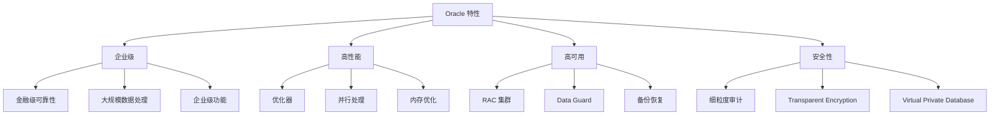

# ：Oracle 快速入门

> **难度等级**：⭐⭐ 进阶 | **学习时长**：6小时 | **实战项目**：企业级数据库应用

## 📚 本章目录

- [5.1 Oracle 概述](#51-oracle-概述)
- [5.2 安装与配置](#52-安装与配置)
- [5.3 Oracle 数据类型](#53-oracle-数据类型)
- [5.4 SQL 与 PL/SQL](#54-sql-与-plsql)
- [5.5 表与约束](#55-表与约束)
- [5.6 索引与性能](#56-索引与性能)
- [5.7 事务与并发](#57-事务与并发)
- [5.8 用户权限管理](#58-用户权限管理)

---

## Oracle 概述

### 什么是 Oracle？

**Oracle Database** 是甲骨文公司企业级关系型数据库管理系统：



### Oracle vs 其他数据库

| 特性 | Oracle | MySQL | PostgreSQL |
|-----|--------|-------|------------|
| **许可** | 商业/Express | 开源 | 开源 |
| **ACID** | 完整支持 | 完整支持 | 完整支持 |
| **并发** | 多版本读一致性 | MVCC | MVCC |
| **存储过程** | PL/SQL | 存储过程/函数 | PL/pgSQL |
| **分区** | 强大 | 支持 | 支持 |
| **集群** | RAC | 集群复制 | HA/Patrroni |
| **应用场景** | 金融、电信、大型企业 | Web应用、中小型企业 | 复杂查询、GIS |

### 应用场景

- **金融系统**：银行核心、证券交易、保险
- **电信行业**：计费系统、CRM、数据分析
- **大型企业**：ERP、CRM、SCM
- **政府机构**：税务、社保、公共服务

---

## 安装与配置

### Docker 安装（开发测试）

```bash
# 1. 拉取 Oracle Express 镜像
docker pull gvenzl/oracle-xe:21-slim

# 2. 启动容器
docker run -d \
  --name oracle21 \
  -p 1521:1521 \
  -e ORACLE_PASSWORD=Oracle123 \
  gvenzl/oracle-xe:21-slim

# 3. 等待数据库启动（约2分钟）
docker logs -f oracle21

# 4. 连接数据库
docker exec -it oracle21 sqlplus sys/Oracle123@XE as sysdba
```

### Oracle 官方版本

对于生产环境，建议使用 Oracle 官方版本：

1. **下载 Oracle Database**：
   - 访问 Oracle 官网
   - 下载 Oracle Database 21c Express
   - 或下载企业版（需要许可证）

2. **安装步骤**（Linux）：
```bash
# 安装依赖
yum install -y binutils compat-libcap1 compat-libstdc++-33 \
  gcc gcc-c++ glibc glibc-devel ksh libaio libaio-devel \
  libgcc libstdc++ libstdc++--devel make sysstat unixODBC

# 创建用户和组
groupadd -g 54321 oinstall
groupadd -g 54322 dba
useradd -u 54321 -g oinstall -G dba oracle

# 解压并安装
unzip linuxx64_213000_database.zip
./runInstaller
```

### 基础配置

```sql
-- 1. 创建用户
CREATE USER scott IDENTIFIED BY tiger;

-- 2. 授予连接权限
GRANT CONNECT, RESOURCE TO scott;

-- 3. 授予 DBA 权限（开发环境）
GRANT DBA TO scott;

-- 4. 解锁用户（HR 示例用户）
ALTER USER hr ACCOUNT UNLOCK;
ALTER USER hr IDENTIFIED BY hr;

-- 5. 查看用户状态
SELECT username, account_status FROM dba_users;
```

---

## Oracle 数据类型

### 字符类型

```sql
-- 1. CHAR：定长字符串，最大2000字节
CREATE TABLE test_char (
    id INT,
    name CHAR(50)  -- 固定50字节，不足补空格
);

-- 2. VARCHAR2：变长字符串，最大4000字节（推荐）
CREATE TABLE test_varchar (
    id INT,
    name VARCHAR2(100)  -- 可变长，节省空间
);

-- 3. NCHAR/NVARCHAR2：Unicode 字符串
CREATE TABLE test_nvarchar (
    id INT,
    chinese_name NVARCHAR2(100)  -- 支持中文等Unicode字符
);

-- 4. CLOB：大字符数据，最大4GB
CREATE TABLE documents (
    id INT,
    content CLOB  -- 存储大文本
);
```

### 数值类型

```sql
-- 1. NUMBER：通用数值类型
CREATE TABLE test_number (
    int_col NUMBER(10),      -- 整数，最多10位
    decimal_col NUMBER(10,2) -- 小数，总共10位，小数点后2位
);

-- 2. INTEGER：整数类型
CREATE TABLE test_int (
    id INTEGER,
    count INT
);

-- 3. BINARY_FLOAT/BINARY_DOUBLE：浮点数（IEEE 754标准）
CREATE TABLE test_float (
    f1 BINARY_FLOAT,   -- 32位浮点
    f2 BINARY_DOUBLE   -- 64位浮点
);

-- 4. PLS_INTEGER：PL/SQL 整数（性能更好）
DECLARE
    v_count PLS_INTEGER := 0;
BEGIN
    v_count := v_count + 1;
END;
```

### 日期类型

```sql
-- 1. DATE：日期时间，精确到秒
CREATE TABLE test_date (
    event_date DATE
);

INSERT INTO test_date VALUES (SYSDATE);  -- 当前日期时间
INSERT INTO test_date VALUES (SYSDATE + 1);  -- 明天

-- 2. TIMESTAMP：时间戳，精确到小数秒
CREATE TABLE test_timestamp (
    event_time TIMESTAMP(6)  -- 精确到微秒
);

-- 3. INTERVAL：时间间隔
CREATE TABLE test_interval (
    duration INTERVAL DAY TO SECOND
);

INSERT INTO test_interval VALUES (INTERVAL '2' DAY);
```

### 大对象类型

```sql
-- 1. BLOB：二进制大对象，最大4GB
CREATE TABLE files (
    id INT,
    file_data BLOB
);

-- 2. CLOB：字符大对象，最大4GB
CREATE TABLE articles (
    id INT,
    content CLOB
);

-- 3. BFILE：外部文件二进制指针
CREATE TABLE external_files (
    id INT,
    file_path BFILE
);
```

---

## SQL 与 PL/SQL

### SQL 基础差异

```sql
-- Oracle 特有的分页查询（使用 ROWNUM）
SELECT * FROM (
    SELECT a.*, ROWNUM rn FROM (
        SELECT * FROM employees ORDER BY salary DESC
    ) a WHERE ROWNUM <= 20
) WHERE rn > 10;

-- Oracle 12c+ 使用 OFFSET FETCH（标准SQL）
SELECT * FROM employees
ORDER BY salary DESC
OFFSET 10 ROWS FETCH NEXT 10 ROWS ONLY;

-- Oracle 的序列（自增ID）
CREATE SEQUENCE seq_users
    START WITH 1
    INCREMENT BY 1
    NOCACHE;

-- 使用序列
INSERT INTO users (id, username) VALUES (seq_users.NEXTVAL, 'alice');

-- 获取当前值
SELECT seq_users.CURRVAL FROM dual;

-- Dual 表（Oracle 特有）
SELECT 1 + 1 FROM dual;
SELECT SYSDATE FROM dual;
```

### PL/SQL 基础

```sql
-- 1. 匿名块
DECLARE
    v_name VARCHAR2(100);
    v_salary NUMBER(10,2);
BEGIN
    SELECT first_name, salary INTO v_name, v_salary
    FROM employees
    WHERE employee_id = 100;

    DBMS_OUTPUT.PUT_LINE('Name: ' || v_name);
    DBMS_OUTPUT.PUT_LINE('Salary: ' || v_salary);
END;
/

-- 2. 条件语句
DECLARE
    v_score NUMBER := 85;
BEGIN
    IF v_score >= 90 THEN
        DBMS_OUTPUT.PUT_LINE('A');
    ELSIF v_score >= 80 THEN
        DBMS_OUTPUT.PUT_LINE('B');
    ELSE
        DBMS_OUTPUT.PUT_LINE('C');
    END IF;
END;
/

-- 3. 循环语句
-- FOR 循环
BEGIN
    FOR i IN 1..10 LOOP
        DBMS_OUTPUT.PUT_LINE('Count: ' || i);
    END LOOP;
END;
/

-- WHILE 循环
DECLARE
    v_count NUMBER := 1;
BEGIN
    WHILE v_count <= 10 LOOP
        DBMS_OUTPUT.PUT_LINE('Count: ' || v_count);
        v_count := v_count + 1;
    END LOOP;
END;
/

-- 4. 游标
DECLARE
    CURSOR emp_cur IS
        SELECT employee_id, first_name, salary
        FROM employees
        WHERE department_id = 90;
BEGIN
    FOR emp_rec IN emp_cur LOOP
        DBMS_OUTPUT.PUT_LINE(
            'ID: ' || emp_rec.employee_id ||
            ', Name: ' || emp_rec.first_name ||
            ', Salary: ' || emp_rec.salary
        );
    END LOOP;
END;
/
```

### 存储过程

```sql
-- 1. 创建存储过程
CREATE OR REPLACE PROCEDURE raise_salary(
    p_employee_id IN employees.employee_id%TYPE,
    p_increase IN NUMBER
) AS
    v_current_salary NUMBER(10,2);
BEGIN
    -- 获取当前工资
    SELECT salary INTO v_current_salary
    FROM employees
    WHERE employee_id = p_employee_id;

    -- 更新工资
    UPDATE employees
    SET salary = salary * (1 + p_increase / 100)
    WHERE employee_id = p_employee_id;

    COMMIT;

    DBMS_OUTPUT.PUT_LINE(
        'Salary updated from ' || v_current_salary ||
        ' to ' || v_current_salary * (1 + p_increase / 100)
    );
EXCEPTION
    WHEN NO_DATA_FOUND THEN
        DBMS_OUTPUT.PUT_LINE('Employee not found');
    WHEN OTHERS THEN
        DBMS_OUTPUT.PUT_LINE('Error: ' || SQLERRM);
        ROLLBACK;
END;
/

-- 2. 调用存储过程
EXEC raise_salary(100, 10);

-- 或在 PL/SQL 中调用
BEGIN
    raise_salary(100, 10);
END;
/
```

### 函数

```sql
-- 1. 创建函数
CREATE OR REPLACE FUNCTION get_annual_salary(
    p_employee_id IN employees.employee_id%TYPE
) RETURN NUMBER IS
    v_annual_salary NUMBER(10,2);
BEGIN
    SELECT salary * 12 INTO v_annual_salary
    FROM employees
    WHERE employee_id = p_employee_id;

    RETURN v_annual_salary;
EXCEPTION
    WHEN NO_DATA_FOUND THEN
        RETURN 0;
END;
/

-- 2. 调用函数
SELECT employee_id, first_name, get_annual_salary(employee_id) AS annual_salary
FROM employees;
```

---

## 表与约束

### 创建表

```sql
-- 1. 基础建表
CREATE TABLE employees (
    employee_id NUMBER(6) PRIMARY KEY,
    first_name VARCHAR2(50),
    last_name VARCHAR2(50) NOT NULL,
    email VARCHAR2(100) UNIQUE,
    hire_date DATE DEFAULT SYSDATE,
    salary NUMBER(10,2) CHECK (salary > 0)
);

-- 2. 使用子查询创建表
CREATE TABLE emp_dept AS
SELECT e.employee_id, e.first_name, e.department_id, d.department_name
FROM employees e
INNER JOIN departments d ON e.department_id = d.department_id;

-- 3. 创建临时表
CREATE GLOBAL TEMPORARY TABLE temp_emp (
    employee_id NUMBER,
    employee_name VARCHAR2(100)
) ON COMMIT PRESERVE ROWS;  -- 事务提交后保留数据

-- 或 ON COMMIT DELETE ROWS;  -- 事务提交后删除数据
```

### 约束

```sql
-- 1. 主键约束
ALTER TABLE employees ADD CONSTRAINT pk_emp PRIMARY KEY (employee_id);

-- 2. 外键约束
ALTER TABLE employees ADD CONSTRAINT fk_emp_dept
FOREIGN KEY (department_id)
REFERENCES departments(department_id);

-- 3. 唯一约束
ALTER TABLE employees ADD CONSTRAINT uk_emp_email UNIQUE (email);

-- 4. 检查约束
ALTER TABLE employees ADD CONSTRAINT ck_emp_salary
CHECK (salary BETWEEN 1000 AND 100000);

-- 5. 非空约束
ALTER TABLE employees MODIFY (first_name NOT NULL);

-- 6. 约束命名规则
-- pk_ : Primary Key
-- fk_ : Foreign Key
-- uk_ : Unique Key
-- ck_ : Check
-- nn_ : Not Null
```

### 修改表

```sql
-- 1. 添加列
ALTER TABLE employees ADD (phone_number VARCHAR2(20));

-- 2. 修改列
ALTER TABLE employees MODIFY (phone_number VARCHAR2(30));

-- 3. 删除列
ALTER TABLE employees DROP COLUMN phone_number;

-- 4. 重命名列
ALTER TABLE employees RENAME COLUMN first_name TO fname;

-- 5. 重命名表
ALTER TABLE employees RENAME TO emp;

-- 6. 删除表
DROP TABLE emp PURGE;  -- PURGE 彻底删除，不进回收站
```

---

## 索引与性能

### 创建索引

```sql
-- 1. B-Tree 索引（默认）
CREATE INDEX idx_emp_last_name ON employees(last_name);

-- 2. 唯一索引
CREATE UNIQUE INDEX idx_emp_email ON employees(email);

-- 3. 复合索引
CREATE INDEX idx_emp_dept_sal ON employees(department_id, salary);

-- 4. 函数索引
CREATE INDEX idx_emp_upper_name ON employees(UPPER(last_name));

-- 5. 反向键索引（减少块争用）
CREATE INDEX idx_emp_id_reverse ON employees(employee_id) REVERSE;

-- 6. 位图索引（低基数列）
CREATE BITMAP INDEX idx_emp_gender ON employees(gender);
```

### 查看执行计划

```sql
-- 1. 使用 AUTOTRACE
SET AUTOTRACE ON;
SELECT * FROM employees WHERE last_name = 'King';
SET AUTOTRACE OFF;

-- 2. 使用 EXPLAIN PLAN
EXPLAIN PLAN FOR
SELECT * FROM employees WHERE department_id = 90;

SELECT * FROM TABLE(DBMS_XPLAN.DISPLAY);

-- 3. SQL Trace
ALTER SESSION SET SQL_TRACE = TRUE;
-- 执行 SQL
ALTER SESSION SET SQL_TRACE = FALSE;

-- 查看 Trace 文件
SELECT value FROM v$diag_info WHERE name = 'Default Trace File';
```

---

## 事务与并发

### 事务控制

```sql
-- 1. 显式事务
BEGIN;
    UPDATE employees SET salary = salary * 1.1 WHERE employee_id = 100;
    INSERT INTO log VALUES (user, sysdate, 'Salary updated');
COMMIT;

-- 2. 回滚事务
BEGIN;
    UPDATE employees SET salary = 99999 WHERE employee_id = 100;
    ROLLBACK;

-- 3. 保存点
BEGIN;
    UPDATE employees SET salary = 50000 WHERE employee_id = 100;
    SAVEPOINT sp1;
    UPDATE employees SET salary = 60000 WHERE employee_id = 200;
    ROLLBACK TO sp1;
COMMIT;

-- 4. 设置事务隔离级别
ALTER SESSION SET ISOLATION_LEVEL READ COMMITTED;
ALTER SESSION SET ISOLATION LEVEL SERIALIZABLE;
```

### 并发控制

```sql
-- 1. SELECT FOR UPDATE（行锁）
SELECT * FROM employees WHERE department_id = 10
FOR UPDATE;

-- 2. SELECT FOR UPDATE SKIP LOCKED（跳过锁定的行）
SELECT * FROM employees WHERE department_id = 10
FOR UPDATE SKIP LOCKED;

-- 3. SELECT FOR UPDATE NOWAIT（不等待锁）
SELECT * FROM employees WHERE department_id = 10
FOR UPDATE NOWAIT;

-- 4. 死锁检测
-- Oracle 自动检测死锁并回滚其中一个事务
SELECT * FROM v$lock WHERE type = 'TX';
```

---

## 用户权限管理

### 创建用户

```sql
-- 1. 创建用户
CREATE USER john IDENTIFIED BY password123
DEFAULT TABLESPACE users
QUOTA 100M ON users;

-- 2. 修改密码
ALTER USER john IDENTIFIED BY new_password;

-- 3. 解锁/锁定用户
ALTER USER john ACCOUNT UNLOCK;
ALTER USER john ACCOUNT LOCK;

-- 4. 删除用户
DROP USER john CASCADE;
```

### 权限管理

```sql
-- 1. 系统权限
GRANT CREATE SESSION, CREATE TABLE TO john;
GRANT CREATE VIEW, CREATE SEQUENCE TO john;
GRANT DBA TO john;  -- DBA 权限（开发环境）

-- 2. 对象权限
GRANT SELECT, INSERT, UPDATE, DELETE ON scott.employees TO john;
GRANT ALL ON scott.employees TO john;
GRANT SELECT ON scott.employees TO PUBLIC;

-- 3. 角色（简化权限管理）
CREATE ROLE hr_manager;
GRANT SELECT, INSERT, UPDATE ON hr.employees TO hr_manager;
GRANT hr_manager TO alice, bob;

-- 4. 回收权限
REVOKE DELETE ON scott.employees FROM john;
REVOKE hr_manager FROM bob;
```

### 概要文件

```sql
-- 1. 创建概要文件
CREATE PROFILE developer_profile LIMIT
    SESSIONS_PER_USER 5
    CPU_PER_SESSION 10000
    CPU_PER_CALL 1000
    CONNECT_TIME 60
    IDLE_TIME 30
    LOGICAL_READS_PER_SESSION 10000;

-- 2. 分配概要文件
ALTER USER john PROFILE developer_profile;

-- 3. 创建密码概要文件
CREATE PROFILE password_profile LIMIT
    PASSWORD_LIFE_TIME 90
    PASSWORD_GRACE_TIME 10
    PASSWORD_REUSE_TIME 1800
    PASSWORD_VERIFY_FUNCTION verify_function
    FAILED_LOGIN_ATTEMPTS 3
    PASSWORD_LOCK_TIME 1;
```

---

## ✅ 本章小结

### 学习检查清单

完成本章学习后，请确认你能够：

- [ ] 安装和配置 Oracle 数据库
- [ ] 理解 Oracle 数据类型
- [ ] 编写 PL/SQL 代码
- [ ] 创建存储过程和函数
- [ ] 设计表和约束
- [ ] 创建和优化索引
- [ ] 管理事务和并发
- [ ] 管理用户和权限

### 核心要点回顾

1. **Oracle 特性**：企业级、高可用、高性能
2. **数据类型**：NUMBER、VARCHAR2、DATE、CLOB/BLOB
3. **PL/SQL**：存储过程、函数、游标、异常处理
4. **约束**：PRIMARY KEY、FOREIGN KEY、UNIQUE、CHECK
5. **权限**：系统权限、对象权限、角色、概要文件

## 📚 延伸阅读

- [第4章：PostgreSQL 16 快速入门 →](./chapter-04)
- [第6章：Redis 缓存设计与实战 →](./chapter-06)
- [第17章：达梦 DM8 迁移实战 →](./chapter-16)
- [Oracle 官方文档](https://docs.oracle.com/en/database/)

---

**更新时间**：2026年2月 | **版本**：v1.0
