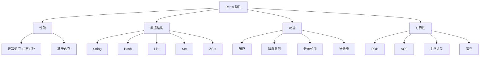

# ：Redis 缓存设计与实战

> **难度等级**：⭐⭐ 进阶 | **学习时长**：5小时 | **实战项目**：秒杀系统缓存方案

## 📚 本章目录

- [5.1 Redis 概述](#51-redis-概述)
- [5.2 安装与配置](#52-安装与配置)
- [5.3 数据类型与使用场景](#53-数据类型与使用场景)
- [5.4 持久化机制](#54-持久化机制)
- [5.5 主从与哨兵](#55-主从与哨兵)
- [5.6 集群模式](#56-集群模式)
- [5.7 缓存设计模式](#57-缓存设计模式)
- [5.8 常见问题与解决方案](#58-常见问题与解决方案)

---

## Redis 概述

### 什么是 Redis？

**Redis** (Remote Dictionary Server) 是开源的内存数据结构存储系统：



### Redis vs Memcached

| 特性 | Redis | Memcached |
|-----|-------|-----------|
| **数据类型** | 丰富 | 仅字符串 |
| **持久化** | 支持 | 不支持 |
| **单线程** | 是（6.0后支持多线程IO） | 是 |
| **集群** | 原生支持 | 需要客户端或代理 |
| **内存效率** | 较低 | 高 |

### 应用场景

- **缓存**：热点数据、页面缓存
- **排行榜**：积分榜、热度榜
- **计数器**：点赞数、浏览数
- **分布式锁**：防重复提交
- **消息队列**：发布订阅、列表队列
- **会话存储**：用户登录状态
- **限流**：API 请求限流

---

## 安装与配置

### Docker 安装

```bash
# 拉取镜像
docker pull redis:7

# 启动容器
docker run -d \
  --name redis7 \
  -p 6379:6379 \
  -v /data/redis:/data \
  -v /data/redis/conf/redis.conf:/usr/local/etc/redis/redis.conf \
  redis:7 \
  redis-server /usr/local/etc/redis/redis.conf \
  --appendonly yes

# 连接 Redis
docker exec -it redis7 redis-cli

# 带密码连接
redis-cli -a your_password
```

### 配置文件

```ini
# redis.conf

# 网络配置
bind 0.0.0.0
port 6379
protected-mode yes
requirepass your_password

# 持久化配置
save 900 1        # 900秒内至少1个key变化则保存
save 300 10       # 300秒内至少10个key变化则保存
save 60 10000     # 60秒内至少10000个key变化则保存

appendonly yes    # 开启 AOF
appendfsync everysec

# 内存配置
maxmemory 2gb
maxmemory-policy allkeys-lru  # 内存满时删除最少使用的key

# 慢查询配置
slowlog-log-slower-than 10000  # 超过10ms记录慢查询
slowlog-max-len 128            # 最多记录128条

# 日志配置
loglevel notice
logfile "/var/log/redis/redis.log"
```

### 基础命令

```bash
# 连接 Redis
redis-cli -h host -p port -a password

# Key 操作
SET key value
GET key
DEL key
EXISTS key
EXPIRE key 3600    # 设置过期时间（秒）
TTL key            # 查看剩余过期时间

# 批量操作
MSET key1 value1 key2 value2
MGET key1 key2

# 服务器命令
INFO               # 查看服务器信息
DBSIZE             # 查看key数量
FLUSHDB            # 清空当前数据库
FLUSHALL           # 清空所有数据库
SHUTDOWN           # 关闭服务器
```

---

## 数据类型与使用场景

### String 字符串

```bash
// 基础操作
SET user:1:name "alice"
GET user:1:name

// 设置过期时间
SET session:token "value" EX 3600

// 不存在才设置（分布式锁）
SET lock:resource "value" NX EX 10

// 计数器
INCR views:page:1      # 自增
DECR stock:product:1   # 自减
INCRBY likes:post:1 10 # 增加指定值

// 场景：缓存用户信息
SET user:1001 '{"id":1001,"name":"alice","email":"alice@example.com"}' EX 3600
GET user:1001
```

### Hash 哈希

```bash
# 基础操作
HSET user:1001 name "alice"
HSET user:1001 email "alice@example.com"
HSET user:1001 age 25

HGET user:1001 name
HMGET user:1001 name email
HGETALL user:1001

# 场景：购物车
HADD cart:user:1001 product:1 2
HADD cart:user:1001 product:2 1
HINCRBY cart:user:1001 product:1 1  # 商品数量+1

# 场景：存储对象
HMSET article:1001 title "Redis入门" views 0 likes 0
HINCRBY article:1001 views 1  # 浏览数+1
```

### List 列表

```bash
# 基础操作
LPUSH list:value "value1" "value2" "value3"  # 左侧插入
RPUSH list:value "value4"                     # 右侧插入
LPOP list:value                               # 左侧弹出
RPOP list:value                               # 右侧弹出
LRANGE list:value 0 -1                        # 获取所有元素

# 场景：消息队列（FIFO）
LPUSH queue:order '{"orderId":1}'
RPOP queue:order

# 场景：最新列表（微博时间线）
LPUSH timeline:user:1001 "新消息内容"
LRANGE timeline:user:1001 0 9  # 获取最新10条

# 场景：阻塞队列（消费者）
BRPOP queue:order 0  # 阻塞等待，0表示永久等待
```

### Set 集合

```bash
# 基础操作
SADD set:value "value1" "value2" "value3"
SMEMBERS set:value
SISMEMBER set:value "value1"  # 判断是否存在
SCARD set:value                # 元素个数

# 集合运算
SADD set:a 1 2 3
SADD set:b 2 3 4
SINTER set:a set:b  # 交集 {2, 3}
SUNION set:a set:b  # 并集 {1, 2, 3, 4}
SDIFF set:a set:b   # 差集 {1}

# 场景：共同好友
SADD friends:user:1001 1002 1003 1004
SADD friends:user:1002 1003 1004 1005
SINTER friends:user:1001 friends:user:1002  # {1003, 1004}

# 场景：标签系统
SADD tags:post:1 "redis" "database" "cache"
SADD tags:post:2 "mysql" "database"
SINTER tags:post:1 tags:post:2  # {database}
```

### ZSet 有序集合

```bash
# 基础操作
ZADD zset:value 10 "value1"
ZADD zset:value 20 "value2"
ZADD zset:value 15 "value3"

ZRANGE zset:value 0 -1      # 从低到高
ZRANGE zset:value 0 -1 WITHSCORES  # 带分数
ZREVRANGE zset:value 0 -1   # 从高到低
ZRANK zset:value "value1"   # 排名（从低到高）
ZREVRANK zset:value "value1"  # 排名（从高到低）

# 范围查询
ZRANGEBYSCORE zset:value 10 20
ZCOUNT zset:value 10 20

# 场景：排行榜
ZADD rank:score user:1001 1000
ZADD rank:score user:1002 1500
ZADD rank:score user:1003 1200
ZREVRANGE rank:score 0 9 WITHSCORES  # Top 10

# 场景：延时队列
ZADD delay:queue 1705305600 "task1"  # 时间戳作为score
ZRANGEBYSCORE delay:queue 0 1705305600  # 获取到期的任务
ZREM delay:queue "task1"  # 删除已处理任务
```

---

## 持久化机制

### RDB 快照

```ini
# redis.conf 配置
save 900 1
save 300 10
save 60 10000

# 手动触发
BGSAVE  # 后台保存
SAVE    # 前台保存（阻塞）

# 优势
# - 文件紧凑，恢复速度快
# - 适合备份

# 劣势
# - 可能丢失最后一次快照后的数据
# - fork子进程消耗内存
```

### AOF 日志

```ini
# redis.conf 配置
appendonly yes
appendfilename "appendonly.aof"
appendfsync everysec  # always/everysec/no

# AOF 重写
auto-aof-rewrite-percentage 100
auto-aof-rewrite-min-size 64mb

# 手动触发
BGREWRITEAOF

# 优势
# - 数据更安全
# - 可读的日志文件

# 劣势
# - 文件大
# - 恢复速度慢
```

### 混合持久化

```ini
# Redis 4.0+ 支持
aof-use-rdb-preamble yes

# AOF 文件包含：
# - RDB 格式的快照（前半部分）
# - AOF 格式的增量日志（后半部分）

# 结合两者优点：
# - 恢复速度快（RDB部分）
# - 数据完整（AOF部分）
```

---

## 主从与哨兵

### 主从复制

```bash
# 从库配置
replicaof master_ip master_port
masterauth master_password

# 查看复制状态
INFO replication

# 手动触发同步
SYNC  # 全量同步
PSYNC replication_id offset  # 部分同步

# 只读模式
replica-serve-stale-data yes
replica-read-only yes
```

### 哨兵模式

```ini
# sentinel.conf
port 26379
sentinel monitor mymaster master_ip 6379 2  # 2表示需要2个哨兵同意才故障转移
sentinel auth-pass mymaster password
sentinel down-after-milliseconds mymaster 5000
sentinel parallel-syncs mymaster 1
sentinel failover-timeout mymaster 30000
```

```bash
# 启动哨兵
redis-sentinel /path/to/sentinel.conf

# 查看哨兵状态
redis-cli -p 26379
SENTINEL masters
SENTINEL slaves mymaster
SENTINEL get-master-addr-by-name mymaster
```

---

## 集群模式

### 集群架构

```
Redis Cluster 架构：
├─ 16384 个槽位（slot）
├─ 每个节点负责一部分槽位
├─ 节点之间通过 Gossip 协议通信
└─ 自动故障转移

槽位分配：
Node 1: slot 0 - 5460
Node 2: slot 5461 - 10922
Node 3: slot 10923 - 16383
```

### 集群配置

```bash
# 创建集群
redis-cli --cluster create \
  127.0.0.1:7001 \
  127.0.0.1:7002 \
  127.0.0.1:7003 \
  127.0.0.1:7004 \
  127.0.0.1:7005 \
  127.0.0.1:7006 \
  --cluster-replicas 1

# 查看集群状态
redis-cli -c -p 7001
CLUSTER INFO
CLUSTER NODES

# 槽位操作
CLUSTER ADDSLOTS 0 1 2 ... 5460
CLUSTER DELSLOTS 0 1 2 ...
CLUSTER KEYSLOT key  # 查看key在哪个槽位

# 节点操作
CLUSTER MEET ip port  # 添加节点
CLUSTER FORGET nodeid  # 移除节点
CLUSTER REPLICATE nodeid  # 设置复制关系
```

---

## 缓存设计模式

### Cache Aside 旁路缓存

```python
# 读取
def get_user(user_id):
    # 1. 先查缓存
    user = redis.get(f"user:{user_id}")
    if user:
        return json.loads(user)

    # 2. 缓存未命中，查数据库
    user = db.query("SELECT * FROM users WHERE id = %s", user_id)
    if user:
        # 3. 写入缓存
        redis.setex(f"user:{user_id}", 3600, json.dumps(user))
    return user

# 更新
def update_user(user_id, data):
    # 1. 更新数据库
    db.execute("UPDATE users SET ... WHERE id = %s", user_id, data)

    # 2. 删除缓存
    redis.delete(f"user:{user_id}")
```

### Read Through / Write Through

```python
# 应用程序只与缓存交互，缓存负责与数据库交互

# Read Through
def get_user(user_id):
    user = redis.get(f"user:{user_id}")
    if not user:
        # 缓存层负责从数据库加载
        user = cache_loader.load_from_db(user_id)
        redis.setex(f"user:{user_id}", 3600, user)
    return user

# Write Through
def update_user(user_id, data):
    # 同时写入缓存和数据库
    redis.setex(f"user:{user_id}", 3600, data)
    db.execute("UPDATE users SET ... WHERE id = %s", user_id, data)
```

### Write Behind 异步写入

```python
# 先写缓存，异步批量写数据库

def update_user(user_id, data):
    # 1. 立即更新缓存
    redis.setex(f"user:{user_id}", 3600, data)

    # 2. 加入队列，异步写入数据库
    queue.push(("UPDATE", user_id, data))

# 后台线程
def background_writer():
    while True:
        batch = queue.pop_batch(100)
        db.batch_update(batch)
```

---

## 常见问题与解决方案

### 缓存穿透

**问题**：查询不存在的数据，缓存和数据库都没有

**解决方案**：

```python
# 1. 布隆过滤器
bloomfilter.add(user_id)
if not bloomfilter.exists(user_id):
    return None

# 2. 缓存空对象
def get_user(user_id):
    user = redis.get(f"user:{user_id}")
    if user == "NULL":
        return None
    if user:
        return json.loads(user)

    user = db.query("SELECT * FROM users WHERE id = %s", user_id)
    if not user:
        redis.setex(f"user:{user_id}", 300, "NULL")  # 缓存空对象
        return None
    redis.setex(f"user:{user_id}", 3600, json.dumps(user))
    return user
```

### 缓存击穿

**问题**：热点key过期，大量请求直达数据库

**解决方案**：

```python
# 1. 互斥锁
def get_user(user_id):
    user = redis.get(f"user:{user_id}")
    if user:
        return json.loads(user)

    # 获取分布式锁
    lock_key = f"lock:user:{user_id}"
    lock = redis.set(lock_key, "1", NX, EX=10)
    if not lock:
        time.sleep(0.1)
        return get_user(user_id)  # 重试

    try:
        user = db.query("SELECT * FROM users WHERE id = %s", user_id)
        redis.setex(f"user:{user_id}", 3600, json.dumps(user))
        return user
    finally:
        redis.delete(lock_key)

# 2. 永不过期（逻辑过期）
def get_user(user_id):
    user = redis.get(f"user:{user_id}")
    if user:
        data = json.loads(user)
        if data["expire_time"] > time.time():
            return data
        # 异步刷新
        async_refresh(user_id)
        return data  # 返回过期数据
```

### 缓存雪崩

**问题**：大量key同时过期，数据库压力激增

**解决方案**：

```python
# 1. 过期时间加随机值
expire_time = 3600 + random.randint(0, 300)
redis.setex(key, expire_time, value)

# 2. 多级缓存
def get_user(user_id):
    # L1: 本地缓存
    user = local_cache.get(f"user:{user_id}")
    if user:
        return user

    # L2: Redis 缓存
    user = redis.get(f"user:{user_id}")
    if user:
        local_cache.set(f"user:{user_id}", user, 60)
        return json.loads(user)

    # L3: 数据库
    user = db.query("SELECT * FROM users WHERE id = %s", user_id)
    redis.setex(f"user:{user_id}", 3600, json.dumps(user))
    local_cache.set(f"user:{user_id}", user, 60)
    return user

# 3. 限流降级
def get_user(user_id):
    if rate_limiter.is_exceeded():
        return default_response  # 降级返回默认值
    ...
```

---

## ✅ 本章小结

### 学习检查清单

完成本章学习后，请确认你能够：

- [ ] 理解 Redis 的特性和应用场景
- [ ] 安装和配置 Redis
- [ ] 掌握 5 种数据类型的使用
- [ ] 理解 RDB 和 AOF 持久化机制
- [ ] 配置主从复制和哨兵
- [ ] 搭建 Redis 集群
- [ ] 设计缓存方案（Cache Aside、Read Through）
- [ ] 解决缓存穿透、击穿、雪崩问题

### 核心要点回顾

1. **5种数据类型**：String、Hash、List、Set、ZSet
2. **持久化**：RDB（快照）、AOF（日志）、混合持久化
3. **高可用**：主从复制、哨兵、集群
4. **缓存模式**：Cache Aside、Read Through、Write Behind
5. **常见问题**：缓存穿透、击穿、雪崩

## 📚 延伸阅读

- [第4章：PostgreSQL 16 高级特性 →](./chapter-04)
- [第7章：实战项目1 - 个人博客数据库设计 →](./chapter-07)
- [Redis 官方文档](https://redis.io/docs/)

---

**更新时间**：2026年2月 | **版本**：v1.0
