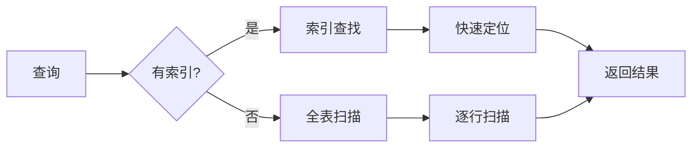
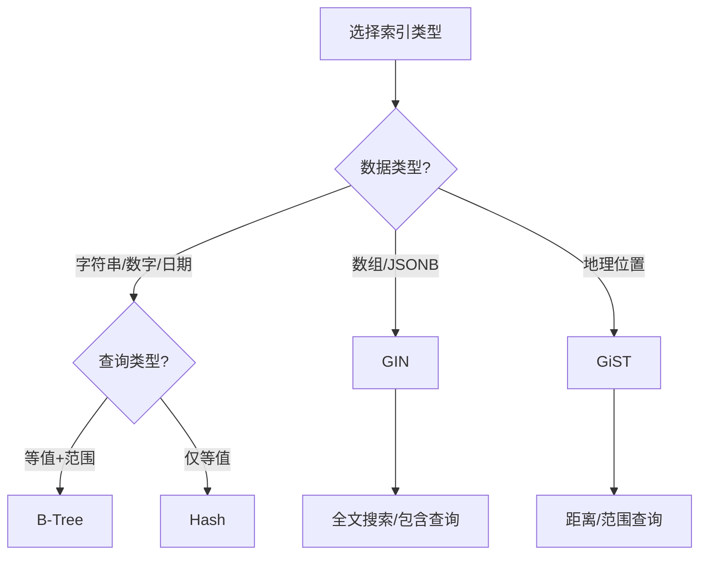

# ：索引优化与性能调优

> **难度等级**：⭐⭐⭐ 高级 | **学习时长**：8小时 | **实战项目**：千万级数据索引优化

## 📚 本章目录

- [9.1 索引基础](#91-索引基础)
- [9.2 索引类型选择](#92-索引类型选择)
- [9.3 复合索引设计](#93-复合索引设计)
- [9.4 部分索引与表达式索引](#94-部分索引与表达式索引)
- [9.5 查询计划分析](#95-查询计划分析)
- [9.6 性能调优实践](#96-性能调优实践)
- [9.7 索引维护策略](#97-索引维护策略)
- [9.8 实战案例分析](#98-实战案例分析)

---

## 索引基础

### 什么是索引？

索引是数据库中用于**快速定位数据**的数据结构，类似于书籍的目录。



### 索引的数据结构

```sql
-- B-Tree 索引结构（最常用）
-- 适合：范围查询、等值查询、排序
CREATE INDEX idx_btree ON users(age);

-- Hash 索引结构
-- 适合：等值查询，不支持范围查询
CREATE INDEX idx_hash ON users USING HASH (email);

-- GIN 索引（倒排索引）
-- 适合：数组、JSONB、全文搜索
CREATE INDEX idx_gin ON articles USING GIN (tags);

-- GiST 索引（通用搜索树）
-- 适合：地理数据、全文搜索
CREATE INDEX idx_gist ON places USING GiST (location);
```

### 索引的代价

| 优势 | 代价 |
|-----|-----|
| 加速查询 | 占用存储空间 |
| 减少IO | 降低写入性能 |
| 优化排序 | 需要维护索引 |
| 支持唯一约束 | 索引碎片化 |

---

## 索引类型选择

### B-Tree 索引（默认）

**适用场景**：
- 等值查询：`WHERE age = 25`
- 范围查询：`WHERE age BETWEEN 20 AND 30`
- 排序：`ORDER BY created_at DESC`
- 前缀匹配：`WHERE name LIKE 'Zhang%'`

```sql
-- 创建 B-Tree 索引
CREATE INDEX idx_age ON users(age);
CREATE INDEX idx_created_at ON orders(created_at DESC);

-- 复合 B-Tree 索引
CREATE INDEX idx_user_status ON orders(user_id, status, created_at);
```

**查询示例**：
```sql
-- ✅ 使用索引
SELECT * FROM users WHERE age = 25;
SELECT * FROM orders WHERE user_id = 123 AND status = 1;

-- ✅ 范围查询
SELECT * FROM users WHERE age BETWEEN 20 AND 30;
SELECT * FROM orders WHERE created_at >= '2024-01-01';

-- ❌ 不使用索引（函数破坏索引）
SELECT * FROM users WHERE YEAR(created_at) = 2024;

-- ✅ 改写后使用索引
SELECT * FROM users
WHERE created_at >= '2024-01-01' AND created_at < '2025-01-01';
```

### Hash 索引

**适用场景**：
- 只用于等值查询：`=、IN、<=>`
- 不支持范围查询、排序

```sql
-- PostgreSQL 创建 Hash 索引
CREATE INDEX idx_hash_email ON users USING HASH (email);

-- 查询示例
-- ✅ 使用 Hash 索引
SELECT * FROM users WHERE email = 'test@example.com';
SELECT * FROM users WHERE email IN ('a@ex.com', 'b@ex.com');

-- ❌ Hash 索引不支持
SELECT * FROM users WHERE email LIKE 'test%';
SELECT * FROM users WHERE email > 'a@ex.com';
```

**B-Tree vs Hash 对比**：

| 特性 | B-Tree | Hash |
|-----|--------|------|
| 等值查询 | O(log n) | O(1) |
| 范围查询 | 支持 | 不支持 |
| 排序 | 支持 | 不支持 |
| 占用空间 | 较大 | 较小 |
| 使用场景 | 通用 | 只等值查询 |

### GIN 索引

**适用场景**：
- 数组类型：`WHERE tags @> ARRAY['post']`
- JSONB 类型：`WHERE data->>'category' = 'tech'`
- 全文搜索：`WHERE to_tsvector(content) @@ to_tsquery('database')`

```sql
-- 数组类型索引
CREATE TABLE articles (
    id BIGSERIAL PRIMARY KEY,
    title VARCHAR(200),
    tags TEXT[],
    content TEXT
);

CREATE INDEX idx_tags ON articles USING GIN (tags);

-- 查询示例
SELECT * FROM articles WHERE tags @> ARRAY['database'];  -- 包含
SELECT * FROM articles WHERE tags && ARRAY['database', 'sql'];  -- 交集
SELECT * FROM articles WHERE tags @> ARRAY['postgresql', 'index'];  -- 包含所有

-- JSONB 索引
CREATE TABLE products (
    id BIGSERIAL PRIMARY KEY,
    name VARCHAR(200),
    attributes JSONB
);

CREATE INDEX idx_attributes ON products USING GIN (attributes);

-- 查询示例
SELECT * FROM products WHERE attributes->>'color' = 'red';
SELECT * FROM products WHERE attributes ? 'brand';  -- 包含键
SELECT * FROM products WHERE attributes @> '{"size": "M"}';  -- 包含JSON
```

### GiST 索引

**适用场景**：
- 地理数据：PostGIS 扩展
- 全文搜索：tsvector 类型
- 范围类型：int4range、tsrange

```sql
-- 创建 PostGIS 扩展
CREATE EXTENSION postgis;

-- 地理位置表
CREATE TABLE places (
    id BIGSERIAL PRIMARY KEY,
    name VARCHAR(200),
    location GEOGRAPHY(POINT, 4326)
);

CREATE INDEX idx_location ON places USING GIST (location);

-- 查询示例（查找5公里内的地点）
SELECT name, ST_Distance(location, ST_MakePoint(116.404, 39.915)::GEOGRAPHY) AS distance
FROM places
WHERE ST_DWithin(location, ST_MakePoint(116.404, 39.915)::GEOGRAPHY, 5000)
ORDER BY distance;
```

**索引类型选择决策树**：



---

## 复合索引设计

### 最左前缀原则

```sql
-- 创建复合索引 (user_id, status, created_at)
CREATE INDEX idx_compound ON orders(user_id, status, created_at);

-- ✅ 使用索引的查询
WHERE user_id = 123                                    -- 使用 user_id
WHERE user_id = 123 AND status = 1                     -- 使用 user_id, status
WHERE user_id = 123 AND status = 1 AND created_at > '2024-01-01'  -- 全部使用

-- ❌ 不使用索引（跳过最左列）
WHERE status = 1                                       -- 不使用
WHERE status = 1 AND created_at > '2024-01-01'        -- 不使用
WHERE created_at > '2024-01-01'                        -- 不使用

-- ✅ 部分使用（从第二列开始，但效率低）
WHERE user_id = 123 AND created_at > '2024-01-01'     -- 只使用 user_id
```

### 索引列顺序

**原则**：
1. 区分度高的列放在前面
2. 经常查询的列放在前面
3. 范围查询的列放在最后

```sql
-- 查询区分度
SELECT
    COUNT(DISTINCT user_id) / COUNT(*) AS user_selectivity,
    COUNT(DISTINCT status) / COUNT(*) AS status_selectivity,
    COUNT(DISTINCT DATE(created_at)) / COUNT(*) AS date_selectivity
FROM orders;

-- 结果示例：
-- user_selectivity: 0.9（高）
-- status_selectivity: 0.05（低）
-- date_selectivity: 0.7（中）

-- 索引设计
-- ✅ 好：区分度高的在前
CREATE INDEX idx_good ON orders(user_id, created_at, status);

-- ❌ 差：区分度低的在前
CREATE INDEX idx_bad ON orders(status, created_at, user_id);
```

### 覆盖索引

**定义**：索引包含查询所需的所有字段，无需回表查询。

```sql
-- 创建覆盖索引
CREATE INDEX idx_covering ON orders(user_id, status, amount);

-- ✅ 覆盖索引（所有字段都在索引中）
SELECT user_id, status, amount
FROM orders
WHERE user_id = 123 AND status = 1;

-- ❌ 需要回表（查询了索引外的字段）
SELECT user_id, status, amount, created_at  -- created_at 不在索引中
FROM orders
WHERE user_id = 123 AND status = 1;

-- 完全覆盖索引方案
CREATE INDEX idx_full_cover ON orders(user_id, status, amount, created_at);

-- 查看是否使用了覆盖索引
EXPLAIN ANALYZE
SELECT user_id, status, amount FROM orders WHERE user_id = 123;
-- Output: Index Only Scan（索引只扫描）
```

### 索引下推

**MySQL 5.6+ 特性**：在索引扫描时就进行条件过滤，减少回表次数。

```sql
-- 复合索引 (name, age)
CREATE INDEX idx_name_age ON users(name, age);

-- 查询
SELECT * FROM users
WHERE name LIKE 'Zhang%' AND age > 25;

-- 执行过程：
-- 1. 使用索引定位 name LIKE 'Zhang%'
-- 2. 在索引层过滤 age > 25（索引下推）
-- 3. 只回表满足条件的数据
```

---

## 部分索引与表达式索引

### 部分索引（PostgreSQL）

**定义**：只为满足条件的行创建索引，减少索引大小。

```sql
-- 只为活跃用户创建索引
CREATE INDEX idx_active_users ON users(email)
WHERE status = 'active';

-- 查询时必须包含 WHERE 条件才能使用索引
-- ✅ 使用部分索引
SELECT * FROM users WHERE status = 'active' AND email = 'test@example.com';

-- ❌ 不使用部分索引
SELECT * FROM users WHERE email = 'test@example.com';

-- 应用场景：订单表
-- 只索引未支付的订单（频繁查询和更新）
CREATE INDEX idx_unpaid ON orders(user_id, created_at)
WHERE status = 'unpaid';

-- 只索引最近的订单
CREATE INDEX idx_recent ON orders(user_id, created_at)
WHERE created_at > CURRENT_DATE - INTERVAL '1 year';
```

**优势**：
- 减少索引存储空间
- 提高查询性能（索引更小）
- 降低写入开销（只需索引部分数据）

### 表达式索引

**定义**：对表达式的结果创建索引。

```sql
-- PostgreSQL
-- 1. 函数索引
CREATE INDEX idx_lower_email ON users(LOWER(email));

-- ✅ 使用函数索引
SELECT * FROM users WHERE LOWER(email) = 'TEST@EXAMPLE.COM';

-- 2. 计算列索引
CREATE INDEX idx_age_group ON users(
    CASE
        WHEN age < 18 THEN 'minor'
        WHEN age < 60 THEN 'adult'
        ELSE 'senior'
    END
);

-- ✅ 使用表达式索引
SELECT * FROM users
WHERE CASE
    WHEN age < 18 THEN 'minor'
    WHEN age < 60 THEN 'adult'
    ELSE 'senior'
END = 'adult';

-- 3. JSON 表达式索引
CREATE INDEX idx_product_category ON products((attributes->>'category'));

-- ✅ 使用 JSON 表达式索引
SELECT * FROM products WHERE attributes->>'category' = 'electronics';

-- MySQL（函数索引，8.0+）
CREATE INDEX idx_date_birth ON users((YEAR(birth_date)));

-- ✅ 使用函数索引
SELECT * FROM users WHERE YEAR(birth_date) = 1990;
```

### 唯一索引

```sql
-- 单列唯一索引
CREATE UNIQUE INDEX idx_email ON users(email);

-- 复合唯一索引
CREATE UNIQUE INDEX idx_user_order ON orders(user_id, order_no);

-- 部分唯一索引（PostgreSQL）
CREATE UNIQUE INDEX idx_unique_active_email ON users(email)
WHERE status = 'active';

-- 应用场景：软删除表的唯一约束
CREATE TABLE users (
    id BIGSERIAL PRIMARY KEY,
    email VARCHAR(200),
    deleted_at TIMESTAMP
);

-- 只约束未删除的记录
CREATE UNIQUE INDEX idx_unique_email ON users(email)
WHERE deleted_at IS NULL;
```

---

## 查询计划分析

### EXPLAIN 命令

```sql
-- 基本用法
EXPLAIN SELECT * FROM users WHERE id = 123;

-- 详细执行计划（PostgreSQL）
EXPLAIN ANALYZE SELECT * FROM users WHERE id = 123;

-- 详细执行计划（MySQL）
EXPLAIN FORMAT=JSON SELECT * FROM users WHERE id = 123;

-- 查看实际执行时间和统计
EXPLAIN (ANALYZE, BUFFERS, VERBOSE)
SELECT * FROM orders WHERE user_id = 123;
```

### 执行计划关键字

**PostgreSQL**：

| 类型 | 说明 | 性能 |
|-----|------|-----|
| **Seq Scan** | 全表扫描 | 最差 |
| **Index Scan** | 索引扫描（需要回表） | 一般 |
| **Index Only Scan** | 索引只扫描（覆盖索引） | 最好 |
| **Bitmap Scan** | 位图扫描（适合复杂条件） | 较好 |
| **Nested Loop** | 嵌套循环连接 | 小表 |
| **Hash Join** | 哈希连接 | 大表 |
| **Merge Join** | 归并连接 | 有序数据 |

**MySQL**：

| type | 说明 | 性能 |
|-----|------|-----|
| **ALL** | 全表扫描 | 最差 |
| **index** | 全索引扫描 | 差 |
| **range** | 范围扫描 | 一般 |
| **ref** | 非唯一索引查找 | 较好 |
| **eq_ref** | 唯一索引查找 | 好 |
| **const** | 主键/唯一索引查找 | 最好 |

### 执行计划分析示例

```sql
-- PostgreSQL 示例
EXPLAIN (ANALYZE, BUFFERS)
SELECT o.*, u.username
FROM orders o
JOIN users u ON o.user_id = u.id
WHERE o.status = 1 AND o.created_at >= '2024-01-01'
ORDER BY o.created_at DESC
LIMIT 10;

-- 输出示例：
-- Limit  (cost=1000.00..1050.00 rows=10 width=200) (actual time=5.234..12.456 rows=10 loops=1)
--   Buffers: shared hit=1523 read=45
--   ->  Sort  (cost=1000.00..1050.00 rows=1000 width=200) (actual time=5.123..10.234 rows=100 loops=1)
--         Sort Key: created_at DESC
--         Sort Method: quicksort  Memory: 256kB
--         Buffers: shared hit=1523 read=45
--         ->  Nested Loop  (cost=10.00..950.00 rows=1000 width=200) (actual time=0.123..3.456 rows=1000 loops=1)
--               Buffers: shared hit=1523 read=45
--               ->  Index Scan using idx_status_created on orders o  (cost=0.42..500.00 rows=1000 width=150) (actual time=0.056..1.234 rows=1000 loops=1)
--                     Index Cond: (status = 1)
--                     Filter: (created_at >= '2024-01-01'::date)
--                     Buffers: shared hit=523 read=15
--               ->  Index Scan using users_pkey on users u  (cost=0.42..8.00 rows=1 width=50) (actual time=0.002..0.003 rows=1 loops=1000)
--                     Index Cond: (id = o.user_id)
--                     Buffers: shared hit=1000 read=30

-- 分析：
-- 1. 使用了索引：idx_status_created
-- 2. Nested Loop 连接：外层1000行，内层每次查1行，共1000次索引查找
-- 3. Buffers: shared hit（内存缓存），read（磁盘读取）
-- 4. 优化方向：如果数据量更大，考虑 Hash Join
```

### MySQL 执行计划分析

```sql
-- MySQL 示例
EXPLAIN FORMAT=JSON
SELECT o.*, u.username
FROM orders o
INNER JOIN users u ON o.user_id = u.id
WHERE o.status = 1
ORDER BY o.created_at DESC
LIMIT 10;

-- 输出分析：
-- {
--   "query_block": {
--     "select_id": 1,
--     "cost_info": {
--       "query_cost": "10.45"
--     },
--     "ordering_operation": {
--       "using_filesort": false,  -- ✅ 没有文件排序（使用索引）
--       ...
--       "table": {
--         "table_name": "o",
--         "access_type": "ref",  -- ✅ 使用索引
--         "possible_keys": ["idx_status_created"],
--         "key": "idx_status_created",
--         "used_key_parts": ["status"],
--         "key_length": "4",
--         "ref": ["const"],
--         "rows_examined_per_scan": 1000,
--         "rows_produced_per_join": 1000,
--         "filtered": "100.00",
--         "using_index": false  -- ❌ 需要回表
--       }
--     }
--   }
-- }
```

---

## 性能调优实践

### 查询重写

```sql
-- 1. 避免 SELECT *
-- ❌ 查询所有列
SELECT * FROM orders WHERE user_id = 123;

-- ✅ 只查询需要的列
SELECT id, status, amount FROM orders WHERE user_id = 123;

-- 2. 避免在 WHERE 子句中使用函数
-- ❌ 函数破坏索引
SELECT * FROM orders WHERE DATE(created_at) = '2024-01-15';
SELECT * FROM users WHERE LOWER(email) = 'test@example.com';

-- ✅ 改写查询
SELECT * FROM orders
WHERE created_at >= '2024-01-15' AND created_at < '2024-01-16';

-- ✅ 或创建函数索引
CREATE INDEX idx_lower_email ON users(LOWER(email));

-- 3. 优化 JOIN
-- ❌ 子查询
SELECT * FROM users
WHERE id IN (SELECT user_id FROM orders WHERE amount > 1000);

-- ✅ 使用 JOIN
SELECT DISTINCT u.* FROM users u
INNER JOIN orders o ON u.id = o.user_id
WHERE o.amount > 1000;

-- ✅ 使用 EXISTS（更适合检查存在性）
SELECT * FROM users u
WHERE EXISTS (
    SELECT 1 FROM orders o
    WHERE o.user_id = u.id AND o.amount > 1000
);

-- 4. 优化 LIMIT 深分页
-- ❌ 深分页慢
SELECT * FROM orders ORDER BY id DESC LIMIT 1000000, 10;

-- ✅ 使用上次最大ID（游标分页）
SELECT * FROM orders
WHERE id < 1000000
ORDER BY id DESC LIMIT 10;

-- ✅ 使用延迟关联
SELECT o.* FROM orders o
INNER JOIN (
    SELECT id FROM orders ORDER BY id DESC LIMIT 1000000, 10
) t ON o.id = t.id;

-- 5. 批量操作
-- ❌ 逐条插入
INSERT INTO logs (message) VALUES ('log1');
INSERT INTO logs (message) VALUES ('log2');
INSERT INTO logs (message) VALUES ('log3');

-- ✅ 批量插入
INSERT INTO logs (message) VALUES
('log1'),
('log2'),
('log3');

-- ❌ 逐条更新
UPDATE users SET status = 1 WHERE id = 1;
UPDATE users SET status = 1 WHERE id = 2;

-- ✅ 批量更新
UPDATE users SET status = 1 WHERE id IN (1, 2);
```

### 统计信息更新

```sql
-- PostgreSQL
-- 更新表统计信息
ANALYZE orders;

-- 更新数据库所有表
ANALYZE;

-- 查看统计信息
SELECT relname, n_live_tup, n_dead_tup, last_autovacuum, last_autoanalyze
FROM pg_stat_user_tables
WHERE relname = 'orders';

-- 手动 VACUUM（清理死元组）
VACUUM ANALYZE orders;

-- MySQL
-- 更新表统计信息
ANALYZE TABLE orders;

-- 查看统计信息
SHOW TABLE STATUS LIKE 'orders';

-- 查看索引基数
SELECT
    table_name,
    index_name,
    cardinality,
    column_name
FROM information_schema.statistics
WHERE table_schema = 'mydb' AND table_name = 'orders';
```

### 配置优化

**PostgreSQL 配置**：

```ini
# postgresql.conf

# 内存配置
shared_buffers = 4GB              # 共享缓冲区（物理内存的 25%）
effective_cache_size = 12GB       # 系统可用缓存（物理内存的 50-75%）
work_mem = 64MB                   # 每个查询操作的内存
maintenance_work_mem = 1GB        # 维护操作内存

# 并发配置
max_connections = 200             # 最大连接数
max_worker_processes = 8          # 后台工作进程
max_parallel_workers_per_gather = 4  # 每个节点的并行工作进程
max_parallel_workers = 8          # 全局并行工作进程

# WAL 配置
wal_buffers = 64MB                # WAL 缓冲区
max_wal_size = 4GB                # 最大 WAL 大小
min_wal_size = 1GB                # 最小 WAL 大小

# 查询优化
random_page_cost = 1.1            # SSD 设为 1.1，HDD 设为 4.0
effective_io_concurrency = 200    # SSD 设为 200，HDD 设为 2
```

**MySQL 配置**：

```ini
# my.cnf

# InnoDB 缓冲池（物理内存的 50-70%）
innodb_buffer_pool_size = 8G

# 缓冲池实例（每实例 1GB）
innodb_buffer_pool_instances = 8

# 日志配置
innodb_log_file_size = 1G
innodb_log_buffer_size = 64M

# 并发配置
innodb_thread_concurrency = 16
innodb_read_io_threads = 8
innodb_write_io_threads = 8

# 查询缓存（MySQL 8.0 已移除）
# query_cache_size = 0
# query_cache_type = 0
```

---

## 索引维护策略

### 监控索引使用情况

```sql
-- PostgreSQL：查看未使用的索引
SELECT
    schemaname,
    tablename,
    indexname,
    idx_scan AS index_scans,
    idx_tup_read AS tuples_read,
    idx_tup_fetch AS tuples_fetched
FROM pg_stat_user_indexes
WHERE idx_scan = 0  -- 从未使用
    AND indexname NOT LIKE 'pg_toast%'
ORDER BY schemaname, tablename;

-- PostgreSQL：查看索引大小
SELECT
    schemaname,
    tablename,
    indexname,
    pg_size_pretty(pg_relation_size(indexrelid)) AS index_size
FROM pg_stat_user_indexes
ORDER BY pg_relation_size(indexrelid) DESC;

-- MySQL：查看未使用的索引（需要开启 user_stat）
SELECT
    table_schema,
    table_name,
    index_name,
    IF(index_name = 'PRIMARY', '', index_name) AS used_index
FROM mysql.innodb_index_stats
WHERE database_name != 'mysql'
    AND stat_name = 'rows_read'
    AND stat_value = 0
ORDER BY table_schema, table_name;
```

### 重建索引

```sql
-- PostgreSQL
-- 重建单个索引
REINDEX INDEX idx_user_id;

-- 重建表的所有索引
REINDEX TABLE orders;

-- 并发重建（不锁表）
REINDEX INDEX CONCURRENTLY idx_user_id;

-- MySQL
-- 重建表（优化索引）
OPTIMIZE TABLE orders;

-- 分析表
ANALYZE TABLE orders;
```

### 删除冗余索引

```sql
-- 查找重复索引
-- PostgreSQL
SELECT
    pg_size_pretty(sum(pg_relation_size(idx))::bigint) AS size,
    array_agg(indexname) AS indexes
FROM (
    SELECT
        indexrelid AS idx,
        relname::text || '(' || indkey::text || ')' AS indexname
    FROM pg_index
    JOIN pg_class ON pg_class.oid = indexrelid
    JOIN pg_namespace ON pg_namespace.oid = pg_class.relnamespace
    WHERE nspname = 'public'
) sub
GROUP BY indexname
HAVING count(*) > 1;

-- 删除冗余索引前确认
DROP INDEX CONCURRENTLY idx_redundant;

-- MySQL：查找重复索引
SELECT
    a.table_schema,
    a.table_name,
    a.index_name AS index1,
    b.index_name AS index2,
    a.column_name
FROM information_schema.statistics a
JOIN information_schema.statistics b
    ON a.table_schema = b.table_schema
    AND a.table_name = b.table_name
    AND a.column_name = b.column_name
    AND a.index_name < b.index_name
WHERE a.table_schema = 'mydb';
```

---

## 实战案例分析

### 案例1：订单列表查询优化

**问题**：订单列表查询需要3秒，数据量1000万

```sql
-- 慢查询
EXPLAIN ANALYZE
SELECT * FROM orders
WHERE user_id = 123
    AND status IN (1, 2, 3)
ORDER BY created_at DESC
LIMIT 20;

-- 执行计划显示：
-- Seq Scan on orders (cost=0.00..500000.00 rows=10000000 width=500)
--   Filter: ((user_id = 123) AND (status = ANY ('{1,2,3}'::integer[])))
--   实际时间：3123.456 ms

-- 分析：全表扫描，没有使用索引
```

**优化步骤**：

```sql
-- 1. 创建复合索引
CREATE INDEX idx_user_status_created ON orders(user_id, status, created_at DESC);

-- 2. 再次查看执行计划
EXPLAIN ANALYZE
SELECT * FROM orders
WHERE user_id = 123
    AND status IN (1, 2, 3)
ORDER BY created_at DESC
LIMIT 20;

-- 执行计划显示：
-- Index Scan using idx_user_status_created on orders
--   Index Cond: (user_id = 123)
--   Filter: (status = ANY ('{1,2,3}'::integer[]))
--   实际时间：12.345 ms  -- ✅ 性能提升 250 倍

-- 3. 如果只需要部分字段，使用覆盖索引
CREATE INDEX idx_covering ON orders(user_id, status, created_at, id, amount);

SELECT id, status, amount, created_at
FROM orders
WHERE user_id = 123 AND status IN (1, 2, 3)
ORDER BY created_at DESC
LIMIT 20;

-- Index Only Scan，无需回表，性能更好
-- 实际时间：3.456 ms
```

### 案例2：商品搜索优化

**问题**：商品搜索需要5秒，数据量500万

```sql
-- 慢查询
SELECT * FROM products
WHERE name LIKE '%手机%'  -- 前缀模糊查询无法使用普通索引
    AND category_id = 1
    AND price BETWEEN 1000 AND 5000
ORDER BY sales DESC
LIMIT 20;

-- 执行计划：Seq Scan（全表扫描）
```

**优化方案1：使用 GIN 索引（全文搜索）**

```sql
-- 1. 添加全文搜索列
ALTER TABLE products ADD COLUMN search_vector tsvector;

-- 2. 创建触发器自动更新搜索向量
CREATE OR REPLACE FUNCTION product_search_vector_update() RETURNS TRIGGER AS $$
BEGIN
    NEW.search_vector :=
        setweight(to_tsvector('simple', COALESCE(NEW.name, '')), 'A') ||
        setweight(to_tsvector('simple', COALESCE(NEW.description, '')), 'B');
    RETURN NEW;
END;
$$ LANGUAGE plpgsql;

CREATE TRIGGER tsvector_update BEFORE INSERT OR UPDATE ON products
    FOR EACH ROW EXECUTE FUNCTION product_search_vector_update();

-- 3. 创建 GIN 索引
CREATE INDEX idx_search_vector ON products USING GIN (search_vector);

-- 4. 使用全文搜索查询
SELECT * FROM products
WHERE search_vector @@ to_tsquery('simple', '手机')
    AND category_id = 1
    AND price BETWEEN 1000 AND 5000
ORDER BY sales DESC
LIMIT 20;

-- 查询时间：从 5000ms 降至 150ms
```

**优化方案2：使用 Elasticsearch**

```python
# 1. 同步数据到 Elasticsearch
from elasticsearch import Elasticsearch

es = Elasticsearch(['http://localhost:9200'])

# 2. 创建索引
es.indices.create(index='products', body={
    'mappings': {
        'properties': {
            'name': {'type': 'text', 'analyzer': 'ik_max_word'},
            'category_id': {'type': 'integer'},
            'price': {'type': 'integer'},
            'sales': {'type': 'integer'}
        }
    }
})

# 3. 搜索查询
result = es.search(index='products', body={
    'query': {
        'bool': {
            'must': [
                {'match': {'name': '手机'}},
                {'term': {'category_id': 1}},
                {'range': {'price': {'gte': 1000, 'lte': 5000}}}
            ]
        }
    },
    'sort': [{'sales': 'desc'}],
    'size': 20
})

# 查询时间：降至 50ms
```

### 案例3：统计查询优化

**问题**：每天订单金额统计，需要30秒

```sql
-- 慢查询
SELECT
    DATE(created_at) AS date,
    COUNT(*) AS order_count,
    SUM(amount) AS total_amount
FROM orders
WHERE created_at >= '2024-01-01'
GROUP BY DATE(created_at);

-- 执行计划：Seq Scan on orders (1000万行)
```

**优化方案**：

```sql
-- 方案1：创建日期分区表
CREATE TABLE orders_partitioned (
    id BIGSERIAL,
    user_id BIGINT,
    amount DECIMAL(10,2),
    status INTEGER,
    created_at TIMESTAMP
) PARTITION BY RANGE (created_at);

-- 创建分区（按月）
CREATE TABLE orders_202401 PARTITION OF orders_partitioned
    FOR VALUES FROM ('2024-01-01') TO ('2024-02-01');

CREATE TABLE orders_202402 PARTITION OF orders_partitioned
    FOR VALUES FROM ('2024-02-01') TO ('2024-03-01');

-- 查询只扫描相关分区
SELECT DATE(created_at), COUNT(*), SUM(amount)
FROM orders_partitioned
WHERE created_at >= '2024-01-01'
GROUP BY DATE(created_at);
-- 查询时间：从 30000ms 降至 500ms

-- 方案2：创建物化视图
CREATE MATERIALIZED VIEW mv_daily_stats AS
SELECT
    DATE(created_at) AS date,
    COUNT(*) AS order_count,
    SUM(amount) AS total_amount,
    AVG(amount) AS avg_amount
FROM orders
GROUP BY DATE(created_at);

CREATE UNIQUE INDEX idx_date ON mv_daily_stats(date);

-- 查询物化视图（毫秒级）
SELECT * FROM mv_daily_stats
WHERE date >= '2024-01-01';

-- 定期刷新（每天凌晨）
REFRESH MATERIALIZED VIEW mv_daily_stats;
```

---

## ✅ 本章小结

### 学习检查清单

完成本章学习后，请确认你能够：

- [ ] 理解不同索引类型的适用场景
- [ ] 设计高效的复合索引
- [ ] 使用部分索引和表达式索引
- [ ] 分析查询执行计划
- [ ] 重写低效 SQL 查询
- [ ] 优化数据库配置参数
- [ ] 监控和维护索引
- [ ] 解决实际性能问题

### 核心要点回顾

1. **索引类型**：B-Tree（通用）、Hash（等值）、GIN（数组/JSON）、GiST（地理）
2. **复合索引**：遵循最左前缀原则，区分度高的列在前
3. **覆盖索引**：包含查询所有字段，避免回表
4. **执行计划**：理解 Seq Scan、Index Scan、Index Only Scan
5. **性能调优**：查询重写、统计信息更新、配置优化
6. **索引维护**：监控使用情况、定期重建、删除冗余索引

## 📚 延伸阅读

- [第3章：MySQL 8.0 完全指南 →](./chapter-03)
- [第4章：PostgreSQL 16+ 高级特性 →](./chapter-04)
- [第9章：PostgreSQL 16+ 高级特性 →](./chapter-09)

**推荐工具**：
- [pgAdmin](https://www.pgadmin.org/) - PostgreSQL 图形化管理工具
- [DataGrip](https://www.jetbrains.com/datagrip/) - 多数据库 IDE
- [Percona PMM](https://www.percona.com/software/database-tools/percona-monitoring-and-management) - 数据库监控平台

---

**更新时间**：2026年2月 | **版本**：v1.0
