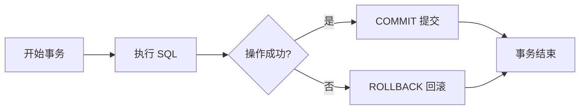
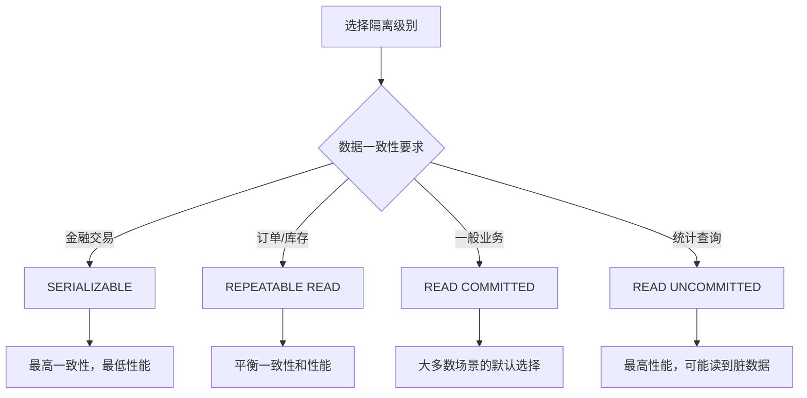
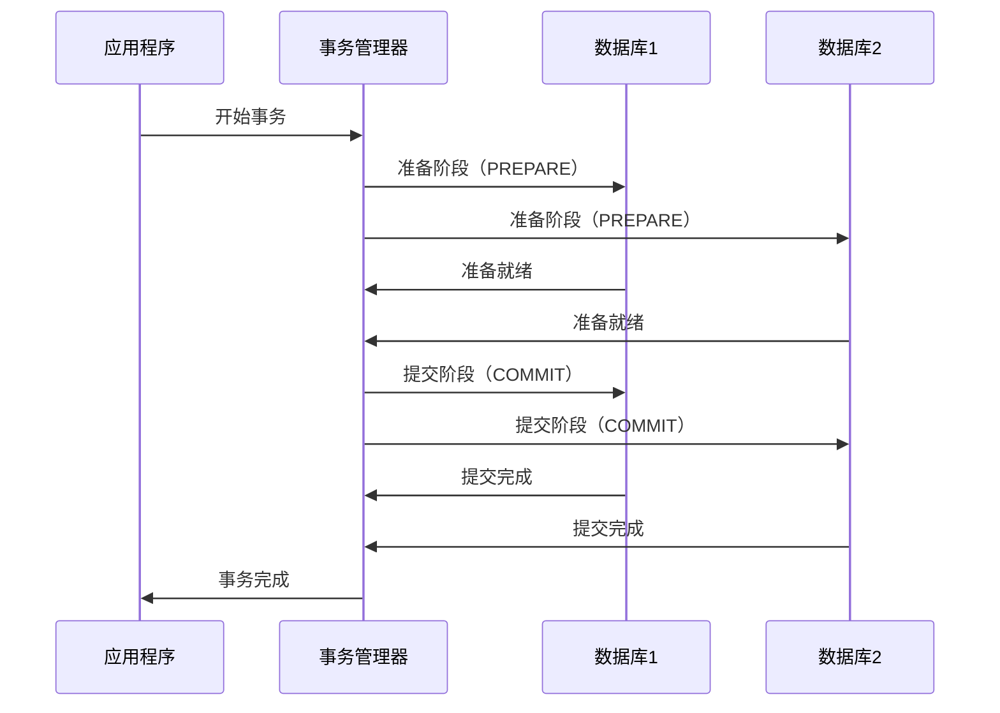

# ：事务与锁机制

> **难度等级**：⭐⭐⭐⭐ 专家 | **学习时长**：10小时 | **实战项目**：高并发秒杀系统

## 📚 本章目录

- [10.1 事务基础](#101-事务基础)
- [10.2 ACID 特性](#102-acid-特性)
- [10.3 事务隔离级别](#103-事务隔离级别)
- [10.4 锁类型与机制](#104-锁类型与机制)
- [10.5 死锁处理](#105-死锁处理)
- [10.6 乐观锁与悲观锁](#106-乐观锁与悲观锁)
- [10.7 分布式事务](#107-分布式事务)
- [10.8 实战案例分析](#108-实战案例分析)

---

## 事务基础

### 什么是事务？

事务是**数据库操作的基本执行单元**，保证一组操作要么全部成功，要么全部失败。



### 事务语法

```sql
-- MySQL / PostgreSQL 标准事务
START TRANSACTION;      -- 或 BEGIN;

-- 执行一系列操作
UPDATE accounts SET balance = balance - 100 WHERE id = 1;
UPDATE accounts SET balance = balance + 100 WHERE id = 2;

-- 提交事务
COMMIT;

-- 或回滚事务
-- ROLLBACK;

-- PostgreSQL 自动提交块
DO $$
BEGIN
    -- 操作
    UPDATE accounts SET balance = balance - 100 WHERE id = 1;

    -- 检查条件
    IF (SELECT balance FROM accounts WHERE id = 1) < 0 THEN
        RAISE EXCEPTION '余额不足';
    END IF;

    COMMIT;
EXCEPTION WHEN OTHERS THEN
    ROLLBACK;
    RAISE;
END $$;
```

### 事务的特性场景

```sql
-- 场景1：银行转账
BEGIN;
UPDATE accounts SET balance = balance - 1000 WHERE id = 1;  -- 扣款
UPDATE accounts SET balance = balance + 1000 WHERE id = 2;  -- 入账
COMMIT;

-- 场景2：订单处理
BEGIN;
-- 1. 扣减库存
UPDATE products SET stock = stock - 1 WHERE id = 100 AND stock > 0;

-- 2. 创建订单
INSERT INTO orders (user_id, product_id, status) VALUES (1, 100, 'pending');

-- 3. 扣减余额
UPDATE accounts SET balance = balance - 99 WHERE id = 1;

COMMIT;

-- 场景3：批量操作（全部成功或全部失败）
BEGIN;
INSERT INTO logs (message) VALUES ('log1');
INSERT INTO logs (message) VALUES ('log2');
INSERT INTO logs (message) VALUES ('log3');
COMMIT;
```

---

## ACID 特性

### 原子性（Atomicity）

**定义**：事务中的所有操作要么全部完成，要么全部不完成。

```sql
-- 原子性保证
BEGIN;
UPDATE accounts SET balance = balance - 100 WHERE id = 1;  -- 成功
UPDATE accounts SET balance = balance + 100 WHERE id = 2;  -- 失败（主键不存在）
-- 结果：两条 UPDATE 都不会生效，自动 ROLLBACK
COMMIT;  -- 实际执行了 ROLLBACK
```

**实现原理**：Undo Log（回滚日志）

```
执行事务前：
  记录原始数据到 Undo Log

执行 UPDATE：
  1. 写入 Undo Log（修改前的值）
  2. 修改数据页
  3. 写入 Redo Log（修改后的值）

如果失败：
  根据 Undo Log 恢复数据
```

### 一致性（Consistency）

**定义**：事务执行前后，数据库从一个一致性状态变换到另一个一致性状态。

```sql
-- 约束保证一致性
CREATE TABLE accounts (
    id BIGINT PRIMARY KEY,
    balance DECIMAL(10,2) NOT NULL CHECK (balance >= 0)  -- 余额不能为负
);

-- 触发器保证一致性
CREATE TRIGGER trg_check_balance
BEFORE UPDATE ON accounts
FOR EACH ROW
BEGIN
    IF NEW.balance < 0 THEN
        SIGNAL SQLSTATE '45000' SET MESSAGE_TEXT = '余额不足';
    END IF;
END;

BEGIN;
UPDATE accounts SET balance = balance - 100 WHERE id = 1;  -- 余额为50
-- 触发器报错，事务回滚
COMMIT;
```

### 隔离性（Isolation）

**定义**：并发执行的事务之间互不干扰，一个事务的中间状态对其他事务不可见。

```sql
-- 会话1
BEGIN;
UPDATE accounts SET balance = balance - 100 WHERE id = 1;
-- 查询看到的是修改后的值
SELECT balance FROM accounts WHERE id = 1;  -- 900
-- 还未提交，其他会话看不到
COMMIT;

-- 会话2（并发）
BEGIN;
-- 读到的是会话1提交前的值（取决于隔离级别）
SELECT balance FROM accounts WHERE id = 1;  -- 1000 或 900
COMMIT;
```

### 持久性（Durability）

**定义**：事务一旦提交，其结果就是永久性的，即使系统崩溃也不会丢失。

**实现原理**：Write-Ahead Logging（WAL）

```
事务提交流程：
  1. 事务的所有修改写入内存缓冲区
  2. Redo Log 写入磁盘（顺序写，速度快）
  3. 标记事务为已提交
  4. 返回成功给客户端

后台异步：
  5. 将缓冲区的修改刷入数据文件

如果崩溃：
  重启后根据 Redo Log 恢复已提交的事务
```

```sql
-- 验证持久性
BEGIN;
UPDATE accounts SET balance = 9999 WHERE id = 1;
COMMIT;  -- 立即写入 WAL，永久保存

-- 即使立即断电，重启后数据也是 9999
```

---

## 事务隔离级别

### 四大隔离级别

```sql
-- 查看当前隔离级别
-- PostgreSQL
SHOW transaction_isolation;
-- MySQL 8.0
SELECT @@transaction_isolation;

-- 设置隔离级别
-- PostgreSQL
SET TRANSACTION ISOLATION LEVEL READ COMMITTED;
-- MySQL
SET SESSION TRANSACTION ISOLATION LEVEL READ COMMITTED;
```

| 隔离级别 | 脏读 | 不可重复读 | 幻读 | 性能 | 说明 |
|---------|-----|----------|-----|-----|-----|
| **READ UNCOMMITTED** | 可能 | 可能 | 可能 | 最高 | 几乎不使用 |
| **READ COMMITTED** | 不可能 | 可能 | 可能 | 高 | 大多数数据库的默认级别 |
| **REPEATABLE READ** | 不可能 | 不可能 | 可能 | 中 | MySQL 的默认级别 |
| **SERIALIZABLE** | 不可能 | 不可能 | 不可能 | 低 | 最严格，性能最差 |

### 脏读（Dirty Read）

**定义**：读取到未提交的数据。

```sql
-- 会话1
BEGIN;
UPDATE accounts SET balance = 0 WHERE id = 1;
-- 未提交

-- 会话2（READ UNCOMMITTED 级别）
SET TRANSACTION ISOLATION LEVEL READ UNCOMMITTED;
BEGIN;
SELECT balance FROM accounts WHERE id = 1;  -- 读到 0（脏数据）
-- 会话1 ROLLBACK 后，数据恢复为 1000，但会话2已经读到了错误的 0
COMMIT;
```

### 不可重复读（Non-Repeatable Read）

**定义**：同一事务内多次读取同一数据，结果不同。

```sql
-- 会话1（READ COMMITTED 级别）
SET TRANSACTION ISOLATION LEVEL READ COMMITTED;
BEGIN;
SELECT balance FROM accounts WHERE id = 1;  -- 第一次：1000

-- 会话2：提交了修改
BEGIN;
UPDATE accounts SET balance = 900 WHERE id = 1;
COMMIT;

-- 会话1：再次读取
SELECT balance FROM accounts WHERE id = 1;  -- 第二次：900（不一致）
COMMIT;
```

### 幻读（Phantom Read）

**定义**：同一事务内，相同的查询条件返回不同的行数。

```sql
-- 会话1（REPEATABLE READ 级别）
SET TRANSACTION ISOLATION LEVEL REPEATABLE READ;
BEGIN;
SELECT COUNT(*) FROM accounts WHERE balance > 500;  -- 第一次：10条

-- 会话2：插入新行
BEGIN;
INSERT INTO accounts (id, balance) VALUES (100, 600);
COMMIT;

-- 会话1：再次查询
SELECT COUNT(*) FROM accounts WHERE balance > 500;  -- 第二次：11条（幻读）
COMMIT;
```

### 隔离级别选择



**推荐配置**：

```sql
-- 金融转账：SERIALIZABLE
SET TRANSACTION ISOLATION LEVEL SERIALIZABLE;
BEGIN;
UPDATE accounts SET balance = balance - 100 WHERE id = 1;
UPDATE accounts SET balance = balance + 100 WHERE id = 2;
COMMIT;

-- 电商订单：REPEATABLE READ（MySQL 默认）
-- 防止库存超卖
BEGIN;
SELECT stock FROM products WHERE id = 100 FOR UPDATE;  -- 加锁
UPDATE products SET stock = stock - 1 WHERE id = 100;
INSERT INTO orders (product_id, status) VALUES (100, 'pending');
COMMIT;

-- 一般业务：READ COMMITTED（PostgreSQL 默认）
-- 允许看到其他事务的提交
SET TRANSACTION ISOLATION LEVEL READ COMMITTED;
```

---

## 锁类型与机制

### 锁的粒度

```
数据库锁粒度：
  全局锁
    └─ 数据库锁
        └─ 表锁
            ├─ 行锁
            │   ├─ 记录锁（Record Lock）
            │   ├─ 间隙锁（Gap Lock）
            │   └─ 临键锁（Next-Key Lock）
            └─ 页锁
```

### 行锁（Row Lock）

**共享锁（S Lock）**：允许其他事务也加共享锁，读取数据。

```sql
-- 添加共享锁
SELECT * FROM accounts WHERE id = 1 LOCK IN SHARE MODE;  -- MySQL
SELECT * FROM accounts WHERE id = 1 FOR SHARE;  -- PostgreSQL

-- 其他事务可以：
SELECT * FROM accounts WHERE id = 1 LOCK IN SHARE MODE;  -- ✅ 允许
-- 其他事务不可以：
UPDATE accounts SET balance = 0 WHERE id = 1;  -- ❌ 阻塞
```

**排他锁（X Lock）**：禁止其他事务加任何锁，修改数据。

```sql
-- 添加排他锁
SELECT * FROM accounts WHERE id = 1 FOR UPDATE;  -- MySQL / PostgreSQL

-- 其他事务：
SELECT * FROM accounts WHERE id = 1 FOR SHARE;  -- ❌ 阻塞
SELECT * FROM accounts WHERE id = 1 FOR UPDATE;  -- ❌ 阻塞
UPDATE accounts SET balance = 0 WHERE id = 1;  -- ❌ 阻塞
```

### 表锁（Table Lock）

```sql
-- MySQL 显式表锁
LOCK TABLES accounts READ;  -- 读锁（共享）
UNLOCK TABLES;

LOCK TABLES accounts WRITE;  -- 写锁（排他）
UNLOCK TABLES;

-- PostgreSQL 显式表锁
LOCK TABLE accounts IN ACCESS SHARE MODE;  -- 读锁
LOCK TABLE accounts IN EXCLUSIVE MODE;    -- 写锁
```

**自动表锁场景**：
- DDL 操作：`ALTER TABLE`、`DROP TABLE`
- 全表扫描：`SELECT * FROM big_table`（在某些情况下）

### 间隙锁（Gap Lock）

**定义**：锁住索引记录之间的间隙，防止幻读。

```sql
-- MySQL REPEATABLE READ 级别
-- 表数据：id = 1, 5, 10, 15
BEGIN;
SELECT * FROM accounts WHERE id = 5 FOR UPDATE;
-- 间隙锁：(1, 5) 和 (5, 10)

-- 其他事务：
INSERT INTO accounts (id, balance) VALUES (3, 100);  -- ❌ 阻塞（在间隙内）
INSERT INTO accounts (id, balance) VALUES (7, 100);  -- ❌ 阻塞（在间隙内）
INSERT INTO accounts (id, balance) VALUES (20, 100);  -- ✅ 允许（不在间隙内）

COMMIT;
```

### 临键锁（Next-Key Lock）

**定义**：记录锁 + 间隙锁，锁定记录及其前面的间隙。

```sql
-- MySQL 默认（REPEATABLE READ）
-- 表数据：id = 1, 5, 10, 15
BEGIN;
SELECT * FROM accounts WHERE id > 5 AND id < 15 FOR UPDATE;
-- 临键锁：(1, 5]、(5, 10]、(10, 15)

-- 其他事务：
INSERT INTO accounts (id, balance) VALUES (6, 100);  -- ❌ 阻塞
INSERT INTO accounts (id, balance) VALUES (12, 100);  -- ❌ 阻塞
UPDATE accounts SET balance = 0 WHERE id = 10;  -- ❌ 阻塞
COMMIT;
```

### 意向锁（Intention Lock）

**定义**：表级锁，表示事务准备在表的某些行加锁。

```
意向锁类型：
  IS（意向共享锁）：事务准备在某些行加共享锁
  IX（意向排他锁）：事务准备在某些行加排他锁

锁兼容性：
              IS    IX    S     X
    IS        ✅    ✅    ✅    ❌
    IX        ✅    ✅    ❌    ❌
    S         ✅    ❌    ✅    ❌
    X         ❌    ❌    ❌    ❌
```

```sql
-- 意向锁自动添加
BEGIN;
SELECT * FROM accounts WHERE id = 1 FOR UPDATE;  -- 自动加 IX 锁
-- 意向锁允许快速判断是否可以加表锁（无需逐行检查）
COMMIT;
```

---

## 死锁处理

### 死锁示例

```sql
-- 会话1
BEGIN;
UPDATE accounts SET balance = balance - 100 WHERE id = 1;  -- 锁住 id=1
-- 等待会话2释放 id=2
UPDATE accounts SET balance = balance + 100 WHERE id = 2;  -- 阻塞

-- 会话2（并发）
BEGIN;
UPDATE accounts SET balance = balance - 100 WHERE id = 2;  -- 锁住 id=2
-- 等待会话1释放 id=1
UPDATE accounts SET balance = balance + 100 WHERE id = 1;  -- 阻塞

-- 结果：死锁！数据库自动检测并回滚其中一个事务
-- ERROR 1213 (40001): Deadlock found when trying to get lock
```

### 死锁检测与预防

**检测机制**：

```sql
-- MySQL：自动检测死锁，回滚代价小的事务
-- PostgreSQL：自动检测死锁，回滚其中一个事务

-- 查看死锁日志
-- MySQL
SHOW ENGINE INNODB STATUS;
-- LATEST DETECTED DEADLOCK 部分

-- PostgreSQL
SELECT * FROM pg_stat_database_conflicts;
```

**预防策略**：

```sql
-- 1. 固定加锁顺序（推荐）
-- ❌ 错误：不同顺序
-- 会话1: UPDATE accounts SET ... WHERE id = 1; WHERE id = 2;
-- 会话2: UPDATE accounts SET ... WHERE id = 2; WHERE id = 1;

-- ✅ 正确：相同顺序（按 ID 排序）
-- 会话1: UPDATE accounts SET ... WHERE id = 1; WHERE id = 2;
-- 会话2: UPDATE accounts SET ... WHERE id = 1; WHERE id = 2;

-- 2. 一次性获取所有锁
BEGIN;
SELECT * FROM accounts WHERE id IN (1, 2) FOR UPDATE;  -- 一次性锁住
UPDATE accounts SET balance = balance - 100 WHERE id = 1;
UPDATE accounts SET balance = balance + 100 WHERE id = 2;
COMMIT;

-- 3. 设置锁超时
-- MySQL
SET innodb_lock_wait_timeout = 5;  -- 5秒超时
-- PostgreSQL
SET lock_timeout = '5s';

-- 4. 使用较低隔离级别
SET TRANSACTION ISOLATION LEVEL READ COMMITTED;  -- 减少锁范围
```

### 死锁重试机制

```python
import time
import psycopg2
from psycopg2 import OperationalError

def transfer_money(from_id, to_id, amount):
    max_retries = 3
    retry_count = 0

    while retry_count < max_retries:
        try:
            conn = psycopg2.connect("dbname=test user=postgres")
            cur = conn.cursor()

            cur.execute("BEGIN")

            # 转账操作
            cur.execute("""
                UPDATE accounts
                SET balance = balance - %s
                WHERE id = %s AND balance >= %s
            """, (amount, from_id, amount))

            cur.execute("""
                UPDATE accounts
                SET balance = balance + %s
                WHERE id = %s
            """, (amount, to_id))

            conn.commit()
            print("转账成功")
            return True

        except OperationalError as e:
            if "deadlock" in str(e).lower():
                retry_count += 1
                print(f"死锁发生，重试 {retry_count}/{max_retries}")
                time.sleep(0.1 * retry_count)  # 指数退避
                conn.rollback()
            else:
                raise

        finally:
            conn.close()

    print("重试次数耗尽，转账失败")
    return False

# 使用
transfer_money(1, 2, 100)
```

---

## 乐观锁与悲观锁

### 悲观锁（Pessimistic Locking）

**原理**：假设会发生冲突，先加锁再操作。

```sql
-- 方式1：SELECT FOR UPDATE
BEGIN;
-- 查询并加排他锁
SELECT * FROM products WHERE id = 100 FOR UPDATE;

-- 业务逻辑
-- ...

-- 更新
UPDATE products SET stock = stock - 1 WHERE id = 100;
COMMIT;

-- 方式2：显式表锁
LOCK TABLES products WRITE;
UPDATE products SET stock = stock - 1 WHERE id = 100;
UNLOCK TABLES;
```

**适用场景**：
- 冲突概率高（秒杀、抢购）
- 数据一致性要求高
- 持锁时间短

### 乐观锁（Optimistic Locking）

**原理**：假设不会发生冲突，提交时检查版本号。

```sql
-- 方式1：版本号机制
CREATE TABLE products (
    id BIGINT PRIMARY KEY,
    name VARCHAR(200),
    stock INT,
    version INT DEFAULT 0  -- 版本号
);

-- 更新时检查版本号
UPDATE products
SET stock = stock - 1, version = version + 1
WHERE id = 100 AND version = 5;  -- 当前版本

-- 检查影响行数
-- 如果为 0，说明版本号已变化，事务失败

-- 方式2：更新时间戳
CREATE TABLE products (
    id BIGINT PRIMARY KEY,
    name VARCHAR(200),
    stock INT,
    updated_at TIMESTAMP DEFAULT CURRENT_TIMESTAMP ON UPDATE CURRENT_TIMESTAMP
);

-- 更新时检查时间戳
UPDATE products
SET stock = stock - 1, updated_at = CURRENT_TIMESTAMP
WHERE id = 100 AND updated_at = '2024-01-15 10:00:00';
```

**代码实现（Python）**：

```python
import time

def update_stock_with_retry(product_id, max_retries=3):
    retry_count = 0

    while retry_count < max_retries:
        # 1. 查询当前数据
        product = db.query(
            "SELECT id, stock, version FROM products WHERE id = %s",
            product_id
        )

        if product.stock <= 0:
            print("库存不足")
            return False

        # 2. 更新（检查版本号）
        affected_rows = db.execute(
            "UPDATE products SET stock = stock - 1, version = version + 1 "
            "WHERE id = %s AND version = %s",
            product_id, product.version
        )

        # 3. 检查是否成功
        if affected_rows > 0:
            print("扣减库存成功")
            return True
        else:
            retry_count += 1
            print(f"版本号冲突，重试 {retry_count}/{max_retries}")
            time.sleep(0.1)

    print("重试次数耗尽")
    return False

# 使用
update_stock_with_retry(100)
```

**适用场景**：
- 冲突概率低（大部分查询是读）
- 读多写少
- 希望提高并发性能

### 两种锁的对比

| 特性 | 悲观锁 | 乐观锁 |
|-----|-------|-------|
| **实现方式** | 数据库锁（FOR UPDATE） | 版本号/时间戳 |
| **加锁时机** | 操作前加锁 | 提交时检查 |
| **并发性能** | 低（串行化） | 高（无锁） |
| **适用场景** | 冲突概率高 | 冲突概率低 |
| **死锁风险** | 有 | 无 |
| **实现复杂度** | 简单 | 需要重试机制 |

**选择建议**：

```sql
-- 秒杀场景：悲观锁
BEGIN;
SELECT * FROM products WHERE id = 100 FOR UPDATE;
-- 检查库存
UPDATE products SET stock = stock - 1 WHERE id = 100;
COMMIT;

-- 文档编辑：乐观锁
UPDATE documents
SET content = '新内容', version = version + 1
WHERE id = 1 AND version = 5;
-- 版本号冲突则提示用户
```

---

## 分布式事务

### 本地事务 vs 分布式事务

```
本地事务：
  ┌─────────────────────────────────────┐
  │           应用程序                   │
  └─────────────────────────────────────┘
           ↓
  ┌─────────────────────────────────────┐
  │         单个数据库                   │
  │   BEGIN ... COMMIT/ROLLBACK         │
  └─────────────────────────────────────┘

分布式事务：
  ┌─────────────────────────────────────┐
  │           应用程序                   │
  └──────┬────────────────┬──────────────┘
         ↓                ↓
  ┌─────────────┐  ┌─────────────┐
  │  数据库 A   │  │  数据库 B   │
  └─────────────┘  └─────────────┘
  ┌─────────────┐  ┌─────────────┐
  │  Redis 缓存 │  │  消息队列   │
  └─────────────┘  └─────────────┘
```

### 两阶段提交（2PC）



**PostgreSQL 2PC 示例**：

```sql
-- 数据库1
PREPARE TRANSACTION 'transfer_001';

-- 数据库2
PREPARE TRANSACTION 'transfer_001';

-- 两边都准备就绪后，提交
-- 数据库1
COMMIT PREPARED 'transfer_001';

-- 数据库2
COMMIT PREPARED 'transfer_001';

-- 或回滚
-- ROLLBACK PREPARED 'transfer_001';
```

**缺点**：
- 同步阻塞，性能差
- 单点故障（TM 挂了，所有资源被锁住）
- 数据不一致（部分提交、部分回滚）

### TCC（Try-Confirm-Cancel）

```python
# TCC 三个阶段：
# 1. Try：预留资源（冻结库存）
# 2. Confirm：确认提交（扣减库存）
# 3. Cancel：取消回滚（恢复库存）

class OrderService:
    def try_create_order(self, user_id, product_id, amount):
        """Try 阶段：冻结库存"""
        # 冻结库存（不直接扣减）
        db.execute("""
            UPDATE products
            SET frozen_stock = frozen_stock + %s
            WHERE id = %s AND stock >= %s
        """, amount, product_id, amount)
        return "prepared"

    def confirm_create_order(self, order_id):
        """Confirm 阶段：扣减库存"""
        order = db.get("SELECT * FROM orders WHERE id = %s", order_id)

        # 扣减库存
        db.execute("""
            UPDATE products
            SET stock = stock - %s,
                frozen_stock = frozen_stock - %s
            WHERE id = %s
        """, order.amount, order.amount, order.product_id)

        # 更新订单状态
        db.execute("UPDATE orders SET status = 'confirmed' WHERE id = %s", order_id)

    def cancel_create_order(self, order_id):
        """Cancel 阶段：恢复库存"""
        order = db.get("SELECT * FROM orders WHERE id = %s", order_id)

        # 恢复冻结库存
        db.execute("""
            UPDATE products
            SET frozen_stock = frozen_stock - %s
            WHERE id = %s
        """, order.amount, order.product_id)

        # 更新订单状态
        db.execute("UPDATE orders SET status = 'cancelled' WHERE id = %s", order_id)

# 使用
service = OrderService()
try:
    # Try 阶段
    service.try_create_order(1, 100, 1)

    # 创建订单
    order_id = db.insert("INSERT INTO orders ...")

    # 其他操作（扣款、发消息等）
    # ...

    # Confirm 阶段
    service.confirm_create_order(order_id)
except Exception as e:
    # Cancel 阶段
    service.cancel_create_order(order_id)
```

### 本地消息表（最终一致性）

```sql
-- 创建本地消息表
CREATE TABLE local_messages (
    id BIGINT PRIMARY KEY AUTO_INCREMENT,
    aggregate_id VARCHAR(100) NOT NULL,  -- 聚合根ID（订单ID）
    aggregate_type VARCHAR(50) NOT NULL,  -- 聚合类型（ORDER）
    payload JSON NOT NULL,               -- 消息内容
    status VARCHAR(20) DEFAULT 'PENDING', -- PENDING, SENT, FAILED
    retry_count INT DEFAULT 0,
    next_retry_time TIMESTAMP,
    created_at TIMESTAMP DEFAULT CURRENT_TIMESTAMP,
    sent_at TIMESTAMP,
    UNIQUE KEY uk_aggregate (aggregate_id, aggregate_type)
);

-- 业务代码
def create_order(user_id, product_id, amount):
    try:
        # 1. 开始事务
        db.begin()

        # 2. 业务操作
        order_id = db.insert("""
            INSERT INTO orders (user_id, product_id, amount)
            VALUES (%s, %s, %s)
        """, user_id, product_id, amount)

        # 3. 写入本地消息表（同一事务）
        db.insert("""
            INSERT INTO local_messages (aggregate_id, aggregate_type, payload)
            VALUES (%s, 'ORDER', %s)
        """, order_id, json.dumps({'order_id': order_id}))

        # 4. 提交事务
        db.commit()

    except Exception as e:
        db.rollback()
        raise

    # 5. 异步发送消息（定时任务或消息队列）
    send_message_to_mq(order_id)
```

**消息发送任务**：

```python
def send_pending_messages():
    """定时任务：发送待发送消息"""
    messages = db.query("""
        SELECT * FROM local_messages
        WHERE status = 'PENDING'
          AND (next_retry_time IS NULL OR next_retry_time < NOW())
        LIMIT 100
    """)

    for msg in messages:
        try:
            # 发送到消息队列
            mq.send(msg['payload'])

            # 更新状态
            db.execute("""
                UPDATE local_messages
                SET status = 'SENT', sent_at = NOW()
                WHERE id = %s
            """, msg['id'])

        except Exception as e:
            # 更新重试信息
            db.execute("""
                UPDATE local_messages
                SET retry_count = retry_count + 1,
                    next_retry_time = DATE_ADD(NOW(), INTERVAL POW(2, retry_count) MINUTE)
                WHERE id = %s
            """, msg['id'])
```

### Saga 模式

```python
# Saga：将长事务拆分为多个本地事务，每个都有补偿操作

class OrderSaga:
    def execute(self, order_data):
        """执行订单 Saga"""
        saga_log = []

        try:
            # 步骤1：创建订单
            order_id = self.create_order(order_data)
            saga_log.append(('create_order', order_id))

            # 步骤2：扣减库存
            self.deduct_stock(order_data['product_id'], order_data['quantity'])
            saga_log.append(('deduct_stock', order_data['product_id']))

            # 步骤3：扣减余额
            self.deduct_balance(order_data['user_id'], order_data['amount'])
            saga_log.append(('deduct_balance', order_data['user_id']))

            # 步骤4：发送通知
            self.send_notification(order_id)
            saga_log.append(('send_notification', order_id))

            return True

        except Exception as e:
            # 补偿：逆向执行所有已完成步骤
            for action, data in reversed(saga_log):
                self.compensate(action, data)

            return False

    def compensate(self, action, data):
        """补偿操作"""
        if action == 'create_order':
            # 取消订单
            db.execute("UPDATE orders SET status = 'cancelled' WHERE id = %s", data)

        elif action == 'deduct_stock':
            # 恢复库存
            db.execute("UPDATE products SET stock = stock + 1 WHERE id = %s", data)

        elif action == 'deduct_balance':
            # 恢复余额
            db.execute("UPDATE accounts SET balance = balance + %s WHERE id = %s", amount, data)

        # send_notification 无需补偿（或发送取消通知）

# 使用
saga = OrderSaga()
saga.execute({
    'user_id': 1,
    'product_id': 100,
    'quantity': 1,
    'amount': 99
})
```

---

## 实战案例分析

### 案例1：秒杀系统

**需求**：1000件商品，10万用户同时抢购

**方案：悲观锁 + Redis 预减库存**

```sql
-- 1. 数据库表设计
CREATE TABLE products (
    id BIGINT PRIMARY KEY,
    name VARCHAR(200),
    stock INT,  -- 库存
    version INT DEFAULT 0  -- 乐观锁版本号
);

CREATE TABLE orders (
    id BIGINT PRIMARY KEY AUTO_INCREMENT,
    user_id BIGINT NOT NULL,
    product_id BIGINT NOT NULL,
    status VARCHAR(20) DEFAULT 'pending',
    created_at TIMESTAMP DEFAULT CURRENT_TIMESTAMP,
    UNIQUE KEY uk_user_product (user_id, product_id)  -- 防止重复购买
);

-- 2. Redis 预减库存
import redis

redis_client = redis.StrictRedis(host='localhost', port=6379, db=0)

def init_stock(product_id, stock):
    """初始化库存到 Redis"""
    redis_client.set(f"product:{product_id}:stock", stock)

def deduct_stock_redis(product_id):
    """Redis 扣减库存（原子操作）"""
    key = f"product:{product_id}:stock"
    # Lua 脚本保证原子性
    lua_script = """
        local stock = redis.call('get', KEYS[1])
        if tonumber(stock) > 0 then
            redis.call('decr', KEYS[1])
            return 1
        else
            return 0
        end
    """
    result = redis_client.eval(lua_script, 1, key)
    return result == 1

-- 3. 秒杀接口
def seckill(user_id, product_id):
    # ① Redis 预减库存
    if not deduct_stock_redis(product_id):
        return {"success": False, "msg": "库存不足"}

    # ② 创建订单（异步）
    order_id = create_order_async(user_id, product_id)

    # ③ 数据库扣减库存（悲观锁）
    try:
        db.begin()
        # 查询并加锁
        product = db.query("SELECT * FROM products WHERE id = %s FOR UPDATE", product_id)

        if product['stock'] <= 0:
            db.rollback()
            return {"success": False, "msg": "库存不足"}

        # 扣减库存
        db.execute("UPDATE products SET stock = stock - 1 WHERE id = %s", product_id)

        # 创建订单
        db.execute("""
            INSERT INTO orders (user_id, product_id, status)
            VALUES (%s, %s, 'confirmed')
        """, user_id, product_id)

        db.commit()
        return {"success": True, "order_id": order_id}

    except Exception as e:
        db.rollback()
        # 恢复 Redis 库存
        redis_client.incr(f"product:{product_id}:stock")
        return {"success": False, "msg": str(e)}
```

### 案例2：账户余额系统

**需求**：支持高并发转账，保证余额不透支

**方案：乐观锁 + 分布式锁**

```sql
-- 1. 表设计
CREATE TABLE accounts (
    id BIGINT PRIMARY KEY,
    user_id BIGINT NOT NULL,
    balance DECIMAL(10,2) NOT NULL CHECK (balance >= 0),
    version INT DEFAULT 0,  -- 乐观锁版本号
    updated_at TIMESTAMP DEFAULT CURRENT_TIMESTAMP ON UPDATE CURRENT_TIMESTAMP
);

-- 2. 转账接口（乐观锁）
def transfer_optimistic(from_user, to_user, amount, max_retries=3):
    retry_count = 0

    while retry_count < max_retries:
        try:
            db.begin()

            # 查询账户
            from_account = db.query("SELECT * FROM accounts WHERE user_id = %s", from_user)
            to_account = db.query("SELECT * FROM accounts WHERE user_id = %s", to_user)

            # 检查余额
            if from_account['balance'] < amount:
                db.rollback()
                return {"success": False, "msg": "余额不足"}

            # 转账（检查版本号）
            affected = db.execute("""
                UPDATE accounts
                SET balance = balance - %s, version = version + 1
                WHERE user_id = %s AND version = %s
            """, amount, from_user, from_account['version'])

            if affected == 0:
                # 版本号冲突，重试
                db.rollback()
                retry_count += 1
                time.sleep(0.1)
                continue

            db.execute("""
                UPDATE accounts
                SET balance = balance + %s
                WHERE user_id = %s
            """, amount, to_user)

            # 记录转账日志
            db.execute("""
                INSERT INTO transfer_log (from_user, to_user, amount)
                VALUES (%s, %s, %s)
            """, from_user, to_user, amount)

            db.commit()
            return {"success": True, "msg": "转账成功"}

        except Exception as e:
            db.rollback()
            return {"success": False, "msg": str(e)}

    return {"success": False, "msg": "系统繁忙，请稍后重试"}

-- 3. 转账接口（Redis 分布式锁）
import redis

def transfer_with_lock(from_user, to_user, amount):
    lock_key = f"lock:account:{from_user}"
    lock = redis_client.lock(lock_key, timeout=10)

    try:
        # 获取锁
        if not lock.acquire(blocking_timeout=5):
            return {"success": False, "msg": "系统繁忙"}

        db.begin()

        # 查询账户
        from_account = db.query("SELECT * FROM accounts WHERE user_id = %s", from_user)

        # 检查余额
        if from_account['balance'] < amount:
            db.rollback()
            return {"success": False, "msg": "余额不足"}

        # 转账
        db.execute("UPDATE accounts SET balance = balance - %s WHERE user_id = %s", amount, from_user)
        db.execute("UPDATE accounts SET balance = balance + %s WHERE user_id = %s", amount, to_user)

        db.commit()
        return {"success": True, "msg": "转账成功"}

    except Exception as e:
        db.rollback()
        return {"success": False, "msg": str(e)}

    finally:
        # 释放锁
        lock.release()
```

### 案例3：订单超时取消

**需求**：订单30分钟未支付自动取消

**方案：延迟消息 + 事务**

```sql
-- 1. 表设计
CREATE TABLE orders (
    id BIGINT PRIMARY KEY AUTO_INCREMENT,
    user_id BIGINT NOT NULL,
    product_id BIGINT NOT NULL,
    amount DECIMAL(10,2),
    status VARCHAR(20) DEFAULT 'pending',  -- pending, paid, cancelled, timeout
    expire_time TIMESTAMP NOT NULL,  -- 过期时间
    created_at TIMESTAMP DEFAULT CURRENT_TIMESTAMP
);

-- 2. 创建订单时设置过期时间
def create_order(user_id, product_id, amount):
    db.begin()

    order_id = db.insert("""
        INSERT INTO orders (user_id, product_id, amount, expire_time)
        VALUES (%s, %s, %s, DATE_ADD(NOW(), INTERVAL 30 MINUTE))
    """, user_id, product_id, amount)

    db.commit()

    # 发送延迟消息（RabbitMQ / RocketMQ）
    send_delay_message(order_id, delay=30*60*1000)  # 30分钟

    return order_id

-- 3. 消费延迟消息
def cancel_expired_order(order_id):
    db.begin()

    # 查询订单
    order = db.query("SELECT * FROM orders WHERE id = %s", order_id)

    # 检查状态（幂等）
    if order['status'] != 'pending':
        db.rollback()
        return

    # 取消订单
    db.execute("UPDATE orders SET status = 'timeout' WHERE id = %s", order_id)

    # 恢复库存
    db.execute("UPDATE products SET stock = stock + 1 WHERE id = %s", order['product_id'])

    db.commit()

# 4. 支付接口（幂等）
def pay_order(order_id):
    db.begin()

    # 查询订单（加锁）
    order = db.query("SELECT * FROM orders WHERE id = %s FOR UPDATE", order_id)

    # 检查状态
    if order['status'] != 'pending':
        if order['status'] == 'paid':
            db.rollback()
            return {"success": True, "msg": "支付成功"}  # 幂等
        else:
            db.rollback()
            return {"success": False, "msg": "订单已取消"}

    # 扣款
    # ...

    # 更新订单状态
    db.execute("UPDATE orders SET status = 'paid' WHERE id = %s", order_id)

    db.commit()
    return {"success": True, "msg": "支付成功"}
```

---

## ✅ 本章小结

### 学习检查清单

完成本章学习后，请确认你能够：

- [ ] 理解事务的 ACID 特性
- [ ] 掌握四种隔离级别及其应用场景
- [ ] 理解不同锁类型（行锁、表锁、间隙锁）
- [ ] 处理死锁问题
- [ ] 实现乐观锁和悲观锁
- [ ] 理解分布式事务的解决方案
- [ ] 设计高并发系统的事务处理

### 核心要点回顾

1. **ACID**：原子性、一致性、隔离性、持久性
2. **隔离级别**：READ UNCOMMITTED < READ COMMITTED < REPEATABLE READ < SERIALIZABLE
3. **锁类型**：共享锁、排他锁、间隙锁、临键锁
4. **死锁处理**：固定加锁顺序、设置超时、重试机制
5. **乐观锁 vs 悲观锁**：根据冲突概率选择
6. **分布式事务**：2PC、TCC、本地消息表、Saga

## 📚 延伸阅读

- [第3章：MySQL 8.0 完全指南 →](./chapter-03)
- [第4章：PostgreSQL 16+ 高级特性 →](./chapter-04)
- [第7章：Redis 缓存设计与实战 →](./chapter-06)
- [第13章：主从复制与高可用 →](./chapter-12)

**推荐阅读**：
- [PostgreSQL 事务隔离](https://www.postgresql.org/docs/current/transaction-iso.html)
- [MySQL InnoDB 锁机制](https://dev.mysql.com/doc/refman/8.0/en/innodb-locking.html)
- [Designing Data-Intensive Applications（DDIA）](https://dataintensive.net/)

---

**更新时间**：2026年2月 | **版本**：v1.0
