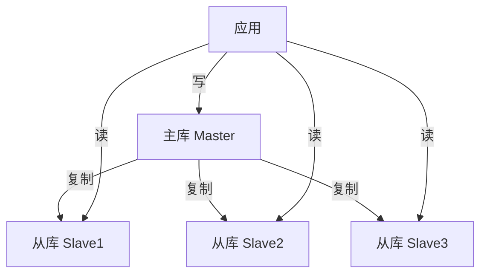
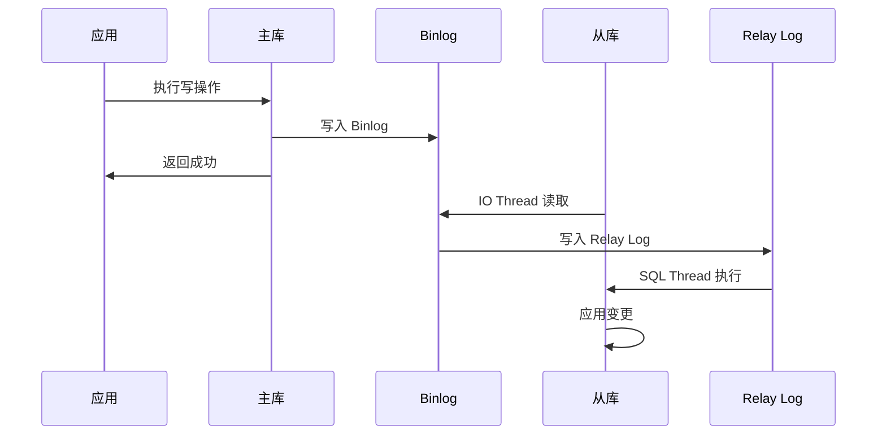
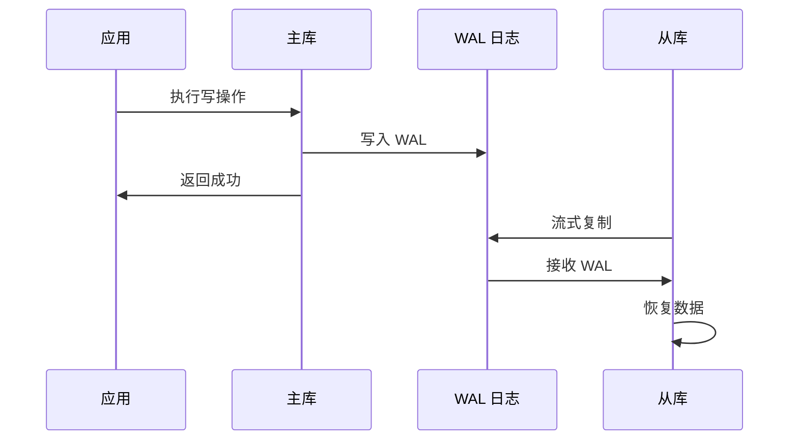
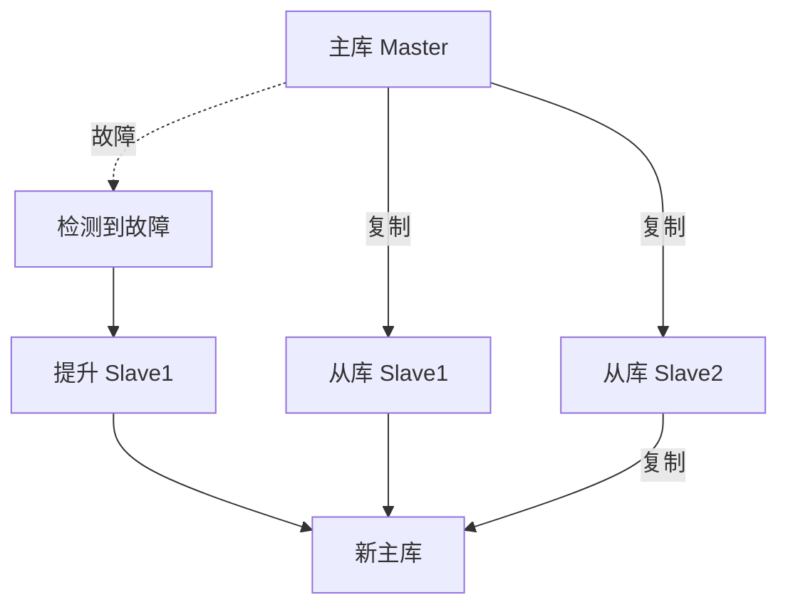
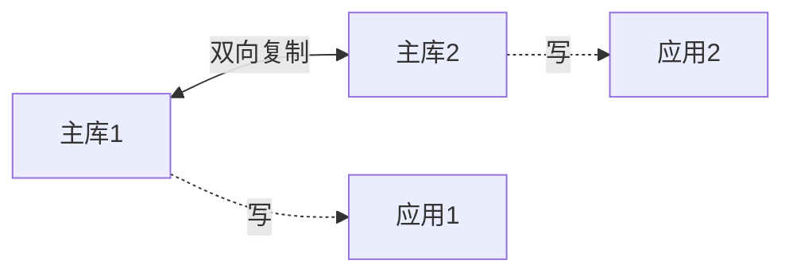
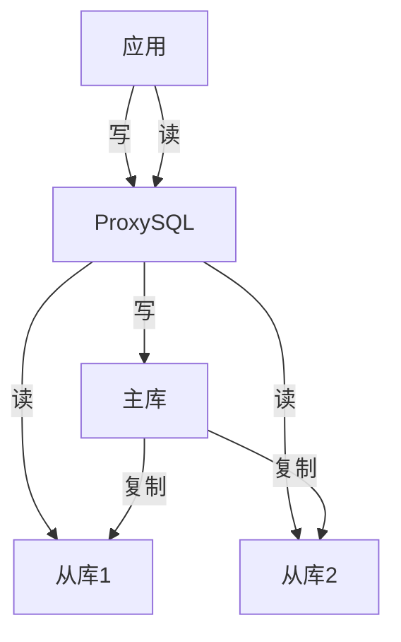
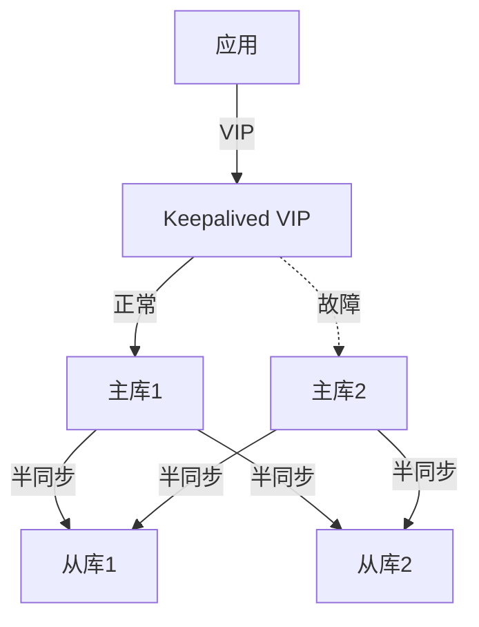
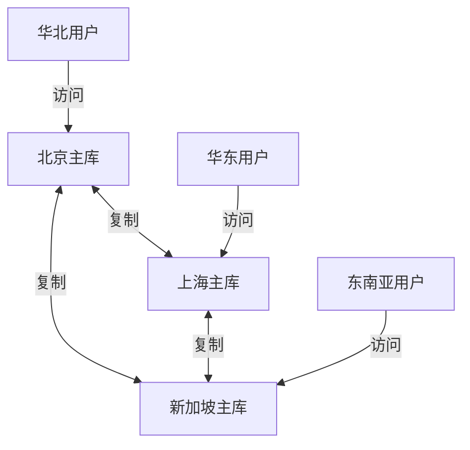

# ：主从复制与高可用

> **难度等级**：⭐⭐⭐⭐ 专家 | **学习时长**：12小时 | **实战项目**：生产级高可用架构

## 📚 本章目录

- [11.1 复制基础](#111-复制基础)
- [11.2 MySQL 主从复制](#112-mysql-主从复制)
- [11.3 PostgreSQL 流复制](#113-postgresql-流复制)
- [11.4 GTID 复制](#114-gtid-复制)
- [11.5 读写分离](#115-读写分离)
- [11.6 高可用架构](#116-高可用架构)
- [11.7 复制监控与运维](#117-复制监控与运维)
- [11.8 实战案例分析](#118-实战案例分析)

---

## 复制基础

### 什么是复制？

复制是指**将数据从一个数据库服务器（主库）复制到一个或多个数据库服务器（从库）**的技术。



### 复制的用途

| 用途 | 说明 | 示例 |
|-----|------|-----|
| **读写分离** | 主库写，从库读，提升性能 | 电商订单系统 |
| **数据备份** | 实时热备份，灾难恢复 | 金融系统 |
| **高可用** | 主库故障，从库提升为主库 | 在线服务 |
| **数据分析** | 从库用于报表，不影响主库 | BI 系统 |
| **地理分布** | 数据就近访问，降低延迟 | 全球业务 |

### 复制类型

```
复制架构：
  1. 异步复制
     ├─ 主库执行完立即返回
     ├─ 不等待从库确认
     └─ 可能丢失数据

  2. 半同步复制
     ├─ 主库等待至少一个从库确认
     ├─ 平衡性能和数据安全
     └─ 推荐

  3. 同步复制
     ├─ 主库等待所有从库确认
     ├─ 数据最安全
     └─ 性能最差
```

---

## MySQL 主从复制

### 复制原理



**核心组件**：

1. **Binlog（二进制日志）**：记录主库的所有数据变更
2. **IO Thread**：从库线程，读取主库 Binlog 并写入 Relay Log
3. **Relay Log（中继日志）**：从库本地日志
4. **SQL Thread**：从库线程，读取 Relay Log 并执行

### 搭建 MySQL 主从复制

#### 1. 主库配置

```bash
# /etc/my.cnf (主库)
[mysqld]
# 服务器ID（唯一）
server-id = 1

# 启用 Binlog
log-bin = mysql-bin
binlog_format = ROW  # ROW（推荐）、STATEMENT、MIXED

# 需要复制的数据库（可选）
binlog-do-db = mydb
# 或忽略不需要复制的数据库
binlog-ignore-db = mysql,information_schema,performance_schema

# GTID 模式（推荐）
gtid_mode = ON
enforce_gtid_consistency = ON

# 重启 MySQL
systemctl restart mysqld
```

```sql
-- 创建复制用户
mysql> CREATE USER 'repl'@'%' IDENTIFIED BY 'Replica@2024';
mysql> GRANT REPLICATION SLAVE ON *.* TO 'repl'@'%';
mysql> FLUSH PRIVILEGES;

-- 查看主库状态
mysql> SHOW MASTER STATUS;
+------------------+----------+--------------+------------------+
| File             | Position | Binlog_Do_DB | Binlog_Ignore_DB |
+------------------+----------+--------------+------------------+
| mysql-bin.000001 |      154 | mydb         |                  |
+------------------+----------+--------------+------------------+
```

#### 2. 从库配置

```bash
# /etc/my.cnf (从库)
[mysqld]
# 服务器ID（唯一，不能与主库相同）
server-id = 2

# 启用中继日志
relay-log = mysql-relay-bin
log-slave-updates = 1  # 从库写入自己的 Binlog（级联复制需要）

# 只读模式（可选）
read_only = 1
super_read_only = 1

# GTID 模式
gtid_mode = ON
enforce_gtid_consistency = ON

# 重启 MySQL
systemctl restart mysqld
```

```sql
-- 配置复制（传统方式）
mysql> CHANGE MASTER TO
    -> MASTER_HOST='192.168.1.10',
    -> MASTER_USER='repl',
    -> MASTER_PASSWORD='Replica@2024',
    -> MASTER_LOG_FILE='mysql-bin.000001',
    -> MASTER_LOG_POS=154;

-- 或使用 GTID 方式（推荐）
mysql> CHANGE MASTER TO
    -> MASTER_HOST='192.168.1.10',
    -> MASTER_USER='repl',
    -> MASTER_PASSWORD='Replica@2024',
    -> MASTER_AUTO_POSITION = 1;

-- 启动复制
mysql> START SLAVE;

-- 查看复制状态
mysql> SHOW SLAVE STATUS\G
*************************** 1. row ***************************
               Slave_IO_State: Waiting for master to send event
                  Master_Host: 192.168.1.10
                  Master_User: repl
                  Master_Port: 3306
                Connect_Retry: 60
              Master_Log_File: mysql-bin.000001
          Read_Master_Log_Pos: 154
               Relay_Log_File: mysql-relay-bin.000002
                Relay_Log_Pos: 320
        Relay_Master_Log_File: mysql-bin.000001
             Slave_IO_Running: Yes
            Slave_SQL_Running: Yes
              Replicate_Do_DB: mydb
          Replicate_Ignore_DB:
           Replicate_Do_Table:
       Replicate_Ignore_Table:
      Replicate_Wild_Do_Table:
  Replicate_Wild_Ignore_Table:
                   Last_Errno: 0
                   Last_Error:
                 Skip_Counter: 0
          Exec_Master_Log_Pos: 154
              Relay_Log_Space: 526
              Until_Condition: None
               Until_Log_File:
                Until_Log_Pos: 0
           Master_SSL_Allowed: No
        Seconds_Behind_Master: 0  # 延迟时间（秒）
Master_SSL_Verify_Server_Cert: No
                Last_IO_Errno: 0
                Last_IO_Error:
               Last_SQL_Errno: 0
               Last_SQL_Error:
  Replicate_Ignore_Server_Ids:
             Master_Server_Id: 1
                  Master_UUID: 3e11a476-3e11-4e11-8e11-3e11a4763e11
             Master_Info_File: mysql.slave_master_info
                    SQL_Delay: 0
          SQL_Remaining_Delay: NULL
      Slave_SQL_Running_State: Slave has read all relay log; waiting for more updates
           Retrieved_Gtid_Set: 3e11a476-3e11-4e11-8e11-3e11a4763e11:1-10
            Executed_Gtid_Set: 3e11a476-3e11-4e11-8e11-3e11a4763e11:1-10
```

**关键状态检查**：

```sql
-- 检查 IO 和 SQL 线程是否运行
Slave_IO_Running: Yes
Slave_SQL_Running: Yes

-- 检查复制延迟（0 表示无延迟）
Seconds_Behind_Master: 0

-- 检查错误信息
Last_IO_Error: (应为空)
Last_SQL_Error: (应为空)
```

### 复制模式对比

| 模式 | 说明 | 优点 | 缺点 |
|-----|------|-----|-----|
| **STATEMENT** | 记录 SQL 语句 | 日志量小、节省空间 | 不确定性函数可能不一致 |
| **ROW** | 记录行数据变化 | 最安全、最准确 | 日志量大 |
| **MIXED** | 混合模式 | 平衡日志量和安全性 | 复杂场景自动切换到 ROW |

```sql
-- 查看当前 Binlog 格式
mysql> SHOW VARIABLES LIKE 'binlog_format';
+---------------+-------+
| Variable_name | Value |
+---------------+-------+
| binlog_format | ROW   |
+---------------+-------+

-- 动态修改
mysql> SET GLOBAL binlog_format = 'ROW';
```

### 过滤复制规则

```sql
-- 从库配置：只复制特定数据库
-- /etc/my.cnf
replicate-do-db = mydb
replicate-do-db = mydb2

-- 或忽略特定数据库
replicate-ignore-db = mysql
replicate-ignore-db = information_schema

-- 只复制特定表
replicate-do-table = mydb.users
replicate-do-table = mydb.orders

-- 忽略特定表
replicate-ignore-table = mydb.logs

-- 使用通配符
replicate-wild-do-table = mydb.%
replicate-wild-ignore-table = %.temp_%
```

---

## PostgreSQL 流复制

### 复制原理



**核心概念**：

1. **WAL（Write-Ahead Log）**：预写日志，记录所有数据变更
2. **流复制**：从库实时连接主库，流式接收 WAL
3. **恢复模式**：从库持续应用 WAL，保持与主库同步

### 搭建 PostgreSQL 主从复制

#### 1. 主库配置

```bash
# /var/lib/pgsql/data/postgresql.conf (主库)

# 连接设置
listen_addresses = '*'          # 监听所有地址
max_wal_senders = 10            # 最大发送进程数
wal_level = replica             # WAL 级别：minimal, replica, logical
wal_keep_size = 1GB             # 保留的 WAL 大小

# 慢查询和安全
synchronous_commit = on         # 同步提交（on, off, remote_write, local）

# 复制槽（防止 WAL 被清理）
max_replication_slots = 10

# 归档（可选）
archive_mode = on
archive_command = 'cp %p /var/lib/pgsql/archive/%f'
```

```bash
# /var/lib/pgsql/data/pg_hba.conf (主库)
# 添加复制用户权限
host    replication     replicator      192.168.1.0/24      scram-sha-256
```

```sql
-- 创建复制用户
postgres@primary:~$ psql
postgres=# CREATE ROLE replicator WITH REPLICATION LOGIN PASSWORD 'Replica@2024';

-- 查看 WAL 位置
postgres=# SELECT pg_current_wal_lsn();
 pg_current_wal_lsn
--------------------
 0/3000060
```

#### 2. 从库配置

```bash
# 停止从库 PostgreSQL
systemctl stop postgresql-16

# 清空从库数据目录
rm -rf /var/lib/pgsql/data/*

# 使用 pg_basebackup 从主库同步数据
pg_basebackup -h 192.168.1.10 -D /var/lib/pgsql/data -U replicator -P -v -R

# 参数说明：
# -h: 主库地址
# -D: 从库数据目录
# -U: 复制用户
# -P: 显示进度
# -v: 详细输出
# -R: 自动创建 standby.signal 和配置文件

# 生成的配置文件
cat /var/lib/pgsql/data/postgresql.auto.conf
# Do not edit this file manually!
# It will be overwritten by the ALTER SYSTEM command.
primary_conninfo = 'user=replicator password=Replica@2024 host=192.168.1.10 port=5432 sslmode=prefer sslcompression=0 gssencmode=prefer krbsrvname=postgres target_session_attrs=any'

# 启动从库
systemctl start postgresql-16
```

#### 3. 验证复制状态

```sql
-- 主库查询
postgres=# SELECT * FROM pg_stat_replication;
-[ RECORD 1 ]----+------------------------------
pid              | 12345
usesysid         | 16384
usename          | replicator
application_name | walreceiver
client_addr      | 192.168.1.11
client_hostname  |
client_port      | 36442
backend_start    | 2024-02-11 10:00:00
backend_xmin     |
state            | streaming          -- 流复制状态
sent_lsn         | 0/3015648          -- 发送位置
write_lsn        | 0/3015648          -- 写入位置
flush_lsn        | 0/3015648          -- 刷盘位置
replay_lsn       | 0/3015648          -- 恢复位置
write_lag        | 00:00:00.001
flush_lag        | 00:00:00.001
replay_lag       | 00:00:00.002
sync_priority    | 0
sync_state       | async              -- 异步复制
reply_time       | 2024-02-11 10:05:00

-- 从库查询
postgres=# SELECT pg_is_in_recovery();
 pg_is_in_recovery
-------------------
 t                 -- t 表示在恢复模式（从库）

-- 查看复制延迟
postgres=# SELECT
    now() - pg_last_xact_replay_timestamp() AS replication_lag;
 replication_lag
-----------------
 00:00:00.123456
```

### 同步复制

```sql
-- 主库配置同步复制
-- postgresql.conf
synchronous_commit = on
synchronous_standby_names = 'standby1'  # 指定同步从库

-- 或配置任意一个从库同步即可（推荐）
synchronous_standby_names = 'ANY 1 (standby1, standby2)'

-- 重启主库
systemctl restart postgresql-16

-- 查看同步状态
postgres=# SELECT
    application_name,
    sync_state,
    state
FROM pg_stat_replication;

 application_name | sync_state | state
------------------+------------+-----------
 standby1         | sync       | streaming  -- 同步从库
 standby2         | async      | streaming  -- 异步从库
```

**同步模式对比**：

| 模式 | 说明 | 性能 | 数据安全 |
|-----|------|-----|---------|
| **async** | 异步复制（默认） | 最高 | 主库故障可能丢失数据 |
| **remote_write** | 等待从库接收 WAL | 高 | 从库内存故障可能丢失数据 |
| **on** | 等待从库写入磁盘 | 低 | 最安全（推荐金融场景） |
| **local** | 只等待主库本地写入 | 较高 | 主库故障可能丢失数据 |

---

## GTID 复制

### 什么是 GTID？

GTID（Global Transaction Identifier）是**全局事务标识符**，唯一标识每个事务。

```
GTID 格式：source_id:transaction_id
示例：3E11A476-3E11-4E11-8E11-3E11A4763E11:1-100

- source_id：服务器 UUID（唯一）
- transaction_id：事务序号（递增）
```

### GTID 的优势

| 特性 | 传统复制 | GTID 复制 |
|-----|---------|----------|
| **故障切换** | 需要查找 Binlog 位置 | 自动定位 |
| **复制拓扑** | 复杂 | 简化 |
| **错误跳过** | 需要指定 Set 和 Pos | 只需 GTID |
| **多源复制** | 难以管理 | 简单 |

### 配置 GTID 复制

```bash
# 主库和从库都需要配置
# /etc/my.cnf
[mysqld]
gtid_mode = ON
enforce_gtid_consistency = ON
log_bin = mysql-bin
server-id = 1  # 主库为1，从库为2、3...

# 重启 MySQL
systemctl restart mysqld
```

```sql
-- 从库配置 GTID 复制
mysql> CHANGE MASTER TO
    -> MASTER_HOST='192.168.1.10',
    -> MASTER_USER='repl',
    -> MASTER_PASSWORD='Replica@2024',
    -> MASTER_AUTO_POSITION = 1;  -- 自动使用 GTID

mysql> START SLAVE;

-- 查看执行的 GTID
mysql> SHOW SLAVE STATUS\G
Retrieved_Gtid_Set: 3e11a476-3e11-4e11-8e11-3e11a4763e11:1-1000
Executed_Gtid_Set: 3e11a476-3e11-4e11-8e11-3e11a4763e11:1-1000

-- 主库查看所有 GTID
mysql> SHOW MASTER STATUS;
+------------------+----------+--------------+------------------+
| File             | Position | Binlog_Do_DB | Executed_Gtid_Set |
+------------------+----------+--------------+------------------+
| mysql-bin.000002 |      154 | mydb         | 3e11-...:1-1000  |
+------------------+----------+--------------+------------------+
```

### GTID 操作

```sql
-- 查看当前服务器的 GTID
mysql> SELECT @@GLOBAL.GTID_EXECUTED;
+------------------------------------------+
| @@GLOBAL.GTID_EXECUTED                   |
+------------------------------------------+
| 3e11a476-3e11-4e11-8e11-3e11a4763e11:1-1000 |
+------------------------------------------+

-- 跳过复制错误（使用 GTID）
mysql> STOP SLAVE;
mysql> SET GTID_NEXT='3e11a476-3e11-4e11-8e11-3e11a4763e11:1001';  -- 指定跳过的 GTID
mysql> BEGIN; COMMIT;  -- 空事务
mysql> SET GTID_NEXT='AUTOMATIC';
mysql> START SLAVE;

-- 重置 GTID（清空所有 GTID 历史，慎用）
mysql> RESET MASTER;
```

---

## 读写分离

### 应用层读写分离

**原理**：应用代码中判断操作类型，选择主库或从库。

```python
import mysql.connector

class DatabaseRouter:
    def __init__(self, master_config, slave_configs):
        self.master = mysql.connector.connect(**master_config)
        self.slaves = [mysql.connector.connect(**c) for c in slave_configs]

    def get_connection(self, read_only=False):
        """获取连接：写操作用主库，读操作用从库"""
        if read_only:
            # 随机选择一个从库（负载均衡）
            import random
            return random.choice(self.slaves)
        else:
            return self.master

    def execute_read(self, query, params=None):
        """执行读操作"""
        conn = self.get_connection(read_only=True)
        cursor = conn.cursor(dictionary=True)
        cursor.execute(query, params or ())
        return cursor.fetchall()

    def execute_write(self, query, params=None):
        """执行写操作"""
        conn = self.get_connection(read_only=False)
        cursor = conn.cursor()
        cursor.execute(query, params or ())
        conn.commit()
        return cursor.lastrowid

# 配置
router = DatabaseRouter(
    master_config={
        'host': '192.168.1.10',
        'port': 3306,
        'user': 'root',
        'password': 'Root@2024',
        'database': 'mydb'
    },
    slave_configs=[
        {
            'host': '192.168.1.11',
            'port': 3306,
            'user': 'root',
            'password': 'Root@2024',
            'database': 'mydb'
        },
        {
            'host': '192.168.1.12',
            'port': 3306,
            'user': 'root',
            'password': 'Root@2024',
            'database': 'mydb'
        }
    ]
)

# 使用
users = router.execute_read("SELECT * FROM users WHERE id = %s", (1,))
router.execute_write("INSERT INTO logs (message) VALUES (%s)", ("test",))
```

### 中间件读写分离

**ProxySQL**：MySQL 代理，支持读写分离、连接池、查询缓存。

```bash
# 安装 ProxySQL
yum install -y proxysql

# 启动
systemctl start proxysql

# 连接 ProxySQL 管理端口
mysql -h127.0.0.1 -P6032 -uadmin -padmin

-- 配置后端服务器
INSERT INTO mysql_servers(hostgroup_id, hostname, port) VALUES (10, '192.168.1.10', 3306);  -- 主库
INSERT INTO mysql_servers(hostgroup_id, hostname, port) VALUES (20, '192.168.1.11', 3306);  -- 从库1
INSERT INTO mysql_servers(hostgroup_id, hostname, port) VALUES (20, '192.168.1.12', 3306);  -- 从库2

-- 配置监控用户
INSERT INTO mysql_users(username, password, default_hostgroup) VALUES ('monitor', 'monitor', 10);
UPDATE global_variables SET variable_value='monitor' WHERE variable_name='mysql-monitor_username';
UPDATE global_variables SET variable_value='monitor' WHERE variable_name='mysql-monitor_password';

-- 配置应用用户
INSERT INTO mysql_users(username, password, default_hostgroup, max_connections) VALUES ('appuser', 'App@2024', 20, 1000);

-- 配置读写分离规则
INSERT INTO mysql_query_rules(rule_id, active, match_pattern, destination_hostgroup, apply) VALUES (1, 1, '^SELECT.*FOR UPDATE', 10, 1);  -- SELECT FOR UPDATE 走主库
INSERT INTO mysql_query_rules(rule_id, active, match_pattern, destination_hostgroup, apply) VALUES (10, 1, '^SELECT', 20, 1);  -- 其他 SELECT 走从库

-- 加载配置到运行时
LOAD MYSQL SERVERS TO RUNTIME;
LOAD MYSQL USERS TO RUNTIME;
LOAD MYSQL QUERY RULES TO RUNTIME;
SAVE MYSQL SERVERS TO DISK;
SAVE MYSQL USERS TO DISK;
SAVE MYSQL QUERY RULES TO DISK;

-- 应用连接 ProxySQL
mysql -h127.0.0.1 -P6033 -uappuser -pApp@2024 mydb
```

### 读写分离注意事项

```sql
-- 1. 读写延迟问题
-- 主库写入后立即从从库读取可能读到旧数据
-- 解决方案：
--    方案A：强制读主库
SELECT * FROM orders WHERE id = 123 FOR UPDATE;  -- 使用 FOR UPDATE

--    方案B：延迟读取
time.sleep(0.5)  # 等待复制完成
cursor.execute("SELECT * FROM orders WHERE id = %s", (order_id,))

--    方案C：使用缓存
redis.setex("order:123", json.dumps(order_data), 60)

-- 2. 会话一致性
-- 同一用户的请求需要路由到同一从库
-- 解决方案：使用 Sticky Session

-- 3. 事务中的读操作
-- 事务中的读操作必须走主库
BEGIN;
SELECT balance FROM accounts WHERE id = 1;  -- 必须走主库
UPDATE accounts SET balance = balance - 100 WHERE id = 1;
COMMIT;
```

---

## 高可用架构

### 主备切换



**手动切换步骤**：

```sql
-- 1. 停止主库（模拟故障）
systemctl stop mysqld  # 主库

-- 2. 提升从库为主库
-- 从库1 (192.168.1.11)
mysql> STOP SLAVE;
mysql> RESET MASTER;  -- 重置为主库
mysql> SET GLOBAL read_only = OFF;
mysql> SET GLOBAL super_read_only = OFF;

-- 3. 其他从库重新指向新主库
-- 从库2 (192.168.1.12)
mysql> STOP SLAVE;
mysql> CHANGE MASTER TO
    -> MASTER_HOST='192.168.1.11',  -- 新主库
    -> MASTER_USER='repl',
    -> MASTER_PASSWORD='Replica@2024',
    -> MASTER_AUTO_POSITION = 1;
mysql> START SLAVE;

-- 4. 应用更新连接地址
-- 修改配置文件或 DNS
```

### 自动故障转移（MHA）

**MHA（Master High Availability）**：MySQL 自动故障转移工具。

```bash
# 安装 MHA
# 管理节点
yum install -y mha4mysql-manager

# 所有节点
yum install -y mha4mysql-node

# 配置 SSH 免密登录
ssh-copy-id root@192.168.1.10
ssh-copy-id root@192.168.1.11
ssh-copy-id root@192.168.1.12

# 创建配置文件
cat > /etc/masterha/default.cnf <<EOF
[server default]
user=mha
password=Mha@2024
ssh_user=root
repl_user=repl
repl_password=Replica@2024
ping_interval=1

[server1]
hostname=192.168.1.10
candidate_master=1

[server2]
hostname=192.168.1.11
candidate_master=1

[server3]
hostname=192.168.1.12
candidate_master=1
EOF

# 创建 MHA 用户
mysql> GRANT ALL PRIVILEGES ON *.* TO 'mha'@'%' IDENTIFIED BY 'Mha@2024';
mysql> GRANT REPLICATION SLAVE ON *.* TO 'repl'@'%';

# 检查 SSH 连接
masterha_check_ssh --conf=/etc/masterha/default.cnf

# 检查复制状态
masterha_check_repl --conf=/etc/masterha/default.cnf

# 启动 MHA Manager
nohup masterha_manager --conf=/etc/masterha/default.cnf > /tmp/mha.log 2>&1 &

# 查看状态
masterha_check_status --conf=/etc/masterha/default.cnf
```

### 主主复制



**配置主主复制**：

```bash
# 主库1 (192.168.1.10)
# /etc/my.cnf
[mysqld]
server-id = 1
log-bin = mysql-bin
binlog_format = ROW
gtid_mode = ON
enforce_gtid_consistency = ON
auto_increment_increment = 2  # 自增步长
auto_increment_offset = 1     # 自增起始值

systemctl restart mysqld
```

```sql
-- 主库1
mysql> CREATE USER 'repl'@'%' IDENTIFIED BY 'Replica@2024';
mysql> GRANT REPLICATION SLAVE ON *.* TO 'repl'@'%';
mysql> CHANGE MASTER TO
    -> MASTER_HOST='192.168.1.11',
    -> MASTER_USER='repl',
    -> MASTER_PASSWORD='Replica@2024',
    -> MASTER_AUTO_POSITION = 1;
mysql> START SLAVE;
```

```bash
# 主库2 (192.168.1.11)
# /etc/my.cnf
[mysqld]
server-id = 2
log-bin = mysql-bin
binlog_format = ROW
gtid_mode = ON
enforce_gtid_consistency = ON
auto_increment_increment = 2
auto_increment_offset = 2  # 不同的起始值
```

```sql
-- 主库2
mysql> CREATE USER 'repl'@'%' IDENTIFIED BY 'Replica@2024';
mysql> GRANT REPLICATION SLAVE ON *.* TO 'repl'@'%';
mysql> CHANGE MASTER TO
    -> MASTER_HOST='192.168.1.10',
    -> MASTER_USER='repl',
    -> MASTER_PASSWORD='Replica@2024',
    -> MASTER_AUTO_POSITION = 1;
mysql> START SLAVE;
```

**注意事项**：
- 避免同时写入同一数据（冲突）
- 使用自增步长和偏移量避免主键冲突
- 需要应用层配合路由策略

---

## 复制监控与运维

### 复制状态监控

```sql
-- MySQL 监控脚本
cat > /usr/local/bin/check_mysql_replication.sh <<EOF
#!/bin/bash

MYSQL_USER="monitor"
MYSQL_PASS="Monitor@2024"
ALERT_EMAIL="admin@example.com"
THRESHOLD=60  # 延迟阈值（秒）

# 查询复制状态
DELAY=$(mysql -u$MYSQL_USER -p$MYSQL_PASS -e "SHOW SLAVE STATUS\G" | grep "Seconds_Behind_Master" | awk '{print $2}')

# 判断状态
if [ "$DELAY" == "NULL" ]; then
    echo "复制停止！" | mail -s "MySQL复制告警" $ALERT_EMAIL
elif [ "$DELAY" -gt "$THRESHOLD" ]; then
    echo "复制延迟 $DELAY 秒" | mail -s "MySQL复制延迟告警" $ALERT_EMAIL
fi

# 检查错误
ERROR_COUNT=$(mysql -u$MYSQL_USER -p$MYSQL_PASS -e "SHOW SLAVE STATUS\G" | grep "Last_SQL_Error" | wc -l)
if [ "$ERROR_COUNT" -gt "0" ]; then
    mysql -u$MYSQL_USER -p$MYSQL_PASS -e "SHOW SLAVE STATUS\G" | mail -s "MySQL复制错误" $ALERT_EMAIL
fi
EOF

chmod +x /usr/local/bin/check_mysql_replication.sh

# 添加到 crontab
echo "*/5 * * * * /usr/local/bin/check_mysql_replication.sh" | crontab -
```

```sql
-- PostgreSQL 监控查询
-- 查看复制状态
SELECT
    client_addr,
    state,
    sync_state,
    pg_wal_lsn_diff(sent_lsn, pg_current_wal_lsn()) AS sent_lag,
    pg_wal_lsn_diff(replay_lsn, sent_lsn) AS replay_lag,
    pg_wal_lsn_diff(pg_current_wal_lsn(), replay_lsn) AS total_lag
FROM pg_stat_replication;

-- 监控脚本
cat > /usr/local/bin/check_pg_replication.sh <<EOF
#!/bin/bash

THRESHOLD=1800  # 30分钟

# 查询延迟（秒）
DELAY=$(psql -U postgres -t -c "
    SELECT EXTRACT(EPOCH FROM (now() - pg_last_xact_replay_timestamp()))
")

if [ "$DELAY" -gt "$THRESHOLD" ]; then
    echo "PostgreSQL 复制延迟: ${DELAY}秒" | mail -s "PG复制延迟告警" admin@example.com
fi
EOF

chmod +x /usr/local/bin/check_pg_replication.sh
```

### 复制延迟优化

```sql
-- MySQL 优化
-- 1. 并行复制（MySQL 5.7+）
SET GLOBAL slave_parallel_type = 'LOGICAL_CLOCK';
SET GLOBAL slave_parallel_workers = 4;
STOP SLAVE;
START SLAVE;

-- 2. 多线程复制（基于库）
SET GLOBAL slave_parallel_workers = 4;
SET GLOBAL slave_parallel_type = 'DATABASE';

-- 3. 增大 Relay Log
SET GLOBAL relay_log_recovery = ON;
SET GLOBAL relay_log_purge = ON;

-- PostgreSQL 优化
-- 1. 增大 WAL 缓冲
shared_buffers = 4GB
wal_buffers = 64MB

-- 2. 并行恢复
max_parallel_maintenance_workers = 4
max_parallel_workers_per_gather = 4

-- 3. 压缩 WAL
wal_compression = on
```

### 复制故障处理

```sql
-- MySQL 跳过复制错误
SET GLOBAL sql_slave_skip_counter = 1;
START SLAVE;

-- 或跳过指定错误类型
SET GLOBAL slave_skip_errors = '1062,1032';

-- PostgreSQL 跳过损坏的 WAL
-- 恢复到指定位置
pg_resetwal -f /var/lib/pgsql/data

-- 或重建从库
pg_basebackup -h primary -D /var/lib/pgsql/data -U replicator -P -v -R
```

---

## 实战案例分析

### 案例1：电商系统读写分离

**架构**：1主2从 + ProxySQL



**实施方案**：

```python
# 配置 ProxySQL
import pymysql

class EcommerceRouter:
    def __init__(self):
        # ProxySQL 连接
        self.proxy = pymysql.connect(
            host='127.0.0.1',
            port=6033,
            user='appuser',
            password='App@2024',
            database='ecommerce'
        )

    def get_order(self, order_id):
        """读订单：走从库"""
        cursor = self.proxy.cursor()
        cursor.execute("SELECT * FROM orders WHERE id = %s", (order_id,))
        return cursor.fetchone()

    def create_order(self, user_id, product_id, amount):
        """创建订单：走主库"""
        cursor = self.proxy.cursor()
        try:
            self.proxy.begin()

            # 扣减库存（需要锁，自动走主库）
            cursor.execute("""
                UPDATE products
                SET stock = stock - 1
                WHERE id = %s AND stock > 0
            """, (product_id,))

            # 创建订单
            cursor.execute("""
                INSERT INTO orders (user_id, product_id, amount, status)
                VALUES (%s, %s, %s, 'pending')
            """, (user_id, product_id, amount))

            order_id = cursor.lastrowid

            # 扣减余额
            cursor.execute("""
                UPDATE accounts
                SET balance = balance - %s
                WHERE user_id = %s AND balance >= %s
            """, (amount, user_id, amount))

            self.proxy.commit()
            return order_id

        except Exception as e:
            self.proxy.rollback()
            raise

# 使用
router = EcommerceRouter()
order = router.get_order(12345)
order_id = router.create_order(1, 100, 99.00)
```

### 案例2：金融系统高可用

**架构**：半同步复制 + 自动故障转移



**实施方案**：

```sql
-- MySQL 半同步复制配置
-- 主库1
INSTALL PLUGIN rpl_semi_sync_master SONAME 'semisync_master.so';
SET GLOBAL rpl_semi_sync_master_enabled = 1;
SET GLOBAL rpl_semi_sync_master_timeout = 1000;  -- 1秒超时

-- 从库
INSTALL PLUGIN rpl_semi_sync_slave SONAME 'semisync_slave.so';
SET GLOBAL rpl_semi_sync_slave_enabled = 1;

-- 查看状态
SHOW STATUS LIKE 'Rpl_semi_sync%';
-- Rpl_semi_sync_master_status: ON  -- 半同步开启
-- Rpl_semi_sync_master_clients: 2  -- 2个半同步从库
```

```bash
# Keepalived 配置（主库1）
cat > /etc/keepalived/keepalived.conf <<EOF
vrrp_script check_mysql {
    script "/usr/local/bin/check_mysql.sh"
    interval 2
    weight -20
}

vrrp_instance VI_1 {
    state MASTER
    interface eth0
    virtual_router_id 51
    priority 100
    advert_int 1

    authentication {
        auth_type PASS
        auth_pass 1234
    }

    virtual_ipaddress {
        192.168.1.100/24
    }

    track_script {
        check_mysql
    }
}
EOF

# MySQL 健康检查脚本
cat > /usr/local/bin/check_mysql.sh <<EOF
#!/bin/bash
mysql -e "SELECT 1" > /dev/null 2>&1
if [ $? -eq 0 ]; then
    exit 0
else
    exit 1
fi
EOF

chmod +x /usr/local/bin/check_mysql.sh
systemctl start keepalived
```

### 案例3：全球数据库架构

**架构**：多主复制 + 异地容灾



**实施方案**：

```sql
-- 使用 Tungsten Replication 实现 MySQL 多主复制
-- 或使用 PostgreSQL 的 BDR（Bi-Directional Replication）

-- PostgreSQL BDR 安装
yum install -y postgresql-bdr

-- 初始化 BDR 节点
CREATE EXTENSION bdr;

bdr.create_node(
    node_name := 'bj_node',
    local_dsn := 'host=192.168.1.10 port=5432 dbname=mydb',
    node_group := 'global_cluster'
);

-- 加入其他节点
SELECT bdr.join_node(
    join_target_node_name := 'bj_node',
    node_name := 'sh_node',
    local_dsn := 'host=192.168.1.20 port=5432 dbname=mydb',
    node_group := 'global_cluster'
);

-- 处理冲突
-- 使用时间戳或序列号解决冲突
CREATE TABLE orders (
    id BIGSERIAL,
    node_id INT NOT NULL,  -- 节点ID
    order_no VARCHAR(50) NOT NULL,
    created_at TIMESTAMP DEFAULT NOW(),
    PRIMARY KEY (id, node_id)
);

-- 应用层路由：用户就近访问
def get_database(user_location):
    if user_location in ['北京', '天津', '河北']:
        return 'bj_db'
    elif user_location in ['上海', '江苏', '浙江']:
        return 'sh_db'
    else:
        return 'sg_db'
```

---

## ✅ 本章小结

### 学习检查清单

完成本章学习后，请确认你能够：

- [ ] 理解主从复制的原理和应用场景
- [ ] 搭建 MySQL 和 PostgreSQL 主从复制
- [ ] 配置 GTID 复制
- [ ] 实现读写分离
- [ ] 配置高可用架构（MHA、Keepalived）
- [ ] 监控复制状态和延迟
- [ ] 处理复制故障
- [ ] 设计生产级数据库架构

### 核心要点回顾

1. **复制类型**：异步、半同步、同步
2. **MySQL 复制**：Binlog、IO Thread、SQL Thread、Relay Log
3. **PostgreSQL 复制**：WAL、流复制、同步复制
4. **GTID**：全局事务标识，简化故障切换
5. **读写分离**：应用层路由、中间件代理
6. **高可用**：主备切换、自动故障转移、多主复制

## 📚 延伸阅读

- [第3章：MySQL 8.0 完全指南 →](./chapter-03)
- [第4章：PostgreSQL 16+ 高级特性 →](./chapter-04)
- [第12章：事务与锁机制 →](./chapter-11)
- [第15章：国产分布式数据库 - OceanBase →](./chapter-14)

**推荐工具**：
- [MHA](https://github.com/yoshinorim/mha4mysql-manager) - MySQL 自动故障转移
- [ProxySQL](https://www.proxysql.com/) - MySQL 代理
- [Patroni](https://patroni.readthedocs.io/) - PostgreSQL 高可用方案

---

**更新时间**：2026年2月 | **版本**：v1.0
