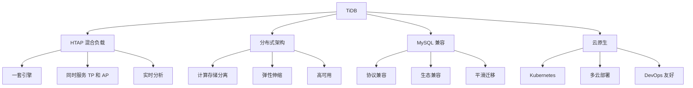
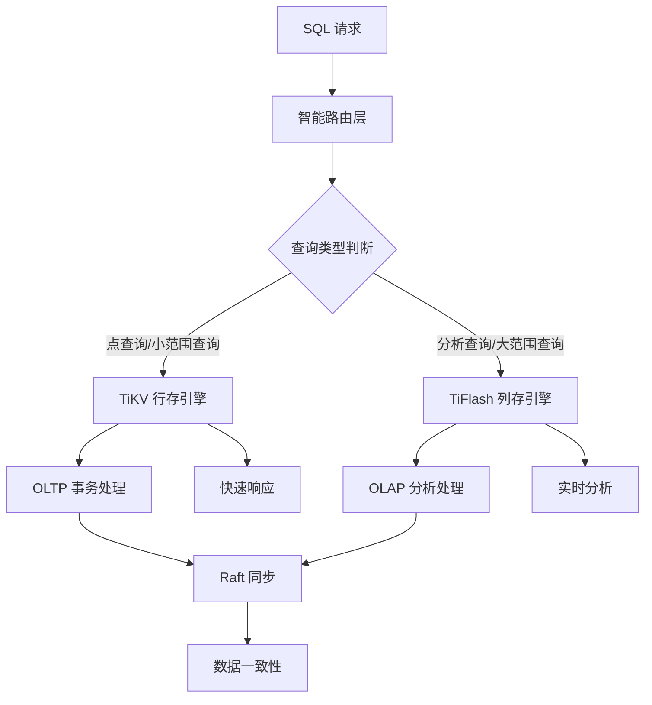
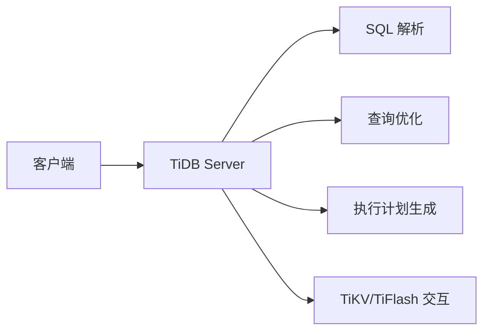
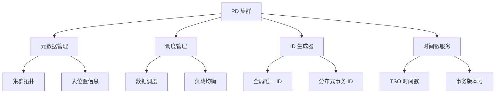

# ：TiDB HTAP 混合负载架构

> **难度等级**：⭐⭐ 进阶 | **学习时长**：6小时 | **实战项目**：实时数据分析平台

## 📚 本章目录

- [14.1 TiDB 概述](#141-tidb-概述)
- [14.2 HTAP 架构原理](#142-htap-架构原理)
- [14.3 核心组件](#143-核心组件)
- [14.4 部署与安装](#144-部署与安装)
- [14.5 SQL 兼容性](#145-sql-兼容性)
- [14.6 TiFlash 实战](#146-tiflash-实战)
- [14.7 性能优化](#147-性能优化)

---

## TiDB 概述

### 什么是 TiDB？

**TiDB** 是**PingCAP** 公司研发的开源分布式关系数据库，具有以下核心特点：



### 发展历程

| 时间 | 里程碑 |
|-----|-------|
| **2015年** | PingCAP 成立，启动 TiDB 研发 |
| **2016年** | TiDB 成为 CNCF 孵化项目 |
| **2017年** | TiDB 2.0 发布，支持 HTAP |
| **2018年** | TiDB 3.0 发布，TiFlash 正式上线 |
| **2020年** | TiDB 5.0 发布，性能大幅提升 |
| **2021年** | TiDB Cloud 公有云服务上线 |
| **2023年** | TiDB 7.0 发布，向量化执行引擎 |
| **2024年** | TiDB 8.0 发布，列存增强 |
| **2025年** | TiDB 在中国金融、互联网行业广泛应用 |

### 应用场景

**金融行业**：
- 微众银行、平安银行、中信银行
- 互联网金融、支付系统
- 实时风控、反欺诈

**互联网**：
- 京东、美团、拼多多
- 电商订单、实时推荐
- 用户行为分析

**游戏行业**：
- 游戏数据分析
- 实时排行榜
- 在线运营分析

**传统行业**：
- 物流、制造、零售
- ERP、CRM、BI

---

## HTAP 架构原理

### 什么是 HTAP？

**HTAP (Hybrid Transactional/Analytical Processing)** = 混合事务/分析处理

```
传统架构 vs TiDB HTAP：

┌─────────────────────────────────────────────────────────────┐
│                    传统架构                                 │
├─────────────────────────────────────────────────────────────┤
│  业务应用 → OLTP 数据库 → ETL → OLAP 数据库 → BI 报表      │
│              (MySQL/Oracle)    (数据仓库)                  │
│                                                             │
│  问题：                                                       │
│  - 需要维护两套系统                                         │
│  - ETL 延迟（T+1 或更长）                                    │
│  - 数据一致性难以保证                                       │
│  - 运维成本高                                              │
└─────────────────────────────────────────────────────────────┘

┌─────────────────────────────────────────────────────────────┐
│                    TiDB HTAP 架构                            │
├─────────────────────────────────────────────────────────────┤
│  业务应用 → TiDB ─────────────────────────────────→ BI 报表 │
│              ├─ TiKV（行存，OLTP）                          │
│              └─ TiFlash（列存，OLAP）                       │
│                                                             │
│  优势：                                                       │
│  - 一套引擎，同时服务 TP 和 AP                              │
│  - 实时分析（毫秒级延迟）                                    │
│  - 数据强一致                                              │
│  - 运维简单                                                │
└─────────────────────────────────────────────────────────────┘
```

### TiDB HTAP 架构



### TiKV vs TiFlash

| 特性 | TiKV（行存） | TiFlash（列存） |
|-----|-------------|---------------|
| **存储方式** | 行式存储 | 列式存储 |
| **适用场景** | OLTP | OLAP |
| **查询特点** | 点查询、范围查询 | 分析查询、聚合 |
| **响应时间** | 毫秒级 | 毫秒-秒级 |
| **压缩比** | 2:1 ~ 5:1 | 10:1 ~ 100:1 |
| **数据同步** | 源数据 | Raft 实时同步 |

---

## 核心组件

### TiDB Server

**功能**：SQL 层，负责处理 SQL 请求



**核心功能**：
- SQL 解析与优化
- 事务管理
- 权限控制
- 元数据管理

### PD (Placement Driver)

**功能**：集群管理组件



### TiKV

**功能**：分布式KV存储引擎

**RocksDB 架构**：
```
TiKV
├─ Raft 层（分布式共识）
│  ├─ Leader（写操作）
│  └─ Follower（读操作）
├─ MVCC 层（多版本并发控制）
│  ├─ Transaction（事务）
│  └─ Snapshot（快照）
└─ RocksDB 层（本地存储）
   ├─ Column Family（列族）
   ├─ MemTable（内存表）
   ├─ SSTable（排序字符串表）
   └─ WAL（预写日志）
```

### TiFlash

**功能**：列存分析引擎

**Delta Tree 架构**：
```
TiFlash 存储结构
├─ Delta Tree（增量树）
│  ├─ Stable Layer（稳定层）
│  │  ├─ Column File（列文件）
│  │  └─ 索引
│  └─ Delta Layer（增量层）
│     ├─ Mutation Log
│     └─ 增量数据
└─ Raft Learner（Raft 学习者）
   └─ 从 TiKV 同步数据
```

---

## 部署与安装

### TiUP 部署（推荐）

**1. 安装 TiUP**：

```bash
# 安装 TiUP
curl --proto '=https' --tlsv1.2 -sSf https://tiup-mirrors.pingcap.com/install.sh | sh

# 设置环境变量
source ~/.bashrc
```

**2. 部署本地集群**：

```bash
# 部署本地测试集群
tiup playground --mode tidb --db 1 --pd 1 --kv 1 --tiflash 1

# 查看集群状态
tiup display <cluster-name>

# 连接 TiDB
mysql -h127.0.0.1 -P4000 -uroot
```

**3. 生产集群部署**：

```yaml
# topology.yaml
global:
  user: "tidb"
  ssh_port: 22
  deploy_dir: "/tidb-deploy"

tidb_servers:
  - host: 10.0.1.1
    port: 4000
  - host: 10.0.1.2
    port: 4000

pd_servers:
  - host: 10.0.1.10
    port: 2379
  - host: 10.0.1.11
    port: 2379

tikv_servers:
  - host: 10.0.1.20
    port: 20160
  - host: 10.0.1.21
    port: 20160

tiflash_servers:
  - host: 10.0.1.30
    port: 9000
    data_dir: "/data/tiflash"
```

```bash
# 执行部署
tiup cluster deploy my-cluster v8.0.0 ./topology.yaml

# 启动集群
tiup cluster start my-cluster
```

### Docker 部署（测试）

```bash
# 使用 Docker Compose
git clone https://github.com/pingcap/tidb-docker-compose
cd tidb-docker-compose

# 启动
docker-compose up -d

# 连接
mysql -h127.0.0.1 -P4000 -uroot
```

### TiDB Cloud

**一键部署**：
1. 访问 https://tidbcloud.com
2. 创建免费试用集群
3. 获取连接信息
4. 使用 MySQL 客户端连接

---

## SQL 兼容性

### MySQL 5.7/8.0 兼容

```sql
-- 1. 创建数据库
CREATE DATABASE testdb;

USE testdb;

-- 2. 创建表（完全兼容 MySQL 语法）
CREATE TABLE users (
    id BIGINT PRIMARY KEY AUTO_INCREMENT,
    username VARCHAR(50) NOT NULL UNIQUE,
    email VARCHAR(100) NOT NULL,
    status TINYINT DEFAULT 1,
    created_at TIMESTAMP DEFAULT CURRENT_TIMESTAMP,
    updated_at TIMESTAMP DEFAULT CURRENT_TIMESTAMP ON UPDATE CURRENT_TIMESTAMP,
    INDEX idx_status (status),
    INDEX idx_created (created_at)
) ENGINE=InnoDB DEFAULT CHARSET=utf8mb4;

-- 3. 插入数据
INSERT INTO users (username, email) VALUES
('alice', 'alice@example.com'),
('bob', 'bob@example.com');

-- 4. 查询（完全兼容）
SELECT * FROM users WHERE status = 1;
SELECT COUNT(*) FROM users WHERE created_at >= '2024-01-01';

-- 5. 更新
UPDATE users SET status = 2 WHERE id = 1;

-- 6. 删除
DELETE FROM users WHERE id = 1;

-- 7. 事务
BEGIN;
UPDATE users SET status = 2 WHERE id = 2;
INSERT INTO audit_log (user_id, action) VALUES (2, 'status_change');
COMMIT;
```

### TiDB 特有特性

```sql
-- 1. Sequence（序列）
CREATE SEQUENCE seq_user_id
    START WITH 1000
    INCREMENT BY 1
    MINVALUE 1000
    MAXVALUE 999999
    CACHE 100;

-- 使用序列
INSERT INTO users (id, username) VALUES (NEXT VALUE FOR seq_user_id, 'charlie');

-- 2. 自动分区（按时间）
CREATE TABLE orders (
    order_id BIGINT,
    user_id BIGINT,
    order_time DATETIME,
    amount DECIMAL(10,2),
    PRIMARY KEY (order_id, order_time)
) PARTITION BY RANGE (TO_DAYS(order_time))
(
    PARTITION p202401 VALUES LESS THAN (TO_DAYS('2024-02-01')),
    PARTITION p202402 VALUES LESS THAN (TO_DAYS('2024-03-01')),
    PARTITION p202403 VALUES LESS THAN (TO_DAYS('2024-04-01')),
    PARTITION pmax VALUES LESS THAN MAXVALUE
);

-- 3. SQL Hint（提示）
-- 强制使用 TiKV
SELECT /*+ USE_TIKV() */ * FROM orders WHERE order_id = 123;

-- 强制使用 TiFlash
SELECT /*+ USE_TIFLASH() */
    user_id, COUNT(*) as count, SUM(amount) as total
FROM orders
WHERE order_time >= '2024-01-01'
GROUP BY user_id;

-- 4. 批量插入优化
INSERT INTO users VALUES
(1, 'alice1', 'alice1@example.com', 1, NOW(), NOW()),
(2, 'alice2', 'alice2@example.com', 1, NOW(), NOW()),
(3, 'alice3', 'alice3@example.com', 1, NOW(), NOW());
```

---

## TiFlash 实战

### 创建 TiFlash 副本

```sql
-- 1. 创建表
CREATE TABLE orders (
    order_id BIGINT,
    user_id BIGINT,
    product_id BIGINT,
    order_time DATETIME,
    amount DECIMAL(10,2),
    status TINYINT,
    PRIMARY KEY (order_id, order_time)
);

-- 2. 插入测试数据
INSERT INTO orders VALUES
(1, 1001, 2001, '2024-01-15 10:00:00', 299.99, 1),
(2, 1002, 2002, '2024-01-15 11:00:00', 499.99, 1),
(3, 1001, 2003, '2024-01-15 14:00:00', 199.99, 2);

-- 3. 创建 TiFlash 副本
ALTER TABLE orders SET TIFLASH REPLICA 1;

-- 4. 查看同步状态
SELECT * FROM information_schema.tiflash_replica
WHERE TABLE_NAME = 'orders';

-- 等待同步完成（STATUS 为 'ok'）
```

### TiFlash 分析查询

```sql
-- 1. OLAP 分析查询（自动路由到 TiFlash）
SELECT
    user_id,
    COUNT(*) as order_count,
    SUM(amount) as total_amount,
    AVG(amount) as avg_amount
FROM orders
WHERE order_time >= '2024-01-01'
GROUP BY user_id
ORDER BY total_amount DESC;

-- 2. 实时报表查询
SELECT
    DATE(order_time) as order_date,
    COUNT(*) as daily_orders,
    SUM(amount) as daily_revenue
FROM orders
WHERE order_time >= DATE_SUB(CURRENT_DATE(), INTERVAL 7 DAY)
GROUP BY DATE(order_time)
ORDER BY order_date;

-- 3. 多维度分析
SELECT
    product_id,
    status,
    COUNT(*) as count,
    SUM(amount) as total
FROM orders
WHERE order_time >= '2024-01-01'
GROUP BY product_id, status
WITH ROLLUP;
```

### TiFlash 物化视图

```sql
-- 1. 创建物化视图
CREATE MATERIALIZED VIEW mv_user_daily_stats
AS
SELECT
    user_id,
    DATE(order_time) as order_date,
    COUNT(*) as order_count,
    SUM(amount) as total_amount,
    AVG(amount) as avg_amount
FROM orders
GROUP BY user_id, DATE(order_time);

-- 2. 查询物化视图
SELECT * FROM mv_user_daily_stats
WHERE user_id = 1001 AND order_date = '2024-01-15';

-- 3. 刷新物化视图
ALTER MATERIALIZE VIEW mv_user_daily_stats REFRESH;
```

---

## 性能优化

### 执行计划分析

```sql
-- 1. 查看执行计划
EXPLAIN SELECT * FROM users WHERE id = 123;

-- 2. 查看详细执行计划
EXPLAIN ANALYZE
SELECT user_id, COUNT(*) FROM orders
WHERE order_time >= '2024-01-01'
GROUP BY user_id;

-- 3. 查看表统计信息
SHOW STATS;

-- 4. 更新统计信息
ANALYZE TABLE users;
```

### 索引优化

```sql
-- 1. 创建二级索引
CREATE INDEX idx_users_email ON users(email);

-- 2. 创建复合索引
CREATE INDEX idx_orders_user_time ON orders(user_id, order_time);

-- 3. 查看索引
SHOW INDEX FROM users;

-- 4. 删除索引
DROP INDEX idx_users_email ON users;
```

### 批量写入优化

```sql
-- 1. 使用 LOAD DATA（推荐）
LOAD DATA LOCAL INFILE '/data/users.csv'
INTO TABLE users
FIELDS TERMINATED BY ','
ENCLOSED BY '"'
LINES TERMINATED BY '\n'
IGNORE 1 LINES
(username, email, status);

-- 2. 批量插入（使用事务）
BEGIN;
INSERT INTO orders VALUES (...), (...), (...);
INSERT INTO orders VALUES (...), (...), (...);
COMMIT;

-- 3. 使用 IMPORT（大量数据）
-- 需要先安装 importer 工具
```

---

## ✅ 本章小结

### 学习检查清单

完成本章学习后，请确认你能够：

- [ ] 理解 TiDB HTAP 架构原理
- [ ] 了解 TiDB 核心组件（TiDB Server、PD、TiKV、TiFlash）
- [ ] 使用 TiUP 部署 TiDB 集群
- [ ] 创建 TiFlash 副本
- [ ] 编写分析查询自动使用 TiFlash
- [ ] 进行基本的性能优化
- [ ] 从 MySQL 迁移到 TiDB

### 核心要点回顾

1. **HTAP 混合负载**：一套引擎同时服务 OLTP 和 OLAP
2. **智能路由**：自动选择 TiKV 或 TiFlash
3. **MySQL 兼容**：协议和语法完全兼容
4. **实时分析**：毫秒级分析查询
5. **云原生**：支持 Kubernetes、多云部署

## 📚 延伸阅读

- [第16章：国产分布式数据库 - OceanBase →](./chapter-15)
- [第17章：人大金仓 KingbaseES 实战 →](./chapter-16)
- [TiDB 官方文档](https://docs.pingcap.com/tidb)
- [PingCAP 学习社区](https://learn.pingcap.com/)

---

**更新时间**：2026年2月 | **版本**：v1.0
