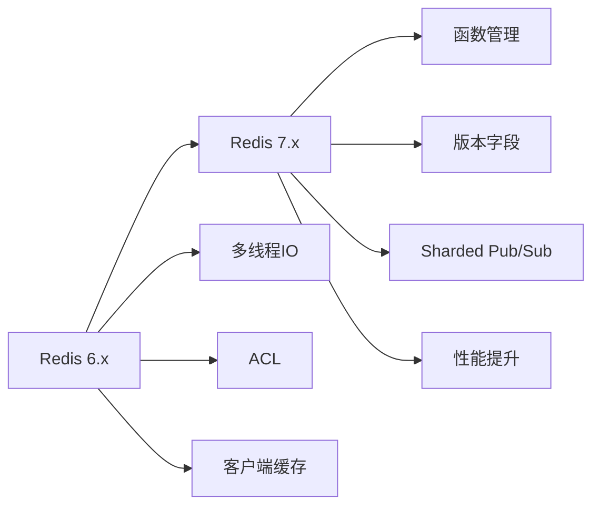

# ：Redis 高级应用

> **难度等级**：⭐⭐⭐ 中高级 | **学习时长**：10小时 | **实战项目**：高并发秒杀系统

## 📚 本章目录

- [21.1 Redis 7.x 新特性](#211-redis-7x-新特性)
- [21.2 数据结构高级用法](#212-数据结构高级用法)
- [21.3 持久化优化](#213-持久化优化)
- [21.4 集群模式](#214-集群模式)
- [21.5 缓存设计模式](#215-缓存设计模式)

---

## Redis 7.x 新特性

### 版本演进



### Redis 7.x 核心特性

**1. 函数管理（Functions）**

```lua
-- 定义函数（替代脚本）
redis.register_function('myfunction', function(keys, args)
    local key = keys[1]
    local value = args[1]

    -- 原子性操作
    local current = redis.call('GET', key)
    if current == false then
        redis.call('SET', key, value)
        return value
    else
        return current
    end
end)

-- 使用函数
FUNCTION LOAD "#!lua name=mylib\n${content}"
FCALL myfunction 1 mykey "myvalue"
```

**2. 版本字段**

```bash
# 使用版本字段实现乐观锁
SET user:1:name "Alice" VERSION 10
GET user:1:name  # 返回: "Alice" with version 10

# 使用 VERSION 选项更新
SET user:1:name "Bob" VERSION 10  # 成功
SET user:1:name "Charlie" VERSION 10  # 失败（版本已变更）
```

**3. 分片 Pub/Sub**

```bash
# 发布到不同分片
SPUBLISH shard1:channel:1 "message1"
SPUBLISH shard2:channel:2 "message2"

# 订阅特定分片
SSUBSCRIBE shard1:channel:1
```

**4. 性能提升**

```bash
# Redis 7.x 性能优化
# - 更快的列表操作
# - 优化的 SORT 命令
# - 改进的 ZSET 实现
# - 更低的延迟
```

---

## 数据结构高级用法

### String 高级用法

```bash
# 1. 计数器（原子性）
INCR page:views:123      # 自增
INCRBY user:123:balance 100  # 增加指定值
DECRBY inventory:product:456 1  # 减少库存

# 2. 分布式锁（SET NX EX）
SET lock:order:123 "uuid" NX EX 10
# NX: 不存在时设置
# EX: 10秒后自动释放

# 释放锁（Lua保证原子性）
if redis.call("get", KEYS[1]) == ARGV[1] then
    return redis.call("del", KEYS[1])
else
    return 0
end

# 3. 位图操作
SETBIT user:123:signed_in 20240211 1  # 第20240211位设置为1
GETBIT user:123:signed_in 20240211   # 获取该位的值

# 统计活跃用户
BITCOUNT user:123:signed_in          # 统计设置为1的位数
BITOP OR result user:1:signed_in user:2:signed_in  # 位运算

# 4. 位图高级应用（签到系统）
PFADD user:123:checkins "2024-02-11"  # HyperLogLog 去重统计
PFCOUNT user:123:checkins             # 估算唯一值数量

# 5. 限流（滑动窗口）
ZADD rate_limit:user:123 1707638400000 request1
ZADD rate_limit:user:123 1707638500000 request2
ZREMRANGEBYSCORE rate_limit:user:123 0 (1707638400000
ZCARD rate_limit:user:123  # 统计窗口内请求数
```

### Hash 高级用法

```bash
# 1. 用户信息存储
HSET user:123 name "Alice" age 25 email "alice@example.com"
HGET user:123 name
HGETALL user:123

# 2. 购物车
HADD cart:user:123 product:456 2  # 添加商品
HINCRBY cart:user:123 product:456 1  # 增加数量
HDEL cart:user:123 product:456  # 删除商品
HGETALL cart:user:123  # 获取所有商品

# 3. Hash 批量操作
HMSET product:123 name "iPhone" price 5999 stock 100
HMGET product:123 name price stock

# 4. Hash 原子操作
HINCRBY user:123:stats login_count 1
HINCRBYFLOAT user:123:wallet balance 100.50

# 5. Hash 字段管理
HEXISTS user:123 email
HKEYS user:123
HLEN user:123
```

### List 高级用法

```bash
# 1. 消息队列（LPUSH + BRPOP）
# 生产者
LPUSH queue:orders '{"order_id": 123, "user_id": 456}'

# 消费者
BRPOP queue:orders 0  # 阻塞式弹出

# 2. 最新列表（LPUSH + LRANGE）
LPUSH latest:users "user1"
LPUSH latest:users "user2"
LRANGE latest:users 0 9  # 获取最新10个

# 3. 列表裁剪（保留最新N条）
LTRIM latest:users 0 99  # 只保留最新100条

# 4. 阻塞队列（多消费者）
# 消费者1
BLPOP queue:tasks queue:priority:tasks 0

# 消费者2
BLPOP queue:tasks queue:priority:tasks 0

# 5. 列表插入和删除
LINSERT list:before BEFORE "value2" "new_value"
LREM list:items 0 "unwanted"  # 删除所有匹配的值
```

### Set 高级用法

```bash
# 1. 标签系统
SADD user:123:tags "python" "redis" "database"
SADD user:456:tags "python" "javascript"
SINTER user:123:tags user:456:tags  # 交集（共同标签）
SUNION user:123:tags user:456:tags  # 并集（所有标签）

# 2. 抽奖系统
SADD lottery:participants "user1" "user2" "user3"
SRANDMEMBER lottery:participants 1  # 随机抽取一个（不删除）
SPOP lottery:participants 1  # 随机抽取并删除

# 3. 共同好友
SADD user:123:friends "user2" "user3" "user4"
SADD user:456:friends "user3" "user4" "user5"
SINTER user:123:friends user:456:friends  # 共同好友

# 4. 唯一访客统计
SADD daily:active:20240211 "user1" "user2" "user3"
SCARD daily:active:20240211  # 统计活跃用户数

# 5. 集合运算
SDIFF set1 set2  # 差集
SINTER set1 set2 set3  # 多集交集
SUNIONSTORE result set1 set2  # 存储并集结果
```

### Sorted Set 高级用法

```bash
# 1. 排行榜
ZADD leaderboard 1000 "player1" 950 "player2" 1200 "player3"
ZREVRANGE leaderboard 0 9 WITHSCORES  # Top 10
ZREVRANK leaderboard "player3"  # 获取排名（从0开始）
ZSCORE leaderboard "player3"  # 获取分数

# 2. 延时队列
ZADD delayed:tasks 1707638400000 "task1"  # 时间戳作为score
ZADD delayed:tasks 1707638500000 "task2"
ZRANGEBYSCORE delayed:tasks 0 1707638400000  # 获取到期的任务
ZREM delayed:tasks "task1"  # 删除已处理的任务

# 3. 范围查询
ZRANGEBYSCORE leaderboard 900 1100 WITHSCORES  # 分数在900-1100之间
ZCOUNT leaderboard 900 1100  # 统计数量
ZREMRANGEBYRANK leaderboard 0 0  # 删除最后一名

# 4. 有序集合运算
ZUNIONSTORE result 2 set1 set2 WEIGHTS 1 2  # 并集（加权）
ZINTERSTORE result 2 set1 set2  # 交集

# 5. 时间序列数据
ZADD temperature:sensor:1 1707638400000 "20.5"
ZADD temperature:sensor:1 1707638500000 "21.0"
ZRANGEBYSCORE temperature:sensor:1 1707638400000 1707638500000
```

### Stream 高级用法

```bash
# 1. 消息队列（生产者）
XADD stream:orders * user_id 123 product_id 456 quantity 2

# 2. 消费者组
XGROUP CREATE stream:orders group1 $ MKSTREAM

# 消费消息
XREADGROUP GROUP group1 consumer1 COUNT 1 STREAMS stream:orders >

# 3. 确认消息
XACK stream:orders group1 message_id

# 4. 查看待处理消息
XPENDING stream:orders group1

# 5. 消息限流
XADD stream:events MAXLEN ~ 1000 * type "login" user_id 123

# 6. 消费者信息
XINFO GROUPS stream:orders
XINFO CONSUMERS stream:orders group1
```

---

## 持久化优化

### RDB（快照持久化）

```bash
# redis.conf 配置
save 900 1      # 900秒内至少1个key变化
save 300 10     # 300秒内至少10个key变化
save 60 10000   # 60秒内至少10000个key变化

# 手动触发
BGSAVE  # 后台保存
SAVE    # 同步保存（阻塞）

# RDB 文件管理
dir /var/lib/redis
dbfilename dump.rdb

# RDB 压缩
rdbcompression yes

# RDB 校验
rdbchecksum yes
```

**RDB 优点**：
- 文件紧凑，适合备份
- 恢复速度快
- 对性能影响小（fork子进程）

**RDB 缺点**：
- 可能丢失最后一次快照后的数据
- fork 大内存实例时性能下降

### AOF（追加文件）

```bash
# redis.conf 配置
appendonly yes
appendfilename "appendonly.aof"

# AOF 持久化策略
appendfsync always    # 每次写入都同步（最安全但最慢）
appendfsync everysec  # 每秒同步（推荐）
appendfsync no        # 由操作系统决定（最快但可能丢失数据）

# AOF 重写配置
auto-aof-rewrite-percentage 100  # 增长100%时触发重写
auto-aof-rewrite-min-size 64mb   # 最小重写大小

# AOF 重写
BGREWRITEAOF  # 手动触发重写
```

**AOF 优点**：
- 数据安全性高
- 可读性强（易于修复）
- 自动重写防止文件过大

**AOF 缺点**：
- 文件体积大
- 恢复速度慢于RDB
- 性能影响略高于RDB

### 混合持久化（RDB + AOF）

```bash
# 启用混合持久化（Redis 4.0+）
aof-use-rdb-preamble yes

# 工作原理：
# 1. AOF 文件包含 RDB 格式的基数据
# 2. 后续增量数据以 AOF 格式追加
# 3. 重写时生成新的 RDB 基数据
```

**持久化选择建议**：

| 场景 | 推荐方案 |
|-----|---------|
| 数据可丢失 | RDB |
| 数据不能丢失 | AOF + everysec |
| 追求性能 | AOF + no |
| 数据安全+性能兼顾 | 混合持久化 |

### 持久化监控

```bash
# 查看持久化状态
INFO persistence

# 关键指标
# rdb_last_save_time: 最后一次RDB保存时间
# aof_rewrite_in_progress: AOF重写是否进行中
# aof_buffer_length: AOF缓冲区大小
# aof_pending_rewrite: 待重写大小

# 慢查询（持久化相关）
SLOWLOG GET 10
```

---

## 集群模式

### 主从复制

```
┌─────────────────────────────────────────┐
│              主从复制架构                │
├─────────────────────────────────────────┤
│                                         │
│    ┌─────────┐                          │
│    │ Master  │  写操作                  │
│    │ :6379   │ ────┐                    │
│    └────┬────┘     │                    │
│         │          │ 同步               │
│         ├──────────┘                    │
│         │                               │
│    ┌────┴─────┐  ┌──────────┐          │
│    │ Slave 1  │  │ Slave 2  │  读操作   │
│    │ :6380    │  │ :6381    │           │
│    └──────────┘  └──────────┘           │
│                                         │
└─────────────────────────────────────────┘
```

```bash
# 主节点配置（redis.conf）
bind 0.0.0.0
port 6379
requirepass yourpassword
masterauth yourpassword

# 从节点配置（redis.conf）
replicaof 192.168.1.100 6379
masterauth yourpassword
replica-read-only yes

# 动态配置
REPLICAOF 192.168.1.100 6379
```

### Sentinel（哨兵）

```
┌────────────────────────────────────────────────────────┐
│                   Sentinel 集群                        │
├────────────────────────────────────────────────────────┤
│                                                        │
│  ┌─────────┐  ┌─────────┐  ┌─────────┐               │
│  │Sentinel1│  │Sentinel2│  │Sentinel3│               │
│  │ :26379  │  │ :26380  │  │ :26381  │               │
│  └────┬────┘  └────┬────┘  └────┬────┘               │
│       │            │            │                     │
│       └────────────┴────────────┘                     │
│                    │                                   │
│       ┌────────────┴────────────┐                     │
│       │      监控 & 自动故障转移  │                     │
│       └─────────────────────────┘                     │
│                                                        │
│  ┌─────────┐  ┌─────────┐  ┌─────────┐               │
│  │ Master  │  │ Slave 1 │  │ Slave 2 │               │
│  │ :6379   │──│ :6380   │──│ :6381   │               │
│  └─────────┘  └─────────┘  └─────────┘               │
│                                                        │
└────────────────────────────────────────────────────────┘
```

```bash
# sentinel.conf 配置
port 26379
sentinel monitor mymaster 192.168.1.100 6379 2
sentinel auth-pass mymaster yourpassword
sentinel down-after-milliseconds mymaster 5000
sentinel parallel-syncs mymaster 1
sentinel failover-timeout mymaster 10000

# 启动 Sentinel
redis-sentinel /path/to/sentinel.conf

# 查询 Sentinel 状态
SENTINEL masters
SENTINEL slaves mymaster
SENTINEL get-master-addr-by-name mymaster
```

### Cluster（集群）

```
┌──────────────────────────────────────────────────────────┐
│                  Redis Cluster 架构                      │
├──────────────────────────────────────────────────────────┤
│                                                          │
│  16384 个哈希槽（Slots）                                  │
│  ┌─────────┬─────────┬─────────┬─────────┐             │
│  │Slot 0   │Slot 1   │ ...     │Slot 16383│             │
│  └────┬────┴────┬────┴────┬────┴────┬────┘             │
│       │         │         │         │                   │
│  ┌────┴────┐ ┌──┴───┐ ┌──┴───┐ ┌──┴────┐              │
│  │ Master  │ │Master│ │Master│ │ Master│              │
│  │  (Slot  │ │(Slot │ │(Slot │ │ (Slot │              │
│  │  0-4000)│ │4001- │ │8001- │ │12001- │              │
│  │         │ │8000) │ │12000)│ │16383) │              │
│  │ :7000   │ │:7001 │ │:7002 │ │ :7003 │              │
│  └────┬────┘ └──┬───┘ └──┬───┘ └──┬────┘              │
│       │         │        │        │                   │
│  ┌────┴────┐ ┌──┴───┐ ┌──┴───┐ ┌──┴────┐              │
│  │ Slave   │ │Slave │ │Slave │ │ Slave │              │
│  │ :7004   │ │:7005 │ │:7006 │ │ :7007 │              │
│  └─────────┘ └──────┘ └──────┘ └───────┘              │
│                                                          │
│                    Smart Client                         │
│              (了解槽分布，直连节点)                      │
│                                                          │
└──────────────────────────────────────────────────────────┘
```

```bash
# cluster 配置
cluster-enabled yes
cluster-config-file nodes.conf
cluster-node-timeout 5000
cluster-require-full-coverage yes

# 创建集群
redis-cli --cluster create \
  192.168.1.100:7000 \
  192.168.1.100:7001 \
  192.168.1.100:7002 \
  192.168.1.100:7003 \
  --cluster-replicas 1

# 集群操作
redis-cli -c -p 7000  # -c: 集群模式
CLUSTER NODES        # 查看节点
CLUSTER INFO         # 查看集群信息
CLUSTER SLOTS        # 查看槽分配
CLUSTER KEYSLOT key  # 计算键的槽位

# 槽迁移（重新分片）
redis-cli --cluster reshard 192.168.1.100:7000 \
  --cluster-from <node-id> \
  --cluster-to <node-id> \
  --cluster-slots 1000 \
  --cluster-yes
```

---

## 缓存设计模式

### Cache-Aside Pattern

```javascript
// 读取数据
async function getUser(userId) {
  // 1. 查询缓存
  const cacheData = await redis.get(`user:${userId}`);
  if (cacheData) {
    return JSON.parse(cacheData);
  }

  // 2. 缓存未命中，查询数据库
  const dbData = await db.query('SELECT * FROM users WHERE id = ?', [userId]);

  // 3. 写入缓存
  await redis.setex(`user:${userId}`, 3600, JSON.stringify(dbData));

  return dbData;
}

// 更新数据
async function updateUser(userId, userData) {
  // 1. 更新数据库
  await db.query('UPDATE users SET ? WHERE id = ?', [userData, userId]);

  // 2. 删除缓存（而非更新）
  await redis.del(`user:${userId}`);
}
```

### Read-Through / Write-Through

```javascript
// Read-Through（缓存负责加载）
class ReadThroughCache {
  async get(key) {
    let data = await redis.get(key);

    if (!data) {
      // 缓存未命中，自动加载数据
      data = await this.loadFromDB(key);
      await redis.setex(key, 3600, JSON.stringify(data));
    }

    return JSON.parse(data);
  }

  async loadFromDB(key) {
    const userId = key.split(':')[1];
    return await db.query('SELECT * FROM users WHERE id = ?', [userId]);
  }
}

// Write-Through（同步写缓存和数据库）
async function setUser(userId, userData) {
  // 同时写入缓存和数据库
  await Promise.all([
    redis.setex(`user:${userId}`, 3600, JSON.stringify(userData)),
    db.query('REPLACE INTO users SET ?', [{ id: userId, ...userData }])
  ]);
}
```

### 缓存预热

```javascript
// 系统启动时预加载热点数据
async function warmUpCache() {
  const hotUsers = await db.query(`
    SELECT user_id
    FROM user_statistics
    WHERE pageviews > 10000
    ORDER BY pageviews DESC
    LIMIT 1000
  `);

  for (const user of hotUsers) {
    const userData = await db.query('SELECT * FROM users WHERE id = ?', [user.user_id]);
    await redis.setex(`user:${user.user_id}`, 3600, JSON.stringify(userData));
  }
}
```

### 缓存穿透保护

```javascript
// 布隆过滤器
const { BloomFilter } = require('bloom-filters');

const filter = new BloomFilter(1000000, 0.01);  // 100万元素，1%误判率

// 初始化布隆过滤器
async function initBloomFilter() {
  const userIds = await db.query('SELECT id FROM users');
  userIds.forEach(user => filter.add(user.id));
}

// 查询时先检查布隆过滤器
async function getUser(userId) {
  // 布隆过滤器快速判断不存在
  if (!filter.has(userId)) {
    return null;  // 一定不存在，直接返回
  }

  // 可能存在，查询缓存和数据库
  const cacheData = await redis.get(`user:${userId}`);
  if (cacheData) {
    return JSON.parse(cacheData);
  }

  const dbData = await db.query('SELECT * FROM users WHERE id = ?', [userId]);
  if (dbData) {
    await redis.setex(`user:${userId}`, 3600, JSON.stringify(dbData));
  } else {
    // 缓存空值，防止穿透
    await redis.setex(`user:${userId}`, 60, 'NULL');
  }

  return dbData;
}
```

### 缓存雪崩保护

```javascript
// 1. 随机过期时间
async function setCache(key, value) {
  const baseExpire = 3600;  // 基础过期时间1小时
  const randomExpire = Math.floor(Math.random() * 300);  // 随机0-5分钟
  await redis.setex(key, baseExpire + randomExpire, JSON.stringify(value));
}

// 2. 多级缓存
async function getUser(userId) {
  // L1: 本地缓存（最快）
  let data = localCache.get(`user:${userId}`);
  if (data) return data;

  // L2: Redis 缓存
  data = await redis.get(`user:${userId}`);
  if (data) {
    localCache.set(`user:${userId}`, JSON.parse(data));
    return JSON.parse(data);
  }

  // L3: 数据库
  data = await db.query('SELECT * FROM users WHERE id = ?', [userId]);
  if (data) {
    await redis.setex(`user:${userId}`, 3600, JSON.stringify(data));
    localCache.set(`user:${userId}`, data);
  }

  return data;
}
```

### 分布式锁

```javascript
// Redlock 算法实现
class DistributedLock {
  constructor(redis, key, ttl = 10000) {
    this.redis = redis;
    this.key = `lock:${key}`;
    this.ttl = ttl;
    this.value = crypto.randomUUID();
  }

  async acquire() {
    const result = await this.redis.set(
      this.key,
      this.value,
      'NX',
      'PX',
      this.ttl
    );
    return result === 'OK';
  }

  async release() {
    const script = `
      if redis.call("get", KEYS[1]) == ARGV[1] then
        return redis.call("del", KEYS[1])
      else
        return 0
      end
    `;
    await this.redis.eval(script, 1, this.key, this.value);
  }
}

// 使用示例
const lock = new DistributedLock(redis, 'order:123');
if (await lock.acquire()) {
  try {
    // 执行业务逻辑
    await processOrder(123);
  } finally {
    await lock.release();
  }
}
```

---

## ✅ 本章小结

### 学习检查清单

完成本章学习后，请确认你能够：

- [ ] 理解 Redis 7.x 的新特性
- [ ] 熟练使用各种数据结构的高级用法
- [ ] 选择合适的持久化方案（RDB/AOF/混合）
- [ ] 部署主从复制、Sentinel 和 Cluster
- [ ] 实现常见的缓存设计模式
- [ ] 解决缓存穿透、击穿、雪崩问题
- [ ] 实现分布式锁
- [ ] 设计高并发秒杀系统

### 核心要点回顾

1. **数据结构**：5种基础结构 + Stream + 高级用法
2. **持久化**：RDB快照 + AOF日志 + 混合持久化
3. **集群**：主从复制 + Sentinel高可用 + Cluster分片
4. **缓存模式**：Cache-Aside、Read-Through、Write-Through
5. **问题解决**：穿透（布隆过滤器）、击穿（互斥锁）、雪崩（多级缓存）

## 📚 延伸阅读

- [第23章：MongoDB 文档数据库 →](./chapter-22)
- [第24章：Elasticsearch 搜索引擎 →](./chapter-23)
- [第25章：分库分表架构设计 →](./chapter-24)
- [Redis 官方文档](https://redis.io/docs/)
- [Redis 最佳实践](https://redis.io/topics/best-practices)

---

**更新时间**：2026年2月 | **版本**：v1.0
