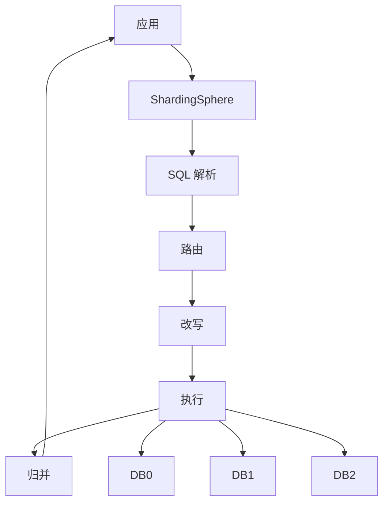

# ：分库分表架构设计

> **难度等级**：⭐⭐⭐⭐ 高级 | **学习时长**：15小时 | **实战项目**：亿级用户系统

## 📚 本章目录

- [23.1 分库分表策略](#231-分库分表策略)
- [23.2 ShardingSphere 实践](#232-shardingsphere-实践)
- [23.3 数据迁移](#233-数据迁移)
- [23.4 路由策略](#234-路由策略)
- [23.5 扩缩容方案](#235-扩缩容方案)

---

## 分库分表策略

### 为什么要分库分表

**性能瓶颈**：

```
┌──────────────────────────────────────────────────────┐
│               单机数据库瓶颈                          │
├──────────────────────────────────────────────────────┤
│                                                      │
│  数据量增长 → 1000万+ 记录 → 查询变慢                │
│  并发增加 → 10000+ QPS → 数据库压力过大              │
│  磁盘空间 → 单盘有限 → 无法无限扩展                  │
│  网络带宽 → 单机瓶颈 → 成为性能瓶颈                  │
│                                                      │
└──────────────────────────────────────────────────────┘

          ↓ 分库分表解决

┌──────────────────────────────────────────────────────┐
│                分库分表架构                           │
├──────────────────────────────────────────────────────┤
│                                                      │
│  数据水平分散 → 减少单表数据量 → 提升查询速度        │
│  请求分散 → 降低单库压力 → 提升并发能力              │
│  多机存储 → 横向扩展 → 无限容量                      │
│  负载均衡 → 优化资源利用 → 提升整体性能              │
│                                                      │
└──────────────────────────────────────────────────────┘
```

**何时需要分库分表**：

| 指标 | 阈值 | 说明 |
|-----|------|-----|
| **数据量** | 单表 > 1000万 | B+树深度增加，查询变慢 |
| **并发量** | 单库 QPS > 5000 | CPU、磁盘IO成为瓶颈 |
| **磁盘空间** | 单库 > 500GB | 备份、恢复困难 |
| **网络带宽** | 带宽使用率 > 70% | 网络成为瓶颈 |

### 分库分表方案

**1. 垂直分库（按业务拆分）**

```
┌──────────────────────────────────────────────────────┐
│                   单体数据库                          │
│  ┌────────┐ ┌────────┐ ┌────────┐ ┌────────┐        │
│  │ 用户表 │ │ 订单表 │ │ 商品表 │ │ 日志表 │        │
│  └────────┘ └────────┘ └────────┘ └────────┘        │
└──────────────────────────────────────────────────────┘
                        ↓
┌──────────────────────────────────────────────────────┐
│                   垂直分库                            │
├──────────────────────────────────────────────────────┤
│                                                      │
│  ┌────────────┐  ┌────────────┐  ┌────────────┐    │
│  │ 用户数据库 │  │ 订单数据库 │  │ 商品数据库 │    │
│  │ user_db    │  │ order_db   │  │ product_db │    │
│  │            │  │            │  │            │    │
│  │ - users    │  │ - orders   │  │ - products │    │
│  │ - profiles │  │ - payments │  │ - categories│   │
│  └────────────┘  └────────────┘  └────────────┘    │
│                                                      │
│  ┌────────────┐                                      │
│  │ 日志数据库 │  (独立部署，不影响核心业务)          │
│  │ log_db     │                                      │
│  └────────────┘                                      │
└──────────────────────────────────────────────────────┘

优点：
✅ 业务解耦，便于维护
✅ 降低单库连接数
✅ 便于独立优化和扩展
✅ 故障隔离

缺点：
❌ 跨库事务问题
❌ 跨库 JOIN 困难
❌ 应用层复杂度增加
```

**2. 水平分表（单库分表）**

```
┌──────────────────────────────────────────────────────┐
│                    水平分表                           │
├──────────────────────────────────────────────────────┤
│                                                      │
│  orders 表（数据量 5000万）                           │
│          ↓                                           │
│  ┌─────────┬─────────┬─────────┬─────────┐          │
│  │orders_0 │orders_1 │orders_2 │orders_3 │          │
│  │1250万   │1250万   │1250万   │1250万   │          │
│  └─────────┴─────────┴─────────┴─────────┘          │
│                                                      │
│  分表规则：user_id % 4                               │
│  - orders_0: user_id % 4 = 0                         │
│  - orders_1: user_id % 4 = 1                         │
│  - orders_2: user_id % 4 = 2                         │
│  - orders_3: user_id % 4 = 3                         │
│                                                      │
└──────────────────────────────────────────────────────┘

优点：
✅ 减少单表数据量
✅ 提升查询性能
✅ 不跨库，事务相对简单

缺点：
❌ 跨表 JOIN 困难
❌ 数据扩容需要迁移
❌ 应用层路由复杂
```

**3. 水平分库（分库分表）**

```
┌──────────────────────────────────────────────────────┐
│                   水平分库分表                         │
├──────────────────────────────────────────────────────┤
│                                                      │
│  ┌──────────────────────────────────────────┐       │
│  │          DB0（192.168.1.10）              │       │
│  │  ┌────────┐ ┌────────┐ ┌────────┐        │       │
│  │  │orders_0│ │orders_1│ │users_0 │        │       │
│  │  └────────┘ └────────┘ └────────┘        │       │
│  └──────────────────────────────────────────┘       │
│                                                      │
│  ┌──────────────────────────────────────────┐       │
│  │          DB1（192.168.1.11）              │       │
│  │  ┌────────┐ ┌────────┐ ┌────────┐        │       │
│  │  │orders_2│ │orders_3│ │users_1 │        │       │
│  │  └────────┘ └────────┘ └────────┘        │       │
│  └──────────────────────────────────────────┘       │
│                                                      │
│  分库规则：user_id % 2                               │
│  分表规则：user_id % 2                               │
│                                                      │
│  user_id=1 → DB0.users_0                            │
│  user_id=2 → DB1.users_1                            │
│  user_id=3 → DB0.users_0                            │
│  user_id=4 → DB1.users_1                            │
│                                                      │
└──────────────────────────────────────────────────────┘

优点：
✅ 性能线性扩展
✅ 降低单库压力
✅ 提升系统容量

缺点：
❌ 架构复杂
❌ 跨库事务困难
❌ 运维成本高
❌ 数据迁移困难
```

### 分片策略选择

**1. Hash 分片**

```sql
-- 优点：数据均匀分布
-- 缺点：扩容需要数据迁移

-- 分片函数
shard_index = hash(user_id) % shard_count

-- 示例
user_id = 12345
shard_count = 4
shard_index = hash(12345) % 4 = 1  → orders_1
```

**2. Range 分片**

```sql
-- 优点：范围查询快
-- 缺点：可能数据分布不均

-- 按用户ID范围
DB0: 0 - 1000000
DB1: 1000001 - 2000000
DB2: 2000001 - 3000000
DB3: 3000001 - 4000000

-- 按时间范围
DB0: 2024年数据
DB1: 2023年数据
DB2: 2022年数据
```

**3. 一致性Hash**

```
                    Hash 环
         ┌─────────────────────────┐
        │                          │
      DB3 ─                      ─ DB1
          │\                    /│
          │ \                  / │
          │  \                /  │
          │   \              /   │
          │    \            /    │
          │     \          /     │
          │      \        /      │
          │       \      /       │
          │        \    /        │
          │         \  /         │
          │          \/          │
          │          /\          │
          │         /  \         │
        DB0 ──────/    \──────── DB2
                  /      \
                 /        \


优点：
✅ 最小化数据迁移
✅ 节点增删影响最小

缺点：
❌ 实现复杂
❌ 可能分布不均（需要虚拟节点）
```

---

## ShardingSphere 实践

### ShardingSphere 架构



### Sharding-JDBC 配置

**Spring Boot 配置（YAML）**：

```yaml
spring:
  shardingsphere:
    datasource:
      names: ds0,ds1
      ds0:
        type: com.zaxxer.hikari.HikariDataSource
        driver-class-name: com.mysql.cj.jdbc.Driver
        jdbc-url: jdbc:mysql://192.168.1.10:3306/db0
        username: root
        password: password
      ds1:
        type: com.zaxxer.hikari.HikariDataSource
        driver-class-name: com.mysql.cj.jdbc.Driver
        jdbc-url: jdbc:mysql://192.168.1.11:3306/db1
        username: root
        password: password

    rules:
      sharding:
        tables:
          # 订单表配置
          t_order:
            actual-data-nodes: ds$->{0..1}.t_order_$->{0..1}
            database-strategy:
              standard:
                sharding-column: user_id
                sharding-algorithm-name: db_mod
            table-strategy:
              standard:
                sharding-column: user_id
                sharding-algorithm-name: table_mod
            key-generate-strategy:
              column: order_id
              key-generator-name: snowflake

        sharding-algorithms:
          db_mod:
            type: MOD
            props:
              sharding-count: 2
          table_mod:
            type: MOD
            props:
              sharding-count: 2

        key-generators:
          snowflake:
            type: SNOWFLAKE

    props:
      sql-show: true
```

**Java 配置**：

```java
@Configuration
public class ShardingConfig {

    @Bean
    public DataSource shardingDataSource() throws SQLException {
        // 配置数据源
        Map<String, DataSource> dataSourceMap = new HashMap<>();
        dataSourceMap.put("ds0", createDataSource("192.168.1.10", "db0"));
        dataSourceMap.put("ds1", createDataSource("192.168.1.11", "db1"));

        // 订单表规则
        ShardingRuleConfiguration orderRule = new ShardingRuleConfiguration();
        orderRule.getTables().add(getOrderTableRule());

        // 分片算法
        Properties dbProps = new Properties();
        dbProps.setProperty("sharding-count", "2");

        Properties tableProps = new Properties();
        tableProps.setProperty("sharding-count", "2");

        orderRule.getShardingAlgorithms().put("db_mod",
            new ShardingAlgorithmsConfiguration("MOD", dbProps));
        orderRule.getShardingAlgorithms().put("table_mod",
            new ShardingAlgorithmsConfiguration("MOD", tableProps));

        // 创建 ShardingDataSource
        return ShardingSphereDataSourceFactory.createDataSource(
            dataSourceMap,
            Collections.singleton(orderRule),
            new Properties()
        );
    }

    private ShardingTableRuleConfiguration getOrderTableRule() {
        ShardingTableRuleConfiguration table = new ShardingTableRuleConfiguration(
            "t_order",
            "ds$->{0..1}.t_order_$->{0..1}"
        );

        // 分库策略
        table.setDatabaseShardingStrategy(new StandardShardingStrategyConfiguration(
            "user_id",
            "db_mod"
        ));

        // 分表策略
        table.setTableShardingStrategy(new StandardShardingStrategyConfiguration(
            "user_id",
            "table_mod"
        ));

        // 主键生成
        table.setKeyGenerateStrategy(new KeyGenerateStrategyConfiguration(
            "order_id",
            "snowflake"
        ));

        return table;
    }

    private DataSource createDataSource(String host, String database) {
        HikariConfig config = new HikariConfig();
        config.setDriverClassName("com.mysql.cj.jdbc.Driver");
        config.setJdbcUrl(String.format("jdbc:mysql://%s:3306/%s", host, database));
        config.setUsername("root");
        config.setPassword("password");
        config.setMaximumPoolSize(10);
        return new HikariDataSource(config);
    }
}
```

### 读写分离

```yaml
spring:
  shardingsphere:
    datasource:
      names: master,slave0,slave1
      master:
        type: com.zaxxer.hikari.HikariDataSource
        jdbc-url: jdbc:mysql://192.168.1.10:3306/db
        username: root
        password: password
      slave0:
        type: com.zaxxer.hikari.HikariDataSource
        jdbc-url: jdbc:mysql://192.168.1.11:3306/db
        username: root
        password: password
      slave1:
        type: com.zaxxer.hikari.HikariDataSource
        jdbc-url: jdbc:mysql://192.168.1.12:3306/db
        username: root
        password: password

    rules:
      readwrite-splitting:
        data-sources:
          readwrite_ds:
            static-strategy:
              write-data-source-name: master
              read-data-source-names: slave0,slave1
            load-balancer-name: round_robin

        load-balancers:
          round_robin:
            type: ROUND_ROBIN
```

### 广播表配置

```yaml
# 广播表：每个库都有一份完整的表数据
# 适合数据量小、改动少的字典表

spring:
  shardingsphere:
    rules:
      sharding:
        broadcast-tables:
          - t_dict  # 字典表
          - t_config  # 配置表
          - t_region  # 地区表

        tables:
          t_dict:
            key-generate-strategy:
              column: id
              key-generator-name: snowflake
```

### 绑定表配置

```yaml
# 绑定表：分片键相同的表，在关联查询时避免笛卡尔积

spring:
  shardingsphere:
    rules:
      sharding:
        binding-tables:
          - t_order,t_order_item  # 订单表和订单明细表绑定

        tables:
          t_order:
            actual-data-nodes: ds$->{0..1}.t_order_$->{0..1}
            table-strategy:
              standard:
                sharding-column: user_id
                sharding-algorithm-name: table_mod

          t_order_item:
            actual-data-nodes: ds$->{0..1}.t_order_item_$->{0..1}
            table-strategy:
              standard:
                sharding-column: user_id
                sharding-algorithm-name: table_mod

# 关联查询示例：
# SELECT * FROM t_order o JOIN t_order_item i ON o.order_id = i.order_id
#
# 不使用绑定表：笛卡尔积 → 2库 x 2表 x 2库 x 2表 = 16次查询
# 使用绑定表：4次查询（同一分片的表直接 JOIN）
```

---

## 数据迁移

### 停机迁移（简单粗暴）

```bash
# 步骤：
# 1. 停止应用写入
# 2. 导出全量数据
mysqldump -u root -p --single-transaction --routines --triggers \
  --all-databases > full_backup.sql

# 3. 导入到新库
mysql -u root -p < full_backup.sql

# 4. 验证数据一致性
# 5. 切换应用配置
# 6. 重启应用

# 缺点：长时间停机，用户体验差
```

### 双写迁移（推荐）

```
┌──────────────────────────────────────────────────────┐
│                  双写迁移流程                         │
├──────────────────────────────────────────────────────┤
│                                                      │
│  阶段1: 应用双写                                      │
│  ┌────────┐    ┌────────────┐                      │
│  │ 应用   │───→│ 旧库（主）  │                      │
│  │        │───→│ 新库（从）  │                      │
│  └────────┘    └────────────┘                      │
│         ↓         ↓         ↓                        │
│      双写数据     同步（异步）                       │
│                                                      │
│  阶段2: 历史数据迁移                                  │
│  ┌──────────┐      ┌────────────┐                  │
│  │ 迁移程序 │ ───→ │ 新库（从）  │                  │
│  └──────────┘      └────────────┘                  │
│       批量迁移                                       │
│                                                      │
│  阶段3: 数据校验                                      │
│  ┌──────────┐      ┌───────────┐                   │
│  │ 校验程序 │ ───→ │ 差异修复   │                   │
│  └──────────┘      └───────────┘                   │
│                                                      │
│  阶段4: 切换读流量                                    │
│  ┌────────┐    ┌────────────┐                      │
│  │ 应用   │───→│ 新库（主）  │ ← 读流量切换         │
│  │        │───→│ 旧库（从）  │                      │
│  └────────┘    └────────────┘                      │
│                                                      │
│  阶段5: 停止旧库写入                                  │
│  ┌────────┐    ┌────────────┐                      │
│  │ 应用   │───→│ 新库（主）  │                      │
│  └────────┘    └────────────┘                      │
│                                                      │
└──────────────────────────────────────────────────────┘
```

**双写迁移代码示例**：

```java
@Service
public class OrderService {

    @Autowired
    private OrderMapper oldOrderMapper;

    @Autowired
    private OrderMapper newOrderMapper;

    // 双写
    @Transactional
    public void createOrder(Order order) {
        // 先写旧库
        oldOrderMapper.insert(order);

        // 异步写新库（失败不影响主流程）
        CompletableFuture.runAsync(() -> {
            try {
                newOrderMapper.insert(order);
            } catch (Exception e) {
                log.error("写入新库失败", e);
                // 保存到失败队列，后续重试
                failureQueue.add(order);
            }
        });
    }

    // 数据迁移
    public void migrateData() {
        int pageSize = 1000;
        int lastId = 0;

        while (true) {
            List<Order> orders = oldOrderMapper.selectByIdRange(lastId, lastId + pageSize);

            if (orders.isEmpty()) {
                break;
            }

            // 批量插入新库
            for (Order order : orders) {
                try {
                    newOrderMapper.insert(order);
                } catch (Exception e) {
                    log.error("迁移订单失败: {}", order.getId(), e);
                }
            }

            lastId += pageSize;
        }
    }
}
```

### 增量同步

```java
// 基于 Binlog 的增量同步

@Service
public class BinlogSyncService {

    @Autowired
    private CanalClient canalClient;

    public void startSync() {
        while (true) {
            Message message = canalClient.getWithoutAck(100);
            long batchId = message.getId();
            List<CanalEntry.Entry> entries = message.getEntries();

            if (batchId != -1 && !entries.isEmpty()) {
                for (CanalEntry.Entry entry : entries) {
                    if (entry.getEntryType() == CanalEntry.EntryType.ROWDATA) {
                        CanalEntry.RowChange rowChange =
                            CanalEntry.RowChange.parseFrom(entry.getStoreValue());

                        for (CanalEntry.RowData rowData : rowChange.getRowDatasList()) {
                            if (rowChange.getEventType() == CanalEntry.EventType.INSERT) {
                                handleInsert(rowData.getAfterColumnsList());
                            } else if (rowChange.getEventType() == CanalEntry.EventType.UPDATE) {
                                handleUpdate(rowData.getAfterColumnsList());
                            } else if (rowChange.getEventType() == CanalEntry.EventType.DELETE) {
                                handleDelete(rowData.getBeforeColumnsList());
                            }
                        }
                    }
                }
            }

            canalClient.ack(batchId);
        }
    }
}
```

---

## 路由策略

### 分库分表路由

**标准路由**：

```java
// 基于单字段的路由
public interface ShardingAlgorithm extends ShardingAlgorithm {

    // doSharding 执行路由计算
    Collection<String> doSharding(
        Collection<String> availableTargetNames,
        ComplexKeysShardingValue shardingValue
    );
}

// 自定义取模路由
public class ModShardingAlgorithm implements PreciseShardingAlgorithm<Long> {

    private final int shardingCount;

    public ModShardingAlgorithm(int shardingCount) {
        this.shardingCount = shardingCount;
    }

    @Override
    public String doSharding(
        Collection<String> availableTargetNames,
        PreciseShardingValue<Long> shardingValue
    ) {
        Long value = shardingValue.getValue();
        int index = (int) (value % shardingCount);

        for (String target : availableTargetNames) {
            if (target.endsWith(String.valueOf(index))) {
                return target;
            }
        }

        throw new IllegalArgumentException("无可用分片");
    }
}
```

**复合路由**：

```java
// 多字段路由
public class ComplexShardingAlgorithm
    implements ComplexKeysShardingAlgorithm<Long> {

    @Override
    public Collection<String> doSharding(
        Collection<String> availableTargetNames,
        ComplexKeysShardingValue<Long> shardingValue
    ) {
        // 获取多个分片键的值
        Collection<Long> userIds = shardingValue.getColumnNameAndShardingValuesMap()
            .get("user_id");
        Collection<Long> orderIds = shardingValue.getColumnNameAndShardingValuesMap()
            .get("order_id");

        Set<String> result = new HashSet<>();

        if (userIds != null) {
            for (Long userId : userIds) {
                int index = (int) (userId % 4);
                result.add("t_order_" + index);
            }
        }

        if (orderIds != null) {
            for (Long orderId : orderIds) {
                int index = (int) (orderId % 4);
                result.add("t_order_" + index);
            }
        }

        return result;
    }
}
```

### Hint 路由（强制路由）

```java
// 使用 Hint 强制指定分片

@Service
public class OrderService {

    @Autowired
    private OrderMapper orderMapper;

    // 强制路由到指定分片
    public void forceInsertOrder(Order order, String shardingValue) {
        // 设置 Hint
        HintManager hintManager = HintManager.getInstance();
        try {
            // 添加分片值
            hintManager.addTableShardingValue("t_order", shardingValue);

            // 执行 SQL（会使用 Hint 路由）
            orderMapper.insert(order);
        } finally {
            hintManager.close();
        }
    }

    // 强制路由到主库
    public Order getOrderFromMaster(Long orderId) {
        HintManager hintManager = HintManager.getInstance();
        try {
            hintManager.setMasterRouteOnly();
            return orderMapper.selectById(orderId);
        } finally {
            hintManager.close();
        }
    }
}
```

---

## 扩缩容方案

### 在线扩容（倍增法）

```
┌──────────────────────────────────────────────────────┐
│              扩容前（2分片）                          │
├──────────────────────────────────────────────────────┤
│                                                      │
│  shard_0: user_id % 2 = 0                           │
│  shard_1: user_id % 2 = 1                           │
│                                                      │
└──────────────────────────────────────────────────────┘
                        ↓
┌──────────────────────────────────────────────────────┐
│              扩容后（4分片）                          │
├──────────────────────────────────────────────────────┤
│                                                      │
│  新分片规则：user_id % 4                             │
│                                                      │
│  shard_0: user_id % 4 = 0  ← 保留原有数据            │
│  shard_1: user_id % 4 = 1  ← 保留原有数据            │
│  shard_2: user_id % 4 = 2  ← 新建，需迁移数据        │
│  shard_3: user_id % 4 = 3  ← 新建，需迁移数据        │
│                                                      │
│  数据迁移：                                          │
│  - shard_0 的 50% 数据 → shard_2                    │
│  - shard_1 的 50% 数据 → shard_3                    │
│                                                      │
└──────────────────────────────────────────────────────┘

优点：
✅ 只需迁移一半数据
✅ 倍增扩容，迁移方案简单

缺点：
❌ 必须倍增，不够灵活
❌ 数据迁移量大
```

**扩容步骤**：

```java
// 1. 新建分片
CREATE DATABASE db2;
CREATE TABLE db2.t_order_2 LIKE db0.t_order_0;
CREATE TABLE db2.t_order_3 LIKE db0.t_order_1;

// 2. 数据迁移（双写 + 同步）
public void migrateShardData() {
    // 从 shard_0 迁移一半数据到 shard_2
    List<Order> orders = orderMapper.selectByShard(0);
    for (Order order : orders) {
        if (order.getUserId() % 4 == 2) {
            orderMapper.insertToShard(order, 2);
            // 验证后删除原数据
            orderMapper.deleteById(order.getId(), 0);
        }
    }
}

// 3. 切换路由规则
// 旧规则：user_id % 2
// 新规则：user_id % 4

// 4. 下线旧分片（可选）
```

### 一致性Hash扩容

```
┌──────────────────────────────────────────────────────┐
│           一致性Hash扩容（平滑扩容）                   │
├──────────────────────────────────────────────────────┤
│                                                      │
│  初始状态：3个节点                                    │
│  ┌──────────────────────────────────────┐           │
│  │      Hash 环                         │           │
│  │                                      │           │
│  │    DB0 ──── DB1 ──── DB2            │           │
│  │     |        |        |              │           │
│  │   1000个   1000个   1000个节点       │           │
│  └──────────────────────────────────────┘           │
│                                                      │
│  添加节点：DB3                                       │
│  ┌──────────────────────────────────────┐           │
│  │      Hash 环                         │           │
│  │                                      │           │
│  │    DB0 ── DB3 ─── DB1 ──── DB2      │           │
│  │     |      |        |       |        │           │
│  │   750个  250个    750个   1000个     │           │
│  └──────────────────────────────────────┘           │
│                                                      │
│  数据迁移：                                          │
│  - DB0 迁移 250个节点到 DB3（总数据量的 1/12）       │
│  - 其他节点数据不变                                 │
│                                                      │
│  优点：                                             │
│  ✅ 最小化数据迁移                                   │
│  ✅ 支持任意数量扩容                                 │
│  ✅ 节点增删影响最小                                 │
│                                                      │
└──────────────────────────────────────────────────────┘
```

---

## ✅ 本章小结

### 学习检查清单

完成本章学习后，请确认你能够：

- [ ] 理解分库分表的必要性和时机
- [ ] 掌握垂直分库和水平分表的策略
- [ ] 熟练使用 ShardingSphere 进行分库分表
- [ ] 实现读写分离和广播表
- [ ] 设计数据迁移方案（双写、增量同步）
- [ ] 实现自定义路由策略
- [ ] 设计在线扩容方案
- [ ] 处理分布式事务和跨库查询问题

### 核心要点回顾

1. **分片策略**：垂直分库（业务拆分）、水平分表（数据拆分）
2. **中间件**：ShardingSphere 是主流选择，支持分库分表、读写分离
3. **数据迁移**：双写迁移 + 增量同步，保证数据一致性
4. **路由策略**：Hash 分片、Range 分片、一致性Hash
5. **扩缩容**：倍增法最简单，一致性Hash最灵活

## 📚 延伸阅读

- [第26章：分布式事务解决方案 →](./chapter-25)
- [第22章：MongoDB 文档数据库 →](./chapter-21)
- [ShardingSphere 官方文档](https://shardingsphere.apache.org/document/current/en/overview/)
- [数据库分库分表基础](https://shardingsphere.apache.org/document/current/en/concepts/)

---

**更新时间**：2026年2月 | **版本**：v1.0
