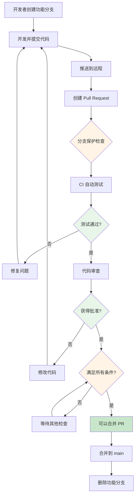
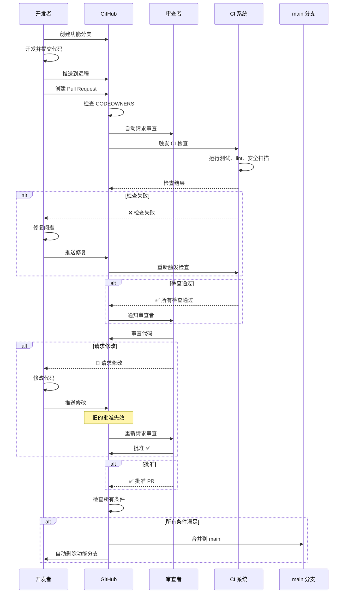

# Git实战技巧

## 版本发布 - 打标签

### 什么是标签？

想象一下：
- **提交 ID**：`a1b2c3d4` - 像是一串随机密码，不好记
- **标签**：`v1.0.0` - 像"第1版"，简单明了

标签就是给某个重要版本起个好听的名字！

### 什么时候打标签？

```bash
✅ 适合打标签的时刻：
- 发布第1版 → v1.0.0
- 修复重大bug → v1.0.1
- 添加新功能 → v2.0.0
- 重大更新 → v3.0.0

❌ 不需要打标签：
- 每次小修改
- 测试中的版本
- 临时调试版本
```

### 如何打标签？

```bash
# 1. 查看当前有哪些标签
git tag

# 2. 给最新提交打标签
git tag v1.0.0

# 3. 给指定提交打标签
# 先找到提交ID
git log --oneline
# 输出：a1b2c3d 修复登录bug
git tag v1.0.1 a1b2c3d

# 4. 带说明的标签（推荐）
git tag -a v2.0.0 -m "正式发布第2版，添加用户注册功能"

# 5. 查看标签详情
git show v1.0.0
```

### 推送标签到 GitHub

```bash
# 推送单个标签
git push origin v1.0.0

# 推送所有标签
git push --tags

# 删除本地标签
git tag -d v1.0.0

# 删除远程标签
git push origin --delete v1.0.0
# 或者
git push origin :refs/tags/v1.0.0
```

### 标签命名规范

```
格式：v主版本.次版本.修订号

v1.0.0  → 第1版正式发布
v1.0.1  → 修复bug
v1.1.0  → 添加小功能
v2.0.0  → 重大更新，不兼容旧版本
```

**举个例子**：

```
开发过程：
v1.0.0  → 第1版发布
  ↓ 发现bug
v1.0.1  → 修复bug
v1.0.2  → 又修复了bug
  ↓ 添加新功能
v1.1.0  → 第2个小版本
  ↓ 重构大量代码
v2.0.0  → 第2个大版本
```

---

## 自动关闭 Issue - 提交信息里的魔法词

### 什么是 Issue？

**Issue** = 问题清单
- bug 反馈
- 功能建议
- 待办事项

GitHub 上每个 Issue 都有一个编号，比如 `#123`

### 魔法关键词：fixes / closes

在提交信息里加上这些词，会**自动关闭对应的 Issue**！

```bash
# 格式
git commit -m "类型: 描述信息

fixes #123"
# 或
git commit -m "类型: 描述信息

closes #123"
```

**举例**：

```bash
# GitHub Issue #42: 用户反馈登录按钮点不了

# 你修复后，这样提交：
git commit -m "fix: 修复登录按钮无响应问题

fixes #42"

# 推送到 GitHub 后，Issue #42 自动关闭！✅
```

### 更多魔法词

```bash
# 关闭 Issue
fixes #123      # 修复（最常用）
closes #123     # 关闭
resolves #123   # 解决

# 只是引用（不关闭）
related to #123    # 相关
ref #123           # 引用
```

**实际例子**：

```bash
# 场景1：完全修复了 Issue
git commit -m "fix: 修复支付页面崩溃

fixes #156"

# 场景2：部分修复，还没完全解决
git commit -m "fix: 优化支付流程性能

related to #156"

# 场景3：一次性修复多个 Issue
git commit -m "feat: 添加用户头像上传功能

fixes #78
fixes #89
closes #102"
```

---

## 分支保护与 PR 策略 - 团队协作必备

### 什么是分支保护？

**分支保护** = 给重要分支（如 main）加"锁"，防止误操作

**为什么需要分支保护？**

```bash
❌ 没有分支保护的后果：
- 小明直接推代码到 main → 把线上搞崩了
- 小红强制推送 → 覆盖了大家的代码
- 没有代码审查 → Bug 轻易混入主分支
- 没有测试检查 → 低质量代码合并

✅ 有分支保护的好处：
- 必须通过 PR 审查
- 必须通过 CI 测试
- 禁止直接推送
- 代码质量有保障
```

### 分支保护工作流程图



### GitHub 分支保护配置 - 完整步骤

#### 步骤 1：进入分支保护设置

```
GitHub 仓库页面
  ↓
点击 Settings（设置）
  ↓
左侧菜单找到 "Branches"（分支）
  ↓
点击 "Add branch protection rule"（添加分支保护规则）
```

#### 步骤 2：配置保护规则

**界面展示（文字描述）**：

```
┌─────────────────────────────────────────────────────┐
│ Branch protection rule for:  main                    │
├─────────────────────────────────────────────────────┤
│                                                       │
│ Branch name pattern                                  │
│ ┌─────────────────────────────────────────────────┐ │
│ │ main                                            │ │
│ └─────────────────────────────────────────────────┘ │
│                                                       │
│ ☑ Require a pull request before merging             │
│                                                       │
│   ┌─────────────────────────────────────────────┐   │
│   │ Require approvals                            │   │
│   │   Number: 2  👥                             │   │
│   └─────────────────────────────────────────────┘   │
│                                                       │
│   ☑ Dismiss stale reviews when new commits are pushed│
│   ☑ Require review from CODEOWNERS                  │
│                                                       │
│ ☑ Require status checks to pass before merging      │
│                                                       │
│   Required status checks:                             │
│   ┌─────────────────────────────────────────────┐   │
│   │ ✓ ci/ci.yml                                 │   │
│   │ ✓ lint                                      │   │
│   │ ✓ test                                      │   │
│   └─────────────────────────────────────────────┘   │
│                                                       │
│   ☑ Require branches to be up to date before merging │
│                                                       │
│ ☑ Do not allow bypassing the above settings          │
│                                                       │
│ ☑ Restrict who can push to matching branches         │
│   People who can push:                                │
│   - @team-lead                                        │
│   - @devops-team                                      │
│                                                       │
│ ☑ Require signed commits                             │
│                                                       │
│ ☑ Include administrators                             │
│                                                       │
│ ☐ Allow force pushes                                 │
│                                                       │
│ ☑ Allow deletions                                    │
│                                                       │
│                    [ Create ]  [ Cancel ]            │
└─────────────────────────────────────────────────────┘
```

#### 步骤 3：配置说明（详细）

```yaml
# 1. 分支名称模式
Branch name pattern: main
# 也可以使用通配符保护多个分支
# - main
# - release/*
# - production

# 2. PR 审查要求
Require a pull request before merging:
  - Required approvals: 2
    说明：至少需要 2 个人审核批准

  - Dismiss stale reviews: yes
    说明：新提交推送后，旧的审批自动失效
    举例：你提交后，张三批准了 ✅
         你又改了代码 → 张三的批准自动失效 ❌
         需要重新审查

  - Require review from CODEOWNERS: yes
    说明：代码所有者必须批准
    举例：修改 payment 目录 → @payment-team 必须批准

# 3. 状态检查要求
Require status checks to pass before merging:
  Required checks:
    - ci/ci.yml      # CI 工作流必须通过
    - lint           # 代码检查必须通过
    - test           # 测试必须通过

  Require branches to be up to date: yes
  说明：合并前必须同步最新代码
  举例：你创建 PR 后，main 有新提交
       你必须 rebase 后才能合并

# 4. 权限限制
Restrict who can push to matching branches:
  - 只有管理员可以推送
  - 或者指定团队/用户

# 5. 签名提交
Require signed commits: yes
说明：必须使用 GPG 签名的提交

# 6. 管理员也受限制
Include administrators: yes
说明：即使是仓库管理员也必须遵守规则

# 7. 强制推送
Allow force pushes: NO
说明：禁止强制推送，防止历史被改写

# 8. 删除保护
Allow deletions: NO
说明：禁止删除被保护的分支
```

### CODEOWNERS 配置 - 自动指定审查人

**CODEOWNERS** = 代码所有者，自动指定谁来审查代码

#### 创建 CODEOWNERS 文件

```bash
# 文件位置：.github/CODEOWNERS

# ========================================
# 全局所有者（适用于所有文件）
# ========================================
* @team-lead @tech-lead

# ========================================
# 按目录划分
# ========================================
# 前端代码
/src/frontend/ @frontend-team
/src/components/ @frontend-lead
/src/views/ @frontend-developer-a

# 后端代码
/src/backend/ @backend-team
/src/api/ @api-lead
/src/models/ @backend-lead

# 数据库
/migrations/ @db-admin
/seeders/ @db-admin

# ========================================
# 按文件类型划分
# ========================================
*.js @javascript-team
*.ts @typescript-team
*.py @python-team
*.go @golang-team
*.java @java-team

# 配置文件
*.yml @devops-team
*.yaml @devops-team
Dockerfile @devops-team
docker-compose.yml @devops-team

# ========================================
# 关键文件需要特定人员批准
# ========================================
package.json @frontend-lead @security-team
requirements.txt @backend-lead @security-team
*.key @security-admin
*.pem @security-admin
.env.* @admin-only

# ========================================
# 文档
# ========================================
*.md @doc-team
README.md @project-manager
CHANGELOG.md @release-manager

# ========================================
# 特殊规则
# ========================================
# 紧急修复可以绕过审查
/urgent/ @admin @tech-lead

# 第三方库由指定人管理
/vendor/ @dependency-manager
/node_modules/ @dependency-manager
```

#### CODEOWNERS 工作流程图

```mermaid
graph LR
    A[创建 PR] --> B{检查修改的文件}
    B --> C[.github/CODEOWNERS]
    C --> D[匹配规则]

    D --> E1[修改了 .js 文件]
    D --> E2[修改了 /src/payment/]
    D --> E3[修改了 Dockerfile]

    E1 --> F1[@javascript-team 必须审查]
    E2 --> F2[@payment-team 必须审查]
    E3 --> F3[@devops-team 必须审查]

    F1 --> G[自动请求审查]
    F2 --> G
    F3 --> G

    G --> H[等待批准]
    H --> I[所有所有者批准 ✅]
    I --> J[可以合并]

    style A fill:#e3f2fd
    style C fill:#fff3e0
    style G fill:#f3e5f5
    style I fill:#c8e6c9
```

### 实际案例：配置完整的分支保护

#### 案例 1：小型团队配置

```yaml
# 场景：5人团队，1个技术负责人 + 4个开发者

# 分支保护规则
main 分支：
  ✅ Require pull request reviews before merging
    - Required approvals: 1（技术负责人必须批准）
    - Dismiss stale reviews: yes
    - Require review from CODEOWNERS: no（团队小，不需要）

  ✅ Require status checks to pass before merging
    - Required checks: test, lint
    - Require branches to be up to date: yes

  ✅ Do not allow bypassing the above settings

  ✅ Restrict who can push:
    - 只有技术负责人可以推送

  ✅ Include administrators: yes

  ❌ Allow force pushes: NO

  ❌ Allow deletions: NO

# .github/CODEOWNERS
* @tech-lead
/urgent/* @tech-lead @developer-a
```

#### 案例 2：中型团队配置

```yaml
# 场景：20人团队，分为前端、后端、DevOps 3个小组

# 分支保护规则
main 分支：
  ✅ Require pull request reviews before merging
    - Required approvals: 2（至少2人批准）
    - Dismiss stale reviews: yes
    - Require review from CODEOWNERS: yes（代码所有者必须批准）

  ✅ Require status checks to pass before merging
    - Required checks:
      - ci/ci.yml（CI 工作流）
      - lint（代码检查）
      - test（单元测试）
      - integration-test（集成测试）
    - Require branches to be up to date: yes

  ✅ Do not allow bypassing the above settings

  ✅ Restrict who can push:
    - @tech-lead
    - @frontend-lead
    - @backend-lead
    - @devops-lead

  ✅ Require signed commits: yes（重要项目要求签名）

  ✅ Include administrators: yes

  ❌ Allow force pushes: NO

  ❌ Allow deletions: NO

# .github/CODEOWNERS
# 全局批准
* @tech-lead

# 前端
/src/frontend/** @frontend-team
/src/components/** @frontend-lead
/src/views/** @frontend-team
*.tsx @frontend-team
*.vue @frontend-team

# 后端
/src/backend/** @backend-team
/src/api/** @backend-lead
/src/models/** @backend-team
/src/controllers/** @backend-team

# DevOps & 基础设施
.github/** @devops-team
Dockerfile @devops-team
docker-compose.yml @devops-team
*.yml @devops-team
*.yaml @devops-team

# 安全
*.env @security-team
*.key @security-admin
/secrets/** @security-admin

# 数据库
/migrations/** @db-admin
/seeders/** @db-admin
```

#### 案例 3：大型企业级配置

```yaml
# 场景：50+人企业团队，多团队协作，严格合规

# 分支保护规则
main 分支：
  ✅ Require pull request reviews before merging
    - Required approvals: 2
    - Dismiss stale reviews: yes
    - Require review from CODEOWNERS: yes
    - Require review from:
      - @security-team（安全团队必须审查）
      - @tech-lead（技术负责人必须审查）

  ✅ Require status checks to pass before merging
    - Required checks:
      - ci/ci.yml
      - lint
      - test
      - integration-test
      - security-scan（安全扫描）
      - dependency-check（依赖检查）
    - Require branches to be up to date: yes

  ✅ Do not allow bypassing the above settings

  ✅ Restrict who can push:
    - @release-manager
    - @tech-lead

  ✅ Require signed commits: yes

  ✅ Require linear history: yes（要求线性历史，不允许合并提交）

  ✅ Include administrators: yes

  ❌ Allow force pushes: NO

  ❌ Allow deletions: NO

# .github/CODEOWNERS
# 全局批准（需要 2 个技术负责人）
* @tech-lead @architect-lead

# 按部门
/src/frontend/** @frontend-team @security-team
/src/backend/** @backend-team @security-team
/src/infrastructure/** @devops-team @sre-team

# 关键模块需要安全审查
/src/auth/** @security-team @auth-team
/src/payment/** @payment-team @security-team @compliance-team
/src/user-data/** @privacy-team @legal-team

# 基础设施
.github/** @devops-team @security-team
/docker/** @devops-team
/kubernetes/** @devops-team @sre-team

# 配置文件
*.yml @devops-team @security-team
*.yaml @devops-team @security-team
.env.* @security-admin

# 依赖管理
package.json @frontend-lead @security-team
requirements.txt @backend-lead @security-team
go.mod @backend-lead @security-team
```

### PR 审查流程详解

#### 完整的 PR 工作流



#### PR 状态检查清单

```bash
✅ PR 可以合并的条件：

□ 1. CI 检查通过
   └─ ☑ ci/ci.yml 成功
   └─ ☑ lint 通过
   └─ ☑ test 通过
   └─ ☑ integration-test 通过

□ 2. 代码审查通过
   └─ ☑ 至少 2 人批准
   └─ ☑ CODEOWNERS 批准
   └─ ☑ 没有请求修改的评论

□ 3. 分支状态
   └─ ☑ 分支是最新的（已 rebase）
   └─ ☑ 没有冲突

□ 4. 其他要求
   └─ ☑ 提交已签名
   └─ ☑ 描述信息完整
   └─ ☑ 关联了 Issue

❌ PR 无法合并的情况：

□ 1. CI 检查失败
   └─ ❌ 测试失败
   └─ ❌ 代码检查不通过
   └─ ❌ 安全扫描发现问题

□ 2. 审查未通过
   └─ ❌ 批准人数不足
   └─ ❌ CODEOWNERS 未批准
   └─ ❌ 有请求修改的评论

□ 3. 分支过期
   └─ ❌ 落后于 main 分支
   └─ ❌ 有合并冲突

□ 4. 其他问题
   └─ ❌ 提交未签名
   └─ ❌ 描述不完整
```

### 实用技巧和最佳实践

#### 技巧 1：使用 Draft PR 提前创建审查

```bash
# 场景：功能还没开发完，但想提前让团队知道

# 1. 创建 Draft PR（草稿 PR）
git push -u origin feature/new-feature
# 在 GitHub 上创建 PR 时选择 "Create draft pull request"

# 2. 继续开发
git add .
git commit -m "feat: 添加新功能"
git push

# 3. 开发完成后，转为正式 PR
# 在 PR 页面点击 "Ready for review"

# 好处：
# - 团队可以提前看到代码
# - 可以早期反馈
# - 不会触发 CI（节省资源）
```

#### 技巧 2：使用模板规范 PR 描述

```bash
# 创建 PR 模板
# 文件：.github/PULL_REQUEST_TEMPLATE.md

## 📝 变更说明
<!-- 简要描述这个 PR 做了什么 -->

## 🔗 关联 Issue
<!-- 关联的 Issue，例如：Closes #123 -->

## 🎯 变更类型
- [ ] 新功能
- [ ] Bug 修复
- [ ] 代码重构
- [ ] 文档更新
- [ ] 性能优化
- [ ] 其他：_________

## ✅ 检查清单
- [ ] 代码通过了 lint 检查
- [ ] 所有测试通过
- [ ] 添加了必要的测试
- [ ] 更新了相关文档
- [ ] 没有引入新的警告

## 📸 截图/演示
<!-- 如果是 UI 变更，请提供截图或 GIF -->

## 🧪 测试说明
<!-- 如何测试这个变更 -->

## 💬 备注
<!-- 其他需要说明的内容 -->
```

#### 技巧 3：自动更新过期的分支

```bash
# 方法 1：使用 GitHub 自动更新功能
# Settings > General > Pull Requests
# ✅ Automatically update head branches

# 方法 2：手动 rebase
git checkout feature-branch
git fetch origin main
git rebase origin/main
git push origin feature-branch --force-with-lease

# 方法 3：使用 GitHub UI
# 在 PR 页面底部点击 "Update branch" 按钮
```

#### 技巧 4：使用 Merge Commit vs Squash vs Rebase

```bash
# 三种合并策略对比：

# 1. Merge commit（保留完整历史）
# 结果：A → B → C → D → E ←─┐
#      feature: A → B → F ───┘
# 优点：保留所有历史，清晰看到分支
# 缺点：历史有分叉

# 2. Squash merge（压缩成一个提交）
# 结果：A → B → C → D → E → S（所有变更压缩成 S）
# 优点：历史干净，线性
# 缺点：丢失了分支开发历史

# 3. Rebase merge（变基合并）
# 结果：A → B → C → D → E → F' → G'（提交被重新播放）
# 优点：线性历史，保持提交顺序
# 缺点：改写了历史

# 推荐配置：
# - feature 分支：使用 squash merge
# - bugfix 分支：使用 merge commit
# - hotfix 分支：使用 merge commit
```

### 常见问题和解决方案

#### 问题 1：如何处理紧急修复？

```bash
# 场景：线上出现严重 bug，需要立即修复

# 方案 1：临时禁用分支保护（不推荐）
Settings > Branches > Edit rule
❌ 取消勾选保护规则
修复后重新启用

# 方案 2：创建紧急分支（推荐）
git checkout main
git checkout -b hotfix/critical-bug

# 开发修复
git add .
git commit -m "fix: 紧急修复崩溃问题"
git push -u origin hotfix/critical-bug

# 快速审查和合并
# 找到技术负责人立即审查
# 合并后删除分支

# 方案 3：使用 CODEOWNERS 规则（最佳）
# .github/CODEOWNERS
/hotfix/** @tech-lead @admin
# 紧急修复只需要少数人批准
```

#### 问题 2：CODEOWNERS 不生效？

```bash
# 检查清单：

# 1. 文件位置是否正确？
.github/CODEOWNERS  # ✅ 正确
CODEOWNERS          # ❌ 错误

# 2. 语法是否正确？
# 正确格式
*.js @team-name
/src/path/ @username

# 错误格式
*.js @team-name @other  # ❌ 多个所有者应该换行

# 3. 用户名是否正确？
# 团队名：@team-name
# 用户名：@username

# 4. 检查 CODEOWNERS 是否生效
# PR 页面会显示 "Required reviewers"
```

#### 问题 3：如何合并冲突的 PR？

```bash
# 场景：PR 与 main 分支有冲突

# 方法 1：使用 GitHub UI（简单）
# 在 PR 页面点击 "Resolve conflicts"
# 在线编辑解决冲突
# 标记为已解决

# 方法 2：本地解决（推荐）
git checkout feature-branch
git fetch origin main
git rebase origin/main

# 解决冲突
# 编辑冲突文件
git add <resolved-files>
git rebase --continue

# 推送
git push origin feature-branch --force-with-lease

# 方法 3：使用 merge（保留历史）
git checkout feature-branch
git merge origin/main

# 解决冲突
git add <resolved-files>
git commit -m "merge: 解决与 main 的冲突"

git push origin feature-branch
```

### 学习清单

检查你掌握了以下技能：

### 基础配置 ✅

- [ ] 理解分支保护的作用和意义
- [ ] 会在 GitHub 上配置分支保护规则
- [ ] 理解各种保护选项的含义
- [ ] 会配置必需的审查人数

### CODEOWNERS ✅

- [ ] 会创建 CODEOWNERS 文件
- [ ] 理解 CODEOWNERS 的匹配规则
- [ ] 会按目录和文件类型配置审查人
- [ ] 会配置特殊规则（如紧急修复）

### PR 流程 ✅

- [ ] 理解完整的 PR 审查流程
- [ ] 会创建和管理 Pull Request
- [ ] 会处理 PR 检查失败的情况
- [ ] 会解决合并冲突

### 最佳实践 ✅

- [ ] 知道不同团队规模的配置策略
- [ ] 会使用 Draft PR 提前沟通
- [ ] 会创建 PR 模板规范描述
- [ ] 理解不同合并策略的适用场景

### 故障排查 ✅

- [ ] 会诊断 CODEOWNERS 不生效的问题
- [ ] 会处理紧急修复的流程
- [ ] 会解决 PR 冲突
- [ ] 知道如何更新过期分支

---

## 实用技巧集合

### 技巧1：保存工作现场

**场景**：正在写功能A，突然需要修bug

```bash
# 1. 保存当前工作（像存档）
git stash save "写了一半的登录功能"

# 2. 切换去修bug
git checkout main
# ... 修bug ...
git commit -m "fix: 修复验证码不显示"

# 3. 回来继续干活（读档）
git checkout dev
git stash pop

# 就像什么都没发生过！
```

### 技巧2：查看"谁改了这行代码"

**场景**：这行代码是谁写的？为什么这么写？

```bash
# 查看文件每一行的修改记录
git blame README.md

# 输出示例：
# a1b2c3d (张三 2024-01-15 10:23:15) 这是标题
# d4e5f6g (李四 2024-01-16 14:32:08) 这是介绍
#          ^^^^ ^^^^ ^^^^^^^^^^^^^^^
#          提交ID 作者    时间
```

### 技巧3：撤销错误操作

```bash
# 情况1：文件改错了，想恢复
git restore 文件名

# 情况2：add 加错了文件
git restore --staged 文件名

# 情况3：commit 信息写错了
git commit --amend -m "正确的信息"

# 情况4：想撤销最近一次提交
git reset --soft HEAD~1    # 保留修改
git reset --hard HEAD~1    # 丢弃修改
```

### 技巧4：查找"什么时候出的问题"

```bash
# 二分查找法：快速定位哪个提交引入了bug

# 1. 开始二分
git bisect start

# 2. 标记当前版本是有bug的
git bisect bad

# 3. 标记已知没bug的版本
git bisect good v1.0.0

# Git 会自动切换到中间版本
# 你测试后告诉它是好是坏
git bisect good  # 或 git bisect bad

# 重复测试，直到找到问题提交
git bisect reset  # 结束
```

---

## 团队协作必备

### 发起 Pull Request (PR)

**什么是 PR？**
就像写完作业要交给人检查，PR 就是把你的代码发给团队审查。

```bash
# 完整流程：

# 1. 从 main 创建功能分支
git checkout main
git pull origin main
git checkout -b feature/add-login

# 2. 开发功能
# ... 写代码 ...
git add .
git commit -m "feat: 添加登录功能"
git push -u origin feature/add-login

# 3. 在 GitHub 上创建 PR
# 访问：https://github.com/你的用户名/项目/pull/new/feature/add-login
# 填写标题和说明，点击 "Create Pull Request"

# 4. 等待审查
# 团队成员会评论、建议修改

# 5. 修改后再次推送
git add .
git commit -m "fix: 根据建议修改"
git push

# 6. PR 被接受后合并
# 可以删除功能分支
git branch -d feature/add-login
```

### 同步团队最新代码

```bash
# 方法1：merge（推荐新手）
git checkout dev
git pull origin dev
git merge main

# 方法2：rebase（保持历史清晰）
git checkout dev
git rebase main
```

---

## 常见问题快速解决

### 问题1：推送时提示"落后于远程"

```bash
# 错误信息：
# Your branch is behind 'origin/main' by 2 commits

# 解决方法1：先拉取再推送（推荐）
git pull origin main
git push origin main

# 解决方法2：强制推送（危险！会覆盖别人代码）
git push --force
# ⚠️ 只有你确定要覆盖时才用！
```

### 问题2：合并时出现冲突

```bash
# 1. 尝试合并
git merge dev

# 2. 看到冲突提示
# Auto-merging index.js
# CONFLICT (content): Merge conflict in index.js

# 3. 打开文件，看到冲突标记：
# <<<<<<< HEAD
# var name = "张三";  // 你的代码
# =======
# var name = "李四";  // 别人的代码
# >>>>>>> dev

# 4. 手动选择保留哪个，或合并
var name = "张三和李四";

# 5. 标记已解决
git add index.js

# 6. 完成合并
git commit -m "合并dev分支，解决冲突"
```

### 问题3：提交信息写错了

```bash
# 最近一次提交信息错了
git commit --amend -m "正确的信息"

# ⚠️ 注意：如果已经推送过，不要用这个！
```

### 问题4：添加了不该提交的文件

```bash
# 比如不小心提交了密码文件

# 1. 删除文件
git rm --cached 密码文件.txt

# 2. 添加到 .gitignore
echo "密码文件.txt" >> .gitignore

# 3. 提交修改
git add .gitignore
git commit -m "chore: 移除敏感文件"
```

---

## 效率提升配置

### 命令别名（偷懒神器）

```bash
# 设置别名
git config --global alias.st status        # git st = git status
git config --global alias.co checkout     # git co dev = git checkout dev
git config --global alias.br branch       # git br = git branch
git config --global alias.cm commit       # git cm = git commit
git config --global alias.lg "log --graph --oneline --all"

# 使用
git st          # 查看状态
git co dev      # 切换分支
git lg          # 查看图形化日志
```

### 更美的日志输出

```bash
# 添加这个别名
git config --global alias.lg "log --color --graph --pretty=format:'%Cred%h%Creset -%C(yellow)%d%Creset %s %Cgreen(%cr) %C(bold blue)<%an>%Creset' --abbrev-commit"

# 使用 git lg 查看超漂亮的日志！
```

---

## 实战案例

### 案例1：发布新版本

```bash
# 1. 确保在 main 分支
git checkout main
git pull origin main

# 2. 合并 dev
git merge dev

# 3. 打标签
git tag -a v1.0.0 -m "发布第1版"

# 4. 推送代码和标签
git push origin main
git push origin v1.0.0

# 5. 在 GitHub 上创建 Release
# 访问：https://github.com/你的用户名/项目/releases/new
# 选择标签 v1.0.0，填写发布说明
```

### 案例2：紧急修复线上bug

```bash
# 1. 从 main 创建修复分支
git checkout main
git pull origin main
git checkout -b hotfix/critical-bug

# 2. 快速修复
# 修改代码...
git add .
git commit -m "fix: 紧急修复支付崩溃问题

fixes #999"

# 3. 推送并测试
git push -u origin hotfix/critical-bug

# 4. 测试通过后合并到 main
git checkout main
git merge hotfix/critical-bug
git tag v1.0.1
git push origin main
git push origin v1.0.1

# 5. 同步到 dev
git checkout dev
git merge hotfix/critical-bug
git push origin dev

# 6. 删除修复分支
git branch -d hotfix/critical-bug
```

### 案例3：功能开发完整流程

```bash
# 1. 创建功能分支
git checkout dev
git pull origin dev
git checkout -b feature/user-avatar

# 2. 开发（多次小提交）
git add .
git commit -m "feat: 添加头像上传组件"

git add .
git commit -m "feat: 添加头像裁剪功能"

git add .
git commit -m "feat: 添加头像预览"

# 3. 推送
git push -u origin feature/user-avatar

# 4. 创建 PR（如果是团队项目）
# 在 GitHub 创建 Pull Request
# 等待 Code Review

# 5. 根据反馈修改
git add .
git commit -m "fix: 根据审查意见优化代码"
git push

# 6. 合并到 dev
git checkout dev
git merge feature/user-avatar
git push origin dev

# 7. 清理
git branch -d feature/user-avatar
```

---

## 学习资源

### 互动学习

- **Learn Git Branching**: https://learngitbranching.js.org/
  - 游戏化学习 Git
  - 可视化分支操作
  - 强烈推荐！

### 图形界面工具

- **GitHub Desktop**: https://desktop.github.com/
  - 官方工具，简单易用
  - 适合 Windows/Mac 用户

- **Sourcetree**: https://www.sourcetreeapp.com/
  - 功能强大
  - 可视化分支

- **GitKraken**: https://www.gitkraken.com/
  - 界面美观
  - 跨平台

### VSCode 扩展

- **GitLens**: 查看代码作者、提交历史
- **Git Graph**: 可视化分支图
- **GitHub Pull Requests**: 管理 PR

---

## 高级功能 - Git 必备技能

### 暂存功能 - git stash 详解

**什么是 stash？**

就像游戏的"快速存档"功能：
- 正在开发功能A
- 突然需要紧急修bug
- 把功能A的代码"暂存"起来
- 修完bug再"读取存档"，继续开发

### 基础用法

```bash
# 1. 保存当前工作（像存游戏）
git stash

# 2. 带说明的保存（推荐）
git stash save "写了一半的登录功能"

# 3. 查看所有存档
git stash list

# 输出示例：
# stash@{0}: On main: 写了一半的登录功能
# stash@{1}: On dev: 临时测试代码
# stash@{2}: On main: 修复支付bug的尝试

# 4. 恢复最近的存档（并删除存档）
git stash pop

# 5. 恢复指定的存档
git stash pop stash@{1}

# 6. 恢复存档（但不删除存档）
git stash apply

# 7. 删除存档
git stash drop stash@{1}

# 8. 清空所有存档
git stash clear
```

### 实战场景

**场景1：正在开发，突然需要修bug**

```bash
# 当前状态：正在开发登录功能，但代码写了一半
git status
# modified: login.js
# modified: login.css

# 1. 保存进度
git stash save "登录功能开发到一半"

# 2. 查看状态（干净了！）
git status
# nothing to commit

# 3. 切换去修bug
git checkout -b hotfix/urgent-bug
# ... 修bug ...
git commit -m "fix: 修复紧急bug"
git push

# 4. 切回来，恢复进度
git checkout dev
git stash pop

# 继续开发登录功能！
```

**场景2：测试别人的代码**

```bash
# 1. 保存你的代码
git stash save "我的功能开发到一半"

# 2. 拉取别人的代码测试
git pull origin feature/other-developer
pnpm docs:dev

# 3. 测试完了，删除别人的代码
git reset --hard HEAD

# 4. 恢复你的代码
git stash pop
```

**场景3：切换分支时冲突**

```bash
# 场景：你在 dev 分支改了文件，想切到 main 分支
git checkout main
# 错误：error: Your local changes to the following files would be overwritten...

# 解决：保存修改
git stash

# 现在可以切换了
git checkout main

# 回到 dev 后恢复
git checkout dev
git stash pop
```

### 只暂存部分文件

```bash
# 只暂存某个文件
git stash push login.js

# 只暂存某些文件
git stash push -m "暂存登录功能" login.js login.css

# 只暂存未跟踪的文件
git stash -u

# 保留暂存区的内容
git stash --keep-index
```

### 查看/应用存档内容

```bash
# 查看存档改了什么
git stash show

# 查看存档详细改动
git stash show -p

# 从存档创建新分支（适合合并到其他分支）
git stash branch new-branch stash@{1}
```

---

### 变基操作 - git rebase 详解

**什么是 rebase？**

**rebase（变基）** = 把你的提交"搬运"到最新的代码上

**生活比喻**：
- **merge（合并）**：两段历史接在一起，有个分叉
- **rebase（变基）**：把你的提交重新"播放"一遍，历史是直线的

### Merge vs Rebase

**图示对比：**

```bash
# 初始状态（你的分支落后了）
# main:  A → B → C → D
# dev:   A → B → E → F
#               ↑ 需要合并

# 使用 merge（产生分叉）
# main:  A → B → C → D → G ←─┐
# dev:   A → B → E → F ──────┘
#                     ↑ G 是 merge commit

# 使用 rebase（保持直线）
# main:  A → B → C → D → E' → F'
#                        ↑ 你的提交被"搬运"了
```

### 什么时候用 rebase？

| ✅ 使用 rebase | ❌ 不使用 rebase |
|---------------|----------------|
| 整理自己的分支 | 已推送到远程的分支 |
| 保持历史整洁 | 团队共享的分支 |
| 合并 upstream 更新 | 重要的公共分支 |
| 交互式 rebase 修改提交 | 别人可能基于你的提交工作 |

### 基础 rebase

```bash
# 1. 把当前分支变基到 main
git checkout dev
git rebase main

# 等同于：
# git checkout dev
# git pull --rebase origin main

# 2. 变基到指定提交
git rebase abc1234
```

### 实战场景

**场景1：保持本地分支最新**

```bash
# 你在 dev 分支开发，但 main 已经更新了
git checkout dev
# ... 你的提交 A → B → C

# main 已经有新提交 D → E → F

# 使用 rebase 更新
git rebase main
# 现在你的提交：D → E → F → A' → B' → C'
```

**场景2：多人协作时避免 merge commit**

```bash
# ❌ 传统的做法（会产生 merge commit）
git checkout dev
git pull origin dev    # 自动 merge
git checkout main
git merge dev          # 又一个 merge commit
# 历史里有很多 "Merge branch 'dev'" 的提交

# ✅ 使用 rebase（保持历史干净）
git checkout dev
git pull --rebase origin dev    # rebase 而不是 merge
git checkout main
git rebase dev                  # 直接变基
# 历史是直线的，很干净！
```

### 交互式 rebase（修改历史）

**这是 Git 最强大的功能之一！**

```bash
# 修改最近 3 次提交
git rebase -i HEAD~3

# 或修改某个提交之后的所有
git rebase -i abc1234
```

**会打开编辑器，显示：**

```bash
pick abc1234 feat: 添加登录表单
pick def5678 fix: 修复样式bug
pick ghi9012 style: 格式化代码

# 可以改成：
# pick     = 保留这个提交
# reword   = 保留但修改提交信息
# edit     = 保留但暂停，让你修改代码
# squash   = 合并到上一个提交
# drop     = 删除这个提交
```

**实际例子：**

```bash
# 场景：最近3次提交信息写得不好
# abc1234 feat: 添加功能
# def5678 fix: 修复
# ghi9012 style: 格式

# 1. 开始交互式 rebase
git rebase -i HEAD~3

# 2. 改成：
# reword abc1234 feat: 添加用户登录功能
# reword def5678 fix: 修复移动端显示问题
# reword ghi9012 style: 统一代码缩进为2空格

# 3. 保存后，Git 会让你逐个修改提交信息
```

**合并多个提交：**

```bash
# 场景：最近5次提交太碎了，想合并成1个
git rebase -i HEAD~5

# 改成：
pick abc1234 feat: 第一个功能
squash def5678 feat: 第二个功能
squash ghi9012 feat: 第三个功能
squash jkl3456 feat: 第四个功能
squash mno7890 feat: 第五个功能

# 保存后，会要求你写一个新的提交信息
```

**删除某个提交：**

```bash
# 场景：某次提交引入了bug，想删除
git rebase -i HEAD~5

# 把那一行改成：
drop abc1234 feat: 这个提交要删除

# 保存，提交就消失了
```

**⚠️ rebase 危险操作警告：**

```bash
# ❌ 绝对不要对已推送的提交做 rebase！
git push origin dev
# ... 别人基于你的代码继续开发 ...
git rebase -i HEAD~3  # 危险！会改写历史
git push --force      # 危险！会覆盖别人的代码

# ✅ 只对自己的本地分支用 rebase
git checkout feature/new-feature
git rebase -i HEAD~3  # 安全，只有你能看到
```

---

### 查看差异 - git diff 详解

**基本用法：**

```bash
# 1. 查看工作区修改（还未 add）
git diff

# 2. 查看暂存区修改（已 add，还未 commit）
git diff --staged
# 或
git diff --cached

# 3. 对比两个分支
git diff main dev

# 4. 对比两个提交
git diff abc1234 def5678

# 5. 查看某个文件的修改
git diff README.md

# 6. 对比指定提交的文件
git diff abc1234 README.md
```

### 实用选项

```bash
# 1. 只显示改了哪些文件（不显示具体内容）
git diff --name-only

# 2. 显示改了哪些文件和统计信息
git diff --stat

# 输出示例：
# README.md   | 10 +++++++++-
# package.json |  2 +-
# 2 files changed, 10 insertions(+), 1 deletion(-)

# 3. 显示更少的上下文
git diff -U2    # 只显示前后2行（默认是3行）

# 4. 忽略空格差异
git diff -w

# 5. 显示颜色（如果默认没有颜色）
git diff --color

# 6. 显示指定时间段的修改
git diff --since="2 weeks ago"
git diff --until="2024-01-15"
```

### 高级用法

**查看某个分支独有的修改：**

```bash
# 查看 dev 分支相比 main 的修改
git diff main..dev

# 查看将要合并的内容
git diff main...dev    # 注意是3个点
```

**图形化查看差异：**

```bash
# 使用外部工具（如 VSCode、Beyond Compare）
git difftool

# 配置默认工具
git config --global diff.tool vscode
git config --global difftool.vscode.cmd 'code --wait --diff $LOCAL $REMOTE'
```

---

### Git 钩子（Git Hooks）- 自动化你的工作流

**什么是 Git 钩子？**

就像 Git 的"触发器"：在某些操作（如 commit、push）时自动执行脚本。

**常用钩子：**

| 钩子名 | 触发时机 | 常见用途 |
|--------|---------|---------|
| `pre-commit` | 提交前 | 代码检查、格式化 |
| `commit-msg` | 提交信息编辑后 | 检查提交信息格式 |
| `pre-push` | 推送前 | 运行测试 |
| `post-merge` | 合并后 | 更新依赖、通知 |

### 安装和使用钩子

**查看钩子目录：**

```bash
# 查看钩子目录
git config --get core.hooksPath
# 默认：.git/hooks/

# 查看已有的钩子示例
ls .git/hooks/
```

**创建一个 pre-commit 钩子：**

```bash
# 1. 创建钩子文件
cat > .git/hooks/pre-commit << 'EOF'
#!/bin/bash
echo "🔍 运行 pre-commit 检查..."

# 检查是否有 console.log（不允许提交调试代码）
if git diff --cached --name-only | grep '\.js$' > /dev/null; then
  if git diff --cached | grep 'console\.log' > /dev/null; then
    echo "❌ 错误：代码中有 console.log，请移除后再提交！"
    exit 1
  fi
fi

echo "✅ Pre-commit 检查通过！"
EOF

# 2. 给执行权限
chmod +x .git/hooks/pre-commit

# 3. 测试
git commit -m "test"
# 会看到 "🔍 运行 pre-commit 检查..."
```

**常用钩子示例：**

```bash
# 1. 提交信息格式检查
cat > .git/hooks/commit-msg << 'EOF'
#!/bin/bash
# 检查提交信息格式：类型(范围): 描述
commit_regex='^(feat|fix|docs|style|refactor|test|chore)(\(.+\))?: .{1,50}'

if ! grep -qE "$commit_regex" "$1"; then
  echo "❌ 错误：提交信息格式不正确！"
  echo "格式：类型(范围): 描述"
  echo "示例：feat(登录): 添加用户登录功能"
  exit 1
fi
EOF
chmod +x .git/hooks/commit-msg

# 2. 推送前运行测试
cat > .git/hooks/pre-push << 'EOF'
#!/bin/bash
echo "🧪 运行测试..."

npm test

if [ $? -ne 0 ]; then
  echo "❌ 测试失败！推送被中止。"
  exit 1
fi
EOF
chmod +x .git/hooks/pre-push
```

### 使用 Husky（推荐）

**手动写钩子太麻烦？用 Husky！**

```bash
# 1. 安装 Husky
npm install husky --save-dev

# 2. 初始化
npx husky install

# 3. 添加钩子
npx husky add .husky/pre-commit "npm test"

# 4. 在 package.json 中配置
{
  "scripts": {
    "prepare": "husky install"
  }
}
```

**实际例子：完整的 Git 工作流自动化**

```bash
# .husky/pre-commit
#!/bin/sh
. "$(dirname "$0")/_/husky.sh"

echo "🔍 运行代码检查..."
npm run lint
echo "✅ 代码检查通过！"

echo "🎨 格式化代码..."
npm run format
git add .
echo "✅ 代码格式化完成！"

# .husky/commit-msg
#!/bin/sh
. "$(dirname "$0")/_/husky.sh"

# 检查提交信息格式
commit_msg=$(cat $1)
commit_regex='^(feat|fix|docs|style|refactor|test|chore)(\(.+\))?: .{1,50}'

if ! echo "$commit_msg" | grep -qE "$commit_regex"; then
  echo "❌ 提交信息格式错误！"
  echo "格式：类型(范围): 描述"
  echo "示例：feat(登录): 添加用户登录"
  exit 1
fi

# .husky/pre-push
#!/bin/sh
. "$(dirname "$0")/_/husky.sh"

echo "🧪 运行测试..."
npm test

if [ $? -ne 0 ]; then
  echo "❌ 测试失败！取消推送。"
  exit 1
fi
```

---

### Cherry-pick - 精准挑选提交

**什么是 cherry-pick？**

就像从购物车上挑选你想要的商品，cherry-pick 让你**精准选择某个提交**，把它应用到当前分支。

**使用场景：**

```bash
# 场景1：从 dev 分支挑选某个 bug 修复到 main
# dev:  A → B → C → D (D 是 bug 修复)
# main: A → E → F
#         ↑ 需要 D

git checkout main
git cherry-pick D
# 结果：A → E → F → D
```

### 基础用法

```bash
# 1. 挑选单个提交
git cherry-pick abc1234

# 2. 挑选多个提交
git cherry-pick abc1234 def5678

# 3. 挑选范围（不包含 abc1234，包含 def5678）
git cherry-pick abc1234..def5678

# 4. 只应用不提交
git cherry-pick -n abc1234

# 5. 挑选但保留原有作者信息
git cherry-pick -x abc1234
```

### 实战场景

**场景1：紧急修复需要同时应用到多个分支**

```bash
# main 分支修复了 bug
git checkout main
git commit -m "fix: 修复登录崩溃问题"

# cherry-pick 到 dev 分支
git checkout dev
git cherry-pick main  # 或具体的 commit ID

# cherry-pick 到其他功能分支
git checkout feature/checkout
git cherry-pick main
```

**场景2：不需要合并整个分支，只要某个提交**

```bash
# dev 分支有10个新提交，但你只需要其中一个
# dev: A → B → C → D → E → F → G → H → I → J
#                                               ↑ D 是你需要的

git checkout feature-branch
git cherry-pick D    # 只要 D，其他都不要
```

### 处理冲突

```bash
# cherry-pick 时可能有冲突
git cherry-pick abc1234

# 如果有冲突：
# 1. 手动解决冲突
# 2. 标记为已解决
git add .
# 3. 继续 cherry-pick
git cherry-pick --continue

# 或放弃
git cherry-pick --abort
```

---

### Git 配置和技巧

### 用户信息配置

```bash
# 1. 配置用户名和邮箱（必需！）
git config --global user.name "你的名字"
git config --global user.email "your.email@example.com"

# 2. 为不同项目配置不同的身份
cd project-a
git config user.name "项目A的作者"
git config user.email "project-a@example.com"

cd project-b
git config user.name "项目B的作者"
git config user.email "project-b@example.com"
```

### 常用配置

```bash
# 1. 设置默认分支名
git config --global init.defaultBranch main

# 2. 设置换行符处理（Windows推荐）
git config --global core.autocrlf true

# 3. Mac/Linux 设置
git config --global core.autocrlf input

# 4. 开启颜色输出
git config --global color.ui true

# 5. 设置默认编辑器
git config --global core.editor "code --wait"
# 或
git config --global core.editor "vim"

# 6. 设置合并策略
git config --global merge.ff false    # 不使用 fast-forward

# 7. 设置 rebase
git config --global pull.rebase true  # pull 时自动 rebase
```

### 查看配置

```bash
# 查看所有配置
git config --list

# 查看某个配置
git config user.name

# 编辑配置文件
git config --global --edit
```

### 有用的别名

```bash
# 1. 常用命令简写
git config --global alias.st status
git config --global alias.co checkout
git config --global alias.br branch
git config --global alias.ci commit
git config --global alias.unstage 'reset HEAD --'
git config --global alias.last 'log -1 HEAD'
git config --global alias.visual 'log --graph --oneline --all'

# 2. 使用
git st          # = git status
git co dev      # = git checkout dev
git unstage file # = git reset HEAD -- file
git last        # = git log -1 HEAD

# 3. 超级日志（带颜色和图形）
git config --global alias.lg "log --color --graph --pretty=format:'%Cred%h%Creset -%C(yellow)%d%Creset %s %Cgreen(%cr) %C(bold blue)<%an>%Creset' --abbrev-commit"
```

---

### 查找和分析

### 搜索代码

```bash
# 1. 在所有文件中搜索
git grep "关键词"

# 2. 只在某个版本中搜索
git grep "关键词" v1.0.0

# 3. 统计某个函数出现了多少次
git grep -c "functionName"
```

### 查看谁修改了代码

```bash
# 1. 查看文件的每一行是谁修改的
git blame README.md

# 2. 查看某一行是谁修改的
git blame -L 10,20 README.md    # 只看第10-20行

# 3. 忽略空格
git blame -w README.md
```

### 查找引入 bug 的提交

```bash
# 使用二分查找快速定位问题
git bisect start

# 标记当前版本有 bug
git bisect bad

# 标记已知没 bug 的版本
git bisect good v1.0.0

# Git 自动切换到中间版本，你测试后标记
git bisect good    # 或 git bisect bad

# 重复测试，直到找到问题提交
git bisect reset   # 结束
```

### 查看历史

```bash
# 1. 图形化查看提交历史
git log --graph --oneline --all

# 2. 查看某个文件的历史
git log -- README.md

# 3. 查看某个函数的历史
git log -p --all -S 'functionName'

# 4. 查看提交的统计信息
git log --stat

# 5. 按作者查看
git log --author="张三"

# 6. 按时间范围查看
git log --since="2 weeks ago"
git log --until="2024-01-15"
git log --since="2024-01-01" --until="2024-01-31"
```

---

## 常见问题 FAQ

### Q1: stash 和 commit 有什么区别？应该用哪个？

**A:**

```bash
✅ 使用 stash 的场景：
- 临时保存工作，马上就要恢复
- 不想创建提交记录
- 代码还没写完，不方便提交

❌ 使用 commit 的场景：
- 代码已经完成，需要保存
- 需要推送到远程
- 需要记录这个版本的修改
```

**简单记忆**：
- stash = 临时存档（像游戏的快速存档）
- commit = 正式存档（游戏的通关记录）

### Q2: rebase 危险吗？什么时候不能用？

**A:** rebase 本身不危险，但**改写已推送的历史**很危险！

```bash
✅ 安全使用 rebase：
git checkout feature-branch
git rebase -i HEAD~3
# feature-branch 还没推送，只有你能看到 → 安全！

❌ 危险操作：
git push origin main
git rebase -i HEAD~3
git push --force
# 别人可能基于 main 继续开发，你改写历史会害到他们！
```

**黄金法则**：只对未推送的本地分支用 rebase！

### Q3: 标签（tag）和分支（branch）有什么区别？

**A:**

```bash
分支（branch）：
- 会继续发展
- 可以继续提交
- 像一条"开发线"

标签（tag）：
- 是静态的，不会变化
- 标记某个重要版本
- 像一个"里程碑"

例子：
main 分支 → v1.0.0 → 继续开发 → v1.1.0 → 继续开发 → v2.0.0
           ↑ 标签           ↑ 标签           ↑ 标签
```

### Q4: 什么时候应该用 cherry-pick 而不是 merge？

**A:**

```bash
✅ 使用 cherry-pick：
- 只需要某个分支的1-2个提交
- 不想要整个分支的代码
- 紧急修复需要应用到多个分支

✅ 使用 merge：
- 需要整个分支的所有修改
- 正常的功能开发完成
- 需要保留分支历史

例子：
# dev 分支有10个新提交，你只需要其中1个
git cherry-pick abc1234

# dev 分支的功能都完成了，要合并
git merge dev
```

### Q5: 交互式 rebase 中的 squash 和 fixup 有什么区别？

**A:**

```bash
squash：
- 合并提交
- 会保留所有提交的信息
- 让你编辑合并后的信息

fixup：
- 合并提交
- 丢弃被合并的提交信息
- 只保留第一个提交的信息

例子：
pick abc1234 feat: 添加登录功能
fixup def5678 fix: 修复样式
squash ghi9012 docs: 更新文档

# 结果：
# fixup 的信息被丢弃
# squash 的信息会合并，让你编辑
```

### Q6: Git 钩子（hooks）会影响性能吗？

**A:** 会的，所以要注意优化！

```bash
✅ 推荐的钩子：
- pre-commit: 检查代码格式（很快）
- commit-msg: 检查提交信息（很快）
- pre-push: 运行测试（可以接受）

❌ 不推荐：
- pre-commit: 运行全部测试（太慢）
- post-commit: 同步到远程（会阻塞）
- 每次操作都做耗时任务

# 优化：快速检查在 pre-commit，完整测试在 pre-push
# pre-commit: 只检查改动的文件
# pre-push: 运行完整测试套件
```

### Q7: 如何恢复不小心 drop 的 stash？

**A:** 如果还记得 stash ID，可以恢复！

```bash
# 1. 找到被删除的 stash
git fsck --no-reflog | grep "commit"

# 2. 找到类似这样的输出：
# dangling commit xxxxxxxxxx...

# 3. 查看这个提交
git show xxxxxxxxxx

# 4. 确认是你要的 stash，恢复它
git stash apply xxxxxxxxxx

# ⚠️ 注意：只能恢复最近的 drop，时间太久就找不到了
```

### Q8: git blame 显示某行是我修改的，但不是我写的怎么办？

**A:** 可能是以下原因：

```bash
1. 你做了格式化修改
   git blame -w README.md
   # -w 忽略空格变化

2. 你移动了代码位置
   git blame -M README.md
   # -M 检测移动的行

3. 你做了 rebase
   # rebase 会改变作者信息
   # 可以用原始提交ID查找

4. 你做了 merge
   # blame 只显示最后一次修改
   # 可以用 git log --follow 查看完整历史
```

### Q9: 多次提交如何合并成一个？多次提交如何拆分成多个？

**A:**

```bash
合并多个提交：
git rebase -i HEAD~3
# pick abc1234 第一个提交
# squash def5678 第二个提交
# squash ghi9012 第三个提交
# 保存后编辑合并后的提交信息

拆分一个提交：
git rebase -i HEAD~3
# 把要拆分的改成 edit
edit abc1234 要拆分的提交
# Git 会停在这里
git reset HEAD~1    # 撤销提交，保留修改
# 现在可以多次提交了
git add file1
git commit -m "第一部分"
git add file2
git commit -m "第二部分"
git rebase --continue
```

### Q10: 如何永久删除文件中的敏感信息？

**A:** 普通的 git rm 不够！需要改写历史！

```bash
⚠️ 警告：这会改写历史，推送后需要强制推送！

# 1. 使用 git filter-branch（旧方法）
git filter-branch --tree-filter 'rm password.txt' HEAD

# 2. 使用 BFG Repo-Cleaner（推荐，更快）
# 下载：https://rtyley.github.io/bfg-repo-cleaner/
bfg --delete-files password.txt
git reflog expire --expire=now --all
git gc --prune=now --aggressive

# 3. 推送到远程（需要强制）
git push origin --force --all

# 4. 通知所有协作者重新克隆仓库
# 因为历史已经改变！
```

---

## 实战练习

### 练习1：stash 实战 - 临时切换任务

**场景**：你正在开发登录功能，突然需要紧急修复一个 bug

```bash
# 任务：
# 1. 创建一个新文件 feature.js，随便写点代码
echo "开发中的登录功能" > feature.js

# 2. 保存工作现场
git stash save "登录功能开发到一半"

# 3. 创建并切换到 hotfix 分支
git checkout -b hotfix/urgent-bug

# 4. 修复 bug（创建 fix.js）
echo "修复的代码" > fix.js
git add fix.js
git commit -m "fix: 修复紧急bug"

# 5. 切回开发分支，恢复工作现场
git checkout -  # 切回上一个分支（通常是开发分支）
git stash pop

# 6. 验证：feature.js 应该回来了
ls feature.js
```

**预期结果**：成功保存和恢复工作现场，不影响 bug 修复

### 练习2：标签管理 - 发布版本

**场景**：你的项目要发布第一个版本了

```bash
# 任务：
# 1. 确保在 main 分支，代码最新
git checkout main
git pull origin main

# 2. 创建一个标签（带说明）
git tag -a v1.0.0 -m "第1版正式发布：包含基础功能"

# 3. 查看标签详情
git show v1.0.0

# 4. 推送标签到远程
git push origin v1.0.0

# 5. 模拟发现 bug，创建修复版本标签
git tag -a v1.0.1 -m "修复v1.0.0的bug"

# 6. 查看所有标签
git tag
```

**预期结果**：成功创建和推送标签，标签信息清晰

### 练习3：交互式 rebase - 整理提交历史

**场景**：最近3次提交信息写得很乱，需要整理

```bash
# 任务：
# 1. 创建3次提交（信息随便写）
echo "代码1" > file1.js
git add file1.js
git commit -m "add"

echo "代码2" > file2.js
git add file2.js
git commit -m "update"

echo "代码3" > file3.js
git add file3.js
git commit -m "fix"

# 2. 使用交互式 rebase 修改提交信息
git rebase -i HEAD~3

# 3. 把3个提交改成 reword，并写成规范的格式：
# feat: 添加用户管理功能
# feat: 添加权限控制
# fix: 修复登录验证bug

# 4. 保存后逐个修改信息

# 5. 验证：查看日志
git log --oneline -3
```

**预期结果**：提交信息清晰规范，符合 feat/fix 格式

### 练习4：cherry-pick - 挑选特定提交

**场景**：main 分支修复了一个 bug，需要应用到 dev 分支

```bash
# 任务：
# 1. 在 main 分支修复 bug
git checkout main
echo "bug修复" > bugfix.js
git add bugfix.js
git commit -m "fix: 修复登录崩溃问题"
# 记住这个提交的ID，比如 abc1234

# 2. 切换到 dev 分支
git checkout dev

# 3. 使用 cherry-pick 应用修复
git cherry-pick abc1234  # 替换为实际的提交ID

# 4. 如果有冲突，解决后：
# git add .
# git cherry-pick --continue

# 5. 推送 dev 分支
git push origin dev
```

**预期结果**：成功将 main 分支的修复应用到 dev 分支

### 练习5：rebase - 保持历史整洁

**场景**：你的功能分支落后于 main，需要同步

```bash
# 任务：
# 1. 创建功能分支
git checkout -b feature/new-feature

# 2. 在功能分支提交2次
echo "功能1" > feature1.js
git add feature1.js
git commit -m "feat: 添加功能1"

echo "功能2" > feature2.js
git add feature2.js
git commit -m "feat: 添加功能2"

# 3. 切换到 main，模拟团队更新
git checkout main
echo "main更新" > main.js
git add main.js
git commit -m "feat: 添加main更新"

# 4. 回到功能分支，使用 rebase 同步
git checkout feature/new-feature
git rebase main

# 5. 查看图形化日志
git log --graph --oneline --all

# 预期结果：历史是直线的，没有分叉
```

**预期结果**：功能分支的提交在 main 之后，历史整洁

### 练习6：Git Hooks - 自动检查

**场景**：设置一个 pre-commit 钩子，防止提交 console.log

```bash
# 任务：
# 1. 创建 pre-commit 钩子
cat > .git/hooks/pre-commit << 'EOF'
#!/bin/bash
echo "🔍 检查是否有 console.log..."

if git diff --cached | grep 'console\.log' > /dev/null; then
  echo "❌ 错误：代码中有 console.log，请移除！"
  exit 1
fi

echo "✅ 检查通过！"
EOF

# 2. 给执行权限
chmod +x .git/hooks/pre-commit

# 3. 创建一个包含 console.log 的文件
echo "console.log('调试')" > test.js
git add test.js

# 4. 尝试提交（应该被阻止）
git commit -m "test: 测试钩子"

# 5. 移除 console.log，再次提交（应该成功）
sed -i 's/console\.log.*//g' test.js
git add test.js
git commit -m "test: 移除调试代码"
```

**预期结果**：有 console.log 时提交失败，移除后提交成功

### 练习7：git blame - 查找代码作者

**场景**：查看某个文件的修改历史

```bash
# 任务：
# 1. 创建一个多人协作的场景
echo "第一行" > blame-test.js
git add blame-test.js
git commit -m "feat: 初始文件"

# 模拟另一个作者修改
git config user.name "张三"
echo "第二行" >> blame-test.js
git add blame-test.js
git commit -m "feat: 添加第二行"

# 再修改一次
git config user.name "李四"
echo "第三行" >> blame-test.js
git add blame-test.js
git commit -m "feat: 添加第三行"

# 2. 使用 blame 查看每一行的作者
git blame blame-test.js

# 3. 只查看第2-3行
git blame -L 2,3 blame-test.js

# 4. 恢复你的用户名
git config user.name "你的名字"
```

**预期结果**：能看到每一行代码的作者和提交信息

### 练习8：综合实战 - 完整的 Git 工作流

**场景**：从开发到发布的完整流程

```bash
# 任务：
# 1. 从 dev 创建功能分支
git checkout dev
git checkout -b feature/user-profile

# 2. 开发功能（多次小提交）
echo "用户头像" > avatar.js
git add avatar.js
git commit -m "feat: 添加用户头像组件"

echo "个人信息" > profile.js
git add profile.js
git commit -m "feat: 添加个人信息展示"

echo "设置页面" > settings.js
git add settings.js
git commit -m "feat: 添加用户设置页面"

# 3. 使用交互式 rebase 整理提交
git rebase -i HEAD~3
# 如果提交信息不规范，用 reword 修改

# 4. 推送功能分支
git push -u origin feature/user-profile

# 5. 合并到 dev（模拟 PR 合并）
git checkout dev
git merge feature/user-profile
git push origin dev

# 6. 删除功能分支
git branch -d feature/user-profile

# 7. dev 准备好了，合并到 main
git checkout main
git merge dev
git push origin main

# 8. 打标签发布
git tag -a v1.0.0 -m "发布用户资料功能"
git push origin v1.0.0
```

**预期结果**：完整体验 Git 工作流，掌握所有步骤

---

## 学习清单

检查你掌握了以下技能：

### 基础技巧 ✅

- [ ] 会使用 git stash 保存和恢复工作现场
- [ ] 理解 git stash save/pop/apply/list/drop 的区别
- [ ] 会使用 git stash 暂存部分文件
- [ ] 会在 stash 中应用和创建新分支

### 高级操作 ✅

- [ ] 理解 merge 和 rebase 的区别
- [ ] 会在合适的时候使用 rebase
- [ ] 会使用交互式 rebase 修改提交历史
- [ ] 理解 rebase 的危险性和适用场景
- [ ] 会使用 cherry-pick 挑选特定提交

### 版本管理 ✅

- [ ] 会创建轻量标签和附注标签
- [ ] 会给历史提交打标签
- [ ] 会推送和删除标签
- [ ] 理解标签命名规范（语义化版本）

### 自动化 ✅

- [ ] 理解 Git 钩子的概念
- [ ] 会创建 pre-commit、commit-msg、pre-push 钩子
- [ ] 知道如何使用 Husky 管理钩子
- [ ] 会用钩子自动化代码检查和测试

### 分析和调试 ✅

- [ ] 会使用 git diff 查看修改
- [ ] 会使用 git blame 查看代码作者
- [ ] 会使用 git grep 搜索代码
- [ ] 会使用 git bisect 二分查找问题
- [ ] 会使用 git log 的各种选项过滤历史

### 团队协作 ✅

- [ ] 会创建和管理 Pull Request
- [ ] 理解代码审查（Code Review）的流程
- [ ] 会处理合并冲突
- [ ] 知道何时使用 merge/rebase/cherry-pick

---

## 下一步学习

恭喜你完成 Git 实战技巧学习！接下来可以：

### 1. 继续深入学习

- **Git 原理**：了解 Git 内部存储机制
- **Git 高级操作**：submodule、subtree、worktree
- **Git 工作流**：Git Flow、GitHub Flow、Trunk-Based Development

### 2. 实践项目

```bash
# 在实际项目中应用这些技巧
# - 使用 stash 管理多任务切换
# - 使用 rebase 保持历史整洁
# - 使用 tag 管理版本发布
# - 使用 hooks 自动化工作流
```

### 3. 探索工具

- **图形化工具**：GitHub Desktop、Sourcetree、GitKraken
- **VSCode 扩展**：GitLens、Git Graph
- **平台功能**：GitHub Actions、GitLab CI

### 4. 学习资源

- **Learn Git Branching**：https://learngitbranching.js.org/
  - 游戏化学习 Git
  - 可视化分支操作
  - 强烈推荐！

- **Git 官方文档**：https://git-scm.com/doc
  - 最权威的参考资料
  - 查阅命令详解

- **Pro Git 书籍**：https://git-scm.com/book/zh/v2
  - 免费开源书籍
  - 从入门到精通

### 5. 最佳实践

```bash
✅ 养成好习惯：
1. 频繁提交，小步快跑
2. 写清晰的提交信息
3. 推送前先拉取
4. 定期打标签
5. 使用 hooks 自动化检查
6. 保持历史整洁（合理使用 rebase）
7. 重要操作前先备份（创建分支）
```

---

## 总结

恭喜你完成了 Git 学习之旅！🎉

现在你已经掌握：

- ✅ 标签管理 - 给版本起名字
- ✅ 自动关闭 Issue - 提交信息的魔法
- ✅ 实用技巧 - 提升效率
- ✅ 团队协作 - PR、Code Review
- ✅ 问题解决 - 冲突、回退、修复

**最重要的3条建议**：

1. **多提交，小步快跑**
   ```bash
   ✅ 每完成一个小功能就提交
   ❌ 写了一整天才提交一次
   ```

2. **写清楚的提交信息**
   ```bash
   ✅ "fix: 修复登录按钮无响应"
   ❌ "修改" / "update" / "fix"
   ```

3. **推送前先测试**
   ```bash
   git pull    # 拉取最新代码
   pnpm docs:dev    # 本地测试
   git push    # 确认无误再推送
   ```

继续练习，你会越来越熟练！

Happy Coding! 🚀
