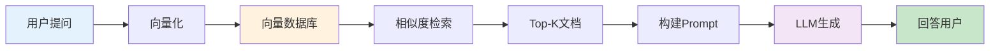

# AI高级面试题 - 实战项目面试题

> **难度等级**：⭐⭐⭐⭐⭐ | **出现频率**：85% | **建议掌握时间**：6周

## 📚 本章目录

- [项目一：企业级智能客服系统](#项目一企业级智能客服系统)
- [项目二：数据分析与商业智能平台](#项目二数据分析与商业智能平台)
- [项目三：多模态内容生成与管理平台](#项目三多模态内容生成与管理平台)

---

## 项目一：企业级智能客服系统

### 技术栈

**前端**：Vue3 + TypeScript + Socket.io
**后端**：Python + FastAPI + Celery
**AI**：GPT-4 / Claude 3 + Pinecone
**数据库**：PostgreSQL + pgvector + Redis

### 项目概述

**核心功能**：
- 智能对话（基于LLM的自然语言对话）
- 知识库管理（RAG检索、向量数据库）
- 多渠道接入（网站、微信、小程序）
- 人工协作（智能转人工、工单系统）
- 意图识别（自动分类、路由分发）

### 核心面试题

#### Q1: 如何设计RAG检索增强系统？

**参考答案**：



**实现要点**：

**1. 文档切片**：
```python
from langchain.text_splitter import RecursiveCharacterTextSplitter

text_splitter = RecursiveCharacterTextSplitter(
    chunk_size=500,
    chunk_overlap=50,
    length_function=len,
    separators=["\n\n", "\n", "。", "，", " ", ""]
)

chunks = text_splitter.split_documents(documents)
```

**2. 向量化与存储**：
```python
from langchain.embeddings import OpenAIEmbeddings
from langchain.vectorstores import Pinecone

embeddings = OpenAIEmbeddings()
vectorstore = Pinecone.from_documents(
    documents=chunks,
    embedding=embeddings,
    index_name="knowledge-base"
)
```

**3. 检索与生成**：
```python
def query_knowledge_base(question: str, top_k: int = 3):
    # 相似度检索
    docs = vectorstore.similarity_search(question, k=top_k)

    # 构建上下文
    context = "\n\n".join([doc.page_content for doc in docs])

    # 生成回答
    prompt = f"""
    基于以下知识库内容回答问题：

    {context}

    问题：{question}

    如果知识库中没有相关信息，请明确说明。
    """

    return llm.predict(prompt)
```

#### Q2: 如何实现多渠道消息接入？

**参考答案**：

```python
from abc import ABC, abstractmethod

class ChannelAdapter(ABC):
    """渠道适配器基类"""

    @abstractmethod
    def receive_message(self):
        """接收消息"""
        pass

    @abstractmethod
    def send_message(self, message):
        """发送消息"""
        pass

class WebChannelAdapter(ChannelAdapter):
    """网站渠道适配器"""
    def receive_message(self, data):
        return {
            "channel": "web",
            "user_id": data.get("user_id"),
            "message": data.get("message"),
            "session_id": data.get("session_id")
        }

    def send_message(self, message):
        return {"type": "web", "data": message}

class WeChatChannelAdapter(ChannelAdapter):
    """微信渠道适配器"""
    def receive_message(self, data):
        # 解析微信XML/JSON
        return {
            "channel": "wechat",
            "user_id": data.get("FromUserName"),
            "message": data.get("Content"),
            "session_id": data.get("FromUserName")
        }

    def send_message(self, message):
        # 转换为微信格式
        return {"type": "wechat", "data": message}

# 渠道路由
class ChannelRouter:
    def __init__(self):
        self.adapters = {
            "web": WebChannelAdapter(),
            "wechat": WeChatChannelAdapter()
        }

    def route_message(self, channel: str, message_data: dict):
        adapter = self.adapters.get(channel)
        if adapter:
            return adapter.receive_message(message_data)
        raise ValueError(f"Unsupported channel: {channel}")
```

#### Q3: 如何实现智能转人工？

**参考答案**：

**转人工触发条件**：
1. 用户满意度低于阈值
2. 连续3次回答未被采纳
3. 检测到情绪问题（投诉、负面情绪）
4. 涉及复杂业务场景（退款、投诉）
5. 主动请求转人工

```python
class TransferService:
    def __init__(self):
        self.sentiment_analyzer = SentimentAnalyzer()

    def should_transfer_to_human(self, conversation: Conversation) -> bool:
        # 检查转人工条件

        # 1. 满意度检测
        if conversation.satisfaction_score < 0.3:
            return True

        # 2. 连续失败检测
        if conversation.consecutive_failures >= 3:
            return True

        # 3. 情绪检测
        last_message = conversation.messages[-1]
        sentiment = self.sentiment_analyzer.analyze(last_message)
        if sentiment["negative"] > 0.7:
            return True

        # 4. 关键词检测
        keywords = ["投诉", "退款", "人工", "经理"]
        if any(kw in last_message.lower() for kw in keywords):
            return True

        return False

    def transfer_to_human(self, conversation: Conversation, agent_id: str):
        """转接到人工"""
        conversation.status = "transferred"
        conversation.assigned_agent_id = agent_id

        # 发送通知给客服人员
        notification = {
            "type": "transfer",
            "conversation_id": conversation.id,
            "customer_id": conversation.customer_id,
            "reason": self._get_transfer_reason(conversation),
            "message_history": conversation.messages[-10:]  # 最近10条消息
        }

        # 通过WebSocket通知
        socket_manager.send_to_agent(agent_id, notification)

        return notification
```

#### Q4: 如何实现意图识别？

**参考答案**：

```python
from sklearn.ensemble import RandomForestClassifier
from sklearn.feature_extraction.text import TfidfVectorizer
import jieba

class IntentClassifier:
    def __init__(self):
        self.vectorizer = TfidfVectorizer(tokenizer=self._tokenize)
        self.classifier = RandomForestClassifier(n_estimators=100)
        self.intent_map = {
            0: "产品咨询",
            1: "订单查询",
            2: "退换货",
            3: "投诉建议",
            4: "其他"
        }

    def _tokenize(self, text):
        # 中文分词
        words = jieba.cut(text)
        return " ".join(words)

    def train(self, training_data: List[Dict]):
        """训练意图分类器"""
        X = [item["text"] for item in training_data]
        y = [item["intent"] for item in training_data]

        X_tfidf = self.vectorizer.fit_transform(X)
        self.classifier.fit(X_tfidf, y)

    def predict_intent(self, text: str) -> str:
        """预测意图"""
        X_tfidf = self.vectorizer.transform([text])
        intent_id = self.classifier.predict(X_tfidf)[0]
        confidence = self.classifier.predict_proba(X_tfidf).max()

        # 置信度过低时使用LLM
        if confidence < 0.6:
            return self._llm_intent_detection(text)

        return self.intent_map[intent_id]

    def _llm_intent_detection(self, text: str) -> str:
        """使用LLM进行意图识别"""
        prompt = f"""
        分析以下用户消息的意图：

        {text}

        可能的意图类型：
        1. 产品咨询
        2. 订单查询
        3. 退换货
        4. 投诉建议
        5. 其他

        请直接返回意图类型编号（1-5）。
        """

        result = llm.predict(prompt)
        return self.intent_map.get(int(result.strip()), "其他")
```

---

## 项目二：数据分析与商业智能平台

### 技术栈

**前端**：React 18 + TypeScript + ECharts
**后端**：Python + FastAPI + SQLAlchemy
**AI**：GPT-4 + LangChain
**数据库**：PostgreSQL + pgvector
**ML**：Scikit-learn + Pandas

### 项目概述

**核心功能**：
- 自然语言查询（NL2SQL）
- 智能图表生成
- 异常检测
- 趋势预测
- 自动化报告
- 数据洞察

### 核心面试题

#### Q5: 如何实现自然语言转SQL（NL2SQL）？

**参考答案**：

**实现方案**：

```python
from langchain.chat_models import ChatOpenAI
from langchain.schema import HumanMessage

class NL2SQLGenerator:
    def __init__(self, database_schema: dict):
        self.llm = ChatOpenAI(model="gpt-4", temperature=0)
        self.schema = database_schema

        self.prompt_template = ChatPromptTemplate.from_messages([
            HumanMessage(content="""
你是一个SQL专家。请根据以下数据库schema和自然语言描述生成SQL查询：

数据库Schema：
{schema}

自然语言描述：
{question}

请只返回SQL查询语句，不要有任何解释。
            """)
        ])

    def generate_sql(self, question: str) -> str:
        """生成SQL查询"""
        # 构建schema信息
        schema_text = self._format_schema()

        # 生成SQL
        messages = self.prompt_template.format_messages(
            schema=schema_text,
            question=question
        )

        sql = self.llm(messages).content.strip()

        # 验证SQL语法
        if not self._validate_sql(sql):
            raise ValueError("生成的SQL不合法")

        return sql

    def _format_schema(self) -> str:
        """格式化schema信息"""
        schema_parts = []

        for table, columns in self.schema.items():
            columns_info = ", ".join([
                f"{col['name']} {col['type']}"
                for col in columns
            ])
            schema_parts.append(f"表 {table} ({columns_info})")

        return "\n".join(schema_parts)
```

**优化技巧**：
1. **Few-shot Learning**：提供示例提高准确率
2. **Schema过滤**：只包含相关表的schema
3. **SQL验证**：检查生成的SQL语法
4. **执行权限**：限制只能执行SELECT查询

#### Q6: 如何实现智能图表生成？

**参考答案**：

```python
class ChartGenerator:
    def __init__(self):
        self.llm = ChatOpenAI(model="gpt-4", temperature=0)
        self.chart_types = {
            "line": "趋势图",
            "bar": "柱状图",
            "pie": "饼图",
            "scatter": "散点图",
            "table": "表格"
        }

    def recommend_chart(self, data_info: dict) -> str:
        """推荐图表类型"""
        prompt = f"""
根据以下数据特征推荐最佳的可视化方式：

数据行数：{data_info['row_count']}
数据列数：{data_info['column_count']}
数据类型：{data_info['types']}
字段名：{data_info['columns']}

可用图表类型：
- line：适合展示时间序列、趋势变化
- bar：适合对比分类数据
- pie：适合展示占比、分布
- scatter：适合展示相关性
- table：适合精确数据查看

请推荐最合适的图表类型，只返回图表类型名称。
        """

        chart_type = self.llm.predict(prompt).content.strip().lower()

        # 验证并返回
        return chart_type if chart_type in self.chart_types else "bar"

    def generate_chart_config(self, data: pd.DataFrame, chart_type: str):
        """生成ECharts配置"""

        if chart_type == "line":
            return self._generate_line_chart(data)
        elif chart_type == "bar":
            return self._generate_bar_chart(data)
        elif chart_type == "pie":
            return self._generate_pie_chart(data)
        # ... 其他图表类型

    def _generate_line_chart(self, data: pd.DataFrame) -> dict:
        """生成折线图配置"""
        x_column = self._detect_time_column(data)
        y_columns = self._detect_numeric_columns(data)

        return {
            "title": {"text": "趋势图"},
            "tooltip": {"trigger": "axis"},
            "xAxis": {
                "type": "category",
                "data": data[x_column].tolist()
            },
            "yAxis": {
                "type": "value",
                "name": y_columns[0]
            },
            "series": [{
                "name": y_columns[0],
                "type": "line",
                "data": data[y_columns[0]].tolist()
            }]
        }
```

#### Q7: 如何实现异常检测？

**参考答案**：

```python
from sklearn.ensemble import IsolationForest
from sklearn.preprocessing import StandardScaler
import numpy as np

class AnomalyDetector:
    def __init__(self):
        self.scaler = StandardScaler()
        self.model = IsolationForest(
            contamination=0.1,  # 异常比例
            random_state=42
        )
        self.threshold = None

    def train(self, normal_data: pd.DataFrame):
        """训练模型"""
        # 标准化
        X_scaled = self.scaler.fit_transform(normal_data)

        # 训练
        self.model.fit(X_scaled)

        # 计算阈值
        scores = self.model.score_samples(X_scaled)
        self.threshold = np.percentile(scores, 10)  # 最低10%为异常

    def detect(self, new_data: pd.DataFrame) -> dict:
        """检测异常"""
        X_scaled = self.scaler.transform(new_data)

        # 预测 (-1表示异常)
        predictions = self.model.predict(X_scaled)
        scores = self.model.score_samples(X_scaled)

        anomalies = new_data[predictions == -1]

        return {
            "anomaly_count": len(anomalies),
            "anomalies": anomalies.to_dict("records"),
            "anomaly_scores": scores[predictions == -1]
        }
```

**异常类型**：
1. **统计异常**：数据偏离正常范围
2. **上下文异常**：不符合业务逻辑
3. **时间序列异常**：突然的峰值或谷值
4. **组合异常**：多个指标的异常组合

---

## 项目三：多模态内容生成与管理平台

### 技术栈

**前端**：Next.js 15 + TypeScript
**后端**：Python + FastAPI
**AI模型**：GPT-4V + DALL-E 3 + Whisper
**数据库**：PostgreSQL + MongoDB + Pinecone

### 项目概述

**核心功能**：
- 文本生成（文章、文案、SEO）
- 图像生成（营销图、产品设计）
- 视频生成（短视频、宣传片）
- 音频生成（语音合成、配音）
- AIGC检测（内容审核、版权保护）

### 核心面试题

#### Q8: 如何实现文本生成功能？

**参考答案**：

```python
from openai import OpenAI
from typing import Dict, List

class TextGenerator:
    def __init__(self):
        self.client = OpenAI()

        self.prompt_templates = {
            "article": """
你是一位专业的内容创作者。请根据以下要求生成文章：

主题：{topic}
字数：{word_count}
风格：{style}
关键词：{keywords}

要求：
1. 内容原创，逻辑清晰
2. 符合SEO优化
3. 引人入胜，可读性强
            """,

            "marketing": """
请根据以下产品信息生成营销文案：

产品名称：{product_name}
产品特点：{features}
目标受众：{target_audience}
平台：{platform}（如：微信、抖音、小红书）

要求：
1. 突出卖点，吸引眼球
2. 符合平台调性
3. 引导转化（点击、购买）
            """
        }

    def generate_text(self, content_type: str, params: Dict) -> str:
        """生成文本"""
        template = self.prompt_templates.get(content_type)

        if not template:
            raise ValueError(f"不支持的内容类型：{content_type}")

        prompt = template.format(**params)

        response = self.client.chat.completions.create(
            model="gpt-4",
            messages=[{"role": "user", "content": prompt}],
            temperature=0.7,
            max_tokens=2000
        )

        return response.choices[0].message.content
```

#### Q9: 如何实现AIGC检测？

**参考答案**：

**检测方案**：

**1. 文本检测**：
```python
from transformers import pipeline

class AIGCDetector:
    def __init__(self):
        self.text_classifier = pipeline(
            "text-classification",
            model="roberta-base-openai-detector"
        )
        self.image_classifier = pipeline(
            "image-classification",
            model="demucs/autnell-mobilenet-v3"
        )

    def detect_text(self, text: str) -> Dict:
        """检测文本是否为AI生成"""
        result = self.text_classifier(text)

        return {
            "is_ai_generated": result[0]["label"] == "AI",
            "confidence": result[0]["score"],
            "model": "roberta"
        }

    def detect_image(self, image_path: str) -> Dict:
        """检测图像是否为AI生成"""
        result = self.image_classifier(image_path)

        return {
            "is_ai_generated": result[0]["label"] == "AI",
            "confidence": result[0]["score"],
            "model": "mobilenet"
        }
```

**2. 多模态检测**：
```python
class MultimodalDetector:
    def __init__(self):
        self.text_detector = AIGCDetector()
        self.image_detector = ImageAIGCDetector()

    def detect_content(self, content: Dict) -> Dict:
        """检测多模态内容"""
        results = {}

        # 检测文本
        if "text" in content:
            results["text"] = self.text_detector.detect_text(content["text"])

        # 检测图像
        if "images" in content:
            results["images"] = []
            for img in content["images"]:
                results["images"].append(
                    self.image_detector.detect_image(img)
                )

        # 综合判断
        results["overall_ai_generated"] = self._calculate_overall_ai_score(results)

        return results
```

#### Q10: 如何实现内容版本控制？

**参考答案**：

```python
from sqlalchemy import Column, String, DateTime, JSON, Integer
from sqlalchemy.orm import relationship
from datetime import datetime

class ContentVersion(Base):
    __tablename__ = "content_versions"

    id = Column(String, primary_key=True)
    content_id = Column(String, ForeignKey("contents.id"))
    version_number = Column(Integer)
    title = Column(String)
    content = Column(Text)
    changes = Column(JSON)  # 变更记录
    created_by = Column(String)  # 创建者
    created_at = Column(DateTime, default=datetime.utcnow)

    # 关联
    content = relationship("Content", back_populates="versions")

class Content(Base):
    __tablename__ = "contents"

    id = Column(String, primary_key=True)
    title = Column(String)
    current_version = Column(Integer, default=1)
    versions = relationship("ContentVersion", back_populates="content")
    status = Column(String)  # draft, published, archived

    def create_new_version(self, changes: dict, user_id: str):
        """创建新版本"""
        # 复制当前版本
        current_version = ContentVersion.query.filter_by(
            content_id=self.id,
            version_number=self.current_version
        ).first()

        # 创建新版本
        new_version = ContentVersion(
            content_id=self.id,
            version_number=self.current_version + 1,
            title=changes.get("title", current_version.title),
            content=changes.get("content", current_version.content),
            changes=changes,
            created_by=user_id
        )

        self.current_version += 1
        return new_version
```

---

## 面试技巧

### 实战项目描述技巧

**STAR法则**：

1. **Situation（背景）**
```
"我参与了企业级智能客服系统的开发，这是一个基于RAG技术的AI客服解决方案。
项目背景是公司原有的客服系统响应慢、准确率低，需要升级为AI驱动。"
```

2. **Task（任务）**
```
"我的职责是设计和实现RAG检索增强模块，提升客服系统的准确率和响应速度。"
```

3. **Action（行动）**
```
"我采用了以下技术方案：
1. 使用LangChain框架构建RAG流程
2. Pinecone作为向量数据库存储知识库
3. GPT-4作为生成模型
4. 实现了智能转人工逻辑

具体实现包括：
- 文档切片：将500字文档按重叠50字切片
- 向量化：使用OpenAI Embeddings API
- 检索：Top-3相似度检索
- 生成：结合上下文和问题生成回答"
```

4. **Result（结果）**
```
"最终实现了：
- 准确率从60%提升到85%
- 响应时间从平均30秒降低到5秒
- 人工转接率下降40%
- 客户满意度提升25%"
```

### 项目难点应对

**常见问题**：

**Q1: RAG检索准确率不高？**
```
A: "这个问题我在项目中确实遇到过。我通过以下方式优化：
1. 优化文档切片策略：根据段落边界切片，而不是固定长度
2. 调整相似度阈值：从0.7提高到0.85
3. 增加重排序：对检索结果进行二次打分排序
4. 混合检索：结合关键词检索和向量检索

最终准确率从70%提升到85%。"
```

**Q2: 如何处理并发请求？**
```
A: "在智能客服系统中，高峰期可能有上千并发连接。我的解决方案：
1. 使用Celery异步任务队列处理AI生成请求
2. Redis缓存常见问题的答案
3. 连接池管理数据库连接
4. WebSocket连接限流防止过载

系统最终能支持2000+并发。"
```

---

**小徐带你飞系列教程**

**最后更新：2026年2月**
**版本：v1.0**
**作者：小徐**
**邮箱：esimonx@163.com**
