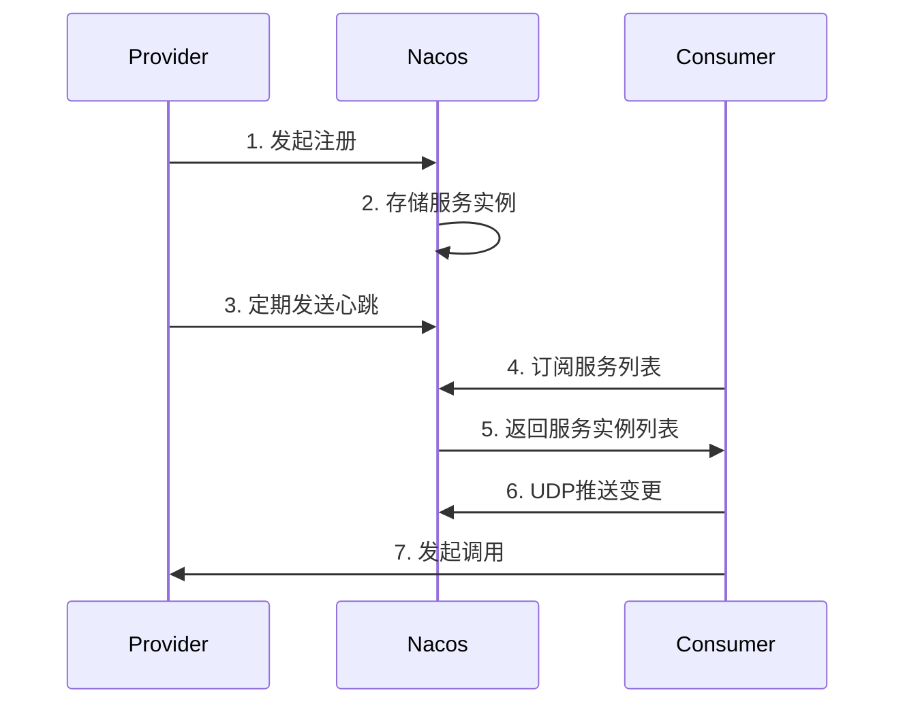
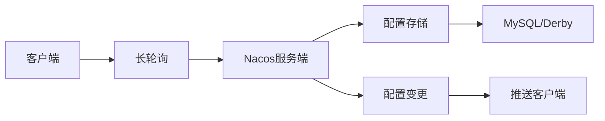
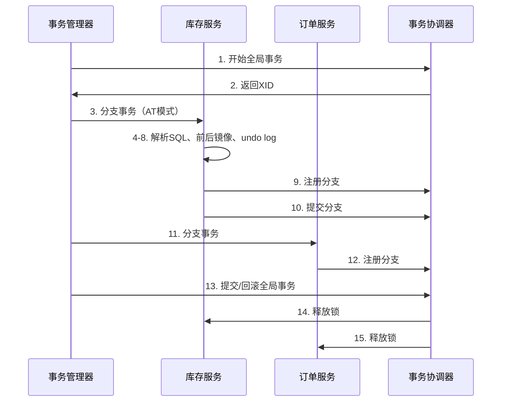
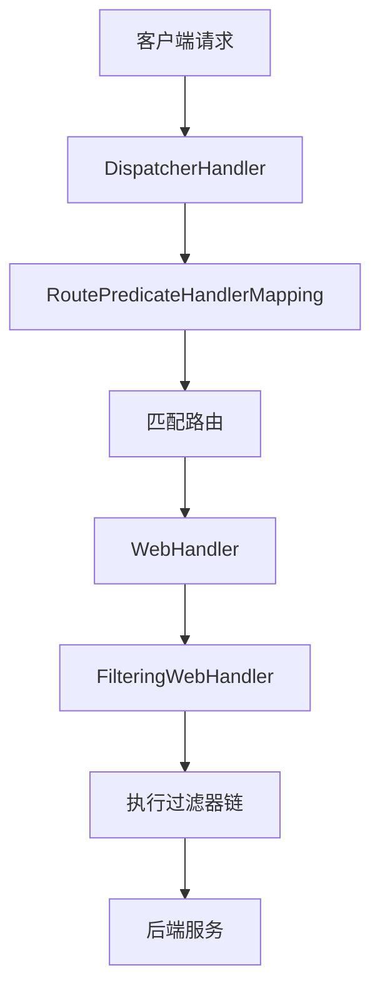

# Java高级面试题 - 微服务架构

> **难度等级**：⭐⭐⭐⭐ | **出现频率**：88% | **建议掌握时间**：3周

## 📚 本章目录

- [一、Nacos注册中心](#一nacos注册中心)
- [二、Sentinel流控](##二sentinel流控)
- [三、Seata分布式事务](#三seata分布式事务)
- [四、Gateway网关](#四gateway网关)

---

## 一、Nacos注册中心

### Q23: Nacos的服务注册与发现流程？

**参考答案**：



**核心机制**：
- **AP模式**：优先可用性（默认）
- **CP模式**：优先一致性（Raft协议）
- **心跳检测**：5秒心跳，15秒超时剔除
- **健康检查**：TCP/HTTP
- **负载均衡**：权重、同集群优先

### Q24: Nacos配置中心的工作原理？

**参考答案**：



**配置读取优先级**：
1. JVM启动参数（-D）
2. Nacos配置中心（动态）
3. 本地配置文件（application.yml）

---

## 二、Sentinel流控

### Q25: Sentinel的流控规则和熔断降级原理？

**参考答案**：

**流控规则**：
```java
// QPS限流：超过100则直接拒绝
FlowRule rule = new FlowRule()
    .setResource("orderService")
    .setGrade(RuleConstant.FLOW_GRADE_QPS)
    .setCount(100)
    .setLimitApp("default")
    .asList();
```

**流控策略**：
- **直接拒绝**：抛出FlowException
- **Warm Up**：预热（默认冷启动因子3）
- **匀速排队**：漏桶算法

**熔断降级**：
```java
DegradeRule rule = new DegradeRule()
    .setResource("orderService")
    .setGrade(RuleConstant.DEGRADE_GRADE_RT)  // 平均响应时间
    .setCount(100)  // 超过100ms
    .setTimeWindow(10);  // 熔断10秒
```

---

## 三、Seata分布式事务

### Q26: Seata的AT模式原理？

**参考答案**：



**两阶段提交**：
1. **第一阶段**：
   - 解析SQL语义
   - 查询前镜像（before image）
   - 执行业务SQL
   - 查询后镜像（after image）
   - 生成undo log
   - 提交本地事务

2. **第二阶段**：
   - **提交**：异步删除undo log
   - **回滚**：根据undo log反向补偿

### Q27: Seata的TCC、SAGA模式区别？

**参考答案**：

| 模式 | 一阶段 | 二阶段提交 | 二阶段回滚 | 适用场景 |
|-----|-------|----------|----------|---------|
| **AT** | 自动 | 自动删除undo log | 自动补偿 | 简单CRUD |
| **TCC** | 手动（Try） | 手动（Confirm） | 手动（Cancel） | 核心业务、强一致 |
| **SAGA** | 手动 | - | 自动补偿 | 长事务、多服务 |

---

## 四、Gateway网关

### Q28: Spring Cloud Gateway的工作原理？

**参考答案**：



**三大核心**：
1. **Route（路由）**：ID、目标URI、断言、过滤器
2. **Predicate（断言）**：匹配请求条件
3. **Filter（过滤器）**：前置/后置处理

**内置断言工厂**：
```yaml
spring:
  cloud:
    gateway:
      routes:
        - id: order-service
          uri: lb://order-service
          predicates:
            - Path=/api/orders/**
            - Method=GET,POST
```

### Q29: Gateway如何实现全局鉴权？

**参考答案**：

```java
@Component
public class AuthFilter implements GlobalFilter, Ordered {
    @Override
    public Mono<Void> filter(ServerWebExchange exchange, GatewayFilterChain chain) {
        String token = exchange.getRequest().getHeaders().getFirst("Authorization");

        if (StringUtils.isEmpty(token)) {
            exchange.getResponse().setStatusCode(HttpStatus.UNAUTHORIZED);
            return exchange.getResponse().setComplete();
        }

        // 验证token
        Claims claims = JwtUtil.parseToken(token);
        if (claims == null) {
            exchange.getResponse().setStatusCode(HttpStatus.UNAUTHORIZED);
            return exchange.getResponse().setComplete();
        }

        // 传递用户信息
        ServerHttpRequest request = exchange.getRequest().mutate()
            .header("X-User-Id", claims.getSubject())
            .build();
        return chain.filter(exchange.mutate().request(request).build());
    }

    @Override
    public int getOrder() {
        return -100;  // 优先级最高
    }
}
```

---

## 📚 延伸阅读

- [高级面试题：分布式系统 →](./distributed-system)
- [实战项目面试题 →](./project-interview)

---

**更新时间**：2026年2月 | **版本**：v2.0
