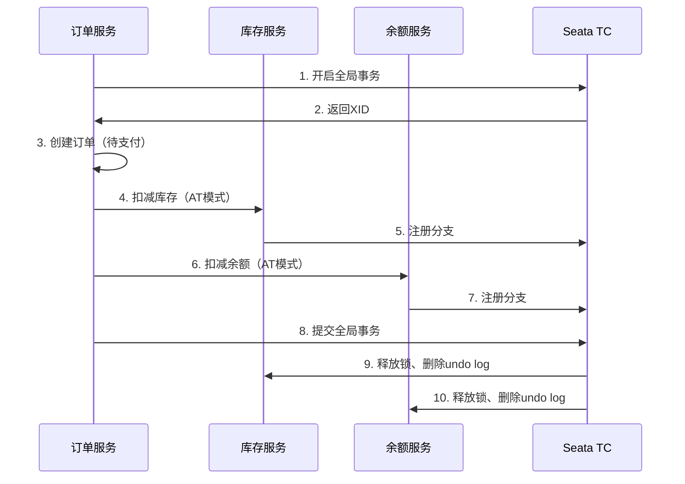

# Java高级面试题 - 实战项目面试题

> **难度等级**：⭐⭐⭐⭐⭐ | **出现频率**：80% | **建议掌握时间**：4周

## 📚 本章目录

- [项目一：电商平台微服务版](#项目一电商平台微服务版)
- [项目二：秒杀系统设计](#项目二秒杀系统设计)
- [项目三：高并发系统设计](#项目三高并发系统设计)
- [项目四：微服务架构完整系统](#项目四微服务架构完整系统)

---

## 项目一：电商平台微服务版

### 技术栈

**后端**：Spring Cloud Alibaba + Nacos + Gateway + Sentinel + Seata
**数据库**：MySQL 8.0 + Redis 7.x + RabbitMQ
**部署**：Docker + Kubernetes

### 核心问题

#### Q30: 微服务如何拆分？你的拆分原则是什么？

**参考答案**：

```
┌─────────────────────────────────────┐
│         电商平台微服务架构             │
├─────────────────────────────────────┤
│  用户服务（User Service）             │  用户注册、登录、个人信息
│  商品服务（Product Service）          │  商品管理、库存管理
│  订单服务（Order Service）            │  订单创建、订单查询
│  支付服务（Payment Service）          │  支付对接、支付回调
│  营销服务（Marketing Service）        │  优惠券、秒杀活动
│  搜索服务（Search Service）           │  商品搜索、Elasticsearch
└─────────────────────────────────────┘
```

**拆分原则**：
1. **业务边界**：按业务领域（DDD）划分
2. **数据独立**：每个服务独占数据库
3. **职责单一**：一个服务只做一件事
4. **通信方式**：内部同步（Feign），外部异步（MQ）

#### Q31: 如何保证分布式事务一致性（下单+扣库存+扣余额）？

**参考答案**：



**Seata AT模式实现**：
```java
@GlobalTransactional(name = "create-order")
public void createOrder(OrderDTO orderDTO) {
    // 1. 创建订单
    Order order = new Order();
    order.setUserId(orderDTO.getUserId());
    order.setProductId(orderDTO.getProductId());
    order.setCount(orderDTO.getCount());
    orderMapper.insert(order);

    // 2. 扣减库存
    productClient.deductStock(orderDTO.getProductId(), orderDTO.getCount());

    // 3. 扣减余额
    accountClient.deductBalance(orderDTO.getUserId(), orderDTO.getTotalAmount());
}
```

#### Q32: 如何防止商品超卖？

**参考答案**：

**方案1：Redis + Lua脚本（推荐）**
```lua
-- seckill.lua
local stock = redis.call('get', KEYS[1])
if tonumber(stock) <= 0 then
    return 0  -- 库存不足
end

redis.call('decr', KEYS[1])
redis.call('sadd', KEYS[2], ARGV[1])  -- 记录已抢购用户
return 1  -- 抢购成功
```

```java
public boolean seckill(Long userId, Long productId) {
    String lua = "seckill.lua";
    DefaultRedisScript<Long> script = new DefaultRedisScript<>(lua, Long.class);

    Long result = redisTemplate.execute(
        script,
        Arrays.asList("stock:" + productId, "user:" + productId + ":" + userId),
        String.valueOf(userId)
    );

    if (result == 1) {
        // 发送MQ消息，异步创建订单
        mqProducer.send(new SeckillMessage(userId, productId));
        return true;
    }
    return false;
}
```

**方案2：数据库乐观锁**
```sql
-- 库存表增加version字段
UPDATE product
SET stock = stock - 1,
    version = version + 1
WHERE id = 123
  AND stock > 0
  AND version = 5;  -- 当前版本
```

#### Q33: 服务熔断降级如何配置？

**参考答案**：

```yaml
# Sentinel流控规则
spring:
  cloud:
    sentinel:
      datasource:
        flow:
          nacos:
            server-addr: localhost:8848
            data-id: ${spring.application.name}-flow-rules
            group-id: SENTINEL_GROUP
            rule-type: flow

# 流控规则示例
[
  {
    "resource": "orderService",
    "limitApp": "default",
    "grade": 1,
    "count": 100,
    "strategy": 0,
    "controlBehavior": 0,
    "clusterMode": false
  }
]
```

```java
// 代码方式配置
@SentinelResource(
    value = "orderService",
    blockHandler = "handleBlock",
    fallback = "handleFallback"
)
public Order createOrder(Order order) {
    return orderService.save(order);
}

// 限流处理
public Order handleBlock(Order order, BlockException e) {
    log.warn("限流了：{}", e.getClass().getSimpleName());
    throw new BusinessException("系统繁忙，请稍后重试");
}

// 降级处理
public Order handleFallback(Order order, Throwable e) {
    log.error("异常了：{}", e.getMessage());
    return Order.getDefault();  // 返回默认值
}
```

#### Q34: 如何实现分布式锁？

**参考答案**：

**Redis分布式锁（Redisson）**：
```java
@Autowired
private RedissonClient redissonClient;

public void deductStock(Long productId) {
    RLock lock = redissonClient.getLock("lock:product:" + productId);
    try {
        // 尝试加锁，最多等待10秒，锁30秒后自动释放
        boolean locked = lock.tryLock(10, 30, TimeUnit.SECONDS);
        if (!locked) {
            throw new BusinessException("系统繁忙，请稍后重试");
        }

        // 扣减库存
        int rows = productMapper.deductStock(productId, 1);
        if (rows == 0) {
            throw new BusinessException("库存不足");
        }
    } catch (InterruptedException e) {
        Thread.currentThread().interrupt();
        throw new BusinessException("系统异常");
    } finally {
        lock.unlock();
    }
}
```

**Zookeeper分布式锁**：
```java
@Autowired
private CuratorFramework curatorFramework;

public void deductStock(Long productId) {
    InterProcessMutex lock = new InterProcessMutex(
        curatorFramework,
        "/locks/product/" + productId
    );
    try {
        // 获取锁
        lock.acquire(10, TimeUnit.SECONDS);

        // 扣减库存
        int rows = productMapper.deductStock(productId, 1);
        if (rows == 0) {
            throw new BusinessException("库存不足");
        }
    } finally {
        lock.release();
    }
}
```

---

## 项目二：秒杀系统设计

### 技术架构

```
┌─────────────────────────────────────────────┐
│                   CDN                        │  静态资源
└─────────────────────────────────────────────┘
                    ↓
┌─────────────────────────────────────────────┐
│              负载均衡（LVS/Nginx）             │
└─────────────────────────────────────────────┘
                    ↓
┌─────────────────────────────────────────────┐
│            API网关（限流、熔断、鉴权）          │
└─────────────────────────────────────────────┘
                    ↓
┌─────────────────────────────────────────────┐
│         秒杀服务（Redis库存扣减）              │
└─────────────────────────────────────────────┘
                    ↓
┌─────────────────────────────────────────────┐
│         消息队列（RabbitMQ/Kafka）            │
└─────────────────────────────────────────────┘
                    ↓
┌─────────────────────────────────────────────┐
│         订单服务（异步创建订单）               │
└─────────────────────────────────────────────┘
```

### 核心问题

#### Q35: 如何设计一个高并发秒杀系统？

**参考答案**：

**1. 页面静态化**
```html
<!-- 秒杀页面提前生成，部署到CDN -->
<!DOCTYPE html>
<html>
<head>
    <title>秒杀活动</title>
</head>
<body>
    <h1>iPhone 15 Pro 秒杀</h1>
    <p>价格：¥7999</p>
    <p>库存：<span id="stock">1000</span></p>
    <button onclick="seckill()">立即抢购</button>
</body>
</html>
```

**2. 网关限流**
```yaml
spring:
  cloud:
    gateway:
      routes:
        - id: seckill
          uri: lb://seckill-service
          predicates:
            - Path=/api/seckill/**
          filters:
            - name: RequestRateLimiter
              args:
                redis-rate-limiter.replenishRate: 100  # 每秒补充100个令牌
                redis-rate-limiter.burstCapacity: 200  # 桶容量200
```

**3. Redis库存扣减（Lua保证原子性）**
```lua
local stock = redis.call('get', KEYS[1])
if tonumber(stock) <= 0 then
    return 0
end
redis.call('decr', KEYS[1])
redis.call('sadd', KEYS[2], ARGV[1])
return 1
```

**4. MQ异步下单**
```java
@RabbitListener(queues = "seckill_order_queue")
public void createOrder(SeckillMessage message) {
    // 创建订单
    Order order = new Order();
    order.setUserId(message.getUserId());
    order.setProductId(message.getProductId());
    orderMapper.insert(order);

    // 扣减DB库存
    int rows = productMapper.deductStock(message.getProductId());
    if (rows == 0) {
        order.setStatus(OrderStatus.CANCELLED);
        orderMapper.updateById(order);
    }
}
```

**5. 防刷策略**
- 验证码：防止机器刷单
- 限流：单用户限制请求频率
- 黑名单：IP限制、设备指纹
- 预热：提前加载库存到Redis

---

## 项目三：高并发系统设计

### 核心问题

#### Q36: 高并发系统如何设计？

**参考答案**：

```
┌─────────────────────────────────────────────┐
│                   CDN                        │  静态资源
└─────────────────────────────────────────────┘
                    ↓
┌─────────────────────────────────────────────┐
│              负载均衡（LVS/Nginx）             │
└─────────────────────────────────────────────┘
                    ↓
┌─────────────────────────────────────────────┐
│            API网关（限流、熔断、鉴权）          │
└─────────────────────────────────────────────┘
                    ↓
┌───────────────┬───────────────┬───────────────┐
│   服务A       │   服务B       │   服务C       │
├───────────────┼───────────────┼───────────────┤
│ Redis缓存     │ Redis缓存     │ Redis缓存     │
│ 消息队列      │ 消息队列      │ 消息队列      │
└───────────────┴───────────────┴───────────────┘
                    ↓
┌─────────────────────────────────────────────┐
│          数据库（读写分离、分库分表）          │
└─────────────────────────────────────────────┘
```

**优化策略**：

**1. 无状态服务**
```java
// 用户状态存Redis，不存Session
@RestController
public class UserController {
    @GetMapping("/user/info")
    public User getUserInfo(@RequestHeader("Authorization") String token) {
        Long userId = JwtUtil.parseToken(token);
        return redisTemplate.opsForValue().get("user:" + userId);
    }
}
```

**2. 异步处理**
```java
// 同步：串行执行，耗时长
public void register(User user) {
    userService.save(user);          // 100ms
    emailService.send(user);         // 500ms
    smsService.send(user);           // 300ms
}
// 总耗时：900ms

// 异步：并行执行，耗时短
@Async
public void register(User user) {
    userService.save(user);          // 100ms
    emailService.sendAsync(user);    // 异步
    smsService.sendAsync(user);      // 异步
}
// 总耗时：100ms
```

**3. 多级缓存**
```java
@Cacheable(value = "user", key = "#id")
public User getUser(Long id) {
    // L1: 本地缓存（Caffeine）
    // L2: Redis缓存
    // L3: 数据库
    return userMapper.selectById(id);
}
```

**4. 数据库读写分离**
```java
@DS("master")  // 主库
public void createOrder(Order order) {
    orderMapper.insert(order);
}

@DS("slave")   // 从库
public Order getOrder(Long orderId) {
    return orderMapper.selectById(orderId);
}
```

**5. 分库分表**
```yaml
# ShardingSphere配置
spring:
  shardingsphere:
    sharding:
      tables:
        t_order:
          actual-data-nodes: ds$->{0..1}.t_order_$->{0..1}
          database-strategy:
            inline:
              sharding-column: user_id
              algorithm-expression: ds$->{user_id % 2}
          table-strategy:
            inline:
              sharding-column: order_id
              algorithm-expression: t_order_$->{order_id % 2}
```

---

## 项目四：微服务架构完整系统

### 技术架构

**后端**：Spring Cloud全家桶 + Docker + Kubernetes + Skywalking
**监控**：Prometheus + Grafana + ELK
**部署**：ArgoCD GitOps + 蓝绿部署 + 金丝雀发布

### 核心问题

#### Q37: 微服务架构如何设计？

**参考答案**：

```
┌─────────────────────────────────────────────┐
│            API Gateway（网关层）              │
│         鉴权、限流、熔断、路由、日志            │
└─────────────────────────────────────────────┘
                    ↓
┌─────────────────────────────────────────────┐
│            核心服务层（Core Services）         │
├─────────────┬─────────────┬─────────────────┤
│  用户服务    │  商品服务    │   订单服务       │
│  认证服务    │  库存服务    │   支付服务       │
├─────────────┼─────────────┼─────────────────┤
│  营销服务    │  搜索服务    │   消息服务       │
│  通知服务    │  文件服务    │   工作流服务     │
└─────────────┴─────────────┴─────────────────┘
                    ↓
┌─────────────────────────────────────────────┐
│          基础服务层（Infrastructure）          │
├─────────────┬─────────────┬─────────────────┤
│ Nacos（注册+配置）                          │
│ Sentinel（流控熔断）                         │
│ Seata（分布式事务）                          │
│ Skywalking（链路追踪）                       │
└─────────────────────────────────────────────┘
                    ↓
┌─────────────────────────────────────────────┐
│          数据层（Data Layer）                 │
├─────────────┬─────────────┬─────────────────┤
│ MySQL集群    │ Redis集群    │  RabbitMQ集群   │
│ Elasticsearch│ MinIO对象    │  MongoDB       │
└─────────────┴─────────────┴─────────────────┘
```

#### Q38: 如何保证高可用（多级容灾）？

**参考答案**：

**1. 服务高可用**
```yaml
# Deployment多副本
apiVersion: apps/v1
kind: Deployment
metadata:
  name: order-service
spec:
  replicas: 3  # 3个副本
  selector:
    matchLabels:
      app: order-service
  template:
    metadata:
      labels:
        app: order-service
    spec:
      containers:
      - name: order-service
        image: order-service:1.0.0
        resources:
          requests:
            memory: "512Mi"
            cpu: "500m"
          limits:
            memory: "1Gi"
            cpu: "1000m"
        livenessProbe:
          httpGet:
            path: /actuator/health
            port: 8080
          initialDelaySeconds: 30
          periodSeconds: 10
        readinessProbe:
          httpGet:
            path: /actuator/health/readiness
            port: 8080
          initialDelaySeconds: 30
          periodSeconds: 5
```

**2. 数据库高可用**
```bash
# MySQL主从复制 + MHA自动故障转移
Master（写）
  ↓
Slave1（读） ← Slave2（读） ← Slave3（读）
  ↓
MHA Manager（监控+自动故障转移）
```

**3. Redis高可用**
```bash
# Redis Sentinel哨兵模式
Master
  ↓
Slave1 ← Slave2
  ↓
Sentinel1 ← Sentinel2 ← Sentinel3（监控+自动故障转移）
```

**4. 多机房容灾**
```
┌─────────┐    ┌─────────┐    ┌─────────┐
│ 机房A    │    │ 机房B    │    │ 机房C    │
│ (主机房)  │    │ (备机房)  │    │ (灾备)   │
└─────────┘    └─────────┘    └─────────┘
     ↓              ↓              ↓
  同步复制        异步复制        异步复制
```

#### Q39: 如何进行链路追踪与问题排查？

**参考答案**：

**Skywalking集成**：
```yaml
# JVM参数
-javaagent:/path/to/skywalking-agent.jar=
  agent.service_name=order-service
  agent.collector.backend_service=127.0.0.1:11800
  agent.logging.level=INFO
```

**链路追踪分析**：
1. **请求链路图**：可视化展示请求经过的所有服务
2. **性能分析**：每个服务的响应时间
3. **异常定位**：快速定位错误发生的链路
4. **依赖分析**：服务之间的依赖关系

#### Q40: 如何设计灰度发布（金丝雀发布）？

**参考答案**：

**Gateway灰度路由**：
```java
@Component
public class GrayRouteFilter implements GlobalFilter {
    @Override
    public Mono<Void> filter(ServerWebExchange exchange, GatewayFilterChain chain) {
        String userId = exchange.getRequest().getHeaders().getFirst("X-User-Id");

        // 灰度用户列表（从Redis获取）
        Set<String> grayUsers = redisTemplate.opsForSet().members("gray:users");

        if (grayUsers != null && grayUsers.contains(userId)) {
            // 灰度用户路由到新版本
            ServerHttpRequest request = exchange.getRequest().mutate()
                .header("X-Version", "v2")
                .build();
            return chain.filter(exchange.mutate().request(request).build());
        }

        // 普通用户路由到旧版本
        return chain.filter(exchange);
    }
}
```

**Kubernetes金丝雀发布**：
```yaml
# 10%流量到新版本
apiVersion: networking.istio.io/v1beta1
kind: VirtualService
metadata:
  name: order-service
spec:
  http:
  - match:
    - headers:
        x-user-id:
          regex: "1|2|3|4|5"  # 前5个用户（灰度）
    route:
    - destination:
        host: order-service
        subset: v2  # 新版本
      weight: 100
  - route:
    - destination:
        host: order-service
        subset: v1  # 旧版本
      weight: 90
    - destination:
        host: order-service
        subset: v2  # 新版本
      weight: 10
```

---

## 📚 推荐学习资源

### 开源项目
- [mall-swarm：微服务电商系统](https://github.com/macrozheng/mall-swarm)
- [mall4cloud：B2B2C商城系统](https://github.com/gz-yami/mall4cloud)

### 面试题资源
- [2025年大厂实战场景面试题精析](https://blog.csdn.net/x1ao_fe1/article/details/148543649)
- [Java后端面试必考场景题大全](https://blog.csdn.net/2501_91139003/article/details/148095690)

---

**更新时间**：2026年2月 | **版本**：v2.0

**祝你面试成功！** 🎉
