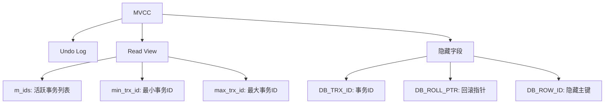

# Java中级面试题 - 数据库与Redis

> **难度等级**：⭐⭐⭐ | **出现频率**：90% | **建议掌握时间**：2周

## 📚 本章目录

- [一、MySQL索引优化](#一mysql索引优化)
- [二、MySQL事务与锁](##二mysql事务与锁)
- [三、Redis数据类型](#三redis数据类型)
- [四、Redis缓存问题](#四redis缓存问题)

---

## 一、MySQL索引优化

### Q16: MySQL索引的数据结构为什么选择B+树？

**参考答案**：

**B+树特点**：
1. **非叶子节点只存键**：能存更多索引项，树更矮胖
2. **叶子节点存数据**：范围查询效率高
3. **叶子节点链表**：支持顺序扫描

**B+树 vs B树 vs Hash**：

| 特性 | B+树 | B树 | Hash |
|-----|------|-----|------|
| **范围查询** | ✅ 好 | ⚠️ 一般 | ❌ 不支持 |
| **点查询** | ✅ 好 | ✅ 好 | ✅ 最好 |
| **IO次数** | 少 | 较多 | - |
| **存储引擎** | InnoDB | MyISAM | Memory |

### Q17: 什么情况下索引会失效？

**参考答案**：

```sql
-- 1. 使用函数，索引失效
SELECT * FROM user WHERE YEAR(create_time) = 2024;

-- 2. 隐式类型转换，索引失效
SELECT * FROM user WHERE phone = 13800138000;  -- phone是VARCHAR

-- 3. LIKE以%开头，索引失效
SELECT * FROM user WHERE name LIKE '%张%';

-- 4. OR连接未索引字段
SELECT * FROM user WHERE age = 20 OR name = '张三';

-- 5. 不符合最左前缀原则
-- 索引：(name, age, phone)
SELECT * FROM user WHERE age = 20;  -- 索引失效
```

**最左前缀原则**：
```sql
-- 联合索引 (name, age, phone)
-- ✅ 使用索引
SELECT * FROM user WHERE name = '张三';
SELECT * FROM user WHERE name = '张三' AND age = 20;

-- ❌ 不使用索引
SELECT * FROM user WHERE age = 20;
SELECT * FROM user WHERE phone = '13800138000';
```

---

## 二、MySQL事务与锁

### Q18: MySQL事务隔离级别及对应的问题？

**参考答案**：

| 隔离级别 | 脏读 | 不可重复读 | 幻读 | 锁类型 |
|---------|------|-----------|------|-------|
| **读未提交** | ✅ 可能 | ✅ 可能 | ✅ 可能 | 无锁 |
| **读已提交** | ❌ 不可能 | ✅ 可能 | ✅ 可能 | MVCC |
| **可重复读** | ❌ 不可能 | ❌ 不可能 | ✅ 可能 | MVCC + Next-Key Lock |
| **串行化** | ❌ 不可能 | ❌ 不可能 | ❌ 不可能 | 表锁 |

**MySQL默认**：REPEATABLE READ（可重复读）

### Q19: MVCC（多版本并发控制）原理？

**参考答案**：



**版本链**：
```
记录1（事务100） → undo log → 记录2（事务90） → undo log → 记录3（事务80）
```

---

## 三、Redis数据类型

### Q20: Redis的5种基本数据类型及应用场景？

**参考答案**：

| 类型 | 底层实现 | 应用场景 |
|-----|---------|---------|
| **String** | SDS | 缓存、计数器、分布式锁 |
| **Hash** | 哈希表 + 压缩列表 | 对象存储（如用户信息） |
| **List** | 双向链表 + 压缩列表 | 消息队列、关注列表 |
| **Set** | 哈希表 + 整数集合 | 标签、共同关注 |
| **ZSet** | 跳表 + 哈希表 | 排行榜、延迟队列 |

**示例**：
```java
// String: 计数器
redisTemplate.opsForValue().increment("view_count:article:123");

// Hash: 用户信息
redisTemplate.opsForHash().put("user:123", "name", "张三");

// List: 消息队列（LPUSH + BRPOP）
redisTemplate.opsForList().leftPush("mq:order", orderJson);

// Set: 共同关注
redisTemplate.opsForSet().intersect("user:123:follower", "user:456:follower");

// ZSet: 排行榜
redisTemplate.opsForZSet().add("rank:score", "user:123", 99.5);
```

---

## 四、Redis缓存问题

### Q21: 缓存穿透、击穿、雪崩的解决方案？

**参考答案**：

**1. 缓存穿透（查询不存在的数据）**

```java
// 方案1：布隆过滤器
BloomFilter<String> filter = BloomFilter.create(
    Funnels.stringFunnel(Charset.defaultCharset()),
    1000000,
    0.01
);
// 初始化时将所有key放入过滤器

// 方案2：缓存空对象
if (user == null) {
    redisTemplate.opsForValue().set("user:" + id, "", 5, TimeUnit.MINUTES);
}
```

**2. 缓存击穿（热点key过期）**

```java
// 方案1：互斥锁（Redis SET NX）
Boolean locked = redisTemplate.opsForValue()
    .setIfAbsent(lockKey, "1", 10, TimeUnit.SECONDS);

// 方案2：逻辑过期（不设置TTL，字段中存过期时间）
```

**3. 缓存雪崩（大量key同时过期）**

```java
// 方案1：随机过期时间
int expireTime = 30 + new Random().nextInt(10);  // 30-40分钟

// 方案2：缓存预热（系统启动时加载热点数据）
@PostConstruct
public void init() {
    List<User> hotUsers = userMapper.selectHotUsers();
    hotUsers.forEach(user -> {
        redisTemplate.opsForValue().set("user:" + user.getId(), user, 1, TimeUnit.HOURS);
    });
}
```

### Q22: RDB和AOF的区别？

**参考答案**：

| 特性 | RDB | AOF |
|-----|-----|-----|
| **持久化方式** | 定时快照 | 记录写命令 |
| **文件大小** | 小（压缩） | 大（追加） |
| **恢复速度** | 快 | 慢 |
| **数据完整性** | 可能丢失数据 | 完整（根据刷盘策略） |

---

## 📚 延伸阅读

- [中级面试题：消息队列 →](./message-queue)
- [高级面试题：分布式系统 →](../advanced/distributed-system)
- [实战项目面试题 →](../advanced/project-interview)

---

**更新时间**：2026年2月 | **版本**：v2.0
