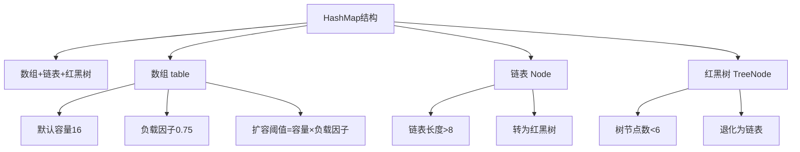
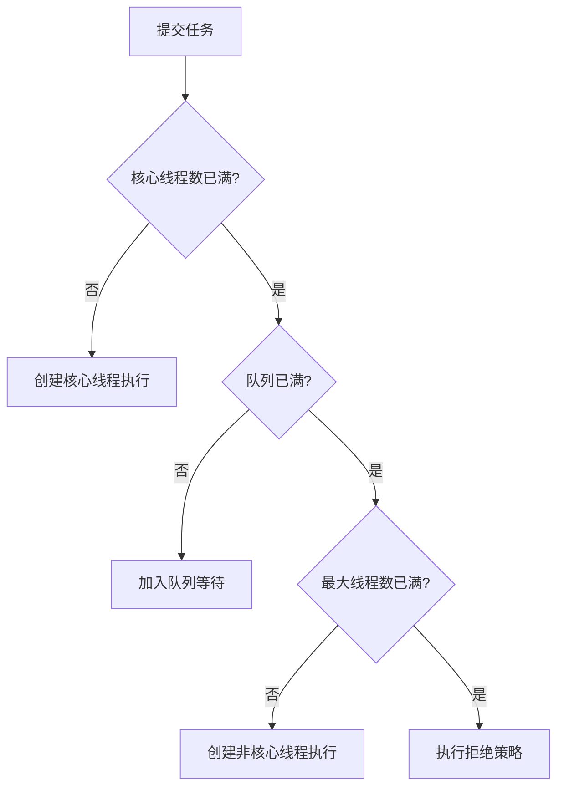

# Java中级面试题 - Java基础与并发编程

> **难度等级**：⭐⭐⭐ | **出现频率**：95% | **建议掌握时间**：2周

## 📚 本章目录

- [一、集合框架](#一集合框架)
- [二、多线程与并发](#二多线程与并发)
- [三、JVM基础](#三jvm基础)
- [四、Java新特性](#四java新特性)

---

## 一、集合框架

### Q1: HashMap的底层实现原理？

**参考答案**：



**核心要点**：
- **JDK 1.8**：数组 + 链表 + 红黑树
- **数组初始容量**：16，负载因子0.75
- **链表转红黑树**：链表长度 ≥ 8 且数组长度 ≥ 64
- **红黑树退化为链表**：节点数 ≤ 6
- **扩容时机**：size > capacity * loadFactor
- **扩容机制**：容量翻倍，重新计算所有元素的位置

### Q2: ConcurrentHashMap的实现原理（JDK 1.8）？

**参考答案**：

| 特性 | JDK 1.7 | JDK 1.8 |
|-----|---------|---------|
| **底层结构** | Segment数组 + HashEntry数组 + 链表 | Node数组 + 链表 + 红黑树 |
| **锁粒度** | Segment（多个HashEntry） | 单个Node（头节点） |
| **并发度** | 默认16 | 理论上数组长度 |
| **查询操作** | 需要加锁（ReentrantLock） | 无锁（volatile + CAS） |

**JDK 1.8 核心优化**：
- **CAS + synchronized**替代ReentrantLock
- **头节点锁**：只锁链表/红黑树的头节点
- **无锁读**：Node的val和next都用volatile修饰

---

## 二、多线程与并发

### Q3: 线程池的核心参数及工作原理？

**参考答案**：

```java
ThreadPoolExecutor executor = new ThreadPoolExecutor(
    5,                      // corePoolSize: 核心线程数
    10,                     // maximumPoolSize: 最大线程数
    60L, TimeUnit.SECONDS,  // keepAliveTime: 非核心线程空闲存活时间
    new ArrayBlockingQueue<>(100),  // workQueue: 任务队列
    new ThreadFactory() { ... },     // threadFactory: 线程工厂
    new ThreadPoolExecutor.CallerRunsPolicy()  // handler: 拒绝策略
);
```

**工作流程**：



**拒绝策略**：
- `AbortPolicy`（默认）：抛异常
- `CallerRunsPolicy`：调用者执行
- `DiscardPolicy`：直接丢弃
- `DiscardOldestPolicy`：丢弃队列最老的任务

### Q4: synchronized和ReentrantLock的区别？

**参考答案**：

| 特性 | synchronized | ReentrantLock |
|-----|--------------|---------------|
| **锁类型** | 悲观锁、隐式锁 | 悲观锁、显式锁 |
| **使用方式** | 关键字 | API调用 |
| **公平性** | 非公平锁 | 可选公平/非公平 |
| **条件变量** | wait/notify | Condition支持多个条件 |
| **可中断** | 不可中断 | lockInterruptibly()可中断 |
| **锁超时** | 不支持 | tryLock()支持 |

### Q5: ThreadLocal的原理和内存泄漏问题？

**参考答案**：

**原理**：
```java
public class ThreadLocal<T> {
    // 每个Thread维护一个ThreadLocalMap
    // key: ThreadLocal对象（弱引用）
    // value: 线程的变量副本
}
```

**内存泄漏原因**：
1. **ThreadLocalMap的key是弱引用**：GC时会被回收
2. **value是强引用**：如果不手动remove()，会导致内存泄漏
3. **线程池场景**：线程复用，value一直存在

**解决方案**：
```java
try {
    threadLocal.set(value);
    // 使用
} finally {
    threadLocal.remove();  // 必须手动清理
}
```

---

## 三、JVM基础

### Q6: JVM内存结构包含哪些部分？

**参考答案**：

```
┌─────────────────────────────────────┐
│           JVM内存结构                │
├─────────────────────────────────────┤
│  程序计数器（Program Counter）        │  线程私有
│  虚拟机栈（VM Stack）                │  线程私有
│  本地方法栈（Native Method Stack）   │  线程私有
│  堆（Heap）                         │  线程共享
│  方法区（Method Area）              │  线程共享
└─────────────────────────────────────┘
```

### Q7: 垃圾回收算法有哪些？

**参考答案**：

1. **标记-清除**：标记后清除，产生碎片
2. **标记-整理**：标记后整理，无碎片
3. **复制算法**：复制到另一块，无碎片，浪费空间
4. **分代收集**：新生代（复制），老年代（标记-清除/整理）

**垃圾回收器对比**：

| 收集器 | 类型 | 侧重点 |
|-------|------|--------|
| **Serial** | 串行 | 单CPU，新生代 |
| **Parallel** | 并行 | 吞吐量优先 |
| **CMS** | 并发 | 低停顿，老年代 |
| **G1** | 并发 | 可预测停顿 |
| **ZGC** | 并发 | 极低停顿（<10ms） |

---

## 四、Java新特性

### Q8: Java 21虚拟线程是什么？

**参考答案**：

```java
// 传统线程池模型
ExecutorService executor = Executors.newFixedThreadPool(200);
// 问题：线程数量受限，上下文切换开销大

// 虚拟线程（Java 21）
ExecutorService executor = Executors.newVirtualThreadPerTaskExecutor();
// 优势：轻量级，百万级并发，几乎无上下文切换开销
```

**核心特点**：
- **轻量级**：虚拟线程占用的内存极小（几KB）
- **数量无限**：可创建百万级虚拟线程
- **调度机制**：由JVM调度，而非OS
- **阻塞成本**：阻塞时自动释放物理线程

### Q9: Record类的使用场景？

**参考答案**：

```java
// 传统写法
class Point {
    private final int x;
    private final int y;
    // 构造器、getter、equals、hashCode、toString...
}

// Record写法（Java 14+）
record Point(int x, int y) {}
```

**特点**：
- 不可变数据载体
- 自动生成构造器、getter、equals、hashCode、toString
- 可实现接口，但不能继承其他类

---

## 📚 延伸阅读

- [高级面试题：微服务架构 →](../advanced/microservices)
- [高级面试题：分布式系统 →](../advanced/distributed-system)
- [实战项目面试题 →](../advanced/project-interview)

---

**更新时间**：2026年2月 | **版本**：v2.0
