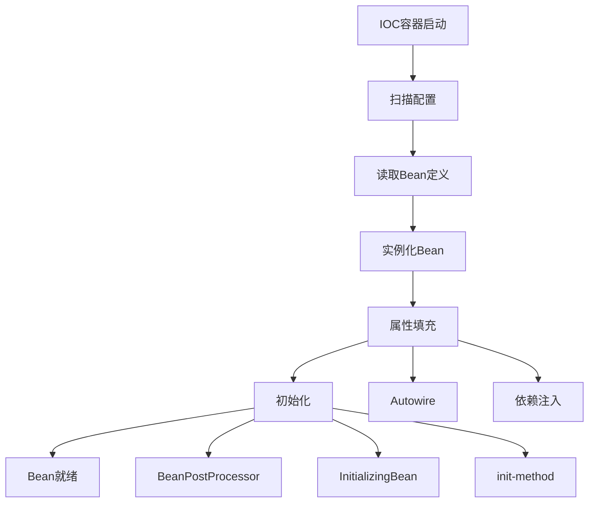
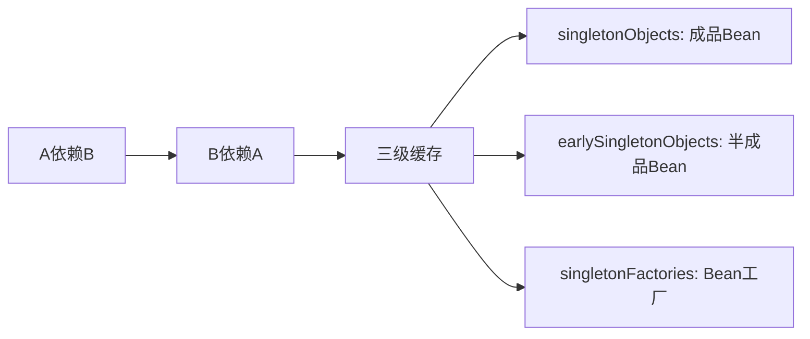

# Java中级面试题 - Spring框架

> **难度等级**：⭐⭐⭐ | **出现频率**：98% | **建议掌握时间**：2周

## 📚 本章目录

- [一、Spring IOC](#一spring-ioc)
- [二、Spring AOP](#二spring-aop)
- [三、Spring事务](#三spring事务)
- [四、Spring Boot](#四spring-boot)

---

## 一、Spring IOC

### Q10: Spring IOC的原理和实现机制？

**参考答案**：



**核心接口**：
- `BeanFactory`：基础容器，延迟加载
- `ApplicationContext`：扩展容器，立即加载
- `BeanDefinition`：Bean定义信息
- `BeanPostProcessor`：Bean后置处理器

### Q11: Spring如何解决循环依赖？

**参考答案**：



**三级缓存机制**：
1. **一级缓存**：`singletonObjects`，存放完全初始化的Bean
2. **二级缓存**：`earlySingletonObjects`，存放提前暴露的Bean
3. **三级缓存**：`singletonFactories`，存放Bean工厂

**构造器循环依赖无法解决**：抛出BeanCurrentlyInCreationException

---

## 二、Spring AOP

### Q12: Spring AOP的实现原理？

**参考答案**：

**两种实现方式**：

| 方式 | 适用场景 | 实现原理 |
|-----|---------|---------|
| **JDK动态代理** | 目标类实现了接口 | 反射+Proxy |
| **CGLIB代理** | 目标类未实现接口 | 字节码生成+继承 |

**JDK动态代理示例**：
```java
// JDK动态代理
MyInterface proxy = (MyInterface) Proxy.newProxyInstance(
    target.getClass().getClassLoader(),
    target.getClass().getInterfaces(),
    new InvocationHandler() {
        @Override
        public Object invoke(Object proxy, Method method, Object[] args) {
            // 前置通知
            Object result = method.invoke(target, args);
            // 后置通知
            return result;
        }
    }
);
```

---

## 三、Spring事务

### Q13: @Transactional失效的场景？

**参考答案**：

1. **方法非public**：@Transactional只对public方法有效
2. **同类调用**：`this.methodB()`绕过了代理
3. **异常处理不当**：try-catch吞掉异常
4. **事务传播机制错误**：如REQUIRES_NEW嵌套
5. **数据库引擎不支持**：如MySQL的MyISAM

**解决方案**：
```java
// 问题代码
@Service
public class OrderService {
    public void methodA() {
        this.methodB();  // ❌ @Transactional失效
    }

    @Transactional
    public void methodB() { }
}

// 解决方案：注入自己
@Service
public class OrderService {
    @Autowired
    private OrderService self;

    public void methodA() {
        self.methodB();  // ✅
    }
}
```

---

## 四、Spring Boot

### Q14: Spring Boot自动装配原理？

**参考答案**：

```mermaid
graph TD
    A[@SpringBootApplication] --> B[@EnableAutoConfiguration]
    B --> C[AutoConfigurationImportSelector]
    C --> D[读取META-INF/spring.factories]
    D --> E[加载自动配置类]
    E --> F[@Conditional注解判断]
    F --> G[注册Bean]
```

**核心步骤**：
1. **@SpringBootApplication**：复合注解
2. **@EnableAutoConfiguration**：开启自动配置
3. **AutoConfigurationImportSelector**：导入配置类
4. **spring.factories**：配置类清单
5. **@Conditional**：条件注解决定是否生效

### Q15: Spring Boot启动流程？

**参考答案**：

```java
SpringApplication.run(Application.class, args)

1. 创建SpringApplication
   - 推断Web应用类型（SERVLET/REACTIVE/NONE）
   - 加载ApplicationContextInitializer
   - 加载ApplicationListener

2. 运行run方法
   - 准备Environment（加载配置文件）
   - 打印Banner
   - 创建ApplicationContext
   - 刷新上下文（refresh）
   - 调用runners（ApplicationRunner/CommandLineRunner）
```

---

## 📚 延伸阅读

- [中级面试题：数据库与Redis →](./database-redis)
- [高级面试题：微服务架构 →](../advanced/microservices)
- [实战项目面试题 →](../advanced/project-interview)

---

**更新时间**：2026年2月 | **版本**：v2.0
