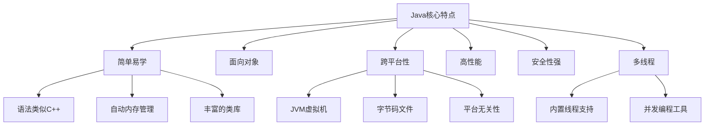

# Java简介与环境搭建

> **学习目标**：了解Java语言特性，掌握开发环境搭建
> **核心内容**：Java发展历史、JDK安装、IDE配置、第一个Java程序
> **预计时间**：2小时

## 什么是Java？

Java是一门**面向对象**的编程语言，由Sun公司（现Oracle）于1995年发布。Java的核心理念是"一次编写，到处运行"（Write Once, Run Anywhere），这意味着Java程序可以在任何支持Java的平台上运行，无需重新编译。

### Java的主要特点



### Java的应用领域

Java在各个领域都有广泛应用：

1. **企业级应用**：银行系统、电商平台、企业ERP
2. **Android开发**：Android应用主要使用Java语言
3. **大数据处理**：Hadoop、Spark等大数据框架基于Java
4. **Web开发**：后端服务、RESTful API
5. **嵌入式系统**：智能卡、物联网设备
6. **科学计算**：数值计算、数据分析

## Java版本历史

Java从1995年发布至今，经历了多个重要版本的演进：

```
Java发展时间线：

1995 - Java 1.0     诞生
1998 - Java 1.2     改名为Java 2
2004 - Java 5.0     引入泛型、枚举、注解
2011 - Java 7       Try-with-resources
2014 - Java 8       Lambda表达式、Stream API（里程碑版本）
2017 - Java 9       模块化系统
2018 - Java 11      LTS版本
2021 - Java 17      LTS版本（Record模式匹配、Sealed类）
2023 - Java 21      LTS版本（虚拟线程、模式匹配增强）
```

### 当前主要版本

- **Java 17 LTS**：长期支持版本，稳定可靠
- **Java 21 LTS**：最新LTS版本，包含虚拟线程等革命性特性
- **推荐**：新项目建议使用Java 21，企业项目可使用Java 17

## 环境搭建详解

### 第一步：安装JDK（Java Development Kit）

JDK是Java开发工具包，包含：
- **JRE**（Java Runtime Environment）：Java运行环境
- **JVM**（Java Virtual Machine）：Java虚拟机
- **开发工具**：javac编译器、javadoc文档生成器等

#### 下载JDK

**推荐选择**：

1. **Oracle JDK**：官方版本，需要商业许可
   - 下载地址：https://www.oracle.com/java/technologies/downloads/

2. **OpenJDK**：开源版本，免费使用
   - 下载地址：https://adoptium.net/（推荐）
   - 或使用Amazon Corretto、Azul Zulu等发行版

#### 安装步骤

**Windows系统**：

```bash
1. 下载安装包（选择JDK 21 LTS版本）
2. 运行安装程序，按提示完成安装
3. 记住安装路径，例如：C:\Program Files\Java\jdk-21

4. 配置环境变量
# 右键"此电脑" → 属性 → 高级系统设置 → 环境变量

# 新建系统变量 JAVA_HOME
变量名：JAVA_HOME
变量值：C:\Program Files\Java\jdk-21

# 编辑系统变量 Path，添加：
%JAVA_HOME%\bin
```

**macOS系统**：

```bash
# 使用Homebrew安装（推荐）
brew install openjdk@21

# 配置环境变量，编辑 ~/.zshrc 或 ~/.bash_profile
echo 'export JAVA_HOME=$(/usr/libexec/java_home -v 21)' >> ~/.zshrc
echo 'export PATH="$JAVA_HOME/bin:$PATH"' >> ~/.zshrc
source ~/.zshrc
```

**Linux系统**：

```bash
# Ubuntu/Debian
sudo apt update
sudo apt install openjdk-21-jdk

# CentOS/RHEL
sudo yum install java-21-openjdk-devel

# 验证安装
java -version
javac -version
```

### 第二步：验证安装

打开命令行（终端），执行以下命令：

```bash
# 检查Java版本
java -version
# 输出示例：
# java version "21.0.1" 2023-10-17 LTS
# Java(TM) SE Runtime Environment (build 21.0.1+12-LTS-29)
# Java HotSpot(TM) 64-Bit Server VM (build 21.0.1+12-LTS-29, mixed mode)

# 检查编译器版本
javac -version
# 输出示例：
# javac 21.0.1

# 查看JAVA_HOME环境变量
echo $JAVA_HOME  # macOS/Linux
echo %JAVA_HOME% # Windows
```

如果都显示了正确的版本信息，说明安装成功！

### 第三步：安装IDE（集成开发环境）

虽然可以使用文本编辑器编写Java代码，但IDE能极大提高开发效率。

#### 推荐IDE

**1. IntelliJ IDEA（强烈推荐）**

```text
优点：
✅ 智能代码补全
✅ 强大的重构功能
✅ 内置版本控制
✅ 优秀的Maven/Gradle支持
✅ 数据库工具
✅ 插件生态丰富

版本：
- Community（免费）：功能完全够用
- Ultimate（收费）：额外支持Web、企业级框架

下载地址：https://www.jetbrains.com/idea/
```

**2. Eclipse**

```text
优点：
✅ 完全免费开源
✅ 插件丰富
✅ 老牌IDE，资料多

缺点：
❌ 界面相对老旧
❌ 性能不如IntelliJ IDEA

下载地址：https://www.eclipse.org/downloads/
```

**3. VS Code（轻量级选择）**

```text
优点：
✅ 轻量快速
✅ 丰富的扩展插件
✅ 现代化界面

缺点：
❌ 需要安装多个插件才能达到IDE功能
❌ 大型项目管理能力较弱

适合：简单项目或作为辅助编辑器
```

#### IntelliJ IDEA安装与配置


**详细配置步骤**：

1. **下载并安装**：选择Community版本（免费）
2. **首次启动**：选择界面主题（推荐Darcula深色主题）
3. **配置JDK**：
   - File → Project Structure → Project Settings → Project
   - SDKs → + → Add JDK → 选择JDK安装路径
4. **配置Maven**（后续章节会用到）：
   - File → Settings → Build, Execution, Deployment → Build Tools → Maven
   - 设置Maven home directory

## 第一个Java程序

### 创建Hello World程序

**目录结构**：

```
HelloWorld/
├── src/
│   └── com/
│       └── example/
│           └── HelloWorld.java
└── out/                    # 编译后的字节码文件
```

**代码实现**：

```java
/**
 * 我的第一个Java程序
 */
public class HelloWorld {

    // 程序入口：main方法
    public static void main(String[] args) {
        // 向控制台输出信息
        System.out.println("Hello, World!");
        System.out.println("欢迎来到Java世界！");

        // 使用Java 21的字符串模板（预览功能）
        String name = "小徐";
        int age = 25;
        System.out.println("我叫" + name + "，今年" + age + "岁");
    }
}
```

### 代码详解

让我逐行解释这个程序：

```java
// 1. 类声明
public class HelloWorld {
    // public：访问修饰符，表示这个类可以被任何地方访问
    // class：定义类的关键字
    // HelloWorld：类名，必须与文件名相同（包括大小写）
}

// 2. main方法
public static void main(String[] args) {
    // public：可以被任何地方调用
    // static：静态方法，不需要创建对象就能调用
    // void：没有返回值
    // main：方法名，JVM会从这里开始执行程序
    // String[] args：命令行参数数组
}

// 3. 输出语句
System.out.println("Hello, World!");
// System：java.lang包中的类
// out：System类的静态成员变量
// println()：输出并换行的方法
```

### 编译和运行

**方法一：使用命令行**

```bash
1. 编译Java源文件
javac HelloWorld.java

# 编译成功后会生成：HelloWorld.class（字节码文件）

2. 运行程序
java HelloWorld

# 输出：
# Hello, World!
# 欢迎来到Java世界！

# 注意：
# - javac命令需要加.java扩展名
# - java命令不需要加.class扩展名
# - 类名区分大小写
```

**方法二：使用IntelliJ IDEA**

1. 创建新项目：File → New → Project
2. 选择Java项目，选择JDK版本
3. 创建Java类：右键src目录 → New → Java Class
4. 输入代码后，点击右键选择"Run 'HelloWorld.main()'"

**方法三：使用Java 11+ 单文件运行**

```bash
# Java 11+ 可以直接运行单文件Java程序，无需先编译
java HelloWorld.java

# 这个命令会自动编译并运行，适合快速测试
```

## Java程序运行原理

理解Java程序的运行过程非常重要：

```
┌─────────────────────────────────────────────────────────┐
│                  Java程序执行流程                        │
└─────────────────────────────────────────────────────────┘

1. 编写源代码 (.java文件)
   ↓
   HelloWorld.java（纯文本文件）

2. 编译 (javac命令)
   ↓
   HelloWorld.class（字节码文件，平台无关）

3. 类加载 (ClassLoader)
   ↓
   JVM加载字节码文件到内存

4. 字节码验证
   ↓
   检查字节码安全性

5. 解释执行或JIT编译
   ↓
   转换为机器码执行

6. 输出结果
```

### JVM、JRE、JDK的关系

```
┌─────────────────────────────────────────────────┐
│                    JDK                          │
│  (Java Development Kit - 开发工具包)             │
│  ┌─────────────────────────────────────────┐   │
│  │              JRE                         │   │
│  │   (Java Runtime Environment - 运行环境)   │   │
│  │   ┌──────────────────────────────────┐  │   │
│  │   │           JVM                    │  │   │
│  │   │   (Java Virtual Machine)         │  │   │
│  │   │   - 类加载器                      │  │   │
│  │   │   - 字节码验证器                  │  │   │
│  │   │   - JIT编译器                     │  │   │
│  │   │   - 垃圾回收器                    │  │   │
│  │   │   - 解释器                        │  │   │
│  │   └──────────────────────────────────┘  │   │
│  │                                          │   │
│  │   - Java核心类库                          │   │
│  │   - 其他运行时文件                        │   │
│  └─────────────────────────────────────────┘   │
│                                                  │
│  - javac编译器                                   │
│  - javadoc文档生成器                             │
│  - jdb调试器                                     │
│  - jar打包工具                                   │
│  - 其他开发工具                                  │
└─────────────────────────────────────────────────┘

开发者需要：JDK
运行程序需要：JRE
执行字节码：JVM
```

## Java 21 新特性预览

既然我们安装了Java 21，让我提前展示一些激动人心的新特性（后续章节会详细讲解）：

### 1. 虚拟线程（Virtual Threads）

```java
// Java 21的革命性特性：虚拟线程
// 轻松创建百万级并发线程

public class VirtualThreadDemo {
    public static void main(String[] args) {
        // 创建并启动虚拟线程
        Thread vt = Thread.startVirtualThread(() -> {
            System.out.println("虚拟线程运行中...");
        });

        // 批量创建虚拟线程
        try (var executor = Executors.newVirtualThreadPerTaskExecutor()) {
            for (int i = 0; i < 100_000; i++) {
                executor.submit(() -> {
                    // 处理任务
                });
            }
        }
    }
}
```

### 2. Record类（不可变数据载体）

```java
// 传统方式：需要大量样板代码
class Person {
    private final String name;
    private final int age;

    public Person(String name, int age) {
        this.name = name;
        this.age = age;
    }

    public String getName() { return name; }
    public int getAge() { return age; }
    // equals、hashCode、toString...
}

// 使用Record：一行代码搞定
record Person(String name, int age) {}

// 使用
Person p = new Person("小徐", 25);
System.out.println(p.name());  // 访问器方法
System.out.println(p.age());
```

### 3. 模式匹配增强

```java
// Switch的模式匹配
String formattedValue = switch (value) {
    case Integer i -> String.format("int %d", i);
    case Long l    -> String.format("long %d", l);
    case Double d  -> String.format("double %f", d);
    case String s  -> String.format("String %s", s);
    default        -> value.toString();
};
```

## 开发工具推荐

除了IDE，还有一些必备工具：

### 1. Maven/Gradle（构建工具）

```bash
# Maven安装验证
mvn -version

# Gradle安装验证
gradle -version
```

### 2. Git（版本控制）

```bash
# Git安装验证
git --version
```

### 3. Postman（API测试工具）

用于测试RESTful API接口

### 4. Navicat/DBeaver（数据库管理工具）

用于数据库可视化管理

## 常见问题与解决方案

### 问题1：命令行提示"java不是内部或外部命令"

**原因**：环境变量配置不正确

**解决方案**：

```bash
# Windows
1. 检查JAVA_HOME是否正确设置
echo %JAVA_HOME%

2. 检查Path是否包含 %JAVA_HOME%\bin
echo %Path%

3. 如果配置正确，重启命令行窗口
```

### 问题2：javac编译成功，但java运行失败

```bash
# 错误：找不到或无法加载主类
# 原因：可能是在文件名上加了.class扩展名

# 正确：
java HelloWorld

# 错误：
java HelloWorld.class
```

### 问题3：中文乱码问题

```bash
# 编译时指定编码
javac -encoding UTF-8 HelloWorld.java

# 或在IDE中设置文件编码为UTF-8
```

### 问题4：macOS安装多个Java版本

```bash
# 查看已安装的Java版本
/usr/libexec/java_home -V

# 切换默认Java版本
export JAVA_HOME=$(/usr/libexec/java_home -v 21)
```

## 最佳实践

### 1. 命名规范

```java
// 类名：大驼峰（每个单词首字母大写）
public class UserController {}

// 方法名和变量名：小驼峰（第一个单词首字母小写）
String userName = "小徐";
public void getUserName() {}

// 常量：全大写，单词间用下划线分隔
public static final int MAX_SIZE = 100;

// 包名：全小写，用点分隔
package com.example.demo;
```

### 2. 代码注释

```java
/**
 * 类注释：描述类的功能
 * @author 小徐
 * @version 1.0
 */
public class CommentDemo {

    /**
     * 方法注释：描述方法的功能
     * @param name 用户名
     * @return 问候语
     */
    public String sayHello(String name) {
        // 单行注释：解释代码逻辑
        /* 多行注释：
           可以写多行说明
         */
        return "Hello, " + name;
    }
}
```

### 3. 代码格式化

- 使用IDE的自动格式化功能（IntelliJ IDEA: Ctrl+Alt+L）
- 保持一致的缩进（推荐4个空格）
- 每行代码不超过120个字符

## 练习题

### 基础练习

1. **环境配置**：成功安装JDK 21和IntelliJ IDEA
2. **Hello World**：编写并运行Hello World程序
3. **信息输出**：输出你的个人信息（姓名、年龄、爱好）

### 进阶练习

4. **计算器程序**：实现两个数的加减乘除

```java
public class Calculator {
    public static void main(String[] args) {
        int a = 10;
        int b = 5;

        // 请实现加减乘除运算并输出结果
        System.out.println("加法：" + (a + b));
        // ...
    }
}
```

5. **温度转换**：摄氏度转华氏度

```java
public class TemperatureConverter {
    public static void main(String[] args) {
        double celsius = 25.5;
        // 公式：华氏度 = 摄氏度 * 9/5 + 32
        // 请实现转换并输出结果
    }
}
```

### 挑战练习

6. **利用Record类**：创建一个Student记录类，包含姓名、年龄、成绩属性，并创建实例输出信息

```java
// 提示：使用Java 21的Record特性
public record Student(String name, int age, double score) {}

public class TestStudent {
    public static void main(String[] args) {
        // 创建Student对象并输出
    }
}
```

## 本章小结

### 知识点回顾

✅ **Java的特点**：面向对象、跨平台、简单安全
✅ **Java版本**：推荐使用Java 17或21 LTS版本
✅ **环境搭建**：JDK安装、环境变量配置、IDE选择
✅ **程序结构**：类、main方法、输出语句
✅ **运行原理**：源代码→字节码→JVM执行

### 学习成果

完成本章学习后，你应该能够：
- 理解Java的历史和应用领域
- 独立搭建Java开发环境
- 编写并运行简单的Java程序
- 了解JVM、JRE、JDK的关系

### 下一步

恭喜你完成了环境搭建！下一章我们将学习Java的基础语法，包括变量、数据类型、运算符、流程控制等核心概念。

**准备好了吗？让我们继续Java之旅！** 🚀

---

**学习时间**：约2小时
**难度等级**：★☆☆☆☆
**下一章**：[Java基础语法](./chapter-115.md)
