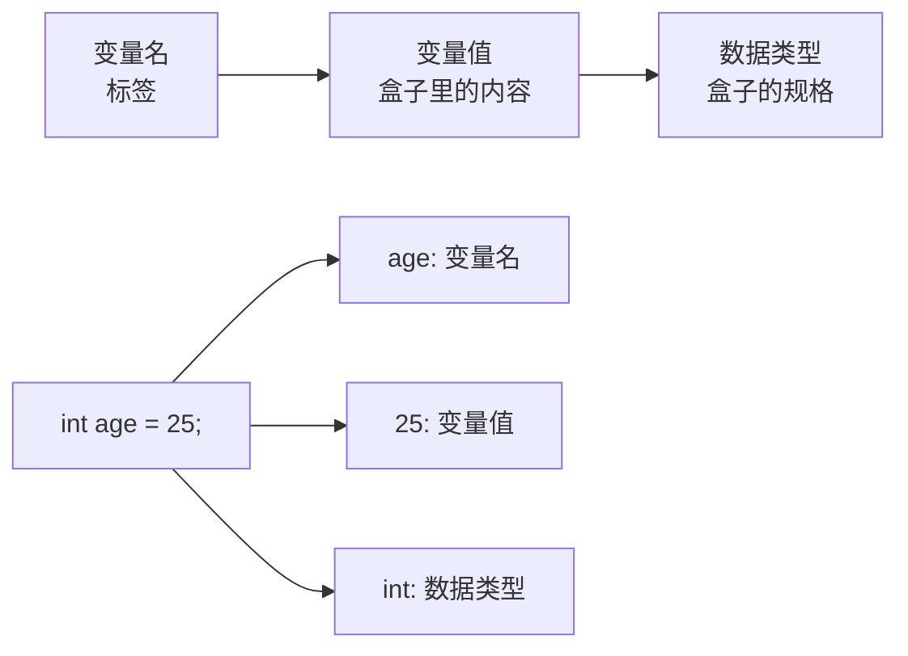

# Java基础语法

> **学习目标**：掌握Java基本语法规则
> **核心内容**：变量、数据类型、运算符、流程控制、数组
> **预计时间**：4小时

## 变量与数据类型

### 什么是变量？

变量是程序中用于存储数据的"容器"。想象一下，变量就像一个贴了标签的盒子，你可以在里面放入数据，也可以随时取出或修改数据。



### 变量的声明与使用

```java
/**
 * 变量声明语法
 * 数据类型 变量名 = 初始值;
 */
public class VariableDemo {
    public static void main(String[] args) {
        // 方式1：声明时初始化
        int age = 25;
        String name = "小徐";
        double salary = 8888.88;

        // 方式2：先声明，后赋值
        int score;
        score = 95;

        // 方式3：同时声明多个变量
        int x = 10, y = 20, z = 30;

        // 变量使用
        System.out.println("姓名：" + name);
        System.out.println("年龄：" + age);
        System.out.println("工资：" + salary);

        // 变量可以重新赋值
        age = 26;
        System.out.println("明年年龄：" + age);
    }
}
```

### Java数据类型详解

Java是强类型语言，每个变量都必须声明类型。Java数据类型分为两大类：

```
Java数据类型体系
│
├─ 基本数据类型（8种）
│  ├─ 整数类型
│  │  ├─ byte     1字节    -128到127
│  │  ├─ short    2字节    -32768到32767
│  │  ├─ int      4字节    -21亿到21亿（默认）
│  │  └─ long     8字节    很大的整数
│  ├─ 浮点类型
│  │  ├─ float    4字节    单精度
│  │  └─ double   8字节    双精度（默认）
│  ├─ 字符类型
│  │  └─ char     2字节    单个字符
│  └─ 布尔类型
│     └─ boolean  1位      true/false
│
└─ 引用数据类型
   ├─ 类（String、自定义类等）
   ├─ 接口
   ├─ 数组
   └─ 枚举
```

#### 基本数据类型示例

```java
public class PrimitiveTypesDemo {
    public static void main(String[] args) {
        // ========== 整数类型 ==========

        // byte：节省内存空间
        byte byteVar = 100;
        System.out.println("byte: " + byteVar);

        // short：较少使用
        short shortVar = 10000;
        System.out.println("short: " + shortVar);

        // int：最常用的整数类型（默认）
        int intVar = 2100000000;
        int hexVar = 0xFF;       // 十六进制（255）
        int binaryVar = 0b1010;  // 二进制（10）
        int octalVar = 075;      // 八进制（61，不推荐）
        System.out.println("int: " + intVar);
        System.out.println("十六进制: " + hexVar);
        System.out.println("二进制: " + binaryVar);

        // long：大整数，需要加L或l后缀
        long longVar = 9223372036854775807L;
        System.out.println("long: " + longVar);

        // 数字分隔符（Java 7+）：提高可读性
        int million = 1_000_000;
        long creditCard = 1234_5678_9012_3456L;
        System.out.println("一百万: " + million);

        // ========== 浮点类型 ==========

        // float：单精度，需要加F或f后缀
        float floatVar = 3.14f;
        float floatVar2 = 3.141592653589793f;  // 精度损失
        System.out.println("float: " + floatVar2);

        // double：双精度（默认）
        double doubleVar = 3.141592653589793;
        double doubleVar2 = 3.14;  // 自动识别为double
        System.out.println("double: " + doubleVar);

        // 科学计数法
        double scientific = 1.23e10;  // 1.23 × 10^10
        System.out.println("科学计数法: " + scientific);

        // ========== 字符类型 ==========

        // char：单个字符，使用单引号
        char charVar = 'A';
        char unicodeChar = '\u0041';  // Unicode编码，也是'A'
        char escapeChar = '\n';       // 转义字符（换行）
        System.out.println("char: " + charVar);
        System.out.println("Unicode: " + unicodeChar);

        // 常用转义字符
        System.out.println("换行\n制表\t\t单引号\'双引号\"反斜杠\\");

        // ========== 布尔类型 ==========

        // boolean：只有两个值
        boolean isTrue = true;
        boolean isFalse = false;
        boolean isActive = (5 > 3);
        System.out.println("布尔值: " + isActive);

        // ========== 类型转换示例 ==========

        // 自动类型提升（小→大）
        int i = 100;
        long l = i;      // int自动转为long
        double d = i;    // int自动转为double
        System.out.println("类型提升: " + d);

        // 强制类型转换（大→小，可能丢失精度）
        double pi = 3.94;
        int truncated = (int) pi;  // 强制转换，小数部分丢失
        System.out.println("强制转换: " + truncated);  // 输出3

        // 注意：强制转换可能导致溢出
        int bigNumber = 300;
        byte smallNumber = (byte) bigNumber;  // 44（溢出）
        System.out.println("溢出: " + smallNumber);
    }
}
```

#### 引用数据类型示例

```java
public class ReferenceTypesDemo {
    public static void main(String[] args) {
        // String：字符串类型（最常用的引用类型）
        String name = "小徐";
        String greeting = "Hello, " + name;  // 字符串拼接
        System.out.println(greeting);

        // 字符串常用方法
        String text = "Hello World";
        System.out.println("长度: " + text.length());        // 11
        System.out.println("大写: " + text.toUpperCase());   // HELLO WORLD
        System.out.println("小写: " + text.toLowerCase());   // hello world
        System.out.println("包含: " + text.contains("lo"));  // true
        System.out.println("替换: " + text.replace("World", "Java"));

        // 字符串不可变性
        String s1 = "Hello";
        String s2 = s1;
        s1 = s1 + " World";  // 创建新对象，s2不变
        System.out.println("s1: " + s1);  // Hello World
        System.out.println("s2: " + s2);  // Hello

        // 数组（后续章节详细讲解）
        int[] numbers = {1, 2, 3, 4, 5};
        System.out.println("数组第一个元素: " + numbers[0]);

        // 使用Java 21的Record（预览特性）
        record Point(int x, int y) {}
        Point p = new Point(10, 20);
        System.out.println("Point: " + p);
    }
}
```

### 变量命名规范

```java
/**
 * 变量命名规则
 */
public class NamingRules {
    public static void main(String[] args) {
        // ✅ 正确的命名
        String userName = "xiaoxu";      // 小驼峰
        int MAX_SIZE = 100;               // 常量：全大写+下划线
        boolean isVip = true;             // 布尔值：以is开头
        char _separator = '_';            // 下划线开头（不推荐但合法）

        // ❌ 错误的命名
        // int 2number = 10;              // 不能以数字开头
        // int class = 10;                // 不能使用关键字
        // int user-name = 10;            // 不能包含连字符
        // String 用户名 = "xiaoxu";      // 可以用中文但不推荐

        // 命名建议：见名知意
        int age = 25;                    // ✅ 清晰
        int a = 25;                      // ❌ 不清晰

        // 布尔变量命名
        boolean isValid = true;          // ✅ 推荐
        boolean valid = true;            // ⚠️ 可接受
        boolean flag = true;             // ❌ 不推荐（不清晰）

        // 集合变量命名：复数形式
        int[] scores = {90, 85, 95};     // ✅
        String[] names = {"A", "B"};     // ✅
    }
}
```

## 运算符

### 算术运算符

```java
public class ArithmeticOperators {
    public static void main(String[] args) {
        int a = 10, b = 3;

        // 基本运算
        System.out.println("加法: " + (a + b));      // 13
        System.out.println("减法: " + (a - b));      // 7
        System.out.println("乘法: " + (a * b));      // 30
        System.out.println("除法: " + (a / b));      // 3（整数除法）
        System.out.println("取模: " + (a % b));      // 1（余数）

        // 浮点数除法
        System.out.println("精确除法: " + (a / (double)b));  // 3.333...

        // 自增自减
        int x = 5;
        System.out.println("x++: " + x++);  // 5（先使用后自增）
        System.out.println("x: " + x);       // 6
        System.out.println("++x: " + ++x);  // 7（先自增后使用）

        // 应用示例：秒转时分秒
        int totalSeconds = 3665;
        int hours = totalSeconds / 3600;
        int minutes = (totalSeconds % 3600) / 60;
        int seconds = totalSeconds % 60;
        System.out.printf("%d秒 = %d小时%d分%d秒%n",
            totalSeconds, hours, minutes, seconds);
    }
}
```

### 关系运算符

```java
public class RelationalOperators {
    public static void main(String[] args) {
        int a = 10, b = 20;

        // 比较运算（返回boolean类型）
        System.out.println("a == b: " + (a == b));  // false
        System.out.println("a != b: " + (a != b));  // true
        System.out.println("a > b: " + (a > b));    // false
        System.out.println("a < b: " + (a < b));    // true
        System.out.println("a >= b: " + (a >= b));  // false
        System.out.println("a <= b: " + (a <= b));  // true

        // 字符串比较（使用equals方法）
        String s1 = "Hello";
        String s2 = "Hello";
        String s3 = new String("Hello");

        System.out.println("s1 == s2: " + (s1 == s2));      // true（字符串常量池）
        System.out.println("s1 == s3: " + (s1 == s3));      // false（不同对象）
        System.out.println("s1.equals(s3): " + s1.equals(s3));  // true（内容相同）
    }
}
```

### 逻辑运算符

```java
public class LogicalOperators {
    public static void main(String[] args) {
        boolean a = true, b = false;

        // 逻辑运算
        System.out.println("a && b: " + (a && b));  // false（与）
        System.out.println("a || b: " + (a || b));  // true（或）
        System.out.println("!a: " + (!a));          // false（非）

        // 短路求值
        int x = 5, y = 10;
        boolean result1 = (x > 10) && (y++ > 0);  // 第一个为false，y++不执行
        System.out.println("y: " + y);  // 10（未改变）

        boolean result2 = (x < 10) || (y++ > 0);  // 第一个为true，y++不执行
        System.out.println("y: " + y);  // 10（仍未改变）

        // 实际应用：判断闰年
        int year = 2024;
        boolean isLeap = (year % 4 == 0 && year % 100 != 0) || (year % 400 == 0);
        System.out.println(year + "是闰年吗？ " + isLeap);

        // 年龄范围判断
        int age = 25;
        boolean isValidAge = age >= 18 && age <= 65;
        System.out.println("年龄有效吗？ " + isValidAge);
    }
}
```

### 赋值运算符

```java
public class AssignmentOperators {
    public static void main(String[] args) {
        int a = 10;

        // 复合赋值运算符
        a += 5;   // a = a + 5;  → 15
        a -= 3;   // a = a - 3;  → 12
        a *= 2;   // a = a * 2;  → 24
        a /= 4;   // a = a / 4;  → 6
        a %= 4;   // a = a % 4;  → 2

        System.out.println("a: " + a);

        // 注意：复合赋值运算符会自动类型转换
        byte b = 10;
        // b = b + 5;      // 编译错误！需要强制转换
        b += 5;          // 正确！自动转换
        System.out.println("b: " + b);
    }
}
```

### 三元运算符

```java
public class TernaryOperator {
    public static void main(String[] args) {
        // 语法：条件表达式 ? 值1 : 值2
        int age = 20;

        // 使用if-else
        String type1;
        if (age >= 18) {
            type1 = "成年人";
        } else {
            type1 = "未成年";
        }

        // 使用三元运算符（更简洁）
        String type2 = (age >= 18) ? "成年人" : "未成年";

        System.out.println(type1);  // 成年人
        System.out.println(type2);  // 成年人

        // 嵌套使用（不推荐，可读性差）
        int score = 85;
        String grade = (score >= 90) ? "优秀" :
                      (score >= 80) ? "良好" :
                      (score >= 60) ? "及格" : "不及格";
        System.out.println("等级: " + grade);

        // 实际应用：求最大值
        int a = 10, b = 20;
        int max = (a > b) ? a : b;
        System.out.println("最大值: " + max);
    }
}
```

### 运算符优先级

```java
public class OperatorPrecedence {
    public static void main(String[] args) {
        // 优先级从高到低：
        // 1. () [] .
        // 2. ++ -- ! ~
        // 3. * / %
        // 4. + -
        // 5. << >> >>>
        // 6. < > <= >= instanceof
        // 7. == !=
        // 8. &
        // 9. ^
        // 10. |
        // 11. &&
        // 12. ||
        // 13. ?:
        // 14. = += -= 等

        int result = 1 + 2 * 3;        // 7（先乘后加）
        int result2 = (1 + 2) * 3;     // 9（括号优先）
        System.out.println("result: " + result);
        System.out.println("result2: " + result2);

        boolean b = true || false && false;  // true（&&优先级高于||）
        boolean b2 = (true || false) && false;  // false
        System.out.println("b: " + b);
        System.out.println("b2: " + b2);

        // 建议：不确定优先级时，使用括号明确意图
    }
}
```

## 流程控制

### if-else条件语句

```java
public class IfElseStatement {
    public static void main(String[] args) {
        // 基本if语句
        int score = 85;

        if (score >= 60) {
            System.out.println("及格了！");
        }

        // if-else语句
        if (score >= 60) {
            System.out.println("及格");
        } else {
            System.out.println("不及格");
        }

        // if-else if-else多分支
        if (score >= 90) {
            System.out.println("优秀");
        } else if (score >= 80) {
            System.out.println("良好");
        } else if (score >= 60) {
            System.out.println("及格");
        } else {
            System.out.println("不及格");
        }

        // 实际应用：登录验证
        String username = "admin";
        String password = "123456";

        if (username.equals("admin") && password.equals("123456")) {
            System.out.println("登录成功");
        } else {
            System.out.println("用户名或密码错误");
        }

        // 省略大括号（不推荐，容易出错）
        int x = 10;
        if (x > 0)
            System.out.println("正数");
        else
            System.out.println("非正数");

        // 推荐：始终使用大括号，即使只有一行
        if (x > 0) {
            System.out.println("正数");
        } else {
            System.out.println("非正数");
        }
    }
}
```

### switch多分支语句

```java
public class SwitchStatement {
    public static void main(String[] args) {
        // 传统switch语句
        int dayOfWeek = 3;
        String dayName;

        switch (dayOfWeek) {
            case 1:
                dayName = "星期一";
                break;
            case 2:
                dayName = "星期二";
                break;
            case 3:
                dayName = "星期三";
                break;
            case 4:
                dayName = "星期四";
                break;
            case 5:
                dayName = "星期五";
                break;
            case 6:
                dayName = "星期六";
                break;
            case 7:
                dayName = "星期日";
                break;
            default:
                dayName = "无效的星期";
        }
        System.out.println(dayName);

        // Java 14+ 新语法：箭头语法（更简洁）
        String monthName = switch (2) {
            case 1 -> "一月";
            case 2 -> "二月";
            case 3 -> "三月";
            case 4 -> "四月";
            case 5 -> "五月";
            case 6 -> "六月";
            case 7 -> "七月";
            case 8 -> "八月";
            case 9 -> "九月";
            case 10 -> "十月";
            case 11 -> "十一月";
            case 12 -> "十二月";
            default -> "无效月份";
        };
        System.out.println(monthName);

        // 多个case共享逻辑
        int month = 2;
        int days = switch (month) {
            case 1, 3, 5, 7, 8, 10, 12 -> 31;
            case 4, 6, 9, 11 -> 30;
            case 2 -> 28;  // 不考虑闰年
            default -> 0;
        };
        System.out.println("天数: " + days);

        // switch表达式（Java 14+）
        int score = 85;
        String grade = switch (score / 10) {
            case 10, 9 -> "优秀";
            case 8 -> "良好";
            case 7 -> "中等";
            case 6 -> "及格";
            default -> "不及格";
        };
        System.out.println("等级: " + grade);

        // 使用yield返回值（Java 13+）
        int value = 2;
        String result = switch (value) {
            case 1: {
                yield "one";  // yield类似于return
            }
            case 2: {
                String temp = "two";
                yield temp;
            }
            default: {
                yield "unknown";
            }
        };
        System.out.println(result);

        // 字符串switch
        String role = "admin";
        switch (role) {
            case "admin":
                System.out.println("管理员");
                break;
            case "user":
                System.out.println("普通用户");
                break;
            case "guest":
                System.out.println("访客");
                break;
            default:
                System.out.println("未知角色");
        }
    }
}
```

### for循环

```java
public class ForLoop {
    public static void main(String[] args) {
        // 基本for循环
        for (int i = 1; i <= 5; i++) {
            System.out.println("第" + i + "次循环");
        }

        // 计算1到100的和
        int sum = 0;
        for (int i = 1; i <= 100; i++) {
            sum += i;
        }
        System.out.println("1到100的和: " + sum);

        // 遍历数组
        int[] numbers = {10, 20, 30, 40, 50};
        for (int i = 0; i < numbers.length; i++) {
            System.out.println("numbers[" + i + "] = " + numbers[i]);
        }

        // 增强for循环（for-each）- Java 5+
        System.out.println("使用增强for循环:");
        for (int num : numbers) {
            System.out.println(num);
        }

        // 多个初始化表达式
        for (int i = 0, j = 10; i < j; i++, j--) {
            System.out.printf("i=%d, j=%d%n", i, j);
        }

        // 无限循环（break退出）
        int count = 0;
        for (;;) {
            count++;
            if (count > 5) {
                break;
            }
            System.out.println("循环次数: " + count);
        }

        // 实际应用：九九乘法表
        System.out.println("九九乘法表:");
        for (int i = 1; i <= 9; i++) {
            for (int j = 1; j <= i; j++) {
                System.out.printf("%d×%d=%-2d ", j, i, i * j);
            }
            System.out.println();
        }

        // 实际应用：打印金字塔
        System.out.println("金字塔:");
        int rows = 5;
        for (int i = 1; i <= rows; i++) {
            // 打印空格
            for (int j = 1; j <= rows - i; j++) {
                System.out.print(" ");
            }
            // 打印星号
            for (int k = 1; k <= 2 * i - 1; k++) {
                System.out.print("*");
            }
            System.out.println();
        }
    }
}
```

### while循环

```java
public class WhileLoop {
    public static void main(String[] args) {
        // while循环（先判断后执行）
        int i = 1;
        int sum = 0;

        while (i <= 100) {
            sum += i;
            i++;
        }
        System.out.println("1到100的和: " + sum);

        // do-while循环（先执行后判断，至少执行一次）
        int j = 1;
        do {
            System.out.println("do-while循环: " + j);
            j++;
        } while (j <= 5);

        // 实际应用：猜数字游戏
        java.util.Scanner scanner = new java.util.Scanner(System.in);
        int target = (int) (Math.random() * 100) + 1;  // 1-100随机数
        int guess;
        int attempts = 0;

        System.out.println("猜数字游戏（1-100）");

        do {
            System.out.print("请输入你的猜测: ");
            guess = scanner.nextInt();
            attempts++;

            if (guess < target) {
                System.out.println("太小了！");
            } else if (guess > target) {
                System.out.println("太大了！");
            }
        } while (guess != target);

        System.out.println("恭喜你猜对了！用了" + attempts + "次。");

        // 实际应用：倒计时
        int countdown = 10;
        while (countdown > 0) {
            System.out.println(countdown);
            countdown--;
        }
        System.out.println("发射！");

        scanner.close();
    }
}
```

### break和continue

```java
public class BreakContinue {
    public static void main(String[] args) {
        // break：跳出循环
        System.out.println("break示例:");
        for (int i = 1; i <= 10; i++) {
            if (i == 5) {
                break;  // 跳出循环
            }
            System.out.print(i + " ");
        }
        // 输出: 1 2 3 4

        // continue：跳过本次循环
        System.out.println("\ncontinue示例:");
        for (int i = 1; i <= 10; i++) {
            if (i % 2 == 0) {
                continue;  // 跳过偶数
            }
            System.out.print(i + " ");
        }
        // 输出: 1 3 5 7 9

        // 带标签的break和continue
        System.out.println("\n带标签的break:");
        outer:
        for (int i = 1; i <= 3; i++) {
            for (int j = 1; j <= 3; j++) {
                if (i == 2 && j == 2) {
                    break outer;  // 跳出外层循环
                }
                System.out.println("i=" + i + ", j=" + j);
            }
        }
        // 输出到i=2, j=2就停止了

        // 实际应用：查找第一个符合条件的元素
        int[] numbers = {3, 7, 2, 9, 5};
        int target = 9;
        int index = -1;

        for (int i = 0; i < numbers.length; i++) {
            if (numbers[i] == target) {
                index = i;
                break;  // 找到了，不需要继续
            }
        }
        System.out.println(target + "的索引是: " + index);

        // 实际应用：过滤数组
        int[] scores = {65, 42, 78, 90, 55, 88};
        System.out.println("及格的分数:");
        for (int score : scores) {
            if (score < 60) {
                continue;  // 跳过不及格的
            }
            System.out.println(score);
        }
    }
}
```

## 数组基础

### 数组的声明与初始化

```java
public class ArrayBasics {
    public static void main(String[] args) {
        // 声明数组
        int[] numbers1;           // 推荐方式
        int numbers2[];           // C风格（不推荐）

        // 分配空间
        numbers1 = new int[5];    // 创建长度为5的数组

        // 声明并初始化（一步完成）
        int[] numbers3 = new int[5];

        // 初始化数组元素
        numbers3[0] = 10;
        numbers3[1] = 20;
        numbers3[2] = 30;
        numbers3[3] = 40;
        numbers3[4] = 50;

        // 声明时直接初始化
        int[] numbers4 = {1, 2, 3, 4, 5};
        String[] names = {"张三", "李四", "王五"};
        double[] scores = new double[]{90.5, 85.0, 95.5};

        // 访问数组元素（索引从0开始）
        System.out.println("第一个元素: " + numbers4[0]);
        System.out.println("最后一个元素: " + numbers4[numbers4.length - 1]);

        // 修改数组元素
        numbers4[0] = 100;
        System.out.println("修改后: " + numbers4[0]);

        // 数组长度（length属性）
        System.out.println("数组长度: " + numbers4.length);

        // 遍历数组
        System.out.println("遍历数组:");
        for (int i = 0; i < numbers4.length; i++) {
            System.out.println("numbers4[" + i + "] = " + numbers4[i]);
        }

        // 增强for循环
        System.out.println("增强for循环:");
        for (int num : numbers4) {
            System.out.println(num);
        }

        // 数组默认值
        int[] defaultArray = new int[3];
        String[] defaultStrings = new String[3];
        boolean[] defaultBooleans = new boolean[3];

        System.out.println("int默认值: " + defaultArray[0]);      // 0
        System.out.println("String默认值: " + defaultStrings[0]);  // null
        System.out.println("boolean默认值: " + defaultBooleans[0]); // false
    }
}
```

### 数组常用操作

```java
public class ArrayOperations {
    public static void main(String[] args) {
        int[] numbers = {5, 2, 8, 1, 9, 3};

        // 查找最大值和最小值
        int max = numbers[0];
        int min = numbers[0];
        for (int num : numbers) {
            if (num > max) max = num;
            if (num < min) min = num;
        }
        System.out.println("最大值: " + max);  // 9
        System.out.println("最小值: " + min);  // 1

        // 计算平均值
        int sum = 0;
        for (int num : numbers) {
            sum += num;
        }
        double average = (double) sum / numbers.length;
        System.out.println("平均值: " + average);

        // 数组排序（使用Arrays工具类）
        import java.util.Arrays;
        Arrays.sort(numbers);
        System.out.println("排序后: " + Arrays.toString(numbers));

        // 二分查找（要求数组已排序）
        int index = Arrays.binarySearch(numbers, 8);
        System.out.println("8的索引: " + index);

        // 数组复制
        int[] copy1 = Arrays.copyOf(numbers, numbers.length);
        int[] copy2 = numbers.clone();
        System.out.println("复制1: " + Arrays.toString(copy1));
        System.out.println("复制2: " + Arrays.toString(copy2));

        // 数组比较
        int[] arr1 = {1, 2, 3};
        int[] arr2 = {1, 2, 3};
        System.out.println("arr1.equals(arr2): " + arr1.equals(arr2));  // false
        System.out.println("Arrays.equals(): " + Arrays.equals(arr1, arr2));  // true

        // 填充数组
        int[] fillArray = new int[5];
        Arrays.fill(fillArray, 10);
        System.out.println("填充数组: " + Arrays.toString(fillArray));
    }
}
```

### 二维数组

```java
public class TwoDimensionalArray {
    public static void main(String[] args) {
        // 声明二维数组
        int[][] matrix = new int[3][4];  // 3行4列

        // 初始化二维数组
        matrix[0][0] = 1;
        matrix[0][1] = 2;
        matrix[1][0] = 3;
        matrix[1][1] = 4;

        // 声明时直接初始化
        int[][] matrix2 = {
            {1, 2, 3, 4},
            {5, 6, 7, 8},
            {9, 10, 11, 12}
        };

        // 遍历二维数组
        System.out.println("遍历二维数组:");
        for (int i = 0; i < matrix2.length; i++) {
            for (int j = 0; j < matrix2[i].length; j++) {
                System.out.print(matrix2[i][j] + "\t");
            }
            System.out.println();
        }

        // 增强for循环遍历
        System.out.println("\n增强for循环:");
        for (int[] row : matrix2) {
            for (int element : row) {
                System.out.print(element + "\t");
            }
            System.out.println();
        }

        // 不规则二维数组（锯齿数组）
        int[][] jagged = {
            {1, 2},
            {3, 4, 5},
            {6, 7, 8, 9}
        };

        System.out.println("\n不规则二维数组:");
        for (int[] row : jagged) {
            for (int element : row) {
                System.out.print(element + " ");
            }
            System.out.println();
        }

        // 实际应用：矩阵加法
        int[][] a = {{1, 2}, {3, 4}};
        int[][] b = {{5, 6}, {7, 8}};
        int[][] c = new int[2][2];

        for (int i = 0; i < 2; i++) {
            for (int j = 0; j < 2; j++) {
                c[i][j] = a[i][j] + b[i][j];
            }
        }

        System.out.println("\n矩阵加法:");
        for (int[] row : c) {
            System.out.println(java.util.Arrays.toString(row));
        }
    }
}
```

## 方法（函数）

### 方法的定义与调用

```java
public class MethodDemo {

    // 基本方法定义
    public static void sayHello() {
        System.out.println("Hello, World!");
    }

    // 带参数的方法
    public static void greet(String name) {
        System.out.println("Hello, " + name + "!");
    }

    // 带返回值的方法
    public static int add(int a, int b) {
        return a + b;
    }

    // 多个参数
    public static void printInfo(String name, int age, double score) {
        System.out.println("姓名: " + name);
        System.out.println("年龄: " + age);
        System.out.println("分数: " + score);
    }

    // 可变参数（Java 5+）
    public static int sum(int... numbers) {
        int total = 0;
        for (int num : numbers) {
            total += num;
        }
        return total;
    }

    public static void main(String[] args) {
        // 调用无参方法
        sayHello();

        // 调用带参方法
        greet("小徐");

        // 调用带返回值方法
        int result = add(10, 20);
        System.out.println("10 + 20 = " + result);

        // 调用多参数方法
        printInfo("张三", 25, 95.5);

        // 调用可变参数方法
        System.out.println("sum(1,2,3) = " + sum(1, 2, 3));
        System.out.println("sum(1,2,3,4,5) = " + sum(1, 2, 3, 4, 5));
        System.out.println("sum() = " + sum());  // 0个参数也可以
    }
}
```

### 方法重载

```java
public class MethodOverloading {

    // 方法重载：同名方法，不同参数列表

    // 两个整数相加
    public static int add(int a, int b) {
        return a + b;
    }

    // 三个整数相加
    public static int add(int a, int b, int c) {
        return a + b + c;
    }

    // 两个double相加
    public static double add(double a, double b) {
        return a + b;
    }

    // 参数类型不同
    public static void print(int num) {
        System.out.println("整数: " + num);
    }

    public static void print(String str) {
        System.out.println("字符串: " + str);
    }

    public static void main(String[] args) {
        System.out.println(add(10, 20));           // 调用int版本
        System.out.println(add(10, 20, 30));       // 调用三参数版本
        System.out.println(add(1.5, 2.5));         // 调用double版本

        print(100);        // 调用int版本
        print("Hello");    // 调用String版本
    }
}
```

## 常见错误与避坑指南

### 1. 类型转换错误

```java
// ❌ 错误示例
int a = 10;
byte b = a;  // 编译错误！int不能自动转为byte

// ✅ 正确做法
byte b = (byte) a;  // 强制转换

// ⚠️ 注意：可能丢失精度或溢出
int big = 300;
byte small = (byte) big;  // 结果是44（溢出）
```

### 2. 浮点数精度问题

```java
// ❌ 键误：不要用==比较浮点数
double a = 0.1 + 0.2;
if (a == 0.3) {  // false！精度问题
    // ...
}

// ✅ 正确：使用误差范围
final double EPSILON = 1e-10;
if (Math.abs(a - 0.3) < EPSILON) {
    // ...
}

// ⚠️ 金融计算不要使用float/double
// ✅ 使用BigDecimal
import java.math.BigDecimal;
BigDecimal d1 = new BigDecimal("0.1");
BigDecimal d2 = new BigDecimal("0.2");
BigDecimal sum = d1.add(d2);  // 0.3
```

### 3. 字符串比较

```java
// ❌ 错误：不要用==比较字符串内容
String s1 = new String("Hello");
String s2 = new String("Hello");
if (s1 == s2) {  // false！比较的是对象地址
    // ...
}

// ✅ 正确：使用equals()
if (s1.equals(s2)) {  // true
    // ...
}

// ⚠️ 空指针异常风险
String s3 = null;
if (s3.equals("Hello")) {  // NullPointerException!
    // ...
}

// ✅ 使用常量调用equals
if ("Hello".equals(s3)) {  // 安全，返回false
    // ...
}
```

### 4. 数组越界

```java
int[] arr = {1, 2, 3};

// ❌ 错误：数组索引越界
System.out.println(arr[3]);  // ArrayIndexOutOfBoundsException

// ✅ 正确：索引范围是0到length-1
for (int i = 0; i < arr.length; i++) {
    System.out.println(arr[i]);
}
```

### 5. 除零错误

```java
int a = 10, b = 0;

// ❌ 整数除零
int result = a / b;  // ArithmeticException: / by zero

// ⚠️ 浮点数除零不会报错，而是得到Infinity或NaN
double d1 = 10.0 / 0.0;  // Infinity
double d2 = 0.0 / 0.0;   // NaN (Not a Number)

// ✅ 先检查除数
if (b != 0) {
    result = a / b;
} else {
    System.out.println("除数不能为零");
}
```

### 6. 忘记初始化

```java
// ❌ 错误：局部变量未初始化
int x;
System.out.println(x);  // 编译错误

// ✅ 正确：初始化变量
int x = 10;
System.out.println(x);

// 数组默认初始化
int[] arr = new int[5];
System.out.println(arr[0]);  // 0（基本类型有默认值）

// 但要注意引用类型
String[] strs = new String[5];
System.out.println(strs[0]);  // null
// System.out.println(strs[0].length());  // NullPointerException！
```

## 练习题

### 基础练习

1. **变量交换**：不使用第三个变量，交换两个变量的值

```java
int a = 10, b = 20;
// 请实现交换，使得a=20, b=10
```

2. **温度转换**：实现摄氏度和华氏度的双向转换

```java
// 华氏度 = 摄氏度 × 9/5 + 32
// 摄氏度 = (华氏度 - 32) × 5/9
```

3. **闰年判断**：判断给定年份是否为闰年

```java
// 闰年规则：
// 1. 能被4整除但不能被100整除，或者
// 2. 能被400整除
```

### 进阶练习

4. **斐波那契数列**：打印前20项斐波那契数列

```java
// 1, 1, 2, 3, 5, 8, 13, 21, ...
// 每一项是前两项之和
```

5. **水仙花数**：找出所有三位水仙花数

```java
// 水仙花数：各位数字的立方和等于本身
// 例如：153 = 1³ + 5³ + 3³
```

6. **数组排序**：实现冒泡排序算法

```java
int[] arr = {64, 34, 25, 12, 22, 11, 90};
// 请实现冒泡排序
```

### 挑战练习

7. **矩阵转置**：实现矩阵转置操作

8. **二分查找**：在有序数组中查找元素

9. **猜数字游戏**：完成前面的猜数字游戏代码

## 本章小结

### 知识点回顾

✅ **变量与数据类型**：8种基本类型 + 引用类型
✅ **运算符**：算术、关系、逻辑、赋值、三元
✅ **流程控制**：if-else、switch、for、while
✅ **数组**：一维数组、二维数组、常用操作
✅ **方法**：定义、调用、重载、可变参数

### 学习成果

完成本章学习后，你应该能够：
- 正确声明和使用各种数据类型的变量
- 熟练使用各种运算符
- 灵活运用流程控制语句
- 操作数组进行数据处理
- 定义和调用方法

### 下一步

恭喜你掌握了Java基础语法！下一章我们将学习面向对象编程，这是Java的核心特性。

**准备好了吗？让我们继续Java之旅！** 🚀

---

**学习时间**：约4小时
**难度等级**：★★☆☆☆
**下一章**：[面向对象编程](./chapter-116.md)
