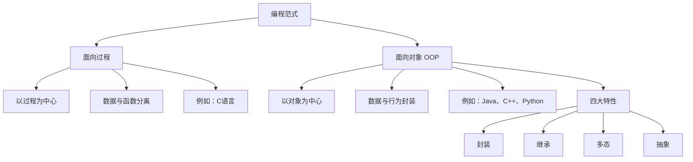
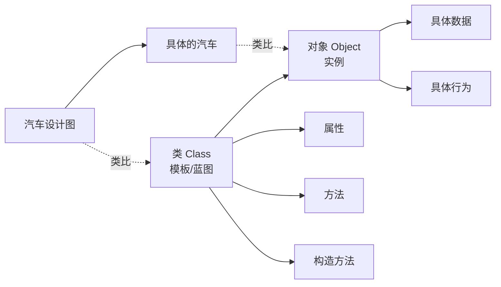

# 面向对象编程

> **学习目标**：掌握Java面向对象核心概念
> **核心内容**：类与对象、封装、继承、多态、抽象类、接口
> **预计时间**：5小时

## 面向对象编程思想

### 什么是面向对象？

面向对象编程（Object-Oriented Programming，OOP）是一种编程范式，它将程序中的数据和操作数据的方法封装在一起，形成"对象"。



### 面向对象 vs 面向过程

```java
/**
 * 面向过程：以步骤为中心
 */
public class ProceduralStyle {
    public static void main(String[] args) {
        // 定义变量
        String studentName = "张三";
        int studentAge = 20;
        double studentScore = 95.5;

        // 定义行为（独立的方法）
        printStudent(studentName, studentAge, studentScore);
        updateScore(studentScore);
    }

    public static void printStudent(String name, int age, double score) {
        System.out.println("姓名: " + name);
        System.out.println("年龄: " + age);
        System.out.println("分数: " + score);
    }

    public static void updateScore(double score) {
        // ...
    }
}

/**
 * 面向对象：以对象为中心
 */
public class ObjectOrientedStyle {
    public static void main(String[] args) {
        // 创建对象
        Student student = new Student("张三", 20, 95.5);

        // 调用对象的行为
        student.printInfo();
        student.updateScore(98.0);
    }
}

class Student {
    // 属性（数据）
    private String name;
    private int age;
    private double score;

    // 构造方法
    public Student(String name, int age, double score) {
        this.name = name;
        this.age = age;
        this.score = score;
    }

    // 行为（方法）
    public void printInfo() {
        System.out.println("姓名: " + name);
        System.out.println("年龄: " + age);
        System.out.println("分数: " + score);
    }

    public void updateScore(double newScore) {
        this.score = newScore;
    }
}
```

### 面向对象的优点

```text
✅ 模块化：将复杂问题分解为多个对象
✅ 可维护性：代码结构清晰，易于维护
✅ 可重用性：通过继承和组合重用代码
✅ 可扩展性：易于添加新功能
✅ 信息隐藏：通过封装保护内部数据
```

## 类与对象

### 类和对象的概念



**类（Class）**：是对象的模板或蓝图，定义了对象的属性和行为。
**对象（Object）**：是类的实例，具有具体的属性值和行为。

### 定义类

```java
/**
 * 学生类
 */
public class Student {

    // ========== 属性（成员变量） ==========
    // 使用private实现封装
    private String name;      // 姓名
    private int age;          // 年龄
    private double score;     // 分数
    private static String school = "清华大学";  // 静态属性（类变量）

    // ========== 构造方法 ==========
    // 无参构造
    public Student() {
        this.name = "未知";
        this.age = 0;
        this.score = 0.0;
    }

    // 有参构造
    public Student(String name, int age, double score) {
        this.name = name;
        this.age = age;
        this.score = score;
    }

    // ========== 方法（成员方法） ==========

    // Getter方法（访问器）
    public String getName() {
        return name;
    }

    public int getAge() {
        return age;
    }

    public double getScore() {
        return score;
    }

    // Setter方法（修改器）
    public void setName(String name) {
        this.name = name;
    }

    public void setAge(int age) {
        if (age > 0 && age < 150) {  // 数据验证
            this.age = age;
        } else {
            System.out.println("年龄不合法！");
        }
    }

    public void setScore(double score) {
        if (score >= 0 && score <= 100) {
            this.score = score;
        } else {
            System.out.println("分数不合法！");
        }
    }

    // 业务方法
    public void study() {
        System.out.println(name + "正在学习...");
    }

    public void takeExam() {
        System.out.println(name + "正在考试...");
    }

    public void printInfo() {
        System.out.println("姓名: " + name);
        System.out.println("年龄: " + age);
        System.out.println("分数: " + score);
        System.out.println("学校: " + school);
    }

    // 静态方法（类方法）
    public static void printSchool() {
        System.out.println("学校: " + school);
        // 静态方法不能访问非静态成员
        // System.out.println(name);  // 编译错误！
    }

    // toString方法（重写Object类的方法）
    @Override
    public String toString() {
        return "Student{name='" + name + "', age=" + age + ", score=" + score + "}";
    }

    // equals方法（重写Object类的方法）
    @Override
    public boolean equals(Object obj) {
        if (this == obj) return true;
        if (obj == null || getClass() != obj.getClass()) return false;
        Student student = (Student) obj;
        return age == student.age &&
               Double.compare(student.score, score) == 0 &&
               name.equals(student.name);
    }
}
```

### 创建和使用对象

```java
public class CreateObjects {
    public static void main(String[] args) {
        // ========== 创建对象 ==========
        // 使用new关键字调用构造方法
        Student s1 = new Student("张三", 20, 95.5);
        Student s2 = new Student("李四", 21, 88.0);
        Student s3 = new Student();  // 使用无参构造

        // ========== 访问属性（通过getter/setter） ==========
        System.out.println("学生姓名: " + s1.getName());
        System.out.println("学生年龄: " + s1.getAge());

        // 修改属性
        s1.setAge(21);
        s1.setScore(98.0);

        // ========== 调用方法 ==========
        s1.study();
        s1.takeExam();
        s1.printInfo();

        // ========== 静态成员 ==========
        // 静态属性属于类，所有对象共享
        Student.printSchool();
        System.out.println("学校: " + Student.school);

        // ========== toString方法 ==========
        System.out.println(s1);  // 自动调用toString()

        // ========== 对象比较 ==========
        Student s4 = new Student("张三", 20, 95.5);
        System.out.println("s1 == s4: " + (s1 == s4));  // false（不同对象）
        System.out.println("s1.equals(s4): " + s1.equals(s4));  // true（内容相同）

        // ========== 对象数组 ==========
        Student[] students = new Student[3];
        students[0] = s1;
        students[1] = s2;
        students[2] = s3;

        // 遍历对象数组
        for (Student student : students) {
            student.printInfo();
            System.out.println("----------");
        }

        // ========== 对象作为方法参数 ==========
        printStudentInfo(s1);

        // ========== 对象作为返回值 ==========
        Student bestStudent = findBestStudent(students);
        System.out.println("最好的学生: " + bestStudent);
    }

    // 对象作为方法参数
    public static void printStudentInfo(Student student) {
        student.printInfo();
    }

    // 对象作为返回值
    public static Student findBestStudent(Student[] students) {
        Student best = students[0];
        for (Student student : students) {
            if (student.getScore() > best.getScore()) {
                best = student;
            }
        }
        return best;
    }
}
```

### 使用Record类（Java 14+）

```java
/**
 * Record类：不可变数据载体（Java 14正式版，16+完善）
 * 自动生成：构造方法、getter、equals、hashCode、toString
 */
public record Point(int x, int y) {
    // 可以添加静态成员
    public static Point ORIGIN = new Point(0, 0);

    // 可以添加实例方法
    public double distanceToOrigin() {
        return Math.sqrt(x * x + y * y);
    }

    // 可以添加构造方法（紧凑构造方法）
    public Point {
        if (x < 0 || y < 0) {
            throw new IllegalArgumentException("坐标不能为负数");
        }
    }
}

class TestRecord {
    public static void main(String[] args) {
        // 创建Record对象
        Point p1 = new Point(3, 4);
        Point p2 = new Point(3, 4);

        // 访问组件（注意：不是getX()，而是x()）
        System.out.println("x: " + p1.x());
        System.out.println("y: " + p1.y());

        // 自动生成的toString()
        System.out.println(p1);  // Point[x=3, y=4]

        // 自动生成的equals()
        System.out.println(p1.equals(p2));  // true

        // 调用自定义方法
        System.out.println("到原点的距离: " + p1.distanceToOrigin());

        // Record用于数据传输对象（DTO）
        record User(String username, String email, int age) {}
        User user = new User("xiaoxu", "xiaoxu@example.com", 25);
        System.out.println(user);

        // Record用于返回多个值
        record Result(int sum, double average) {}
        Result result = calculate(1, 2, 3, 4, 5);
        System.out.println("和: " + result.sum());
        System.out.println("平均: " + result.average());
    }

    public static Result calculate(int... numbers) {
        int sum = 0;
        for (int num : numbers) {
            sum += num;
        }
        double average = (double) sum / numbers.length;
        return new Result(sum, average);
    }
}
```

## 三大特性：封装、继承、多态

### 封装（Encapsulation）

封装是将数据（属性）和操作数据的方法绑定在一起，并隐藏内部实现细节。

```java
/**
 * 封装示例：银行账户类
 */
public class BankAccount {
    // private属性：外部无法直接访问
    private String accountNumber;
    private String owner;
    private double balance;
    private String password;

    // 构造方法
    public BankAccount(String accountNumber, String owner, String password) {
        this.accountNumber = accountNumber;
        this.owner = owner;
        this.password = password;
        this.balance = 0.0;
    }

    // public方法：提供受控的访问

    // 查询余额（只读）
    public double getBalance(String inputPassword) {
        if (verifyPassword(inputPassword)) {
            return balance;
        }
        return -1;  // 密码错误
    }

    // 存款
    public boolean deposit(double amount) {
        if (amount > 0) {
            balance += amount;
            System.out.println("存款成功，当前余额: " + balance);
            return true;
        }
        System.out.println("存款金额必须大于0");
        return false;
    }

    // 取款
    public boolean withdraw(double amount, String inputPassword) {
        if (!verifyPassword(inputPassword)) {
            System.out.println("密码错误");
            return false;
        }

        if (amount <= 0) {
            System.out.println("取款金额必须大于0");
            return false;
        }

        if (amount > balance) {
            System.out.println("余额不足");
            return false;
        }

        balance -= amount;
        System.out.println("取款成功，当前余额: " + balance);
        return true;
    }

    // 修改密码
    public boolean changePassword(String oldPassword, String newPassword) {
        if (!verifyPassword(oldPassword)) {
            System.out.println("原密码错误");
            return false;
        }

        if (newPassword == null || newPassword.length() < 6) {
            System.out.println("新密码长度不能少于6位");
            return false;
        }

        password = newPassword;
        System.out.println("密码修改成功");
        return true;
    }

    // 私有辅助方法
    private boolean verifyPassword(String inputPassword) {
        return password != null && password.equals(inputPassword);
    }

    @Override
    public String toString() {
        return "BankAccount{账号='" + accountNumber + "', 户主='" + owner + "', 余额=" + balance + "}";
    }
}

class TestEncapsulation {
    public static void main(String[] args) {
        BankAccount account = new BankAccount("6222021234567890", "张三", "123456");

        // account.balance = 1000000;  // 编译错误！private属性无法访问

        // 只能通过public方法操作
        account.deposit(1000);
        account.deposit(500);

        double balance = account.getBalance("123456");
        System.out.println("余额: " + balance);

        account.withdraw(300, "123456");

        account.changePassword("123456", "654321");
    }
}
```

### 访问修饰符

```java
/**
 * 访问修饰符示例
 */
public class AccessModifierDemo {

    public int publicVar = 1;       // 公共：任何地方都可访问
    protected int protectedVar = 2; // 受保护：同包或子类可访问
    int defaultVar = 3;             // 默认：同包可访问
    private int privateVar = 4;     // 私有：只有本类可访问

    public void publicMethod() {
        System.out.println("公共方法");
    }

    protected void protectedMethod() {
        System.out.println("受保护方法");
    }

    void defaultMethod() {
        System.out.println("默认方法");
    }

    private void privateMethod() {
        System.out.println("私有方法");
    }

    public void testAccess() {
        // 本类中可以访问所有成员
        System.out.println(publicVar);
        System.out.println(protectedVar);
        System.out.println(defaultVar);
        System.out.println(privateVar);

        publicMethod();
        protectedMethod();
        defaultMethod();
        privateMethod();
    }
}

class AnotherClass {
    public void test() {
        AccessModifierDemo demo = new AccessModifierDemo();

        // ✅ 可访问public成员
        demo.publicVar = 10;
        demo.publicMethod();

        // ❌ 不可访问private成员
        // demo.privateVar = 10;  // 编译错误
        // demo.privateMethod();  // 编译错误

        // ⚠️ 如果不在同一包，也不能访问protected和default成员
    }
}
```

### 继承（Inheritance）

继承是子类继承父类的属性和方法，实现代码重用。

```java
/**
 * 父类：动物
 */
public class Animal {
    protected String name;
    protected int age;

    public Animal(String name, int age) {
        this.name = name;
        this.age = age;
    }

    public void eat() {
        System.out.println(name + "正在吃东西...");
    }

    public void sleep() {
        System.out.println(name + "正在睡觉...");
    }

    public void move() {
        System.out.println(name + "正在移动...");
    }

    public void printInfo() {
        System.out.println("名字: " + name + ", 年龄: " + age);
    }
}

/**
 * 子类：狗
 */
public class Dog extends Animal {
    private String breed;  // 品种

    public Dog(String name, int age, String breed) {
        super(name, age);  // 调用父类构造方法
        this.breed = breed;
    }

    // 新增方法
    public void bark() {
        System.out.println(name + "汪汪叫...");
    }

    public void fetch() {
        System.out.println(name + "正在捡球...");
    }

    // 重写父类方法
    @Override
    public void move() {
        System.out.println(name + "正在奔跑...");
    }

    @Override
    public void printInfo() {
        // 调用父类方法
        super.printInfo();
        System.out.println("品种: " + breed);
    }
}

/**
 * 子类：猫
 */
public class Cat extends Animal {
    private boolean isIndoor;  // 是否室内猫

    public Cat(String name, int age, boolean isIndoor) {
        super(name, age);
        this.isIndoor = isIndoor;
    }

    // 新增方法
    public void meow() {
        System.out.println(name + "喵喵叫...");
    }

    public void climb() {
        System.out.println(name + "正在爬树...");
    }

    // 重写父类方法
    @Override
    public void move() {
        System.out.println(name + "正在悄悄地走...");
    }

    @Override
    public void printInfo() {
        super.printInfo();
        System.out.println("类型: " + (isIndoor ? "室内猫" : "室外猫"));
    }
}

class TestInheritance {
    public static void main(String[] args) {
        Dog dog = new Dog("旺财", 3, "金毛");
        Cat cat = new Cat("咪咪", 2, true);

        // 继承的方法
        dog.eat();
        dog.sleep();
        cat.eat();
        cat.sleep();

        // 子类特有的方法
        dog.bark();
        dog.fetch();
        cat.meow();
        cat.climb();

        // 重写的方法（多态）
        dog.move();  // 正在奔跑...
        cat.move();  // 正在悄悄地走...

        // 打印信息
        dog.printInfo();
        cat.printInfo();
    }
}
```

### super关键字

```java
/**
 * super关键字的使用
 */
public class SuperDemo {

    static class Parent {
        protected String name = "父类属性";

        public Parent() {
            System.out.println("父类无参构造");
        }

        public Parent(String name) {
            System.out.println("父类有参构造: " + name);
        }

        public void method() {
            System.out.println("父类方法");
        }
    }

    static class Child extends Parent {
        private String name = "子类属性";

        public Child() {
            // super()必须放在子类构造方法的第一行
            super();  // 调用父类无参构造
            System.out.println("子类构造");
        }

        public Child(String name) {
            super(name);  // 调用父类有参构造
            System.out.println("子类有参构造");
        }

        public void test() {
            // 访问子类属性
            System.out.println("this.name: " + this.name);
            // 访问父类属性
            System.out.println("super.name: " + super.name);

            // 调用子类方法
            this.method();
            // 调用父类方法
            super.method();
        }

        @Override
        public void method() {
            System.out.println("子类方法");
        }
    }

    public static void main(String[] args) {
        Child child = new Child("测试");
        child.test();
    }
}
```

### 方法重写（Override）

```java
/**
 * 方法重写规则：
 * 1. 方法名、参数列表必须相同
 * 2. 访问权限不能更严格
 * 3. 返回类型相同或是子类型
 * 4. 抛出的异常不能更宽泛
 */
public class OverrideDemo {

    static class Vehicle {
        public void start() {
            System.out.println("车辆启动");
        }

        public void stop() {
            System.out.println("车辆停止");
        }

        public Vehicle getVehicle() {
            return this;
        }
    }

    static class Car extends Vehicle {
        @Override  // 注解，检查是否正确重写
        public void start() {
            System.out.println("汽车启动：踩离合、挂档、点火");
        }

        @Override
        public void stop() {
            System.out.println("汽车停止：踩刹车、挂空档、拉手刹");
        }

        @Override
        public Car getVehicle() {  // 返回子类型（协变返回）
            return this;
        }
    }

    public static void main(String[] args) {
        Vehicle vehicle = new Vehicle();
        vehicle.start();
        vehicle.stop();

        Car car = new Car();
        car.start();
        car.stop();
    }
}
```

### 多态（Polymorphism）

多态是指同一个行为具有多个不同表现形式或形态的能力。

```java
/**
 * 多态示例
 */
public class PolymorphismDemo {

    // 父类
    static class Shape {
        protected String color;

        public Shape(String color) {
            this.color = color;
        }

        public void draw() {
            System.out.println("绘制形状");
        }

        public double getArea() {
            return 0.0;
        }
    }

    // 子类1：圆形
    static class Circle extends Shape {
        private double radius;

        public Circle(String color, double radius) {
            super(color);
            this.radius = radius;
        }

        @Override
        public void draw() {
            System.out.println("绘制" + color + "的圆形，半径: " + radius);
        }

        @Override
        public double getArea() {
            return Math.PI * radius * radius;
        }
    }

    // 子类2：矩形
    static class Rectangle extends Shape {
        private double width;
        private double height;

        public Rectangle(String color, double width, double height) {
            super(color);
            this.width = width;
            this.height = height;
        }

        @Override
        public void draw() {
            System.out.println("绘制" + color + "的矩形，宽: " + width + ", 高: " + height);
        }

        @Override
        public double getArea() {
            return width * height;
        }
    }

    // 子类3：三角形
    static class Triangle extends Shape {
        private double base;
        private double height;

        public Triangle(String color, double base, double height) {
            super(color);
            this.base = base;
            this.height = height;
        }

        @Override
        public void draw() {
            System.out.println("绘制" + color + "的三角形，底: " + base + ", 高: " + height);
        }

        @Override
        public double getArea() {
            return 0.5 * base * height;
        }
    }

    public static void main(String[] args) {
        // 多态：父类引用指向子类对象
        Shape shape1 = new Circle("红色", 5.0);
        Shape shape2 = new Rectangle("蓝色", 4.0, 6.0);
        Shape shape3 = new Triangle("绿色", 3.0, 4.0);

        // 同一个引用，调用同一方法，表现出不同行为
        shape1.draw();  // 绘制圆形
        shape2.draw();  // 绘制矩形
        shape3.draw();  // 绘制三角形

        // 多态数组
        Shape[] shapes = {shape1, shape2, shape3};
        System.out.println("\n所有形状的面积:");
        for (Shape shape : shapes) {
            System.out.printf("面积: %.2f%n", shape.getArea());
        }

        // 多态方法参数
        drawShape(new Circle("黄色", 3.0));
        drawShape(new Rectangle("紫色", 5.0, 7.0));

        // 类型检查和转换
        System.out.println("\n类型检查:");
        if (shape1 instanceof Circle) {
            Circle circle = (Circle) shape1;  // 向下转型
            System.out.println("这是一个圆形");
        }

        if (shape2 instanceof Rectangle) {
            Rectangle rectangle = (Rectangle) shape2;
            System.out.println("这是一个矩形");
        }
    }

    // 多态方法参数：可以接受任何Shape子类对象
    public static void drawShape(Shape shape) {
        shape.draw();
        System.out.println("面积: " + shape.getArea());
    }
}
```

### instanceof操作符

```java
/**
 * instanceof：类型检查
 */
public class InstanceofDemo {
    public static void main(String[] args) {
        Object obj = "Hello";

        // 检查对象是否是某个类型
        System.out.println(obj instanceof String);   // true
        System.out.println(obj instanceof Object);   // true
        System.out.println(obj instanceof Integer);  // false

        // Java 14+ 模式匹配
        if (obj instanceof String s) {
            // s自动转换为String类型，无需强制转换
            System.out.println("字符串长度: " + s.length());
        }

        // 传统方式（Java 14之前）
        if (obj instanceof String) {
            String s = (String) obj;  // 需要强制转换
            System.out.println("字符串长度: " + s.length());
        }
    }
}
```

## 抽象类与接口

### 抽象类

```java
/**
 * 抽象类：不能被实例化的类
 * 使用abstract关键字修饰
 */
public abstract class Animal {
    protected String name;

    public Animal(String name) {
        this.name = name;
    }

    // 具体方法
    public void sleep() {
        System.out.println(name + "正在睡觉...");
    }

    // 抽象方法：没有方法体，子类必须实现
    public abstract void makeSound();

    public abstract void move();
}

/**
 * 子类必须实现抽象方法
 */
class Dog extends Animal {
    private String breed;

    public Dog(String name, String breed) {
        super(name);
        this.breed = breed;
    }

    @Override
    public void makeSound() {
        System.out.println(name + "汪汪叫！");
    }

    @Override
    public void move() {
        System.out.println(name + "在跑");
    }
}

class Cat extends Animal {
    public Cat(String name) {
        super(name);
    }

    @Override
    public void makeSound() {
        System.out.println(name + "喵喵叫！");
    }

    @Override
    public void move() {
        System.out.println(name + "在悄悄地走");
    }
}

class TestAbstractClass {
    public static void main(String[] args) {
        // Animal animal = new Animal("动物");  // 编译错误！抽象类不能实例化

        // 多态：抽象类引用指向具体子类对象
        Animal animal1 = new Dog("旺财", "金毛");
        Animal animal2 = new Cat("咪咪");

        animal1.makeSound();  // 调用Dog的实现
        animal1.move();
        animal1.sleep();      // 调用抽象类的具体方法

        animal2.makeSound();  // 调用Cat的实现
        animal2.move();
        animal2.sleep();
    }
}
```

### 接口（Interface）

```java
/**
 * 接口：完全抽象的类
 * 定义规范和契约
 */
public interface Flyable {
    // 常量（public static final，可省略）
    double MAX_ALTITUDE = 10000.0;

    // 抽象方法（public abstract，可省略）
    void fly();
    void land();

    // Java 8+ 默认方法
    default void glide() {
        System.out.println("滑翔中...");
    }

    // Java 8+ 静态方法
    static void printInfo() {
        System.out.println("这是可飞行对象的接口");
    }

    // Java 9+ 私有方法
    private void checkAltitude(double altitude) {
        if (altitude > MAX_ALTITUDE) {
            System.out.println("超过最大飞行高度！");
        }
    }
}

/**
 * 另一个接口
 */
public interface Swimmable {
    void swim();

    default void dive() {
        System.out.println("潜水中...");
    }
}

/**
 * 类实现多个接口
 */
public class Duck implements Flyable, Swimmable {
    private String name;

    public Duck(String name) {
        this.name = name;
    }

    @Override
    public void fly() {
        System.out.println(name + "在飞翔");
    }

    @Override
    public void land() {
        System.out.println(name + "降落");
    }

    @Override
    public void swim() {
        System.out.println(name + "在游泳");
    }

    // 可以重写默认方法
    @Override
    public void glide() {
        System.out.println(name + "在优雅地滑翔");
    }

    public void doEverything() {
        fly();
        glide();
        land();
        swim();
        dive();
    }
}

class TestInterface {
    public static void main(String[] args) {
        Duck duck = new Duck("唐老鸭");

        // 调用接口方法
        duck.fly();
        duck.swim();
        duck.doEverything();

        // 接口的多态
        Flyable flyable = duck;
        flyable.fly();
        flyable.glide();

        Swimmable swimmable = duck;
        swimmable.swim();

        // 调用接口静态方法
        Flyable.printInfo();
    }
}
```

### 抽象类 vs 接口

```java
/**
 * 抽象类 vs 接口的选择
 */
public class AbstractVsInterface {

    /**
     * 抽象类：模板设计
     * - 定义通用的属性和方法
     * - 部分方法可以提供默认实现
     * - 用于"is-a"关系
     */
    abstract class Vehicle {
        protected String brand;
        protected int speed;

        public Vehicle(String brand) {
            this.brand = brand;
        }

        // 具体方法
        public void start() {
            System.out.println(brand + " 车辆启动");
        }

        // 抽象方法
        public abstract void move();

        public abstract void stop();
    }

    /**
     * 接口：行为规范
     * - 定义行为契约
     * - 用于"has-a"能力
     */
    interface Electric {
        void charge();
        int getBatteryLevel();
    }

    interface Autonomous {
        void enableAutoMode();
        void disableAutoMode();
    }

    /**
     * 电动汽车：继承抽象类，实现接口
     */
    class ElectricCar extends Vehicle implements Electric, Autonomous {
        private int batteryLevel;
        private boolean autoMode;

        public ElectricCar(String brand) {
            super(brand);
            this.batteryLevel = 100;
        }

        @Override
        public void move() {
            System.out.println(brand + " 电动车在行驶");
        }

        @Override
        public void stop() {
            System.out.println(brand + " 电动车停止");
        }

        @Override
        public void charge() {
            System.out.println("正在充电...");
            batteryLevel = 100;
        }

        @Override
        public int getBatteryLevel() {
            return batteryLevel;
        }

        @Override
        public void enableAutoMode() {
            autoMode = true;
            System.out.println("自动驾驶已启用");
        }

        @Override
        public void disableAutoMode() {
            autoMode = false;
            System.out.println("自动驾驶已关闭");
        }
    }

    public void demo() {
        ElectricCar tesla = new ElectricCar("Tesla");
        tesla.start();
        tesla.move();
        tesla.charge();
        tesla.enableAutoMode();
        tesla.stop();
    }
}
```

## 内部类

### 成员内部类

```java
/**
 * 成员内部类
 */
public class OuterClass {
    private int outerVar = 10;

    // 成员内部类
    public class InnerClass {
        private int innerVar = 20;

        public void display() {
            // 可以访问外部类的私有成员
            System.out.println("外部类变量: " + outerVar);
            System.out.println("内部类变量: " + innerVar);
        }
    }

    public void test() {
        InnerClass inner = new InnerClass();
        inner.display();
    }
}

class TestInnerClass {
    public static void main(String[] args) {
        // 创建内部类对象
        OuterClass outer = new OuterClass();
        OuterClass.InnerClass inner = outer.new InnerClass();
        inner.display();
    }
}
```

### 静态内部类

```java
/**
 * 静态内部类
 */
public class OuterClass {
    private static int staticVar = 10;
    private int instanceVar = 20;

    // 静态内部类
    public static class StaticInnerClass {
        private int innerVar = 30;

        public void display() {
            // 只能访问外部类的静态成员
            System.out.println("外部类静态变量: " + staticVar);
            // System.out.println(instanceVar);  // 编译错误！
            System.out.println("内部类变量: " + innerVar);
        }
    }
}

class TestStaticInnerClass {
    public static void main(String[] args) {
        // 创建静态内部类对象（不需要外部类对象）
        OuterClass.StaticInnerClass inner = new OuterClass.StaticInnerClass();
        inner.display();
    }
}
```

### 局部内部类

```java
/**
 * 局部内部类（定义在方法中）
 */
public class LocalInnerClass {
    public void test() {
        final int localVar = 10;

        // 局部内部类
        class LocalClass {
            private int value = 20;

            public void display() {
                System.out.println("局部变量: " + localVar);
                System.out.println("内部类变量: " + value);
            }
        }

        LocalClass local = new LocalClass();
        local.display();
    }
}
```

### 匿名内部类

```java
/**
 * 匿名内部类：没有名字的内部类
 * 常用于接口和抽象类的临时实现
 */
public class AnonymousInnerClass {
    public static void main(String[] args) {
        // 方式1：传统方式定义实现类
        class MyRunnable implements Runnable {
            @Override
            public void run() {
                System.out.println("线程运行中...");
            }
        }
        Thread t1 = new Thread(new MyRunnable());

        // 方式2：匿名内部类（更简洁）
        Runnable runnable = new Runnable() {
            @Override
            public void run() {
                System.out.println("匿名内部类：线程运行中...");
            }
        };
        Thread t2 = new Thread(runnable);

        // 方式3：更简洁（一步到位）
        Thread t3 = new Thread(new Runnable() {
            @Override
            public void run() {
                System.out.println("更简洁的匿名内部类");
            }
        });

        // 方式4：使用Lambda表达式（Java 8+，最简洁）
        Thread t4 = new Thread(() -> {
            System.out.println("Lambda表达式");
        });

        // 或更简洁
        Thread t5 = new Thread(() -> System.out.println("最简洁的Lambda"));

        // GUI中的匿名内部类
        JButton button = new JButton("点击我");
        button.addActionListener(new ActionListener() {
            @Override
            public void actionPerformed(ActionEvent e) {
                System.out.println("按钮被点击了");
            }
        });

        // Lambda版本
        button.addActionListener(e -> System.out.println("Lambda按钮点击"));
    }
}
```

## 常见错误与避坑指南

### 1. 忘记初始化对象

```java
// ❌ 错误
String name;
System.out.println(name.length());  // 编译错误

// ⚠️ 引用类型默认是null
String[] names = new String[5];
System.out.println(names[0].length());  // NullPointerException！

// ✅ 正确做法
String[] names = new String[5];
if (names[0] != null) {
    System.out.println(names[0].length());
}
```

### 2. 比较对象使用==

```java
// ❌ 错误
String s1 = new String("Hello");
String s2 = new String("Hello");
if (s1 == s2) {  // 比较的是引用地址
    // ...
}

// ✅ 正确
if (s1.equals(s2)) {  // 比较内容
    // ...
}
```

### 3. 重写equals时没有重写hashCode

```java
// ⚠️ 如果重写equals，必须重写hashCode
@Override
public boolean equals(Object obj) {
    // 实现
}

@Override
public int hashCode() {
    return Objects.hash(name, age);  // 使用相同字段
}
```

### 4. 继承中的陷阱

```java
// ⚠️ 构造方法调用顺序
class Parent {
    Parent() {
        method();  // 可能调用子类重写的方法
    }
    void method() {
        System.out.println("Parent method");
    }
}

class Child extends Parent {
    private int value = 10;
    @Override
    void method() {
        System.out.println("Child method: " + value);  // value可能未初始化
    }
}

// ✅ 避免在构造方法中调用可被重写的方法
```

## 练习题

### 基础练习

1. **设计一个学生类**：包含姓名、年龄、成绩属性，提供getter/setter和学习方法

2. **实现继承**：创建Person父类，Student和Teacher子类

3. **多态练习**：设计图形类及其子类（圆形、矩形等），计算面积和周长

### 进阶练习

4. **接口设计**：设计Playable接口，让不同乐器类实现它

5. **抽象类应用**：设计银行账户系统，包含不同类型账户

### 挑战练习

6. **综合案例**：设计一个小型的宠物管理系统

```java
// 要求：
// - 抽象类Pet（姓名、年龄）
// - 子类Dog、Cat、Bird
// - 接口Trainable（可训练）
// - 实现多态调用
```

## 本章小结

### 知识点回顾

✅ **类与对象**：对象的模板和实例
✅ **封装**：隐藏内部实现，提供公共接口
✅ **继承**：代码重用，"is-a"关系
✅ **多态**：同一行为不同表现
✅ **抽象类**：部分抽象，模板设计
✅ **接口**：完全抽象，行为规范

### 学习成果

完成本章学习后，你应该能够：
- 设计和实现类
- 理解并应用面向对象三大特性
- 正确使用抽象类和接口
- 运用多态提高代码灵活性

### 下一步

恭喜你掌握了面向对象编程！下一章我们将学习数组与集合框架。

**准备好了吗？让我们继续Java之旅！** 🚀

---

**学习时间**：约5小时
**难度等级**：★★★☆☆
**下一章**：[数组与集合框架](./chapter-117.md)
