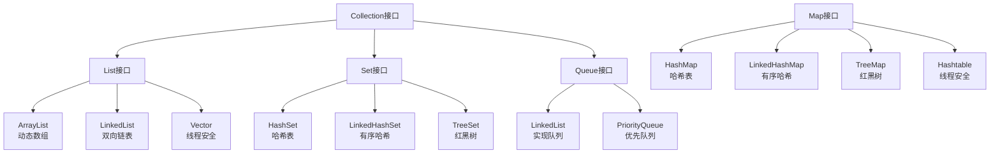

# 数组与集合框架

> **学习目标**：掌握Java集合框架的使用
> **核心内容**：数组深入、List、Set、Map、集合算法
> **预计时间**：4小时

## 数组深入

### 数组的特点

```java
/**
 * 数组特点：
 * 1. 固定长度：创建后不能改变大小
 * 2. 类型统一：只能存储相同类型的数据
 * 3. 连续内存：元素在内存中连续存储
 * 4. 快速访问：通过索引快速访问元素
 */
public class ArrayFeatures {
    public static void main(String[] args) {
        // 数组的优缺点
        int[] arr = {1, 2, 3, 4, 5};

        // ✅ 优点：快速随机访问
        long start = System.nanoTime();
        int value = arr[2];  // O(1)时间复杂度
        long end = System.nanoTime();
        System.out.println("访问时间: " + (end - start) + "ns");

        // ❌ 缺点：插入和删除慢
        // 需要移动大量元素
    }
}
```

### 数组的高级操作

```java
import java.util.Arrays;

public class AdvancedArray {
    public static void main(String[] args) {
        // 数组复制
        int[] original = {1, 2, 3, 4, 5};

        // 方式1：使用copyOf
        int[] copy1 = Arrays.copyOf(original, original.length);
        int[] copy2 = Arrays.copyOf(original, 10);  // 扩容

        // 方式2：使用copyOfRange
        int[] copy3 = Arrays.copyOfRange(original, 1, 4);  // [2, 3, 4]

        // 方式3：使用clone
        int[] copy4 = original.clone();

        // 方式4：使用System.arraycopy
        int[] copy5 = new int[original.length];
        System.arraycopy(original, 0, copy5, 0, original.length);

        // 数组比较
        int[] arr1 = {1, 2, 3};
        int[] arr2 = {1, 2, 3};
        System.out.println("arr1.equals(arr2): " + arr1.equals(arr2));  // false
        System.out.println("Arrays.equals(): " + Arrays.equals(arr1, arr2));  // true

        // 数组排序
        int[] numbers = {5, 2, 8, 1, 9, 3};
        Arrays.sort(numbers);
        System.out.println("排序后: " + Arrays.toString(numbers));

        // 二分查找（要求数组已排序）
        int index = Arrays.binarySearch(numbers, 8);
        System.out.println("8的索引: " + index);

        // 填充数组
        int[] fillArray = new int[5];
        Arrays.fill(fillArray, 10);
        System.out.println("填充: " + Arrays.toString(fillArray));

        // 数组转字符串
        System.out.println(Arrays.toString(numbers));

        // 多维数组
        int[][] matrix = {
            {1, 2, 3},
            {4, 5, 6},
            {7, 8, 9}
        };

        // 打印二维数组
        System.out.println("二维数组:");
        for (int[] row : matrix) {
            System.out.println(Arrays.toString(row));
        }

        // 不规则二维数组
        int[][] jagged = {
            {1, 2},
            {3, 4, 5},
            {6, 7, 8, 9}
        };
    }
}
```

## Java集合框架概述



### 集合框架的层次结构

```java
/**
 * Java集合框架接口层次
 */
public interface Collection<E> extends Iterable<E> {
    // Collection是所有集合的根接口
}

public interface List<E> extends Collection<E> {
    // 有序集合，允许重复元素
}

public interface Set<E> extends Collection<E> {
    // 不允许重复元素
}

public interface Queue<E> extends Collection<E> {
    // 队列接口
}

public interface Map<K, V> {
    // 键值对映射，不继承Collection
}
```

## List集合

### ArrayList（动态数组）

```java
import java.util.*;

/**
 * ArrayList：基于动态数组实现
 * 特点：查询快，增删慢，线程不安全
 */
public class ArrayListDemo {
    public static void main(String[] args) {
        // 创建ArrayList
        List<String> list = new ArrayList<>();

        // 添加元素
        list.add("苹果");
        list.add("香蕉");
        list.add("橙子");
        list.add("苹果");  // 允许重复

        // 在指定位置插入
        list.add(1, "葡萄");

        System.out.println("列表: " + list);

        // 访问元素
        String first = list.get(0);
        System.out.println("第一个元素: " + first);

        // 修改元素
        list.set(0, "红苹果");
        System.out.println("修改后: " + list);

        // 删除元素
        list.remove(1);  // 按索引删除
        list.remove("橙子");  // 按元素删除
        System.out.println("删除后: " + list);

        // 列表大小
        System.out.println("大小: " + list.size());

        // 判断是否包含
        System.out.println("包含苹果? " + list.contains("苹果"));

        // 判断是否为空
        System.out.println("为空? " + list.isEmpty());

        // 获取元素索引
        System.out.println("苹果的索引: " + list.indexOf("苹果"));

        // 遍历ArrayList
        System.out.println("方式1: for循环");
        for (int i = 0; i < list.size(); i++) {
            System.out.println(list.get(i));
        }

        System.out.println("方式2: 增强for循环");
        for (String fruit : list) {
            System.out.println(fruit);
        }

        System.out.println("方式3: Iterator");
        Iterator<String> iterator = list.iterator();
        while (iterator.hasNext()) {
            System.out.println(iterator.next());
        }

        System.out.println("方式4: forEach (Java 8+)");
        list.forEach(System.out::println);

        // 转换为数组
        String[] array = list.toArray(new String[0]);
        System.out.println("数组: " + Arrays.toString(array));

        // 列表排序
        List<Integer> numbers = new ArrayList<>();
        numbers.add(5);
        numbers.add(2);
        numbers.add(8);
        numbers.add(1);

        Collections.sort(numbers);
        System.out.println("排序后: " + numbers);

        // 反转
        Collections.reverse(numbers);
        System.out.println("反转后: " + numbers);

        // 打乱
        Collections.shuffle(numbers);
        System.out.println("打乱后: " + numbers);

        // 使用泛型
        List<Student> students = new ArrayList<>();
        students.add(new Student("张三", 20, 95.5));
        students.add(new Student("李四", 21, 88.0));

        for (Student student : students) {
            student.printInfo();
        }

        // 初始容量设置（优化性能）
        List<String> largeList = new ArrayList<>(10000);  // 预估大小
    }
}

class Student {
    String name;
    int age;
    double score;

    public Student(String name, int age, double score) {
        this.name = name;
        this.age = age;
        this.score = score;
    }

    public void printInfo() {
        System.out.println(name + ", " + age + ", " + score);
    }
}
```

### LinkedList（双向链表）

```java
import java.util.*;

/**
 * LinkedList：基于双向链表实现
 * 特点：查询慢，增删快，线程不安全
 */
public class LinkedListDemo {
    public static void main(String[] args) {
        // 创建LinkedList
        LinkedList<String> list = new LinkedList<>();

        // List方法
        list.add("数据结构");
        list.add("算法");
        list.add("数据库");
        list.addFirst("计算机网络");  // 添加到头部
        list.addLast("操作系统");     // 添加到尾部

        System.out.println("列表: " + list);

        // 访问头尾元素
        System.out.println("头部: " + list.getFirst());
        System.out.println("尾部: " + list.getLast());

        // 删除头尾元素
        list.removeFirst();
        list.removeLast();

        // 栈操作
        LinkedList<Integer> stack = new LinkedList<>();
        stack.push(1);  // 压栈
        stack.push(2);
        stack.push(3);
        System.out.println("栈: " + stack);

        int top = stack.pop();  // 出栈
        System.out.println("出栈元素: " + top);
        System.out.println("栈顶: " + stack.peek());

        // 队列操作
        LinkedList<Integer> queue = new LinkedList<>();
        queue.offer(1);  // 入队
        queue.offer(2);
        queue.offer(3);
        System.out.println("队列: " + queue);

        int front = queue.poll();  // 出队
        System.out.println("出队元素: " + front);
        System.out.println("队头: " + queue.peek());
    }
}
```

### ArrayList vs LinkedList

```java
/**
 * 性能对比
 */
public class ListPerformance {
    public static void main(String[] args) {
        final int SIZE = 100_000;

        // 测试插入性能
        testInsert(new ArrayList<>(), SIZE, "ArrayList");
        testInsert(new LinkedList<>(), SIZE, "LinkedList");

        // 测试访问性能
        testAccess(new ArrayList<>(), SIZE, "ArrayList");
        testAccess(new LinkedList<>(), SIZE, "LinkedList");
    }

    public static void testInsert(List<Integer> list, int size, String type) {
        long start = System.currentTimeMillis();
        for (int i = 0; i < size; i++) {
            list.add(i);
        }
        long end = System.currentTimeMillis();
        System.out.println(type + " 插入" + size + "个元素: " + (end - start) + "ms");
    }

    public static void testAccess(List<Integer> list, int size, String type) {
        for (int i = 0; i < size; i++) {
            list.add(i);
        }

        long start = System.currentTimeMillis();
        for (int i = 0; i < size; i++) {
            list.get(i);
        }
        long end = System.currentTimeMillis();
        System.out.println(type + " 随机访问" + size + "次: " + (end - start) + "ms");
    }
}

/*
结论：
- ArrayList：插入慢（需要扩容和复制），访问快（O(1)）
- LinkedList：插入快（只需改变指针），访问慢（O(n)）
- 大多数情况下使用ArrayList，除非需要频繁在头部插入
*/
```

## Set集合

### HashSet（哈希集合）

```java
import java.util.*;

/**
 * HashSet：基于哈希表实现
 * 特点：无序，不允许重复，查找快
 */
public class HashSetDemo {
    public static void main(String[] args) {
        // 创建HashSet
        Set<String> set = new HashSet<>();

        // 添加元素
        set.add("Java");
        set.add("Python");
        set.add("C++");
        set.add("Java");  // 重复元素不会添加

        System.out.println("Set: " + set);
        System.out.println("大小: " + set.size());  // 3

        // 删除元素
        set.remove("Python");
        System.out.println("删除后: " + set);

        // 判断是否包含
        System.out.println("包含Java? " + set.contains("Java"));

        // 遍历Set（无序）
        for (String lang : set) {
            System.out.println(lang);
        }

        // 存储自定义对象
        Set<Person> people = new HashSet<>();
        people.add(new Person("张三", 25));
        people.add(new Person("李四", 30));
        people.add(new Person("张三", 25));  // 重复

        System.out.println("人数: " + people.size());  // 取决于equals和hashCode
    }
}

class Person {
    String name;
    int age;

    public Person(String name, int age) {
        this.name = name;
        this.age = age;
    }

    @Override
    public boolean equals(Object o) {
        if (this == o) return true;
        if (o == null || getClass() != o.getClass()) return false;
        Person person = (Person) o;
        return age == person.age && Objects.equals(name, person.name);
    }

    @Override
    public int hashCode() {
        return Objects.hash(name, age);
    }

    @Override
    public String toString() {
        return name + "(" + age + ")";
    }
}
```

### LinkedHashSet和TreeSet

```java
import java.util.*;

/**
 * 其他Set实现
 */
public class OtherSets {
    public static void main(String[] args) {
        // LinkedHashSet：有序的HashSet
        Set<String> linkedHashSet = new LinkedHashSet<>();
        linkedHashSet.add("Java");
        linkedHashSet.add("Python");
        linkedHashSet.add("C++");
        linkedHashSet.add("Java");

        System.out.println("LinkedHashSet (插入顺序): " + linkedHashSet);

        // TreeSet：排序的Set
        Set<Integer> treeSet = new TreeSet<>();
        treeSet.add(5);
        treeSet.add(2);
        treeSet.add(8);
        treeSet.add(1);

        System.out.println("TreeSet (排序后): " + treeSet);

        // 自定义排序
        Set<String> treeSet2 = new TreeSet<>(Comparator.reverseOrder());
        treeSet2.add("Apple");
        treeSet2.add("Banana");
        treeSet2.add("Orange");

        System.out.println("TreeSet (降序): " + treeSet2);

        // TreeSet的高级操作
        TreeSet<Integer> numbers = new TreeSet<>(Arrays.asList(1, 3, 5, 7, 9, 11));
        System.out.println("小于等于6的最大数: " + numbers.floor(6));  // 5
        System.out.println("大于等于6的最小数: " + numbers.ceiling(6));  // 7
        System.out.println("严格大于6的最小数: " + numbers.higher(6));   // 7
        System.out.println("严格小于6的最大数: " + numbers.lower(6));    // 5
    }
}
```

## Map集合

### HashMap（哈希映射）

```java
import java.util.*;

/**
 * HashMap：键值对存储
 * 特点：键唯一，值可重复，查找快
 */
public class HashMapDemo {
    public static void main(String[] args) {
        // 创建HashMap
        Map<String, Integer> map = new HashMap<>();

        // 添加键值对
        map.put("苹果", 5);
        map.put("香蕉", 3);
        map.put("橙子", 8);
        map.put("苹果", 10);  // 覆盖旧值

        System.out.println("Map: " + map);

        // 访问值
        int appleCount = map.get("苹果");
        System.out.println("苹果数量: " + appleCount);

        // 不存在时返回默认值
        int watermelon = map.getOrDefault("西瓜", 0);
        System.out.println("西瓜数量: " + watermelon);

        // 删除键值对
        map.remove("香蕉");
        System.out.println("删除后: " + map);

        // 判断是否包含
        System.out.println("包含苹果键? " + map.containsKey("苹果"));
        System.out.println("包含值10? " + map.containsValue(10));

        // 获取所有键
        System.out.println("所有键: " + map.keySet());

        // 获取所有值
        System.out.println("所有值: " + map.values());

        // 遍历Map
        System.out.println("方式1: entrySet");
        for (Map.Entry<String, Integer> entry : map.entrySet()) {
            System.out.println(entry.getKey() + " = " + entry.getValue());
        }

        System.out.println("方式2: keySet");
        for (String key : map.keySet()) {
            System.out.println(key + " = " + map.get(key));
        }

        System.out.println("方式3: forEach (Java 8+)");
        map.forEach((key, value) -> System.out.println(key + " = " + value));

        // 计算单词频率
        String text = "Java is great Java is powerful";
        Map<String, Integer> wordCount = new HashMap<>();

        for (String word : text.split(" ")) {
            wordCount.put(word, wordCount.getOrDefault(word, 0) + 1);
        }

        System.out.println("单词频率: " + wordCount);

        // 使用merge方法（Java 8+）
        Map<String, Integer> scores = new HashMap<>();
        scores.merge("张三", 90, Integer::sum);  // 不存在时添加
        scores.merge("张三", 5, Integer::sum);   // 存在时合并
        System.out.println("成绩: " + scores);

        // 实际应用：缓存
        Map<String, String> cache = new HashMap<>();
        cache.put("user:1001", "张三的信息");
        cache.put("user:1002", "李四的信息");

        String userInfo = cache.get("user:1001");
        if (userInfo == null) {
            // 从数据库查询
            userInfo = loadFromDatabase("user:1001");
            cache.put("user:1001", userInfo);
        }
    }

    private static String loadFromDatabase(String key) {
        // 模拟数据库查询
        return "从数据库加载的数据";
    }
}
```

### TreeMap（排序映射）

```java
import java.util.*;

/**
 * TreeMap：基于红黑树实现
 * 特点：键有序
 */
public class TreeMapDemo {
    public static void main(String[] args) {
        // 自然排序
        Map<String, String> map = new TreeMap<>();
        map.put("C", "C语言");
        map.put("Java", "Java语言");
        map.put("Python", "Python语言");

        System.out.println("TreeMap (按键排序): " + map);

        // 自定义排序
        Map<String, String> map2 = new TreeMap<>(Comparator.reverseOrder());
        map2.put("C", "C语言");
        map2.put("Java", "Java语言");
        map2.put("Python", "Python语言");

        System.out.println("TreeMap (降序): " + map2);

        // TreeMap特有方法
        TreeMap<Integer, String> treeMap = new TreeMap<>();
        treeMap.put(1, "一");
        treeMap.put(3, "三");
        treeMap.put(5, "五");
        treeMap.put(7, "七");

        System.out.println("第一个键: " + treeMap.firstKey());
        System.out.println("最后一个键: " + treeMap.lastKey());
        System.out.println("小于4的键: " + treeMap.headMap(4));
        System.out.println("大于等于4的键: " + treeMap.tailMap(4));
        System.out.println("2到6之间的键: " + treeMap.subMap(2, 6));
    }
}
```

### LinkedHashMap（有序映射）

```java
import java.util.*;

/**
 * LinkedHashMap：保持插入顺序或访问顺序
 */
public class LinkedHashMapDemo {
    public static void main(String[] args) {
        // 保持插入顺序
        Map<String, Integer> map1 = new LinkedHashMap<>();
        map1.put("一", 1);
        map1.put("二", 2);
        map1.put("三", 3);

        System.out.println("插入顺序: " + map1);

        // 保持访问顺序（LRU缓存）
        Map<String, Integer> map2 = new LinkedHashMap<>(16, 0.75f, true);
        map2.put("A", 1);
        map2.put("B", 2);
        map2.put("C", 3);

        map2.get("A");  // 访问A，A移到最后
        map2.get("B");  // 访问B，B移到最后

        System.out.println("访问顺序: " + map2);  // C, A, B
    }
}
```

## 集合工具类

### Collections工具类

```java
import java.util.*;

/**
 * Collections：集合操作工具类
 */
public class CollectionsDemo {
    public static void main(String[] args) {
        List<Integer> numbers = new ArrayList<>();
        for (int i = 1; i <= 10; i++) {
            numbers.add(i);
        }

        // 打乱
        Collections.shuffle(numbers);
        System.out.println("打乱: " + numbers);

        // 排序
        Collections.sort(numbers);
        System.out.println("排序: " + numbers);

        // 反转
        Collections.reverse(numbers);
        System.out.println("反转: " + numbers);

        // 二分查找（要求数组已排序）
        Collections.sort(numbers);
        int index = Collections.binarySearch(numbers, 5);
        System.out.println("5的索引: " + index);

        // 最大值和最小值
        System.out.println("最大值: " + Collections.max(numbers));
        System.out.println("最小值: " + Collections.min(numbers));

        // 填充
        Collections.fill(numbers, 0);
        System.out.println("填充后: " + numbers);

        // 不可变集合
        List<String> immutable = Collections.unmodifiableList(
            new ArrayList<>(Arrays.asList("A", "B", "C"))
        );
        // immutable.add("D");  // 抛出UnsupportedOperationException

        // 单例集合
        Set<String> singleton = Collections.singleton("Hello");
        List<String> singletonList = Collections.singletonList("World");

        // 空集合
        List<String> emptyList = Collections.emptyList();
        Set<String> emptySet = Collections.emptySet();

        // 同步集合（线程安全）
        List<String> syncList = Collections.synchronizedList(new ArrayList<>());
    }
}
```

### Arrays工具类

```java
import java.util.*;

/**
 * Arrays：数组操作工具类
 */
public class ArraysDemo {
    public static void main(String[] args) {
        // 数组转List
        String[] array = {"A", "B", "C"};
        List<String> list = Arrays.asList(array);
        System.out.println("List: " + list);

        // ⚠️ 注意：返回的是固定大小的List
        // list.add("D");  // 抛出UnsupportedOperationException

        // 正确做法
        List<String> arrayList = new ArrayList<>(Arrays.asList(array));
        arrayList.add("D");

        // 填充数组
        int[] arr = new int[5];
        Arrays.fill(arr, 10);
        System.out.println("填充: " + Arrays.toString(arr));

        // 比较数组
        int[] arr1 = {1, 2, 3};
        int[] arr2 = {1, 2, 3};
        System.out.println("Arrays.equals(): " + Arrays.equals(arr1, arr2));

        // 多维数组打印
        int[][] matrix = {{1, 2}, {3, 4}};
        System.out.println("二维数组: " + Arrays.deepToString(matrix));

        // 并行排序（大数组时更快）
        int[] largeArray = new int[100_000];
        // ... 填充数据
        Arrays.parallelSort(largeArray);
    }
}
```

## 泛型与集合

```java
import java.util.*;

/**
 * 泛型集合
 */
public class GenericCollections {
    public static void main(String[] args) {
        // 使用泛型确保类型安全
        List<String> stringList = new ArrayList<>();
        stringList.add("Hello");
        // stringList.add(123);  // 编译错误！

        // 泛型方法
        List<Integer> intList = Arrays.asList(1, 2, 3, 4, 5);
        printList(intList);

        List<String> strList = Arrays.asList("A", "B", "C");
        printList(strList);

        // 通配符
        List<?> wildList = new ArrayList<String>();
        // wildList.add("Hello");  // 编译错误！不能添加元素（除了null）

        // 上界通配符
        List<? extends Number> numbers = new ArrayList<Integer>();
        Number num = numbers.get(0);  // 可以读取
        // numbers.add(10);  // 编译错误！不能添加

        // 下界通配符
        List<? super Integer> integers = new ArrayList<Number>();
        integers.add(10);  // 可以添加Integer或其子类
        // Integer i = integers.get(0);  // 编译错误！只能读取Object

        // PECS原则：Producer Extends, Consumer Super
        // Producer：只读取，使用? extends
        // Consumer：只写入，使用? super
    }

    // 泛型方法
    public static <T> void printList(List<T> list) {
        for (T item : list) {
            System.out.println(item);
        }
    }
}
```

## 实际应用案例

### 统计单词频率

```java
import java.util.*;

/**
 * 案例：统计文本中单词频率
 */
public class WordFrequency {
    public static void main(String[] args) {
        String text = "Java is a programming language " +
                     "Java is widely used " +
                     "Many developers love Java";

        // 统计频率
        Map<String, Integer> frequency = new HashMap<>();

        String[] words = text.toLowerCase().split("\\s+");
        for (String word : words) {
            frequency.merge(word, 1, Integer::sum);
        }

        // 按频率排序
        List<Map.Entry<String, Integer>> sorted = new ArrayList<>(frequency.entrySet());
        sorted.sort((e1, e2) -> e2.getValue().compareTo(e1.getValue()));

        // 输出结果
        System.out.println("单词频率统计:");
        for (Map.Entry<String, Integer> entry : sorted) {
            System.out.printf("%s: %d%n", entry.getKey(), entry.getValue());
        }
    }
}
```

### 学生成绩管理

```java
import java.util.*;

/**
 * 案例：学生成绩管理系统
 */
record Student(String id, String name, Map<String, Integer> scores) {
    public int getTotalScore() {
        return scores.values().stream().mapToInt(Integer::intValue).sum();
    }

    public double getAverageScore() {
        return scores.values().stream().mapToInt(Integer::intValue).average().orElse(0);
    }
}

public class StudentManagement {
    public static void main(String[] args) {
        // 创建学生
        Map<String, Integer> scores1 = new HashMap<>();
        scores1.put("语文", 90);
        scores1.put("数学", 95);
        scores1.put("英语", 88);

        Map<String, Integer> scores2 = new HashMap<>();
        scores2.put("语文", 85);
        scores2.put("数学", 92);
        scores2.put("英语", 90);

        Student s1 = new Student("1001", "张三", scores1);
        Student s2 = new Student("1002", "李四", scores2);

        // 学生列表
        List<Student> students = new ArrayList<>();
        students.add(s1);
        students.add(s2);

        // 按总分排序
        students.sort((s1_, s2_) -> Integer.compare(s2_.getTotalScore(), s1_.getTotalScore()));

        // 输出成绩单
        System.out.println("成绩排名:");
        for (int i = 0; i < students.size(); i++) {
            Student s = students.get(i);
            System.out.printf("第%d名: %s, 总分: %d, 平均分: %.2f%n",
                i + 1, s.name(), s.getTotalScore(), s.getAverageScore());
        }
    }
}
```

## 常见错误与避坑指南

### 1. 并发修改异常

```java
// ❌ 错误
List<String> list = new ArrayList<>(Arrays.asList("A", "B", "C"));
for (String item : list) {
    if (item.equals("B")) {
        list.remove(item);  // ConcurrentModificationException
    }
}

// ✅ 正确做法1：使用Iterator
Iterator<String> iterator = list.iterator();
while (iterator.hasNext()) {
    String item = iterator.next();
    if (item.equals("B")) {
        iterator.remove();
    }
}

// ✅ 正确做法2：使用removeIf (Java 8+)
list.removeIf(item -> item.equals("B"));

// ✅ 正确做法3：使用Stream
list = list.stream()
           .filter(item -> !item.equals("B"))
           .collect(Collectors.toList());
```

### 2. 数组转List的陷阱

```java
// ⚠️ Arrays.asList返回的是固定大小的List
Integer[] arr = {1, 2, 3};
List<Integer> list = Arrays.asList(arr);
// list.add(4);  // UnsupportedOperationException

// ✅ 正确做法
List<Integer> arrayList = new ArrayList<>(Arrays.asList(arr));
arrayList.add(4);

// ⚠️ 基本类型数组不能直接转换
int[] ints = {1, 2, 3};
List<int[]> list = Arrays.asList(ints);  // 不是我们想要的

// ✅ 使用Stream
List<Integer> list = Arrays.stream(ints)
                          .boxed()
                          .collect(Collectors.toList());
```

### 3. HashSet和HashMap的equals和hashCode

```java
// ⚠️ 自定义对象作为Set元素或Map键时，必须重写equals和hashCode
class Person {
    String name;
    int age;

    // 必须同时重写equals和hashCode
    @Override
    public boolean equals(Object o) {
        if (this == o) return true;
        if (o == null || getClass() != o.getClass()) return false;
        Person person = (Person) o;
        return age == person.age && Objects.equals(name, person.name);
    }

    @Override
    public int hashCode() {
        return Objects.hash(name, age);
    }
}
```

## 练习题

### 基础练习

1. **List操作**：实现一个待办事项列表

2. **Set操作**：找出两个List中的共同元素

3. **Map操作**：实现一个简单的电话簿

### 进阶练习

4. **统计词频**：统计文章中每个单词出现的次数

5. **排序**：对学生按成绩排序

### 挑战练习

6. **LRU缓存**：使用LinkedHashMap实现LRU缓存

## 本章小结

### 知识点回顾

✅ **数组**：固定长度，快速访问
✅ **List**：有序集合，允许重复
✅ **Set**：无重复元素集合
✅ **Map**：键值对映射
✅ **工具类**：Collections、Arrays

### 学习成果

完成本章学习后，你应该能够：
- 选择合适的集合类型
- 使用集合进行数据处理
- 理解泛型的应用
- 避免常见陷阱

### 下一步

恭喜你掌握了集合框架！下一章我们将学习异常处理与调试。

**准备好了吗？让我们继续Java之旅！** 🚀

---

**学习时间**：约4小时
**难度等级**：★★★☆☆
**下一章**：[异常处理与调试](./chapter-118.md)
