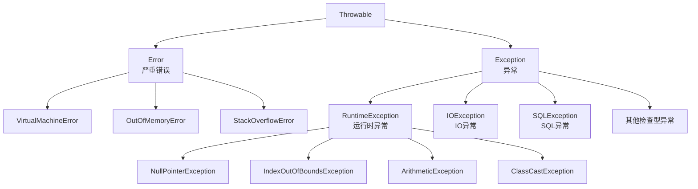

# 异常处理与调试

> **学习目标**：掌握Java异常处理机制和调试技巧
> **核心内容**：异常体系、try-catch、自定义异常、日志、调试工具
> **预计时间**：3小时

## 异常概述

### 什么是异常？

异常是程序在执行过程中发生的意外情况，如文件不存在、网络断开、除零错误等。Java使用异常处理机制来优雅地处理这些错误情况。

```java
/**
 * 异常示例
 */
public class ExceptionExample {
    public static void main(String[] args) {
        // ❌ 不处理异常，程序会崩溃
        int result = 10 / 0;  // ArithmeticException

        // ❌ 数组越界
        int[] arr = new int[5];
        arr[10] = 100;  // ArrayIndexOutOfBoundsException

        // ❌ 空指针
        String str = null;
        System.out.println(str.length());  // NullPointerException
    }
}
```

### 异常的层次结构



### Error vs Exception

```java
/**
 * Error和Exception的区别
 */
public class ErrorVsException {
    public static void main(String[] args) {
        // Error：严重错误，程序无法处理
        // 例如：OutOfMemoryError, StackOverflowError

        // Exception：异常，程序可以处理
        // 例如：IOException, SQLException
    }

    // 栈溢出（递归太深）
    public static void recursive() {
        recursive();  // StackOverflowError
    }
}
```

## 捕获和处理异常

### try-catch语句

```java
/**
 * 基本的异常捕获
 */
public class TryCatchDemo {
    public static void main(String[] args) {
        // 基本语法
        try {
            // 可能抛出异常的代码
            int result = 10 / 0;
        } catch (ArithmeticException e) {
            // 处理异常
            System.out.println("发生除零错误: " + e.getMessage());
        }

        // 多个catch块
        try {
            String[] arr = {"A", "B", "C"};
            System.out.println(arr[5]);  // 数组越界
        } catch (ArrayIndexOutOfBoundsException e) {
            System.out.println("数组索引越界");
        } catch (Exception e) {
            System.out.println("其他异常");
        }

        // finally块：无论是否异常都会执行
        try {
            int[] arr = new int[3];
            arr[10] = 100;
        } catch (ArrayIndexOutOfBoundsException e) {
            System.out.println("捕获异常");
        } finally {
            System.out.println("finally块总是执行");
        }

        // try-with-resources（Java 7+）：自动关闭资源
        try (Scanner scanner = new Scanner(System.in)) {
            System.out.print("请输入数字: ");
            int num = scanner.nextInt();
            System.out.println("你输入了: " + num);
        } catch (InputMismatchException e) {
            System.out.println("输入格式错误");
        }
        // scanner自动关闭
    }
}
```

### 常见异常类型

```java
import java.util.*;

/**
 * 常见的运行时异常
 */
public class CommonExceptions {
    public static void main(String[] args) {
        // 1. NullPointerException
        String str = null;
        try {
            int len = str.length();  // 空指针
        } catch (NullPointerException e) {
            System.out.println("空指针异常");
        }

        // 预防空指针
        if (str != null) {
            System.out.println(str.length());
        }

        // 2. ArrayIndexOutOfBoundsException
        int[] arr = new int[5];
        try {
            arr[10] = 100;
        } catch (ArrayIndexOutOfBoundsException e) {
            System.out.println("数组索引越界");
        }

        // 3. ArithmeticException
        try {
            int result = 10 / 0;
        } catch (ArithmeticException e) {
            System.out.println("算术异常");
        }

        // 4. ClassCastException
        Object obj = "Hello";
        try {
            Integer num = (Integer) obj;  // 类型转换错误
        } catch (ClassCastException e) {
            System.out.println("类型转换异常");
        }

        // 使用instanceof检查
        if (obj instanceof String) {
            String s = (String) obj;
        }

        // 5. NumberFormatException
        try {
            int num = Integer.parseInt("abc");
        } catch (NumberFormatException e) {
            System.out.println("数字格式异常");
        }

        // 6. IllegalArgumentException
        try {
            setAge(-5);
        } catch (IllegalArgumentException e) {
            System.out.println("非法参数异常");
        }
    }

    public static void setAge(int age) {
        if (age < 0 || age > 150) {
            throw new IllegalArgumentException("年龄不合法");
        }
    }
}
```

## 抛出异常

### throws和throw

```java
import java.io.*;

/**
 * 抛出异常
 */
public class ThrowException {
    // throws：声明方法可能抛出的异常
    public static void readFile(String filename) throws IOException {
        FileReader reader = new FileReader(filename);
        // 读取文件
    }

    // throw：手动抛出异常
    public static void setScore(double score) {
        if (score < 0 || score > 100) {
            throw new IllegalArgumentException("分数必须在0-100之间");
        }
    }

    // 抛出检查型异常
    public static void divide(int a, int b) throws ArithmeticException {
        if (b == 0) {
            throw new ArithmeticException("除数不能为零");
        }
        System.out.println(a / b);
    }

    public static void main(String[] args) {
        try {
            setScore(150);
        } catch (IllegalArgumentException e) {
            System.out.println("捕获异常: " + e.getMessage());
        }

        try {
            divide(10, 0);
        } catch (ArithmeticException e) {
            System.out.println("捕获异常: " + e.getMessage());
        }
    }
}
```

## 自定义异常

```java
/**
 * 自定义异常类
 */

// 自定义检查型异常
class InsufficientFundsException extends Exception {
    private double amount;
    private double balance;

    public InsufficientFundsException(double amount, double balance) {
        super("余额不足：尝试取款 " + amount + "，但余额只有 " + balance);
        this.amount = amount;
        this.balance = balance;
    }

    public double getAmount() {
        return amount;
    }

    public double getBalance() {
        return balance;
    }
}

// 自定义运行时异常
class InvalidAgeException extends RuntimeException {
    public InvalidAgeException(String message) {
        super(message);
    }
}

/**
 * 使用自定义异常
 */
public class CustomExceptionDemo {
    public static void withdraw(double amount, double balance)
            throws InsufficientFundsException {
        if (amount > balance) {
            throw new InsufficientFundsException(amount, balance);
        }
        System.out.println("取款成功: " + amount);
    }

    public static void setAge(int age) {
        if (age < 0 || age > 150) {
            throw new InvalidAgeException("年龄必须在0-150之间");
        }
    }

    public static void main(String[] args) {
        // 使用自定义检查型异常
        try {
            withdraw(1000, 500);
        } catch (InsufficientFundsException e) {
            System.out.println(e.getMessage());
            System.out.println("尝试金额: " + e.getAmount());
            System.out.println("当前余额: " + e.getBalance());
        }

        // 使用自定义运行时异常
        try {
            setAge(200);
        } catch (InvalidAgeException e) {
            System.out.println(e.getMessage());
        }
    }
}
```

## 异常处理的最佳实践

### 异常处理原则

```java
/**
 * 异常处理最佳实践
 */
public class ExceptionBestPractices {

    // ✅ 好的实践1：尽早捕获异常
    public static int divide(int a, int b) {
        if (b == 0) {
            throw new IllegalArgumentException("除数不能为零");
        }
        return a / b;
    }

    // ✅ 好的实践2：提供有用的错误信息
    public static void setAge(int age) {
        if (age < 0 || age > 150) {
            throw new IllegalArgumentException(
                "年龄必须在0-150之间，当前值: " + age
            );
        }
    }

    // ✅ 好的实践3：捕获具体异常
    public static void processFile(String filename) {
        try {
            // 处理文件
        } catch (FileNotFoundException e) {
            System.out.println("文件不存在: " + filename);
        } catch (IOException e) {
            System.out.println("IO错误: " + e.getMessage());
        }
    }

    // ❌ 坏的实践1：捕获太宽泛
    public static void badPractice1() {
        try {
            // 代码
        } catch (Exception e) {  // 捕获所有异常
            e.printStackTrace();
        }
    }

    // ❌ 坏的实践2：吞掉异常
    public static void badPractice2() {
        try {
            // 代码
        } catch (Exception e) {
            // 什么都不做
        }
    }

    // ❌ 坏的实践3：用异常处理正常流程
    public static void badPractice3() {
        try {
            int i = 0;
            while (true) {
                if (i > 100) {
                    throw new Exception();
                }
                i++;
            }
        } catch (Exception e) {
            // 应该用正常的循环控制
        }
    }

    // ✅ 好的实践4：使用try-with-resources
    public static void readFile(String filename) {
        try (BufferedReader reader = new BufferedReader(new FileReader(filename))) {
            String line;
            while ((line = reader.readLine()) != null) {
                System.out.println(line);
            }
        } catch (IOException e) {
            System.out.println("读取文件错误: " + e.getMessage());
        }
        // reader自动关闭
    }

    // ✅ 好的实践5：清理资源
    public static void cleanupResource() {
        BufferedReader reader = null;
        try {
            reader = new BufferedReader(new FileReader("file.txt"));
            // 读取文件
        } catch (IOException e) {
            System.out.println("错误: " + e.getMessage());
        } finally {
            if (reader != null) {
                try {
                    reader.close();
                } catch (IOException e) {
                    e.printStackTrace();
                }
            }
        }
    }
}
```

## 调试技巧

### 使用日志

```java
import java.util.logging.*;

/**
 * 使用Java日志系统
 */
public class LoggingDemo {
    private static final Logger logger = Logger.getLogger(LoggingDemo.class.getName());

    public static void main(String[] args) {
        // 配置日志级别
        logger.setLevel(Level.ALL);

        // 不同级别的日志
        logger.severe("严重错误");
        logger.warning("警告");
        logger.info("普通信息");
        logger.config("配置信息");
        logger.fine("详细信息");
        logger.finer("更详细信息");
        logger.finest("最详细信息");

        // 使用日志记录异常
        try {
            int result = 10 / 0;
        } catch (ArithmeticException e) {
            logger.log(Level.SEVERE, "除零错误", e);
        }

        // 实际应用
        processUser("张三", 25);
    }

    public static void processUser(String name, int age) {
        logger.info("处理用户: " + name);

        if (age < 0) {
            logger.warning("年龄无效: " + age);
            return;
        }

        logger.fine("用户验证通过");
        // 处理逻辑
    }
}
```

### 使用断言

```java
/**
 * 断言：用于开发和测试
 */
public class AssertionDemo {
    public static void main(String[] args) {
        // 启用断言（需要在运行时加上 -ea 参数）
        // java -ea AssertionDemo

        int age = 25;

        // 断言年龄合法
        assert age >= 0 && age <= 150 : "年龄不合法: " + age;

        // 断言分数
        int score = 95;
        assert score >= 0 && score <= 100 : "分数必须在0-100之间";

        // 断言对象不为null
        String name = "张三";
        assert name != null : "名字不能为空";

        System.out.println("所有断言通过");
    }

    // 使用断言进行前置条件检查
    public static double calculateAverage(int[] scores) {
        assert scores != null : "分数数组不能为null";
        assert scores.length > 0 : "分数数组不能为空";

        int sum = 0;
        for (int score : scores) {
            sum += score;
        }
        return (double) sum / scores.length;
    }
}
```

### 使用调试器

```java
/**
 * 调试示例
 * 在IDE中设置断点，使用调试器逐步执行
 */
public class DebugDemo {
    public static void main(String[] args) {
        int[] numbers = {5, 2, 8, 1, 9};

        System.out.println("排序前: " + java.util.Arrays.toString(numbers));

        bubbleSort(numbers);

        System.out.println("排序后: " + java.util.Arrays.toString(numbers));
    }

    // 在这里设置断点
    public static void bubbleSort(int[] arr) {
        int n = arr.length;
        for (int i = 0; i < n - 1; i++) {
            for (int j = 0; j < n - i - 1; j++) {
                if (arr[j] > arr[j + 1]) {
                    // 交换
                    int temp = arr[j];
                    arr[j] = arr[j + 1];
                    arr[j + 1] = temp;
                }
            }
        }
    }
}
```

## 常见错误与解决方案

### 1. NullPointerException

```java
// ❌ 容易出现NPE的情况
String str = null;
if (str.equals("Hello")) {  // NPE!
}

// ✅ 正确做法
if ("Hello".equals(str)) {  // 安全
}

// 使用Optional (Java 8+)
import java.util.Optional;

Optional<String> optional = Optional.ofNullable(str);
if (optional.isPresent()) {
    String value = optional.get();
}
```

### 2. 资源泄漏

```java
// ❌ 错误：资源可能没有关闭
FileReader reader = new FileReader("file.txt");
// 如果这里抛出异常，reader不会关闭
// ...使用reader
reader.close();

// ✅ 正确：使用try-with-resources
try (FileReader reader = new FileReader("file.txt")) {
    // ...使用reader
} catch (IOException e) {
    // 处理异常
}
// reader自动关闭
```

### 3. 吞掉异常

```java
// ❌ 错误：吞掉异常
try {
    // 代码
} catch (Exception e) {
    // 什么都不做
}

// ✅ 正确：至少记录日志
try {
    // 代码
} catch (Exception e) {
    logger.log(Level.SEVERE, "操作失败", e);
}
```

## 练习题

### 基础练习

1. **异常捕获**：处理除零错误和数组越界

2. **自定义异常**：创建一个BankAccount类，使用自定义异常处理余额不足

### 进阶练习

3. **文件处理**：读取文件并处理可能的IO异常

4. **日志记录**：为程序添加完整的日志记录

### 挑战练习

5. **综合案例**：实现一个简单的计算器，处理各种异常情况

## 本章小结

### 知识点回顾

✅ **异常体系**：Error、Exception、RuntimeException
✅ **异常处理**：try-catch-finally、throws、throw
✅ **自定义异常**：检查型异常和运行时异常
✅ **最佳实践**：具体捕获、提供有用信息、资源管理
✅ **调试技巧**：日志、断言、调试器

### 学习成果

完成本章学习后，你应该能够：
- 正确捕获和处理异常
- 创建和使用自定义异常
- 使用日志记录程序状态
- 使用调试器定位问题

### 下一步

恭喜你掌握了异常处理！下一章我们将学习IO流与文件操作。

**准备好了吗？让我们继续Java之旅！** 🚀

---

**学习时间**：约3小时
**难度等级**：★★☆☆☆
**下一章**：[IO流与文件操作](./chapter-119.md)
