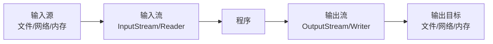

# IO流与文件操作

> **学习目标**：掌握Java IO流体系和文件操作
> **核心内容**：文件读写、字节流、字符流、缓冲流、NIO
> **预计时间**：4小时

## IO流概述

### 什么是IO流？

IO（Input/Output）流是Java中用于处理输入输出的机制。流是一串有序的数据序列，可以想象成水流，数据从源头流向目的地。



### IO流的分类

```
IO流分类体系：
├─ 按流向分
│  ├─ 输入流：从源读取数据
│  └─ 输出流：向目标写入数据
│
├─ 按数据单位分
│  ├─ 字节流：以字节为单位（8位）
│  └─ 字符流：以字符为单位（16位）
│
├─ 按功能分
│  ├─ 节点流：直接操作数据源
│  └─ 处理流：包装节点流，提供额外功能
│
└─ 常用类
   ├─ 字节流：InputStream、OutputStream、FileInputStream、FileOutputStream
   ├─ 字符流：Reader、Writer、FileReader、FileWriter、BufferedReader
   └─ 缓冲流：BufferedInputStream、BufferedOutputStream、BufferedReader、BufferedWriter
```

## 文件操作

### File类

```java
import java.io.*;
import java.util.Date;

/**
 * File类：文件和目录的抽象表示
 */
public class FileDemo {
    public static void main(String[] args) {
        // 创建File对象
        File file = new File("test.txt");
        File directory = new File("C:\\Users\\Documents");
        File fileWithPath = new File("C:\\Users\\Documents", "test.txt");

        // 文件信息
        System.out.println("文件名: " + file.getName());
        System.out.println("路径: " + file.getPath());
        System.out.println("绝对路径: " + file.getAbsolutePath());
        System.out.println("父目录: " + file.getParent());

        // 文件状态
        System.out.println("存在: " + file.exists());
        System.out.println("是文件: " + file.isFile());
        System.out.println("是目录: " + file.isDirectory());
        System.out.println("可读: " + file.canRead());
        System.out.println("可写: " + file.canWrite());
        System.out.println("可执行: " + file.canExecute());
        System.out.println("是隐藏: " + file.isHidden());

        // 文件大小
        System.out.println("大小（字节）: " + file.length());

        // 最后修改时间
        long lastModified = file.lastModified();
        System.out.println("最后修改: " + new Date(lastModified));

        // 创建文件
        try {
            boolean created = file.createNewFile();
            System.out.println("文件创建: " + (created ? "成功" : "已存在"));
        } catch (IOException e) {
            System.out.println("创建文件失败: " + e.getMessage());
        }

        // 创建目录
        File dir = new File("mydir");
        boolean dirCreated = dir.mkdir();  // 创建单级目录
        System.out.println("目录创建: " + (dirCreated ? "成功" : "已存在"));

        File dirs = new File("parent/child/grandchild");
        boolean dirsCreated = dirs.mkdirs();  // 创建多级目录
        System.out.println("多级目录创建: " + (dirsCreated ? "成功" : "已存在"));

        // 列出目录内容
        File currentDir = new File(".");
        String[] files = currentDir.list();
        System.out.println("\n当前目录内容:");
        if (files != null) {
            for (String f : files) {
                System.out.println(f);
            }
        }

        File[] fileObjects = currentDir.listFiles();
        System.out.println("\n当前目录文件对象:");
        if (fileObjects != null) {
            for (File f : fileObjects) {
                System.out.printf("%-20s %s%n",
                    f.getName(),
                    f.isDirectory() ? "[目录]" : f.length() + "字节"
                );
            }
        }

        // 删除文件或目录
        boolean deleted = file.delete();
        System.out.println("\n删除文件: " + (deleted ? "成功" : "失败"));

        // 重命名文件
        File oldFile = new File("old.txt");
        File newFile = new File("new.txt");
        boolean renamed = oldFile.renameTo(newFile);
        System.out.println("重命名: " + (renamed ? "成功" : "失败"));

        // 递归删除目录
        deleteDirectory(new File("testDir"));
    }

    // 递归删除目录及其内容
    public static void deleteDirectory(File dir) {
        if (dir.isDirectory()) {
            File[] files = dir.listFiles();
            if (files != null) {
                for (File file : files) {
                    deleteDirectory(file);
                }
            }
        }
        dir.delete();
    }
}
```

### 文件过滤器

```java
import java.io.*;

/**
 * 文件过滤
 */
public class FileFilterDemo {
    public static void main(String[] args) {
        File dir = new File(".");

        // 列出所有.txt文件
        System.out.println("文本文件:");
        String[] textFiles = dir.list((d, name) -> name.endsWith(".txt"));
        if (textFiles != null) {
            for (String file : textFiles) {
                System.out.println(file);
            }
        }

        // 使用FileFilter
        System.out.println("\n目录:");
        File[] dirs = dir.listFiles(File::isDirectory);
        if (dirs != null) {
            for (File d : dirs) {
                System.out.println(d.getName());
            }
        }

        // 自定义过滤器
        System.out.println("\n大于1KB的文件:");
        File[] largeFiles = dir.listFiles(file -> file.length() > 1024);
        if (largeFiles != null) {
            for (File file : largeFiles) {
                System.out.printf("%s: %d字节%n", file.getName(), file.length());
            }
        }
    }
}
```

## 字节流

### InputStream和OutputStream

```java
import java.io.*;

/**
 * 字节流示例
 */
public class ByteStreamDemo {
    public static void main(String[] args) {
        // 文件复制（字节流）
        copyFile("source.txt", "dest.txt");

        // 读取图片文件
        readImage("image.jpg");

        // 写入二进制数据
        writeBinary("data.bin");
    }

    // 文件复制
    public static void copyFile(String source, String dest) {
        try (InputStream in = new FileInputStream(source);
             OutputStream out = new FileOutputStream(dest)) {

            byte[] buffer = new byte[1024];
            int bytesRead;
            while ((bytesRead = in.read(buffer)) != -1) {
                out.write(buffer, 0, bytesRead);
            }

            System.out.println("文件复制成功");

        } catch (IOException e) {
            System.out.println("复制失败: " + e.getMessage());
        }
    }

    // 读取图片
    public static void readImage(String filename) {
        try (InputStream in = new FileInputStream(filename)) {
            int dataSize = in.available();
            System.out.println("文件大小: " + dataSize + "字节");

            byte[] data = new byte[dataSize];
            in.read(data);

            // 处理图片数据
            System.out.println("读取图片成功");

        } catch (IOException e) {
            System.out.println("读取图片失败: " + e.getMessage());
        }
    }

    // 写入二进制数据
    public static void writeBinary(String filename) {
        try (OutputStream out = new FileOutputStream(filename)) {
            // 写入各种数据类型
            out.write(0x01);  // 字节
            out.write(0x02);

            byte[] data = {0x03, 0x04, 0x05};
            out.write(data);

            System.out.println("写入二进制数据成功");

        } catch (IOException e) {
            System.out.println("写入失败: " + e.getMessage());
        }
    }
}
```

### BufferedInputStream和BufferedOutputStream

```java
import java.io.*;

/**
 * 缓冲字节流：提高IO性能
 */
public class BufferedByteStream {
    public static void main(String[] args) {
        // 使用缓冲流复制大文件
        long start = System.currentTimeMillis();
        copyWithBuffer("largefile.mp4", "copy.mp4");
        long end = System.currentTimeMillis();
        System.out.println("耗时: " + (end - start) + "ms");
    }

    public static void copyWithBuffer(String source, String dest) {
        try (InputStream in = new BufferedInputStream(new FileInputStream(source));
             OutputStream out = new BufferedOutputStream(new FileOutputStream(dest))) {

            byte[] buffer = new byte[8192];  // 8KB缓冲区
            int bytesRead;
            long totalBytes = 0;

            while ((bytesRead = in.read(buffer)) != -1) {
                out.write(buffer, 0, bytesRead);
                totalBytes += bytesRead;
            }

            System.out.println("复制完成，共" + totalBytes + "字节");

        } catch (IOException e) {
            System.out.println("复制失败: " + e.getMessage());
        }
    }
}
```

## 字符流

### Reader和Writer

```java
import java.io.*;

/**
 * 字符流示例
 */
public class CharStreamDemo {
    public static void main(String[] args) {
        // 写入文本文件
        writeText("hello.txt", "你好，世界！\nHello, World!");

        // 读取文本文件
        String content = readText("hello.txt");
        System.out.println(content);

        // 追加文本
        appendText("hello.txt", "\n追加的内容");

        // 逐行读取
        readLines("hello.txt");
    }

    // 写入文本
    public static void writeText(String filename, String text) {
        try (Writer writer = new FileWriter(filename)) {
            writer.write(text);
            System.out.println("写入成功");
        } catch (IOException e) {
            System.out.println("写入失败: " + e.getMessage());
        }
    }

    // 读取文本
    public static String readText(String filename) {
        StringBuilder sb = new StringBuilder();
        try (Reader reader = new FileReader(filename)) {
            char[] buffer = new char[1024];
            int charsRead;
            while ((charsRead = reader.read(buffer)) != -1) {
                sb.append(buffer, 0, charsRead);
            }
        } catch (IOException e) {
            System.out.println("读取失败: " + e.getMessage());
        }
        return sb.toString();
    }

    // 追加文本
    public static void appendText(String filename, String text) {
        try (Writer writer = new FileWriter(filename, true)) {  // true表示追加
            writer.write(text);
            System.out.println("追加成功");
        } catch (IOException e) {
            System.out.println("追加失败: " + e.getMessage());
        }
    }

    // 逐行读取
    public static void readLines(String filename) {
        System.out.println("\n逐行读取:");
        try (BufferedReader reader = new BufferedReader(new FileReader(filename))) {
            String line;
            int lineNumber = 1;
            while ((line = reader.readLine()) != null) {
                System.out.println(lineNumber + ": " + line);
                lineNumber++;
            }
        } catch (IOException e) {
            System.out.println("读取失败: " + e.getMessage());
        }
    }
}
```

### BufferedReader和BufferedWriter

```java
import java.io.*;
import java.util.*;

/**
 * 缓冲字符流
 */
public class BufferedCharStream {
    public static void main(String[] args) {
        // 读取配置文件
        readConfig("config.properties");

        // 写入日志
        writeLog("app.log", Arrays.asList(
            "2024-01-01 10:00:00 INFO 系统启动",
            "2024-01-01 10:00:01 INFO 加载配置",
            "2024-01-01 10:00:02 ERROR 连接失败"
        ));

        // 文件排序
        sortFile("input.txt", "output.txt");
    }

    // 读取配置文件
    public static Map<String, String> readConfig(String filename) {
        Map<String, String> config = new HashMap<>();

        try (BufferedReader reader = new BufferedReader(new FileReader(filename))) {
            String line;
            while ((line = reader.readLine()) != null) {
                // 跳过注释和空行
                if (line.trim().isEmpty() || line.startsWith("#")) {
                    continue;
                }

                // 解析key=value
                String[] parts = line.split("=", 2);
                if (parts.length == 2) {
                    config.put(parts[0].trim(), parts[1].trim());
                }
            }
        } catch (IOException e) {
            System.out.println("读取配置失败: " + e.getMessage());
        }

        return config;
    }

    // 写入日志
    public static void writeLog(String filename, List<String> logs) {
        try (BufferedWriter writer = new BufferedWriter(new FileWriter(filename))) {
            for (String log : logs) {
                writer.write(log);
                writer.newLine();
            }
            System.out.println("日志写入成功");
        } catch (IOException e) {
            System.out.println("写入日志失败: " + e.getMessage());
        }
    }

    // 文件排序
    public static void sortFile(String inputFile, String outputFile) {
        try (BufferedReader reader = new BufferedReader(new FileReader(inputFile));
             BufferedWriter writer = new BufferedWriter(new FileWriter(outputFile))) {

            List<String> lines = new ArrayList<>();
            String line;
            while ((line = reader.readLine()) != null) {
                lines.add(line);
            }

            Collections.sort(lines);

            for (String sortedLine : lines) {
                writer.write(sortedLine);
                writer.newLine();
            }

            System.out.println("文件排序完成");

        } catch (IOException e) {
            System.out.println("排序失败: " + e.getMessage());
        }
    }
}
```

## 数据流

### DataInputStream和DataOutputStream

```java
import java.io.*;

/**
 * 数据流：读写Java基本数据类型
 */
public class DataStreamDemo {
    public static void main(String[] args) {
        // 写入数据
        writeData("data.dat");

        // 读取数据
        readData("data.dat");
    }

    public static void writeData(String filename) {
        try (DataOutputStream out = new DataOutputStream(
                new BufferedOutputStream(new FileOutputStream(filename)))) {

            out.writeBoolean(true);
            out.writeByte(100);
            out.writeShort(1000);
            out.writeInt(100000);
            out.writeLong(10000000000L);
            out.writeFloat(3.14f);
            out.writeDouble(3.141592653589793);
            out.writeUTF("你好，世界！");

            System.out.println("数据写入成功");

        } catch (IOException e) {
            System.out.println("写入失败: " + e.getMessage());
        }
    }

    public static void readData(String filename) {
        try (DataInputStream in = new DataInputStream(
                new BufferedInputStream(new FileInputStream(filename)))) {

            boolean bool = in.readBoolean();
            byte b = in.readByte();
            short s = in.readShort();
            int i = in.readInt();
            long l = in.readLong();
            float f = in.readFloat();
            double d = in.readDouble();
            String str = in.readUTF();

            System.out.println("读取数据:");
            System.out.println("boolean: " + bool);
            System.out.println("byte: " + b);
            System.out.println("short: " + s);
            System.out.println("int: " + i);
            System.out.println("long: " + l);
            System.out.println("float: " + f);
            System.out.println("double: " + d);
            System.out.println("String: " + str);

        } catch (IOException e) {
            System.out.println("读取失败: " + e.getMessage());
        }
    }
}
```

## 对象序列化

### Serializable接口

```java
import java.io.*;

/**
 * 可序列化的类
 */
class Person implements Serializable {
    private static final long serialVersionUID = 1L;

    private String name;
    private int age;
    private transient String password;  // transient：不序列化

    public Person(String name, int age, String password) {
        this.name = name;
        this.age = age;
        this.password = password;
    }

    @Override
    public String toString() {
        return "Person{name='" + name + "', age=" + age + ", password='" + password + "'}";
    }
}

/**
 * 对象序列化示例
 */
public class SerializationDemo {
    public static void main(String[] args) {
        Person person = new Person("张三", 25, "123456");

        // 序列化对象
        serializeObject(person, "person.dat");

        // 反序列化对象
        Person restored = deserializeObject("person.dat");
        System.out.println("反序列化后: " + restored);
    }

    public static void serializeObject(Object obj, String filename) {
        try (ObjectOutputStream out = new ObjectOutputStream(
                new FileOutputStream(filename))) {

            out.writeObject(obj);
            System.out.println("对象序列化成功");

        } catch (IOException e) {
            System.out.println("序列化失败: " + e.getMessage());
        }
    }

    public static Object deserializeObject(String filename) {
        try (ObjectInputStream in = new ObjectInputStream(
                new FileInputStream(filename))) {

            return in.readObject();

        } catch (IOException | ClassNotFoundException e) {
            System.out.println("反序列化失败: " + e.getMessage());
            return null;
        }
    }
}
```

## NIO简介

### Path和Files

```java
import java.nio.file.*;
import java.util.*;

/**
 * NIO（New IO）示例
 */
public class NIODemo {
    public static void main(String[] args) {
        // 创建Path
        Path path = Paths.get("test.txt");
        System.out.println("文件名: " + path.getFileName());
        System.out.println("父目录: " + path.getParent());
        System.out.println("根目录: " + path.getRoot());

        // 创建文件
        try {
            Path newFile = Files.createFile(Paths.get("newfile.txt"));
            System.out.println("文件创建: " + newFile);

            // 创建目录
            Path newDir = Files.createDirectory(Paths.get("newdir"));
            System.out.println("目录创建: " + newDir);

            // 复制文件
            Path copied = Files.copy(newFile, Paths.get("copied.txt"));
            System.out.println("文件复制: " + copied);

            // 移动文件
            Path moved = Files.move(copied, Paths.get("moved.txt"));
            System.out.println("文件移动: " + moved);

            // 删除文件
            boolean deleted = Files.deleteIfExists(moved);
            System.out.println("文件删除: " + deleted);

            // 读取所有行
            List<String> lines = Files.readAllLines(Paths.get("test.txt"));
            System.out.println("文件内容: " + lines);

            // 写入文件
            List<String> content = Arrays.asList("第一行", "第二行", "第三行");
            Files.write(Paths.get("output.txt"), content);

            // 遍历目录树
            Path dir = Paths.get(".");
            try (DirectoryStream<Path> stream = Files.newDirectoryStream(dir)) {
                System.out.println("\n目录内容:");
                for (Path entry : stream) {
                    System.out.println(entry.getFileName());
                }
            }

        } catch (IOException e) {
            System.out.println("操作失败: " + e.getMessage());
        }
    }
}
```

## 常见错误与避坑指南

### 1. 忘记关闭流

```java
// ❌ 错误：可能没有关闭流
FileInputStream fis = new FileInputStream("file.txt");
// ...如果这里抛出异常，流不会关闭
fis.close();

// ✅ 正确：使用try-with-resources
try (FileInputStream fis = new FileInputStream("file.txt")) {
    // ...使用流
} catch (IOException e) {
    // 处理异常
}
// 流自动关闭
```

### 2. 字符编码问题

```java
// ❌ 错误：使用默认编码（可能不一致）
FileReader reader = new FileReader("file.txt");

// ✅ 正确：指定编码
try (InputStreamReader reader = new InputStreamReader(
        new FileInputStream("file.txt"), StandardCharsets.UTF_8)) {
    // ...读取
} catch (IOException e) {
    // 处理异常
}
```

### 3. 路径分隔符问题

```java
// ❌ 错误：硬编码分隔符（跨平台问题）
String path = "C:\\Users\\Documents\\file.txt";

// ✅ 正确：使用File.separator或Paths
String path = "C:" + File.separator + "Users" + File.separator + "Documents";
Path path2 = Paths.get("C:", "Users", "Documents", "file.txt");
```

## 练习题

### 基础练习

1. **文件复制**：实现文件复制功能

2. **文本处理**：统计文本文件的行数、单词数、字符数

### 进阶练习

3. **配置文件**：读取和解析配置文件

4. **日志分析**：分析日志文件，统计错误数量

### 挑战练习

5. **文件搜索**：递归搜索目录中的所有文件

## 本章小结

### 知识点回顾

✅ **File类**：文件和目录操作
✅ **字节流**：InputStream、OutputStream
✅ **字符流**：Reader、Writer
✅ **缓冲流**：提高IO性能
✅ **对象序列化**：持久化对象
✅ **NIO**：新的IO API

### 学习成果

完成本章学习后，你应该能够：
- 使用File类操作文件和目录
- 使用字节流和字符流读写数据
- 使用缓冲流提高性能
- 实现对象序列化

### 下一步

恭喜你掌握了IO流与文件操作！下一章我们将学习多线程基础。

**准备好了吗？让我们继续Java之旅！** 🚀

---

**学习时间**：约4小时
**难度等级**：★★★☆☆
**下一章**：[多线程基础](./chapter-120.md)
