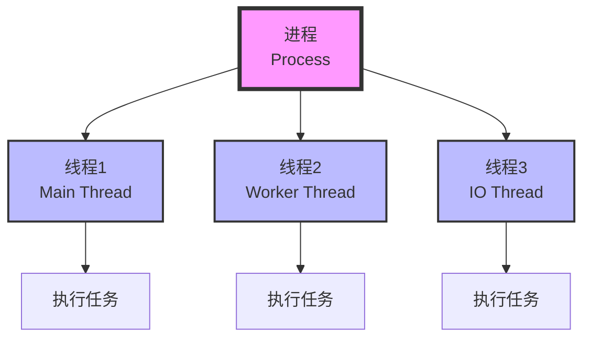

# 多线程基础

> **学习目标**：掌握Java多线程编程基础
> **核心内容**：线程创建、线程同步、线程通信、线程池、并发工具
> **预计时间**：5小时

## 多线程概述

### 什么是多线程？

线程是程序执行的最小单位，一个进程可以包含多个线程。多线程允许程序同时执行多个任务，提高CPU利用率。



### 多线程的优势

```text
✅ 提高CPU利用率
✅ 提高程序响应速度
✅ 适合处理IO密集型任务
✅ 简化程序设计

⚠️ 注意：多线程也会带来复杂性
   - 线程安全问题
   - 死锁问题
   - 上下文切换开销
```

## 线程的创建与使用

### 方式1：继承Thread类

```java
/**
 * 方式1：继承Thread类
 */
class MyThread extends Thread {
    private String name;

    public MyThread(String name) {
        this.name = name;
    }

    @Override
    public void run() {
        for (int i = 0; i < 5; i++) {
            System.out.println(name + " 运行: " + i);
            try {
                Thread.sleep(1000);  // 休眠1秒
            } catch (InterruptedException e) {
                System.out.println("线程被中断");
            }
        }
    }
}

public class ThreadDemo1 {
    public static void main(String[] args) {
        // 创建线程
        MyThread thread1 = new MyThread("线程A");
        MyThread thread2 = new MyThread("线程B");

        // 启动线程（调用start方法，不是run方法）
        thread1.start();
        thread2.start();

        System.out.println("主线程继续执行");
    }
}
```

### 方式2：实现Runnable接口

```java
/**
 * 方式2：实现Runnable接口（推荐）
 */
class MyRunnable implements Runnable {
    private String name;

    public MyRunnable(String name) {
        this.name = name;
    }

    @Override
    public void run() {
        for (int i = 0; i < 5; i++) {
            System.out.println(name + " 运行: " + i);
            try {
                Thread.sleep(1000);
            } catch (InterruptedException e) {
                System.out.println("线程被中断");
                return;
            }
        }
    }
}

public class ThreadDemo2 {
    public static void main(String[] args) {
        // 创建Runnable对象
        MyRunnable runnable1 = new MyRunnable("线程A");
        MyRunnable runnable2 = new MyRunnable("线程B");

        // 创建线程
        Thread thread1 = new Thread(runnable1);
        Thread thread2 = new Thread(runnable2);

        // 启动线程
        thread1.start();
        thread2.start();

        // 使用Lambda表达式（Java 8+）
        Thread thread3 = new Thread(() -> {
            for (int i = 0; i < 3; i++) {
                System.out.println("Lambda线程: " + i);
                try {
                    Thread.sleep(500);
                } catch (InterruptedException e) {
                    Thread.currentThread().interrupt();
                }
            }
        });
        thread3.start();
    }
}
```

### 方式3：实现Callable接口

```java
import java.util.concurrent.*;

/**
 * 方式3：实现Callable接口（可以返回结果）
 */
class MyCallable implements Callable<Integer> {
    private String name;

    public MyCallable(String name) {
        this.name = name;
    }

    @Override
    public Integer call() throws Exception {
        int sum = 0;
        for (int i = 1; i <= 100; i++) {
            sum += i;
            System.out.println(name + " 计算: " + i);
            Thread.sleep(10);
        }
        return sum;
    }
}

public class ThreadDemo3 {
    public static void main(String[] args) {
        // 创建Callable对象
        MyCallable callable = new MyCallable("计算线程");

        // 创建FutureTask
        FutureTask<Integer> futureTask = new FutureTask<>(callable);

        // 创建线程
        Thread thread = new Thread(futureTask);
        thread.start();

        // 获取结果（阻塞等待）
        try {
            Integer result = futureTask.get();
            System.out.println("计算结果: " + result);
        } catch (InterruptedException | ExecutionException e) {
            System.out.println("获取结果失败: " + e.getMessage());
        }

        // 使用ExecutorService
        ExecutorService executor = Executors.newFixedThreadPool(2);

        Future<Integer> future1 = executor.submit(new MyCallable("线程1"));
        Future<Integer> future2 = executor.submit(new MyCallable("线程2"));

        try {
            Integer result1 = future1.get();
            Integer result2 = future2.get();
            System.out.println("线程1结果: " + result1);
            System.out.println("线程2结果: " + result2);
        } catch (InterruptedException | ExecutionException e) {
            e.printStackTrace();
        } finally {
            executor.shutdown();
        }
    }
}
```

## 线程生命周期

```java
/**
 * 线程生命周期
 *
 * NEW（新建）→ RUNNABLE（可运行）→ RUNNING（运行中）
 *                ↓
 *             BLOCKED（阻塞）
 *                ↓
 *             WAITING（等待）
 *                ↓
 *             TIMED_WAITING（计时等待）
 *                ↓
 *             TERMINATED（终止）
 */
public class ThreadLifecycle {
    public static void main(String[] args) {
        Thread thread = new Thread(() -> {
            try {
                System.out.println("线程运行中");
                Thread.sleep(1000);
                System.out.println("线程继续运行");
            } catch (InterruptedException e) {
                Thread.currentThread().interrupt();
            }
        });

        System.out.println("状态: " + thread.getState());  // NEW

        thread.start();
        System.out.println("状态: " + thread.getState());  // RUNNABLE

        try {
            Thread.sleep(500);
            System.out.println("状态: " + thread.getState());  // TIMED_WAITING

            thread.join();
            System.out.println("状态: " + thread.getState());  // TERMINATED
        } catch (InterruptedException e) {
            Thread.currentThread().interrupt();
        }
    }
}
```

## 线程同步

### synchronized关键字

```java
/**
 * 线程安全问题示例
 */
class UnsafeBank {
    private int balance = 1000;

    // ❌ 不安全的取款方法
    public void unsafeWithdraw(int amount) {
        if (balance >= amount) {
            try {
                Thread.sleep(100);  // 模拟延迟
            } catch (InterruptedException e) {
                Thread.currentThread().interrupt();
            }
            balance -= amount;
            System.out.println("取款成功，余额: " + balance);
        } else {
            System.out.println("余额不足");
        }
    }

    // ✅ 安全的取款方法（同步方法）
    public synchronized void safeWithdraw(int amount) {
        if (balance >= amount) {
            try {
                Thread.sleep(100);
            } catch (InterruptedException e) {
                Thread.currentThread().interrupt();
            }
            balance -= amount;
            System.out.println("取款成功，余额: " + balance);
        } else {
            System.out.println("余额不足");
        }
    }

    // ✅ 同步代码块
    public void withdrawWithBlock(int amount) {
        synchronized (this) {  // 锁定当前对象
            if (balance >= amount) {
                try {
                    Thread.sleep(100);
                } catch (InterruptedException e) {
                    Thread.currentThread().interrupt();
                }
                balance -= amount;
                System.out.println("取款成功，余额: " + balance);
            } else {
                System.out.println("余额不足");
            }
        }
    }
}

public class SynchronizationDemo {
    public static void main(String[] args) {
        UnsafeBank bank = new UnsafeBank();

        // 创建多个线程同时取款
        Thread t1 = new Thread(() -> bank.safeWithdraw(600));
        Thread t2 = new Thread(() -> bank.safeWithdraw(600));

        t1.start();
        t2.start();
    }
}
```

### Lock接口

```java
import java.util.concurrent.locks.*;

/**
 * 使用Lock接口实现同步
 */
class SafeBankWithLock {
    private int balance = 1000;
    private final Lock lock = new ReentrantLock();

    public void withdraw(int amount) {
        lock.lock();  // 获取锁
        try {
            if (balance >= amount) {
                try {
                    Thread.sleep(100);
                } catch (InterruptedException e) {
                    Thread.currentThread().interrupt();
                }
                balance -= amount;
                System.out.println("取款成功，余额: " + balance);
            } else {
                System.out.println("余额不足");
            }
        } finally {
            lock.unlock();  // 释放锁（必须在finally中）
        }
    }

    // 尝试获取锁
    public boolean tryWithdraw(int amount) {
        if (lock.tryLock()) {  // 尝试获取锁（不阻塞）
            try {
                if (balance >= amount) {
                    balance -= amount;
                    System.out.println("取款成功，余额: " + balance);
                    return true;
                }
                return false;
            } finally {
                lock.unlock();
            }
        }
        System.out.println("获取锁失败");
        return false;
    }
}

public class LockDemo {
    public static void main(String[] args) {
        SafeBankWithLock bank = new SafeBankWithLock();

        Thread t1 = new Thread(() -> bank.withdraw(600));
        Thread t2 = new Thread(() -> bank.withdraw(600));

        t1.start();
        t2.start();
    }
}
```

## 线程通信

### wait/notify机制

```java
/**
 * 生产者-消费者模式（使用wait/notify）
 */
class SharedBuffer {
    private int data;
    private boolean hasData = false;

    // 生产数据
    public synchronized void produce(int value) {
        while (hasData) {  // 如果有数据，等待
            try {
                wait();
            } catch (InterruptedException e) {
                Thread.currentThread().interrupt();
            }
        }

        data = value;
        hasData = true;
        System.out.println("生产: " + data);
        notify();  // 唤醒消费者
    }

    // 消费数据
    public synchronized int consume() {
        while (!hasData) {  // 如果没有数据，等待
            try {
                wait();
            } catch (InterruptedException e) {
                Thread.currentThread().interrupt();
                return -1;
            }
        }

        hasData = false;
        System.out.println("消费: " + data);
        notify();  // 唤醒生产者
        return data;
    }
}

public class ProducerConsumer {
    public static void main(String[] args) {
        SharedBuffer buffer = new SharedBuffer();

        // 生产者线程
        Thread producer = new Thread(() -> {
            for (int i = 1; i <= 5; i++) {
                buffer.produce(i);
                try {
                    Thread.sleep(100);
                } catch (InterruptedException e) {
                    Thread.currentThread().interrupt();
                }
            }
        });

        // 消费者线程
        Thread consumer = new Thread(() -> {
            for (int i = 1; i <= 5; i++) {
                buffer.consume();
                try {
                    Thread.sleep(150);
                } catch (InterruptedException e) {
                    Thread.currentThread().interrupt();
                }
            }
        });

        producer.start();
        consumer.start();
    }
}
```

### 使用BlockingQueue

```java
import java.util.concurrent.*;

/**
 * 使用BlockingQueue实现生产者-消费者
 */
public class ProducerConsumerWithQueue {
    public static void main(String[] args) {
        BlockingQueue<Integer> queue = new ArrayBlockingQueue<>(5);

        // 生产者
        Runnable producer = () -> {
            try {
                for (int i = 1; i <= 10; i++) {
                    queue.put(i);  // 如果队列满，自动等待
                    System.out.println("生产: " + i);
                    Thread.sleep(100);
                }
            } catch (InterruptedException e) {
                Thread.currentThread().interrupt();
            }
        };

        // 消费者
        Runnable consumer = () -> {
            try {
                for (int i = 1; i <= 10; i++) {
                    int value = queue.take();  // 如果队列空，自动等待
                    System.out.println("消费: " + value);
                    Thread.sleep(150);
                }
            } catch (InterruptedException e) {
                Thread.currentThread().interrupt();
            }
        };

        new Thread(producer).start();
        new Thread(consumer).start();
    }
}
```

## 线程池

### ExecutorService

```java
import java.util.concurrent.*;

/**
 * 线程池示例
 */
public class ThreadPoolDemo {
    public static void main(String[] args) {
        // 创建固定大小线程池
        ExecutorService fixedPool = Executors.newFixedThreadPool(3);

        // 创建缓存线程池
        ExecutorService cachedPool = Executors.newCachedThreadPool();

        // 创建单线程池
        ExecutorService singlePool = Executors.newSingleThreadExecutor();

        // 提交任务
        for (int i = 1; i <= 5; i++) {
            final int taskId = i;
            fixedPool.submit(() -> {
                System.out.println("任务" + taskId + " 执行，线程: " +
                    Thread.currentThread().getName());
                try {
                    Thread.sleep(1000);
                } catch (InterruptedException e) {
                    Thread.currentThread().interrupt();
                }
            });
        }

        // 关闭线程池
        fixedPool.shutdown();
        try {
            if (!fixedPool.awaitTermination(60, TimeUnit.SECONDS)) {
                fixedPool.shutdownNow();
            }
        } catch (InterruptedException e) {
            fixedPool.shutdownNow();
            Thread.currentThread().interrupt();
        }
    }
}
```

### ThreadPoolExecutor

```java
import java.util.concurrent.*;

/**
 * 自定义线程池
 */
public class CustomThreadPool {
    public static void main(String[] args) {
        // 核心线程数
        int corePoolSize = 2;
        // 最大线程数
        int maximumPoolSize = 4;
        // 空闲线程存活时间
        long keepAliveTime = 60;
        // 时间单位
        TimeUnit unit = TimeUnit.SECONDS;
        // 工作队列
        BlockingQueue<Runnable> workQueue = new LinkedBlockingQueue<>(10);
        // 线程工厂
        ThreadFactory threadFactory = Executors.defaultThreadFactory();
        // 拒绝策略
        RejectedExecutionHandler handler = new ThreadPoolExecutor.AbortPolicy();

        ThreadPoolExecutor executor = new ThreadPoolExecutor(
            corePoolSize,
            maximumPoolSize,
            keepAliveTime,
            unit,
            workQueue,
            threadFactory,
            handler
        );

        // 提交任务
        for (int i = 1; i <= 10; i++) {
            final int taskId = i;
            executor.submit(() -> {
                System.out.println("任务" + taskId + " 执行");
                try {
                    Thread.sleep(1000);
                } catch (InterruptedException e) {
                    Thread.currentThread().interrupt();
                }
            });
        }

        // 关闭线程池
        executor.shutdown();
    }
}
```

## 并发工具类

### CountDownLatch

```java
import java.util.concurrent.*;

/**
 * CountDownLatch：倒计时门栓
 */
public class CountDownLatchDemo {
    public static void main(String[] args) {
        // 创建倒计数器（计数为3）
        CountDownLatch latch = new CountDownLatch(3);

        // 创建3个工作线程
        for (int i = 1; i <= 3; i++) {
            final int taskId = i;
            new Thread(() -> {
                try {
                    System.out.println("任务" + taskId + " 开始");
                    Thread.sleep(1000);
                    System.out.println("任务" + taskId + " 完成");
                } catch (InterruptedException e) {
                    Thread.currentThread().interrupt();
                } finally {
                    latch.countDown();  // 计数减1
                }
            }).start();
        }

        try {
            // 主线程等待所有任务完成
            latch.await();
            System.out.println("所有任务完成，主线程继续");
        } catch (InterruptedException e) {
            Thread.currentThread().interrupt();
        }
    }
}
```

### CyclicBarrier

```java
import java.util.concurrent.*;

/**
 * CyclicBarrier：循环屏障
 */
public class CyclicBarrierDemo {
    public static void main(String[] args) {
        // 创建屏障（3个线程到达时触发）
        CyclicBarrier barrier = new CyclicBarrier(3, () -> {
            System.out.println("所有线程已到达屏障点");
        });

        // 创建3个线程
        for (int i = 1; i <= 3; i++) {
            final int threadId = i;
            new Thread(() -> {
                try {
                    System.out.println("线程" + threadId + " 执行第一阶段");
                    Thread.sleep(1000);

                    // 等待其他线程
                    barrier.await();

                    System.out.println("线程" + threadId + " 执行第二阶段");
                } catch (InterruptedException | BrokenBarrierException e) {
                    Thread.currentThread().interrupt();
                }
            }).start();
        }
    }
}
```

### Semaphore

```java
import java.util.concurrent.*;

/**
 * Semaphore：信号量（控制同时访问的线程数）
 */
public class SemaphoreDemo {
    public static void main(String[] args) {
        // 创建信号量（允许2个线程同时访问）
        Semaphore semaphore = new Semaphore(2);

        // 创建5个线程
        for (int i = 1; i <= 5; i++) {
            final int threadId = i;
            new Thread(() -> {
                try {
                    // 获取许可
                    semaphore.acquire();
                    System.out.println("线程" + threadId + " 获得许可");

                    // 模拟工作
                    Thread.sleep(2000);

                    System.out.println("线程" + threadId + " 释放许可");
                } catch (InterruptedException e) {
                    Thread.currentThread().interrupt();
                } finally {
                    // 释放许可
                    semaphore.release();
                }
            }).start();
        }
    }
}
```

## 常见错误与避坑指南

### 1. 死锁

```java
// ❌ 容易死锁的情况
class DeadlockExample {
    private final Object lock1 = new Object();
    private final Object lock2 = new Object();

    public void method1() {
        synchronized (lock1) {
            synchronized (lock2) {
                // ...
            }
        }
    }

    public void method2() {
        synchronized (lock2) {  // 锁顺序不一致
            synchronized (lock1) {
                // ...
            }
        }
    }
}

// ✅ 正确做法：保持锁顺序一致
```

### 2. 忘记释放锁

```java
// ❌ 错误
lock.lock();
// 如果这里抛出异常，锁不会释放
// ...代码
lock.unlock();

// ✅ 正确
lock.lock();
try {
    // ...代码
} finally {
    lock.unlock();
}
```

## 练习题

### 基础练习

1. **多线程打印**：使用两个线程交替打印数字

2. **生产者消费者**：实现简单的生产者-消费者模式

### 进阶练习

3. **线程池**：实现一个简单的线程池

4. **并发下载**：使用多线程下载文件

### 挑战练习

5. **银行转账**：使用多线程模拟银行转账，保证线程安全

## 本章小结

### 知识点回顾

✅ **线程创建**：Thread、Runnable、Callable
✅ **线程生命周期**：NEW、RUNNABLE、BLOCKED等
✅ **线程同步**：synchronized、Lock
✅ **线程通信**：wait/notify、BlockingQueue
✅ **线程池**：ExecutorService、ThreadPoolExecutor
✅ **并发工具**：CountDownLatch、CyclicBarrier、Semaphore

### 学习成果

完成本章学习后，你应该能够：
- 创建和使用线程
- 实现线程同步
- 使用线程池提高效率
- 避免常见的并发问题

### 下一步

恭喜你掌握了多线程基础！下一章我们将学习泛型与注解。

**准备好了吗？让我们继续Java之旅！** 🚀

---

**学习时间**：约5小时
**难度等级**：★★★★☆
**下一章**：[泛型与注解](./chapter-121.md)
