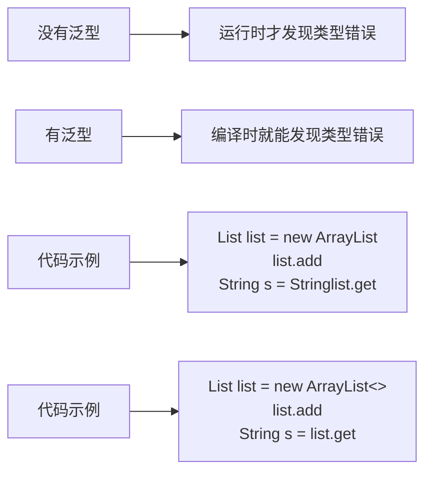

# 泛型与注解

> **学习目标**：掌握Java泛型和注解的使用
> **核心内容**：泛型类、泛型方法、通配符、自定义注解、元注解
> **预计时间**：3小时

## 泛型概述

### 什么是泛型？

泛型是Java 5引入的特性，允许在定义类、接口和方法时使用类型参数。泛型提供了编译时类型安全检查，减少了类型转换。



### 泛型的优势

```java
/**
 * 泛型优势示例
 */
public class GenericBenefits {
    public static void main(String[] args) {
        // ❌ 没有泛型：不安全
        List list1 = new ArrayList();
        list1.add("Hello");
        list1.add(123);  // 可以添加不同类型
        String s1 = (String) list1.get(0);  // 需要强制转换
        // String s2 = (String) list1.get(1);  // 运行时错误！

        // ✅ 有泛型：安全
        List<String> list2 = new ArrayList<>();
        list2.add("Hello");
        // list2.add(123);  // 编译错误！
        String s3 = list2.get(0);  // 不需要转换

        // 优势总结
        // 1. 类型安全：编译时检查
        // 2. 消除强制转换
        // 3. 代码可读性更好
        // 4. 代码复用性更高
    }
}
```

## 泛型类和接口

### 泛型类

```java
/**
 * 泛型类示例
 */
// 简单的泛型类
class Box<T> {
    private T value;

    public void set(T value) {
        this.value = value;
    }

    public T get() {
        return value;
    }
}

// 多个类型参数
class Pair<K, V> {
    private K key;
    private V value;

    public Pair(K key, V value) {
        this.key = key;
        this.value = value;
    }

    public K getKey() {
        return key;
    }

    public V getValue() {
        return value;
    }
}

// 类型参数约束
class NumberBox<T extends Number> {
    private T value;

    public NumberBox(T value) {
        this.value = value;
    }

    public double doubleValue() {
        return value.doubleValue();
    }
}

public class GenericClassDemo {
    public static void main(String[] args) {
        // 使用泛型类
        Box<String> stringBox = new Box<>();
        stringBox.set("Hello");
        String s = stringBox.get();
        System.out.println(s);

        Box<Integer> intBox = new Box<>();
        intBox.set(123);
        Integer i = intBox.get();
        System.out.println(i);

        // 使用Pair
        Pair<String, Integer> pair = new Pair<>("年龄", 25);
        System.out.println(pair.getKey() + ": " + pair.getValue());

        // 类型参数约束
        NumberBox<Integer> intNumBox = new NumberBox<>(10);
        System.out.println(intNumBox.doubleValue());

        NumberBox<Double> doubleNumBox = new NumberBox<>(3.14);
        System.out.println(doubleNumBox.doubleValue());

        // NumberBox<String> stringNumBox = new NumberBox<>("Hello");  // 编译错误
    }
}
```

### 泛型接口

```java
/**
 * 泛型接口示例
 */
// 泛型接口
interface Container<T> {
    void add(T item);
    T get(int index);
    int size();
}

// 实现泛型接口（指定类型参数）
class StringContainer implements Container<String> {
    private String[] items = new String[10];
    private int count = 0;

    @Override
    public void add(String item) {
        if (count < items.length) {
            items[count++] = item;
        }
    }

    @Override
    public String get(int index) {
        if (index >= 0 && index < count) {
            return items[index];
        }
        return null;
    }

    @Override
    public int size() {
        return count;
    }
}

// 实现泛型接口（保持泛型）
class GenericContainer<T> implements Container<T> {
    private Object[] items = new Object[10];
    private int count = 0;

    @Override
    public void add(T item) {
        if (count < items.length) {
            items[count++] = item;
        }
    }

    @Override
    @SuppressWarnings("unchecked")
    public T get(int index) {
        if (index >= 0 && index < count) {
            return (T) items[index];
        }
        return null;
    }

    @Override
    public int size() {
        return count;
    }
}

public class GenericInterfaceDemo {
    public static void main(String[] args) {
        // 使用StringContainer
        Container<String> stringContainer = new StringContainer();
        stringContainer.add("Hello");
        stringContainer.add("World");
        System.out.println("Size: " + stringContainer.size());

        // 使用GenericContainer
        Container<Integer> intContainer = new GenericContainer<>();
        intContainer.add(1);
        intContainer.add(2);
        System.out.println("Size: " + intContainer.size());
    }
}
```

## 泛型方法

```java
/**
 * 泛型方法示例
 */
public class GenericMethodDemo {

    // 简单的泛型方法
    public static <T> void print(T item) {
        System.out.println(item);
    }

    // 多个类型参数
    public static <K, V> void printPair(K key, V value) {
        System.out.println(key + " = " + value);
    }

    // 有界类型参数
    public static <T extends Comparable<T>> T max(T x, T y, T z) {
        T max = x;
        if (y.compareTo(max) > 0) {
            max = y;
        }
        if (z.compareTo(max) > 0) {
            max = z;
        }
        return max;
    }

    // 泛型数组创建
    public static <T> T[] toArray(T... items) {
        return items;
    }

    public static void main(String[] args) {
        // 调用泛型方法
        print("Hello");
        print(123);
        print(3.14);

        printPair("姓名", "张三");
        printPair("年龄", 25);

        // 调用有界类型参数方法
        System.out.println("Max: " + max(3, 5, 1));
        System.out.println("Max: " + max("Apple", "Banana", "Cherry"));

        // 使用泛型数组
        String[] strings = toArray("A", "B", "C");
        System.out.println(Arrays.toString(strings));
    }
}
```

## 类型通配符

### 通配符的使用

```java
import java.util.*;

/**
 * 类型通配符示例
 */
public class WildcardDemo {

    // 无界通配符：可以接受任何类型
    public static void printList(List<?> list) {
        for (Object item : list) {
            System.out.println(item);
        }
        // list.add("Hello");  // 编译错误！不能添加元素
    }

    // 上界通配符：? extends T
    public static double sum(List<? extends Number> list) {
        double total = 0;
        for (Number number : list) {
            total += number.doubleValue();
        }
        return total;
        // list.add(10);  // 编译错误！不能添加元素
    }

    // 下界通配符：? super T
    public static void addNumbers(List<? super Integer> list) {
        list.add(10);  // 可以添加Integer或其子类
        list.add(20);
    }

    // PECS原则：Producer Extends, Consumer Super
    public static void copy(List<? extends Number> source,
                           List<? super Number> dest) {
        for (Number number : source) {
            dest.add(number);
        }
    }

    public static void main(String[] args) {
        // 无界通配符
        List<String> strings = Arrays.asList("A", "B", "C");
        List<Integer> integers = Arrays.asList(1, 2, 3);
        printList(strings);
        printList(integers);

        // 上界通配符
        List<Integer> intList = Arrays.asList(1, 2, 3);
        List<Double> doubleList = Arrays.asList(1.1, 2.2, 3.3);
        System.out.println("Sum: " + sum(intList));
        System.out.println("Sum: " + sum(doubleList));

        // 下界通配符
        List<Number> numbers = new ArrayList<>();
        addNumbers(numbers);
        System.out.println("Numbers: " + numbers);

        List<Object> objects = new ArrayList<>();
        addNumbers(objects);
        System.out.println("Objects: " + objects);
    }
}
```

## 类型擦除

```java
import java.util.*;

/**
 * 类型擦除示例
 */
public class TypeErasureDemo {

    public static void main(String[] args) {
        // 泛型信息只在编译时存在
        List<String> stringList = new ArrayList<>();
        List<Integer> intList = new ArrayList<>();

        // 运行时类型相同
        System.out.println(stringList.getClass());  // class java.util.ArrayList
        System.out.println(intList.getClass());     // class java.util.ArrayList
        System.out.println(stringList.getClass() == intList.getClass());  // true

        // 不能直接创建泛型数组
        // List<String>[] arrayOfLists = new List<String>[10];  // 编译错误

        // 正确做法
        List<String>[] arrayOfLists = new List[10];
        arrayOfLists[0] = new ArrayList<>();

        // 类型擦除的限制
        // 1. 不能使用基本类型作为类型参数
        // List<int> list = new ArrayList<int>();  // 编译错误
        List<Integer> list = new ArrayList<>();  // 使用包装类

        // 2. 不能创建泛型类型的实例
        // T item = new T();  // 编译错误

        // 3. 不能创建泛型数组
        // T[] array = new T[10];  // 编译错误
    }

    // 类型擦除后的方法
    public static <T> void genericMethod(T item) {
        // 运行时无法获取T的类型
        System.out.println(item.getClass());
    }

    // 使用类型标记
    public static <T> T createInstance(Class<T> clazz)
        throws InstantiationException, IllegalAccessException {
        return clazz.newInstance();
    }
}
```

## 注解概述

### 什么是注解？

注解（Annotation）是Java 5引入的元数据机制，用于在代码中添加信息。注解不会直接影响代码的执行，但可以被编译器或运行时工具处理。

```mermaid
graph TD
    A[注解用途] --> B[编译器指令]
    A --> C[编译时处理]
    A --> D[运行时处理]

    B --> B1[@Override<br/>@SuppressWarnings]
    C --> C1[@Generated<br/>生成代码]
    D --> D1[@Deprecated<br/>反射获取]
```

## 内置注解

### 常用内置注解

```java
import java.util.*;

/**
 * 内置注解示例
 */
public class BuiltinAnnotations {

    // @Override：重写父类方法
    @Override
    public String toString() {
        return "BuiltinAnnotations";
    }

    // 如果不重写，编译器会报错
    // @Override
    // public void someMethod() { }  // 编译错误

    // @Deprecated：标记已过时
    @Deprecated
    public void oldMethod() {
        System.out.println("这是旧方法，请使用新方法");
    }

    public void newMethod() {
        System.out.println("这是新方法");
    }

    // @SuppressWarnings：抑制警告
    @SuppressWarnings("unchecked")
    public void suppressWarning() {
        List list = new ArrayList();
        list.add("Hello");
        // 不使用@SuppressWarnings会有编译警告
    }

    @SuppressWarnings({"rawtypes", "unused"})
    public void multipleWarnings() {
        List list = new ArrayList();
        int unusedVariable = 10;
    }

    // @FunctionalInterface：函数式接口（Java 8+）
    @FunctionalInterface
    interface MyFunctionalInterface {
        void doSomething();

        // 可以有Object类的方法
        String toString();

        // 可以有default方法
        default void doDefault() {
            System.out.println("Default method");
        }
    }

    // @SafeVarargs：可变参数安全（Java 7+）
    @SafeVarargs
    public final void safeVarargsMethod(String... strings) {
        for (String s : strings) {
            System.out.println(s);
        }
    }
}
```

## 自定义注解

### 定义和使用注解

```java
import java.lang.annotation.*;

/**
 * 自定义注解示例
 */

// 定义注解
@Retention(RetentionPolicy.RUNTIME)  // 运行时保留
@Target(ElementType.TYPE)             // 用于类、接口等
@interface Author {
    String name();
    String date();
    int version() default 1;  // 默认值
}

@Target({
    ElementType.FIELD,
    ElementType.METHOD,
    ElementType.PARAMETER
})
@Retention(RetentionPolicy.RUNTIME)
@interface MyAnnotation {
    String value();
    String[] tags() default {};
}

// 使用自定义注解
@Author(name = "小徐", date = "2024-01-01", version = 2)
public class CustomAnnotationDemo {

    @MyAnnotation(value = "用户名", tags = {"必填", "唯一"})
    private String username;

    @MyAnnotation(value = "年龄", tags = {"可选"})
    private int age;

    @MyAnnotation("密码")  // 如果只有value属性，可以省略value=
    private String password;

    @Author(name = "Author2", date = "2024-01-02")
    public void annotatedMethod() {
        System.out.println("带注解的方法");
    }

    public static void main(String[] args) {
        // 反射读取注解
        Class<CustomAnnotationDemo> clazz = CustomAnnotationDemo.class;

        // 读取类注解
        if (clazz.isAnnotationPresent(Author.class)) {
            Author author = clazz.getAnnotation(Author.class);
            System.out.println("作者: " + author.name());
            System.out.println("日期: " + author.date());
            System.out.println("版本: " + author.version());
        }

        // 读取字段注解
        try {
            java.lang.reflect.Field field = clazz.getDeclaredField("username");
            if (field.isAnnotationPresent(MyAnnotation.class)) {
                MyAnnotation annotation = field.getAnnotation(MyAnnotation.class);
                System.out.println("字段注解: " + annotation.value());
                System.out.println("标签: " + Arrays.toString(annotation.tags()));
            }
        } catch (NoSuchFieldException e) {
            e.printStackTrace();
        }

        // 读取方法注解
        try {
            java.lang.reflect.Method method = clazz.getMethod("annotatedMethod");
            if (method.isAnnotationPresent(Author.class)) {
                Author author = method.getAnnotation(Author.class);
                System.out.println("方法作者: " + author.name());
            }
        } catch (NoSuchMethodException e) {
            e.printStackTrace();
        }
    }
}
```

## 元注解

```java
import java.lang.annotation.*;

/**
 * 元注解示例
 */

// @Retention：注解的生命周期
@Retention(RetentionPolicy.SOURCE)        // 源码级别，编译时丢弃
@interface SourceAnnotation {
}

@Retention(RetentionPolicy.CLASS)         // 类文件级别，JVM不保留
@interface ClassAnnotation {
}

@Retention(RetentionPolicy.RUNTIME)       // 运行时级别，可以通过反射获取
@interface RuntimeAnnotation {
}

// @Target：注解的使用目标
@Target(ElementType.TYPE)                 // 类、接口、枚举
@interface TypeAnnotation {
}

@Target(ElementType.FIELD)                // 字段
@interface FieldAnnotation {
}

@Target(ElementType.METHOD)               // 方法
@interface MethodAnnotation {
}

@Target(ElementType.PARAMETER)            // 参数
@interface ParameterAnnotation {
}

@Target(ElementType.CONSTRUCTOR)          // 构造方法
@interface ConstructorAnnotation {
}

@Target({ElementType.TYPE, ElementType.METHOD})  // 多个目标
@interface MultipleTargetAnnotation {
}

// @Documented：包含在JavaDoc中
@Documented
@Retention(RetentionPolicy.RUNTIME)
@interface DocumentedAnnotation {
    String value();
}

// @Inherited：可以被继承
@Inherited
@Retention(RetentionPolicy.RUNTIME)
@interface InheritedAnnotation {
    String value();
}

@InheritedAnnotation("父类注解")
class ParentClass {
}

// 子类会继承父类的@Inherited注解
class ChildClass extends ParentClass {
}

public class MetaAnnotationDemo {
    public static void main(String[] args) {
        // 测试继承注解
        Class<ChildClass> clazz = ChildClass.class;
        if (clazz.isAnnotationPresent(InheritedAnnotation.class)) {
            InheritedAnnotation annotation = clazz.getAnnotation(InheritedAnnotation.class);
            System.out.println("继承的注解值: " + annotation.value());
        }
    }
}
```

## 注解的实际应用

### 简单的框架示例

```java
import java.lang.annotation.*;
import java.lang.reflect.*;

/**
 * 使用注解实现简单的依赖注入
 */

// 依赖注解
@Retention(RetentionPolicy.RUNTIME)
@Target(ElementType.FIELD)
@interface Autowired {
}

// 组件注解
@Retention(RetentionPolicy.RUNTIME)
@Target(ElementType.TYPE)
@interface Component {
    String value() default "";
}

// 服务类
@Component("userService")
class UserService {
    public void addUser() {
        System.out.println("添加用户");
    }
}

// 控制器类
@Component
class UserController {
    @Autowired
    private UserService userService;  // 自动注入

    public void handleRequest() {
        userService.addUser();
    }
}

// 简单的容器
class SimpleContainer {
    public static <T> T getInstance(Class<T> clazz) throws Exception {
        T instance = clazz.getDeclaredConstructor().newInstance();

        // 处理@Autowired注解
        for (Field field : clazz.getDeclaredFields()) {
            if (field.isAnnotationPresent(Autowired.class)) {
                field.setAccessible(true);
                Class<?> fieldType = field.getType();
                Object dependency = getInstance(fieldType);
                field.set(instance, dependency);
            }
        }

        return instance;
    }

    public static void main(String[] args) throws Exception {
        UserController controller = getInstance(UserController.class);
        controller.handleRequest();
    }
}
```

## 常见错误与避坑指南

### 1. 泛型数组

```java
// ❌ 错误：不能创建泛型数组
List<String>[] array = new List<String>[10];

// ✅ 正确：使用通配符
List<?>[] array = new List<?>[10];

// ✅ 或者使用List<List<String>>
List<List<String>> list = new ArrayList<>();
```

### 2. 泛型和异常

```java
// ❌ 错误：不能创建泛型异常类
// class GenericException<T> extends Exception { }

// ✅ 正确：使用具体类型
class MyException extends Exception { }
```

## 练习题

### 基础练习

1. **泛型类**：实现一个Stack泛型类

2. **自定义注解**：创建一个用于数据验证的注解

### 进阶练习

3. **泛型方法**：实现通用的排序方法

4. **注解处理器**：使用注解实现简单的ORM映射

### 挑战练习

5. **综合应用**：实现一个简单的依赖注入框架

## 本章小结

### 知识点回顾

✅ **泛型**：泛型类、泛型接口、泛型方法
✅ **通配符**：?、? extends、? super
✅ **类型擦除**：泛型的运行时行为
✅ **注解**：内置注解、自定义注解
✅ **元注解**：@Retention、@Target等
✅ **反射**：运行时读取注解信息

### 学习成果

完成本章学习后，你应该能够：
- 使用泛型编写类型安全的代码
- 理解类型擦除的影响
- 创建和使用自定义注解
- 使用反射处理注解

### 下一步

恭喜你掌握了泛型与注解！下一章我们将学习Lambda表达式与Stream API。

**准备好了吗？让我们继续Java之旅！** 🚀

---

**学习时间**：约3小时
**难度等级**：★★★☆☆
**下一章**：[Lambda表达式与Stream API](./chapter-122.md)
