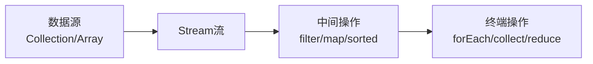

# Lambda表达式与Stream API

> **学习目标**：掌握Java函数式编程
> **核心内容**：Lambda表达式、Stream API、Optional、CompletableFuture
> **预计时间**：4小时

## Lambda表达式

### 什么是Lambda？

Lambda表达式是Java 8引入的函数式编程特性，允许将函数作为方法参数传递。Lambda提供了一种简洁、灵活的方式来表示匿名函数。

```mermaid
graph LR
    A[传统匿名内部类] --> B[繁琐的语法]
    C[Lambda表达式] --> D[简洁的语法]

    E[示例] --> F[new Runnable {public void run {System.out.println}}]
    G[示例] --> H[-> System.out.println]
```

### Lambda语法

```java
/**
 * Lambda表达式语法
 *
 * 基本语法：(参数) -> {方法体}
 *
 * - 参数列表：可以省略参数类型
 * - 箭头：-> 分隔参数和方法体
 * - 方法体：可以是表达式或代码块
 */
public class LambdaSyntax {

    public static void main(String[] args) {
        // 1. 无参数，无返回值
        Runnable runnable1 = () -> System.out.println("Hello Lambda");
        Runnable runnable2 = () -> {
            System.out.println("Hello");
            System.out.println("Lambda");
        };

        // 2. 一个参数，可以省略括号
        Consumer<String> consumer1 = (s) -> System.out.println(s);
        Consumer<String> consumer2 = s -> System.out.println(s);

        // 3. 多个参数
        BiFunction<Integer, Integer, Integer> add = (a, b) -> a + b;

        // 4. 显式声明参数类型
        BiFunction<Integer, Integer, Integer> multiply =
            (Integer a, Integer b) -> a * b;

        // 5. 多行方法体
        BiFunction<Integer, Integer, Integer> complex = (a, b) -> {
            int sum = a + b;
            int product = a * b;
            return sum + product;
        };
    }

    @FunctionalInterface
    interface Consumer<T> {
        void accept(T t);
    }
}
```

### 函数式接口

```java
import java.util.function.*;

/**
 * 常用的函数式接口
 */
public class FunctionalInterfaces {

    public static void main(String[] args) {
        // ========== Predicate<T>：谓词，返回boolean ==========

        // 判断是否为偶数
        Predicate<Integer> isEven = n -> n % 2 == 0;
        System.out.println("4是偶数? " + isEven.test(4));
        System.out.println("3是偶数? " + isEven.test(3));

        // 谓词组合
        Predicate<Integer> isPositive = n -> n > 0;
        Predicate<Integer> isEvenAndPositive = isEven.and(isPositive);
        System.out.println("4是正偶数? " + isEvenAndPositive.test(4));

        // ========== Function<T, R>：函数，T转为R ==========

        // 字符串转整数
        Function<String, Integer> strToInt = Integer::parseInt;
        Integer num = strToInt.apply("123");
        System.out.println("转换结果: " + num);

        // 函数组合
        Function<Integer, Integer> multiply2 = x -> x * 2;
        Function<Integer, Integer> add3 = x -> x + 3;
        Function<Integer, Integer> combined = multiply2.andThen(add3);
        System.out.println("先乘2再加3: " + combined.apply(5));  // 13

        // ========== Consumer<T>：消费者，接受参数无返回值 ==========

        // 打印字符串
        Consumer<String> printer = s -> System.out.println("输出: " + s);
        printer.accept("Hello Lambda");

        // 链式操作
        Consumer<String> upperCase = s -> System.out.println(s.toUpperCase());
        Consumer<String> lowerCase = s -> System.out.println(s.toLowerCase());
        upperCase.andThen(lowerCase).accept("Hello");

        // ========== Supplier<T>：供应者，无参数返回T ==========

        // 生成随机数
        Supplier<Double> random = () -> Math.random();
        System.out.println("随机数: " + random.get());

        // 创建对象
        Supplier<Person> personSupplier = () -> new Person("张三", 25);
        Person person = personSupplier.get();
        System.out.println(person);

        // ========== UnaryOperator<T>：一元运算，T -> T ==========

        // 字符串转大写
        UnaryOperator<String> toUpper = String::toUpperCase;
        System.out.println(toUpper.apply("hello"));

        // ========== BinaryOperator<T>：二元运算，(T, T) -> T ==========

        // 求最大值
        BinaryOperator<Integer> max = Integer::max;
        System.out.println("最大值: " + max.apply(10, 20));

        // 求和
        BinaryOperator<Integer> sum = Integer::sum;
        System.out.println("和: " + sum.apply(10, 20));
    }

    static class Person {
        String name;
        int age;

        public Person(String name, int age) {
            this.name = name;
            this.age = age;
        }

        @Override
        public String toString() {
            return "Person{name='" + name + "', age=" + age + "}";
        }
    }
}
```

### 方法引用

```java
import java.util.*;
import java.util.function.*;

/**
 * 方法引用：简化Lambda表达式
 */
public class MethodReference {

    public static void main(String[] args) {
        List<String> names = Arrays.asList("Alice", "Bob", "Charlie");

        // 1. 对象::实例方法
        Consumer<String> printer = System.out::println;
        names.forEach(printer);

        // 或直接使用
        names.forEach(System.out::println);

        // 2. 类::静态方法
        Function<String, Integer> parser = Integer::parseInt;
        Integer num = parser.apply("123");
        System.out.println(num);

        // 3. 类::实例方法（第一个参数是方法的调用者）
        BiFunction<String, String, Boolean> equals = String::equals;
        boolean result = equals.apply("hello", "hello");
        System.out.println("相等: " + result);

        // 4. 类::new（构造器引用）
        Supplier<Person> personSupplier = Person::new;
        Person person = personSupplier.get();

        // 带参数的构造器
        BiFunction<String, Integer, Person> personFactory = Person::new;
        Person person2 = personFactory.apply("张三", 25);

        // 5. 数组构造器引用
        Function<Integer, int[]> arrayFactory = int[]::new;
        int[] array = arrayFactory.apply(10);

        // 实际应用：排序
        List<Person> people = Arrays.asList(
            new Person("张三", 25),
            new Person("李四", 30),
            new Person("王五", 20)
        );

        // Lambda方式
        people.sort((p1, p2) -> p1.age - p2.age);

        // 方法引用方式
        people.sort(Comparator.comparing(Person::getAge));
        people.forEach(System.out::println);
    }

    static class Person {
        String name;
        int age;

        public Person() {
            this.name = "未知";
            this.age = 0;
        }

        public Person(String name, int age) {
            this.name = name;
            this.age = age;
        }

        public String getName() {
            return name;
        }

        public int getAge() {
            return age;
        }

        @Override
        public String toString() {
            return "Person{name='" + name + "', age=" + age + "}";
        }
    }
}
```

## Stream API

### Stream概述

Stream API是Java 8引入的用于集合处理的新抽象，支持声明式的函数式编程风格。



### Stream创建

```java
import java.util.*;
import java.util.stream.*;

/**
 * 创建Stream
 */
public class StreamCreation {
    public static void main(String[] args) {
        // 1. 从集合创建
        List<String> list = Arrays.asList("a", "b", "c");
        Stream<String> stream1 = list.stream();
        Stream<String> parallelStream = list.parallelStream();

        // 2. 从数组创建
        String[] array = {"a", "b", "c"};
        Stream<String> stream2 = Arrays.stream(array);

        // 3. 使用Stream.of
        Stream<String> stream3 = Stream.of("a", "b", "c");
        Stream<Integer> stream4 = Stream.of(1, 2, 3, 4, 5);

        // 4. 使用Stream.generate
        Stream<Double> randomStream = Stream.generate(Math::random);
        // randomStream.limit(10).forEach(System.out::println);

        // 5. 使用Stream.iterate
        Stream<Integer> evenNumbers = Stream.iterate(0, n -> n + 2);
        // evenNumbers.limit(10).forEach(System.out::println);

        // 6. 从范围创建
        IntStream range = IntStream.range(1, 5);  // 1,2,3,4
        IntStream rangeClosed = IntStream.rangeClosed(1, 5);  // 1,2,3,4,5

        // 7. 从 BufferedReader
        // try (BufferedReader reader = new BufferedReader(new FileReader("file.txt"))) {
        //     Stream<String> lines = reader.lines();
        // }
    }
}
```

### 中间操作

```java
import java.util.*;
import java.util.stream.*;

/**
 * Stream中间操作
 */
public class StreamIntermediateOps {
    public static void main(String[] args) {
        List<Integer> numbers = Arrays.asList(1, 2, 3, 4, 5, 6, 7, 8, 9, 10);

        // filter：过滤
        numbers.stream()
               .filter(n -> n % 2 == 0)
               .forEach(System.out::print);  // 246810

        System.out.println();

        // map：映射
        numbers.stream()
               .map(n -> n * 2)
               .forEach(System.out::print);  // 2468101214161820

        System.out.println();

        // flatMap：扁平化映射
        List<List<String>> list = Arrays.asList(
            Arrays.asList("a", "b"),
            Arrays.asList("c", "d")
        );

        list.stream()
            .flatMap(Collection::stream)
            .forEach(System.out::print);  // abcd

        System.out.println();

        // distinct：去重
        List<Integer> duplicates = Arrays.asList(1, 2, 2, 3, 3, 3);
        duplicates.stream()
                 .distinct()
                 .forEach(System.out::print);  // 123

        System.out.println();

        // sorted：排序
        List<String> names = Arrays.asList("Charlie", "Alice", "Bob");
        names.stream()
            .sorted()
            .forEach(System.out::println);

        names.stream()
            .sorted(Comparator.reverseOrder())
            .forEach(System.out::println);

        // limit：截取
        numbers.stream()
               .limit(5)
               .forEach(System.out::print);  // 12345

        System.out.println();

        // skip：跳过
        numbers.stream()
               .skip(5)
               .forEach(System.out::print);  // 678910

        System.out.println();

        // peek：查看每个元素（调试用）
        numbers.stream()
               .filter(n -> n > 5)
               .peek(n -> System.out.println("过滤后: " + n))
               .map(n -> n * 2)
               .forEach(n -> System.out.println("映射后: " + n));
    }
}
```

### 终端操作

```java
import java.util.*;
import java.util.stream.*;

/**
 * Stream终端操作
 */
public class StreamTerminalOps {
    public static void main(String[] args) {
        List<Integer> numbers = Arrays.asList(1, 2, 3, 4, 5);

        // forEach：遍历
        numbers.stream()
               .forEach(System.out::println);

        // collect：收集到集合
        List<Integer> evenNumbers = numbers.stream()
                                          .filter(n -> n % 2 == 0)
                                          .collect(Collectors.toList());
        System.out.println("偶数: " + evenNumbers);

        Set<Integer> uniqueNumbers = numbers.stream()
                                           .collect(Collectors.toSet());
        System.out.println("唯一值: " + uniqueNumbers);

        Map<String, Integer> nameToAge = Arrays.asList("张三", "李四", "王五")
                                             .stream()
                                             .collect(Collectors.toMap(
                                                 name -> name,
                                                 name -> 20
                                             ));

        // 分组
        List<String> words = Arrays.asList("apple", "banana", "cherry", "date");
        Map<Integer, List<String>> groupedByLength = words.stream()
                                                         .collect(Collectors.groupingBy(String::length));
        System.out.println("按长度分组: " + groupedByLength);

        // 分区
        Map<Boolean, List<Integer>> partitioned = numbers.stream()
                                                        .collect(Collectors.partitioningBy(n -> n % 2 == 0));
        System.out.println("分区: " + partitioned);

        // reduce：归约
        int sum = numbers.stream()
                        .reduce(0, Integer::sum);
        System.out.println("求和: " + sum);

        Optional<Integer> product = numbers.stream()
                                           .reduce((a, b) -> a * b);
        System.out.println("乘积: " + product.orElse(0));

        // min/max
        Optional<Integer> min = numbers.stream()
                                      .min(Integer::compareTo);
        Optional<Integer> max = numbers.stream()
                                      .max(Integer::compareTo);
        System.out.println("最小值: " + min.orElse(0));
        System.out.println("最大值: " + max.orElse(0));

        // count
        long count = numbers.stream()
                           .count();
        System.out.println("数量: " + count);

        // anyMatch/allMatch/noneMatch
        boolean anyEven = numbers.stream()
                                .anyMatch(n -> n % 2 == 0);
        boolean allPositive = numbers.stream()
                                     .allMatch(n -> n > 0);
        boolean noneNegative = numbers.stream()
                                      .noneMatch(n -> n < 0);
        System.out.println("有偶数: " + anyEven);
        System.out.println("全部正数: " + allPositive);
        System.out.println("没有负数: " + noneNegative);

        // findFirst/findAny
        Optional<Integer> first = numbers.stream()
                                        .findFirst();
        Optional<Integer> any = numbers.parallelStream()
                                     .findAny();
        System.out.println("第一个: " + first.orElse(0));
        System.out.println("任意: " + any.orElse(0));
    }
}
```

### Stream实战案例

```java
import java.util.*;
import java.util.stream.*;

/**
 * Stream实战案例
 */
public class StreamExamples {

    // 案例1：筛选和转换
    public static void filterAndTransform() {
        List<String> words = Arrays.asList("apple", "banana", "cherry", "date", "elderberry");

        // 找出长度大于5的单词，转大写，排序
        List<String> result = words.stream()
                                   .filter(w -> w.length() > 5)
                                   .map(String::toUpperCase)
                                   .sorted()
                                   .collect(Collectors.toList());
        System.out.println("结果: " + result);  // [BANANA, CHERRY, ELDERBERRY]
    }

    // 案例2：数值流
    public static void numericStream() {
        List<Integer> numbers = Arrays.asList(1, 2, 3, 4, 5);

        // 求和、平均值、最大值
        int sum = numbers.stream()
                        .mapToInt(Integer::intValue)
                        .sum();
        System.out.println("和: " + sum);

        OptionalDouble avg = numbers.stream()
                                   .mapToInt(Integer::intValue)
                                   .average();
        System.out.println("平均值: " + avg.orElse(0));

        OptionalInt max = numbers.stream()
                                .mapToInt(Integer::intValue)
                                .max();
        System.out.println("最大值: " + max.orElse(0));

        // 生成指定范围的随机数
        IntStream randomNumbers = new Random().ints(5, 1, 100);
        randomNumbers.forEach(System.out::println);
    }

    // 案例3：学生数据处理
    static class Student {
        String name;
        int age;
        double score;
        String major;

        public Student(String name, int age, double score, String major) {
            this.name = name;
            this.age = age;
            this.score = score;
            this.major = major;
        }

        public String getName() { return name; }
        public int getAge() { return age; }
        public double getScore() { return score; }
        public String getMajor() { return major; }

        @Override
        public String toString() {
            return String.format("Student{name='%s', age=%d, score=%.1f, major='%s'}",
                name, age, score, major);
        }
    }

    public static void processStudents() {
        List<Student> students = Arrays.asList(
            new Student("张三", 20, 85.5, "计算机"),
            new Student("李四", 21, 92.0, "数学"),
            new Student("王五", 22, 78.5, "计算机"),
            new Student("赵六", 20, 88.0, "物理"),
            new Student("钱七", 21, 95.5, "计算机")
        );

        // 找出计算机专业成绩大于80的学生
        List<Student> csStudents = students.stream()
                                           .filter(s -> "计算机".equals(s.getMajor()))
                                           .filter(s -> s.getScore() > 80)
                                           .collect(Collectors.toList());
        System.out.println("计算机专业高分学生:");
        csStudents.forEach(System.out::println);

        // 按专业分组
        Map<String, List<Student>> byMajor = students.stream()
                                                     .collect(Collectors.groupingBy(Student::getMajor));
        System.out.println("\n按专业分组:");
        byMajor.forEach((major, stuList) -> {
            System.out.println(major + ": " + stuList);
        });

        // 计算每个专业的平均分
        Map<String, Double> avgScoreByMajor = students.stream()
                                                      .collect(Collectors.groupingBy(
                                                          Student::getMajor,
                                                          Collectors.averagingDouble(Student::getScore)
                                                      ));
        System.out.println("\n各专业平均分:");
        avgScoreByMajor.forEach((major, avg) ->
            System.out.printf("%s: %.2f%n", major, avg)
        );

        // 找出成绩最高的学生
        Optional<Student> topStudent = students.stream()
                                              .max(Comparator.comparingDouble(Student::getScore));
        System.out.println("\n成绩最高的学生: " + topStudent.orElse(null));
    }

    public static void main(String[] args) {
        System.out.println("案例1: 筛选和转换");
        filterAndTransform();

        System.out.println("\n案例2: 数值流");
        numericStream();

        System.out.println("\n案例3: 学生数据处理");
        processStudents();
    }
}
```

## Optional类

```java
import java.util.*;

/**
 * Optional：避免空指针异常
 */
public class OptionalDemo {

    public static void main(String[] args) {
        // 创建Optional
        Optional<String> empty = Optional.empty();
        Optional<String> of = Optional.of("Hello");
        Optional<String> ofNullable = Optional.ofNullable(null);

        // 判断是否存在
        System.out.println("是否为空: " + empty.isPresent());

        // ifPresent
        of.ifPresent(s -> System.out.println("值: " + s));

        // orElse：提供默认值
        String value = ofNullable.orElse("默认值");
        System.out.println("值: " + value);

        // orElseGet：惰性求值
        String value2 = ofNullable.orElseGet(() -> {
            System.out.println("计算默认值");
            return "计算的默认值";
        });

        // orElseThrow：抛出异常
        try {
            ofNullable.orElseThrow(() -> new IllegalArgumentException("值不能为空"));
        } catch (IllegalArgumentException e) {
            System.out.println("捕获异常: " + e.getMessage());
        }

        // map：转换值
        Optional<Integer> length = of.map(String::length);
        System.out.println("长度: " + length.orElse(0));

        // flatMap：扁平化映射
        Optional<String> upper = of.flatMap(s -> Optional.of(s.toUpperCase()));
        System.out.println("大写: " + upper.orElse(""));

        // filter：过滤
        Optional<String> filtered = of.filter(s -> s.length() > 3);
        System.out.println("过滤后: " + filtered.orElse(""));

        // 实际应用：链式调用
        String result = Optional.ofNullable(getUser(null))
                                .map(User::getAddress)
                                .map(Address::getCity)
                                .orElse("未知城市");
        System.out.println("城市: " + result);
    }

    static User getUser(String id) {
        return id != null ? new User("张三") : null;
    }

    static class User {
        private String name;
        private Address address = new Address("北京");

        public User(String name) {
            this.name = name;
        }

        public Address getAddress() {
            return address;
        }
    }

    static class Address {
        private String city;

        public Address(String city) {
            this.city = city;
        }

        public String getCity() {
            return city;
        }
    }
}
```

## CompletableFuture

```java
import java.util.*;
import java.util.concurrent.*;

/**
 * CompletableFuture：异步编程
 */
public class CompletableFutureDemo {

    public static void main(String[] args) throws Exception {
        // 1. 创建异步任务
        CompletableFuture<String> future = CompletableFuture.supplyAsync(() -> {
            try {
                Thread.sleep(1000);
            } catch (InterruptedException e) {
                Thread.currentThread().interrupt();
            }
            return "Hello";
        });

        // 添加回调
        future.thenAccept(result -> System.out.println("结果: " + result));

        // 2. 链式操作
        CompletableFuture<String> chained = CompletableFuture.supplyAsync(() -> {
            return "Hello";
        }).thenApplyAsync(s -> {
            return s + " World";
        }).thenApplyAsync(String::toUpperCase);

        System.out.println("链式结果: " + chained.get());

        // 3. 组合多个Future
        CompletableFuture<String> future1 = CompletableFuture.supplyAsync(() -> "Hello");
        CompletableFuture<String> future2 = CompletableFuture.supplyAsync(() -> "World");

        CompletableFuture<String> combined = future1.thenCombine(future2, (s1, s2) -> s1 + " " + s2);
        System.out.println("组合结果: " + combined.get());

        // 4. 等待所有任务完成
        CompletableFuture<Void> allOf = CompletableFuture.allOf(
            CompletableFuture.runAsync(() -> System.out.println("任务1")),
            CompletableFuture.runAsync(() -> System.out.println("任务2")),
            CompletableFuture.runAsync(() -> System.out.println("任务3"))
        );

        allOf.get();  // 等待所有任务完成

        // 5. 等待任一任务完成
        CompletableFuture<Object> anyOf = CompletableFuture.anyOf(
            CompletableFuture.supplyAsync(() -> {
                try { Thread.sleep(1000); } catch (Exception e) {}
                return "快速";
            }),
            CompletableFuture.supplyAsync(() -> {
                try { Thread.sleep(2000); } catch (Exception e) {}
                return "慢速";
            })
        );

        System.out.println("第一个完成: " + anyOf.get());

        // 6. 异常处理
        CompletableFuture<String> exceptional = CompletableFuture.supplyAsync(() -> {
            throw new RuntimeException("出错啦");
        }).handle((result, ex) -> {
            if (ex != null) {
                return "错误处理: " + ex.getMessage();
            }
            return result;
        });

        System.out.println("异常处理: " + exceptional.get());
    }
}
```

## 练习题

### 基础练习

1. **Lambda练习**：使用Lambda表达式实现常见的操作

2. **Stream基础**：使用Stream对列表进行过滤、映射、排序

### 进阶练习

3. **数据处理**：使用Stream处理学生成绩数据

4. **Optional**：重构代码使用Optional避免空指针

### 挑战练习

5. **综合应用**：实现一个简单的数据处理管道

## 本章小结

### 知识点回顾

✅ **Lambda表达式**：简化匿名函数的语法
✅ **函数式接口**：Predicate、Function、Consumer等
✅ **方法引用**：进一步简化代码
✅ **Stream API**：声明式的集合处理
✅ **Optional**：优雅地处理空值
✅ **CompletableFuture**：异步编程

### 学习成果

完成本章学习后，你应该能够：
- 使用Lambda表达式简化代码
- 使用Stream API处理集合数据
- 使用Optional避免空指针异常
- 使用CompletableFuture进行异步编程

### 下一步

恭喜你掌握了函数式编程！下一章我们将学习Java新特性。

**准备好了吗？让我们继续Java之旅！** 🚀

---

**学习时间**：约4小时
**难度等级**：★★★★☆
**下一章**：[Java新特性](./chapter-123.md)
