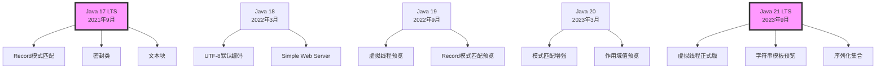

# Java新特性（Java 17-21）

> **学习目标**：掌握Java 17-21的重要新特性
> **核心内容**：Record、虚拟线程、模式匹配、String Templates、密封类
> **预计时间**：4小时

## Java版本演进



## Record类（Java 14+）

### Record基础

```java
/**
 * Record：不可变数据载体
 * Java 14预览，15预览，16正式版
 */

// 简单的Record
record Point(int x, int y) {}

// 带验证的Record
record Circle(double radius) {
    public Circle {
        if (radius <= 0) {
            throw new IllegalArgumentException("半径必须大于0");
        }
    }
}

// 带方法的Record
record Rectangle(double width, double height) {
    public double area() {
        return width * height;
    }

    public double perimeter() {
        return 2 * (width + height);
    }
}

public class RecordDemo {
    public static void main(String[] args) {
        // 创建Record实例
        Point point = new Point(3, 4);
        System.out.println(point);
        System.out.println("x: " + point.x());
        System.out.println("y: " + point.y());

        // 自动实现equals、hashCode、toString
        Point point2 = new Point(3, 4);
        System.out.println("相等: " + point.equals(point2));

        // 计算面积和周长
        Rectangle rectangle = new Rectangle(5, 3);
        System.out.println("面积: " + rectangle.area());
        System.out.println("周长: " + rectangle.perimeter());

        // Record用于方法返回值
        var result = divideAndRemainder(10, 3);
        System.out.println("商: " + result.quotient());
        System.out.println("余数: " + result.remainder());

        // Record用于数据传输对象（DTO）
        record UserDTO(String username, String email, int age) {}
        UserDTO user = new UserDTO("xiaoxu", "xiaoxu@example.com", 25);
        System.out.println(user);
    }

    // 返回多个值
    record DivisionResult(int quotient, int remainder) {}

    static DivisionResult divideAndRemainder(int dividend, int divisor) {
        int quotient = dividend / divisor;
        int remainder = dividend % divisor;
        return new DivisionResult(quotient, remainder);
    }
}
```

## 密封类（Java 15+）

```java
/**
 * 密封类（Sealed Classes）
 * Java 15预览，16预览，17正式版
 *
 * 限制哪些类可以继承或实现
 */

// 密封类
public sealed interface Shape permits Circle, Rectangle, Triangle {
    double area();
}

// 允许的子类
public final record Circle(double radius) implements Shape {
    @Override
    public double area() {
        return Math.PI * radius * radius;
    }
}

public final record Rectangle(double width, double height) implements Shape {
    @Override
    public double area() {
        return width * height;
    }
}

public final record Triangle(double base, double height) implements Shape {
    @Override
    public double area() {
        return 0.5 * base * height;
    }
}

// 使用密封类
public class SealedClassDemo {
    public static void main(String[] args) {
        Shape shape = new Circle(5.0);
        System.out.println("面积: " + shape.area());
    }
}

// 密封类的变体
// 1. non-sealed：开放继承
public sealed class Animal permits Dog, Cat {
    // ...
}

public final class Dog extends Animal {
    // ...
}

public non-sealed class Cat extends Animal {
    // 其他类可以继承Cat
}

public class Tiger extends Cat {
    // 允许
}
```

## 模式匹配增强

### instanceof模式匹配（Java 14+）

```java
/**
 * instanceof模式匹配
 * Java 14预览，15预览，16正式版
 */
public class InstanceofPattern {
    public static void main(String[] args) {
        Object obj = "Hello";

        // 传统方式
        if (obj instanceof String) {
            String str = (String) obj;
            System.out.println("字符串长度: " + str.length());
        }

        // 模式匹配（更简洁）
        if (obj instanceof String str) {
            System.out.println("字符串长度: " + str.length());
        }

        // 在条件中可以直接使用str
        if (obj instanceof String str && str.length() > 3) {
            System.out.println("长字符串: " + str);
        }

        // 实际应用
        process("Hello");
        process(123);
        process(3.14);
    }

    static void process(Object obj) {
        if (obj instanceof String s) {
            System.out.println("处理字符串: " + s);
        } else if (obj instanceof Integer i) {
            System.out.println("处理整数: " + i);
        } else if (obj instanceof Double d) {
            System.out.println("处理双精度: " + d);
        } else {
            System.out.println("未知类型");
        }
    }
}
```

### switch表达式（Java 12+）

```java
/**
 * switch表达式
 * Java 12预览，13预览，14正式版
 */
public class SwitchExpression {
    public static void main(String[] args) {
        // 传统switch
        int day = 2;
        String dayName;
        switch (day) {
            case 1:
                dayName = "Monday";
                break;
            case 2:
                dayName = "Tuesday";
                break;
            default:
                dayName = "Other";
        }

        // switch表达式
        dayName = switch (day) {
            case 1 -> "Monday";
            case 2 -> "Tuesday";
            case 3 -> "Wednesday";
            case 4 -> "Thursday";
            case 5 -> "Friday";
            case 6, 7 -> "Weekend";
            default -> "Other";
        };

        // 使用yield返回值
        int result = switch (day) {
            case 1, 2, 3, 4, 5 -> {
                System.out.println("工作日");
                yield 1;
            }
            case 6, 7 -> {
                System.out.println("周末");
                yield 2;
            }
            default -> {
                System.out.println("其他");
                yield 0;
            }
        };

        // 模式匹配（Java 17+）
        Object obj = 123;
        String formatted = switch (obj) {
            case Integer i -> String.format("int %d", i);
            case Long l -> String.format("long %d", l);
            case Double d -> String.format("double %f", d);
            case String s -> String.format("String %s", s);
            default -> obj.toString();
        };

        System.out.println(formatted);
    }
}
```

### Record模式匹配（Java 19+）

```java
/**
 * Record模式匹配
 * Java 19预览，20预览，21正式版
 */
public class RecordPattern {
    public static void main(String[] args) {
        Object obj = new Point(3, 4);

        // 传统方式
        if (obj instanceof Point p) {
            int x = p.x();
            int y = p.y();
            System.out.println("Point(" + x + ", " + y + ")");
        }

        // Record模式（Java 21+）
        if (obj instanceof Point(int x, int y)) {
            System.out.println("Point(" + x + ", " + y + ")");
        }

        // 嵌套Record模式
        record Line(Point start, Point end) {}
        Line line = new Line(new Point(0, 0), new Point(3, 4));

        if (line instanceof Line(Point(int x1, int y1), Point(int x2, int y2))) {
            System.out.printf("Line from (%d,%d) to (%d,%d)%n", x1, y1, x2, y2);
        }

        // switch中使用Record模式
        printShape(new Circle(5.0));
        printShape(new Rectangle(3.0, 4.0));
    }

    static void printShape(Object obj) {
        switch (obj) {
            case Circle(double radius) ->
                System.out.println("圆，半径: " + radius);
            case Rectangle(double width, double height) ->
                System.out.println("矩形，宽: " + width + ", 高: " + height);
            case null ->
                System.out.println("null");
            default ->
                System.out.println("未知形状");
        }
    }

    record Point(int x, int y) {}
    record Circle(double radius) {}
    record Rectangle(double width, double height) {}
}
```

## 虚拟线程（Java 21）

```java
import java.util.concurrent.*;
import java.util.stream.*;

/**
 * 虚拟线程（Virtual Threads）
 * Java 19预览，20预览，21正式版
 *
 * 轻量级线程，可以创建数百万个
 */
public class VirtualThreadDemo {

    public static void main(String[] args) {
        // 创建虚拟线程
        Thread vt = Thread.startVirtualThread(() -> {
            System.out.println("虚拟线程运行中: " + Thread.currentThread());
        });

        vt.join();

        // 使用ExecutorService
        try (var executor = Executors.newVirtualThreadPerTaskExecutor()) {
            for (int i = 0; i < 10; i++) {
                final int taskId = i;
                executor.submit(() -> {
                    System.out.println("任务" + taskId + " 执行: " +
                        Thread.currentThread());
                    try {
                        Thread.sleep(1000);
                    } catch (InterruptedException e) {
                        Thread.currentThread().interrupt();
                    }
                });
            }
        }

        // 对比平台线程和虚拟线程
        compareThreads();

        // 大量并发任务
        massiveConcurrency();
    }

    // 对比平台线程和虚拟线程
    static void compareThreads() {
        System.out.println("\n=== 平台线程 ===");
        long start = System.currentTimeMillis();
        try (var executor = Executors.newFixedThreadPool(100)) {
            for (int i = 0; i < 1000; i++) {
                executor.submit(() -> {
                    try {
                        Thread.sleep(1000);
                    } catch (InterruptedException e) {
                        Thread.currentThread().interrupt();
                    }
                });
            }
        }
        long platformTime = System.currentTimeMillis() - start;
        System.out.println("平台线程耗时: " + platformTime + "ms");

        System.out.println("\n=== 虚拟线程 ===");
        start = System.currentTimeMillis();
        try (var executor = Executors.newVirtualThreadPerTaskExecutor()) {
            for (int i = 0; i < 1000; i++) {
                executor.submit(() -> {
                    try {
                        Thread.sleep(1000);
                    } catch (InterruptedException e) {
                        Thread.currentThread().interrupt();
                    }
                });
            }
        }
        long virtualTime = System.currentTimeMillis() - start;
        System.out.println("虚拟线程耗时: " + virtualTime + "ms");
    }

    // 大量并发任务
    static void massiveConcurrency() {
        System.out.println("\n=== 大量并发任务 ===");

        try (var executor = Executors.newVirtualThreadPerTaskExecutor()) {
            // 创建100万个虚拟线程
            IntStream.range(0, 1_000_000).forEach(i -> {
                executor.submit(() -> {
                    // 模拟IO操作
                    try {
                        Thread.sleep(100);
                    } catch (InterruptedException e) {
                        Thread.currentThread().interrupt();
                    }
                });
            });
        }

        System.out.println("100万个虚拟线程执行完成");
    }
}
```

## 字符串模板（Java 21预览）

```java
/**
 * 字符串模板（String Templates）
 * Java 21预览功能
 *
 * --enable-preview
 */
public class StringTemplateDemo {

    public static void main(String[] args) {
        // 传统字符串拼接
        String name = "张三";
        int age = 25;
        String message1 = "姓名: " + name + ", 年龄: " + age;
        System.out.println(message1);

        // 使用String.format
        String message2 = String.format("姓名: %s, 年龄: %d", name, age);
        System.out.println(message2);

        // 使用文本块（Java 15+）
        String json1 = """
            {
                "name": "%s",
                "age": %d
            }
            """.formatted(name, age);
        System.out.println(json1);

        // 字符串模板（Java 21预览）
        // STR模板处理器
        String message3 = STR."姓名: \{name}, 年龄: \{age}";
        System.out.println(message3);

        // 复杂表达式
        int x = 10, y = 20;
        String result = STR."\{x} + \{y} = \{x + y}";
        System.out.println(result);

        // 多行模板
        String json2 = STR."""
            {
                "name": "\{name}",
                "age": \{age},
                "adult": \{age >= 18}
            }
            """;
        System.out.println(json2);

        // 格式化模板
        String formatted = STR."\{name} is \{age} years old";
        System.out.println(formatted);

        // RAW模板（不转义）
        String raw = RAW."Welcome \{name}!\nNew line";
        System.out.println(raw);
    }
}
```

## 其他重要新特性

### 文本块（Java 15+）

```java
/**
 * 文本块（Text Blocks）
 * Java 13预览，14预览，15正式版
 */
public class TextBlockDemo {
    public static void main(String[] args) {
        // 传统方式：需要转义和换行符
        String json1 = "{\n" +
                       "  \"name\": \"张三\",\n" +
                       "  \"age\": 25\n" +
                       "}";

        // 使用文本块
        String json2 = """
            {
              "name": "张三",
              "age": 25
            }
            """;

        System.out.println(json2);

        // SQL语句
        String sql = """
            SELECT id, name, age
            FROM users
            WHERE age > 18
            ORDER BY name
            """;

        // HTML
        String html = """
            <html>
                <body>
                    <h1>欢迎</h1>
                </body>
            </html>
            """;

        // 文本块方法
        String text = """
            Hello
            World
            """;

        System.out.println("缩进: " + text.indent(4));
        System.out.println("对齐: " + text.stripIndent());
        System.out.println("行数: " + text.lines().count());
    }
}
```

### var增强（Java 10+）

```java
/**
 * var增强
 * Java 10引入，后续版本增强
 */
public class VarEnhancement {
    public static void main(String[] args) {
        // var类型推断（Java 10）
        var name = "张三";
        var age = 25;
        var list = new ArrayList<String>();

        // lambda表达式中使用var（Java 11）
        BiFunction<Integer, Integer, Integer> add = (var x, var y) -> x + y;

        // var在匿名类中使用（Java 10+）
        var runnable = new Runnable() {
            @Override
            public void run() {
                System.out.println("运行");
            }
        };

        // Record中使用var（Java 10+）
        record Point(int x, int y) {
            void print() {
                var sum = x + y;
                System.out.println("和: " + sum);
            }
        }
    }
}
```

### 有用的API增强

```java
import java.util.*;
import java.util.stream.*;

/**
 * 有用的API增强
 */
public class APIEnhancements {

    public static void main(String[] args) {
        // toArray方法增强（Java 11）
        List<String> list = Arrays.asList("a", "b", "c");
        String[] array = list.toArray(String[]::new);
        System.out.println(Arrays.toString(array));

        // 集合工厂方法（Java 9）
        List<String> immutableList = List.of("a", "b", "c");
        Set<String> immutableSet = Set.of("a", "b", "c");
        Map<String, Integer> immutableMap = Map.of("a", 1, "b", 2);

        // Optional流（Java 9）
        Optional<String> opt = Optional.of("Hello");
        opt.stream().forEach(System.out::println);

        // Stream.takeWhile/dropWhile（Java 9）
        Stream.of(1, 2, 3, 4, 5, 3, 2, 1)
              .takeWhile(n -> n < 4)
              .forEach(System.out::print);  // 123

        // Stream.iterate增强（Java 9）
        IntStream.iterate(0, n -> n < 10, n -> n + 2)
                 .forEach(System.out::print);  // 02468

        // HttpClient（Java 11）
        try {
            var client = java.net.http.HttpClient.newHttpClient();
            var request = java.net.http.HttpRequest.newBuilder()
                .uri(java.net.URI.create("https://example.com"))
                .GET()
                .build();

            var response = client.send(request,
                java.net.http.HttpResponse.BodyHandlers.ofString());
            System.out.println("状态码: " + response.statusCode());
        } catch (Exception e) {
            e.printStackTrace();
        }

        // 文件读写简化（Java 11）
        try {
            // 读取文件
            String content = Files.readString(
                Path.of("test.txt"));
            System.out.println(content);

            // 写入文件
            Files.writeString(
                Path.of("output.txt"),
                "Hello, Java 21!");
        } catch (Exception e) {
            e.printStackTrace();
        }
    }
}
```

## 迁移到Java 21

### 更新建议

```java
/**
 * 迁移到Java 21的建议
 */
public class MigrationGuide {

    public static void main(String[] args) {
        // 1. 使用Record替代传统的DTO类
        // 旧方式
        class Person {
            private final String name;
            private final int age;

            public Person(String name, int age) {
                this.name = name;
                this.age = age;
            }

            public String getName() { return name; }
            public int getAge() { return age; }

            @Override
            public boolean equals(Object o) {
                // 实现equals
                return true;
            }

            @Override
            public int hashCode() {
                // 实现hashCode
                return 0;
            }

            @Override
            public String toString() {
                return "Person{name='" + name + "', age=" + age + "}";
            }
        }

        // 新方式：使用Record
        record PersonRecord(String name, int age) {}

        // 2. 使用模式匹配简化代码
        // 旧方式
        Object obj = "Hello";
        if (obj instanceof String) {
            String s = (String) obj;
            System.out.println(s.length());
        }

        // 新方式：模式匹配
        if (obj instanceof String s) {
            System.out.println(s.length());
        }

        // 3. 使用switch表达式
        // 旧方式
        int day = 2;
        String dayName;
        switch (day) {
            case 1:
                dayName = "Monday";
                break;
            case 2:
                dayName = "Tuesday";
                break;
            default:
                dayName = "Other";
        }

        // 新方式：switch表达式
        dayName = switch (day) {
            case 1 -> "Monday";
            case 2 -> "Tuesday";
            default -> "Other";
        };

        // 4. 使用文本块
        // 旧方式
        String json = "{\n" +
                      "  \"key\": \"value\"\n" +
                      "}";

        // 新方式：文本块
        json = """
            {
              "key": "value"
            }
            """;

        // 5. 使用虚拟线程提高并发性能
        // 旧方式：平台线程
        ExecutorService platformExecutor = Executors.newFixedThreadPool(10);
        platformExecutor.submit(() -> {
            // 任务
        });

        // 新方式：虚拟线程
        ExecutorService virtualExecutor = Executors.newVirtualThreadPerTaskExecutor();
        virtualExecutor.submit(() -> {
            // 任务
        });
    }
}
```

## 最佳实践

```java
/**
 * Java 21最佳实践
 */
public class BestPractices {

    // 1. 使用Record作为数据载体
    record User(String username, String email) {}

    // 2. 使用密封类限制继承
    public sealed interface Shape permits Circle, Square {
        double area();
    }

    // 3. 使用模式匹配增强可读性
    public static String getDescription(Object obj) {
        return switch (obj) {
            case String s && !s.isEmpty() -> "非空字符串: " + s;
            case String s -> "空字符串";
            case Integer i -> "整数: " + i;
            case null -> "null值";
            default -> "其他类型";
        };
    }

    // 4. 使用文本块提高可读性
    public static String getJson() {
        return """
            {
              "status": "success",
              "data": {
                "id": 1,
                "name": "Java 21"
              }
            }
            """;
    }

    // 5. 使用虚拟线程处理IO密集型任务
    public static void handleRequests(List<Runnable> tasks) {
        try (var executor = Executors.newVirtualThreadPerTaskExecutor()) {
            for (Runnable task : tasks) {
                executor.submit(task);
            }
        }
    }

    // 6. 使用Optional避免空指针
    public static Optional<User> findUser(String username) {
        return Optional.ofNullable(
            // 从数据库查找
            null
        );
    }

    // 7. 使用Stream API进行数据处理
    public static List<String> getAdultNames(List<User> users) {
        return users.stream()
                   .filter(u -> u.age() >= 18)  // 假设User有age方法
                   .map(User::username)
                   .toList();
    }
}
```

## 练习题

### 基础练习

1. **Record练习**：创建一个Student记录类

2. **模式匹配**：使用模式匹配重构代码

### 进阶练习

3. **虚拟线程**：使用虚拟线程实现并发下载

4. **密封类**：设计一个使用密封类的支付系统

### 挑战练习

5. **综合应用**：使用Java 21新特性实现一个Web服务

## 本章小结

### 知识点回顾

✅ **Record**：不可变数据载体
✅ **密封类**：限制继承层次
✅ **模式匹配**：简化类型检查和转换
✅ **虚拟线程**：轻量级并发
✅ **字符串模板**：简化的字符串插值
✅ **文本块**：多行字符串
✅ **API增强**：各种有用的API改进

### 学习成果

完成本章学习后，你应该能够：
- 使用Record简化数据类定义
- 使用模式匹配编写更清晰的代码
- 使用虚拟线程提高并发性能
- 使用字符串模板和文本块简化字符串处理

### 恭喜完成Java基础学习！

你已经完成了Java基础入门的全部10个章节，掌握了：
- Java环境搭建和基础语法
- 面向对象编程思想
- 集合框架和泛型
- 异常处理和IO操作
- 多线程和并发编程
- Lambda表达式和Stream API
- Java 17-21最新特性

**下一步建议**：
- 实践项目：动手做几个小项目巩固知识
- 学习Web开发：Servlet、Spring Boot
- 深入学习：JVM原理、设计模式
- 持续关注：Java的最新发展

**继续加油！** 🚀

---

**学习时间**：约4小时
**难度等级**：★★★★☆
**推荐资源**：
- [Java 21官方文档](https://docs.oracle.com/en/java/javase/21/)
- [OpenJDK官网](https://openjdk.org/)
