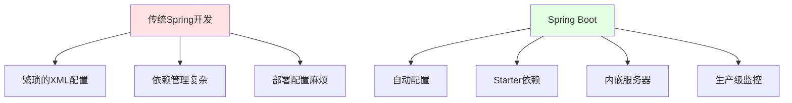
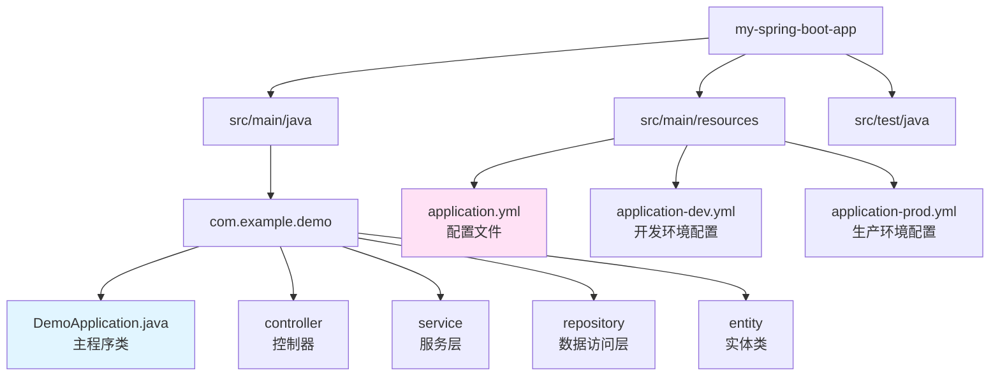

# Spring Boot 3.x快速入门

> **学习目标**：掌握Spring Boot 3.x框架的核心概念和实战应用
> **核心内容**：Spring Boot架构、自动配置、Starter依赖、配置管理
> **预计时间**：5小时
> **前置知识**：Java 21、Spring Framework基础

## Spring Boot简介

### 什么是Spring Boot？

Spring Boot是基于Spring Framework的快速开发框架，它简化了Spring应用的初始搭建和开发过程。通过"约定大于配置"的理念，Spring Boot让开发者能够快速创建生产级别的Spring应用。



### Spring Boot 3.x核心特性

```java
/**
 * Spring Boot 3.x新特性
 */
public class SpringBoot3Features {
    public static void main(String[] args) {
        System.out.println("=== Spring Boot 3.x核心特性 ===\n");

        System.out.println("1. 基于Spring Framework 6.1：");
        System.out.println("   - 支持Java 17+");
        System.out.println("   - 支持虚拟线程（Virtual Threads）");
        System.out.println("   - 原生编译支持（GraalVM）\n");

        System.out.println("2. 响应式编程增强：");
        System.out.println("   - WebFlux性能优化");
        System.out.println("   - R2DBC（响应式数据库访问）\n");

        System.out.println("3. 可观测性提升：");
        System.out.println("   - Micrometer Tracing");
        System.out.println("   - 集成OpenTelemetry\n");

        System.out.println("4. 安全性增强：");
        System.out.println("   - Spring Security 6.x");
        System.out.println("   - 默认安全配置\n");

        System.out.println("5. 性能优化：");
        System.out.println("   - 启动速度提升");
        System.out.println("   - 内存占用降低");
    }
}
```

## 快速开始

### 创建Spring Boot项目

**方式一：使用Spring Initializr**

访问 https://start.spring.io/ 创建项目：

```bash
# 项目配置
Project: Maven
Language: Java
Spring Boot: 3.2.5
Packaging: Jar
Java: 21

# 依赖选择
- Spring Web
- Spring Data JPA
- MySQL Driver
- Lombok
```

**方式二：使用命令行**

```bash
# 使用curl创建项目
curl https://start.spring.io/starter.zip \
  -d dependencies=web,data-jpa,mysql,lombok \
  -d type=maven-project \
  -d language=java \
  -d bootVersion=3.2.5 \
  -d baseDir=my-spring-boot-app \
  -o my-spring-boot-app.zip

unzip my-spring-boot-app.zip
cd my-spring-boot-app
```

### 项目结构



### 主程序类

```java
package com.example.demo;

import org.springframework.boot.SpringApplication;
import org.springframework.boot.autoconfigure.SpringBootApplication;
import org.springframework.web.bind.annotation.GetMapping;
import org.springframework.web.bind.annotation.RestController;

/**
 * Spring Boot主程序类
 *
 * @SpringBootApplication: 组合注解，包含：
 * - @Configuration: 标识为配置类
 * - @EnableAutoConfiguration: 启用自动配置
 * - @ComponentScan: 组件扫描
 */
@SpringBootApplication
@RestController
public class DemoApplication {

    public static void main(String[] args) {
        // 启动Spring Boot应用
        SpringApplication.run(DemoApplication.class, args);

        System.out.println("========================================");
        System.out.println("Spring Boot应用启动成功！");
        System.out.println("访问: http://localhost:8080");
        System.out.println("========================================");
    }

    /**
     * 第一个RESTful API
     */
    @GetMapping("/")
    public String home() {
        return "Hello, Spring Boot 3.x!";
    }

    @GetMapping("/hello")
    public String hello() {
        return """
            {
              "message": "欢迎使用Spring Boot 3.x",
              "version": "3.2.5",
              "java": "21"
            }
            """;
    }
}
```

## 核心注解详解

### @SpringBootApplication详解

```java
package com.example.demo.config;

import org.springframework.boot.SpringApplication;
import org.springframework.boot.autoconfigure.SpringBootApplication;
import org.springframework.context.annotation.ComponentScan;

/**
 * @SpringBootApplication详解
 *
 * 等价于：
 * @SpringBootConfiguration
 * @EnableAutoConfiguration
 * @ComponentScan
 */
@SpringBootApplication(
    // 扫描特定包
    scanBasePackages = "com.example.demo",

    // 排除自动配置
    exclude = {
        // DataSourceAutoConfiguration.class
    }
)
public class ApplicationConfiguration {
    public static void main(String[] args) {
        SpringApplication.run(ApplicationConfiguration.class, args);
    }
}
```

### 常用注解

```java
package com.example.demoannotations;

import org.springframework.stereotype.Component;
import org.springframework.stereotype.Service;
import org.springframework.stereotype.Repository;
import org.springframework.stereotype.Controller;
import org.springframework.web.bind.annotation.RestController;
import org.springframework.web.bind.annotation.GetMapping;
import org.springframework.web.bind.annotation.PostMapping;
import org.springframework.web.bind.annotation.RequestMapping;
import org.springframework.web.bind.annotation.RequestParam;
import org.springframework.web.bind.annotation.RequestBody;
import org.springframework.web.bind.annotation.PathVariable;
import org.springframework.context.annotation.Configuration;
import org.springframework.boot.context.properties.ConfigurationProperties;
import org.springframework.beans.factory.annotation.Autowired;
import org.springframework.beans.factory.annotation.Value;
import org.springframework.beans.factory.annotation.Qualifier;
import lombok.Data;

import jakarta.persistence.Entity;
import jakarta.persistence.Id;
import jakarta.persistence.Table;

/**
 * Spring Boot常用注解示例
 */

// 1. 组件注解
@Component("myComponent")
class MyComponent {
    // 通用组件
}

@Service
class UserService {
    // 服务层组件
}

@Repository
class UserRepository {
    // 数据访问层组件
}

@Controller
class PageController {
    // 返回视图
}

// 2. REST控制器
@RestController
@RequestMapping("/api")
class ApiController {

    // GET请求
    @GetMapping("/users")
    public String getUsers() {
        return "用户列表";
    }

    // POST请求
    @PostMapping("/users")
    public String createUser(@RequestBody String user) {
        return "创建用户: " + user;
    }

    // 路径变量
    @GetMapping("/users/{id}")
    public String getUserById(@PathVariable Long id) {
        return "用户ID: " + id;
    }

    // 请求参数
    @GetMapping("/search")
    public String search(@RequestParam String keyword) {
        return "搜索: " + keyword;
    }
}

// 3. 配置注解
@Configuration
class AppConfig {
    // 配置类
}

@Data
@ConfigurationProperties(prefix = "app")
class AppProperties {
    private String name;
    private String version;
    private boolean enabled;
}

// 4. 实体类注解
@Entity
@Table(name = "users")
class User {
    @Id
    private Long id;
    private String username;
    private String email;
}

// 5. 依赖注入注解
class DependencyInjectionExample {

    @Autowired
    private UserService userService;

    @Autowired
    @Qualifier("myComponent")
    private MyComponent myComponent;

    @Value("${app.name}")
    private String appName;
}
```

## 自动配置原理

### 自动配置机制

```mermaid
graph TB
    A[@SpringBootApplication] --> B[@EnableAutoConfiguration]
    B --> C[加载META-INF/spring.factories]
    B --> D[加载META-INF/spring/org.springframework.boot.autoconfigure.AutoConfiguration.imports]

    C --> E[读取自动配置类列表]
    D --> E

    E --> F[根据条件注解过滤]
    F --> G[创建Bean定义]
    G --> H[注册到Spring容器]

    style A fill:#e1f5ff
    style B fill:#ffe1f5
    style F fill:#fff4e1
```

### 自定义自动配置

```java
package com.example.demo.autoconfiguration;

import org.springframework.context.annotation.Bean;
import org.springframework.context.annotation.Configuration;
import org.springframework.boot.autoconfigure.condition.ConditionalOnClass;
import org.springframework.boot.autoconfigure.condition.ConditionalOnMissingBean;
import org.springframework.boot.autoconfigure.condition.ConditionalOnProperty;
import org.springframework.boot.context.properties.EnableConfigurationProperties;

/**
 * 自定义自动配置示例
 */

// 1. 配置属性类
@EnableConfigurationProperties(AppServiceProperties.class)
@ConditionalOnProperty(prefix = "app.service", name = "enabled", havingValue = "true")
class AppServiceAutoConfiguration {

    @Bean
    @ConditionalOnMissingBean
    public AppService appService(AppServiceProperties properties) {
        return new AppService(properties);
    }
}

// 2. 配置属性
class AppServiceProperties {
    private String name = "default";
    private int timeout = 3000;
    private boolean enabled = true;

    // getters and setters
    public String getName() { return name; }
    public void setName(String name) { this.name = name; }
    public int getTimeout() { return timeout; }
    public void setTimeout(int timeout) { this.timeout = timeout; }
    public boolean isEnabled() { return enabled; }
    public void setEnabled(boolean enabled) { this.enabled = enabled; }
}

// 3. 服务类
class AppService {
    private final AppServiceProperties properties;

    public AppService(AppServiceProperties properties) {
        this.properties = properties;
    }

    public void process() {
        System.out.println("AppService: " + properties.getName());
        System.out.println("Timeout: " + properties.getTimeout());
    }
}
```

### 条件注解详解

```java
package com.example.demo.conditions;

import org.springframework.context.annotation.Condition;
import org.springframework.context.annotation.ConditionContext;
import org.springframework.core.type.AnnotatedTypeMetadata;
import org.springframework.boot.autoconfigure.condition.ConditionalOnClass;
import org.springframework.boot.autoconfigure.condition.ConditionalOnMissingClass;
import org.springframework.boot.autoconfigure.condition.ConditionalOnBean;
import org.springframework.boot.autoconfigure.condition.ConditionalOnMissingBean;
import org.springframework.boot.autoconfigure.condition.ConditionalOnProperty;
import org.springframework.boot.autoconfigure.condition.ConditionalOnResource;
import org.springframework.boot.autoconfigure.condition.ConditionalOnExpression;
import org.springframework.boot.autoconfigure.condition.ConditionalOnJava;
import org.springframework.boot.autoconfigure.condition.ConditionalOnWebApplication;
import org.springframework.boot.autoconfigure.condition.ConditionalOnNotWebApplication;

/**
 * 条件注解详解
 */

// 1. 类条件
@ConditionalOnClass(name = "com.example.SomeClass")
class WithSomeClassConfiguration {
    // 当类路径存在指定类时生效
}

@ConditionalOnMissingClass("com.example.SomeClass")
class WithoutSomeClassConfiguration {
    // 当类路径不存在指定类时生效
}

// 2. Bean条件
@ConditionalOnBean(DataSource.class)
class WithDataSourceConfiguration {
    // 当容器中存在指定Bean时生效
}

@ConditionalOnMissingBean(DataSource.class)
class WithoutDataSourceConfiguration {
    // 当容器中不存在指定Bean时生效
}

// 3. 属性条件
@ConditionalOnProperty(
    prefix = "app",
    name = "feature.enabled",
    havingValue = "true",
    matchIfMissing = false
)
class FeatureEnabledConfiguration {
    // 当配置属性满足条件时生效
}

// 4. 资源条件
@ConditionalOnResource(resources = "classpath:config.properties")
class WithResourceConfiguration {
    // 当指定资源存在时生效
}

// 5. SpEL表达式条件
@ConditionalOnExpression("${app.feature.enabled:true} and '${app.mode}'.equals('production')")
class SpelConditionConfiguration {
    // 当SpEL表达式为true时生效
}

// 6. Java版本条件
@ConditionalOnJava(JavaVersion.TWENTY_ONE)
class Java21Configuration {
    // 当Java版本满足条件时生效
}

// 7. Web应用条件
@ConditionalOnWebApplication
class WebConfiguration {
    // 在Web应用中生效
}

@ConditionalOnNotWebApplication
class NonWebConfiguration {
    // 在非Web应用中生效
}

// 8. 自定义条件
class CustomCondition implements Condition {
    @Override
    public boolean matches(ConditionContext context, AnnotatedTypeMetadata metadata) {
        // 自定义条件逻辑
        String env = context.getEnvironment().getProperty("app.env");
        return "production".equals(env);
    }
}

@Conditional(CustomCondition.class)
class CustomConditionConfiguration {
    // 当自定义条件满足时生效
}
```

## 配置管理

### 配置文件

**application.yml（推荐）**

```yaml
# 服务器配置
server:
  port: 8080
  servlet:
    context-path: /api
  compression:
    enabled: true
  tomcat:
    threads:
      max: 200
      min-spare: 10

# 应用配置
spring:
  application:
    name: demo-app
  profiles:
    active: dev

  # 数据源配置
  datasource:
    url: jdbc:mysql://localhost:3306/demo_db?useSSL=false&serverTimezone=Asia/Shanghai
    username: root
    password: password
    driver-class-name: com.mysql.cj.jdbc.Driver
    hikari:
      maximum-pool-size: 10
      minimum-idle: 5
      connection-timeout: 30000
      idle-timeout: 600000
      max-lifetime: 1800000

  # JPA配置
  jpa:
    hibernate:
      ddl-auto: update
    show-sql: true
    properties:
      hibernate:
        format_sql: true
        dialect: org.hibernate.dialect.MySQLDialect
    open-in-view: false

  # Redis配置
  data:
    redis:
      host: localhost
      port: 6379
      password:
      database: 0
      lettuce:
        pool:
          max-active: 8
          max-idle: 8
          min-idle: 0
          max-wait: -1ms

# 日志配置
logging:
  level:
    root: INFO
    com.example.demo: DEBUG
    org.springframework.web: DEBUG
    org.hibernate.SQL: DEBUG
    org.hibernate.type.descriptor.sql.BasicBinder: TRACE
  pattern:
    console: "%d{yyyy-MM-dd HH:mm:ss} [%thread] %-5level %logger{36} - %msg%n"
  file:
    name: logs/application.log
    max-size: 10MB
    max-history: 30

# 自定义配置
app:
  name: Demo Application
  version: 1.0.0
  description: Spring Boot 3.x Demo
  features:
    cache-enabled: true
    redis-enabled: true
    async-enabled: true
```

**application-dev.yml（开发环境）**

```yaml
server:
  port: 8080

spring:
  datasource:
    url: jdbc:mysql://localhost:3306/demo_dev?useSSL=false
    username: root
    password: root

  jpa:
    show-sql: true
    hibernate:
      ddl-auto: update

logging:
  level:
    com.example.demo: DEBUG
    org.springframework.web: DEBUG
```

**application-prod.yml（生产环境）**

```yaml
server:
  port: 8080
  compression:
    enabled: true

spring:
  datasource:
    url: jdbc:mysql://prod-db:3306/demo_prod?useSSL=true
    username: prod_user
    password: ${DB_PASSWORD}

  jpa:
    show-sql: false
    hibernate:
      ddl-auto: validate

logging:
  level:
    root: WARN
    com.example.demo: INFO
  file:
    name: /var/log/app/application.log
```

### 配置属性绑定

```java
package com.example.demo.config;

import org.springframework.boot.context.properties.ConfigurationProperties;
import org.springframework.stereotype.Component;
import org.springframework.beans.factory.annotation.Value;
import org.springframework.context.annotation.Bean;
import org.springframework.context.annotation.Configuration;
import lombok.Data;

import java.util.List;
import java.util.Map;

/**
 * 配置属性绑定示例
 */

// 1. 使用@ConfigurationProperties
@Data
@Component
@ConfigurationProperties(prefix = "app")
class AppProperties {
    private String name;
    private String version;
    private boolean enabled;
    private Features features;
    private List<String> servers;
    private Map<String, String> metadata;

    @Data
    public static class Features {
        private boolean cacheEnabled;
        private boolean redisEnabled;
        private boolean asyncEnabled;
    }
}

// 2. 使用@Value
@Component
class ValueProperties {
    @Value("${app.name}")
    private String appName;

    @Value("${app.version:1.0.0}")
    private String appVersion;

    @Value("${app.enabled:false}")
    private boolean enabled;

    @Value("#{systemProperties['user.home']}")
    private String userHome;

    @Value("${app.servers}")
    private List<String> servers;

    @Value("#{${app.metadata}}")
    private Map<String, String> metadata;
}

// 3. 构造函数绑定
@Data
@Component
@ConfigurationProperties(prefix = "database")
class DatabaseProperties {
    private final String url;
    private final String username;
    private final String password;
    private final int maxConnections;

    public DatabaseProperties(
        String url,
        String username,
        String password,
        @Value("${database.max-connections:10}") int maxConnections
    ) {
        this.url = url;
        this.username = username;
        this.password = password;
        this.maxConnections = maxConnections;
    }
}

// 4. 启用配置属性
@Configuration
@EnableConfigurationProperties({
    AppProperties.class,
    DatabaseProperties.class
})
class PropertiesConfiguration {
    // 配置类
}
```

### 配置文件使用

```java
package com.example.demo.controller;

import org.springframework.web.bind.annotation.GetMapping;
import org.springframework.web.bind.annotation.RequestMapping;
import org.springframework.web.bind.annotation.RestController;
import org.springframework.beans.factory.annotation.Autowired;
import org.springframework.beans.factory.annotation.Value;
import org.springframework.core.env.Environment;

/**
 * 配置使用示例
 */
@RestController
@RequestMapping("/config")
class ConfigController {

    @Autowired
    private AppProperties appProperties;

    @Autowired
    private Environment environment;

    @Value("${app.name}")
    private String appName;

    @GetMapping("/app")
    public String getAppConfig() {
        return """
            {
              "name": "%s",
              "version": "%s",
              "enabled": %b
            }
            """.formatted(
                appProperties.getName(),
                appProperties.getVersion(),
                appProperties.isEnabled()
            );
    }

    @GetMapping("/features")
    public String getFeatures() {
        return """
            {
              "cacheEnabled": %b,
              "redisEnabled": %b,
              "asyncEnabled": %b
            }
            """.formatted(
                appProperties.getFeatures().isCacheEnabled(),
                appProperties.getFeatures().isRedisEnabled(),
                appProperties.getFeatures().isAsyncEnabled()
            );
    }

    @GetMapping("/env")
    public String getEnvironment() {
        return String.format("Active Profiles: %s", String.join(", ", environment.getActiveProfiles()));
    }

    @GetMapping("/property")
    public String getProperty(@RequestParam String key) {
        return environment.getProperty(key, "默认值");
    }
}
```

## Starter依赖

### 常用Starter

```xml
<!-- pom.xml -->
<dependencies>
    <!-- Web开发 -->
    <dependency>
        <groupId>org.springframework.boot</groupId>
        <artifactId>spring-boot-starter-web</artifactId>
    </dependency>

    <!-- 数据访问 -->
    <dependency>
        <groupId>org.springframework.boot</groupId>
        <artifactId>spring-boot-starter-data-jpa</artifactId>
    </dependency>

    <!-- Redis -->
    <dependency>
        <groupId>org.springframework.boot</groupId>
        <artifactId>spring-boot-starter-data-redis</artifactId>
    </dependency>

    <!-- 安全 -->
    <dependency>
        <groupId>org.springframework.boot</groupId>
        <artifactId>spring-boot-starter-security</artifactId>
    </dependency>

    <!-- 参数校验 -->
    <dependency>
        <groupId>org.springframework.boot</groupId>
        <artifactId>spring-boot-starter-validation</artifactId>
    </dependency>

    <!-- AOP -->
    <dependency>
        <groupId>org.springframework.boot</groupId>
        <artifactId>spring-boot-starter-aop</artifactId>
    </dependency>

    <!-- 测试 -->
    <dependency>
        <groupId>org.springframework.boot</groupId>
        <artifactId>spring-boot-starter-test</artifactId>
        <scope>test</scope>
    </dependency>

    <!-- 数据库驱动 -->
    <dependency>
        <groupId>com.mysql</groupId>
        <artifactId>mysql-connector-j</artifactId>
        <scope>runtime</scope>
    </dependency>

    <!-- Lombok -->
    <dependency>
        <groupId>org.projectlombok</groupId>
        <artifactId>lombok</artifactId>
        <optional>true</optional>
    </dependency>

    <!-- 开发工具 -->
    <dependency>
        <groupId>org.springframework.boot</groupId>
        <artifactId>spring-boot-devtools</artifactId>
        <scope>runtime</scope>
        <optional>true</optional>
    </dependency>
</dependencies>
```

### 自定义Starter

```java
package com.example.demo.starter;

import org.springframework.boot.context.properties.ConfigurationProperties;
import org.springframework.context.annotation.Bean;
import org.springframework.context.annotation.Configuration;
import org.springframework.boot.autoconfigure.condition.ConditionalOnClass;
import org.springframework.boot.autoconfigure.condition.ConditionalOnMissingBean;
import org.springframework.boot.autoconfigure.condition.ConditionalOnProperty;

/**
 * 自定义Starter示例
 */

// 1. 配置属性类
@ConfigurationProperties(prefix = "hello")
class HelloProperties {
    private String message = "Hello";
    private String name = "World";

    // getters and setters
    public String getMessage() { return message; }
    public void setMessage(String message) { this.message = message; }
    public String getName() { return name; }
    public void setName(String name) { this.name = name; }
}

// 2. 服务类
class HelloService {
    private final HelloProperties properties;

    public HelloService(HelloProperties properties) {
        this.properties = properties;
    }

    public String sayHello() {
        return String.format("%s, %s!", properties.getMessage(), properties.getName());
    }
}

// 3. 自动配置类
@Configuration
@ConditionalOnClass(HelloService.class)
@EnableConfigurationProperties(HelloProperties.class)
public class HelloAutoConfiguration {

    @Bean
    @ConditionalOnMissingBean
    @ConditionalOnProperty(prefix = "hello", name = "enabled", havingValue = "true", matchIfMissing = true)
    public HelloService helloService(HelloProperties properties) {
        return new HelloService(properties);
    }
}

// 4. 创建META-INF/spring/org.springframework.boot.autoconfigure.AutoConfiguration.imports
// 文件内容：com.example.demo.starter.HelloAutoConfiguration
```

## 日志管理

### 日志配置

```yaml
# application.yml
logging:
  level:
    root: INFO
    com.example.demo: DEBUG

    # Spring框架日志
    org.springframework.web: INFO
    org.springframework.security: INFO
    org.springframework.boot: INFO

    # Hibernate日志
    org.hibernate.SQL: DEBUG
    org.hibernate.type.descriptor.sql.BasicBinder: TRACE

  pattern:
    console: "%d{yyyy-MM-dd HH:mm:ss} [%thread] %-5level %logger{36} - %msg%n"
    file: "%d{yyyy-MM-dd HH:mm:ss} [%thread] %-5level %logger{36} - %msg%n"

  file:
    name: logs/application.log
    max-size: 10MB
    max-history: 30
    total-size-cap: 1GB

  logback:
    rollingpolicy:
      max-file-size: 10MB
      max-history: 30
```

### 日志使用

```java
package com.example.demo.service;

import org.slf4j.Logger;
import org.slf4j.LoggerFactory;
import org.springframework.stereotype.Service;

/**
 * 日志使用示例
 */
@Service
class UserService {

    // 使用SLF4J
    private static final Logger log = LoggerFactory.getLogger(UserService.class);

    public void createUser(String username) {
        log.debug("创建用户: {}", username);
        log.info("用户创建成功: {}", username);

        try {
            // 业务逻辑
        } catch (Exception e) {
            log.error("创建用户失败: {}", username, e);
        }
    }

    public void logWithLevel() {
        // 不同日志级别
        log.trace("追踪信息");
        log.debug("调试信息");
        log.info("普通信息");
        log.warn("警告信息");
        log.error("错误信息");
    }
}

// 使用Lombok的@Slf4j注解
import lombok.extern.slf4j.Slf4j;

@Slf4j
@Service
class OrderService {

    public void processOrder(String orderId) {
        log.info("处理订单: {}", orderId);
        log.debug("订单详情: {}", orderId);

        if (orderId == null) {
            log.warn("订单ID为空");
        }

        try {
            // 处理订单
        } catch (Exception e) {
            log.error("订单处理失败: {}", orderId, e);
        }
    }
}
```

## 测试

### 单元测试

```java
package com.example.demo.service;

import org.junit.jupiter.api.Test;
import org.junit.jupiter.api.BeforeEach;
import org.junit.jupiter.api.DisplayName;
import static org.junit.jupiter.api.Assertions.*;

/**
 * 单元测试示例
 */
class UserServiceTest {

    private UserService userService;

    @BeforeEach
    void setUp() {
        userService = new UserService();
    }

    @Test
    @DisplayName("测试创建用户")
    void testCreateUser() {
        String username = "testuser";
        userService.createUser(username);

        // 验证逻辑
        assertNotNull(username);
        assertEquals("testuser", username);
    }

    @Test
    @DisplayName("测试用户名验证")
    void testValidateUsername() {
        assertAll("用户名验证",
            () -> assertNotNull("test"),
            () -> assertTrue("test".length() > 0),
            () -> assertFalse("test".isEmpty())
        );
    }

    @Test
    @DisplayName("测试异常情况")
    void testException() {
        assertThrows(IllegalArgumentException.class, () -> {
            userService.createUser(null);
        });
    }
}
```

### 集成测试

```java
package com.example.demo.controller;

import org.junit.jupiter.api.Test;
import org.springframework.beans.factory.annotation.Autowired;
import org.springframework.boot.test.autoconfigure.web.servlet.AutoConfigureMockMvc;
import org.springframework.boot.test.context.SpringBootTest;
import org.springframework.test.web.servlet.MockMvc;

import static org.springframework.test.web.servlet.request.MockMvcRequestBuilders.*;
import static org.springframework.test.web.servlet.result.MockMvcResultMatchers.*;

/**
 * 集成测试示例
 */
@SpringBootTest
@AutoConfigureMockMvc
class ApiControllerTest {

    @Autowired
    private MockMvc mockMvc;

    @Test
    @DisplayName("测试GET请求")
    void testGetUsers() throws Exception {
        mockMvc.perform(get("/api/users"))
            .andExpect(status().isOk())
            .andExpect(content().string("用户列表"));
    }

    @Test
    @DisplayName("测试POST请求")
    void testCreateUser() throws Exception {
        mockMvc.perform(post("/api/users")
                .contentType("application/json")
                .content("{\"username\":\"test\",\"email\":\"test@example.com\"}"))
            .andExpect(status().isCreated());
    }

    @Test
    @DisplayName("测试路径变量")
    void testGetUserById() throws Exception {
        mockMvc.perform(get("/api/users/1"))
            .andExpect(status().isOk())
            .andExpect(content().string(containsString("1")));
    }
}
```

## 避坑指南

### 常见问题与解决方案

```java
/**
 * Spring Boot常见问题与解决方案
 */
public class SpringBootPitfalls {

    public static void main(String[] args) {
        System.out.println("=== Spring Boot避坑指南 ===\n");

        System.out.println("1. 循环依赖问题：");
        System.out.println("   ❌ 问题：Bean A依赖Bean B，Bean B又依赖Bean A");
        System.out.println("   ✅ 解决：");
        System.out.println("   - 使用@Lazy注解延迟初始化");
        System.out.println("   - 重构代码，消除循环依赖");
        System.out.println("   - 使用 Setter注入替代构造函数注入\n");

        System.out.println("2. 配置文件加载顺序：");
        System.out.println("   ❌ 问题：配置不生效");
        System.out.println("   ✅ 解决：了解配置加载优先级");
        System.out.println("   1. 命令行参数");
        System.out.println("   2. 系统属性");
        System.out.println("   3. 外部配置文件");
        System.out.println("   4. application-{profile}.yml");
        System.out.println("   5. application.yml\n");

        System.out.println("3. 事务失效问题：");
        System.out.println("   ❌ 问题：@Transactional不生效");
        System.out.println("   ✅ 解决：");
        System.out.println("   - 方法必须是public");
        System.out.println("   - 不能在同一个类内部调用");
        System.out.println("   - 确保事务管理器已配置\n");

        System.out.println("4. 日期时间序列化：");
        System.out.println("   ❌ 问题：日期格式不一致");
        System.out.println("   ✅ 解决：全局配置日期格式");
        System.out.println("   spring.jackson.date-format: yyyy-MM-dd HH:mm:ss");
        System.out.println("   spring.jackson.time-zone: GMT+8\n");

        System.out.println("5. 跨域问题：");
        System.out.println("   ❌ 问题：前后端分离跨域被阻止");
        System.out.println("   ✅ 解决：添加CORS配置");
        System.out.println("   @Configuration");
        System.out.println("   public class CorsConfig implements WebMvcConfigurer {");
        System.out.println("       @Override");
        System.out.println("       public void addCorsMappings(CorsRegistry registry) {");
        System.out.println("           registry.addMapping(\"/**\")");
        System.out.println("               .allowedOrigins(\"*\")");
        System.out.println("               .allowedMethods(\"*\");");
        System.out.println("       }");
        System.out.println("   }\n");

        System.out.println("6. 启动慢问题：");
        System.out.println("   ❌ 问题：应用启动时间长");
        System.out.println("   ✅ 解决：");
        System.out.println("   - 排除不需要的自动配置");
        System.out.println("   - 使用延迟初始化：spring.main.lazy-initialization=true");
        System.out.println("   - 优化类路径扫描");
        System.out.println("   - 使用Spring Boot 3.x（启动更快）\n");

        System.out.println("7. 内存溢出问题：");
        System.out.println("   ❌ 问题：OutOfMemoryError");
        System.out.println("   ✅ 解决：");
        System.out.println("   - 调整JVM参数：-Xms512m -Xmx1024m");
        System.out.println("   - 优化数据源配置");
        System.out.println("   - 使用连接池");
        System.out.println("   - 避免内存泄漏\n");

        System.out.println("8. Actuator安全问题：");
        System.out.println("   ❌ 问题：暴露敏感端点");
        System.out.println("   ✅ 解决：限制Actuator端点访问");
        System.out.println("   management.endpoints.web.exposure.include=health,info");
        System.out.println("   management.endpoint.health.show-details=when-authorized");
    }
}
```

## 实战练习

### 练习1：创建RESTful API

创建一个简单的用户管理系统：

```java
package com.example.demo.practice;

import org.springframework.web.bind.annotation.*;
import org.springframework.stereotype.Service;
import org.springframework.stereotype.Repository;
import lombok.Data;
import java.util.ArrayList;
import java.util.List;
import java.util.concurrent.ConcurrentHashMap;
import java.util.concurrent.atomic.AtomicLong;

/**
 * 用户管理实战练习
 */

// 1. 实体类
@Data
class User {
    private Long id;
    private String username;
    private String email;
    private int age;
}

// 2. 数据访问层
@Repository
class UserRepository {
    private final ConcurrentHashMap<Long, User> users = new ConcurrentHashMap<>();
    private final AtomicLong idGenerator = new AtomicLong(1);

    public List<User> findAll() {
        return new ArrayList<>(users.values());
    }

    public User findById(Long id) {
        return users.get(id);
    }

    public User save(User user) {
        if (user.getId() == null) {
            user.setId(idGenerator.getAndIncrement());
        }
        users.put(user.getId(), user);
        return user;
    }

    public void deleteById(Long id) {
        users.remove(id);
    }
}

// 3. 服务层
@Service
class UserService {
    private final UserRepository repository;

    public UserService(UserRepository repository) {
        this.repository = repository;
    }

    public List<User> getAllUsers() {
        return repository.findAll();
    }

    public User getUserById(Long id) {
        return repository.findById(id);
    }

    public User createUser(User user) {
        return repository.save(user);
    }

    public User updateUser(Long id, User userDetails) {
        User user = repository.findById(id);
        if (user != null) {
            user.setUsername(userDetails.getUsername());
            user.setEmail(userDetails.getEmail());
            user.setAge(userDetails.getAge());
            return repository.save(user);
        }
        return null;
    }

    public void deleteUser(Long id) {
        repository.deleteById(id);
    }
}

// 4. 控制器
@RestController
@RequestMapping("/api/users")
class UserController {
    private final UserService service;

    public UserController(UserService service) {
        this.service = service;
    }

    // GET /api/users - 获取所有用户
    @GetMapping
    public List<User> getAllUsers() {
        return service.getAllUsers();
    }

    // GET /api/users/{id} - 获取指定用户
    @GetMapping("/{id}")
    public User getUserById(@PathVariable Long id) {
        return service.getUserById(id);
    }

    // POST /api/users - 创建用户
    @PostMapping
    public User createUser(@RequestBody User user) {
        return service.createUser(user);
    }

    // PUT /api/users/{id} - 更新用户
    @PutMapping("/{id}")
    public User updateUser(@PathVariable Long id, @RequestBody User userDetails) {
        return service.updateUser(id, userDetails);
    }

    // DELETE /api/users/{id} - 删除用户
    @DeleteMapping("/{id}")
    public void deleteUser(@PathVariable Long id) {
        service.deleteUser(id);
    }
}
```

### 练习2：全局异常处理

```java
package com.example.demo.exception;

import org.springframework.web.bind.annotation.*;
import org.springframework.http.HttpStatus;
import org.springframework.http.ResponseEntity;
import lombok.extern.slf4j.Slf4j;

import java.util.HashMap;
import java.util.Map;

/**
 * 全局异常处理
 */

// 自定义异常
class ResourceNotFoundException extends RuntimeException {
    public ResourceNotFoundException(String message) {
        super(message);
    }
}

class BadRequestException extends RuntimeException {
    public BadRequestException(String message) {
        super(message);
    }
}

// 统一响应格式
record ApiResponse<T>(int code, String message, T data) {
    public static <T> ApiResponse<T> success(T data) {
        return new ApiResponse<>(200, "success", data);
    }

    public static <T> ApiResponse<T> error(int code, String message) {
        return new ApiResponse<>(code, message, null);
    }
}

// 全局异常处理器
@Slf4j
@RestControllerAdvice
class GlobalExceptionHandler {

    // 处理资源不存在异常
    @ExceptionHandler(ResourceNotFoundException.class)
    public ResponseEntity<ApiResponse<Void>> handleResourceNotFound(ResourceNotFoundException ex) {
        log.error("资源不存在: {}", ex.getMessage());
        return ResponseEntity
            .status(HttpStatus.NOT_FOUND)
            .body(ApiResponse.error(404, ex.getMessage()));
    }

    // 处理请求参数异常
    @ExceptionHandler(BadRequestException.class)
    public ResponseEntity<ApiResponse<Void>> handleBadRequest(BadRequestException ex) {
        log.error("请求参数错误: {}", ex.getMessage());
        return ResponseEntity
            .status(HttpStatus.BAD_REQUEST)
            .body(ApiResponse.error(400, ex.getMessage()));
    }

    // 处理所有异常
    @ExceptionHandler(Exception.class)
    public ResponseEntity<ApiResponse<Void>> handleGlobalException(Exception ex) {
        log.error("系统异常: ", ex);
        return ResponseEntity
            .status(HttpStatus.INTERNAL_SERVER_ERROR)
            .body(ApiResponse.error(500, "服务器内部错误"));
    }
}
```

### 练习3：配置多环境

创建开发和生产环境配置：

```yaml
# application-dev.yml
server:
  port: 8080

spring:
  datasource:
    url: jdbc:mysql://localhost:3306/demo_dev
    username: root
    password: root

  jpa:
    hibernate:
      ddl-auto: update
    show-sql: true

logging:
  level:
    com.example: DEBUG

---
# application-prod.yml
server:
  port: 8080

spring:
  datasource:
    url: jdbc:mysql://prod-db:3306/demo_prod
    username: prod_user
    password: ${DB_PASSWORD}

  jpa:
    hibernate:
      ddl-auto: validate
    show-sql: false

logging:
  level:
    com.example: INFO
  file:
    name: /var/log/app/application.log
```

## 本章小结

### 知识点回顾

✅ **Spring Boot核心**：自动配置、Starter依赖、约定大于配置
✅ **项目结构**：分层架构、包组织、配置管理
✅ **核心注解**：@SpringBootApplication、@RestController、@Service等
✅ **自动配置原理**：条件注解、配置类、Bean注册
✅ **配置管理**：YAML配置、多环境配置、属性绑定
✅ **日志管理**：SLF4J、Logback、日志级别配置
✅ **测试支持**：单元测试、集成测试、MockMvc

### 学习成果

完成本章学习后，你应该能够：
- 创建和管理Spring Boot 3.x项目
- 理解自动配置原理并能自定义配置
- 熟练使用常用注解和配置
- 实现RESTful API
- 处理全局异常
- 进行单元测试和集成测试

### 最佳实践

```java
/**
 * Spring Boot最佳实践
 */
public class SpringBootBestPractices {

    // 1. 使用构造函数注入替代字段注入
    @Service
    public class GoodExample {
        private final UserRepository repository;

        public GoodExample(UserRepository repository) {
            this.repository = repository;
        }
    }

    // 2. 使用Lombok简化代码
    @Data
    @Entity
    @Table(name = "users")
    public class User {
        @Id
        private Long id;
        private String username;
        private String email;
    }

    // 3. 统一异常处理
    @RestControllerAdvice
    public class GlobalExceptionHandler {
        @ExceptionHandler(Exception.class)
        public ResponseEntity<ApiResponse<Void>> handleException(Exception e) {
            return ResponseEntity.status(500).body(ApiResponse.error(500, e.getMessage()));
        }
    }

    // 4. 使用配置类
    @Configuration
    public class AppConfig {
        @Bean
        public UserService userService(UserRepository repository) {
            return new UserService(repository);
        }
    }

    // 5. 编写测试
    @SpringBootTest
    public class UserServiceTest {
        @Test
        void testCreateUser() {
            // 测试代码
        }
    }
}
```

### 下一步

恭喜你掌握了Spring Boot 3.x基础！下一章我们将学习Spring MVC，深入理解Web层开发。

**准备好了吗？让我们继续Spring MVC之旅！** 🚀

---

**学习时间**：约5小时
**难度等级**：★★★☆☆
**下一章**：[Spring MVC开发](./chapter-125.md)
