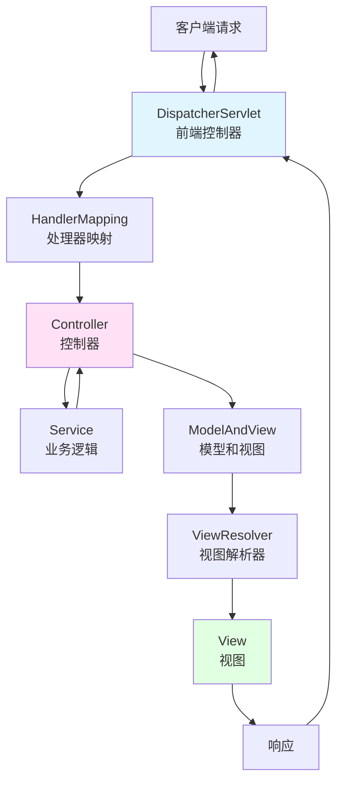

# Spring MVC开发

> **学习目标**：掌握Spring MVC框架的Web层开发
> **核心内容**：MVC架构、控制器开发、参数绑定、视图解析、拦截器
> **预计时间**：5小时
> **前置知识**：Spring Boot 3.x基础

## Spring MVC概述

### 什么是Spring MVC？

Spring MVC（Model-View-Controller）是Spring Framework的Web模块，基于MVC设计模式，用于开发灵活、松耦合的Web应用程序。



### Spring MVC核心组件

```java
/**
 * Spring MVC核心组件
 */
public class SpringMVCKeys {
    public static void main(String[] args) {
        System.out.println("=== Spring MVC核心组件 ===\n");

        System.out.println("1. DispatcherServlet（前端控制器）：");
        System.out.println("   - 接收所有HTTP请求");
        System.out.println("   - 协调其他组件工作");
        System.out.println("   - 整个流程的指挥中心\n");

        System.out.println("2. HandlerMapping（处理器映射）：");
        System.out.println("   - 根据URL找到对应的Controller");
        System.out.println("   - @RequestMapping注解映射\n");

        System.out.println("3. Controller（控制器）：");
        System.out.println("   - 处理具体业务逻辑");
        System.out.println("   - 返回ModelAndView或数据\n");

        System.out.println("4. ModelAndView（模型和视图）：");
        System.out.println("   - Model：数据模型");
        System.out.println("   - View：视图名称\n");

        System.out.println("5. ViewResolver（视图解析器）：");
        System.out.println("   - 解析视图名称到具体视图");
        System.out.println("   - 支持JSP、Thymeleaf、FreeMarker\n");

        System.out.println("6. View（视图）：");
        System.out.println("   - 渲染数据");
        System.out.println("   - 生成HTML响应");
    }
}
```

## 控制器开发

### @RestController注解

```java
package com.example.demo.controller;

import org.springframework.web.bind.annotation.*;
import org.springframework.stereotype.Controller;
import org.springframework.ui.Model;
import lombok.Data;
import java.util.List;
import java.util.ArrayList;

/**
 * Spring MVC控制器示例
 */

// REST风格控制器（返回JSON）
@RestController
@RequestMapping("/api/users")
class UserRestController {

    // GET /api/users - 获取所有用户
    @GetMapping
    public List<User> getAllUsers() {
        List<User> users = new ArrayList<>();
        users.add(new User(1L, "张三", "zhangsan@example.com"));
        users.add(new User(2L, "李四", "lisi@example.com"));
        return users;
    }

    // GET /api/users/{id} - 获取指定用户
    @GetMapping("/{id}")
    public User getUserById(@PathVariable Long id) {
        return new User(id, "用户" + id, "user" + id + "@example.com");
    }

    // POST /api/users - 创建用户
    @PostMapping
    public User createUser(@RequestBody User user) {
        // 创建逻辑
        return user;
    }

    // PUT /api/users/{id} - 更新用户
    @PutMapping("/{id}")
    public User updateUser(@PathVariable Long id, @RequestBody User user) {
        user.setId(id);
        // 更新逻辑
        return user;
    }

    // DELETE /api/users/{id} - 删除用户
    @DeleteMapping("/{id}")
    public void deleteUser(@PathVariable Long id) {
        // 删除逻辑
    }

    // GET /api/users/search?name=xxx - 搜索用户
    @GetMapping("/search")
    public List<User> searchUsers(@RequestParam String name) {
        // 搜索逻辑
        return List.of(new User(1L, name, "search@example.com"));
    }
}

// 传统的MVC控制器（返回视图）
@Controller
@RequestMapping("/users")
class UserViewController {

    // 显示用户列表页面
    @GetMapping
    public String listUsers(Model model) {
        List<User> users = List.of(
            new User(1L, "张三", "zhangsan@example.com"),
            new User(2L, "李四", "lisi@example.com")
        );
        model.addAttribute("users", users);
        model.addAttribute("title", "用户列表");
        return "user/list"; // 返回视图名称
    }

    // 显示用户详情页面
    @GetMapping("/{id}")
    public String getUserDetail(@PathVariable Long id, Model model) {
        User user = new User(id, "用户" + id, "user" + id + "@example.com");
        model.addAttribute("user", user);
        return "user/detail";
    }

    // 显示创建用户表单
    @GetMapping("/new")
    public String showCreateForm(Model model) {
        model.addAttribute("user", new User());
        return "user/form";
    }

    // 处理创建用户请求
    @PostMapping
    public String createUser(User user) {
        // 保存用户
        return "redirect:/users";
    }
}

// User实体类
@Data
class User {
    private Long id;
    private String username;
    private String email;

    public User() {}

    public User(Long id, String username, String email) {
        this.id = id;
        this.username = username;
        this.email = email;
    }
}
```

### 请求映射注解详解

```java
package com.example.demo.controller.mapping;

import org.springframework.web.bind.annotation.*;
import org.springframework.web.bind.annotation.RestController;
import org.springframework.http.ResponseEntity;
import java.util.Map;

/**
 * 请求映射注解详解
 */
@RestController
@RequestMapping("/api/mapping")
class MappingController {

    // 1. @GetMapping - GET请求
    @GetMapping("/get")
    public String getMethod() {
        return "GET请求";
    }

    // 2. @PostMapping - POST请求
    @PostMapping("/post")
    public String postMethod() {
        return "POST请求";
    }

    // 3. @PutMapping - PUT请求
    @PutMapping("/put")
    public String putMethod() {
        return "PUT请求";
    }

    // 4. @DeleteMapping - DELETE请求
    @DeleteMapping("/delete")
    public String deleteMethod() {
        return "DELETE请求";
    }

    // 5. @PatchMapping - PATCH请求
    @PatchMapping("/patch")
    public String patchMethod() {
        return "PATCH请求";
    }

    // 6. 路径变量
    @GetMapping("/users/{id}/posts/{postId}")
    public String getPathVariables(
        @PathVariable Long id,
        @PathVariable Long postId
    ) {
        return String.format("用户ID: %d, 文章ID: %d", id, postId);
    }

    // 7. 请求参数
    @GetMapping("/search")
    public String search(
        @RequestParam String keyword,
        @RequestParam(defaultValue = "1") int page,
        @RequestParam(required = false) String sort
    ) {
        return String.format("关键词: %s, 页码: %d, 排序: %s",
            keyword, page, sort);
    }

    // 8. 多个路径映射到同一方法
    @GetMapping({"/path1", "/path2", "/path3"})
    public String multiplePaths() {
        return "多个路径映射";
    }

    // 9. 请求头条件
    @GetMapping("/header")
    public String checkHeader(
        @RequestHeader("User-Agent") String userAgent,
        @RequestHeader(value = "Accept-Language", defaultValue = "zh-CN") String language
    ) {
        return String.format("User-Agent: %s, Language: %s", userAgent, language);
    }

    // 10. Cookie值
    @GetMapping("/cookie")
    public String getCookie(@CookieValue(value = "sessionId", defaultValue = "") String sessionId) {
        return "Session ID: " + sessionId;
    }

    // 11. 组合注解
    @RequestMapping(
        path = "/complex",
        method = {RequestMethod.GET, RequestMethod.POST},
        params = "action=save",
        headers = "Content-Type=application/json"
    )
    public String complexMapping() {
        return "复杂映射条件";
    }

    // 12. 矩阵变量（路径参数中的键值对）
    @GetMapping("/users/{id}/roles")
    public String matrixVariables(
        @PathVariable String id,
        @MatrixVariable(pathVar = "id") String role
    ) {
        return String.format("用户ID: %s, 角色: %s", id, role);
        // 请求示例: /users/123;role=admin/roles
    }

    // 13. 通配符映射
    @GetMapping("/files/*.pdf")
    public String getPdfFiles() {
        return "匹配所有PDF文件";
    }

    @GetMapping("/resources/**")
    public String getAllResources() {
        return "匹配所有资源路径";
    }

    // 14. 正则表达式映射
    @GetMapping("/users/{id:[\\d]+}")
    public String getUserWithRegex(@PathVariable String id) {
        return "用户ID（仅数字）: " + id;
    }

    // 15. consumes - 限定请求内容类型
    @PostMapping(
        path = "/json",
        consumes = "application/json"
    )
    public String consumeJson(@RequestBody String body) {
        return "只接受JSON: " + body;
    }

    // 16. produces - 限定响应内容类型
    @GetMapping(
        path = "/data",
        produces = "application/json"
    )
    public ResponseEntity<Map<String, String>> produceJson() {
        return ResponseEntity.ok(Map.of("key", "value"));
    }
}
```

## 参数绑定

### 请求参数绑定

```java
package com.example.demo.controller.binding;

import org.springframework.web.bind.annotation.*;
import org.springframework.web.bind.annotation.RestController;
import org.springframework.http.ResponseEntity;
import org.springframework.validation.annotation.Validated;
import jakarta.validation.constraints.*;
import lombok.Data;

import java.util.List;
import java.util.Map;

/**
 * 参数绑定示例
 */
@RestController
@RequestMapping("/api/binding")
class ParameterBindingController {

    // 1. 简单类型绑定
    @GetMapping("/simple")
    public String simpleTypes(
        @RequestParam String name,
        @RequestParam int age,
        @RequestParam boolean active
    ) {
        return String.format("姓名: %s, 年龄: %d, 状态: %b", name, age, active);
    }

    // 2. 对象绑定
    @PostMapping("/object")
    public User objectBinding(@RequestBody User user) {
        return user;
    }

    // 3. 表单数据绑定
    @PostMapping("/form")
    public String formBinding(@ModelAttribute User user) {
        return String.format("用户: %s, 邮箱: %s", user.getUsername(), user.getEmail());
    }

    // 4. 数组绑定
    @PostMapping("/array")
    public String arrayBinding(@RequestParam List<String> names) {
        return "名称列表: " + String.join(", ", names);
    }

    // 5. Map绑定
    @PostMapping("/map")
    public String mapBinding(@RequestBody Map<String, Object> data) {
        return "数据: " + data.toString();
    }

    // 6. 路径变量绑定
    @GetMapping("/path/{id}/{name}")
    public String pathVariables(
        @PathVariable Long id,
        @PathVariable String name
    ) {
        return String.format("ID: %d, 姓名: %s", id, name);
    }

    // 7. 请求头绑定
    @GetMapping("/headers")
    public Map<String, String> headerBinding(
        @RequestHeader Map<String, String> headers
    ) {
        return headers;
    }

    // 8. Cookie绑定
    @GetMapping("/cookies")
    public String cookieBinding(@CookieValue(name = "sessionId", defaultValue = "") String sessionId) {
        return "Session ID: " + sessionId;
    }

    // 9. 嵌套对象绑定
    @PostMapping("/nested")
    public Order nestedBinding(@RequestBody Order order) {
        return order;
    }

    // 10. 集合绑定
    @PostMapping("/collection")
    public String collectionBinding(@RequestBody List<User> users) {
        return String.format("用户数量: %d", users.size());
    }

    // 11. 参数校验
    @PostMapping("/validate")
    public String validateUser(@Validated @RequestBody UserDto user) {
        return "验证通过: " + user.getUsername();
    }

    // 12. 自定义编辑器
    @InitBinder
    public void initBinder(org.springframework.web.bind.WebDataBinder binder) {
        binder.registerCustomEditor(String.class, new StringTrimmerEditor(true));
    }
}

// User实体
@Data
class User {
    private Long id;
    private String username;
    private String email;
}

// Order实体（嵌套对象）
@Data
class Order {
    private Long id;
    private String orderNo;
    private User user; // 嵌套对象
    private List<OrderItem> items; // 嵌套集合
}

@Data
class OrderItem {
    private String productName;
    private int quantity;
    private double price;
}

// 带校验的User DTO
@Data
class UserDto {
    @NotBlank(message = "用户名不能为空")
    @Size(min = 3, max = 20, message = "用户名长度必须在3-20之间")
    private String username;

    @NotBlank(message = "邮箱不能为空")
    @Email(message = "邮箱格式不正确")
    private String email;

    @Min(value = 18, message = "年龄不能小于18")
    @Max(value = 100, message = "年龄不能大于100")
    private Integer age;
}

// 自定义字符串编辑器
class StringTrimmerEditor extends java.beans.PropertyEditorSupport {
    private final boolean emptyAsNull;

    public StringTrimmerEditor(boolean emptyAsNull) {
        this.emptyAsNull = emptyAsNull;
    }

    @Override
    public void setAsText(String text) {
        if (text == null) {
            setValue(null);
        } else {
            String value = text.trim();
            if (this.emptyAsNull && value.isEmpty()) {
                setValue(null);
            } else {
                setValue(value);
            }
        }
    }
}
```

## 参数校验

### 校验注解使用

```java
package com.example.demo.controller.validation;

import org.springframework.web.bind.annotation.*;
import org.springframework.web.bind.annotation.RestController;
import org.springframework.validation.annotation.Validated;
import org.springframework.validation.BindingResult;
import org.springframework.validation.FieldError;
import jakarta.validation.*;
import lombok.Data;

import java.util.List;
import java.util.Set;
import java.util.stream.Collectors;

/**
 * 参数校验示例
 */
@RestController
@RequestMapping("/api/validation")
class ValidationController {

    // 1. 基本校验
    @PostMapping("/user")
    public ResponseEntity<?> createUser(@Validated @RequestBody User user) {
        return ResponseEntity.ok("用户创建成功");
    }

    // 2. 分组校验
    @PostMapping("/user/create")
    public ResponseEntity<?> createUserWithGroup(
        @Validated(User.Create.class) @RequestBody User user
    ) {
        return ResponseEntity.ok("创建成功");
    }

    @PutMapping("/user/update")
    public ResponseEntity<?> updateUserWithGroup(
        @Validated(User.Update.class) @RequestBody User user
    ) {
        return ResponseEntity.ok("更新成功");
    }

    // 3. 手动校验
    @PostMapping("/user/manual")
    public ResponseEntity<?> manualValidation(@RequestBody User user) {
        ValidatorFactory factory = Validation.buildDefaultValidatorFactory();
        Validator validator = factory.getValidator();
        Set<ConstraintViolation<User>> violations = validator.validate(user);

        if (!violations.isEmpty()) {
            List<String> errors = violations.stream()
                .map(ConstraintViolation::getMessage)
                .collect(Collectors.toList());
            return ResponseEntity.badRequest().body(errors);
        }

        return ResponseEntity.ok("校验通过");
    }

    // 4. 嵌套校验
    @PostMapping("/order")
    public ResponseEntity<?> createOrder(@Validated @RequestBody Order order) {
        return ResponseEntity.ok("订单创建成功");
    }

    // 5. 自定义校验
    @PostMapping("/password")
    public ResponseEntity<?> checkPassword(@Validated @RequestBody PasswordForm form) {
        return ResponseEntity.ok("密码符合要求");
    }
}

// 带校验注解的实体
@Data
class User {
    // 基础校验
    @Null(message = "创建时ID必须为空", groups = Create.class)
    @NotNull(message = "更新时ID不能为空", groups = Update.class)
    private Long id;

    @NotBlank(message = "用户名不能为空", groups = {Create.class, Update.class})
    @Size(min = 3, max = 20, message = "用户名长度必须在3-20之间")
    private String username;

    @NotBlank(message = "邮箱不能为空")
    @Email(message = "邮箱格式不正确")
    private String email;

    @NotBlank(message = "手机号不能为空")
    @Pattern(regexp = "^1[3-9]\\d{9}$", message = "手机号格式不正确")
    private String phone;

    @Min(value = 18, message = "年龄不能小于18")
    @Max(value = 100, message = "年龄不能大于100")
    private Integer age;

    @Past(message = "生日必须是过去的日期")
    private java.util.Date birthday;

    @AssertTrue(message = "必须同意协议")
    private boolean agreed;

    // 分组接口
    public interface Create {}
    public interface Update {}
}

@Data
class Order {
    @NotNull(message = "订单号不能为空")
    private String orderNo;

    @Valid
    @NotNull(message = "用户信息不能为空")
    private User user;

    @Valid
    @NotEmpty(message = "订单项不能为空")
    private List<OrderItem> items;

    @Positive(message = "总金额必须为正数")
    private Double totalAmount;
}

@Data
class OrderItem {
    @NotBlank(message = "商品名称不能为空")
    private String productName;

    @Min(value = 1, message = "数量不能小于1")
    private Integer quantity;

    @Positive(message = "价格必须为正数")
    private Double price;
}

// 自定义校验注解
@Target({ElementType.FIELD})
@Retention(RetentionPolicy.RUNTIME)
@Constraint(validatedBy = PasswordValidator.class)
public @interface ValidPassword {
    String message() default "密码必须包含大小写字母、数字和特殊字符";

    Class<?>[] groups() default {};

    Class<? extends Payload>[] payload() default {};
}

// 自定义校验器
class PasswordValidator implements ConstraintValidator<ValidPassword, String> {

    @Override
    public boolean isValid(String password, ConstraintValidatorContext context) {
        if (password == null || password.length() < 8) {
            return false;
        }

        boolean hasUpperCase = !password.equals(password.toLowerCase());
        boolean hasLowerCase = !password.equals(password.toUpperCase());
        boolean hasDigit = password.matches(".*\\d.*");
        boolean hasSpecial = !password.matches("[A-Za-z0-9]*");

        return hasUpperCase && hasLowerCase && hasDigit && hasSpecial;
    }
}

@Data
class PasswordForm {
    @NotBlank(message = "密码不能为空")
    @Size(min = 8, message = "密码长度不能少于8位")
    @ValidPassword
    private String password;
}
```

## 异常处理

### 全局异常处理

```java
package com.example.demo.exception;

import org.springframework.web.bind.annotation.*;
import org.springframework.http.ResponseEntity;
import org.springframework.http.HttpStatus;
import org.springframework.validation.FieldError;
import org.springframework.web.bind.MethodArgumentNotValidException;
import org.springframework.web.method.annotation.MethodArgumentTypeMismatchException;
import org.springframework.web.servlet.NoHandlerFoundException;
import lombok.extern.slf4j.Slf4j;

import java.util.HashMap;
import java.util.Map;
import java.util.stream.Collectors;

/**
 * 全局异常处理器
 */
@Slf4j
@RestControllerAdvice
class GlobalExceptionHandler {

    // 1. 处理参数校验异常
    @ExceptionHandler(MethodArgumentNotValidException.class)
    public ResponseEntity<ApiResponse<Map<String, String>>> handleValidationException(
        MethodArgumentNotValidException ex
    ) {
        Map<String, String> errors = ex.getBindingResult()
            .getFieldErrors()
            .stream()
            .collect(Collectors.toMap(
                FieldError::getField,
                FieldError::getDefaultMessage,
                (existing, replacement) -> existing + "; " + replacement
            ));

        log.error("参数校验失败: {}", errors);
        return ResponseEntity
            .status(HttpStatus.BAD_REQUEST)
            .body(ApiResponse.error(400, "参数校验失败", errors));
    }

    // 2. 处理资源不存在异常
    @ExceptionHandler(ResourceNotFoundException.class)
    public ResponseEntity<ApiResponse<Void>> handleResourceNotFound(
        ResourceNotFoundException ex
    ) {
        log.error("资源不存在: {}", ex.getMessage());
        return ResponseEntity
            .status(HttpStatus.NOT_FOUND)
            .body(ApiResponse.error(404, ex.getMessage()));
    }

    // 3. 处理业务异常
    @ExceptionHandler(BusinessException.class)
    public ResponseEntity<ApiResponse<Void>> handleBusinessException(
        BusinessException ex
    ) {
        log.error("业务异常: {}", ex.getMessage());
        return ResponseEntity
            .status(HttpStatus.BAD_REQUEST)
            .body(ApiResponse.error(ex.getCode(), ex.getMessage()));
    }

    // 4. 处理类型不匹配异常
    @ExceptionHandler(MethodArgumentTypeMismatchException.class)
    public ResponseEntity<ApiResponse<Void>> handleTypeMismatch(
        MethodArgumentTypeMismatchException ex
    ) {
        String message = String.format("参数类型错误: %s", ex.getName());
        log.error(message);
        return ResponseEntity
            .status(HttpStatus.BAD_REQUEST)
            .body(ApiResponse.error(400, message));
    }

    // 5. 处理404异常
    @ExceptionHandler(NoHandlerFoundException.class)
    public ResponseEntity<ApiResponse<Void>> handleNotFound(
        NoHandlerFoundException ex
    ) {
        log.error("请求路径不存在: {}", ex.getRequestURL());
        return ResponseEntity
            .status(HttpStatus.NOT_FOUND)
            .body(ApiResponse.error(404, "请求路径不存在"));
    }

    // 6. 处理所有未捕获异常
    @ExceptionHandler(Exception.class)
    public ResponseEntity<ApiResponse<Void>> handleGlobalException(
        Exception ex
    ) {
        log.error("系统异常", ex);
        return ResponseEntity
            .status(HttpStatus.INTERNAL_SERVER_ERROR)
            .body(ApiResponse.error(500, "服务器内部错误"));
    }
}

// 自定义异常
class ResourceNotFoundException extends RuntimeException {
    public ResourceNotFoundException(String message) {
        super(message);
    }
}

class BusinessException extends RuntimeException {
    private final int code;

    public BusinessException(int code, String message) {
        super(message);
        this.code = code;
    }

    public int getCode() {
        return code;
    }
}

// 统一响应格式
record ApiResponse<T>(
    int code,
    String message,
    T data,
    long timestamp
) {
    public static <T> ApiResponse<T> success(T data) {
        return new ApiResponse<>(200, "success", data, System.currentTimeMillis());
    }

    public static <T> ApiResponse<T> success(String message, T data) {
        return new ApiResponse<>(200, message, data, System.currentTimeMillis());
    }

    public static <T> ApiResponse<T> error(int code, String message) {
        return new ApiResponse<>(code, message, null, System.currentTimeMillis());
    }

    public static <T> ApiResponse<T> error(int code, String message, T data) {
        return new ApiResponse<>(code, message, data, System.currentTimeMillis());
    }
}
```

## 拦截器与过滤器

### 拦截器配置

```java
package com.example.demo.config;

import org.springframework.context.annotation.Configuration;
import org.springframework.web.servlet.HandlerInterceptor;
import org.springframework.web.servlet.ModelAndView;
import org.springframework.web.servlet.config.annotation.InterceptorRegistry;
import org.springframework.web.servlet.config.annotation.WebMvcConfigurer;
import jakarta.servlet.http.HttpServletRequest;
import jakarta.servlet.http.HttpServletResponse;
import lombok.extern.slf4j.Slf4j;

/**
 * 拦截器配置
 */
@Slf4j
@Configuration
class WebMvcConfig implements WebMvcConfigurer {

    @Override
    public void addInterceptors(InterceptorRegistry registry) {
        registry.addInterceptor(new LoggingInterceptor())
            .addPathPatterns("/**")
            .excludePathPatterns("/health", "/actuator/**");

        registry.addInterceptor(new AuthInterceptor())
            .addPathPatterns("/api/**")
            .excludePathPatterns("/api/public/**", "/api/auth/login");
    }
}

// 日志拦截器
@Slf4j
class LoggingInterceptor implements HandlerInterceptor {

    @Override
    public boolean preHandle(HttpServletRequest request,
                           HttpServletResponse response,
                           Object handler) {
        long startTime = System.currentTimeMillis();
        request.setAttribute("startTime", startTime);

        log.info("请求开始: {} {}", request.getMethod(), request.getRequestURI());

        return true; // 返回true继续执行，false中断请求
    }

    @Override
    public void postHandle(HttpServletRequest request,
                         HttpServletResponse response,
                         Object handler,
                         ModelAndView modelAndView) {
        log.info("视图渲染: {}", request.getRequestURI());
    }

    @Override
    public void afterCompletion(HttpServletRequest request,
                              HttpServletResponse response,
                              Object handler,
                              Exception ex) {
        Long startTime = (Long) request.getAttribute("startTime");
        long duration = System.currentTimeMillis() - startTime;

        log.info("请求完成: {} {} 耗时: {}ms",
            request.getMethod(),
            request.getRequestURI(),
            duration);

        if (ex != null) {
            log.error("请求异常: ", ex);
        }
    }
}

// 认证拦截器
@Slf4j
class AuthInterceptor implements HandlerInterceptor {

    @Override
    public boolean preHandle(HttpServletRequest request,
                           HttpServletResponse response,
                           Object handler) {
        String token = request.getHeader("Authorization");

        if (token == null || !token.startsWith("Bearer ")) {
            response.setStatus(HttpServletResponse.SC_UNAUTHORIZED);
            return false;
        }

        // 验证token逻辑
        String jwt = token.substring(7);
        if (!validateToken(jwt)) {
            response.setStatus(HttpServletResponse.SC_UNAUTHORIZED);
            return false;
        }

        return true;
    }

    private boolean validateToken(String token) {
        // 实际项目中验证JWT token
        return true;
    }
}
```

### 过滤器配置

```java
package com.example.demo.filter;

import org.springframework.boot.web.servlet.FilterRegistrationBean;
import org.springframework.context.annotation.Bean;
import org.springframework.context.annotation.Configuration;
import jakarta.servlet.*;
import jakarta.servlet.http.HttpServletRequest;
import jakarta.servlet.http.HttpServletResponse;
import lombok.extern.slf4j.Slf4j;
import java.io.IOException;

/**
 * 过滤器配置
 */
@Slf4j
@Configuration
class FilterConfig {

    @Bean
    public FilterRegistrationBean<RequestLoggingFilter> requestLoggingFilter() {
        FilterRegistrationBean<RequestLoggingFilter> registration = new FilterRegistrationBean<>();
        registration.setFilter(new RequestLoggingFilter());
        registration.addUrlPatterns("/*");
        registration.setOrder(1);
        return registration;
    }

    @Bean
    public FilterRegistrationBean<CORSFilter> corsFilter() {
        FilterRegistrationBean<CORSFilter> registration = new FilterRegistrationBean<>();
        registration.setFilter(new CORSFilter());
        registration.addUrlPatterns("/*");
        registration.setOrder(2);
        return registration;
    }
}

// 请求日志过滤器
@Slf4j
class RequestLoggingFilter implements Filter {

    @Override
    public void doFilter(ServletRequest request,
                       ServletResponse response,
                       FilterChain chain) throws IOException, ServletException {
        HttpServletRequest httpRequest = (HttpServletRequest) request;
        HttpServletResponse httpResponse = (HttpServletResponse) response;

        log.info("过滤器: {} {}", httpRequest.getMethod(), httpRequest.getRequestURI());

        // 继续执行
        chain.doFilter(request, response);

        log.info("响应状态: {}", httpResponse.getStatus());
    }
}

// CORS过滤器
class CORSFilter implements Filter {

    @Override
    public void doFilter(ServletRequest request,
                       ServletResponse response,
                       FilterChain chain) throws IOException, ServletException {
        HttpServletResponse httpResponse = (HttpServletResponse) response;

        httpResponse.setHeader("Access-Control-Allow-Origin", "*");
        httpResponse.setHeader("Access-Control-Allow-Methods", "GET, POST, PUT, DELETE, OPTIONS");
        httpResponse.setHeader("Access-Control-Allow-Headers", "Content-Type, Authorization");
        httpResponse.setHeader("Access-Control-Max-Age", "3600");

        chain.doFilter(request, response);
    }
}
```

## 文件上传下载

### 文件处理

```java
package com.example.demo.controller.file;

import org.springframework.web.bind.annotation.*;
import org.springframework.web.bind.annotation.RestController;
import org.springframework.web.multipart.MultipartFile;
import org.springframework.http.ResponseEntity;
import org.springframework.http.MediaType;
import lombok.Data;
import java.io.*;
import java.nio.file.Files;
import java.nio.file.Path;
import java.nio.file.Paths;
import java.util.HashMap;
import java.util.Map;

/**
 * 文件上传下载控制器
 */
@RestController
@RequestMapping("/api/files")
class FileController {

    private static final String UPLOAD_DIR = "uploads/";

    // 1. 单文件上传
    @PostMapping("/upload")
    public ResponseEntity<Map<String, Object>> uploadFile(
        @RequestParam("file") MultipartFile file
    ) {
        Map<String, Object> result = new HashMap<>();

        if (file.isEmpty()) {
            result.put("success", false);
            result.put("message", "文件为空");
            return ResponseEntity.badRequest().body(result);
        }

        try {
            // 确保上传目录存在
            File uploadDir = new File(UPLOAD_DIR);
            if (!uploadDir.exists()) {
                uploadDir.mkdirs();
            }

            // 保存文件
            String filename = System.currentTimeMillis() + "_" + file.getOriginalFilename();
            Path path = Paths.get(UPLOAD_DIR + filename);
            Files.write(path, file.getBytes());

            result.put("success", true);
            result.put("message", "上传成功");
            result.put("filename", filename);
            result.put("size", file.getSize());
            result.put("contentType", file.getContentType());

        } catch (IOException e) {
            result.put("success", false);
            result.put("message", "上传失败: " + e.getMessage());
        }

        return ResponseEntity.ok(result);
    }

    // 2. 多文件上传
    @PostMapping("/uploads")
    public ResponseEntity<Map<String, Object>> uploadFiles(
        @RequestParam("files") MultipartFile[] files
    ) {
        Map<String, Object> result = new HashMap<>();
        int successCount = 0;
        int failCount = 0;

        try {
            File uploadDir = new File(UPLOAD_DIR);
            if (!uploadDir.exists()) {
                uploadDir.mkdirs();
            }

            for (MultipartFile file : files) {
                if (!file.isEmpty()) {
                    String filename = System.currentTimeMillis() + "_" + file.getOriginalFilename();
                    Path path = Paths.get(UPLOAD_DIR + filename);
                    Files.write(path, file.getBytes());
                    successCount++;
                } else {
                    failCount++;
                }
            }

            result.put("success", true);
            result.put("message", "上传完成");
            result.put("successCount", successCount);
            result.put("failCount", failCount);

        } catch (IOException e) {
            result.put("success", false);
            result.put("message", "上传失败: " + e.getMessage());
        }

        return ResponseEntity.ok(result);
    }

    // 3. 文件下载
    @GetMapping("/download/{filename}")
    public ResponseEntity<byte[]> downloadFile(@PathVariable String filename) {
        try {
            Path path = Paths.get(UPLOAD_DIR + filename);
            byte[] fileContent = Files.readAllBytes(path);

            return ResponseEntity.ok()
                .contentType(MediaType.APPLICATION_OCTET_STREAM)
                .header("Content-Disposition", "attachment; filename=\"" + filename + "\"")
                .body(fileContent);

        } catch (IOException e) {
            return ResponseEntity.notFound().build();
        }
    }

    // 4. 文件预览
    @GetMapping("/preview/{filename}")
    public ResponseEntity<byte[]> previewFile(@PathVariable String filename) {
        try {
            Path path = Paths.get(UPLOAD_DIR + filename);
            byte[] fileContent = Files.readAllBytes(path);

            // 根据文件扩展名确定Content-Type
            String contentType = Files.probeContentType(path);
            if (contentType == null) {
                contentType = "application/octet-stream";
            }

            return ResponseEntity.ok()
                .contentType(MediaType.parseMediaType(contentType))
                .body(fileContent);

        } catch (IOException e) {
            return ResponseEntity.notFound().build();
        }
    }

    // 5. 文件信息
    @GetMapping("/info/{filename}")
    public ResponseEntity<Map<String, Object>> getFileInfo(@PathVariable String filename) {
        Map<String, Object> info = new HashMap<>();

        try {
            Path path = Paths.get(UPLOAD_DIR + filename);
            info.put("exists", Files.exists(path));
            info.put("size", Files.size(path));
            info.put("contentType", Files.probeContentType(path));
            info.put("lastModified", Files.getLastModifiedTime(path).toMillis());

        } catch (IOException e) {
            info.put("error", e.getMessage());
        }

        return ResponseEntity.ok(info);
    }

    // 6. 删除文件
    @DeleteMapping("/delete/{filename}")
    public ResponseEntity<Map<String, Object>> deleteFile(@PathVariable String filename) {
        Map<String, Object> result = new HashMap<>();

        try {
            Path path = Paths.get(UPLOAD_DIR + filename);
            boolean deleted = Files.deleteIfExists(path);

            result.put("success", deleted);
            result.put("message", deleted ? "删除成功" : "文件不存在");

        } catch (IOException e) {
            result.put("success", false);
            result.put("message", "删除失败: " + e.getMessage());
        }

        return ResponseEntity.ok(result);
    }

    // 7. 带元数据的文件上传
    @PostMapping("/upload/metadata")
    public ResponseEntity<Map<String, Object>> uploadWithMetadata(
        @RequestParam("file") MultipartFile file,
        @RequestParam("description") String description,
        @RequestParam("category") String category
    ) {
        Map<String, Object> result = new HashMap<>();

        // 保存文件和元数据
        FileMetadata metadata = new FileMetadata(
            file.getOriginalFilename(),
            file.getSize(),
            description,
            category
        );

        // 实际项目中应该保存到数据库
        result.put("success", true);
        result.put("metadata", metadata);

        return ResponseEntity.ok(result);
    }
}

@Data
class FileMetadata {
    private String filename;
    private long size;
    private String description;
    private String category;

    public FileMetadata(String filename, long size, String description, String category) {
        this.filename = filename;
        this.size = size;
        this.description = description;
        this.category = category;
    }
}
```

## 避坑指南

### 常见问题与解决方案

```java
/**
 * Spring MVC常见问题与解决方案
 */
public class SpringMVCPitfalls {
    public static void main(String[] args) {
        System.out.println("=== Spring MVC避坑指南 ===\n");

        System.out.println("1. 日期格式问题：");
        System.out.println("   ❌ 问题：前端日期字符串无法绑定到Date字段");
        System.out.println("   ✅ 解决：使用@DateTimeFormat注解");
        System.out.println("   @DateTimeFormat(pattern = \"yyyy-MM-dd\")");
        System.out.println("   private Date birthday;\n");

        System.out.println("2. 中文乱码问题：");
        System.out.println("   ❌ 问题：POST请求中文参数乱码");
        System.out.println("   ✅ 解决：配置字符编码过滤器");
        System.out.println("   @Bean");
        System.out.println("   public FilterRegistrationBean<CharacterEncodingFilter> filter() {");
        System.out.println("       FilterRegistrationBean<CharacterEncodingFilter> registration = new FilterRegistrationBean<>();");
        System.out.println("       registration.setFilter(new CharacterEncodingFilter(\"UTF-8\", true));");
        System.out.println("       registration.addUrlPatterns(\"/*\");");
        System.out.println("       return registration;");
        System.out.println("   }\n");

        System.out.println("3. 跨域问题：");
        System.out.println("   ❌ 问题：前后端分离跨域被阻止");
        System.out.println("   ✅ 解决：添加CORS配置或注解");
        System.out.println("   @CrossOrigin(origins = \"*\")");
        System.out.println("   @RestController");
        System.out.println("   public class MyController {}\n");

        System.out.println("4. 静态资源访问：");
        System.out.println("   ❌ 问题：静态资源404");
        System.out.println("   ✅ 解决：配置静态资源路径");
        System.out.println("   spring.web.resources.static-locations=classpath:/static/\n");

        System.out.println("5. 文件上传大小限制：");
        System.out.println("   ❌ 问题：大文件上传失败");
        System.out.println("   ✅ 解决：配置上传大小限制");
        System.out.println("   spring.servlet.multipart.max-file-size=10MB");
        System.out.println("   spring.servlet.multipart.max-request-size=100MB\n");

        System.out.println("6. JSON序列化问题：");
        System.out.println("   ❌ 问题：Date格式不一致、null字段不序列化");
        System.out.println("   ✅ 解决：配置Jackson");
        System.out.println("   spring.jackson.date-format=yyyy-MM-dd HH:mm:ss");
        System.out.println("   spring.jackson.serialization.write-dates-as-timestamps=false");
        System.out.println("   spring.jackson.default-property-inclusion=non_null\n");

        System.out.println("7. 参数校验失效：");
        System.out.println("   ❌ 问题：@Valid注解不生效");
        System.out.println("   ✅ 解决：");
        System.out.println("   - 确保有validation依赖");
        System.out.println("   - 使用@Valid或@Validated");
        System.out.println("   - 控制器使用@Validated注解\n");

        System.out.println("8. 拦截器和过滤器的区别：");
        System.out.println("   - Filter：Servlet级别，拦截所有请求");
        System.out.println("   - Interceptor：Spring级别，只拦截控制器");
        System.out.println("   - 选择建议：");
        System.out.println("     * 编码、CORS用Filter");
        System.out.println("     * 日志、权限校验用Interceptor");
    }
}
```

## 实战练习

### 练习：用户管理API

```java
package com.example.demo.practice;

import org.springframework.web.bind.annotation.*;
import org.springframework.web.bind.annotation.RestController;
import org.springframework.validation.annotation.Validated;
import org.springframework.http.ResponseEntity;
import org.springframework.http.HttpStatus;
import lombok.Data;
import lombok.extern.slf4j.Slf4j;
import jakarta.validation.constraints.*;
import jakarta.validation.Valid;

import java.util.*;
import java.util.concurrent.ConcurrentHashMap;
import java.util.concurrent.atomic.AtomicLong;

/**
 * 用户管理API实战
 */
@Slf4j
@RestController
@RequestMapping("/api/practice/users")
@Validated
class UserManagementController {

    private final Map<Long, User> userStore = new ConcurrentHashMap<>();
    private final AtomicLong idGenerator = new AtomicLong(1);

    // 创建用户
    @PostMapping
    public ResponseEntity<ApiResponse<User>> createUser(@Valid @RequestBody CreateUserRequest request) {
        User user = new User();
        user.setId(idGenerator.getAndIncrement());
        user.setUsername(request.getUsername());
        user.setEmail(request.getEmail());
        user.setAge(request.getAge());
        user.setCreatedAt(new Date());

        userStore.put(user.getId(), user);

        log.info("创建用户: {}", user.getUsername());
        return ResponseEntity
            .status(HttpStatus.CREATED)
            .body(ApiResponse.success("创建成功", user));
    }

    // 获取用户列表
    @GetMapping
    public ResponseEntity<ApiResponse<List<User>>> getUsers(
        @RequestParam(defaultValue = "1") int page,
        @RequestParam(defaultValue = "10") int size
    ) {
        List<User> users = new ArrayList<>(userStore.values());
        return ResponseEntity.ok(ApiResponse.success(users));
    }

    // 获取用户详情
    @GetMapping("/{id}")
    public ResponseEntity<ApiResponse<User>> getUser(@PathVariable Long id) {
        User user = userStore.get(id);
        if (user == null) {
            return ResponseEntity
                .status(HttpStatus.NOT_FOUND)
                .body(ApiResponse.error(404, "用户不存在"));
        }
        return ResponseEntity.ok(ApiResponse.success(user));
    }

    // 更新用户
    @PutMapping("/{id}")
    public ResponseEntity<ApiResponse<User>> updateUser(
        @PathVariable Long id,
        @Valid @RequestBody UpdateUserRequest request
    ) {
        User user = userStore.get(id);
        if (user == null) {
            return ResponseEntity
                .status(HttpStatus.NOT_FOUND)
                .body(ApiResponse.error(404, "用户不存在"));
        }

        if (request.getUsername() != null) {
            user.setUsername(request.getUsername());
        }
        if (request.getEmail() != null) {
            user.setEmail(request.getEmail());
        }
        if (request.getAge() != null) {
            user.setAge(request.getAge());
        }

        log.info("更新用户: {}", user.getUsername());
        return ResponseEntity.ok(ApiResponse.success("更新成功", user));
    }

    // 删除用户
    @DeleteMapping("/{id}")
    public ResponseEntity<ApiResponse<Void>> deleteUser(@PathVariable Long id) {
        User removed = userStore.remove(id);
        if (removed == null) {
            return ResponseEntity
                .status(HttpStatus.NOT_FOUND)
                .body(ApiResponse.error(404, "用户不存在"));
        }

        log.info("删除用户ID: {}", id);
        return ResponseEntity.ok(ApiResponse.success("删除成功", null));
    }

    // 搜索用户
    @GetMapping("/search")
    public ResponseEntity<ApiResponse<List<User>>> searchUsers(
        @RequestParam String keyword
    ) {
        List<User> results = userStore.values().stream()
            .filter(u -> u.getUsername().contains(keyword) || u.getEmail().contains(keyword))
            .toList();

        return ResponseEntity.ok(ApiResponse.success(results));
    }
}

@Data
class User {
    private Long id;
    private String username;
    private String email;
    private Integer age;
    private Date createdAt;
}

@Data
class CreateUserRequest {
    @NotBlank(message = "用户名不能为空")
    @Size(min = 3, max = 20)
    private String username;

    @NotBlank
    @Email
    private String email;

    @Min(18)
    @Max(100)
    private Integer age;
}

@Data
class UpdateUserRequest {
    @Size(min = 3, max = 20)
    private String username;

    @Email
    private String email;

    @Min(18)
    @Max(100)
    private Integer age;
}

record ApiResponse<T>(
    int code,
    String message,
    T data,
    long timestamp
) {
    public static <T> ApiResponse<T> success(String message, T data) {
        return new ApiResponse<>(200, message, data, System.currentTimeMillis());
    }

    public static <T> ApiResponse<T> error(int code, String message) {
        return new ApiResponse<>(code, message, null, System.currentTimeMillis());
    }
}
```

## 本章小结

### 知识点回顾

✅ **Spring MVC核心**：DispatcherServlet、Controller、ViewResolver
✅ **控制器开发**：@RestController、@RequestMapping、请求映射
✅ **参数绑定**：@RequestParam、@PathVariable、@RequestBody、@ModelAttribute
✅ **参数校验**：JSR-303校验、自定义校验、分组校验
✅ **异常处理**：@RestControllerAdvice、全局异常处理
✅ **拦截器**：HandlerInterceptor、preHandle、postHandle、afterCompletion
✅ **过滤器**：Filter、FilterRegistrationBean
✅ **文件处理**：MultipartFile、文件上传下载

### 学习成果

完成本章学习后，你应该能够：
- 理解Spring MVC的请求处理流程
- 熟练使用各种注解开发控制器
- 掌握参数绑定和校验
- 实现全局异常处理
- 使用拦截器和过滤器
- 处理文件上传下载

### 最佳实践

1. 使用@RestController返回JSON数据
2. 合理使用HTTP方法和状态码
3. 统一异常处理和响应格式
4. 参数校验使用JSR-303注解
5. 日志使用拦截器而不是过滤器
6. 文件上传限制大小和类型

### 下一步

恭喜你掌握了Spring MVC开发！下一章我们将学习Spring Data JPA，深入理解数据访问层。

**准备好了吗？让我们继续Spring Data JPA之旅！** 🚀

---

**学习时间**：约5小时
**难度等级**：★★★★☆
**下一章**：[Spring Data JPA数据访问](./chapter-126.md)
