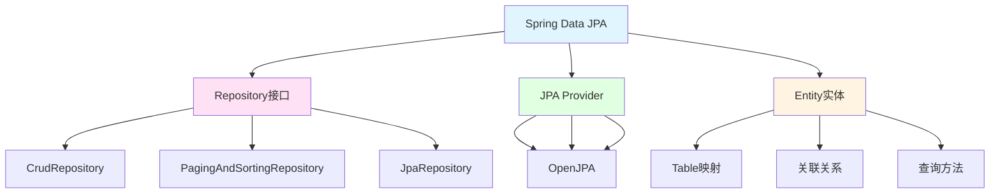

# Spring Data JPA数据访问

> **学习目标**：掌握Spring Data JPA数据持久化技术
> **核心内容**：JPA基础、Repository接口、查询方法、关联映射、事务管理、性能优化
> **预计时间**：6小时
> **前置知识**：Spring MVC、SQL基础

## Spring Data JPA概述

### 什么是Spring Data JPA？

Spring Data JPA是Spring Data家族的一部分，用于简化JPA（Java Persistence API）的数据访问层开发。它提供了基于Repository模型的抽象，极大地简化了数据访问代码。



### 核心优势

```text
✅ 极大简化数据访问层代码
✅ 自动实现常见CRUD操作
✅ 支持方法名查询
✅ 支持@Query自定义查询
✅ 支持分页和排序
✅ 支持审计功能
✅ 与Spring Boot无缝集成
```

## 快速开始

### 添加依赖

```xml
<!-- pom.xml -->
<dependencies>
    <!-- Spring Data JPA -->
    <dependency>
        <groupId>org.springframework.boot</groupId>
        <artifactId>spring-boot-starter-data-jpa</artifactId>
    </dependency>

    <!-- MySQL驱动 -->
    <dependency>
        <groupId>com.mysql</groupId>
        <artifactId>mysql-connector-j</artifactId>
        <scope>runtime</scope>
    </dependency>

    <!-- H2数据库（用于测试） -->
    <dependency>
        <groupId>com.h2database</groupId>
        <artifactId>h2</artifactId>
        <scope>test</scope>
    </dependency>

    <!-- Lombok -->
    <dependency>
        <groupId>org.projectlombok</groupId>
        <artifactId>lombok</artifactId>
        <optional>true</optional>
    </dependency>
</dependencies>
```

### 配置文件

```yaml
# application.yml
spring:
  datasource:
    url: jdbc:mysql://localhost:3306/demo_db?useUnicode=true&characterEncoding=utf8&useSSL=false&serverTimezone=Asia/Shanghai
    username: root
    password: your_password
    driver-class-name: com.mysql.cj.jdbc.Driver

    # HikariCP连接池配置
    hikari:
      maximum-pool-size: 10
      minimum-idle: 5
      connection-timeout: 30000
      idle-timeout: 600000
      max-lifetime: 1800000

  jpa:
    database-platform: org.hibernate.dialect.MySQLDialect
    hibernate:
      ddl-auto: update  # none, validate, update, create, create-drop
    show-sql: true
    properties:
      hibernate:
        format_sql: true
        use_sql_comments: true
        jdbc:
          batch_size: 50
        order_inserts: true
        order_updates: true

logging:
  level:
    org.hibernate.SQL: DEBUG
    org.hibernate.type.descriptor.sql.BasicBinder: TRACE
```

## 实体定义

### 基础实体

```java
package com.example.demo.entity;

import jakarta.persistence.*;
import lombok.Data;
import org.hibernate.annotations.CreationTimestamp;
import org.hibernate.annotations.UpdateTimestamp;
import java.time.LocalDateTime;

/**
 * 用户实体
 */
@Data
@Entity
@Table(name = "users", indexes = {
    @Index(name = "idx_email", columnList = "email"),
    @Index(name = "idx_username", columnList = "username")
})
public class User {

    @Id
    @GeneratedValue(strategy = GenerationType.IDENTITY)
    private Long id;

    @Column(nullable = false, unique = true, length = 50)
    private String username;

    @Column(nullable = false, unique = true, length = 100)
    private String email;

    @Column(length = 20)
    private String phone;

    @Column(length = 255)
    private String password;

    @Column(length = 500)
    private String avatar;

    @Column(length = 200)
    private String bio;

    private Integer age;

    private Boolean active = true;

    @Enumerated(EnumType.STRING)
    private Gender gender;

    @CreationTimestamp
    @Column(nullable = false, updatable = false)
    private LocalDateTime createdAt;

    @UpdateTimestamp
    @Column(nullable = false)
    private LocalDateTime updatedAt;

    @Version
    private Integer version; // 乐观锁

    public enum Gender {
        MALE, FEMALE, OTHER
    }
}
```

## Repository开发

### 基础Repository

```java
package com.example.demo.repository;

import com.example.demo.entity.User;
import org.springframework.data.domain.*;
import org.springframework.data.jpa.repository.*;
import org.springframework.data.repository.query.Param;
import org.springframework.stereotype.Repository;

import java.time.LocalDateTime;
import java.util.List;
import java.util.Optional;

/**
 * UserRepository - 继承JpaRepository
 */
@Repository
public interface UserRepository extends JpaRepository<User, Long> {

    // 1. 方法名查询（衍生查询）
    Optional<User> findByUsername(String username);
    Optional<User> findByEmail(String email);
    Optional<User> findByUsernameOrEmail(String username, String email);
    List<User> findByActive(Boolean active);
    List<User> findByAgeBetween(Integer min, Integer max);
    List<User> findByGenderOrderByCreatedAtDesc(User.Gender gender);
    List<User> findByUsernameContaining(String keyword);

    // 2. 分页和排序
    Page<User> findByActive(Boolean active, Pageable pageable);
    List<User> findByActive(Boolean active, Sort sort);

    // 3. 限制结果数量
    List<User> findTop10ByOrderByCreatedAtDesc();
    Optional<User> findFirstByUsername(String username);

    // 4. 统计查询
    long countByActive(Boolean active);
    boolean existsByUsername(String username);

    // 5. 自定义JPQL查询
    @Query("SELECT u FROM User u WHERE u.username = ?1 AND u.active = ?2")
    Optional<User> findByUsernameAndActive(String username, Boolean active);

    @Query("SELECT u FROM User u WHERE u.createdAt BETWEEN :start AND :end")
    List<User> findByCreatedAtBetween(
        @Param("start") LocalDateTime start,
        @Param("end") LocalDateTime end
    );

    // 6. 原生SQL查询
    @Query(
        value = "SELECT * FROM users WHERE email = :email",
        nativeQuery = true
    )
    Optional<User> findByEmailNative(@Param("email") String email);

    // 7. 批量更新
    @Modifying
    @Query("UPDATE User u SET u.active = :active WHERE u.id IN :ids")
    int updateActiveByIds(@Param("active") Boolean active, @Param("ids") List<Long> ids);
}
```

## 关联映射

### 一对多关联

```java
package com.example.demo.entity;

import jakarta.persistence.*;
import lombok.Data;
import java.util.ArrayList;
import java.util.List;

/**
 * 一对多关联示例
 */
@Data
@Entity
public class Category {

    @Id
    @GeneratedValue(strategy = GenerationType.IDENTITY)
    private Long id;

    private String name;

    @OneToMany(
        fetch = FetchType.LAZY,
        cascade = CascadeType.ALL,
        orphanRemoval = true
    )
    @JoinColumn(name = "category_id")
    @OrderBy("name ASC")
    private List<Product> products = new ArrayList<>();
}

@Data
@Entity
public class Product {

    @Id
    @GeneratedValue(strategy = GenerationType.IDENTITY)
    private Long id;

    private String name;
    private Double price;

    @ManyToOne(fetch = FetchType.LAZY)
    @JoinColumn(name = "category_id", nullable = false)
    private Category category;
}
```

### 多对多关联

```java
package com.example.demo.entity;

import jakarta.persistence.*;
import lombok.Data;
import java.util.HashSet;
import java.util.Set;

/**
 * 多对多关联示例
 */
@Data
@Entity
public class Student {

    @Id
    @GeneratedValue(strategy = GenerationType.IDENTITY)
    private Long id;

    private String name;

    @ManyToMany(
        fetch = FetchType.LAZY,
        cascade = {CascadeType.PERSIST, CascadeType.MERGE}
    )
    @JoinTable(
        name = "student_course",
        joinColumns = @JoinColumn(name = "student_id"),
        inverseJoinColumns = @JoinColumn(name = "course_id")
    )
    private Set<Course> courses = new HashSet<>();

    public void addCourse(Course course) {
        courses.add(course);
        course.getStudents().add(this);
    }
}

@Data
@Entity
public class Course {

    @Id
    @GeneratedValue(strategy = GenerationType.IDENTITY)
    private Long id;

    private String name;

    @ManyToMany(mappedBy = "courses")
    private Set<Student> students = new HashSet<>();
}
```

## 事务管理

### 事务注解使用

```java
package com.example.demo.service;

import com.example.demo.entity.User;
import com.example.demo.repository.UserRepository;
import org.springframework.stereotype.Service;
import org.springframework.transaction.annotation.Transactional;
import lombok.RequiredArgsConstructor;

import java.util.List;

/**
 * 事务管理示例
 */
@Service
@RequiredArgsConstructor
public class TransactionService {

    private final UserRepository userRepository;

    // 1. 基本事务
    @Transactional
    public void createUser(User user) {
        userRepository.save(user);
    }

    // 2. 只读事务
    @Transactional(readOnly = true)
    public List<User> getAllUsers() {
        return userRepository.findAll();
    }

    // 3. 指定回滚条件
    @Transactional(rollbackFor = {Exception.class})
    public void processWithRollback(User user) throws Exception {
        userRepository.save(user);
        if (user.getAge() < 18) {
            throw new Exception("年龄不能小于18岁");
        }
    }

    // 4. 事务传播行为
    @Transactional(propagation = Propagation.REQUIRED)
    public void requiredMethod() {
        // 如果当前有事务则加入，否则创建新事务
    }

    @Transactional(propagation = Propagation.REQUIRES_NEW)
    public void requiresNewMethod() {
        // 总是创建新事务
    }

    // 5. 事务隔离级别
    @Transactional(isolation = Isolation.READ_COMMITTED)
    public void readCommittedMethod() {
        // 读已提交隔离级别
    }

    // 6. 事务超时
    @Transactional(timeout = 30)
    public void timeoutMethod() {
        // 30秒超时
    }
}
```

## 性能优化

### 批量操作

```java
package com.example.demo.service;

import com.example.demo.entity.User;
import com.example.demo.repository.UserRepository;
import org.springframework.stereotype.Service;
import org.springframework.transaction.annotation.Transactional;
import lombok.RequiredArgsConstructor;

import java.util.List;

/**
 * 批量操作优化
 */
@Service
@RequiredArgsConstructor
public class BatchOperationService {

    private final UserRepository userRepository;

    // 批量保存
    @Transactional
    public void batchSave(List<User> users) {
        userRepository.saveAll(users);
    }

    // 分批保存（大量数据）
    @Transactional
    public void batchSaveInChunks(List<User> users) {
        int batchSize = 1000;
        for (int i = 0; i < users.size(); i += batchSize) {
            int end = Math.min(i + batchSize, users.size());
            List<User> chunk = users.subList(i, end);
            userRepository.saveAll(chunk);

            // 清除一级缓存
            userRepository.flush();
            userRepository.clear();
        }
    }
}
```

### 避免N+1问题

```java
package com.example.demo.repository;

import com.example.demo.entity.User;
import org.springframework.data.jpa.repository.JpaRepository;
import org.springframework.data.jpa.repository.Query;
import org.springframework.data.jpa.repository.EntityGraph;

import java.util.List;

public interface UserRepository extends JpaRepository<User, Long> {

    // 使用JOIN FETCH避免N+1
    @Query("SELECT DISTINCT u FROM User u LEFT JOIN FETCH u.orders WHERE u.id IN :ids")
    List<User> findAllWithOrders();

    // 使用EntityGraph
    @EntityGraph(attributePaths = {"orders", "profile"})
    List<User> findAll();
}
```

## 最佳实践

### 实体设计建议

```java
/**
 * 实体设计最佳实践
 */
@Data
@Entity
@Table(name = "users")
public class User {

    // 1. 使用包装类型
    private Integer age;  // ✅ Integer（可为null）

    // 2. 合理使用索引
    @Column(nullable = false, unique = true, length = 50)
    private String username;

    // 3. 使用枚举
    @Enumerated(EnumType.STRING)
    private UserStatus status;

    // 4. 大字段使用懒加载
    @Lob
    @Basic(fetch = FetchType.LAZY)
    private String description;

    // 5. 添加版本字段（乐观锁）
    @Version
    private Integer version;

    // 6. 软删除
    @Column(name = "deleted", nullable = false)
    private Boolean deleted = false;

    // 7. 审计字段
    @CreationTimestamp
    @Column(nullable = false, updatable = false)
    private LocalDateTime createdAt;

    @UpdateTimestamp
    @Column(nullable = false)
    private LocalDateTime updatedAt;

    enum UserStatus {
        ACTIVE, INACTIVE, SUSPENDED
    }
}
```

## 练习题

### 基础练习

1. 创建Product实体，包含名称、价格、库存等字段
2. 实现ProductRepository，包含基础CRUD和条件查询
3. 实现Category和Product的一对多关系

### 进阶练习

4. 使用Specification实现多条件动态查询
5. 实现批量导入和批量更新功能
6. 实现一个需要事务回滚的业务场景

### 挑战练习

7. 实现包含多表连接、分页、排序的复杂查询
8. 识别并优化一个存在N+1问题的查询

## 本章小结

### 知识点回顾

✅ **Spring Data JPA基础**：Repository接口、JPA注解
✅ **实体映射**：@Entity、@Table、@Column、关联关系
✅ **Repository开发**：方法名查询、@Query、自定义实现
✅ **关联关系**：一对一、一对多、多对多、自关联
✅ **事务管理**：@Transactional、传播行为、隔离级别
✅ **性能优化**：批量操作、懒加载、缓存、索引

### 学习成果

完成本章学习后，你应该能够：
- 定义JPA实体和关联关系
- 开发Repository数据访问层
- 实现复杂的动态查询
- 管理事务和并发
- 优化查询性能

### 最佳实践

1. 使用包装类型而非基本类型
2. 合理使用索引提升查询性能
3. 关联关系默认使用LAZY加载
4. 使用JOIN FETCH避免N+1问题
5. 批量操作使用saveAll
6. 合理配置缓存策略
7. 使用乐观锁处理并发

### 下一步

恭喜你掌握了Spring Data JPA！下一章我们将学习Spring Security和JWT认证，构建安全的Web应用。

**准备好了吗？让我们继续Spring Security之旅！** 🚀

---

**学习时间**：约6小时
**难度等级**：★★★★☆
**下一章**：[Spring Security + JWT认证](./chapter-127.md)
