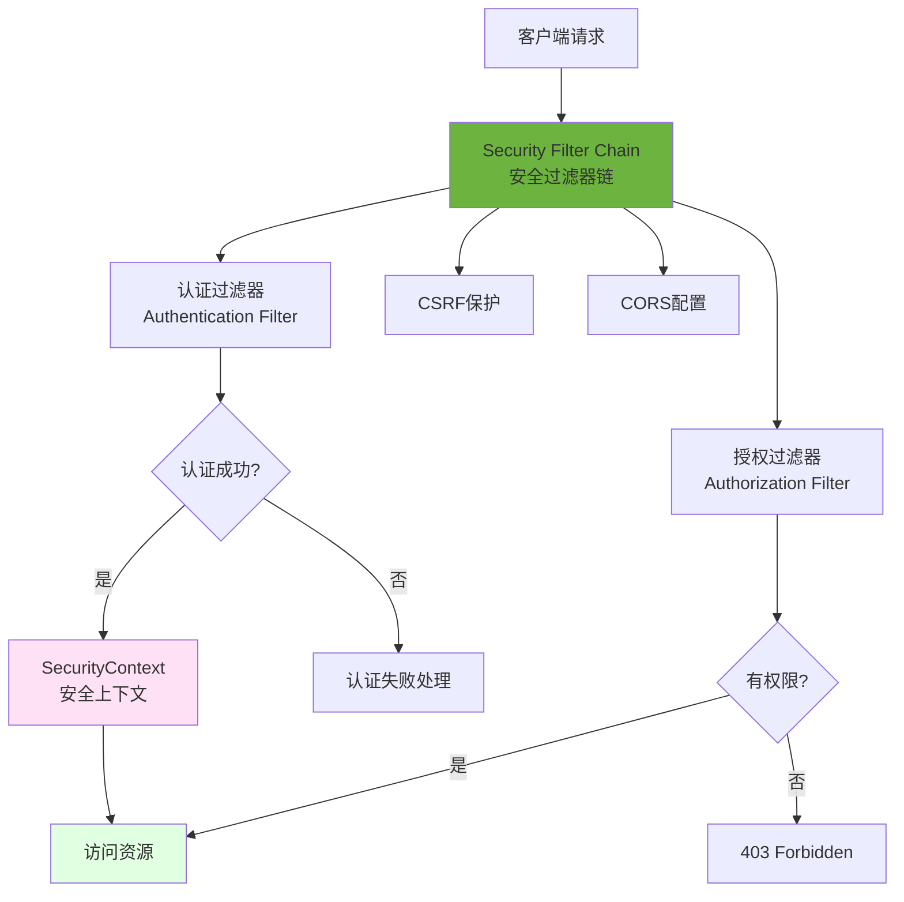

# Spring Security + JWT认证

> **学习目标**：掌握Spring Security安全框架和JWT认证
> **核心内容**：Spring Security架构、认证授权、JWT token、权限控制、OAuth2
> **预计时间**：7小时
> **前置知识**：Spring MVC、Spring Data JPA

## Spring Security概述

### 什么是Spring Security？

Spring Security是Spring生态系统中功能强大的安全框架，提供认证和授权功能，保护Java应用程序。



### 核心概念

```text
🔐 Authentication（认证）：验证用户身份（你是谁）
🔑 Authorization（授权）：验证用户权限（你能做什么）
🛡️ Principal（主体）：当前登录用户
🔑 Credentials（凭证）：密码、证书等
👥 Role（角色）：ADMIN、USER等
📋 Permission（权限）：READ、WRITE、DELETE等
```

## 快速开始

### 添加依赖

```xml
<!-- pom.xml -->
<dependencies>
    <!-- Spring Security -->
    <dependency>
        <groupId>org.springframework.boot</groupId>
        <artifactId>spring-boot-starter-security</artifactId>
    </dependency>

    <!-- JWT -->
    <dependency>
        <groupId>io.jsonwebtoken</groupId>
        <artifactId>jjwt-api</artifactId>
        <version>0.12.3</version>
    </dependency>
    <dependency>
        <groupId>io.jsonwebtoken</groupId>
        <artifactId>jjwt-impl</artifactId>
        <version>0.12.3</version>
        <scope>runtime</scope>
    </dependency>
    <dependency>
        <groupId>io.jsonwebtoken</groupId>
        <artifactId>jjwt-jackson</artifactId>
        <version>0.12.3</version>
        <scope>runtime</scope>
    </dependency>
</dependencies>
```

### 配置文件

```yaml
# application.yml
jwt:
  secret: your-secret-key-at-least-256-bits-long-for-hs256-algorithm
  expiration: 86400000  # 24小时（毫秒）
  refresh-expiration: 604800000  # 7天

spring:
  security:
    user:
      name: admin
      password: admin
      roles: ADMIN
```

## Spring Security配置

### 基础配置类

```java
package com.example.demo.config;

import org.springframework.context.annotation.Bean;
import org.springframework.context.annotation.Configuration;
import org.springframework.security.authentication.AuthenticationManager;
import org.springframework.security.config.annotation.authentication.configuration.AuthenticationConfiguration;
import org.springframework.security.config.annotation.method.configuration.EnableMethodSecurity;
import org.springframework.security.config.annotation.web.builders.HttpSecurity;
import org.springframework.security.config.annotation.web.configuration.EnableWebSecurity;
import org.springframework.security.config.http.SessionCreationPolicy;
import org.springframework.security.crypto.bcrypt.BCryptPasswordEncoder;
import org.springframework.security.crypto.password.PasswordEncoder;
import org.springframework.security.web.SecurityFilterChain;
import org.springframework.security.web.authentication.UsernamePasswordAuthenticationFilter;
import lombok.RequiredArgsConstructor;

@Configuration
@EnableWebSecurity
@EnableMethodSecurity
@RequiredArgsConstructor
public class SecurityConfig {

    private final JwtAuthenticationFilter jwtAuthenticationFilter;
    private final JwtAuthenticationEntryPoint jwtAuthenticationEntryPoint;

    @Bean
    public SecurityFilterChain securityFilterChain(HttpSecurity http) throws Exception {
        http
            .csrf(csrf -> csrf.disable())
            .cors(cors -> cors.configurationSource(corsConfigurationSource()))
            .sessionManagement(session ->
                session.sessionCreationPolicy(SessionCreationPolicy.STATELESS)
            )
            .authorizeHttpRequests(auth -> auth
                .requestMatchers("/api/auth/**", "/api/public/**").permitAll()
                .requestMatchers("/api/admin/**").hasRole("ADMIN")
                .anyRequest().authenticated()
            )
            .addFilterBefore(jwtAuthenticationFilter, UsernamePasswordAuthenticationFilter.class)
            .exceptionHandling(exception -> exception
                .authenticationEntryPoint(jwtAuthenticationEntryPoint)
            );

        return http.build();
    }

    @Bean
    public PasswordEncoder passwordEncoder() {
        return new BCryptPasswordEncoder();
    }

    @Bean
    public AuthenticationManager authenticationManager(
            AuthenticationConfiguration config) throws Exception {
        return config.getAuthenticationManager();
    }
}
```

## JWT工具类

### JWT生成和验证

```java
package com.example.demo.security;

import io.jsonwebtoken.*;
import io.jsonwebtoken.security.Keys;
import org.springframework.beans.factory.annotation.Value;
import org.springframework.security.core.Authentication;
import org.springframework.security.core.GrantedAuthority;
import org.springframework.stereotype.Component;

import javax.crypto.SecretKey;
import java.util.Date;
import java.util.stream.Collectors;

@Component
public class JwtTokenProvider {

    @Value("${jwt.secret}")
    private String jwtSecret;

    @Value("${jwt.expiration}")
    private long jwtExpiration;

    private SecretKey getSigningKey() {
        return Keys.hmacShaKeyFor(jwtSecret.getBytes());
    }

    // 生成Token
    public String generateToken(Authentication authentication) {
        UserPrincipal userPrincipal = (UserPrincipal) authentication.getPrincipal();

        Date now = new Date();
        Date expiryDate = new Date(now.getTime() + jwtExpiration);

        String authorities = authentication.getAuthorities().stream()
            .map(GrantedAuthority::getAuthority)
            .collect(Collectors.joining(","));

        return Jwts.builder()
            .subject(String.valueOf(userPrincipal.getId()))
            .claim("username", userPrincipal.getUsername())
            .claim("authorities", authorities)
            .issuedAt(now)
            .expiration(expiryDate)
            .signWith(getSigningKey())
            .compact();
    }

    // 验证Token
    public boolean validateToken(String token) {
        try {
            Jwts.parser()
                .verifyWith(getSigningKey())
                .build()
                .parseSignedClaims(token);
            return true;
        } catch (Exception ex) {
            return false;
        }
    }

    // 获取用户ID
    public Long getUserIdFromToken(String token) {
        Claims claims = Jwts.parser()
            .verifyWith(getSigningKey())
            .build()
            .parseSignedClaims(token)
            .getPayload();
        return Long.parseLong(claims.getSubject());
    }
}
```

## JWT过滤器

### 认证过滤器

```java
package com.example.demo.security;

import jakarta.servlet.FilterChain;
import jakarta.servlet.ServletException;
import jakarta.servlet.http.HttpServletRequest;
import jakarta.servlet.http.HttpServletResponse;
import lombok.RequiredArgsConstructor;
import org.springframework.security.authentication.UsernamePasswordAuthenticationToken;
import org.springframework.security.core.context.SecurityContextHolder;
import org.springframework.security.core.userdetails.UserDetails;
import org.springframework.security.web.authentication.WebAuthenticationDetailsSource;
import org.springframework.stereotype.Component;
import org.springframework.util.StringUtils;
import org.springframework.web.filter.OncePerRequestFilter;

import java.io.IOException;

@Component
@RequiredArgsConstructor
public class JwtAuthenticationFilter extends OncePerRequestFilter {

    private final JwtTokenProvider tokenProvider;
    private final CustomUserDetailsService userDetailsService;

    @Override
    protected void doFilterInternal(
            HttpServletRequest request,
            HttpServletResponse response,
            FilterChain filterChain
    ) throws ServletException, IOException {
        try {
            String jwt = getJwtFromRequest(request);

            if (StringUtils.hasText(jwt) && tokenProvider.validateToken(jwt)) {
                Long userId = tokenProvider.getUserIdFromToken(jwt);
                UserDetails userDetails = userDetailsService.loadUserById(userId);

                UsernamePasswordAuthenticationToken authentication =
                    new UsernamePasswordAuthenticationToken(
                        userDetails, null, userDetails.getAuthorities()
                    );

                authentication.setDetails(
                    new WebAuthenticationDetailsSource().buildDetails(request)
                );

                SecurityContextHolder.getContext().setAuthentication(authentication);
            }
        } catch (Exception ex) {
            logger.error("Could not set user authentication", ex);
        }

        filterChain.doFilter(request, response);
    }

    private String getJwtFromRequest(HttpServletRequest request) {
        String bearerToken = request.getHeader("Authorization");
        if (StringUtils.hasText(bearerToken) && bearerToken.startsWith("Bearer ")) {
            return bearerToken.substring(7);
        }
        return null;
    }
}
```

## 认证控制器

### 登录注册

```java
package com.example.demo.controller;

import com.example.demo.payload.LoginRequest;
import com.example.demo.payload.JwtResponse;
import com.example.demo.security.JwtTokenProvider;
import jakarta.validation.Valid;
import lombok.RequiredArgsConstructor;
import org.springframework.http.ResponseEntity;
import org.springframework.security.authentication.AuthenticationManager;
import org.springframework.security.authentication.UsernamePasswordAuthenticationToken;
import org.springframework.security.core.Authentication;
import org.springframework.security.core.context.SecurityContextHolder;
import org.springframework.web.bind.annotation.*;

@RestController
@RequestMapping("/api/auth")
@RequiredArgsConstructor
public class AuthController {

    private final AuthenticationManager authenticationManager;
    private final JwtTokenProvider tokenProvider;

    @PostMapping("/login")
    public ResponseEntity<JwtResponse> authenticateUser(
            @Valid @RequestBody LoginRequest loginRequest) {

        Authentication authentication = authenticationManager.authenticate(
            new UsernamePasswordAuthenticationToken(
                loginRequest.getUsername(),
                loginRequest.getPassword()
            )
        );

        SecurityContextHolder.getContext().setAuthentication(authentication);
        String token = tokenProvider.generateToken(authentication);

        return ResponseEntity.ok(new JwtResponse(token, "Bearer"));
    }
}
```

## 权限控制

### 方法级安全

```java
package com.example.demo.controller;

import org.springframework.security.access.prepost.PreAuthorize;
import org.springframework.web.bind.annotation.*;

@RestController
@RequestMapping("/api/admin")
public class AdminController {

    @PreAuthorize("hasRole('ADMIN')")
    @GetMapping("/users")
    public String getAllUsers() {
        return "All users";
    }

    @PreAuthorize("hasAnyRole('ADMIN', 'MODERATOR')")
    @PostMapping("/users")
    public String createUser() {
        return "User created";
    }
}
```

## 最佳实践

### 安全建议

```text
1. 密码加密：使用BCryptPasswordEncoder
2. JWT安全：Secret Key至少256位，使用HTTPS
3. 权限设计：遵循最小权限原则
4. 防护措施：登录限流、防暴力破解
5. Token管理：实现刷新机制和黑名单
```

## 练习题

### 基础练习

1. 实现基本的登录和注册功能
2. 实现JWT token生成和验证
3. 实现基于角色的权限控制

### 进阶练习

4. 实现Token刷新机制
5. 实现登录限流功能

## 本章小结

### 知识点回顾

✅ **Spring Security基础**：认证、授权、过滤器链
✅ **JWT认证**：Token生成、验证、刷新
✅ **Security配置**：SecurityConfig、密码加密
✅ **UserDetailsService**：自定义用户详情加载
✅ **权限控制**：@PreAuthorize、@Secured

### 学习成果

完成本章学习后，你应该能够：
- 理解Spring Security架构
- 实现JWT认证机制
- 配置Spring Security
- 实现基于角色的权限控制

### 下一步

恭喜你掌握了Spring Security和JWT认证！下一章我们将学习Redis缓存与分布式锁。

**准备好了吗？让我们继续Redis之旅！** 🚀

---

**学习时间**：约7小时
**难度等级**：★★★★★
**下一章**：[Redis缓存与分布式锁](./chapter-128.md)
