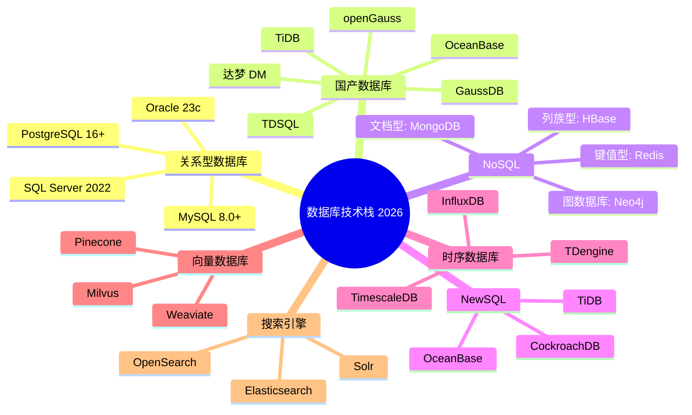
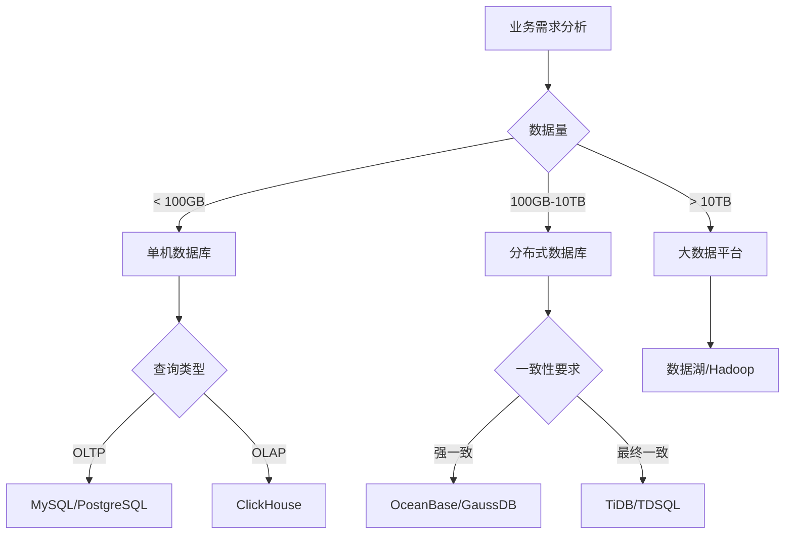

# ：主流数据库与企业级应用

> **难度等级**：⭐⭐⭐ | **学习时长**：2周 | **实战项目**：3个

## 📚 本章目录

- [17.1 数据库技术栈概览](#171-数据库技术栈概览)
- [17.2 MySQL 8.0+ 企业级实践](#172-mysql-80-企业级实践)
- [17.3 PostgreSQL 16+ 高级特性](#173-postgresql-16-高级特性)
- [17.4 国产分布式数据库](#174-国产分布式数据库)
- [17.5 NoSQL 数据库实战](#175-nosql-数据库实战)
- [17.6 时序数据库与向量数据库](#176-时序数据库与向量数据库)
- [17.7 数据库选型与架构设计](#177-数据库选型与架构设计)
- [17.8 实战项目](#178-实战项目)

---

## 数据库技术栈概览

### 数据库分类图谱



### 数据库选型决策表

| 业务场景 | 推荐数据库 | 备选方案 | 核心优势 |
|---------|-----------|---------|---------|
| **电商订单** | MySQL | TiDB/TDSQL | 成熟稳定、生态完善 |
| **金融核心** | OceanBase | GaussDB | 金融级高可用、强一致 |
| **社交网络** | PostgreSQL | MongoDB | 复杂查询能力强 |
| **物联网** | TDengine | InfluxDB | 压缩率高、写入快 |
| **日志分析** | ClickHouse | Elasticsearch | 列存、查询快 |
| **内容管理** | MongoDB | PostgreSQL | 灵活的文档模型 |
| **AI应用** | PostgreSQL + Milvus | Pinecone | 向量搜索能力 |
| **搜索引擎** | Elasticsearch | OpenSearch | 全文检索 |
| **缓存** | Redis | Memcached | 丰富的数据结构 |

---

## MySQL 8.0+ 企业级实践

### 安装与配置

**Docker 快速部署**：
```bash
# 拉取MySQL 8.0镜像
docker pull mysql:8.0

# 启动容器
docker run -d \
    --name mysql8 \
    -p 3306:3306 \
    -e MYSQL_ROOT_PASSWORD=yourpassword \
    -v /data/mysql:/var/lib/mysql \
    -v /data/mysql-conf:/etc/mysql/conf.d \
    mysql:8.0 \
    --character-set-server=utf8mb4 \
    --collation-server=utf8mb4_unicode_ci
```

**my.cnf 优化配置**：
```ini
[mysqld]
# 基础配置
server-id = 1
port = 3306
datadir = /var/lib/mysql
socket = /var/lib/mysql/mysql.sock
pid-file = /var/run/mysqld/mysqld.pid

# 字符集
character-set-server = utf8mb4
collation-server = utf8mb4_unicode_ci

# InnoDB配置
innodb_buffer_pool_size = 4G
innodb_log_file_size = 512M
innodb_flush_log_at_trx_commit = 1
innodb_flush_method = O_DIRECT
innodb_file_per_table = 1
innodb_io_capacity = 2000
innodb_io_capacity_max = 4000

# 连接配置
max_connections = 1000
max_connect_errors = 100000
wait_timeout = 28800
interactive_timeout = 28800

# 慢查询日志
slow_query_log = 1
slow_query_log_file = /var/log/mysql/slow.log
long_query_time = 1

# Binlog配置
log_bin = mysql-bin
binlog_format = ROW
binlog_expire_logs_seconds = 604800
expire_logs_days = 7

# 性能优化
performance_schema = ON
table_open_cache = 4000
table_definition_cache = 2000
```

### 窗口函数实战

```sql
-- 1. ROW_NUMBER：连续排名
SELECT
    emp_id,
    emp_name,
    department,
    salary,
    ROW_NUMBER() OVER (PARTITION BY department ORDER BY salary DESC) as ranking
FROM employees
WHERE department = 'Technology';

-- 结果：即使薪资相同，排名也连续
-- emp_id | emp_name | salary | ranking
-- 1001   | Alice    | 50000  | 1
-- 1002   | Bob      | 50000  | 2
-- 1003   | Charlie  | 45000  | 3

-- 2. RANK：跳跃排名
SELECT
    emp_id,
    emp_name,
    salary,
    RANK() OVER (ORDER BY salary DESC) as rank_ranking
FROM employees;

-- 结果：相同薪资排名相同，下一个排名跳跃
-- emp_id | emp_name | salary | ranking
-- 1001   | Alice    | 50000  | 1
-- 1002   | Bob      | 50000  | 1
-- 1003   | Charlie  | 45000  | 3

-- 3. DENSE_RANK：密集排名
SELECT
    emp_id,
    emp_name,
    salary,
    DENSE_RANK() OVER (ORDER BY salary DESC) as dense_rank
FROM employees;

-- 结果：相同薪资排名相同，下一个排名不跳跃
-- emp_id | emp_name | salary | ranking
-- 1001   | Alice    | 50000  | 1
-- 1002   | Bob      | 50000  | 1
-- 1003   | Charlie  | 45000  | 2

-- 4. 移动平均（计算3天移动平均）
SELECT
    order_date,
    daily_sales,
    AVG(daily_sales) OVER (
        ORDER BY order_date
        ROWS BETWEEN 2 PRECEDING AND CURRENT ROW
    ) as moving_avg_3day
FROM daily_sales_summary;

-- 5. 累计求和
SELECT
    order_date,
    daily_sales,
    SUM(daily_sales) OVER (
        ORDER BY order_date
        ROWS BETWEEN UNBOUNDED PRECEDING AND CURRENT ROW
    ) as cumulative_sales
FROM daily_sales_summary;

-- 6. 同比/环比计算
SELECT
    curr.order_date,
    curr.daily_sales,
    curr.daily_sales - prev.daily_sales as mom_growth,  -- 环比增长
    curr.daily_sales / prev.daily_sales - 1 as mom_rate  -- 环比增长率
FROM daily_sales_summary curr
LEFT JOIN daily_sales_summary prev
    ON curr.order_date = DATE_ADD(prev.order_date, INTERVAL 1 DAY);
```

### CTE 递归查询

```sql
-- 1. 递归查询组织架构树
WITH RECURSIVE org_tree AS (
    -- 基础查询：根节点（CEO）
    SELECT
        id,
        name,
        parent_id,
        1 as level,
        CAST(name AS CHAR(1000)) as path
    FROM employees
    WHERE parent_id IS NULL

    UNION ALL

    -- 递归查询：所有子节点
    SELECT
        e.id,
        e.name,
        e.parent_id,
        ot.level + 1,
        CONCAT(ot.path, ' > ', e.name) as path
    FROM employees e
    INNER JOIN org_tree ot ON e.parent_id = ot.id
)
SELECT * FROM org_tree ORDER BY level, id;

-- 2. 递归查询物料清单（BOM）
WITH RECURSIVE bom_tree AS (
    -- 基础：顶层产品
    SELECT
        p.product_id,
        p.product_name,
        p.quantity,
        p.unit_cost,
        p.quantity * p.unit_cost as total_cost,
        1 as level
    FROM products p
    WHERE product_id = 1001  -- 成品ID

    UNION ALL

    -- 递归：所有子组件
    SELECT
        c.component_id,
        c.component_name,
        p.quantity * c.quantity as total_quantity,  -- 累计数量
        c.unit_cost,
        p.quantity * c.quantity * c.unit_cost as total_cost,
        bt.level + 1
    FROM bom_tree bt
    INNER JOIN product_components pc ON bt.product_id = pc.product_id
    INNER JOIN components c ON pc.component_id = c.component_id
)
SELECT * FROM bom_tree;

-- 3. 生成日期序列
WITH RECURSIVE date_series AS (
    SELECT DATE('2024-01-01') as date
    UNION ALL
    SELECT DATE_ADD(date, INTERVAL 1 DAY)
    FROM date_series
    WHERE date < '2024-12-31'
)
SELECT date FROM date_series;

-- 4. 找出缺失的ID
WITH RECURSIVE all_ids AS (
    SELECT 1 as id
    UNION ALL
    SELECT id + 1 FROM all_ids WHERE id < 1000
)
SELECT id FROM all_ids
WHERE id NOT IN (SELECT id FROM orders)
LIMIT 100;
```

### JSON 数据类型

```sql
-- 1. 创建JSON表
CREATE TABLE products (
    id INT PRIMARY KEY AUTO_INCREMENT,
    name VARCHAR(100),
    attributes JSON,
    created_at TIMESTAMP DEFAULT CURRENT_TIMESTAMP
);

-- 2. 插入JSON数据
INSERT INTO products (name, attributes) VALUES
('iPhone 15 Pro', '{
    "color": "钛金属灰",
    "storage": "256GB",
    "price": 8999,
    "specs": {
        "chip": "A17 Pro",
        "ram": "8GB",
        "screen": "6.1英寸"
    },
    "features": ["5G", "Face ID", "USB-C"]
}');

-- 3. 查询JSON字段
SELECT
    name,
    JSON_EXTRACT(attributes, '$.color') as color,
    JSON_EXTRACT(attributes, '$.specs.chip') as chip,
    attributes->>'$.price' as price  -- 简写方式
FROM products;

-- 4. JSON索引（MySQL 8.0.17+）
-- 创建生成列并索引
ALTER TABLE products
ADD COLUMN color_virtual VARCHAR(20)
    AS (attributes->>'$.color') VIRTUAL,
ADD INDEX idx_color (color_virtual);

-- 5. JSON数组查询
SELECT name, attributes
FROM products
WHERE JSON_CONTAINS(attributes->>'$.features', '"5G"');

-- 6. JSON搜索
SELECT
    name,
    attributes->>'$.specs.screen' as screen
FROM products
WHERE JSON_SEARCH(attributes, 'one', '256GB') IS NOT NULL;

-- 7. JSON修改
UPDATE products
SET attributes = JSON_SET(attributes, '$.price', 7999)
WHERE id = 1;

-- 8. JSON聚合
SELECT
    JSON_ARRAYAGG(attributes->>'$.color') as colors
FROM products
WHERE name LIKE 'iPhone%';
```

### Spring Boot 整合 MySQL

**application.yml 配置**：
```yaml
spring:
  datasource:
    driver-class-name: com.mysql.cj.jdbc.Driver
    url: jdbc:mysql://localhost:3306/demo?useUnicode=true&characterEncoding=utf8&useSSL=false&serverTimezone=Asia/Shanghai
    username: root
    password: password
    hikari:
      maximum-pool-size: 20
      minimum-idle: 5
      connection-timeout: 30000
      idle-timeout: 600000
      max-lifetime: 1800000

  jpa:
    hibernate:
      ddl-auto: update
    show-sql: true
    properties:
      hibernate:
        dialect: org.hibernate.dialect.MySQL8Dialect
        format_sql: true
```

**实体类定义**：
```java
@Entity
@Table(name = "orders")
@Data
public class Order {

    @Id
    @GeneratedValue(strategy = GenerationType.IDENTITY)
    private Long id;

    private Long userId;
    private Long productId;

    private BigDecimal amount;

    @Enumerated(EnumType.STRING)
    private OrderStatus status;

    @Column(name = "created_at", updatable = false)
    @CreationTimestamp
    private LocalDateTime createdAt;

    @Column(name = "updated_at")
    @UpdateTimestamp
    private LocalDateTime updatedAt;

    // JSON字段（JPA 2.1+）
    @Convert(converter = JsonConverter.class)
    @Column(columnDefinition = "json")
    private Map<String, Object> metadata;
}

// JSON转换器
@Converter
public class JsonConverter implements AttributeConverter<Map<String, Object>, String> {

    private final ObjectMapper objectMapper = new ObjectMapper();

    @Override
    public String convertToDatabaseColumn(Map<String, Object> attribute) {
        try {
            return objectMapper.writeValueAsString(attribute);
        } catch (JsonProcessingException e) {
            throw new RuntimeException("JSON转换失败", e);
        }
    }

    @Override
    @SuppressWarnings("unchecked")
    public Map<String, Object> convertToEntityAttribute(String dbData) {
        try {
            return objectMapper.readValue(dbData, Map.class);
        } catch (JsonProcessingException e) {
            return new HashMap<>();
        }
    }
}
```

---

## PostgreSQL 16+ 高级特性

### 安装与配置

**Docker 部署**：
```bash
docker run -d \
    --name postgres16 \
    -p 5432:5432 \
    -e POSTGRES_PASSWORD=yourpassword \
    -e POSTGRES_DB=mydb \
    -v /data/postgres:/var/lib/postgresql/data \
    -v /data/postgres-conf:/etc/postgresql \
    postgres:16
```

**postgres.conf 优化**：
```ini
# 连接设置
max_connections = 200
shared_buffers = 4GB
effective_cache_size = 12GB
maintenance_work_mem = 1GB
work_mem = 16MB

# WAL设置
wal_buffers = 16MB
max_wal_size = 4GB
min_wal_size = 1GB
wal_level = replica

# 查询优化
random_page_cost = 1.1  # SSD存储
effective_io_concurrency = 200
max_worker_processes = 8
max_parallel_workers_per_gather = 4
max_parallel_workers = 8

# 日志
logging_collector = on
log_directory = 'log'
log_filename = 'postgresql-%Y-%m-%d_%H%M%S.log'
log_min_duration_statement = 1000
```

### 高级数据类型

```sql
-- 1. 数组类型
CREATE TABLE posts (
    id SERIAL PRIMARY KEY,
    title VARCHAR(200),
    tags TEXT[],  -- 文本数组
    categories INT[]
);

-- 插入数组数据
INSERT INTO posts (title, tags, categories)
VALUES ('PostgreSQL教程', ARRAY['数据库', 'SQL', 'PostgreSQL'], ARRAY[1, 2, 3]);

-- 查询数组
SELECT * FROM posts WHERE '数据库' = ANY(tags);
SELECT * FROM posts WHERE tags @> ARRAY['PostgreSQL'];  -- 包含
SELECT * FROM posts WHERE tags && ARRAY['SQL', 'NoSQL'];  -- 重叠

-- 2. JSONB类型（二进制JSON，性能更好）
CREATE TABLE events (
    id SERIAL PRIMARY KEY,
    event_data JSONB,
    created_at TIMESTAMP DEFAULT NOW()
);

-- 创建GIN索引
CREATE INDEX idx_events_data ON events USING GIN (event_data);

-- JSONB查询
SELECT * FROM events
WHERE event_data @> '{"user": {"id": 123}}';  -- 包含

SELECT event_data->>'user'->>'name' as user_name
FROM events
WHERE event_data->>'action' = 'click';

-- JSONB更新
UPDATE events
SET event_data = jsonb_set(event_data, '{count}', ((event_data->>'count')::int + 1)::text::jsonb)
WHERE id = 1;

-- 3. 范围类型
CREATE TABLE meetings (
    id SERIAL PRIMARY KEY,
    title VARCHAR(200),
    duration TSRANGE,  -- 时间戳范围
    price_range NUMRANGE  -- 数值范围
);

-- 插入范围数据
INSERT INTO meetings (title, duration, price_range)
VALUES (
    '技术分享',
    '[2024-01-01 14:00, 2024-01-01 16:00]',
    '[100, 500]'
);

-- 范围查询
SELECT * FROM meetings
WHERE duration && '[2024-01-01 15:00, 2024-01-01 17:00]'::tsrange;

-- 4. 全文搜索
CREATE TABLE articles (
    id SERIAL PRIMARY KEY,
    title TEXT,
    content TEXT,
    tsv tsvector  -- 全文搜索向量
);

-- 自动更新tsv
CREATE INDEX idx_articles_tsv ON articles USING GIN (tsv);

CREATE TRIGGER tsvector_update
BEFORE INSERT OR UPDATE ON articles
FOR EACH ROW
EXECUTE FUNCTION
    tsvector_update_trigger(tsv, 'pg_catalog.simple', title, content);

-- 全文搜索
SELECT title, content
FROM articles
WHERE tsv @@ to_tsquery('simple', 'PostgreSQL & 数据库')
ORDER BY ts_rank(tsv, to_tsquery('simple', 'PostgreSQL & 数据库')) DESC;

-- 高亮显示
SELECT
    title,
    ts_headline('simple', content, to_tsquery('simple', '数据库'))
FROM articles
WHERE tsv @@ to_tsquery('simple', '数据库');
```

### 窗口函数高级应用

```sql
-- 1. 时间序列分析
WITH monthly_sales AS (
    SELECT
        DATE_TRUNC('month', order_date) as month,
        SUM(amount) as total
    FROM orders
    GROUP BY month
)
SELECT
    month,
    total,
    LAG(total) OVER (ORDER BY month) as prev_month,
    total - LAG(total) OVER (ORDER BY month) as growth,
    ROUND(
        (total - LAG(total) OVER (ORDER BY month)) /
        LAG(total) OVER (ORDER BY month) * 100, 2
    ) as growth_rate
FROM monthly_sales;

-- 2. 会话分析（识别用户会话）
WITH user_actions AS (
    SELECT
        user_id,
        action_time,
        -- 如果与前一次操作间隔超过30分钟，则认为是新会话
        SUM(CASE
            WHEN action_time - LAG(action_time) OVER (PARTITION BY user_id ORDER BY action_time) > INTERVAL '30 minutes'
            THEN 1
            ELSE 0
        END) OVER (PARTITION BY user_id ORDER BY action_time) as session_id
    FROM user_activity
)
SELECT
    user_id,
    session_id,
    MIN(action_time) as session_start,
    MAX(action_time) as session_end,
    COUNT(*) as action_count
FROM user_actions
GROUP BY user_id, session_id
ORDER BY user_id, session_start;
```

### Spring Data JPA 整合

**依赖配置**：
```xml
<dependency>
    <groupId>org.postgresql</groupId>
    <artifactId>postgresql</artifactId>
</dependency>
```

**实体类**：
```java
@Entity
@Table(name = "products")
@Data
public class Product {

    @Id
    @GeneratedValue(strategy = GenerationType.IDENTITY)
    private Long id;

    private String name;

    // PostgreSQL数组映射
    @Column(columnDefinition = "text[]")
    @Type(PostgreSQLEnumType.class)
    private List<String> tags;

    // JSONB映射
    @Type(type = "json")
    @Column(columnDefinition = "jsonb")
    private Map<String, Object> attributes;

    // 范围类型映射
    @Column(columnDefinition = "numrange")
    private String priceRange;
}

// 自定义类型
public class PostgreSQLEnumType implements UserType {

    @Override
    public int[] sqlTypes() {
        return new int[]{Types.ARRAY};
    }

    @Override
    public Class returnedClass() {
        return List.class;
    }

    @Override
    public Object nullSafeGet(ResultSet rs, String[] names, SharedSessionContractImplementor session, Object owner)
            throws SQLException {
        Array array = rs.getArray(names[0]);
        return array != null ? Arrays.asList((Object[]) array.getArray()) : null;
    }

    @Override
    public void nullSafeSet(PreparedStatement st, Object value, int index, SharedSessionContractImplementor session)
            throws SQLException {
        if (value == null) {
            st.setNull(index, Types.ARRAY);
        } else {
            Connection connection = st.getConnection();
            Array array = connection.createArrayOf("text", ((List<?>) value).toArray());
            st.setArray(index, array);
        }
    }
}
```

---

## 国产分布式数据库

### OceanBase 实战

**Docker 部署 OceanBase**：
```bash
# 拉取镜像
docker pull oceanbase/oceanbase-ce:4.2

# 启动单机版
docker run -d \
    --name oceanbase \
    -p 2881:2881 -p 2882:2882 \
    -e MODE=mini \
    -e OB_CLUSTER_NAME=obcluster \
    -e OB_TENANT_NAME=mytenant \
    -e OB_MEMORY_LIMIT=8G \
    oceanbase/oceanbase-ce:4.2
```

**连接 OceanBase**：
```bash
# 使用 obclient
obclient -h127.0.0.1 -P2881 -uroot@sys -p

# 或者使用 MySQL 客户端（兼容协议）
mysql -h127.0.0.1 -P2881 -uroot@sys
```

**创建租户**：
```sql
-- 创建资源池
CREATE RESOURCE UNIT unit_4c16g
    MEMORY_SIZE = '16G',
    MIN_CPU = 4,
    MAX_CPU = 4;

-- 创建资源池
CREATE RESOURCE POOL pool_mysql
    UNIT = 'unit_4c16g',
    UNIT_NUM = 1;

-- 创建 MySQL 租户
CREATE TENANT tenant_mysql
    RESOURCE_POOL_LIST = ('pool_mysql'),
    SET ob_tcp_invited_nodes = '%',
    SET ob_compatibility_mode = 'MYSQL';

-- 连接到新租户
mysql -h127.0.0.1 -P2881 -uroot@tenant_mysql
```

**分区表设计**：
```sql
-- Hash分区（按主键）
CREATE TABLE orders (
    order_id BIGINT PRIMARY KEY,
    user_id BIGINT NOT NULL,
    product_id BIGINT NOT NULL,
    amount DECIMAL(10,2),
    status VARCHAR(32),
    create_time TIMESTAMP DEFAULT CURRENT_TIMESTAMP
) PARTITION BY HASH(order_id)
PARTITIONS 128;

-- Range分区（按时间）
CREATE TABLE orders_by_date (
    order_id BIGINT,
    create_time TIMESTAMP,
    amount DECIMAL(10,2),
    PRIMARY KEY (order_id, create_time)
) PARTITION BY RANGE (TO_DAYS(create_time)) (
    PARTITION p202401 VALUES LESS THAN (TO_DAYS('2024-02-01')),
    PARTITION p202402 VALUES LESS THAN (TO_DAYS('2024-03-01')),
    PARTITION p202403 VALUES LESS THAN (TO_DAYS('2024-04-01')),
    PARTITION pmax VALUES LESS THAN MAXVALUE
);

-- 全局索引
CREATE UNIQUE GLOBAL INDEX idx_user_orders
ON orders(user_id, order_id)
PARTITION BY HASH(user_id) PARTITIONS 64;
```

### TiDB 实战

**本地部署 TiDB**：
```bash
# 使用 TiUP 部署
curl --proto '=https' --tlsv1.2 -sSf https://tiup-mirrors.pingcap.com/install.sh | sh
source .bash_profile
tiup playground

# 或者使用 Docker
docker-compose up -d
# docker-compose.yml:
# version: '3'
# services:
#   tidb:
#     image: pingcap/tidb:latest
#     ports:
#       - "4000:4000"
#       - "10080:10080"
```

**创建 TiFlash 副本**：
```sql
-- 创建表
CREATE TABLE orders (
    order_id BIGINT PRIMARY KEY,
    user_id BIGINT,
    amount DECIMAL(10,2),
    create_time TIMESTAMP
);

-- 创建 TiFlash 副本（用于分析查询）
ALTER TABLE orders SET TIFLASH REPLICA 1;

-- 查看同步状态
SELECT * FROM information_schema.tiflash_replica WHERE TABLE_NAME = 'orders';

-- 使用 TiFlash 执行分析查询
SELECT /*+ USE_TIFLASH() */
    user_id,
    COUNT(*) as order_count,
    SUM(amount) as total_amount
FROM orders
WHERE create_time >= '2024-01-01'
GROUP BY user_id;
```

**Spring Boot 整合 TiDB**：
```yaml
spring:
  datasource:
    driver-class-name: com.mysql.cj.jdbc.Driver
    url: jdbc:mysql://localhost:4000/test?useSSL=false&serverTimezone=UTC
    username: root
    password: ""
```

TiDB 完全兼容 MySQL 协议，可以直接使用 MySQL 驱动。

---

## NoSQL 数据库实战

### MongoDB

**Docker 部署**：
```bash
docker run -d \
    --name mongodb \
    -p 27017:27017 \
    -e MONGO_INITDB_ROOT_USERNAME=admin \
    -e MONGO_INITDB_ROOT_PASSWORD=password \
    -v /data/mongodb:/data/db \
    mongo:7
```

**Spring Data MongoDB**：
```java
// 实体类
@Document(collection = "products")
@Data
public class Product {

    @Id
    private String id;

    private String name;
    private String description;

    // 嵌入文档
    @Embedded
    private PriceInfo priceInfo;

    // 数组
    private List<String> tags;

    // 地理位置
    private GeoJsonPoint location;
}

@Data
public class PriceInfo {
    private BigDecimal amount;
    private String currency;
}

// Repository
public interface ProductRepository extends MongoRepository<Product, String> {

    // JSON查询
    @Query("{ 'priceInfo.amount': { $gte: ?0, $lte: ?1 } }")
    List<Product> findByPriceRange(BigDecimal min, BigDecimal max);

    // 地理位置查询
    @Query("{ 'location': { $near: { $geometry: { 'type': 'Point', 'coordinates': [?0, ?1] }, $maxDistance: ?2 } } }")
    List<Product> findByLocationNear(double longitude, double latitude, double maxDistance);

    // 全文搜索
    @Text
    List<Product> findByNameContaining(String keyword);
}

// Service
@Service
public class ProductService {

    @Autowired
    private ProductRepository productRepository;

    // 聚合查询
    public List<ProductStats> getSalesByCategory() {
        Aggregation aggregation = Aggregation.newAggregation(
            Aggregation.match(Criteria.where("tags").in("electronics")),
            Aggregation.group("category")
                .count().as("productCount")
                .sum("priceInfo.amount").as("totalRevenue"),
            Aggregation.sort(Sort.Direction.DESC, "totalRevenue"),
            Aggregation.limit(10)
        );

        return mongoTemplate.aggregate(aggregation, Product.class, ProductStats.class)
            .getMappedResults();
    }
}
```

### Redis 高级用法

**Redisson 分布式锁**：
```java
@Configuration
public class RedisConfig {

    @Bean
    public RedissonClient redissonClient() {
        Config config = new Config();
        config.useSingleServer()
            .setAddress("redis://localhost:6379")
            .setPassword("password")
            .setDatabase(0);
        return Redisson.create(config);
    }
}

@Service
public class OrderService {

    @Autowired
    private RedissonClient redissonClient;

    public void createOrder(OrderDTO orderDTO) {
        // 获取分布式锁
        RLock lock = redissonClient.getLock("order:lock:" + orderDTO.getUserId());

        try {
            // 尝试加锁，最多等待10秒，锁30秒后自动释放
            if (lock.tryLock(10, 30, TimeUnit.SECONDS)) {
                try {
                    // 业务逻辑
                    doCreateOrder(orderDTO);
                } finally {
                    lock.unlock();
                }
            } else {
                throw new BusinessException("系统繁忙，请稍后重试");
            }
        } catch (InterruptedException e) {
            Thread.currentThread().interrupt();
            throw new BusinessException("系统错误");
        }
    }

    // 读写锁
    public Product getProduct(Long id) {
        RReadWriteLock rwLock = redissonClient.getReadWriteLock("product:lock:" + id);
        rwLock.readLock().lock();
        try {
            return productRepository.findById(id);
        } finally {
            rwLock.readLock().unlock();
        }
    }

    // 信号量（限流）
    @GetMapping("/api/hot-product")
    public Result getHotProduct(Long productId) {
        RSemaphore semaphore = redissonClient.getSemaphore("rate:limit:" + productId);
        // 设置最多100个并发
        semaphore.trySetPermits(100);

        try {
            if (semaphore.tryAcquire()) {
                try {
                    return Result.success(productService.getHotProduct(productId));
                } finally {
                    semaphore.release();
                }
            } else {
                return Result.error("请求过于频繁");
            }
        } catch (InterruptedException e) {
            return Result.error("系统错误");
        }
    }

    // 布隆过滤器
    @PostConstruct
    public void initBloomFilter() {
        RBloomFilter<Long> bloomFilter = redissonClient.getBloomFilter("product:bloom");
        bloomFilter.tryInit(100000L, 0.01);  // 预计10万条数据，误判率1%

        // 预热：加载所有商品ID
        List<Long> allProductIds = productService.getAllProductIds();
        allProductIds.forEach(bloomFilter::add);
    }

    public Product getProductById(Long id) {
        RBloomFilter<Long> bloomFilter = redissonClient.getBloomFilter("product:bloom");

        // 布隆过滤器判断
        if (!bloomFilter.contains(id)) {
            throw new NotFoundException("商品不存在");
        }

        // 查询缓存
        String cacheKey = "product:" + id;
        Product product = (Product) redisTemplate.opsForValue().get(cacheKey);
        if (product != null) {
            return product;
        }

        // 查询数据库
        product = productRepository.findById(id).orElse(null);
        if (product != null) {
            redisTemplate.opsForValue().set(cacheKey, product, 1, TimeUnit.HOURS);
        }

        return product;
    }
}
```

---

## 时序数据库与向量数据库

### TDengine 实战

**安装 TDengine**：
```bash
# Docker 部署
docker run -d \
    --name tdengine \
    -p 6030:6030 -p 6041:6041 -p 6043-6049:6043-6049 \
    -e TAOS_FQDN=tdengine \
    tdengine/tdengine:3.0
```

**创建超级表**：
```sql
-- 创建数据库
CREATE DATABASE IF NOT EXISTS iot_monitoring
KEEP 365;  -- 保留365天

USE iot_monitoring;

-- 创建超级表
CREATE STABLE sensors (
    ts TIMESTAMP,           -- 时间戳（必须）
    temperature FLOAT,      -- 温度
    humidity FLOAT,         -- 湿度
    pressure FLOAT          -- 压力
) TAGS (
    location BINARY(50),    -- 位置标签
    device_type BINARY(20)  -- 设备类型标签
);

-- 自动创建子表并插入数据
INSERT INTO device_001 USING sensors TAGS ('北京', '温度传感器')
VALUES (NOW, 25.5, 60.2, 1013.25);

-- 查询数据
SELECT * FROM sensors WHERE location = '北京';
SELECT AVG(temperature), AVG(humidity)
FROM sensors
WHERE ts > NOW - 1h
GROUP BY location;
```

---

## 数据库选型与架构设计

### 选型决策树



---

## 实战项目

### 项目1：电商订单系统数据库设计

```sql
-- 用户表
CREATE TABLE users (
    id BIGINT PRIMARY KEY AUTO_INCREMENT,
    username VARCHAR(50) UNIQUE NOT NULL,
    email VARCHAR(100) UNIQUE NOT NULL,
    password_hash VARCHAR(255) NOT NULL,
    status TINYINT DEFAULT 1 COMMENT '1:正常 0:禁用',
    created_at TIMESTAMP DEFAULT CURRENT_TIMESTAMP,
    updated_at TIMESTAMP DEFAULT CURRENT_TIMESTAMP ON UPDATE CURRENT_TIMESTAMP,
    INDEX idx_status (status),
    INDEX idx_created (created_at)
) ENGINE=InnoDB DEFAULT CHARSET=utf8mb4;

-- 商品表
CREATE TABLE products (
    id BIGINT PRIMARY KEY AUTO_INCREMENT,
    name VARCHAR(200) NOT NULL,
    description TEXT,
    category_id INT NOT NULL,
    price DECIMAL(10,2) NOT NULL,
    stock INT DEFAULT 0,
    status TINYINT DEFAULT 1,
    created_at TIMESTAMP DEFAULT CURRENT_TIMESTAMP,
    updated_at TIMESTAMP DEFAULT CURRENT_TIMESTAMP ON UPDATE CURRENT_TIMESTAMP,
    INDEX idx_category (category_id),
    INDEX idx_status (status)
) ENGINE=InnoDB DEFAULT CHARSET=utf8mb4;

-- 订单表（分表）
CREATE TABLE orders_2024_01 (
    order_id BIGINT PRIMARY KEY,
    user_id BIGINT NOT NULL,
    total_amount DECIMAL(10,2) NOT NULL,
    status VARCHAR(32) NOT NULL,
    created_at TIMESTAMP DEFAULT CURRENT_TIMESTAMP,
    updated_at TIMESTAMP DEFAULT CURRENT_TIMESTAMP ON UPDATE CURRENT_TIMESTAMP,
    INDEX idx_user (user_id),
    INDEX idx_status (status),
    INDEX idx_created (created_at)
) ENGINE=InnoDB DEFAULT CHARSET=utf8mb4
PARTITION BY RANGE (TO_DAYS(created_at)) (
    PARTITION p20240101 VALUES LESS THAN (TO_DAYS('2024-01-15')),
    PARTITION p20240115 VALUES LESS THAN (TO_DAYS('2024-02-01')),
    PARTITION pmax VALUES LESS THAN MAXVALUE
);
```

---

**更新时间**：2026年2月 | **版本**：v1.0
