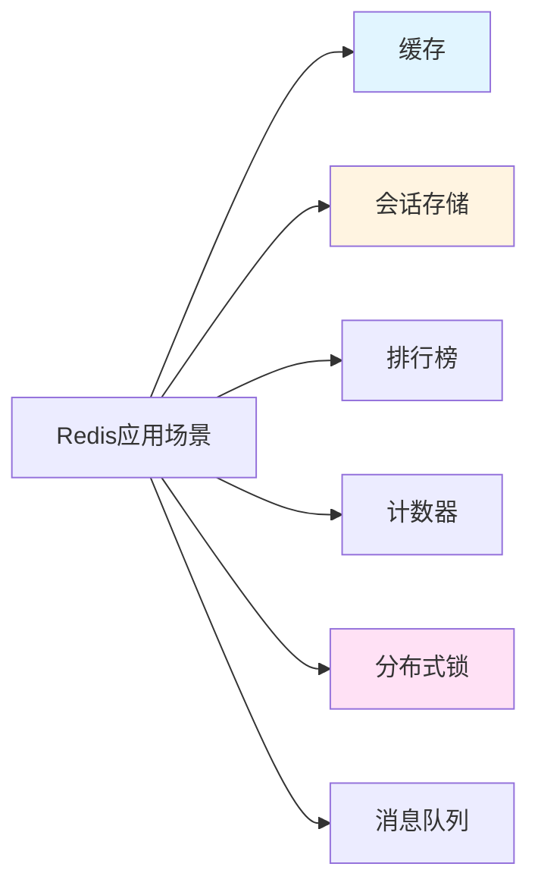

# Redis缓存与分布式锁

## 学习目标

完成本章后，你将能够：
- 掌握Redis 7.x的核心功能和数据结构
- 熟练使用Spring Boot 3.x整合Redis
- 理解并解决缓存穿透、击穿、雪崩问题
- 实现Redis分布式锁
- 使用Redisson简化分布式锁开发

**预计学习时间**：8小时
**难度**：⭐⭐ 中级
**前置知识**：完成前面所有章节的学习

## Redis简介

### 什么是Redis？

Redis（Remote Dictionary Server）是一个开源的内存数据结构存储系统，可用作数据库、缓存和消息代理。

**核心特性**
- ✅ **高性能**：读写速度可达10万次/秒
- ✅ **丰富的数据类型**：String、Hash、List、Set、ZSet等
- ✅ **持久化**：支持RDB和AOF两种持久化方式
- ✅ **主从复制**：支持数据备份和读写分离
- ✅ **集群模式**：支持Redis Cluster和Sentinel

**Redis 7.x新特性**
- 函数和脚本
- 版本字段
- 多空间索引
- SHA1哈希函数替换

### Redis应用场景



## Spring Boot整合Redis

### 添加依赖

```xml
<!-- pom.xml -->
<dependencies>
    <!-- Spring Boot Starter -->
    <dependency>
        <groupId>org.springframework.boot</groupId>
        <artifactId>spring-boot-starter-web</artifactId>
    </dependency>

    <!-- Spring Data Redis -->
    <dependency>
        <groupId>org.springframework.boot</groupId>
        <artifactId>spring-boot-starter-data-redis</artifactId>
    </dependency>

    <!-- Lettuce连接池 -->
    <dependency>
        <groupId>org.apache.commons</groupId>
        <artifactId>commons-pool2</artifactId>
    </dependency>

    <!-- Jackson序列化 -->
    <dependency>
        <groupId>com.fasterxml.jackson.core</groupId>
        <artifactId>jackson-databind</artifactId>
    </dependency>
</dependencies>
```

### 配置文件

```yaml
# application.yml
spring:
  data:
    redis:
      host: localhost
      port: 6379
      password: yourpassword
      database: 0
      timeout: 3000ms
      lettuce:
        pool:
          max-active: 8      # 最大连接数
          max-idle: 8        # 最大空闲连接数
          min-idle: 0        # 最小空闲连接数
          max-wait: -1ms     # 最大等待时间
```

### Redis配置类

```java
package com.example.demo.config;

import com.fasterxml.jackson.annotation.JsonAutoDetect;
import com.fasterxml.jackson.annotation.PropertyAccessor;
import com.fasterxml.jackson.databind.ObjectMapper;
import com.fasterxml.jackson.databind.jsontype.impl.LaissezFaireSubTypeValidator;
import org.springframework.context.annotation.Bean;
import org.springframework.context.annotation.Configuration;
import org.springframework.data.redis.connection.RedisConnectionFactory;
import org.springframework.data.redis.core.RedisTemplate;
import org.springframework.data.redis.serializer.Jackson2JsonRedisSerializer;
import org.springframework.data.redis.serializer.StringRedisSerializer;

/**
 * Redis配置类
 * 配置RedisTemplate的序列化方式
 */
@Configuration
public class RedisConfig {

    @Bean
    public RedisTemplate<String, Object> redisTemplate(
            RedisConnectionFactory connectionFactory) {

        RedisTemplate<String, Object> template = new RedisTemplate<>();
        template.setConnectionFactory(connectionFactory);

        // 使用Jackson2JsonRedisSerializer来序列化和反序列化redis的value值
        Jackson2JsonRedisSerializer<Object> serializer =
            new Jackson2JsonRedisSerializer<>(Object.class);

        ObjectMapper mapper = new ObjectMapper();
        mapper.setVisibility(PropertyAccessor.ALL, JsonAutoDetect.Visibility.ANY);
        mapper.activateDefaultTyping(
            LaissezFaireSubTypeValidator.instance,
            ObjectMapper.DefaultTyping.NON_FINAL
        );
        serializer.setObjectMapper(mapper);

        // 使用StringRedisSerializer来序列化和反序列化redis的key值
        StringRedisSerializer stringSerializer = new StringRedisSerializer();

        // key采用String的序列化方式
        template.setKeySerializer(stringSerializer);
        // hash的key也采用String的序列化方式
        template.setHashKeySerializer(stringSerializer);
        // value序列化方式采用jackson
        template.setValueSerializer(serializer);
        // hash的value序列化方式采用jackson
        template.setHashValueSerializer(serializer);

        template.afterPropertiesSet();
        return template;
    }
}
```

## Redis数据结构操作

### String字符串

```java
package com.example.demo.service;

import org.springframework.data.redis.core.RedisTemplate;
import org.springframework.stereotype.Service;

import java.util.concurrent.TimeUnit;

/**
 * Redis String操作示例
 */
@Service
public class RedisStringService {

    private final RedisTemplate<String, Object> redisTemplate;

    public RedisStringService(RedisTemplate<String, Object> redisTemplate) {
        this.redisTemplate = redisTemplate;
    }

    /**
     * 设置值
     */
    public void set(String key, Object value) {
        redisTemplate.opsForValue().set(key, value);
    }

    /**
     * 设置值并指定过期时间
     */
    public void set(String key, Object value, long timeout, TimeUnit unit) {
        redisTemplate.opsForValue().set(key, value, timeout, unit);
    }

    /**
     * 获取值
     */
    public Object get(String key) {
        return redisTemplate.opsForValue().get(key);
    }

    /**
     * 删除值
     */
    public Boolean delete(String key) {
        return redisTemplate.delete(key);
    }

    /**
     * 设置过期时间
     */
    public Boolean expire(String key, long timeout, TimeUnit unit) {
        return redisTemplate.expire(key, timeout, unit);
    }

    /**
     * 获取过期时间
     */
    public Long getExpire(String key) {
        return redisTemplate.getExpire(key);
    }

    /**
     * 判断key是否存在
     */
    public Boolean hasKey(String key) {
        return redisTemplate.hasKey(key);
    }

    /**
     * 递增
     */
    public Long increment(String key) {
        return redisTemplate.opsForValue().increment(key);
    }

    /**
     * 递增指定值
     */
    public Long increment(String key, long delta) {
        return redisTemplate.opsForValue().increment(key, delta);
    }

    /**
     * 递减
     */
    public Long decrement(String key) {
        return redisTemplate.opsForValue().decrement(key);
    }
}
```

### Hash哈希

```java
package com.example.demo.service;

import org.springframework.data.redis.core.RedisTemplate;
import org.springframework.stereotype.Service;

import java.util.Map;

/**
 * Redis Hash操作示例
 */
@Service
public class RedisHashService {

    private final RedisTemplate<String, Object> redisTemplate;

    public RedisHashService(RedisTemplate<String, Object> redisTemplate) {
        this.redisTemplate = redisTemplate;
    }

    /**
     * 向Hash中添加值
     */
    public void hSet(String key, String hashKey, Object value) {
        redisTemplate.opsForHash().put(key, hashKey, value);
    }

    /**
     * 获取Hash中的值
     */
    public Object hGet(String key, String hashKey) {
        return redisTemplate.opsForHash().get(key, hashKey);
    }

    /**
     * 批量设置Hash
     */
    public void hSetAll(String key, Map<String, Object> map) {
        redisTemplate.opsForHash().putAll(key, map);
    }

    /**
     * 获取所有Hash值
     */
    public Map<Object, Object> hGetAll(String key) {
        return redisTemplate.opsForHash().entries(key);
    }

    /**
     * 删除Hash中的值
     */
    public Long hDelete(String key, Object... hashKeys) {
        return redisTemplate.opsForHash().delete(key, hashKeys);
    }

    /**
     * 判断Hash中是否存在该hashKey
     */
    public Boolean hExists(String key, String hashKey) {
        return redisTemplate.opsForHash().hasKey(key, hashKey);
    }
}
```

## 缓存穿透、击穿、雪崩解决方案

### 1. 缓存穿透

**问题**：查询一个不存在的数据，缓存中没有，数据库中也没有，导致每次请求都直接打到数据库。

**解决方案**：布隆过滤器 + 缓存空对象

```java
package com.example.demo.service;

import org.springframework.data.redis.core.RedisTemplate;
import org.springframework.stereotype.Service;

import java.util.concurrent.TimeUnit;

/**
 * 缓存穿透解决方案
 */
@Service
public class CachePenetrationService {

    private final RedisTemplate<String, Object> redisTemplate;

    public CachePenetrationService(RedisTemplate<String, Object> redisTemplate) {
        this.redisTemplate = redisTemplate;
    }

    /**
     * 缓存空对象方案
     */
    public Object getByKeyWithNullCache(String key) {
        // 1. 从缓存中获取
        Object value = redisTemplate.opsForValue().get(key);

        // 2. 判断是否为空对象（我们自定义的标记）
        if (value != null) {
            // 如果是空对象标记，直接返回null
            if ("NULL".equals(value)) {
                return null;
            }
            return value;
        }

        // 3. 查询数据库
        value = queryFromDatabase(key);

        // 4. 如果数据库中也不存在，缓存空对象
        if (value == null) {
            // 缓存空对象，设置较短的过期时间（5分钟）
            redisTemplate.opsForValue().set(key, "NULL", 5, TimeUnit.MINUTES);
            return null;
        }

        // 5. 将查询结果存入缓存
        redisTemplate.opsForValue().set(key, value, 30, TimeUnit.MINUTES);

        return value;
    }

    /**
     * 布隆过滤器方案（需要引入Guava或Redisson布隆过滤器）
     */
    public Object getByKeyWithBloomFilter(String key) {
        // 1. 先通过布隆过滤器判断key是否存在
        if (!bloomFilterContains(key)) {
            // 布隆过滤器判断不存在，直接返回null
            return null;
        }

        // 2. 从缓存中获取
        Object value = redisTemplate.opsForValue().get(key);
        if (value != null) {
            return value;
        }

        // 3. 查询数据库
        value = queryFromDatabase(key);

        // 4. 缓存结果
        if (value != null) {
            redisTemplate.opsForValue().set(key, value, 30, TimeUnit.MINUTES);
        }

        return value;
    }

    private Object queryFromDatabase(String key) {
        // 模拟数据库查询
        return null;
    }

    private boolean bloomFilterContains(String key) {
        // 模拟布隆过滤器判断
        return true;
    }
}
```

### 2. 缓存击穿

**问题**：某个热点key过期，此时大量请求同时查询这个key，导致所有请求直接打到数据库。

**解决方案**：互斥锁 + 热点数据永不过期

```java
package com.example.demo.service;

import org.springframework.data.redis.core.RedisTemplate;
import org.springframework.stereotype.Service;

import java.util.concurrent.TimeUnit;

/**
 * 缓存击穿解决方案
 */
@Service
public class CacheBreakdownService {

    private final RedisTemplate<String, Object> redisTemplate;

    public CacheBreakdownService(RedisTemplate<String, Object> redisTemplate) {
        this.redisTemplate = redisTemplate;
    }

    /**
     * 互斥锁方案
     */
    public Object getByKeyWithLock(String key) {
        // 1. 从缓存中获取
        Object value = redisTemplate.opsForValue().get(key);
        if (value != null) {
            return value;
        }

        // 2. 获取分布式锁
        String lockKey = "lock:" + key;
        try {
            // 尝试获取锁，等待时间10秒，锁过期时间30秒
            Boolean lockAcquired = redisTemplate.opsForValue()
                .setIfAbsent(lockKey, "locked", 10, TimeUnit.SECONDS);

            if (Boolean.TRUE.equals(lockAcquired)) {
                try {
                    // 获取锁成功，查询数据库
                    value = queryFromDatabase(key);

                    // 写入缓存
                    if (value != null) {
                        redisTemplate.opsForValue().set(key, value, 30, TimeUnit.MINUTES);
                    }
                    return value;
                } finally {
                    // 释放锁
                    redisTemplate.delete(lockKey);
                }
            } else {
                // 获取锁失败，休眠100ms后重试
                Thread.sleep(100);
                // 递归重试
                return getByKeyWithLock(key);
            }
        } catch (InterruptedException e) {
            Thread.currentThread().interrupt();
            return null;
        }
    }

    /**
     * 热点数据永不过期方案
     */
    public Object getByKeyWithNeverExpire(String key) {
        // 1. 从缓存中获取
        Object value = redisTemplate.opsForValue().get(key);
        if (value != null) {
            // 逻辑过期时间判断
            if (isExpired(value)) {
                // 异步更新缓存
                asyncRefreshCache(key);
            }
            return value;
        }

        // 2. 缓存中没有，查询数据库
        value = queryFromDatabase(key);

        // 3. 写入缓存，不设置过期时间
        if (value != null) {
            // 在value中存储逻辑过期时间
            CacheValue cacheValue = new CacheValue(value, System.currentTimeMillis() + 30 * 60 * 1000);
            redisTemplate.opsForValue().set(key, cacheValue);
        }

        return value;
    }

    private Object queryFromDatabase(String key) {
        // 模拟数据库查询
        return null;
    }

    private boolean isExpired(Object value) {
        // 判断逻辑过期时间
        return false;
    }

    private void asyncRefreshCache(String key) {
        // 异步刷新缓存
    }

    /**
     * 缓存值对象（包含逻辑过期时间）
     */
    static class CacheValue {
        private Object data;
        private long expireTime;

        public CacheValue(Object data, long expireTime) {
            this.data = data;
            this.expireTime = expireTime;
        }

        public Object getData() {
            return data;
        }

        public long getExpireTime() {
            return expireTime;
        }
    }
}
```

### 3. 缓存雪崩

**问题**：大量key在同一时间过期，导致所有请求都打到数据库。

**解决方案**：随机过期时间 + 缓存预热 + 限流降级

```java
package com.example.demo.service;

import org.springframework.data.redis.core.RedisTemplate;
import org.springframework.stereotype.Service;

import java.util.Random;
import java.util.concurrent.TimeUnit;

/**
 * 缓存雪崩解决方案
 */
@Service
public class CacheAvalancheService {

    private final RedisTemplate<String, Object> redisTemplate;
    private final Random random = new Random();

    public CacheAvalancheService(RedisTemplate<String, Object> redisTemplate) {
        this.redisTemplate = redisTemplate;
    }

    /**
     * 随机过期时间方案
     */
    public void setWithRandomExpire(String key, Object value) {
        // 基础过期时间30分钟
        long baseExpire = 30;

        // 随机增加0-5分钟
        long randomExpire = random.nextInt(5);

        // 设置过期时间
        long expire = baseExpire + randomExpire;
        redisTemplate.opsForValue().set(key, value, expire, TimeUnit.MINUTES);
    }

    /**
     * 缓存预热
     * 应用启动时，提前加载热点数据到缓存
     */
    public void cacheWarmUp() {
        // 模拟热点数据
        String[] hotKeys = {"product:1", "product:2", "product:3"};

        for (String key : hotKeys) {
            Object value = queryFromDatabase(key);
            if (value != null) {
                setWithRandomExpire(key, value);
            }
        }
    }

    /**
     * 限流降级方案
     * 使用Sentinel或Resilience4j进行限流
     */
    public Object getByKeyWithRateLimit(String key) {
        // 1. 检查是否触发限流
        if (isRateLimitTriggered()) {
            // 返回降级数据
            return getFallbackData(key);
        }

        // 2. 从缓存获取
        Object value = redisTemplate.opsForValue().get(key);
        if (value != null) {
            return value;
        }

        // 3. 查询数据库
        value = queryFromDatabase(key);

        // 4. 写入缓存
        if (value != null) {
            setWithRandomExpire(key, value);
        }

        return value;
    }

    private Object queryFromDatabase(String key) {
        // 模拟数据库查询
        return null;
    }

    private boolean isRateLimitTriggered() {
        // 模拟限流判断
        return false;
    }

    private Object getFallbackData(String key) {
        // 返回降级数据
        return null;
    }
}
```

## Redis分布式锁实现

### 基于SETNX实现分布式锁

```java
package com.example.demo.service;

import org.springframework.data.redis.core.RedisTemplate;
import org.springframework.data.redis.core.script.DefaultRedisScript;
import org.springframework.stereotype.Service;

import java.util.Collections;
import java.util.concurrent.TimeUnit;

/**
 * Redis分布式锁实现
 */
@Service
public class RedisLockService {

    private final RedisTemplate<String, Object> redisTemplate;

    public RedisLockService(RedisTemplate<String, Object> redisTemplate) {
        this.redisTemplate = redisTemplate;
    }

    /**
     * 尝试获取锁
     *
     * @param lockKey 锁的key
     * @param requestId 请求标识（用于释放锁时验证）
     * @param expireTime 锁的过期时间
     * @return 是否获取成功
     */
    public boolean tryLock(String lockKey, String requestId, long expireTime) {
        return Boolean.TRUE.equals(
            redisTemplate.opsForValue().setIfAbsent(
                lockKey,
                requestId,
                expireTime,
                TimeUnit.MILLISECONDS
            )
        );
    }

    /**
     * 释放锁
     * 使用Lua脚本确保原子性
     *
     * @param lockKey 锁的key
     * @param requestId 请求标识
     */
    public void unlock(String lockKey, String requestId) {
        String luaScript =
            "if redis.call('get', KEYS[1]) == ARGV[1] then " +
            "    return redis.call('del', KEYS[1]) " +
            "else " +
            "    return 0 " +
            "end";

        redisTemplate.execute(
            new DefaultRedisScript<>(luaScript, Long.class),
            Collections.singletonList(lockKey),
            requestId
        );
    }

    /**
     * 尝试获取锁（带重试）
     *
     * @param lockKey 锁的key
     * @param requestId 请求标识
     * @param expireTime 锁的过期时间
     * @param retryTimes 重试次数
     * @param sleepTime 重试间隔（毫秒）
     * @return 是否获取成功
     */
    public boolean tryLockWithRetry(
            String lockKey,
            String requestId,
            long expireTime,
            int retryTimes,
            long sleepTime) {

        boolean result = tryLock(lockKey, requestId, expireTime);
        if (!result && retryTimes > 0) {
            try {
                Thread.sleep(sleepTime);
                return tryLockWithRetry(lockKey, requestId, expireTime, retryTimes - 1, sleepTime);
            } catch (InterruptedException e) {
                Thread.currentThread().interrupt();
                return false;
            }
        }
        return result;
    }
}
```

### 使用Redisson实现分布式锁

**添加依赖**

```xml
<!-- Redisson -->
<dependency>
    <groupId>org.redisson</groupId>
    <artifactId>redisson-spring-boot-starter</artifactId>
    <version>3.25.0</version>
</dependency>
```

**配置Redisson**

```yaml
# application.yml
spring:
  data:
    redis:
      host: localhost
      port: 6379
      password: yourpassword
      database: 0

# Redisson配置
redisson:
  config: |
    singleServerConfig:
      address: "redis://localhost:6379"
      password: yourpassword
      database: 0
      connectionPoolSize: 64
      connectionMinimumIdleSize: 10
```

**Redisson锁使用示例**

```java
package com.example.demo.service;

import org.redisson.api.RLock;
import org.redisson.api.RedissonClient;
import org.springframework.stereotype.Service;

import java.util.concurrent.TimeUnit;

/**
 * Redisson分布式锁使用示例
 */
@Service
public class RedissonLockService {

    private final RedissonClient redissonClient;

    public RedissonLockService(RedissonClient redissonClient) {
        this.redissonClient = redissonClient;
    }

    /**
     * 普通可重入锁
     */
    public void doWithLock(String lockKey) {
        // 获取锁对象
        RLock lock = redissonClient.getLock(lockKey);

        try {
            // 尝试加锁，等待10秒，锁过期时间30秒
            boolean locked = lock.tryLock(10, 30, TimeUnit.SECONDS);
            if (locked) {
                try {
                    // 执行业务逻辑
                    doBusiness();
                } finally {
                    // 释放锁
                    lock.unlock();
                }
            } else {
                throw new RuntimeException("获取锁失败");
            }
        } catch (InterruptedException e) {
            Thread.currentThread().interrupt();
            throw new RuntimeException("获取锁被中断");
        }
    }

    /**
     * 公平锁
     * 按照请求锁的顺序获得锁
     */
    public void doWithFairLock(String lockKey) {
        RLock lock = redissonClient.getFairLock(lockKey);

        try {
            boolean locked = lock.tryLock(10, 30, TimeUnit.SECONDS);
            if (locked) {
                try {
                    doBusiness();
                } finally {
                    lock.unlock();
                }
            }
        } catch (InterruptedException e) {
            Thread.currentThread().interrupt();
        }
    }

    /**
     * 读写锁
     */
    public void doWithReadWriteLock(String lockKey) {
        // 获取读写锁
        org.redisson.api.RReadWriteLock rwLock = redissonClient.getReadWriteLock(lockKey);

        // 写锁
        rwLock.writeLock().lock();
        try {
            // 执行写操作
            doBusiness();
        } finally {
            rwLock.writeLock().unlock();
        }

        // 读锁（多个读锁可以同时持有）
        rwLock.readLock().lock();
        try {
            // 执行读操作
            doBusiness();
        } finally {
            rwLock.readLock().unlock();
        }
    }

    /**
     * 联锁（MultiLock）
     * 将多个锁对象关联为一个联锁
     */
    public void doWithMultiLock() {
        RLock lock1 = redissonClient.getLock("lock1");
        RLock lock2 = redissonClient.getLock("lock2");
        RLock lock3 = redissonClient.getLock("lock3");

        // 创建联锁
        RLock multiLock = redissonClient.getMultiLock(lock1, lock2, lock3);

        try {
            multiLock.lock();
            try {
                doBusiness();
            } finally {
                multiLock.unlock();
            }
        } catch (Exception e) {
            throw new RuntimeException("联锁操作失败", e);
        }
    }

    /**
     * 红锁（RedLock）
     * 用于Redis Cluster环境
     */
    public void doWithRedLock() {
        RLock lock1 = redissonClient.getLock("lock1");
        RLock lock2 = redissonClient.getLock("lock2");
        RLock lock3 = redissonClient.getLock("lock3");

        // 创建红锁
        org.redisson.api.RedLock redLock = new org.redisson.RedLock(lock1, lock2, lock3);

        try {
            // 尝试加锁
            boolean locked = redLock.tryLock(10, 30, TimeUnit.SECONDS);
            if (locked) {
                try {
                    doBusiness();
                } finally {
                    redLock.unlock();
                }
            }
        } catch (InterruptedException e) {
            Thread.currentThread().interrupt();
        }
    }

    private void doBusiness() {
        // 业务逻辑
    }
}
```

## 缓存注解使用

### @Cacheable注解

```java
package com.example.demo.service;

import org.springframework.cache.annotation.Cacheable;
import org.springframework.stereotype.Service;

/**
 * Spring Cache注解使用
 */
@Service
public class UserCacheService {

    /**
     * @Cacheable：将方法结果缓存
     *
     * value/cacheNames：指定缓存名称
     * key：缓存key，支持SpEL表达式
     * condition：满足条件才缓存
     * unless：满足条件不缓存
     */
    @Cacheable(value = "user", key = "#id", unless = "#result == null")
    public User getUserById(Long id) {
        // 模拟数据库查询
        return queryFromDatabase(id);
    }

    /**
     * 复杂的key生成策略
     */
    @Cacheable(value = "user", key = "'user:' + #id")
    public User getUserByIdSimple(Long id) {
        return queryFromDatabase(id);
    }

    /**
     * 条件缓存
     */
    @Cacheable(value = "user", key = "#id", condition = "#id > 0")
    public User getUserByIdWithCondition(Long id) {
        return queryFromDatabase(id);
    }

    private User queryFromDatabase(Long id) {
        // 模拟数据库查询
        return new User(id, "张三");
    }

    static class User {
        private Long id;
        private String name;

        public User(Long id, String name) {
            this.id = id;
            this.name = name;
        }

        // getters and setters
    }
}
```

### @CachePut注解

```java
package com.example.demo.service;

import org.springframework.cache.annotation.CachePut;
import org.springframework.stereotype.Service;

/**
 * @CachePut：每次调用方法，都会执行方法体，并更新缓存
 */
@Service
public class UserUpdateService {

    /**
     * 更新用户信息并更新缓存
     */
    @CachePut(value = "user", key = "#user.id")
    public User updateUser(User user) {
        // 更新数据库
        updateUserToDatabase(user);
        return user;
    }

    private void updateUserToDatabase(User user) {
        // 模拟数据库更新
    }

    static class User {
        private Long id;
        private String name;

        // getters and setters
    }
}
```

### @CacheEvict注解

```java
package com.example.demo.service;

import org.springframework.cache.annotation.CacheEvict;
import org.springframework.stereotype.Service;

/**
 * @CacheEvict：清除缓存
 */
@Service
public class UserDeleteService {

    /**
     * 删除用户并清除缓存
     */
    @CacheEvict(value = "user", key = "#id")
    public void deleteUser(Long id) {
        // 删除数据库中的用户
        deleteUserFromDatabase(id);
    }

    /**
     * 清除所有缓存
     */
    @CacheEvict(value = "user", allEntries = true)
    public void clearAllUserCache() {
        // 清除所有用户缓存
    }

    /**
     * 在方法执行前清除缓存
     */
    @CacheEvict(value = "user", key = "#id", beforeInvocation = true)
    public void deleteUserBefore(Long id) {
        deleteUserFromDatabase(id);
    }

    private void deleteUserFromDatabase(Long id) {
        // 模拟数据库删除
    }
}
```

### @Caching注解

```java
package com.example.demo.service;

import org.springframework.cache.annotation.CacheEvict;
import org.springframework.cache.annotation.CachePut;
import org.springframework.cache.annotation.Caching;
import org.springframework.stereotype.Service;

/**
 * @Caching：组合多个缓存注解
 */
@Service
public class UserComplexCacheService {

    /**
     * 同时更新多个缓存
     */
    @Caching(
        put = {
            @CachePut(value = "user", key = "#user.id"),
            @CachePut(value = "userDetail", key = "#user.id")
        }
    )
    public User updateUser(User user) {
        updateUserToDatabase(user);
        return user;
    }

    /**
     * 复杂的缓存操作
     */
    @Caching(
        cacheable = @Cacheable(value = "user", key = "#id"),
        evict = @CacheEvict(value = "userList", allEntries = true)
    )
    public User getUserAndClearList(Long id) {
        return queryFromDatabase(id);
    }

    private void updateUserToDatabase(User user) {
        // 模拟数据库更新
    }

    private User queryFromDatabase(Long id) {
        // 模拟数据库查询
        return new User(id, "张三");
    }

    static class User {
        private Long id;
        private String name;

        // getters and setters
    }
}
```

## 最佳实践

### 1. 合理设置过期时间

```java
/**
 * 不同数据类型使用不同的过期时间
 */
public class ExpireTimeStrategy {

    // 热点数据：1小时
    private static final long HOT_DATA_EXPIRE = 1;

    // 普通数据：30分钟
    private static final long NORMAL_DATA_EXPIRE = 30;

    // 冷数据：5分钟
    private static final long COLD_DATA_EXPIRE = 5;

    // 添加随机偏移，防止雪崩
    public long calculateExpire(long baseExpire) {
        Random random = new Random();
        int randomOffset = random.nextInt(5); // 0-5分钟随机偏移
        return baseExpire + randomOffset;
    }
}
```

### 2. 缓存Key设计规范

```java
/**
 * 缓存Key命名规范
 * 格式：业务名:模块名:操作:参数
 */
public class CacheKeyDesign {

    // 用户信息
    public static final String USER_INFO = "user:info:%s";

    // 用户列表
    public static final String USER_LIST = "user:list:%s";

    // 商品详情
    public static final String PRODUCT_DETAIL = "product:detail:%s";

    // 商品库存
    public static final String PRODUCT_STOCK = "product:stock:%s";

    /**
     * 构建缓存Key
     */
    public static String buildKey(String pattern, Object... args) {
        return String.format(pattern, args);
    }

    // 使用示例
    public void example() {
        Long userId = 123L;
        String userKey = buildKey(USER_INFO, userId);

        Integer page = 1;
        String listKey = buildKey(USER_LIST, page);
    }
}
```

### 3. 大Key问题处理

```java
/**
 * 避免大Key（Value超过1MB）
 * 解决方案：拆分、压缩、序列化优化
 */
public class BigKeySolution {

    /**
     * 方案1：拆分大Key
     */
    public void saveBigList(String key, List<Object> bigList) {
        int chunkSize = 1000;
        for (int i = 0; i < bigList.size(); i += chunkSize) {
            int end = Math.min(i + chunkSize, bigList.size());
            List<Object> chunk = bigList.subList(i, end);
            String chunkKey = key + ":" + (i / chunkSize);
            // 保存分片
            saveToRedis(chunkKey, chunk);
        }
    }

    /**
     * 方案2：使用Hash存储对象字段
     */
    public void saveUserFields(String key, Map<String, Object> fields) {
        // 使用Hash而不是存储整个对象的JSON
        redisTemplate.opsForHash().putAll(key, fields);
    }

    private void saveToRedis(String key, Object value) {
        // 保存到Redis
    }
}
```

### 4. 缓存监控

```java
/**
 * 缓存监控指标
 */
public class CacheMonitor {

    /**
     * 监控缓存命中率
     */
    public class CacheHitRateMonitor {
        private java.util.concurrent.atomic.AtomicLong hitCount = new java.util.concurrent.atomic.AtomicLong(0);
        private java.util.concurrent.atomic.AtomicLong missCount = new java.util.concurrent.atomic.AtomicLong(0);

        public void recordHit() {
            hitCount.incrementAndGet();
        }

        public void recordMiss() {
            missCount.incrementAndGet();
        }

        public double getHitRate() {
            long total = hitCount.get() + missCount.get();
            return total == 0 ? 0 : (double) hitCount.get() / total;
        }
    }

    /**
     * 监控缓存响应时间
     */
    public class CacheResponseTimeMonitor {
        public void record(long startTime) {
            long responseTime = System.currentTimeMillis() - startTime;
            // 记录响应时间
            if (responseTime > 100) {
                // 慢查询告警
            }
        }
    }
}
```

## 避坑指南

### 常见错误

**错误1：使用keys命令**
```java
// ❌ 错误：keys命令会阻塞Redis
Set<String> keys = redisTemplate.keys("user:*");

// ✅ 正确：使用scan命令
ScanOptions options = ScanOptions.scanOptions().match("user:*").count(100).build();
Cursor<String> cursor = redisTemplate.scan(options);
```

**错误2：不设置过期时间**
```java
// ❌ 错误：没有过期时间，内存占用持续增长
redisTemplate.opsForValue().set("key", value);

// ✅ 正确：设置合理的过期时间
redisTemplate.opsForValue().set("key", value, 30, TimeUnit.MINUTES);
```

**错误3：释放锁时没有验证**
```java
// ❌ 错误：可能释放其他线程的锁
public void unlock(String key) {
    redisTemplate.delete(key);
}

// ✅ 正确：验证锁的归属后释放
public void unlock(String key, String requestId) {
    String luaScript =
        "if redis.call('get', KEYS[1]) == ARGV[1] then " +
        "    return redis.call('del', KEYS[1]) " +
        "else " +
        "    return 0 " +
        "end";
    // 执行Lua脚本
}
```

**错误4：缓存雪崩**
```java
// ❌ 错误：所有Key同时过期
for (String key : keys) {
    redisTemplate.opsForValue().set(key, value, 30, TimeUnit.MINUTES);
}

// ✅ 正确：添加随机偏移
Random random = new Random();
for (String key : keys) {
    long expire = 30 + random.nextInt(5);
    redisTemplate.opsForValue().set(key, value, expire, TimeUnit.MINUTES);
}
```

## 总结

本章深入讲解了Redis缓存与分布式锁的完整知识体系：

**核心知识点**
1. Redis 7.x基础和数据结构
2. Spring Boot 3.x整合Redis
3. 缓存穿透、击穿、雪崩解决方案
4. 分布式锁实现（SETNX + Redisson）
5. Spring Cache注解使用
6. 最佳实践和避坑指南

**关键要点**
- 合理使用布隆过滤器解决缓存穿透
- 使用互斥锁或热点永不过期解决缓存击穿
- 设置随机过期时间避免缓存雪崩
- 使用Lua脚本保证分布式锁的原子性
- 优先使用Redisson简化分布式锁开发

**下一章预告**

下一章我们将学习**RabbitMQ/Kafka消息队列**，掌握异步消息处理、解耦和削峰填谷的技巧。

---

**上一章**：[Spring Security + JWT认证](./chapter-127) | **下一章**：[RabbitMQ/Kafka消息队列](./chapter-129)
