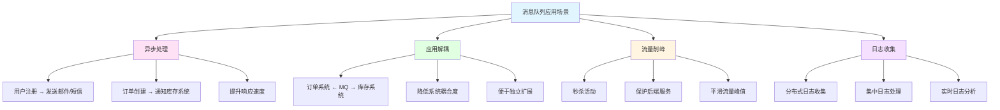

# 消息队列(RabbitMQ/Kafka)

> **学习目标**：掌握消息队列在企业级应用中的使用
> **核心内容**：RabbitMQ 3.12+、Kafka 3.x、消息可靠性、幂等性、延迟队列
> **预计时间**：6小时

## 消息队列概述

### 为什么需要消息队列



```java
/**
 * 消息队列应用场景分析
 */
public class MessageQueueScenarios {
    public static void main(String[] args) {
        System.out.println("=== 消息队列应用场景 ===\n");

        System.out.println("1. 异步处理（Async Processing）：");
        System.out.println("   场景：用户注册后发送欢迎邮件、短信通知");
        System.out.println("   传统方式：注册 → 发邮件(100ms) → 发短信(100ms) = 200ms");
        System.out.println("   MQ方式：注册 → MQ(5ms) → 异步发送 = 5ms");
        System.out.println("   提升：响应速度提升40倍\n");

        System.out.println("2. 应用解耦（Application Decoupling）：");
        System.out.println("   场景：订单系统需要调用库存、支付、物流系统");
        System.out.println("   传统方式：直接调用，系统强耦合");
        System.out.println("   MQ方式：订单 → MQ → 各系统订阅");
        System.out.println("   优势：某个系统宕机不影响订单创建\n");

        System.out.println("3. 流量削峰（Traffic Shaping）：");
        System.out.println("   场景：秒杀活动，1万请求/秒");
        System.out.println("   后端能力：1000请求/秒");
        System.out.println("   MQ方案：MQ缓存9000请求，后端慢慢处理");
        System.out.println("   结果：保护系统，防止雪崩\n");

        System.out.println("4. 日志收集（Log Collection）：");
        System.out.println("   场景：分布式系统100个服务节点");
        System.out.println("   MQ方案：各服务 → Kafka → ELK存储分析");
        System.out.println("   优势：解耦日志收集和处理\n");

        System.out.println("5. 事件驱动（Event Driven）：");
        System.out.println("   场景：订单状态变更通知");
        System.out.println("   MQ方案：订单状态变更 → MQ → 多系统订阅");
        System.out.println("   优势：松耦合、易扩展\n");
    }
}
```

### 消息队列对比

```java
/**
 * 消息队列技术选型对比（2024-2026）
 */
public class MessageQueueComparison {

    /*
    ╔════════════════════════════════════════════════════════════════╗
    ║                    消息队列选型对比表                          ║
    ╠════════════════════════════════════════════════════════════════╣
    ║ 特性          │ RabbitMQ │ Kafka  │ RocketMQ │ Redis Pub/Sub ║
    ╠════════════════════════════════════════════════════════════════╣
    ║ 开发语言      │ Erlang   │ Scala  │ Java    │ C              ║
    ║ 单机吞吐量    │ 1-2万/s  │ 10万/s │ 10万/s  │ 10万/s         ║
    ║ 时延          │ 微秒级   │ 毫秒级 │ 毫秒级  │ 微秒级         ║
    ║ 消息可靠性    │ 高       │ 高     │ 高      │ 低             ║
    ║ 消息追踪      │ 支持     │ 支持   │ 支持    │ 不支持         ║
    ║ 消息堆积能力  │ 一般     │ 极强   │ 强      │ 弱             ║
    ║ 分布式        │ 支持     │ 支持   │ 支持    │ 主从           ║
    ║ 管理界面      │ 优秀     │ 一般   │ 良好    │ 无             ║
    ║ 学习难度      │ 中等     │ 中等   │ 较高    │ 简单           ║
    ║ 社区活跃度    │ 高       │ 极高   │ 中等    │ 高             ║
    ║ 适用场景      │ 订单/邮件 │ 日志/流计算 │ 电商/金融 │ 实时通知 ║
    ╚════════════════════════════════════════════════════════════════╝

    推荐方案（2024-2026）：
    ===================
    • 订单系统、邮件通知 → RabbitMQ 3.12+
    • 日志收集、流计算 → Kafka 3.x
    • 电商、金融 → RocketMQ 5.x
    • 简单场景、实时通知 → Redis
    */
}
```

## RabbitMQ快速入门

### 环境搭建

```bash
# Docker方式安装RabbitMQ 3.12
docker run -d --name rabbitmq \
  -p 5672:5672 \      # AMQP协议端口
  -p 15672:15672 \    # 管理界面端口
  -p 25672:25672 \    # 集群通信端口
  -e RABBITMQ_DEFAULT_USER=admin \
  -e RABBITMQ_DEFAULT_PASS=admin123 \
  rabbitmq:3.12-management

# 访问管理界面
# http://localhost:15672
```

### Spring Boot 3.x整合

```xml
<!-- pom.xml -->
<?xml version="1.0" encoding="UTF-8"?>
<project xmlns="http://maven.apache.org/POM/4.0.0"
         xmlns:xsi="http://www.w3.org/2001/XMLSchema-instance"
         xsi:schemaLocation="http://maven.apache.org/POM/4.0.0
         https://maven.apache.org/xsd/maven-4.0.0.xsd">
    <modelVersion>4.0.0</modelVersion>

    <parent>
        <groupId>org.springframework.boot</groupId>
        <artifactId>spring-boot-starter-parent</artifactId>
        <version>3.2.0</version>
    </parent>

    <groupId>com.example</groupId>
    <artifactId>rabbitmq-demo</artifactId>
    <version>1.0.0</version>

    <properties>
        <java.version>17</java.version>
    </properties>

    <dependencies>
        <!-- Spring Boot AMQP -->
        <dependency>
            <groupId>org.springframework.boot</groupId>
            <artifactId>spring-boot-starter-amqp</artifactId>
        </dependency>

        <!-- Spring Boot Web -->
        <dependency>
            <groupId>org.springframework.boot</groupId>
            <artifactId>spring-boot-starter-web</artifactId>
        </dependency>

        <!-- Lombok -->
        <dependency>
            <groupId>org.projectlombok</groupId>
            <artifactId>lombok</artifactId>
            <optional>true</optional>
        </dependency>

        <!-- JSON序列化 -->
        <dependency>
            <groupId>com.fasterxml.jackson.core</groupId>
            <artifactId>jackson-databind</artifactId>
        </dependency>
    </dependencies>
</project>
```

### RabbitMQ配置

```yaml
# application.yml
spring:
  application:
    name: rabbitmq-demo

  # RabbitMQ配置
  rabbitmq:
    host: localhost
    port: 5672
    username: admin
    password: admin123
    virtual-host: /

    # 发布确认（确保消息到达Exchange）
    publisher-confirm-type: correlated
    # publisher-confirm-type: none    # 禁用确认（默认）
    # publisher-confirm-type: simple  # 同步确认（阻塞）

    # 发布返回（确保消息路由到Queue）
    publisher-returns: true

    # 连接配置
    connection-timeout: 15000
    cache:
      channel:
        size: 25
        checkout-timeout: 30000

    # 监听器配置
    listener:
      simple:
        # 消费者确认模式
        acknowledge-mode: manual
        # acknowledge-mode: none      # 自动确认
        # acknowledge-mode: auto      # 根据异常情况自动确认/拒绝

        # 并发配置
        concurrency: 5           # 最小并发消费者数
        max-concurrency: 10      # 最大并发消费者数

        # 预取数量（流量控制）
        prefetch: 1              # 每次从队列取1条消息

        # 重试配置
        retry:
          enabled: true
          max-attempts: 3
          initial-interval: 2000     # 初始重试间隔2秒
          multiplier: 2.0            # 间隔倍增
          max-interval: 10000        # 最大重试间隔10秒

        # 默认转换器
        default-requeue-rejected: true  # 拒绝的消息重新入队

      # 直接监听器容器
      direct:
        prefetch: 1

# 日志配置
logging:
  level:
    com.example: DEBUG
    org.springframework.amqp: DEBUG
```

### RabbitMQ配置类

```java
package com.example.rabbitmq.config;

import org.springframework.amqp.core.*;
import org.springframework.amqp.rabbit.connection.ConnectionFactory;
import org.springframework.amqp.rabbit.core.RabbitTemplate;
import org.springframework.amqp.support.converter.Jackson2JsonMessageConverter;
import org.springframework.amqp.support.converter.MessageConverter;
import org.springframework.context.annotation.Bean;
import org.springframework.context.annotation.Configuration;

/**
 * RabbitMQ配置类
 */
@Configuration
public class RabbitMQConfig {

    // ==================== 消息转换器 ====================

    /**
     * JSON消息转换器
     * 使用Jackson序列化Java对象为JSON
     */
    @Bean
    public MessageConverter jsonMessageConverter() {
        return new Jackson2JsonMessageConverter();
    }

    /**
     * RabbitTemplate配置
     */
    @Bean
    public RabbitTemplate rabbitTemplate(ConnectionFactory connectionFactory) {
        RabbitTemplate rabbitTemplate = new RabbitTemplate(connectionFactory);
        rabbitTemplate.setMessageConverter(jsonMessageConverter());

        // 开启强制回调
        // 消息无法路由时，触发ReturnsCallback
        rabbitTemplate.setMandatory(true);

        // 确认回调（消息到达Exchange）
        rabbitTemplate.setConfirmCallback((correlationData, ack, cause) -> {
            if (ack) {
                System.out.println("✅ 消息成功到达Exchange");
            } else {
                System.err.println("❌ 消息未到达Exchange：" + cause);
                // 可以在这里实现重试或记录到数据库
            }
        });

        // 返回回调（消息未路由到Queue）
        rabbitTemplate.setReturnsCallback(returned -> {
            System.err.println("❌ 消息未路由到Queue：");
            System.err.println("   消息：" + returned.getMessage());
            System.err.println("   回复码：" + returned.getReplyCode());
            System.err.println("   回复文本：" + returned.getReplyText());
            System.err.println("   交换机：" + returned.getExchange());
            System.err.println("   路由键：" + returned.getRoutingKey());
        });

        return rabbitTemplate;
    }

    // ==================== 交换机（Exchange）====================

    /**
     * 直连交换机（Direct Exchange）
     * 根据精确的路由键路由消息
     */
    @Bean
    public DirectExchange orderDirectExchange() {
        return new DirectExchange("order.direct.exchange", true, false);
    }

    /**
     * 扇出交换机（Fanout Exchange）
     * 将消息广播到所有绑定的队列
     */
    @Bean
    public FanoutExchange notifyFanoutExchange() {
        return new FanoutExchange("notify.fanout.exchange", true, false);
    }

    /**
     * 主题交换机（Topic Exchange）
     * 支持通配符路由
     * * 匹配一个单词，# 匹配零个或多个单词
     */
    @Bean
    public TopicExchange logTopicExchange() {
        return new TopicExchange("log.topic.exchange", true, false);
    }

    // ==================== 队列（Queue）====================

    /**
     * 订单队列（持久化）
     */
    @Bean
    public Queue orderQueue() {
        return QueueBuilder.durable("order.queue")
                // 最大消息数量
                .withArgument("x-max-length", 10000)
                // 消息TTL（24小时）
                .withArgument("x-message-ttl", 86400000)
                // 队列最大长度（字节）
                .withArgument("x-max-length-bytes", 1073741824)
                // 溢出行为（删除头部消息）
                .withArgument("x-overflow", "drop-head")
                .build();
    }

    /**
     * 邮件队列
     */
    @Bean
    public Queue emailQueue() {
        return QueueBuilder.durable("email.queue").build();
    }

    /**
     * 短信队列
     */
    @Bean
    public Queue smsQueue() {
        return QueueBuilder.durable("sms.queue").build();
    }

    /**
     * 错误日志队列
     */
    @Bean
    public Queue errorLogQueue() {
        return QueueBuilder.durable("log.error.queue").build();
    }

    /**
     * 所有日志队列
     */
    @Bean
    public Queue allLogQueue() {
        return QueueBuilder.durable("log.all.queue").build();
    }

    /**
     * 死信队列
     * 用于存储处理失败的消息
     */
    @Bean
    public Queue deadLetterQueue() {
        return QueueBuilder.durable("dead.letter.queue").build();
    }

    /**
     * 延迟队列（需要安装延迟插件）
     * rabbitmq_delayed_message_exchange
     */
    @Bean
    public Queue delayedQueue() {
        return QueueBuilder.durable("delayed.queue").build();
    }

    /**
     * 延迟交换机
     */
    @Bean
    public CustomExchange delayedExchange() {
        return new CustomExchange("delayed.exchange", "x-delayed-message",
                true, false, java.util.Map.of("x-delayed-type", "direct"));
    }

    // ==================== 绑定（Binding）====================

    /**
     * 订单队列绑定到直连交换机
     */
    @Bean
    public Binding orderBinding() {
        return BindingBuilder.bind(orderQueue())
                .to(orderDirectExchange())
                .with("order.create");
    }

    /**
     * 邮件队列绑定到扇出交换机
     */
    @Bean
    public Binding emailBinding() {
        return BindingBuilder.bind(emailQueue())
                .to(notifyFanoutExchange());
    }

    /**
     * 短信队列绑定到扇出交换机
     */
    @Bean
    public Binding smsBinding() {
        return BindingBuilder.bind(smsQueue())
                .to(notifyFanoutExchange());
    }

    /**
     * 错误日志队列绑定到主题交换机（只接收ERROR级别）
     */
    @Bean
    public Binding errorLogBinding() {
        return BindingBuilder.bind(errorLogQueue())
                .to(logTopicExchange())
                .with("log.error");
    }

    /**
     * 所有日志队列绑定到主题交换机（接收所有日志）
     */
    @Bean
    public Binding allLogBinding() {
        return BindingBuilder.bind(allLogQueue())
                .to(logTopicExchange())
                .with("log.*");
    }

    /**
     * 延迟队列绑定
     */
    @Bean
    public Binding delayedBinding() {
        return BindingBuilder.bind(delayedQueue())
                .to(delayedExchange())
                .with("delayed.order");
    }
}
```

## 消息发送

### 消息生产者

```java
package com.example.rabbitmq.producer;

import org.springframework.amqp.rabbit.connection.CorrelationData;
import org.springframework.amqp.rabbit.core.RabbitTemplate;
import org.springframework.beans.factory.annotation.Autowired;
import org.springframework.stereotype.Service;

import java.util.UUID;

/**
 * 消息生产者
 */
@Service
public class MessageProducer {

    @Autowired
    private RabbitTemplate rabbitTemplate;

    /**
     * 发送简单文本消息
     */
    public void sendSimpleMessage(String message) {
        rabbitTemplate.convertAndSend("order.direct.exchange", "order.create", message);
        System.out.println("消息已发送：" + message);
    }

    /**
     * 发送对象消息（自动序列化为JSON）
     */
    public void sendObjectMessage(Object obj) {
        rabbitTemplate.convertAndSend("order.direct.exchange", "order.create", obj);
        System.out.println("对象消息已发送：" + obj);
    }

    /**
     * 发送消息（带确认回调）
     */
    public void sendMessageWithCallback(Object message) {
        // 创建关联数据（用于关联发送和确认）
        CorrelationData correlationData = new CorrelationData(UUID.randomUUID().toString());

        rabbitTemplate.convertAndSend(
                "order.direct.exchange",
                "order.create",
                message,
                correlationData
        );

        System.out.println("消息已发送（带回调）：" + message);
    }

    /**
     * 发送延迟消息（需要安装延迟插件）
     * rabbitmq_delayed_message_exchange
     */
    public void sendDelayedMessage(Object message, long delayMillis) {
        rabbitTemplate.convertAndSend(
                "delayed.exchange",
                "delayed.order",
                message,
                msg -> {
                    // 设置延迟时间（毫秒）
                    msg.getMessageProperties().setDelay((int) delayMillis);
                    return msg;
                }
        );

        System.out.println("延迟消息已发送：" + message + "，延迟：" + delayMillis + "ms");
    }

    /**
     * 发送优先级消息
     */
    public void sendPriorityMessage(Object message, int priority) {
        rabbitTemplate.convertAndSend(
                "order.direct.exchange",
                "order.create",
                message,
                msg -> {
                    // 设置优先级（0-9，数字越大优先级越高）
                    msg.getMessageProperties().setPriority(priority);
                    return msg;
                }
        );

        System.out.println("优先级消息已发送：" + message + "，优先级：" + priority);
    }

    /**
     * 发送消息到多个队列（使用Fanout交换机）
     */
    public void broadcastMessage(Object message) {
        rabbitTemplate.convertAndSend("notify.fanout.exchange", "", message);
        System.out.println("广播消息已发送：" + message);
    }

    /**
     * 发送主题消息
     */
    public void sendTopicMessage(String routingKey, Object message) {
        rabbitTemplate.convertAndSend("log.topic.exchange", routingKey, message);
        System.out.println("主题消息已发送：" + routingKey + " -> " + message);
    }

    /**
     * 发送消息（带自定义属性）
     */
    public void sendMessageWithHeaders(Object message, String contentType) {
        rabbitTemplate.convertAndSend(
                "order.direct.exchange",
                "order.create",
                message,
                msg -> {
                    // 设置消息类型
                    msg.getMessageProperties().setContentType(contentType);
                    // 设置编码
                    msg.getMessageProperties().setContentEncoding("UTF-8");
                    // 设置自定义头
                    msg.getMessageProperties().setHeader("X-Custom-Header", "custom-value");
                    return msg;
                }
        );

        System.out.println("自定义消息已发送：" + message);
    }

    /**
     * 批量发送消息
     */
    public void sendBatchMessages(java.util.List<Object> messages) {
        messages.forEach(message -> {
            rabbitTemplate.convertAndSend("order.direct.exchange", "order.create", message);
        });

        System.out.println("批量消息已发送：" + messages.size() + "条");
    }
}
```

### 消息实体类

```java
package com.example.rabbitmq.entity;

import lombok.AllArgsConstructor;
import lombok.Data;
import lombok.NoArgsConstructor;

import java.io.Serializable;
import java.math.BigDecimal;
import java.time.LocalDateTime;

/**
 * 订单消息实体
 */
@Data
@NoArgsConstructor
@AllArgsConstructor
public class OrderMessage implements Serializable {

    /**
     * 订单ID
     */
    private Long orderId;

    /**
     * 用户ID
     */
    private Long userId;

    /**
     * 订单金额
     */
    private BigDecimal amount;

    /**
     * 商品名称
     */
    private String productName;

    /**
     * 订单状态
     */
    private String status;

    /**
     * 创建时间
     */
    private LocalDateTime createTime;

    /**
     * 备注
     */
    private String remark;
}
```

## 消息消费

### 消息消费者

```java
package com.example.rabbitmq.consumer;

import com.rabbitmq.client.Channel;
import lombok.extern.slf4j.Slf4j;
import org.springframework.amqp.core.Message;
import org.springframework.amqp.rabbit.annotation.*;
import org.springframework.stereotype.Component;

import java.io.IOException;
import java.util.List;

/**
 * 消息消费者
 */
@Slf4j
@Component
public class MessageConsumer {

    /**
     * 基本消费（自动确认）
     * 消息从队列取出后立即确认，不管业务是否成功
     */
    @RabbitListener(queues = "order.queue")
    public void handleSimpleMessage(String message) {
        log.info("收到消息（自动确认）：{}", message);
        // 处理消息
    }

    /**
     * 手动确认消费
     * 业务处理成功后才确认，失败可以重新入队或进入死信队列
     */
    @RabbitListener(queues = "order.queue")
    public void handleMessageWithAck(Message message, Channel channel) throws IOException {
        long deliveryTag = message.getMessageProperties().getDeliveryTag();

        try {
            String msg = new String(message.getBody());
            log.info("收到消息（手动确认）：{}", msg);

            // 业务处理
            processMessage(msg);

            // 手动确认（multiple=false，只确认当前消息）
            channel.basicAck(deliveryTag, false);
            log.info("消息确认成功：{}", deliveryTag);

        } catch (Exception e) {
            log.error("消息处理失败：{}", deliveryTag, e);

            // 拒绝消息
            // requeue=true：消息重新入队，会重新消费
            // requeue=false：消息不重新入队，进入死信队列（如果配置了）
            channel.basicNack(deliveryTag, false, true);

            // 或者使用basicReject（只能拒绝单条消息）
            // channel.basicReject(deliveryTag, true);
        }
    }

    /**
     * 批量消费
     * 一次从队列取多条消息处理
     */
    @RabbitListener(
        queues = "order.queue",
        containerFactory = "batchRabbitListenerContainerFactory",
        concurrency = "3-10"
    )
    public void handleBatchMessages(List<Message> messages) {
        log.info("批量消费：{}条消息", messages.size());

        messages.forEach(message -> {
            try {
                String msg = new String(message.getBody());
                log.info("处理消息：{}", msg);
                // 批量处理
            } catch (Exception e) {
                log.error("批量消息处理失败", e);
            }
        });
    }

    /**
     * 死信队列消费
     * 处理失败的消息会进入死信队列
     */
    @RabbitListener(queues = "dead.letter.queue")
    public void handleDeadLetter(Message message) {
        String msg = new String(message.getBody());
        log.warn("收到死信消息：{}", msg);

        // 记录到数据库、发送告警、人工处理等
        saveDeadLetterToDB(message);
    }

    /**
     * 延迟消息消费
     */
    @RabbitListener(queues = "delayed.queue")
    public void handleDelayedMessage(String message) {
        log.info("收到延迟消息：{}", message);

        // 处理延迟任务
        // 例如：订单超时取消、定时提醒等
        processDelayedTask(message);
    }

    /**
     * 邮件通知消费（Fanout交换机）
     */
    @RabbitListener(queues = "email.queue")
    public void handleEmailMessage(String message) {
        log.info("发送邮件：{}", message);

        // 发送邮件
        sendEmail(message);
    }

    /**
     * 短信通知消费（Fanout交换机）
     */
    @RabbitListener(queues = "sms.queue")
    public void handleSmsMessage(String message) {
        log.info("发送短信：{}", message);

        // 发送短信
        sendSms(message);
    }

    /**
     * 错误日志消费（Topic交换机）
     * 路由键：log.error
     */
    @RabbitListener(queues = "log.error.queue")
    public void handleErrorLog(String message) {
        log.error("错误日志：{}", message);

        // 记录到专门错误日志文件或发送告警
    }

    /**
     * 所有日志消费（Topic交换机）
     * 路由键：log.*
     */
    @RabbitListener(queues = "log.all.queue")
    public void handleAllLog(String message) {
        log.info("日志：{}", message);

        // 记录到日志系统
    }

    /**
     * 并发消费
     * concurrency = "3-10"：最小3个消费者，最大10个消费者
     */
    @RabbitListener(
        queues = "order.queue",
        concurrency = "3-10"
    )
    public void handleConcurrently(String message) {
        log.info("并发消费：{}", message);

        // 业务处理
    }

    // ==================== 私有方法 ====================

    /**
     * 处理消息业务逻辑
     */
    private void processMessage(String message) {
        // 业务处理逻辑
        // 例如：数据库操作、调用其他服务等
    }

    /**
     * 保存死信消息到数据库
     */
    private void saveDeadLetterToDB(Message message) {
        // 保存到数据库
        // 发送告警通知
    }

    /**
     * 处理延迟任务
     */
    private void processDelayedTask(String message) {
        // 延迟任务处理逻辑
    }

    /**
     * 发送邮件
     */
    private void sendEmail(String message) {
        // 邮件发送逻辑
    }

    /**
     * 发送短信
     */
    private void sendSms(String message) {
        // 短信发送逻辑
    }
}
```

## Kafka快速入门

### Kafka 3.x环境搭建

```bash
# Docker方式安装Kafka 3.x
# 需要先安装ZooKeeper

# 1. 启动ZooKeeper
docker run -d --name zookeeper \
  -p 2181:2181 \
  -e ZOOKEEPER_CLIENT_PORT=2181 \
  confluentinc/cp-zookeeper:7.5.0

# 2. 启动Kafka
docker run -d --name kafka \
  -p 9092:9092 \
  -e KAFKA_BROKER_ID=1 \
  -e KAFKA_ZOOKEEPER_CONNECT=zookeeper:2181 \
  -e KAFKA_ADVERTISED_LISTENERS=PLAINTEXT://localhost:9092 \
  -e KAFKA_OFFSETS_TOPIC_REPLICATION_FACTOR=1 \
  confluentinc/cp-kafka:7.5.0

# 3. 创建主题
docker exec -it kafka kafka-topics --create \
  --topic order-topic \
  --bootstrap-server localhost:9092 \
  --partitions 3 \
  --replication-factor 1

# 4. 查看主题列表
docker exec -it kafka kafka-topics --list \
  --bootstrap-server localhost:9092
```

### Spring Boot整合Kafka

```xml
<!-- pom.xml -->
<dependency>
    <groupId>org.springframework.kafka</groupId>
    <artifactId>spring-kafka</artifactId>
</dependency>
```

### Kafka配置

```yaml
# application.yml
spring:
  kafka:
    # Kafka服务器地址
    bootstrap-servers: localhost:9092

    # 生产者配置
    producer:
      # 键序列化器
      key-serializer: org.apache.kafka.common.serialization.StringSerializer
      # 值序列化器
      value-serializer: org.apache.kafka.common.serialization.StringSerializer

      # 确认级别
      # acks=0：不等待确认
      # acks=1：Leader确认（默认）
      # acks=all：所有副本确认（最安全）
      acks: all

      # 重试次数
      retries: 3

      # 批量大小（字节）
      batch-size: 16384

      # 缓冲区大小（字节）
      buffer-memory: 33554432

      # 消息压缩
      # none, gzip, snappy, lz4, zstd
      compression-type: snappy

      # 超时时间
      properties:
        request.timeout.ms: 30000
        delivery.timeout.ms: 120000

    # 消费者配置
    consumer:
      # 键反序列化器
      key-deserializer: org.apache.kafka.common.serialization.StringDeserializer
      # 值反序列化器
      value-deserializer: org.apache.kafka.common.serialization.StringDeserializer

      # 消费者组ID
      group-id: order-consumer-group

      # 自动提交偏移量
      enable-auto-commit: false

      # 偏移量重置策略
      # earliest：从头开始消费
      # latest：从最新消息开始消费（默认）
      # none：抛出异常
      auto-offset-reset: earliest

      # 一次拉取最大消息数
      max-poll-records: 100

      # 心跳间隔
      properties:
        session.timeout.ms: 30000
        heartbeat.interval.ms: 10000
        max.poll.interval.ms: 300000

    # 监听器配置
    listener:
      # 监听器类型
      type: batch

      # 确认模式
      # RECORD：每条消息确认
      # BATCH：批量确认
      # COUNT：达到指定数量确认
      # TIME：指定时间确认
      # MANUAL：手动确认
      ack-mode: manual

      # 并发数
      concurrency: 3
```

### Kafka生产者

```java
package com.example.kafka.producer;

import org.springframework.beans.factory.annotation.Autowired;
import org.springframework.kafka.core.KafkaTemplate;
import org.springframework.kafka.support.SendResult;
import org.springframework.stereotype.Service;

import java.util.concurrent.CompletableFuture;

/**
 * Kafka生产者
 */
@Service
public class KafkaProducer {

    @Autowired
    private KafkaTemplate<String, String> kafkaTemplate;

    /**
     * 发送消息（异步，不等待确认）
     */
    public void sendMessage(String topic, String message) {
        kafkaTemplate.send(topic, message);
        System.out.println("Kafka消息已发送：" + message);
    }

    /**
     * 发送消息（带Key）
     * 相同Key的消息会发送到同一个分区
     */
    public void sendMessageWithKey(String topic, String key, String message) {
        kafkaTemplate.send(topic, key, message);
        System.out.println("Kafka消息已发送（Key：" + key + "）：" + message);
    }

    /**
     * 发送消息（带分区）
     */
    public void sendMessageToPartition(String topic, Integer partition, String message) {
        kafkaTemplate.send(topic, partition, null, message);
        System.out.println("Kafka消息已发送（分区：" + partition + "）：" + message);
    }

    /**
     * 发送消息（带回调）
     */
    public void sendMessageWithCallback(String topic, String key, String message) {
        CompletableFuture<SendResult<String, String>> future =
                kafkaTemplate.send(topic, key, message);

        future.whenComplete((result, ex) -> {
            if (ex == null) {
                System.out.println("✅ Kafka消息发送成功：");
                System.out.println("   主题：" + result.getRecordMetadata().topic());
                System.out.println("   分区：" + result.getRecordMetadata().partition());
                System.out.println("   偏移量：" + result.getRecordMetadata().offset());
            } else {
                System.err.println("❌ Kafka消息发送失败：" + ex.getMessage());
                // 可以在这里实现重试
            }
        });
    }

    /**
     * 发送消息（同步等待）
     */
    public void sendSyncMessage(String topic, String message) throws Exception {
        kafkaTemplate.send(topic, message).get();
        System.out.println("Kafka消息已发送（同步）：" + message);
    }

    /**
     * 发送消息（指定时间戳）
     */
    public void sendMessageWithTimestamp(String topic, String message, long timestamp) {
        kafkaTemplate.send(topic, null, null, timestamp, message);
        System.out.println("Kafka消息已发送（时间戳：" + timestamp + "）：" + message);
    }

    /**
     * 批量发送消息
     */
    public void sendBatchMessages(String topic, java.util.List<String> messages) {
        messages.forEach(message -> kafkaTemplate.send(topic, message));
        System.out.println("批量Kafka消息已发送：" + messages.size() + "条");
    }
}
```

### Kafka消费者

```java
package com.example.kafka.consumer;

import org.apache.kafka.clients.consumer.ConsumerRecord;
import org.springframework.kafka.annotation.KafkaListener;
import org.springframework.kafka.support.Acknowledgment;
import org.springframework.kafka.support.KafkaHeaders;
import org.springframework.messaging.handler.annotation.Header;
import org.springframework.messaging.handler.annotation.Payload;
import org.springframework.stereotype.Component;

import java.util.List;

/**
 * Kafka消费者
 */
@Component
public class KafkaConsumer {

    /**
     * 基本消费
     */
    @KafkaListener(
        topics = "order-topic",
        groupId = "order-consumer-group"
    )
    public void handleMessage(String message) {
        System.out.println("收到Kafka消息：" + message);
    }

    /**
     * 手动确认消费
     */
    @KafkaListener(
        topics = "order-topic",
        groupId = "order-consumer-group"
    )
    public void handleMessageWithAck(
            ConsumerRecord<String, String> record,
            Acknowledgment ack) {

        try {
            String message = record.value();
            System.out.println("收到Kafka消息：" + message);
            System.out.println("主题：" + record.topic());
            System.out.println("分区：" + record.partition());
            System.out.println("偏移量：" + record.offset());
            System.out.println("时间戳：" + record.timestamp());

            // 处理消息
            processMessage(message);

            // 手动确认
            ack.acknowledge();
            System.out.println("消息确认成功");

        } catch (Exception e) {
            System.err.println("消息处理失败：" + e.getMessage());
            // 不确认，消息会被重新消费
        }
    }

    /**
     * 批量消费
     */
    @KafkaListener(
        topics = "order-topic",
        groupId = "order-consumer-group",
        batch = "true"
    )
    public void handleBatchMessages(List<ConsumerRecord<String, String>> records) {
        System.out.println("批量消费Kafka消息：" + records.size() + "条");

        records.forEach(record -> {
            System.out.println("消息：" + record.value());
        });

        // 批量处理
    }

    /**
     * 获取消息元数据
     */
    @KafkaListener(
        topics = "order-topic",
        groupId = "order-consumer-group"
    )
    public void handleMessageWithMetadata(
            @Payload String message,
            @Header(KafkaHeaders.RECEIVED_TOPIC) String topic,
            @Header(KafkaHeaders.RECEIVED_PARTITION_ID) int partition,
            @Header(KafkaHeaders.OFFSET) long offset,
            @Header(KafkaHeaders.RECEIVED_TIMESTAMP) long timestamp) {

        System.out.println("收到Kafka消息：");
        System.out.println("  消息：" + message);
        System.out.println("  主题：" + topic);
        System.out.println("  分区：" + partition);
        System.out.println("  偏移量：" + offset);
        System.out.println("  时间戳：" + timestamp);
    }

    /**
     * 指定分区消费
     */
    @KafkaListener(
        topicPartitions = @org.springframework.kafka.annotation.TopicPartition(
            topic = "order-topic",
            partitions = {"0", "1"}
        ),
        groupId = "order-consumer-group"
    )
    public void handleMessageFromPartition(String message) {
        System.out.println("从指定分区收到消息：" + message);
    }

    // ==================== 私有方法 ====================

    private void processMessage(String message) {
        // 业务处理逻辑
    }
}
```

## 消息可靠性保证

### 消息可靠性机制

```java
/**
 * 消息可靠性保证方案
 */
public class MessageReliability {

    /*
    ╔═════════════════════════════════════════════════════════════════╗
    ║                    RabbitMQ可靠性机制                           ║
    ╠═════════════════════════════════════════════════════════════════╣
    ║ 1. 生产者确认                                                    ║
    ║    ├─ Publisher Confirm（消息到达Exchange）                     ║
    ║    │   publisher-confirm-type: correlated                       ║
    ║    └─ Publisher Returns（消息路由到Queue）                       ║
    ║        publisher-returns: true                                  ║
    ║                                                                ║
    ║ 2. 持久化                                                        ║
    ║    ├─ Queue：durable=true                                       ║
    ║    ├─ Message：delivery_mode=2（持久化）                        ║
    ║    └─ Exchange：durable=true                                    ║
    ║                                                                ║
    ║ 3. 消费者确认                                                    ║
    ║    acknowledge-mode: manual                                     ║
    ║    ├─ basicAck：确认消息                                        ║
    ║    ├─ basicNack：拒绝消息（可重入队）                           ║
    ║    └─ basicReject：拒绝单条消息                                 ║
    ║                                                                ║
    ║ 4. 高可用                                                        ║
    ║    └─ 镜像队列（Mirrored Queue）                                ║
    ╚═════════════════════════════════════════════════════════════════╝

    ╔═════════════════════════════════════════════════════════════════╗
    ║                    Kafka可靠性机制                             ║
    ╠═════════════════════════════════════════════════════════════════╣
    ║ 1. 生产者确认                                                    ║
    ║    ├─ acks=0：不等待确认（最快，可能丢数据）                     ║
    ║    ├─ acks=1：Leader确认（默认）                                ║
    ║    └─ acks=all：所有副本确认（最安全）                          ║
    ║                                                                ║
    ║ 2. 幂等性                                                        ║
    ║    enable.idempotence=true                                     ║
    ║    每个Producer有唯一ID，自动去重                               ║
    ║                                                                ║
    ║ 3. 事务                                                          ║
    ║    transactional.id=xxx                                         ║
    ║    保证多条消息要么全部成功，要么全部失败                        ║
    ║                                                                ║
    ║ 4. 副本                                                          ║
    ║    replication-factor=3                                         ║
    ║    每个分区3个副本                                               ║
    ╚═════════════════════════════════════════════════════════════════╝
    */
}
```

### 消息幂等性

```java
package com.example.rabbitmq.service;

import lombok.extern.slf4j.Slf4j;
import org.springframework.amqp.rabbit.core.RabbitTemplate;
import org.springframework.beans.factory.annotation.Autowired;
import org.springframework.data.redis.core.StringRedisTemplate;
import org.springframework.stereotype.Service;

import java.util.UUID;
import java.util.concurrent.TimeUnit;

/**
 * 幂等性消费服务
 */
@Slf4j
@Service
public class IdempotentConsumerService {

    @Autowired
    private RabbitTemplate rabbitTemplate;

    @Autowired
    private StringRedisTemplate redisTemplate;

    /**
     * 发送幂等消息
     */
    public void sendIdempotentMessage(Object message) {
        // 生成唯一消息ID
        String messageId = UUID.randomUUID().toString();

        rabbitTemplate.convertAndSend(
                "order.direct.exchange",
                "order.create",
                message,
                msg -> {
                    // 在消息头中添加唯一ID
                    msg.getMessageProperties().setMessageId(messageId);
                    return msg;
                }
        );

        log.info("幂等消息已发送：ID={}, Message={}", messageId, message);
    }

    /**
     * 幂等性消费
     * 使用Redis实现消息去重
     */
    public boolean consumeIdempotently(String messageId, String message) {
        // Redis Key：message:processed:{messageId}
        String key = "message:processed:" + messageId;

        try {
            // setIfAbsent：如果key不存在则设置，返回true
            // 如果key已存在则不设置，返回false
            Boolean isNew = redisTemplate.opsForValue()
                    .setIfAbsent(key, "1", 24, TimeUnit.HOURS);

            if (Boolean.FALSE.equals(isNew)) {
                log.warn("消息已处理，跳过：ID={}", messageId);
                return false;
            }

            // 处理消息
            log.info("开始处理消息：ID={}, Message={}", messageId, message);
            processMessage(message);

            log.info("消息处理成功：ID={}", messageId);
            return true;

        } catch (Exception e) {
            log.error("消息处理失败：ID={}", messageId, e);

            // 处理失败，删除标记，允许重试
            redisTemplate.delete(key);
            throw new RuntimeException("消息处理失败", e);
        }
    }

    /**
     * 使用数据库实现幂等性
     */
    public boolean consumeIdempotentlyWithDB(String messageId, String message) {
        // 查询消息处理记录
        boolean exists = checkMessageExists(messageId);

        if (exists) {
            log.warn("消息已处理（数据库），跳过：ID={}", messageId);
            return false;
        }

        try {
            // 插入处理记录
            insertMessageRecord(messageId, message);

            // 处理消息
            processMessage(message);

            // 更新处理状态为成功
            updateMessageStatus(messageId, "SUCCESS");

            return true;

        } catch (Exception e) {
            log.error("消息处理失败：ID={}", messageId, e);
            // 更新处理状态为失败
            updateMessageStatus(messageId, "FAILED");
            throw new RuntimeException("消息处理失败", e);
        }
    }

    /**
     * 使用令牌桶机制实现幂等性
     */
    public boolean consumeIdempotentlyWithToken(String messageId, String message) {
        String tokenKey = "message:token:" + messageId;

        // 获取令牌
        String token = redisTemplate.opsForValue().get(tokenKey);

        if (token == null) {
            log.warn("令牌不存在或已过期：ID={}", messageId);
            return false;
        }

        // 删除令牌（使用Lua脚本保证原子性）
        String luaScript =
                "if redis.call('get', KEYS[1]) == ARGV[1] then " +
                "    return redis.call('del', KEYS[1]) " +
                "else " +
                "    return 0 " +
                "end";

        Long result = redisTemplate.execute(
                // RedisScript
                org.springframework.data.redis.core.script.DefaultRedisScript.forLong(luaScript),
                java.util.List.of(tokenKey),
                token
        );

        if (result == 1) {
            // 令牌有效，处理消息
            processMessage(message);
            return true;
        } else {
            log.warn("令牌无效：ID={}", messageId);
            return false;
        }
    }

    // ==================== 私有方法 ====================

    private void processMessage(String message) {
        // 业务处理逻辑
    }

    private boolean checkMessageExists(String messageId) {
        // 查询数据库
        return false;
    }

    private void insertMessageRecord(String messageId, String message) {
        // 插入数据库
    }

    private void updateMessageStatus(String messageId, String status) {
        // 更新数据库
    }
}
```

### 死信队列配置

```java
package com.example.rabbitmq.config;

import org.springframework.amqp.core.*;
import org.springframework.context.annotation.Bean;
import org.springframework.context.annotation.Configuration;

/**
 * 死信队列配置
 */
@Configuration
public class DeadLetterQueueConfig {

    /**
     * 死信交换机
     */
    @Bean
    public DirectExchange deadLetterExchange() {
        return new DirectExchange("dead.letter.exchange", true, false);
    }

    /**
     * 死信队列
     */
    @Bean
    public Queue deadLetterQueue() {
        return QueueBuilder.durable("dead.letter.queue").build();
    }

    /**
     * 死信队列绑定
     */
    @Bean
    public Binding deadLetterBinding() {
        return BindingBuilder.bind(deadLetterQueue())
                .to(deadLetterExchange())
                .with("dead.letter");
    }

    /**
     * 业务队列（配置死信交换机）
     */
    @Bean
    public Queue businessQueue() {
        return QueueBuilder.durable("business.queue")
                // 指定死信交换机
                .withArgument("x-dead-letter-exchange", "dead.letter.exchange")
                // 指定死信路由键
                .withArgument("x-dead-letter-routing-key", "dead.letter")
                // 消息TTL（10秒）
                .withArgument("x-message-ttl", 10000)
                // 队列最大长度
                .withArgument("x-max-length", 1000)
                .build();
    }

    /**
     * 业务交换机
     */
    @Bean
    public DirectExchange businessExchange() {
        return new DirectExchange("business.exchange", true, false);
    }

    /**
     * 业务队列绑定
     */
    @Bean
    public Binding businessBinding() {
        return BindingBuilder.bind(businessQueue())
                .to(businessExchange())
                .with("business.key");
    }
}
```

## 消息堆积处理

### 消息堆积解决方案

```java
/**
 * 消息堆积处理方案
 */
public class MessageBacklogSolution {

    /*
    ╔═════════════════════════════════════════════════════════════════╗
    ║                    消息堆积处理方案                             ║
    ╠═════════════════════════════════════════════════════════════════╣
    ║ 原因分析：                                                      ║
    ║ 1. 生产速度 > 消费速度                                          ║
    ║ 2. 消费者处理缓慢                                               ║
    ║ 3. 消费者宕机                                                   ║
    ║ 4. 网络延迟                                                     ║
    ║                                                                ║
    ║ 解决方案：                                                      ║
    ║                                                                ║
    ║ 1. 增加消费者（横向扩展）                                        ║
    ║    ├─ 增加消费者实例                                            ║
    ║    ├─ 提高并发数（concurrency）                                 ║
    ║    └─ 确保消费者组内每个实例监听不同队列                        ║
    ║                                                                ║
    ║ 2. 批量消费                                                      ║
    ║    ├─ 设置prefetch=10（每次取10条）                            ║
    ║    ├─ 批量处理消息                                               ║
    ║    └─ 减少网络开销                                               ║
    ║                                                                ║
    ║ 3. 优化消费逻辑                                                  ║
    ║    ├─ 异步处理                                                   ║
    ║    ├─ 减少DB操作（批量插入）                                    ║
    ║    └─ 使用缓存                                                   ║
    ║                                                                ║
    ║ 4. 临时扩容（针对RabbitMQ）                                      ║
    ║    ├─ 创建临时队列                                              ║
    ║    ├─ 将堆积消息转移到临时队列                                  ║
    ║    ├─ 增加消费者处理临时队列                                    ║
    ║    └─ 处理完成后删除临时队列                                    ║
    ║                                                                ║
    ║ 5. 死信队列                                                      ║
    ║    ├─ 超时消息转死信                                            ║
    ║    └─ 后续人工处理                                              ║
    ╚═════════════════════════════════════════════════════════════════╝
    */
}
```

### 批量消费配置

```java
package com.example.rabbitmq.config;

import org.springframework.amqp.rabbit.config.SimpleRabbitListenerContainerFactory;
import org.springframework.amqp.rabbit.connection.ConnectionFactory;
import org.springframework.context.annotation.Bean;
import org.springframework.context.annotation.Configuration;

/**
 * 批量消费配置
 */
@Configuration
public class BatchConsumerConfig {

    /**
     * 批量消费工厂
     */
    @Bean
    public SimpleRabbitListenerContainerFactory batchRabbitListenerContainerFactory(
            ConnectionFactory connectionFactory) {

        SimpleRabbitListenerContainerFactory factory =
                new SimpleRabbitListenerContainerFactory();

        factory.setConnectionFactory(connectionFactory);

        // 启用批量消费
        factory.setBatchListener(true);

        // 设置批量大小
        factory.setBatchSize(100);

        // 设置消费者确认模式
        factory.setAcknowledgeMode(org.springframework.amqp.core.AcknowledgeMode.MANUAL);

        // 设置并发数
        factory.setConcurrency(5);
        factory.setMaxConcurrency(10);

        // 设置预取数量
        factory.setPrefetch(100);

        return factory;
    }
}
```

## 最佳实践

### 消息队列最佳实践

```java
/**
 * 消息队列最佳实践
 */
public class MQBestPractices {

    /*
    ╔═════════════════════════════════════════════════════════════════╗
    ║                    消息队列最佳实践                            ║
    ╠═════════════════════════════════════════════════════════════════╣
    ║                                                                ║
    ║ 1. 消息设计                                                     ║
    ║    ✅ 消息大小控制（<1MB）                                       ║
    ║    ✅ 消息包含业务ID                                             ║
    ║    ✅ 消息版本号                                                 ║
    ║    ✅ 消息时间戳                                                 ║
    ║    ❌ 避免大消息（使用对象存储）                                 ║
    ║                                                                ║
    ║ 2. 队列设计                                                     ║
    ║    ✅ 合理设置TTL（消息存活时间）                                ║
    ║    ✅ 配置死信队列                                               ║
    ║    ✅ 队列持久化（durable=true）                                ║
    ║    ✅ 合理设置队列长度                                          ║
    ║    ❌ 避免无限增长                                              ║
    ║                                                                ║
    ║ 3. 消费者设计                                                   ║
    ║    ✅ 幂等性处理                                                 ║
    ║    ✅ 异常处理                                                   ║
    ║    ✅ 限流保护（prefetch）                                       ║
    ║    ✅ 监控告警                                                   ║
    ║    ✅ 重试机制                                                   ║
    ║    ❌ 避免无限重试                                              ║
    ║                                                                ║
    ║ 4. 性能优化                                                     ║
    ║    ✅ 批量发送                                                   ║
    ║    ✅ 批量消费                                                   ║
    ║    ✅ 连接池复用                                                 ║
    ║    ✅ 异步处理                                                   ║
    ║    ✅ 消息压缩（Kafka）                                          ║
    ║                                                                ║
    ║ 5. 监控告警                                                     ║
    ║    ✅ 消息堆积监控                                               ║
    ║    ✅ 消费延迟监控                                               ║
    ║    ✅ 异常率监控                                                 ║
    ║    ✅ 性能指标监控                                               ║
    ║    ✅ 死信队列监控                                               ║
    ║                                                                ║
    ║ 6. 高可用                                                       ║
    ║    ✅ 集群部署                                                   ║
    ║    ✅ 镜像队列（RabbitMQ）                                       ║
    ║    ✅ 副本（Kafka）                                              ║
    ║    ✅ 故障转移                                                   ║
    ║    ✅ 定期备份                                                   ║
    ║                                                                ║
    ║ 7. 安全                                                         ║
    ║    ✅ 访问控制（用户名密码）                                      ║
    ║    ✅ 网络隔离（VPC）                                            ║
    ║    ✅ SSL/TLS加密                                               ║
    ║    ✅ 消息脱敏                                                   ║
    ║                                                                ║
    ║ 8. 容错                                                         ║
    ║    ✅ 消息重试                                                   ║
    ║    ✅ 死信队列                                                   ║
    ║    ✅ 降级策略                                                   ║
    ║    ✅ 熔断机制                                                   ║
    ║                                                                ║
    ╚═════════════════════════════════════════════════════════════════╝
    */
}
```

### 避坑指南

```java
/**
 * 消息队列避坑指南
 */
public class MQPitfalls {

    /*
    常见问题：
    ==========

    1. 消息丢失
    -----------
    问题：消息发送成功，但未到达队列
    解决：
    - 开启发布确认（publisher-confirm）
    - 持久化队列和消息
    - 手动确认消费
    - 使用事务（性能低）

    2. 消息重复消费
    ---------------
    问题：网络抖动导致重复确认
    解决：
    - 消费者实现幂等性
    - 使用Redis唯一标识
    - 数据库唯一索引

    3. 消息顺序性
    -------------
    问题：消息乱序
    解决：
    - 单分区单消费者（Kafka）
    - 消息添加序号
    - 内存排序（少量消息）

    4. 消息堆积
    -----------
    问题：消费速度慢于生产速度
    解决：
    - 增加消费者
    - 批量消费
    - 优化消费逻辑
    - 临时队列转移

    5. 延迟队列不可用
    ----------------
    问题：RabbitMQ原生不支持延迟队列
    解决：
    - 安装延迟插件
    - 使用死信队列+TTL
    - 使用定时任务轮询

    6. 事务消息性能低
    ---------------
    问题：RabbitMQ事务性能很差
    解决：
    - 使用发布确认代替事务
    - 发送端补偿机制

    7. 消息过期
    -----------
    问题：消息未及时消费被删除
    解决：
    - 合理设置TTL
    - 监控队列深度
    - 及时处理死信

    8. 连接泄漏
    -----------
    问题：连接未释放
    解决：
    - 使用连接池
    - 及时关闭Channel
    - 监控连接数
    */
}
```

## 实战练习

### 练习1：订单消息系统

```java
/*
需求：
1. 用户下单后发送消息到MQ
2. 库存系统消费消息扣减库存
3. 支付系统消费消息发起支付
4. 物流系统消费消息生成运单
5. 保证消息不丢失
6. 实现幂等性

技术要求：
- 使用RabbitMQ 3.12+
- Spring Boot 3.x
- 手动确认机制
- 消息持久化
- Redis实现幂等
- 死信队列处理失败消息

实现步骤：
1. 创建订单交换机和队列
2. 创建库存、支付、物流队列
3. 配置死信队列
4. 实现消息生产者
5. 实现消息消费者（手动确认）
6. 实现幂等性
7. 测试消息可靠性
*/
```

### 练习2：日志收集系统

```java
/*
需求：
1. 收集分布式系统日志
2. 实时分析日志
3. 错误日志告警
4. 日志存储到ES
5. 日志可视化展示

技术要求：
- 使用Kafka 3.x
- 批量消费日志
- 异步处理
- 集成ELK（Elasticsearch, Logstash, Kibana）
- 实现日志分类（ERROR、WARN、INFO）

实现步骤：
1. 创建Kafka Topic（log-topic）
2. 配置3个分区
4. 实现日志生产者
5. 实现日志批量消费
6. 集成Elasticsearch
7. 配置Kibana仪表盘
*/
```

## 本章小结

### 学习成果检查

✅ **消息队列基础**：应用场景、技术选型
✅ **RabbitMQ**：3.12+新特性、Spring Boot 3.x整合
✅ **Kafka**：3.x新特性、高吞吐量配置
✅ **消息发送**：生产者、交换机、路由
✅ **消息消费**：消费者、监听器、手动确认
✅ **可靠性保证**：持久化、确认机制、幂等性
✅ **死信队列**：配置、消费、监控
✅ **延迟队列**：插件安装、配置、使用
✅ **消息堆积**：批量消费、增加消费者、优化处理
✅ **最佳实践**：生产环境建议、避坑指南

### 核心技术点

- **RabbitMQ 3.12+**：企业级消息队列
- **Kafka 3.x**：高吞吐量消息系统
- **@RabbitListener**：声明式消费
- **@KafkaListener**：Kafka消费
- **手动ACK**：消息确认机制
- **幂等性**：Redis唯一标识
- **死信队列**：失败消息处理
- **延迟队列**：定时任务实现

### 下一步学习

- **第24章**：定时任务与异步处理
- **第25章**：日志管理与监控（ELK）
- **第26章**：Spring Cloud Gateway网关

---

**学习时间**：约6小时
**难度等级**：★★★★☆
**重要程度**：★★★★★（企业级必学）
