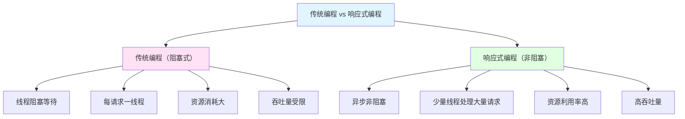

# 响应式编程(WebFlux)

> **学习目标**：掌握Spring WebFlux响应式编程
> **核心内容**：Reactor、Mono/Flux、WebFlux、R2DBC
> **预计时间**：5小时

## 响应式编程概述

### 什么是响应式编程



```java
/**
 * 响应式编程概念
 */
public class ReactiveProgrammingConcept {

    /*
    ╔═════════════════════════════════════════════════════════════════╗
    ║                    响应式编程核心概念                           ║
    ╠═════════════════════════════════════════════════════════════════╣
    ║                                                                ║
    ║ 1. 什么是响应式编程？                                            ║
    ║    - 异步编程范式                                                ║
    ║    - 基于数据流和变化传播                                        ║
    ║    - 非阻塞式I/O                                                 ║
    ║    - 函数式编程风格                                              ║
    ║                                                                ║
    ║ 2. 核心特性                                                      ║
    ║    ✅ 异步非阻塞                                                 ║
    ║    ✅ 背压（Backpressure）控制                                   ║
    ║    ✅ 声明式编程                                                 ║
    ║    ✅ 函数式组合                                                 ║
    ║                                                                ║
    ║ 3. 响应式流规范（Reactive Streams）                               ║
    ║    - Publisher（发布者）：发布数据流                              ║
    ║    - Subscriber（订阅者）：消费数据流                             ║
    ║    - Subscription（订阅）：控制数据流                             ║
    ║    - Processor（处理器）：转换数据流                              ║
    ║                                                                ║
    ║ 4. Reactor库                                                    ║
    ║    - Spring WebFlux默认使用                                       ║
    ║    - 实现Reactive Streams规范                                    ║
    ║    - 提供Mono（0-1个元素）和Flux（0-N个元素）                      ║
    ║                                                                ║
    ╚═════════════════════════════════════════════════════════════════╝
    */
}
```

### Spring MVC vs Spring WebFlux

```java
/**
 * Spring MVC vs WebFlux对比
 */
public class SpringMVCvsWebFlux {

    /*
    ╔═════════════════════════════════════════════════════════════════╗
    ║              Spring MVC vs Spring WebFlux                       ║
    ╠═════════════════════════════════════════════════════════════════╣
    ║ 特性            │ Spring MVC      │ Spring WebFlux              ║
    ╠═════════════════════════════════════════════════════════════════╣
    ║ 编程模型        │ 命令式          │ 响应式（函数式）             ║
    ║ I/O模型         │ 阻塞式          │ 非阻塞式                    ║
    ║ 线程模型        │ 每请求一线程    │ 少量线程（事件循环）         ║
    ║ 吞吐量          │ 中等            │ 高                          ║
    ║ 资源消耗        │ 高              │ 低                          ║
    ║ 依赖            │ Servlet API     │ Reactive Streams           ║
    ║ 容器            │ Tomcat/Jetty    │ Netty/Tomcat/Jetty         ║
    ║ 适用场景        │ 传统应用        │ 高并发、微服务              ║
    ║ 学习曲线        │ 低              │ 高                          ║
    ║ 生态系统        │ 成熟            │ 快速发展                    ║
    ╚═════════════════════════════════════════════════════════════════╝

    选择建议：
    ==========
    • 选择Spring MVC：
      - 团队不熟悉响应式编程
      - 已有大量Spring MVC代码
      - 阻塞式I/O足够满足需求
      - 使用JDBC、JPA等阻塞式API

    • 选择Spring WebFlux：
      - 需要高吞吐量、低延迟
      - 微服务架构
      - 流式数据处理
      - 使用响应式数据访问（R2DBC、MongoDB）
    */
}
```

## Reactor核心

### Maven依赖

```xml
<!-- pom.xml -->
<dependencies>
    <!-- Spring WebFlux -->
    <dependency>
        <groupId>org.springframework.boot</groupId>
        <artifactId>spring-boot-starter-webflux</artifactId>
    </dependency>

    <!-- Reactor Core -->
    <dependency>
        <groupId>io.projectreactor</groupId>
        <artifactId>reactor-core</artifactId>
    </dependency>

    <!-- Reactor Test（测试支持） -->
    <dependency>
        <groupId>io.projectreactor</groupId>
        <artifactId>reactor-test</artifactId>
        <scope>test</scope>
    </dependency>

    <!-- Lombok -->
    <dependency>
        <groupId>org.projectlombok</groupId>
        <artifactId>lombok</artifactId>
        <optional>true</optional>
    </dependency>
</dependencies>
```

### Mono基础

```java
package com.example.reactor.mono;

import reactor.core.publisher.Mono;
import java.time.Duration;

/**
 * Mono基础操作
 * Mono表示0-1个元素的异步序列
 */
public class MonoBasics {

    /**
     * 创建Mono
     */
    public void createMono() {
        // 1. just：包含具体值
        Mono<String> mono1 = Mono.just("Hello");

        // 2. empty：空Mono
        Mono<String> mono2 = Mono.empty();

        // 3. defer：延迟创建
        Mono<String> mono3 = Mono.defer(() -> Mono.just("Deferred"));

        // 4. fromSupplier：从Supplier创建
        Mono<String> mono4 = Mono.fromSupplier(() -> "Supplier");

        // 5. fromCallable：从Callable创建
        Mono<String> mono5 = Mono.fromCallable(() -> "Callable");

        // 6. fromRunnable：从Runnable创建
        Mono<Void> mono6 = Mono.fromRunnable(() -> System.out.println("Runnable"));

        // 7. using：资源管理
        Mono<String> mono7 = Mono.using(
            () -> new Resource(),      // 资源供应
            resource -> Mono.just(resource.getData()),  // 使用资源
            Resource::close           // 资源清理
        );
    }

    /**
     * Mono订阅
     */
    public void subscribeMono() {
        Mono<String> mono = Mono.just("Hello");

        // 1. 基本订阅
        mono.subscribe(
            value -> System.out.println("值：" + value),     // onNext
            error -> System.err.println("错误：" + error),   // onError
            () -> System.out.println("完成")                 // onComplete
        );

        // 2. 只订阅值
        mono.subscribe(value -> System.out.println("值：" + value));

        // 3. 只订阅完成
        mono.subscribe(
            null,
            null,
            () -> System.out.println("完成")
        );

        // 4. 订阅并执行操作（doOn系列）
        mono
            .doOnSubscribe(subscription -> System.out.println("订阅"))
            .doOnNext(value -> System.out.println("收到：" + value))
            .doOnSuccess(value -> System.out.println("成功：" + value))
            .doOnError(error -> System.err.println("错误：" + error))
            .doOnTerminate(() -> System.out.println("终止"))
            .doOnCancel(() -> System.out.println("取消"))
            .doFinally(signalType -> System.out.println("最终：" + signalType))
            .subscribe();
    }

    /**
     * Mono转换操作
     */
    public void transformMono() {
        Mono<String> mono = Mono.just("Hello");

        // 1. map：映射值
        Mono<Integer> mono1 = mono.map(String::length);

        // 2. flatMap：异步映射（返回新Mono）
        Mono<String> mono2 = mono.flatMap(value -> Mono.just(value + " World"));

        // 3. filter：过滤
        Mono<String> mono3 = mono.filter(value -> value.length() > 3);

        // 4. defaultIfEmpty：空值默认
        Mono<String> mono4 = mono.defaultIfEmpty("Default");

        // 5. switchIfEmpty：空值切换
        Mono<String> mono5 = mono.switchIfEmpty(Mono.just("Alternative"));

        // 6. cast：类型转换
        Mono<Object> mono6 = mono.cast(Object.class);

        // 7. handle：高级转换
        Mono<String> mono7 = mono.handle((value, sink) -> {
            if (value != null) {
                sink.next(value.toUpperCase());
            } else {
                sink.complete();
            }
        });
    }

    /**
     * Mono组合操作
     */
    public void combineMono() {
        Mono<String> mono1 = Mono.just("A");
        Mono<String> mono2 = Mono.just("B");
        Mono<String> mono3 = Mono.just("C");

        // 1. zip：组合多个Mono（元组）
        Mono<String> result1 = Mono.zip(mono1, mono2, mono3)
            .map(tuple -> tuple.getT1() + tuple.getT2() + tuple.getT3());

        // 2. zipWith：组合两个Mono
        Mono<String> result2 = mono1.zipWith(mono2)
            .map(tuple -> tuple.getT1() + tuple.getT2());

        // 3. merge：合并（按订阅顺序）
        Mono<String> result3 = Mono.first(mono1, mono2);

        // 4. delayElement：延迟发射
        Mono<String> result4 = mono1.delayElement(Duration.ofSeconds(1));

        // 5. race：竞争（先发射的获胜）
        Mono<String> result5 = mono1.race(mono2);

        // 6. then：忽略当前Mono，执行下一个
        Mono<String> result6 = mono1.then(mono2);

        // 7. thenEmpty：完成后返回空Mono
        Mono<Void> result7 = mono1.thenEmpty(Mono.empty());
    }

    /**
     * Mono错误处理
     */
    public void errorHandlingMono() {
        Mono<String> mono = Mono.error(new RuntimeException("Error"));

        // 1. onErrorReturn：错误时返回默认值
        Mono<String> result1 = mono.onErrorReturn("Default");

        // 2. onErrorResume：错误时切换
        Mono<String> result2 = mono.onErrorResume(error -> Mono.just("Fallback"));

        // 3. onErrorMap：错误转换
        Mono<String> result3 = mono.onErrorMap(error ->
            new IllegalStateException("Mapped", error));

        // 4. doOnError：错误时执行操作
        Mono<String> result4 = mono.doOnError(error ->
            System.err.println("错误：" + error.getMessage()));

        // 5. retry：重试
        Mono<String> result5 = mono.retry(3);

        // 6. retryWhen：条件重试
        Mono<String> result6 = mono.retryWhen(companion ->
            companion.zipWith(Flux.range(1, 3))
                .map(tuple -> {
                    if (tuple.getT2() < 3) return tuple.getT1();
                    throw new RuntimeException("重试次数耗尽");
                })
        );
    }

    /**
     * Mono工具操作
     */
    public void utilityMono() {
        Mono<String> mono = Mono.just("Hello");

        // 1. log：记录操作日志
        Mono<String> result1 = mono.log();

        // 2. cache：缓存结果
        Mono<String> result2 = mono.cache();

        // 3. cacheFlux：可配置缓存
        Mono<String> result3 = mono.cache(Duration.ofMinutes(5));

        // 4. timestamp：添加时间戳
        Mono<Tuple2<Long, String>> result4 = mono.timestamp();

        // 5. elapsed：计算耗时
        Mono<Tuple2<Long, String>> result5 = mono.elapsed();

        // 6. checkpoint：检查点（用于调试）
        Mono<String> result6 = mono.checkpoint("checkpoint");

        // 7. subscribeOn：指定订阅线程
        Mono<String> result7 = mono.subscribeOn(Schedulers.boundedElastic());

        // 8. publishOn：指定发布线程
        Mono<String> result8 = mono.publishOn(Schedulers.parallel());
    }

    // ==================== 辅助类 ====================

    static class Resource implements AutoCloseable {
        public String getData() {
            return "Data";
        }

        @Override
        public void close() {
            System.out.println("资源关闭");
        }
    }
}
```

### Flux基础

```java
package com.example.reactor.flux;

import reactor.core.publisher.Flux;
import java.time.Duration;
import java.util.Arrays;
import java.util.List;

/**
 * Flux基础操作
 * Flux表示0-N个元素的异步序列
 */
public class FluxBasics {

    /**
     * 创建Flux
     */
    public void createFlux() {
        // 1. just：包含多个值
        Flux<String> flux1 = Flux.just("A", "B", "C");

        // 2. fromIterable：从Iterable创建
        List<String> list = Arrays.asList("A", "B", "C");
        Flux<String> flux2 = Flux.fromIterable(list);

        // 3. fromArray：从数组创建
        String[] array = {"A", "B", "C"};
        Flux<String> flux3 = Flux.fromArray(array);

        // 4. range：创建范围
        Flux<Integer> flux4 = Flux.range(1, 10);

        // 5. interval：创建间隔序列
        Flux<Long> flux5 = Flux.interval(Duration.ofSeconds(1));

        // 6. empty：空Flux
        Flux<String> flux6 = Flux.empty();

        // 7. never：永不发射
        Flux<String> flux7 = Flux.never();

        // 8. generate：编程式生成
        Flux<String> flux8 = Flux.generate(
            () -> 0,
            (state, sink) -> {
                sink.next("Value" + state);
                if (state == 10) sink.complete();
                return state + 1;
            }
        );

        // 9. create：手动发射
        Flux<String> flux9 = Flux.create(sink -> {
            sink.next("A");
            sink.next("B");
            sink.next("C");
            sink.complete();
        });
    }

    /**
     * Flux过滤操作
     */
    public void filterFlux() {
        Flux<Integer> flux = Flux.range(1, 10);

        // 1. filter：过滤元素
        Flux<Integer> result1 = flux.filter(i -> i % 2 == 0);

        // 2. distinct：去重
        Flux<Integer> result2 = flux.distinct();

        // 3. take：取前N个
        Flux<Integer> result3 = flux.take(3);

        // 4. takeLast：取最后N个
        Flux<Integer> result4 = flux.takeLast(3);

        // 5. skip：跳过前N个
        Flux<Integer> result5 = flux.skip(3);

        // 6. skipLast：跳过最后N个
        Flux<Integer> result6 = flux.skipLast(3);

        // 7. takeUntil：取到满足条件为止
        Flux<Integer> result7 = flux.takeUntil(i -> i > 5);

        // 8. takeWhile：取满足条件的元素
        Flux<Integer> result8 = flux.takeWhile(i -> i <= 5);

        // 9. elementAt：取指定位置元素
        Mono<Integer> result9 = flux.elementAt(5);

        // 10. single：期望只有一个元素
        Mono<Integer> result10 = flux.single();
    }

    /**
     * Flux转换操作
     */
    public void transformFlux() {
        Flux<Integer> flux = Flux.range(1, 5);

        // 1. map：映射每个元素
        Flux<String> result1 = flux.map(i -> "Number" + i);

        // 2. flatMap：异步映射（交错发射）
        Flux<String> result2 = flux.flatMap(i ->
            Flux.just(i + "a", i + "b"));

        // 3. flatMapSequential：顺序flatmap
        Flux<String> result3 = flux.flatMapSequential(i ->
            Flux.just(i + "a", i + "b"));

        // 4. concatMap：连接式flatMap
        Flux<String> result4 = flux.concatMap(i ->
            Flux.just(i + "a", i + "b"));

        // 5. switchMap：切换式flatMap（取消前一个）
        Flux<String> result5 = flux.switchMap(i ->
            Flux.interval(Duration.ofMillis(100))
                .map(tick -> i + ":" + tick));

        // 6. scan：累加
        Flux<Integer> result6 = flux.scan(0, (acc, value) -> acc + value);

        // 7. groupBy：分组
        Flux<GroupedFlux<String, Integer>> result7 = flux.groupBy(i ->
            i % 2 == 0 ? "EVEN" : "ODD");

        // 8. buffer：缓冲为List
        Flux<List<Integer>> result8 = flux.buffer(3);

        // 9. bufferTimeout：时间或数量缓冲
        Flux<List<Integer>> result9 = flux.bufferTimeout(10, Duration.ofSeconds(1));

        // 10. window：窗口（发射Flux）
        Flux<Flux<Integer>> result10 = flux.window(3);
    }

    /**
     * Flux组合操作
     */
    public void combineFlux() {
        Flux<Integer> flux1 = Flux.just(1, 2, 3);
        Flux<Integer> flux2 = Flux.just(4, 5, 6);
        Flux<Integer> flux3 = Flux.just(7, 8, 9);

        // 1. merge：合并（交错）
        Flux<Integer> result1 = Flux.merge(flux1, flux2, flux3);

        // 2. mergeSequential：顺序合并
        Flux<Integer> result2 = Flux.mergeSequential(flux1, flux2, flux3);

        // 3. concat：连接（顺序）
        Flux<Integer> result3 = Flux.concat(flux1, flux2, flux3);

        // 4. zip：组合（元组）
        Flux<Integer> result4 = Flux.zip(flux1, flux2, flux3)
            .map(tuple -> tuple.getT1() + tuple.getT2() + tuple.getT3());

        // 5. zipWith：组合两个
        Flux<String> result5 = flux1.zipWith(flux2)
            .map(tuple -> tuple.getT1() + ":" + tuple.getT2());

        // 6. combineLatest：组合最新值
        Flux<Integer> result6 = Flux.combineLatest(flux1, flux2, (v1, v2) -> v1 + v2);

        // 7. amb：竞争（先发射的获胜）
        Flux<Integer> result7 = flux1.amb(flux2);

        // 8. startWith：添加前缀
        Flux<Integer> result8 = flux1.startWith(0);

        // 9. appendWith：添加后缀
        Flux<Integer> result9 = flux1.appendWith(4);
    }

    /**
     * Flux数学操作
     */
    public void mathFlux() {
        Flux<Integer> flux = Flux.range(1, 10);

        // 1. count：计数
        Mono<Long> result1 = flux.count();

        // 2. sum：求和
        Mono<Integer> result2 = flux.sum(Integer::intValue);

        // 3. average：平均值
        Mono<Double> result3 = flux.average(Integer::intValue);

        // 4. min：最小值
        Mono<Integer> result4 = flux.min(Integer::compareTo);

        // 5. max：最大值
        Mono<Integer> result5 = flux.max(Integer::compareTo);

        // 6. all：所有元素满足条件
        Mono<Boolean> result6 = flux.all(i -> i > 0);

        // 7. any：任意元素满足条件
        Mono<Boolean> result7 = flux.any(i -> i == 5);

        // 8. hasElement：包含元素
        Mono<Boolean> result8 = flux.hasElement(5);

        // 9. hasElements：是否有元素
        Mono<Boolean> result9 = flux.hasElements();
    }

    /**
     * Flux收集操作
     */
    public void collectFlux() {
        Flux<String> flux = Flux.just("A", "B", "C");

        // 1. collectList：收集为List
        Mono<List<String>> result1 = flux.collectList();

        // 2. collectMap：收集为Map
        Mono<Map<String, String>> result2 = flux.collectMap(
            s -> s,        // key mapper
            s -> s         // value mapper
        );

        // 3. collectMultimap：收集为MultiMap
        Mono<Map<Integer, List<String>>> result3 = flux.collectMultimap(
            s -> s.length(),
            s -> s
        );

        // 4. collectSortedList：排序收集
        Mono<List<String>> result4 = flux.collectSortedList(String::compareTo);

        // 5. collectSet：收集为Set
        Mono<Set<String>> result5 = flux.collectSet();

        // 6. toIterable：转换为Iterable
        Iterable<String> result6 = flux.toIterable();

        // 7. toStream：转换为Stream
        Stream<String> result7 = flux.toStream();
    }

    /**
     * Flux时间操作
     */
    public void timeFlux() {
        Flux<Integer> flux = Flux.range(1, 10);

        // 1. delayElements：延迟发射每个元素
        Flux<Integer> result1 = flux.delayElements(Duration.ofMillis(100));

        // 2. delaySubscription：延迟订阅
        Flux<Integer> result2 = flux.delaySubscription(Duration.ofSeconds(1));

        // 3. throttle：限流
        Flux<Integer> result3 = flux.throttle(10);  // 最多10个元素

        // 4. sample：采样
        Flux<Integer> result4 = flux.sample(Duration.ofSeconds(1));

        // 5. timeout：超时
        Flux<Integer> result5 = flux.timeout(Duration.ofSeconds(5));

        // 6. interval：固定间隔发射
        Flux<Long> result6 = Flux.interval(Duration.ofSeconds(1));

        // 7. elapsed：计算时间差
        Flux<Tuple2<Long, Integer>> result7 = flux.elapsed();
    }
}
```

## Spring WebFlux

### WebFlux配置

```yaml
# application.yml
spring:
  application:
    name: webflux-demo

  # WebFlux配置
  webflux:
    base-path: /api

server:
  port: 8080
  # 使用Netty（默认）
  # netty默认使用reactor-netty
```

### WebFlux控制器

```java
package com.example.webflux.controller;

import com.example.webflux.entity.User;
import com.example.webflux.service.UserService;
import lombok.extern.slf4j.Slf4j;
import org.springframework.beans.factory.annotation.Autowired;
import org.springframework.web.bind.annotation.*;
import reactor.core.publisher.Flux;
import reactor.core.publisher.Mono;

/**
 * 响应式REST控制器
 */
@Slf4j
@RestController
@RequestMapping("/users")
public class UserController {

    @Autowired
    private UserService userService;

    /**
     * 获取所有用户
     * GET /users
     */
    @GetMapping
    public Flux<User> getAllUsers() {
        log.info("获取所有用户");
        return userService.findAll()
                .doOnComplete(() -> log.info("用户列表获取完成"));
    }

    /**
     * 获取单个用户
     * GET /users/{id}
     */
    @GetMapping("/{id}")
    public Mono<User> getUserById(@PathVariable Long id) {
        log.info("获取用户：{}", id);
        return userService.findById(id)
                .doOnNext(user -> log.info("用户：{}", user))
                .switchIfEmpty(Mono.error(new RuntimeException("用户不存在")));
    }

    /**
     * 创建用户
     * POST /users
     */
    @PostMapping
    public Mono<User> createUser(@RequestBody Mono<User> userMono) {
        log.info("创建用户");
        return userMono.flatMap(userService::save)
                .doOnSuccess(user -> log.info("用户创建成功：{}", user));
    }

    /**
     * 更新用户
     * PUT /users/{id}
     */
    @PutMapping("/{id}")
    public Mono<User> updateUser(
            @PathVariable Long id,
            @RequestBody Mono<User> userMono) {
        log.info("更新用户：{}", id);
        return userMono.flatMap(user -> userService.update(id, user))
                .doOnSuccess(user -> log.info("用户更新成功：{}", user));
    }

    /**
     * 删除用户
     * DELETE /users/{id}
     */
    @DeleteMapping("/{id}")
    public Mono<Void> deleteUser(@PathVariable Long id) {
        log.info("删除用户：{}", id);
        return userService.deleteById(id)
                .doOnSuccess(v -> log.info("用户删除成功：{}", id));
    }

    /**
     * 流式响应（Server-Sent Events）
     * GET /users/stream
     */
    @GetMapping(value = "/stream", produces = org.springframework.http.MediaType.TEXT_EVENT_STREAM_VALUE)
    public Flux<User> streamUsers() {
        log.info("流式返回用户");
        return userService.findAll()
                .delayElements(java.time.Duration.ofSeconds(1));
    }
}
```

### WebFlux函数式端点

```java
package com.example.webflux.config;

import com.example.webflux.entity.User;
import com.example.webflux.handler.UserHandler;
import org.springframework.context.annotation.Bean;
import org.springframework.context.annotation.Configuration;
import org.springframework.web.reactive.function.server.*;

/**
 * WebFlux路由配置
 */
@Configuration
public class RouterConfig {

    @Bean
    public RouterFunction<ServerResponse> userRoutes(UserHandler userHandler) {
        return RouterFunctions.route()
                // GET /users - 获取所有用户
                .GET("/users", userHandler::findAll)

                // GET /users/{id} - 获取单个用户
                .GET("/users/{id}", userHandler::findById)

                // POST /users - 创建用户
                .POST("/users", userHandler::save)

                // PUT /users/{id} - 更新用户
                .PUT("/users/{id}", userHandler::update)

                // DELETE /users/{id} - 删除用户
                .DELETE("/users/{id}", userHandler::delete)

                // 构建路由
                .build();
    }
}
```

```java
package com.example.webflux.handler;

import com.example.webflux.entity.User;
import com.example.webflux.service.UserService;
import lombok.extern.slf4j.Slf4j;
import org.springframework.beans.factory.annotation.Autowired;
import org.springframework.stereotype.Component;
import org.springframework.web.reactive.function.server.*;
import reactor.core.publisher.Mono;

/**
 * 用户处理器
 */
@Slf4j
@Component
public class UserHandler {

    @Autowired
    private UserService userService;

    /**
     * 获取所有用户
     */
    public Mono<ServerResponse> findAll(ServerRequest request) {
        log.info("获取所有用户");
        return ServerResponse.ok()
                .body(userService.findAll(), User.class);
    }

    /**
     * 获取单个用户
     */
    public Mono<ServerResponse> findById(ServerRequest request) {
        Long id = Long.valueOf(request.pathVariable("id"));
        log.info("获取用户：{}", id);

        return userService.findById(id)
                .flatMap(user -> ServerResponse.ok().bodyValue(user))
                .switchIfEmpty(ServerResponse.notFound().build());
    }

    /**
     * 创建用户
     */
    public Mono<ServerResponse> save(ServerRequest request) {
        log.info("创建用户");

        return request.bodyToMono(User.class)
                .flatMap(userService::save)
                .flatMap(user -> ServerResponse.ok().bodyValue(user));
    }

    /**
     * 更新用户
     */
    public Mono<ServerResponse> update(ServerRequest request) {
        Long id = Long.valueOf(request.pathVariable("id"));
        log.info("更新用户：{}", id);

        return request.bodyToMono(User.class)
                .flatMap(user -> userService.update(id, user))
                .flatMap(user -> ServerResponse.ok().bodyValue(user))
                .switchIfEmpty(ServerResponse.notFound().build());
    }

    /**
     * 删除用户
     */
    public Mono<ServerResponse> delete(ServerRequest request) {
        Long id = Long.valueOf(request.pathVariable("id"));
        log.info("删除用户：{}", id);

        return userService.deleteById(id)
                .then(ServerResponse.ok().build());
    }
}
```

## R2DBC响应式数据库

### R2DBC配置

```xml
<!-- pom.xml -->
<dependencies>
    <!-- R2DBC MySQL -->
    <dependency>
        <groupId>dev.miku</groupId>
        <artifactId>r2dbc-mysql</artifactId>
    </dependency>

    <!-- R2DBC Pool -->
    <dependency>
        <groupId>io.r2dbc</groupId>
        <artifactId>r2dbc-pool</artifactId>
    </dependency>

    <!-- Spring Data R2DBC -->
    <dependency>
        <groupId>org.springframework.boot</groupId>
        <artifactId>spring-boot-starter-data-r2dbc</artifactId>
    </dependency>

    <!-- Lombok -->
    <dependency>
        <groupId>org.projectlombok</groupId>
        <artifactId>lombok</artifactId>
    </dependency>
</dependencies>
```

```yaml
# application.yml
spring:
  r2dbc:
    url: r2dbc:mysql://localhost:3306/mydb
    username: root
    password: password
    pool:
      enabled: true
      initial-size: 5
      max-size: 20
      max-idle-time: 30m

  # 数据初始化
  sql:
    init:
      mode: always
      schema-locations: classpath:schema.sql
      data-locations: classpath:data.sql
```

### R2DBC实体类

```java
package com.example.webflux.entity;

import lombok.Data;
import org.springframework.data.annotation.Id;
import org.springframework.data.relational.core.mapping.Table;

import java.time.LocalDateTime;

/**
 * 用户实体
 */
@Data
@Table("users")
public class User {

    @Id
    private Long id;

    private String username;

    private String email;

    private Integer age;

    private LocalDateTime createTime;

    private LocalDateTime updateTime;
}
```

### R2DBC Repository

```java
package com.example.webflux.repository;

import com.example.webflux.entity.User;
import org.springframework.data.r2dbc.repository.R2dbcRepository;
import org.springframework.stereotype.Repository;
import reactor.core.publisher.Flux;

/**
 * 用户Repository
 */
@Repository
public interface UserRepository extends R2dbcRepository<User, Long> {

    /**
     * 根据用户名查询
     */
    Flux<User> findByUsername(String username);

    /**
     * 根据年龄范围查询
     */
    Flux<User> findByAgeBetween(Integer min, Integer max);

    /**
     * 根据邮箱查询
     */
    Flux<User> findByEmail(String email);
}
```

### R2DBC Service

```java
package com.example.webflux.service;

import com.example.webflux.entity.User;
import com.example.webflux.repository.UserRepository;
import lombok.extern.slf4j.Slf4j;
import org.springframework.beans.factory.annotation.Autowired;
import org.springframework.stereotype.Service;
import reactor.core.publisher.Flux;
import reactor.core.publisher.Mono;

/**
 * 用户服务
 */
@Slf4j
@Service
public class UserService {

    @Autowired
    private UserRepository userRepository;

    /**
     * 查询所有用户
     */
    public Flux<User> findAll() {
        return userRepository.findAll()
                .doOnComplete(() -> log.info("查询所有用户完成"));
    }

    /**
     * 根据ID查询用户
     */
    public Mono<User> findById(Long id) {
        return userRepository.findById(id)
                .doOnNext(user -> log.info("查询用户：{}", user));
    }

    /**
     * 保存用户
     */
    public Mono<User> save(User user) {
        return userRepository.save(user)
                .doOnSuccess(saved -> log.info("用户保存成功：{}", saved));
    }

    /**
     * 更新用户
     */
    public Mono<User> update(Long id, User user) {
        return findById(id)
                .flatMap(existingUser -> {
                    // 更新字段
                    existingUser.setUsername(user.getUsername());
                    existingUser.setEmail(user.getEmail());
                    existingUser.setAge(user.getAge());
                    return userRepository.save(existingUser);
                })
                .doOnSuccess(updated -> log.info("用户更新成功：{}", updated));
    }

    /**
     * 删除用户
     */
    public Mono<Void> deleteById(Long id) {
        return userRepository.deleteById(id)
                .doOnSuccess(v -> log.info("用户删除成功：{}", id));
    }

    /**
     * 根据用户名查询
     */
    public Flux<User> findByUsername(String username) {
        return userRepository.findByUsername(username);
    }

    /**
     * 根据年龄范围查询
     */
    public Flux<User> findByAgeBetween(Integer min, Integer max) {
        return userRepository.findByAgeBetween(min, max);
    }

    /**
     * 批量保存
     */
    public Flux<User> saveAll(Flux<User> users) {
        return userRepository.saveAll(users)
                .doOnComplete(() -> log.info("批量保存完成"));
    }

    /**
     * 事务操作
     */
    public Mono<User> transactionalSave(User user) {
        return userRepository.save(user)
                .flatMap(saved -> {
                    // 其他数据库操作
                    return Mono.just(saved);
                })
                .as(transactionalOperator::transactional);
    }

    @Autowired
    private org.springframework.transaction.reactive.TransactionalOperator transactionalOperator;
}
```

### R2DBC自定义查询

```java
package com.example.webflux.repository;

import com.example.webflux.entity.User;
import io.r2dbc.spi.ConnectionFactory;
import org.springframework.r2dbc.core.DatabaseClient;
import org.springframework.stereotype.Repository;
import reactor.core.publisher.Flux;
import reactor.core.publisher.Mono;

/**
 * 自定义Repository
 */
@Repository
public class UserCustomRepository {

    private final DatabaseClient databaseClient;

    public UserCustomRepository(DatabaseClient databaseClient) {
        this.databaseClient = databaseClient;
    }

    /**
     * 原生SQL查询
     */
    public Flux<User> findByNativeQuery(String username) {
        String sql = "SELECT * FROM users WHERE username LIKE :username";

        return databaseClient.sql(sql)
                .bind("username", "%" + username + "%")
                .map(row -> new User(
                    row.get("id", Long.class),
                    row.get("username", String.class),
                    row.get("email", String.class),
                    row.get("age", Integer.class)
                ))
                .all();
    }

    /**
     * 统计查询
     */
    public Mono<Long> countByAge(Integer age) {
        String sql = "SELECT COUNT(*) FROM users WHERE age = :age";

        return databaseClient.sql(sql)
                .bind("age", age)
                .mapRow((row, metadata) -> row.get(0, Long.class))
                .one();
    }

    /**
     * 更新操作
     */
    public Mono<Integer> updateEmail(Long id, String email) {
        String sql = "UPDATE users SET email = :email WHERE id = :id";

        return databaseClient.sql(sql)
                .bind("email", email)
                .bind("id", id)
                .fetch()
                .rowsUpdated();
    }
}
```

## 响应式最佳实践

### 响应式编程最佳实践

```java
/**
 * 响应式编程最佳实践
 */
public class ReactiveBestPractices {

    /*
    ╔═════════════════════════════════════════════════════════════════╗
    ║                    响应式编程最佳实践                           ║
    ╠═════════════════════════════════════════════════════════════════╣
    ║                                                                ║
    ║ 1. 线程调度                                                      ║
    ║    ✅ 使用subscribeOn指定订阅线程                                ║
    ║    ✅ 使用publishOn指定处理线程                                  ║
    ║    ✅ Schedulers.boundedElastic()：I/O操作                        ║
    ║    ✅ Schedulers.parallel()：CPU密集操作                          ║
    ║    ✅ Schedulers.single()：单线程                                 ║
    ║                                                                ║
    ║ 2. 错误处理                                                      ║
    ║    ✅ 始终处理onError                                            ║
    ║    ✅ 使用onErrorResume提供降级                                  ║
    ║    ✅ 使用retry重试                                              ║
    ║    ✅ 避免在操作符中抛异常                                        ║
    ║                                                                ║
    ║ 3. 背压处理                                                      ║
    ║    ✅ 使用buffer缓冲                                             ║
    ║    ✅ 使用limit限流                                              ║
    ║    ✅ 使用sample采样                                              ║
    ║    ✅ 避免内存溢出                                                ║
    ║                                                                ║
    ║ 4. 资源管理                                                      ║
    ║    ✅ 使用using管理资源                                          ║
    ║    ✅ 及时释放连接                                                ║
    ║    ✅ 使用cache缓存结果                                           ║
    ║                                                                ║
    ║ 5. 操作符选择                                                    ║
    ║    ✅ map用于简单转换                                            ║
    ║    ✅ flatMap用于异步操作                                        ║
    ║    ✅ filter用于过滤                                              ║
    ║    ✅ zip用于组合                                                ║
    ║    ✅ 了解各种操作符特性                                          ║
    ║                                                                ║
    ║ 6. 调试                                                          ║
    ║    ✅ 使用log()记录日志                                          ║
    ║    ✅ 使用checkpoint()添加检查点                                 ║
    ║    ✅ 使用Hooks调试                                              ║
    ║    ✅ 启用Reactors调试模式                                        ║
    ║                                                                ║
    ║ 7. 性能优化                                                      ║
    ║    ✅ 避免阻塞操作                                                ║
    ║    ✅ 使用响应式数据库（R2DBC）                                   ║
    ║    ✅ 使用响应式WebClient                                       ║
    ║    ✅ 合理使用缓存                                                ║
    ║                                                                ║
    ║ 8. 测试                                                          ║
    ║    ✅ 使用StepVerifier测试                                       ║
    ║    ✅ 测试正常流程                                                ║
    ║    ✅ 测试错误情况                                                ║
    ║    ✅ 测试时间相关操作                                            ║
    ║                                                                ║
    ╚═════════════════════════════════════════════════════════════════╝
    */
}
```

### 避坑指南

```java
/**
 * 响应式编程避坑指南
 */
public class ReactivePitfalls {

    /*
    常见错误：
    ==========

    1. 阻塞操作
    ----------
    错误：在响应式流中使用阻塞代码
    ❌ Mono.fromCallable(() -> Thread.sleep(1000))

    正确：使用响应式API
    ✅ Mono.delay(Duration.ofMillis(1000))

    2. 忘记订阅
    ----------
    错误：只创建Publisher不订阅
    ❌ Mono.just("Hello").map(String::toUpperCase)

    正确：添加订阅
    ✅ Mono.just("Hello")
       .map(String::toUpperCase)
       .subscribe()

    3. 未处理错误
    ----------
    错误：没有错误处理
    ❌ mono.subscribe()

    正确：添加错误处理
    ✅ mono.subscribe(
           value -> System.out.println(value),
           error -> System.err.println(error)
       )

    4. 混用阻塞和响应式
    ------------------
    错误：在响应式流中调用阻塞API
    ❌ mono.flatMap(v -> blockingMethod())

    正确：使用响应式包装
    ✅ mono.flatMap(v ->
           Mono.fromCallable(() -> blockingMethod())
               .subscribeOn(Schedulers.boundedElastic())
       )

    5. 过早订阅
    ----------
    错误：在组合操作前订阅
    ❌ mono1.subscribe(); mono2.zipWith(mono1)

    正确：先组合再订阅
    ✅ mono2.zipWith(mono1).subscribe()

    6. 不必要的包装
    --------------
    错误：重复包装
    ❌ Mono.just(Mono.just(value))

    正确：直接使用
    ✅ Mono.just(value)

    7. 忽略返回值
    --------------
    错误：不处理Mono/Flux返回值
    ❌ public Mono<Void> save() {
           return repository.save(user);
           // 错误：未完成Mono
       }

    正确：链式调用
    ✅ public Mono<Void> save() {
           return repository.save(user).then();
       }
    */
}
```

## 实战练习

### 练习1：响应式CRUD

```java
/*
需求：
1. 实现用户CRUD接口
2. 使用R2DBC访问数据库
3. 实现流式数据返回
4. 添加错误处理
5. 添加日志记录

技术要求：
- Spring WebFlux
- R2DBC MySQL
- Lombok
- 响应式编程

实现步骤：
1. 配置R2DBC连接
2. 创建实体类和Repository
3. 实现Service层
4. 实现Controller层
5. 添加错误处理
6. 编写单元测试
*/
```

### 练习2：响应式API网关

```java
/*
需求：
1. 聚合多个服务数据
2. 实现超时控制
3. 实现降级策略
4. 实现限流
5. 监控和日志

技术要求：
- Spring WebFlux
- WebClient
- Resilience4j
- Actuator

实现步骤：
1. 创建WebClient Bean
2. 实现聚合服务
3. 添加超时和重试
4. 添加降级逻辑
5. 集成监控指标
*/
```

## 本章小结

### 学习成果检查

✅ **响应式编程基础**：Reactor、Mono、Flux
✅ **Reactor核心**：创建、转换、过滤、组合
✅ **WebFlux**：注解式、函数式端点
✅ **R2DBC**：响应式数据库访问
✅ **错误处理**：onErrorResume、retry
✅ **背压处理**：buffer、limit、sample
✅ **线程调度**：subscribeOn、publishOn
✅ **最佳实践**：性能优化、避坑指南

### 核心技术点

- **Mono**：0-1个元素的异步序列
- **Flux**：0-N个元素的异步序列
- **WebFlux**：响应式Web框架
- **R2DBC**：响应式数据库访问
- **Schedulers**：线程调度
- **backpressure**：背压控制

### 下一步学习

- **第22章**：消息队列（RabbitMQ/Kafka）
- **第23章**：Spring Cloud Gateway网关
- **第24章**：定时任务与异步处理

---

**学习时间**：约5小时
**难度等级**：★★★★☆
**重要程度**：★★★★☆（高并发场景必学）
