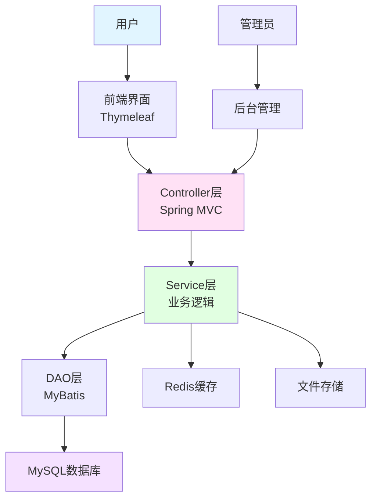
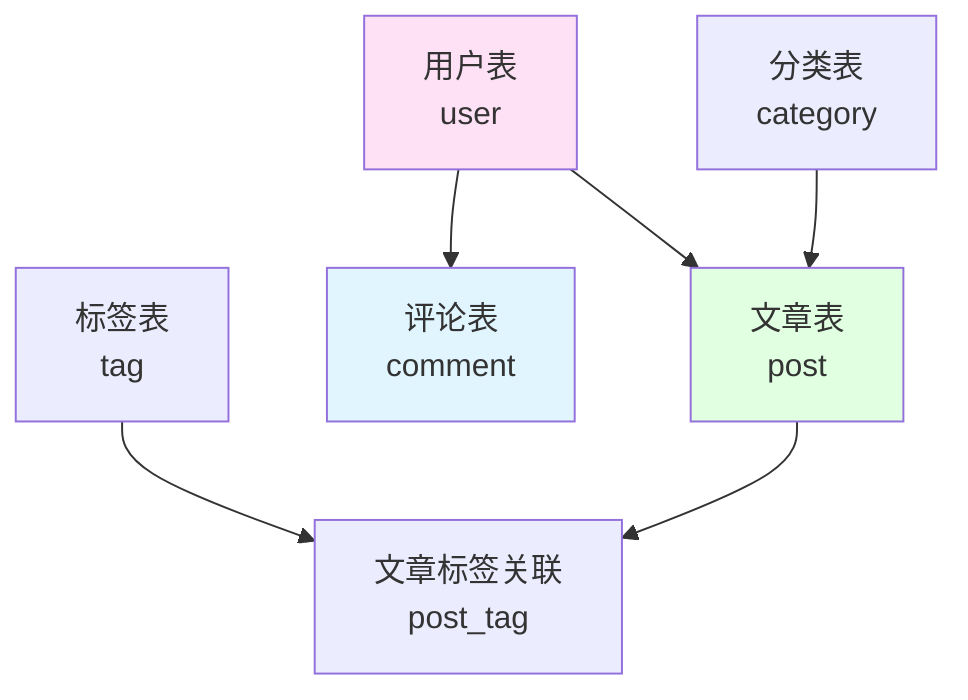

# 实战项目1：个人博客系统

> **学习目标**：综合运用所学知识开发完整项目
> **核心内容**：项目架构、功能实现、前后端交互、部署上线
> **预计时间**：8小时

## 项目概述

### 项目简介

开发一个功能完整的个人博客系统，包含文章管理、用户管理、评论系统、标签分类等功能。



### 技术栈

- **后端框架**：Spring Boot 3.2
- **ORM框架**：MyBatis
- **模板引擎**：Thymeleaf
- **数据库**：MySQL 8.0
- **缓存**：Redis
- **前端**：HTML5 + CSS3 + Bootstrap 5
- **构建工具**：Maven

### 功能模块

```java
/**
 * 博客系统功能模块
 */
public class BlogFeatures {
    public static void main(String[] args) {
        System.out.println("=== 个人博客系统功能模块 ===\n");

        System.out.println("1. 用户模块：");
        System.out.println("   - 用户注册/登录");
        System.out.println("   - 个人信息管理");
        System.out.println("   - 密码修改");
        System.out.println("   - 权限管理（管理员/普通用户）\n");

        System.out.println("2. 文章模块：");
        System.out.println("   - 文章发布");
        System.out.println("   - 文章编辑");
        System.out.println("   - 文章删除");
        System.out.println("   - 文章浏览");
        System.out.println("   - 文章搜索");
        System.out.println("   - Markdown编辑器\n");

        System.out.println("3. 分类/标签模块：");
        System.out.println("   - 分类管理");
        System.out.println("   - 标签管理");
        System.out.println("   - 按分类/标签筛选\n");

        System.out.println("4. 评论模块：");
        System.out.println("   - 发表评论");
        System.out.println("   - 回复评论");
        System.out.println("   - 评论管理\n");

        System.out.println("5. 管理后台：");
        System.out.println("   - 文章管理");
        System.out.println("   - 用户管理");
        System.out.println("   - 评论管理");
        System.out.println("   - 系统设置\n");

        System.out.println("6. 其他功能：");
        System.out.println("   - 文章归档");
        System.out.println("   - 友情链接");
        System.out.println("   - 访问统计");
        System.out.println("   - RSS订阅");
    }
}
```

## 数据库设计

### ER图



### 数据库表结构

```sql
-- 用户表
CREATE TABLE `user` (
  `id` INT PRIMARY KEY AUTO_INCREMENT COMMENT '用户ID',
  `username` VARCHAR(50) NOT NULL UNIQUE COMMENT '用户名',
  `password` VARCHAR(100) NOT NULL COMMENT '密码',
  `email` VARCHAR(100) NOT NULL UNIQUE COMMENT '邮箱',
  `nickname` VARCHAR(50) COMMENT '昵称',
  `avatar` VARCHAR(255) COMMENT '头像URL',
  `role` VARCHAR(20) DEFAULT 'USER' COMMENT '角色：ADMIN/USER',
  `status` TINYINT DEFAULT 1 COMMENT '状态：0-禁用，1-正常',
  `create_time` DATETIME DEFAULT CURRENT_TIMESTAMP COMMENT '创建时间',
  `update_time` DATETIME DEFAULT CURRENT_TIMESTAMP ON UPDATE CURRENT_TIMESTAMP COMMENT '更新时间',
  INDEX `idx_username` (`username`),
  INDEX `idx_email` (`email`)
) ENGINE=InnoDB DEFAULT CHARSET=utf8mb4 COMMENT='用户表';

-- 分类表
CREATE TABLE `category` (
  `id` INT PRIMARY KEY AUTO_INCREMENT COMMENT '分类ID',
  `name` VARCHAR(50) NOT NULL COMMENT '分类名称',
  `description` VARCHAR(200) COMMENT '分类描述',
  `sort_order` INT DEFAULT 0 COMMENT '排序',
  `create_time` DATETIME DEFAULT CURRENT_TIMESTAMP COMMENT '创建时间'
) ENGINE=InnoDB DEFAULT CHARSET=utf8mb4 COMMENT='分类表';

-- 标签表
CREATE TABLE `tag` (
  `id` INT PRIMARY KEY AUTO_INCREMENT COMMENT '标签ID',
  `name` VARCHAR(50) NOT NULL UNIQUE COMMENT '标签名称',
  `create_time` DATETIME DEFAULT CURRENT_TIMESTAMP COMMENT '创建时间'
) ENGINE=InnoDB DEFAULT CHARSET=utf8mb4 COMMENT='标签表';

-- 文章表
CREATE TABLE `post` (
  `id` INT PRIMARY KEY AUTO_INCREMENT COMMENT '文章ID',
  `title` VARCHAR(200) NOT NULL COMMENT '文章标题',
  `summary` VARCHAR(500) COMMENT '文章摘要',
  `content` MEDIUMTEXT NOT NULL COMMENT '文章内容',
  `cover_image` VARCHAR(255) COMMENT '封面图',
  `author_id` INT NOT NULL COMMENT '作者ID',
  `category_id` INT COMMENT '分类ID',
  `view_count` INT DEFAULT 0 COMMENT '浏览次数',
  `comment_count` INT DEFAULT 0 COMMENT '评论数',
  `status` TINYINT DEFAULT 1 COMMENT '状态：0-草稿，1-发布，2-下架',
  `is_top` TINYINT DEFAULT 0 COMMENT '是否置顶',
  `create_time` DATETIME DEFAULT CURRENT_TIMESTAMP COMMENT '创建时间',
  `update_time` DATETIME DEFAULT CURRENT_TIMESTAMP ON UPDATE CURRENT_TIMESTAMP COMMENT '更新时间',
  FOREIGN KEY (`author_id`) REFERENCES `user`(`id`),
  FOREIGN KEY (`category_id`) REFERENCES `category`(`id`),
  INDEX `idx_author` (`author_id`),
  INDEX `idx_category` (`category_id`),
  INDEX `idx_create_time` (`create_time`),
  INDEX `idx_status` (`status`)
) ENGINE=InnoDB DEFAULT CHARSET=utf8mb4 COMMENT='文章表';

-- 文章标签关联表
CREATE TABLE `post_tag` (
  `post_id` INT NOT NULL COMMENT '文章ID',
  `tag_id` INT NOT NULL COMMENT '标签ID',
  PRIMARY KEY (`post_id`, `tag_id`),
  FOREIGN KEY (`post_id`) REFERENCES `post`(`id`) ON DELETE CASCADE,
  FOREIGN KEY (`tag_id`) REFERENCES `tag`(`id`) ON DELETE CASCADE
) ENGINE=InnoDB DEFAULT CHARSET=utf8mb4 COMMENT='文章标签关联表';

-- 评论表
CREATE TABLE `comment` (
  `id` INT PRIMARY KEY AUTO_INCREMENT COMMENT '评论ID',
  `post_id` INT NOT NULL COMMENT '文章ID',
  `user_id` INT NOT NULL COMMENT '评论用户ID',
  `parent_id` INT DEFAULT 0 COMMENT '父评论ID（0表示一级评论）',
  `content` TEXT NOT NULL COMMENT '评论内容',
  `status` TINYINT DEFAULT 1 COMMENT '状态：0-待审核，1-已通过',
  `create_time` DATETIME DEFAULT CURRENT_TIMESTAMP COMMENT '创建时间',
  FOREIGN KEY (`post_id`) REFERENCES `post`(`id`) ON DELETE CASCADE,
  FOREIGN KEY (`user_id`) REFERENCES `user`(`id`),
  INDEX `idx_post` (`post_id`),
  INDEX `idx_user` (`user_id`)
) ENGINE=InnoDB DEFAULT CHARSET=utf8mb4 COMMENT='评论表';

-- 友情链接表
CREATE TABLE `link` (
  `id` INT PRIMARY KEY AUTO_INCREMENT COMMENT '链接ID',
  `name` VARCHAR(50) NOT NULL COMMENT '网站名称',
  `url` VARCHAR(255) NOT NULL COMMENT '网站URL',
  `logo` VARCHAR(255) COMMENT 'LogoURL',
  `description` VARCHAR(200) COMMENT '描述',
  `sort_order` INT DEFAULT 0 COMMENT '排序',
  `create_time` DATETIME DEFAULT CURRENT_TIMESTAMP COMMENT '创建时间'
) ENGINE=InnoDB DEFAULT CHARSET=utf8mb4 COMMENT='友情链接表';
```

## 项目结构

```
blog-system/
├── src/
│   ├── main/
│   │   ├── java/
│   │   │   └── com/
│   │   │       └── example/
│   │   │           └── blog/
│   │   │               ├── BlogApplication.java          # 启动类
│   │   │               ├── config/                       # 配置类
│   │   │               │   ├── MyBatisConfig.java
│   │   │               │   ├── WebConfig.java
│   │   │               │   └── RedisConfig.java
│   │   │               ├── controller/                   # 控制器
│   │   │               │   ├── IndexController.java
│   │   │               │   ├── PostController.java
│   │   │               │   ├── UserController.java
│   │   │               │   └── AdminController.java
│   │   │               ├── service/                      # 服务层
│   │   │               │   ├── PostService.java
│   │   │               │   ├── UserService.java
│   │   │               │   ├── CommentService.java
│   │   │               │   └── impl/
│   │   │               ├── mapper/                       # 数据访问层
│   │   │               │   ├── PostMapper.java
│   │   │               │   ├── UserMapper.java
│   │   │               │   └── CommentMapper.java
│   │   │               ├── entity/                       # 实体类
│   │   │               │   ├── User.java
│   │   │               │   ├── Post.java
│   │   │               │   ├── Comment.java
│   │   │               │   ├── Category.java
│   │   │               │   └── Tag.java
│   │   │               ├── dto/                          # 数据传输对象
│   │   │               │   ├── PostDto.java
│   │   │               │   └── PageResult.java
│   │   │               ├── vo/                           # 视图对象
│   │   │               │   └── PostVo.java
│   │   │               ├── exception/                    # 异常处理
│   │   │               │   └── GlobalExceptionHandler.java
│   │   │               ├── utils/                        # 工具类
│   │   │               │   ├── MarkdownUtil.java
│   │   │               │   └── DateUtil.java
│   │   │               └── interceptor/                  # 拦截器
│   │   │                   └── LoginInterceptor.java
│   │   ├── resources/
│   │   │   ├── application.yml                          # 配置文件
│   │   │   ├── mapper/                                   # MyBatis映射文件
│   │   │   │   ├── PostMapper.xml
│   │   │   │   ├── UserMapper.xml
│   │   │   │   └── CommentMapper.xml
│   │   │   ├── static/                                   # 静态资源
│   │   │   │   ├── css/
│   │   │   │   ├── js/
│   │   │   │   └── images/
│   │   │   └── templates/                                # Thymeleaf模板
│   │   │       ├── index.html
│   │   │       ├── post/
│   │   │       ├── user/
│   │   │       └── admin/
│   │   └── test/
├── pom.xml                                               # Maven配置
└── README.md                                             # 项目说明
```

## 核心代码实现

### 实体类

```java
package com.example.blog.entity;

import lombok.Data;
import java.util.*;

/**
 * 文章实体类
 */
@Data
public class Post {
    private Integer id;
    private String title;
    private String summary;
    private String content;
    private String coverImage;
    private Integer authorId;
    private Integer categoryId;
    private Integer viewCount;
    private Integer commentCount;
    private Integer status;
    private Boolean isTop;
    private Date createTime;
    private Date updateTime;

    // 关联属性（不在数据库中）
    private String authorName;
    private String categoryName;
    private List<Tag> tags;
    private List<Comment> comments;
}

/**
 * 用户实体类
 */
@Data
public class User {
    private Integer id;
    private String username;
    private String password;
    private String email;
    private String nickname;
    private String avatar;
    private String role;  // ADMIN, USER
    private Integer status;
    private Date createTime;
    private Date updateTime;
}

/**
 * 评论实体类
 */
@Data
public class Comment {
    private Integer id;
    private Integer postId;
    private Integer userId;
    private Integer parentId;
    private String content;
    private Integer status;
    private Date createTime;

    // 关联属性
    private String username;
    private String avatar;
    private List<Comment> replies;  // 子评论
}

/**
 * 分类实体类
 */
@Data
public class Category {
    private Integer id;
    private String name;
    private String description;
    private Integer sortOrder;
    private Date createTime;

    // 关联属性
    private Integer postCount;
}

/**
 * 标签实体类
 */
@Data
public class Tag {
    private Integer id;
    private String name;
    private Date createTime;

    // 关联属性
    private Integer postCount;
}
```

### Mapper接口与XML

```java
package com.example.blog.mapper;

import com.example.blog.entity.*;
import org.apache.ibatis.annotations.*;
import java.util.*;

@Mapper
public interface PostMapper {

    // 基础CRUD
    Post findById(Integer id);
    List<Post> findAll();
    List<Post> findByPage(@Param("offset") int offset, @Param("pageSize") int pageSize);
    int insert(Post post);
    int update(Post post);
    int deleteById(Integer id);

    // 统计
    int count();
    int countByCategory(Integer categoryId);
    int countByTag(Integer tagId);

    // 查询方法
    List<Post> findByCategory(Integer categoryId, @Param("offset") int offset, @Param("pageSize") int pageSize);
    List<Post> findByTag(Integer tagId, @Param("offset") int offset, @Param("pageSize") int pageSize);
    List<Post> search(@Param("keyword") String keyword, @Param("offset") int offset, @Param("pageSize") int pageSize);

    // 增加浏览量
    void incrementViewCount(Integer id);

    // 获取热门文章
    List<Post> findHotPosts(@Param("limit") int limit);

    // 获取最新文章
    List<Post> findRecentPosts(@Param("limit") int limit);
}
```

```xml
<!-- mapper/PostMapper.xml -->
<?xml version="1.0" encoding="UTF-8" ?>
<!DOCTYPE mapper PUBLIC "-//mybatis.org//DTD Mapper 3.0//EN"
        "http://mybatis.org/dtd/mybatis-3-mapper.dtd">
<mapper namespace="com.example.blog.mapper.PostMapper">

    <resultMap id="BaseResultMap" type="Post">
        <id property="id" column="id"/>
        <result property="title" column="title"/>
        <result property="summary" column="summary"/>
        <result property="content" column="content"/>
        <result property="coverImage" column="cover_image"/>
        <result property="authorId" column="author_id"/>
        <result property="categoryId" column="category_id"/>
        <result property="viewCount" column="view_count"/>
        <result property="commentCount" column="comment_count"/>
        <result property="status" column="status"/>
        <result property="isTop" column="is_top"/>
        <result property="createTime" column="create_time"/>
        <result property="updateTime" column="update_time"/>
    </resultMap>

    <select id="findById" resultMap="BaseResultMap">
        SELECT p.*, u.nickname as author_name, c.name as category_name
        FROM post p
        LEFT JOIN user u ON p.author_id = u.id
        LEFT JOIN category c ON p.category_id = c.id
        WHERE p.id = #{id}
    </select>

    <select id="findAll" resultMap="BaseResultMap">
        SELECT p.*, u.nickname as author_name, c.name as category_name
        FROM post p
        LEFT JOIN user u ON p.author_id = u.id
        LEFT JOIN category c ON p.category_id = c.id
        WHERE p.status = 1
        ORDER BY p.is_top DESC, p.create_time DESC
    </select>

    <insert id="insert" parameterType="Post" useGeneratedKeys="true" keyProperty="id">
        INSERT INTO post (title, summary, content, cover_image, author_id, category_id, status, is_top)
        VALUES (#{title}, #{summary}, #{content}, #{coverImage}, #{authorId}, #{categoryId}, #{status}, #{isTop})
    </insert>

    <update id="update" parameterType="Post">
        UPDATE post
        <set>
            <if test="title != null">title = #{title},</if>
            <if test="summary != null">summary = #{summary},</if>
            <if test="content != null">content = #{content},</if>
            <if test="coverImage != null">cover_image = #{coverImage},</if>
            <if test="categoryId != null">category_id = #{categoryId},</if>
            <if test="status != null">status = #{status},</if>
            <if test="isTop != null">is_top = #{isTop},</if>
            update_time = NOW()
        </set>
        WHERE id = #{id}
    </update>

    <update id="incrementViewCount">
        UPDATE post SET view_count = view_count + 1 WHERE id = #{id}
    </update>

    <select id="search" resultMap="BaseResultMap">
        SELECT p.*, u.nickname as author_name, c.name as category_name
        FROM post p
        LEFT JOIN user u ON p.author_id = u.id
        LEFT JOIN category c ON p.category_id = c.id
        WHERE p.status = 1 AND (p.title LIKE CONCAT('%', #{keyword}, '%')
                                OR p.content LIKE CONCAT('%', #{keyword}, '%'))
        ORDER BY p.create_time DESC
        LIMIT #{offset}, #{pageSize}
    </select>

</mapper>
```

### Service层

```java
package com.example.blog.service;

import com.example.blog.entity.*;
import com.example.blog.mapper.*;
import org.springframework.beans.factory.annotation.*;
import org.springframework.stereotype.*;
import org.springframework.transaction.annotation.*;
import java.util.*;

@Service
public class PostService {

    @Autowired
    private PostMapper postMapper;

    @Autowired
    private PostTagMapper postTagMapper;

    @Autowired
    private CommentMapper commentMapper;

    public Post findById(Integer id) {
        Post post = postMapper.findById(id);
        if (post != null) {
            // 加载标签
            List<Tag> tags = postTagMapper.findTagsByPostId(id);
            post.setTags(tags);

            // 加载评论
            List<Comment> comments = commentMapper.findByPostId(id);
            post.setComments(comments);

            // 增加浏览量
            postMapper.incrementViewCount(id);
        }
        return post;
    }

    @Transactional
    public void save(Post post, List<Integer> tagIds) {
        // 保存文章
        postMapper.insert(post);

        // 保存文章标签关联
        if (tagIds != null && !tagIds.isEmpty()) {
            for (Integer tagId : tagIds) {
                postTagMapper.insert(post.getId(), tagId);
            }
        }
    }

    @Transactional
    public void update(Post post, List<Integer> tagIds) {
        // 更新文章
        postMapper.update(post);

        // 删除旧的文章标签关联
        postTagMapper.deleteByPostId(post.getId());

        // 添加新的文章标签关联
        if (tagIds != null && !tagIds.isEmpty()) {
            for (Integer tagId : tagIds) {
                postTagMapper.insert(post.getId(), tagId);
            }
        }
    }

    @Transactional
    public void delete(Integer id) {
        // 删除文章标签关联
        postTagMapper.deleteByPostId(id);

        // 删除文章评论
        commentMapper.deleteByPostId(id);

        // 删除文章
        postMapper.deleteById(id);
    }

    public List<Post> findHotPosts(int limit) {
        return postMapper.findHotPosts(limit);
    }

    public List<Post> findRecentPosts(int limit) {
        return postMapper.findRecentPosts(limit);
    }
}
```

### Controller层

```java
package com.example.blog.controller;

import com.example.blog.entity.*;
import com.example.blog.service.*;
import org.springframework.beans.factory.annotation.*;
import org.springframework.stereotype.*;
import org.springframework.ui.Model;
import org.springframework.web.bind.annotation.*;
import java.util.*;

@Controller
public class IndexController {

    @Autowired
    private PostService postService;

    @Autowired
    private CategoryService categoryService;

    @Autowired
    private TagService tagService;

    @Autowired
    private LinkService linkService;

    /**
     * 首页
     */
    @GetMapping("/")
    public String index(
            @RequestParam(defaultValue = "1") int page,
            @RequestParam(defaultValue = "10") int size,
            Model model) {

        // 获取文章列表
        List<Post> posts = postService.findByPage((page - 1) * size, size);
        int total = postService.count();
        int totalPages = (int) Math.ceil((double) total / size);

        // 获取分类、标签、友情链接
        List<Category> categories = categoryService.findAll();
        List<Tag> tags = tagService.findAll();
        List<Link> links = linkService.findAll();

        // 获取热门文章
        List<Post> hotPosts = postService.findHotPosts(5);

        model.addAttribute("posts", posts);
        model.addAttribute("currentPage", page);
        model.addAttribute("totalPages", totalPages);
        model.addAttribute("categories", categories);
        model.addAttribute("tags", tags);
        model.addAttribute("links", links);
        model.addAttribute("hotPosts", hotPosts);

        return "index";
    }

    /**
     * 文章详情
     */
    @GetMapping("/post/{id}")
    public String post(@PathVariable Integer id, Model model) {
        Post post = postService.findById(id);
        if (post == null) {
            return "error/404";
        }

        model.addAttribute("post", post);
        return "post/detail";
    }

    /**
     * 分类页面
     */
    @GetMapping("/category/{id}")
    public String category(
            @PathVariable Integer id,
            @RequestParam(defaultValue = "1") int page,
            Model model) {

        Category category = categoryService.findById(id);
        if (category == null) {
            return "error/404";
        }

        List<Post> posts = postService.findByCategory(id, (page - 1) * 10, 10);

        model.addAttribute("category", category);
        model.addAttribute("posts", posts);
        model.addAttribute("currentPage", page);

        return "category/posts";
    }

    /**
     * 搜索
     */
    @GetMapping("/search")
    public String search(
            @RequestParam String keyword,
            @RequestParam(defaultValue = "1") int page,
            Model model) {

        List<Post> posts = postService.search(keyword, (page - 1) * 10, 10);

        model.addAttribute("keyword", keyword);
        model.addAttribute("posts", posts);
        model.addAttribute("currentPage", page);

        return "search/result";
    }
}
```

## 前端模板

### 首页模板

```html
<!-- templates/index.html -->
<!DOCTYPE html>
<html xmlns:th="http://www.thymeleaf.org">
<head>
    <meta charset="UTF-8">
    <title>我的博客</title>
    <link href="https://cdn.jsdelivr.net/npm/bootstrap@5.3.0/dist/css/bootstrap.min.css" rel="stylesheet">
</head>
<body>
    <!-- 导航栏 -->
    <nav class="navbar navbar-expand-lg navbar-dark bg-dark">
        <div class="container">
            <a class="navbar-brand" href="/">我的博客</a>
            <div class="navbar-nav">
                <a class="nav-link" href="/">首页</a>
                <a class="nav-link" href="/category">分类</a>
                <a class="nav-link" href="/tag">标签</a>
                <a class="nav-link" href="/archives">归档</a>
            </div>
        </div>
    </nav>

    <div class="container mt-4">
        <div class="row">
            <!-- 左侧文章列表 -->
            <div class="col-md-8">
                <div th:each="post : ${posts}" class="card mb-3">
                    <div class="card-body">
                        <h3 class="card-title">
                            <a th:text="${post.title}" th:href="@{/post/{id}(id=${post.id})}"></a>
                        </h3>
                        <p class="card-text" th:text="${post.summary}"></p>
                        <p class="text-muted">
                            <span th:text="${post.authorName}"></span> ·
                            <span th:text="${#temporals.format(post.createTime, 'yyyy-MM-dd')}"></span> ·
                            阅读(<span th:text="${post.viewCount}"></span>) ·
                            评论(<span th:text="${post.commentCount}"></span>)
                        </p>
                    </div>
                </div>

                <!-- 分页 -->
                <nav>
                    <ul class="pagination">
                        <li class="page-item" th:class="${currentPage == 1} ? 'page-item disabled' : 'page-item'">
                            <a class="page-link" th:href="@{/(page=${currentPage - 1})}">上一页</a>
                        </li>
                        <li class="page-item active">
                            <span class="page-link" th:text="${currentPage}"></span>
                        </li>
                        <li class="page-item" th:class="${currentPage == totalPages} ? 'page-item disabled' : 'page-item'">
                            <a class="page-link" th:href="@{/(page=${currentPage + 1})}">下一页</a>
                        </li>
                    </ul>
                </nav>
            </div>

            <!-- 右侧边栏 -->
            <div class="col-md-4">
                <!-- 热门文章 -->
                <div class="card mb-3">
                    <div class="card-header">
                        <h5>热门文章</h5>
                    </div>
                    <ul class="list-group list-group-flush">
                        <li class="list-group-item" th:each="post : ${hotPosts}">
                            <a th:text="${post.title}" th:href="@{/post/{id}(id=${post.id})}"></a>
                        </li>
                    </ul>
                </div>

                <!-- 分类 -->
                <div class="card mb-3">
                    <div class="card-header">
                        <h5>分类</h5>
                    </div>
                    <ul class="list-group list-group-flush">
                        <li class="list-group-item" th:each="category : ${categories}">
                            <a th:text="${category.name}" th:href="@{/category/{id}(id=${category.id})}"></a>
                            <span class="badge bg-secondary float-end" th:text="${category.postCount}"></span>
                        </li>
                    </ul>
                </div>

                <!-- 标签 -->
                <div class="card mb-3">
                    <div class="card-header">
                        <h5>标签</h5>
                    </div>
                    <div class="card-body">
                        <a th:each="tag : ${tags}" th:href="@{/tag/{id}(id=${tag.id})}"
                           class="badge bg-primary me-1" th:text="${tag.name}"></a>
                    </div>
                </div>

                <!-- 友情链接 -->
                <div class="card mb-3">
                    <div class="card-header">
                        <h5>友情链接</h5>
                    </div>
                    <ul class="list-group list-group-flush">
                        <li class="list-group-item" th:each="link : ${links}">
                            <a th:href="${link.url}" target="_blank" th:text="${link.name}"></a>
                        </li>
                    </ul>
                </div>
            </div>
        </div>
    </div>

    <footer class="bg-dark text-white text-center py-3 mt-5">
        <p>&copy; 2024 我的博客. All rights reserved.</p>
    </footer>

    <script src="https://cdn.jsdelivr.net/npm/bootstrap@5.3.0/dist/js/bootstrap.bundle.min.js"></script>
</body>
</html>
```

## 部署指南

### 打包部署

```bash
1. 修改配置文件为生产环境
spring:
  profiles:
    active: prod

2. 打包
mvn clean package -DskipTests

3. 运行
java -jar target/blog-system-1.0.0.jar

4. 后台运行
nohup java -jar target/blog-system-1.0.0.jar > app.log 2>&1 &

5. 使用systemd管理
# /etc/systemd/system/blog.service
[Unit]
Description=Blog System
After=syslog.target network.target

[Service]
Type=simple
User=www-data
WorkingDirectory=/var/www/blog
ExecStart=/usr/bin/java -jar /var/www/blog/blog-system-1.0.0.jar
Restart=always

[Install]
WantedBy=multi-user.target
```

### Nginx配置

```nginx
server {
    listen 80;
    server_name blog.example.com;

    # 静态文件缓存
    location ~* \.(css|js|png|jpg|jpeg|gif|ico)$ {
        root /var/www/blog/static;
        expires 1y;
        add_header Cache-Control "public, immutable";
    }

    # API代理
    location /api/ {
        proxy_pass http://localhost:8080;
        proxy_set_header Host $host;
        proxy_set_header X-Real-IP $remote_addr;
        proxy_set_header X-Forwarded-For $proxy_add_x_forwarded_for;
        proxy_set_header X-Forwarded-Proto $scheme;
    }

    # 应用代理
    location / {
        proxy_pass http://localhost:8080;
        proxy_set_header Host $host;
        proxy_set_header X-Real-IP $remote_addr;
        proxy_set_header X-Forwarded-For $proxy_add_x_forwarded_for;
    }
}
```

## 项目扩展

### 后续优化方向

```java
/**
 * 项目优化与扩展
 */
public class ProjectExtensions {
    public static void main(String[] args) {
        System.out.println("=== 项目优化与扩展方向 ===\n");

        System.out.println("1. 性能优化：");
        System.out.println("   - Redis缓存热门文章");
        System.out.println("   - 数据库索引优化");
        System.out.println("   - 静态资源CDN");
        System.out.println("   - 分页查询优化\n");

        System.out.println("2. 功能增强：");
        System.out.println("   - Markdown编辑器");
        System.out.println("   - 文章点赞功能");
        System.out.println("   - RSS订阅");
        System.out.println("   - 邮件通知");
        System.out.println("   - 文章导出PDF\n");

        System.out.println("3. 安全加固：");
        System.out.println("   - Spring Security");
        System.out.println("   - JWT认证");
        System.out.println("   - XSS/CSRF防护");
        System.out.println("   - SQL注入防护\n");

        System.out.println("4. 监控运维：");
        System.out.println("   - Actuator监控");
        System.out.println("   - 日志收集ELK");
        System.out.println("   - 性能监控APM");
        System.out.println("   - 告警通知\n");

        System.out.println("5. 微服务改造：");
        System.out.println("   - 服务拆分");
        System.out.println("   - Spring Cloud");
        System.out.println("   - 服务注册发现");
        System.out.println("   - API网关");
    }
}
```

## 本章小结

### 项目总结

✅ **需求分析**：功能模块设计、技术选型
✅ **数据库设计**：ER图、表结构设计
✅ **项目架构**：分层架构、代码组织
✅ **核心实现**：CRUD操作、业务逻辑
✅ **前端开发**：Thymeleaf模板、Bootstrap
✅ **部署上线**：打包、Nginx配置

### 学习成果

完成本章学习后，你应该能够：
- 独立设计并实现完整的Web应用
- 熟练使用Spring Boot + MyBatis开发
- 实现前后端交互
- 完成项目的部署上线

### 恭喜完成！

你已经完成了Java Web开发模块的全部学习！

**下一步建议**：
- 继续学习企业级开发技术（第19-28章）
- 实战练习更多项目
- 学习微服务架构（第29章开始）
- 关注新技术发展

**继续加油！** 🚀

---

**学习时间**：约8小时
**难度等级**：★★★★★
**模块总结**：Web开发模块（第11-18章）完成！
