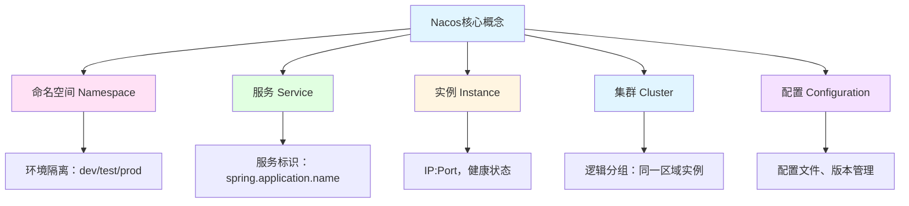
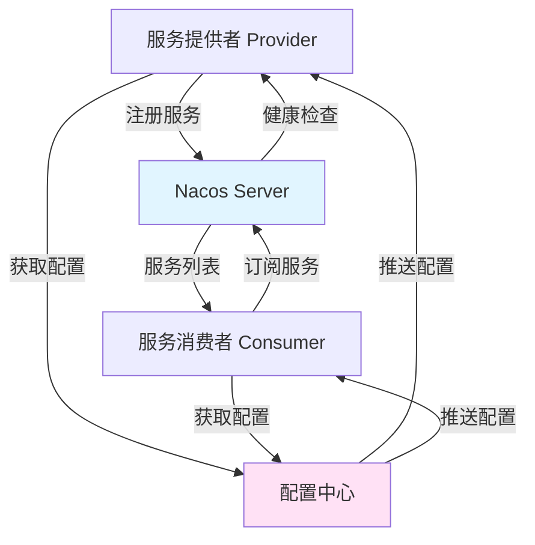

# Nacos注册中心与配置中心

> **学习目标**：掌握微服务架构中的服务治理核心组件
> **核心内容**：服务注册与发现、配置管理、动态刷新
> **预计时间**：6小时

## Nacos概述

### 为什么需要Nacos

```java
/**
 * 微服务架构面临的挑战
 */
public class MicroserviceChallenges {
    public static void main(String[] args) {
        System.out.println("=== 微服务架构的核心问题 ===\n");

        System.out.println("1. 服务注册与发现：");
        System.out.println("   问题：服务实例动态变化，如何感知？");
        System.out.println("   解决：Nacos提供服务注册表，自动维护服务列表\n");

        System.out.println("2. 配置管理：");
        System.out.println("   问题：多环境配置、配置热更新、配置版本管理");
        System.out.println("   解决：Nacos配置中心，统一管理配置\n");

        System.out.println("3. 服务健康检查：");
        System.out.println("   问题：如何判断服务实例是否可用？");
        System.out.println("   解决：Nacos主动/被动健康检查\n");

        System.out.println("4. 负载均衡：");
        System.out.println("   问题：如何选择服务实例？");
        System.out.println("   解决：Nacos + Ribbon实现负载均衡\n");

        System.out.println("5. 服务元数据：");
        System.out.println("   问题：如何管理服务的扩展信息？");
        System.out.println("   解决：Nacos支持自定义元数据\n");
    }
}
```

### Nacos核心概念



### Nacos架构



## 环境搭建

### 安装Nacos Server

```bash
1. 下载Nacos
wget https://github.com/alibaba/nacos/releases/download/2.2.3/nacos-server-2.2.3.zip

2. 解压
unzip nacos-server-2.2.3.zip
cd nacos/bin

3. 单机模式启动
./startup.sh -m standalone

4. 集群模式启动
# 先修改conf/cluster.conf
# 然后执行
./startup.sh

5. 访问控制台
http://localhost:8848/nacos
# 默认账号密码：nacos/nacos
```

### Docker方式部署

```yaml
# docker-compose.yml
version: '3.8'
services:
  nacos:
    image: nacos/nacos-server:v2.2.3
    container_name: nacos-standalone
    environment:
      - MODE=standalone
      - SPRING_DATASOURCE_PLATFORM=mysql
      - MYSQL_SERVICE_HOST=mysql
      - MYSQL_SERVICE_DB_NAME=nacos_config
      - MYSQL_SERVICE_USER=root
      - MYSQL_SERVICE_PASSWORD=root
      - MYSQL_SERVICE_DB_PARAM=characterEncoding=utf8&connectTimeout=1000&socketTimeout=3000&autoReconnect=true&useSSL=false
      - JVM_XMS=512m
      - JVM_XMX=512m
    ports:
      - "8848:8848"
      - "9848:9848"
      - "9849:9849"
    depends_on:
      - mysql

  mysql:
    image: mysql:8.0
    container_name: nacos-mysql
    environment:
      - MYSQL_ROOT_PASSWORD=root
      - MYSQL_DATABASE=nacos_config
    volumes:
      - mysql-data:/var/lib/mysql
    ports:
      - "3306:3306"

volumes:
  mysql-data:
```

## 服务注册与发现

### Maven依赖

```xml
<!-- pom.xml -->
<dependencies>
    <!-- Spring Cloud Alibaba -->
    <dependency>
        <groupId>com.alibaba.cloud</groupId>
        <artifactId>spring-cloud-starter-alibaba-nacos-discovery</artifactId>
    </dependency>

    <!-- Spring Boot Actuator（健康检查） -->
    <dependency>
        <groupId>org.springframework.boot</groupId>
        <artifactId>spring-boot-starter-actuator</artifactId>
    </dependency>

    <!-- Loadbalancer（负载均衡） -->
    <dependency>
        <groupId>org.springframework.cloud</groupId>
        <artifactId>spring-cloud-starter-loadbalancer</artifactId>
    </dependency>
</dependencies>

<dependencyManagement>
    <dependencies>
        <dependency>
            <groupId>com.alibaba.cloud</groupId>
            <artifactId>spring-cloud-alibaba-dependencies</artifactId>
            <version>2022.0.0.0</version>
            <type>pom</type>
            <scope>import</scope>
        </dependency>
        <dependency>
            <groupId>org.springframework.cloud</groupId>
            <artifactId>spring-cloud-dependencies</artifactId>
            <version>2022.0.4</version>
            <type>pom</type>
            <scope>import</scope>
        </dependency>
    </dependencies>
</dependencyManagement>
```

### 配置文件

```yaml
# application.yml
spring:
  application:
    name: product-service  # 服务名称
  cloud:
    nacos:
      discovery:
        server-addr: localhost:8848  # Nacos地址
        namespace: dev  # 命名空间ID
        group: DEFAULT_GROUP  # 分组
        username: nacos  # 认证用户名
        password: nacos  # 认证密码

        # 实例配置
        instance-enabled: true  # 是否启用实例
        register-enabled: true  # 是否注册到Nacos
        ephemeral: true  # 临时实例

        # 实例元数据
        metadata:
          version: 1.0.0
          region: beijing
          zone: zone1

        # 健康检查
        heart-beat-interval: 5000  # 心跳间隔（毫秒）
        heart-beat-timeout: 15000  # 心跳超时
        ip-delete-timeout: 30000  # IP删除超时

        # 负载均衡
        weight: 1  # 权重

        # 集群配置
        cluster-name: beijing  # 集群名称

server:
  port: 8081

# Actuator配置
management:
  endpoints:
    web:
      exposure:
        include: '*'
  health:
    show-details: always
```

### 服务提供者

```java
package com.example.product.controller;

import org.springframework.beans.factory.annotation.Value;
import org.springframework.cloud.client.discovery.EnableDiscoveryClient;
import org.springframework.web.bind.annotation.*;

import java.util.HashMap;
import java.util.Map;

/**
 * 商品服务Controller
 */
@RestController
@RequestMapping("/api/products")
@EnableDiscoveryClient
public class ProductController {

    @Value("${spring.application.name}")
    private String serviceName;

    @Value("${server.port}")
    private String serverPort;

    /**
     * 获取商品信息
     */
    @GetMapping("/{id}")
    public Map<String, Object> getProduct(@PathVariable Long id) {
        Map<String, Object> product = new HashMap<>();
        product.put("id", id);
        product.put("name", "商品" + id);
        product.put("price", 99.99);
        product.put("stock", 100);
        product.put("service", serviceName);
        product.put("port", serverPort);

        return product;
    }

    /**
     * 获取服务信息
     */
    @GetMapping("/info")
    public Map<String, String> getServiceInfo() {
        Map<String, String> info = new HashMap<>();
        info.put("serviceName", serviceName);
        info.put("port", serverPort);
        info.put("timestamp", String.valueOf(System.currentTimeMillis()));
        return info;
    }
}
```

### 服务消费者

```java
package com.example.order.controller;

import org.springframework.beans.factory.annotation.Autowired;
import org.springframework.cloud.client.ServiceInstance;
import org.springframework.cloud.client.discovery.DiscoveryClient;
import org.springframework.cloud.client.loadbalancer.LoadBalanced;
import org.springframework.context.annotation.Bean;
import org.springframework.web.bind.annotation.*;
import org.springframework.web.client.RestTemplate;

import java.util.HashMap;
import java.util.List;
import java.util.Map;
import java.util.Random;

/**
 * 订单服务Controller
 */
@RestController
@RequestMapping("/api/orders")
public class OrderController {

    @Autowired
    private DiscoveryClient discoveryClient;

    @Autowired
    private RestTemplate restTemplate;

    /**
     * 创建订单（调用商品服务）
     */
    @PostMapping
    public Map<String, Object> createOrder(@RequestParam Long productId,
                                          @RequestParam Integer quantity) {
        // 1. 从Nacos获取商品服务实例
        List<ServiceInstance> instances =
            discoveryClient.getInstances("product-service");

        if (instances == null || instances.isEmpty()) {
            throw new RuntimeException("商品服务不可用");
        }

        // 2. 负载均衡选择实例（随机）
        ServiceInstance instance = instances.get(
            new Random().nextInt(instances.size())
        );

        // 3. 调用商品服务
        String url = instance.getUri() + "/api/products/" + productId;
        Map<String, Object> product = restTemplate.getForObject(url, Map.class);

        // 4. 创建订单
        Map<String, Object> order = new HashMap<>();
        order.put("orderId", System.currentTimeMillis());
        order.put("product", product);
        order.put("quantity", quantity);
        order.put("totalAmount", (Double)product.get("price") * quantity);
        order.put("productService", instance.getUri().toString());

        return order;
    }
}

/**
 * RestTemplate配置
 */
class RestTemplateConfig {
    @Bean
    @LoadBalanced  // 启用负载均衡
    public RestTemplate restTemplate() {
        return new RestTemplate();
    }
}
```

### 使用服务名调用（推荐）

```java
package com.example.order.service;

import org.springframework.beans.factory.annotation.Autowired;
import org.springframework.stereotype.Service;
import org.springframework.web.client.RestTemplate;

import java.util.HashMap;
import java.util.Map;

/**
 * 订单服务（使用服务名调用）
 */
@Service
public class OrderService {

    @Autowired
    private RestTemplate restTemplate;

    /**
     * 获取商品信息（使用服务名）
     */
    public Map<String, Object> getProduct(Long productId) {
        // 直接使用服务名，Nacos自动进行负载均衡
        String url = "http://product-service/api/products/" + productId;

        Map<String, Object> product = restTemplate.getForObject(url, Map.class);

        return product;
    }
}
```

## Nacos配置中心

### Maven依赖

```xml
<dependencies>
    <!-- Nacos配置中心 -->
    <dependency>
        <groupId>com.alibaba.cloud</groupId>
        <artifactId>spring-cloud-starter-alibaba-nacos-config</artifactId>
    </dependency>

    <!-- Spring Cloud Bootstrap（不依赖spring-cloud-starter-bootstrap） -->
    <dependency>
        <groupId>org.springframework.cloud</groupId>
        <artifactId>spring-cloud-starter-bootstrap</artifactId>
    </dependency>
</dependencies>
```

### Bootstrap配置

```yaml
# bootstrap.yml（优先级高于application.yml）
spring:
  application:
    name: product-service  # 必须配置，用于读取配置

  cloud:
    nacos:
      config:
        server-addr: localhost:8848
        namespace: dev  # 命名空间ID
        group: DEFAULT_GROUP
        username: nacos
        password: nacos

        # 配置文件格式
        file-extension: yaml  # 配置文件格式：yaml/properties/json

        # 共享配置
        shared-configs:
          - data-id: common.yaml  # 共享配置ID
            group: DEFAULT_GROUP
            refresh: true  # 支持动态刷新

          - data-id: redis.yaml
            group: DEFAULT_GROUP
            refresh: true

        # 扩展配置
        extension-configs:
          - data-id: datasource.yaml
            group: DEFAULT_GROUP
            refresh: true

  profiles:
    active: dev  # 环境标识
```

### Nacos控制台配置

在Nacos控制台（http://localhost:8848/nacos）中创建配置：

**配置1：product-service.yaml**
```yaml
# 商品服务配置
app:
  name: 商品服务
  version: 1.0.0

# 数据源配置
spring:
  datasource:
    url: jdbc:mysql://localhost:3306/product_db
    username: root
    password: root
    driver-class-name: com.mysql.cj.jdbc.Driver

# JPA配置
  jpa:
    hibernate:
      ddl-auto: update
    show-sql: true
```

**配置2：common.yaml**
```yaml
# 公共配置
logging:
  level:
    com.example: DEBUG
  pattern:
    console: '%d{yyyy-MM-dd HH:mm:ss} [%thread] %-5level %logger{36} - %msg%n'

# 线程池配置
thread-pool:
  core-size: 10
  max-size: 20
  queue-capacity: 100
```

### 配置读取与刷新

```java
package com.example.product.config;

import org.springframework.boot.context.properties.ConfigurationProperties;
import org.springframework.cloud.context.config.annotation.RefreshScope;
import org.springframework.stereotype.Component;

/**
 * 应用配置（支持动态刷新）
 */
@Component
@RefreshScope  // 关键注解：支持配置动态刷新
@ConfigurationProperties(prefix = "app")
public class AppConfig {

    private String name;
    private String version;

    public String getName() {
        return name;
    }

    public void setName(String name) {
        this.name = name;
    }

    public String getVersion() {
        return version;
    }

    public void setVersion(String version) {
        this.version = version;
    }
}
```

```java
package com.example.product.controller;

import com.example.product.config.AppConfig;
import org.springframework.beans.factory.annotation.Autowired;
import org.springframework.beans.factory.annotation.Value;
import org.springframework.cloud.context.config.annotation.RefreshScope;
import org.springframework.web.bind.annotation.GetMapping;
import org.springframework.web.bind.annotation.RequestMapping;
import org.springframework.web.bind.annotation.RestController;

import java.util.HashMap;
import java.util.Map;

/**
 * 配置测试Controller
 */
@RestController
@RequestMapping("/api/config")
@RefreshScope
public class ConfigController {

    @Value("${app.name:默认名称}")
    private String appName;

    @Value("${app.version:1.0.0}")
    private String appVersion;

    @Autowired
    private AppConfig appConfig;

    /**
     * 获取配置（使用@Value）
     */
    @GetMapping("/value")
    public Map<String, String> getConfigByValue() {
        Map<String, String> config = new HashMap<>();
        config.put("appName", appName);
        config.put("appVersion", appVersion);
        return config;
    }

    /**
     * 获取配置（使用@ConfigurationProperties）
     */
    @GetMapping("/properties")
    public Map<String, String> getConfigByProperties() {
        Map<String, String> config = new HashMap<>();
        config.put("appName", appConfig.getName());
        config.put("appVersion", appConfig.getVersion());
        return config;
    }
}
```

### 配置动态刷新测试

```bash
1. 访问配置接口
curl http://localhost:8081/api/config/value

2. 在Nacos控制台修改配置
# 进入配置管理 -> 配置列表 -> product-service.yaml -> 编辑
# 修改 app.version 为 2.0.0

3. 发送刷新请求（可选，配置自动刷新）
curl -X POST http://localhost:8081/actuator/refresh

4. 再次访问配置接口，查看配置已更新
curl http://localhost:8081/api/config/value
```

## 命名空间与分组

### 多环境配置

```yaml
# bootstrap.yml - 开发环境
spring:
  application:
    name: product-service
  cloud:
    nacos:
      config:
        server-addr: localhost:8848
        namespace: dev  # 开发环境命名空间ID
        group: DEFAULT_GROUP
      discovery:
        server-addr: localhost:8848
        namespace: dev
```

```yaml
# bootstrap-prod.yml - 生产环境
spring:
  application:
    name: product-service
  cloud:
    nacos:
      config:
        server-addr: nacos-prod.example.com:8848
        namespace: prod  # 生产环境命名空间ID
        group: DEFAULT_GROUP
      discovery:
        server-addr: nacos-prod.example.com:8848
        namespace: prod
```

### 分组管理

```java
/**
 * Nacos命名空间和分组管理
 */
public class NacosNamespaceManagement {

    /*
    命名空间（Namespace）：
    ======================

    1. 用于环境隔离：dev、test、prod
    2. 不同命名空间的配置和服务相互隔离
    3. public是默认命名空间

    分组（Group）：
    ==============

    1. 用于业务隔离
    2. 默认分组：DEFAULT_GROUP
    3. 自定义分组：order-group、payment-group等

    最佳实践：
    ==========
    - 命名空间：用于环境隔离
    - 分组：用于业务模块隔离
    - Data ID：spring.application.name + profile

    示例：
    - dev环境，订单服务：dev / DEFAULT_GROUP / order-service.yaml
    - prod环境，支付服务：prod / payment-group / payment-service.yaml
    */
}
```

## 服务健康检查

### 健康检查配置

```yaml
# application.yml
spring:
  cloud:
    nacos:
      discovery:
        # 健康检查类型：TCP 或 HTTP
        health-check-type: TCP

        # TCP健康检查
        tcp-health-check:
          port: ${server.port}
          interval: 5000  # 检查间隔（毫秒）
          timeout: 3000   # 超时时间

        # HTTP健康检查
        http-health-check:
          port: ${server.port}
          path: /actuator/health
          interval: 5000
          timeout: 3000

        # 临时实例
        ephemeral: true  # true：临时实例，false：持久化实例

        # 实例是否启用
        instance-enabled: true
```

### 自定义健康检查

```java
package com.example.product.health;

import org.springframework.boot.actuate.health.Health;
import org.springframework.boot.actuate.health.HealthIndicator;
import org.springframework.stereotype.Component;

import java.util.HashMap;
import java.util.Map;

/**
 * 自定义健康检查
 */
@Component
public class CustomHealthIndicator implements HealthIndicator {

    @Override
    public Health health() {
        try {
            // 检查外部依赖（如数据库、Redis）
            boolean dbHealthy = checkDatabase();
            boolean redisHealthy = checkRedis();

            if (dbHealthy && redisHealthy) {
                Map<String, Object> details = new HashMap<>();
                details.put("database", "UP");
                details.put("redis", "UP");

                return Health.up()
                    .withDetails(details)
                    .build();
            } else {
                return Health.down()
                    .withDetail("database", dbHealthy ? "UP" : "DOWN")
                    .withDetail("redis", redisHealthy ? "UP" : "DOWN")
                    .build();
            }
        } catch (Exception e) {
            return Health.down()
                .withDetail("error", e.getMessage())
                .build();
        }
    }

    private boolean checkDatabase() {
        // 检查数据库连接
        return true;
    }

    private boolean checkRedis() {
        // 检查Redis连接
        return true;
    }
}
```

## 元数据管理

### 自定义元数据

```yaml
# application.yml
spring:
  cloud:
    nacos:
      discovery:
        metadata:
          # 版本信息
          version: 1.0.0
          build-time: 2024-01-01T10:00:00

          # 环境信息
          env: dev
          region: beijing
          zone: zone1

          # 业务信息
          team: product-team
          owner: product-team@example.com

          # 容量信息
          capacity: 1000
          priority: high

          # 扩展信息
          gray: false
          canary: false
```

### 元数据使用

```java
package com.example.product.service;

import org.springframework.beans.factory.annotation.Autowired;
import org.springframework.cloud.client.ServiceInstance;
import org.springframework.cloud.client.discovery.DiscoveryClient;
import org.springframework.stereotype.Service;

import java.util.List;
import java.util.Map;

/**
 * 服务元数据服务
 */
@Service
public class MetadataService {

    @Autowired
    private DiscoveryClient discoveryClient;

    /**
     * 获取服务元数据
     */
    public Map<String, String> getServiceMetadata(String serviceName) {
        List<ServiceInstance> instances =
            discoveryClient.getInstances(serviceName);

        if (instances == null || instances.isEmpty()) {
            return null;
        }

        ServiceInstance instance = instances.get(0);
        return instance.getMetadata();
    }

    /**
     * 根据元数据选择实例
     */
    public ServiceInstance selectInstanceByMetadata(String serviceName,
                                                    String key,
                                                    String value) {
        List<ServiceInstance> instances =
            discoveryClient.getInstances(serviceName);

        return instances.stream()
            .filter(instance -> {
                Map<String, String> metadata = instance.getMetadata();
                return metadata != null && value.equals(metadata.get(key));
            })
            .findFirst()
            .orElse(null);
    }

    /**
     * 选择灰度实例
     */
    public ServiceInstance selectGrayInstance(String serviceName) {
        return selectInstanceByMetadata(serviceName, "gray", "true");
    }
}
```

## 避坑指南

### 常见问题

```java
/**
 * Nacos开发避坑指南
 */
public class NacosPitfalls {

    /*
    ❌ 问题1: 服务注册失败
    ======================
    原因：
    - Nacos Server未启动
    - 网络不通
    - 配置错误

    ✅ 解决方案：
    1. 检查Nacos Server状态
    2. 检查server-addr配置
    3. 检查防火墙和网络
    4. 查看日志：tail -f logs/nacos.log


    ❌ 问题2: 配置不生效
    ==================
    原因：
    - 未配置bootstrap.yml
    - Data ID不匹配
    - 命名空间错误
    - 未添加@RefreshScope

    ✅ 解决方案：
    1. 确保配置bootstrap.yml
    2. 检查Data ID：${spring.application.name}.${file-extension}
    3. 检查命名空间ID
    4. 使用@RefreshScope注解


    ❌ 问题3: 配置刷新不生效
    ====================
    原因：
    - 类是单例，未使用@RefreshScope
    - 配置未正确绑定

    ✅ 解决方案：
    @RefreshScope
    @ConfigurationProperties(prefix = "app")
    public class AppConfig {
        // 配置属性
    }


    ❌ 问题4: 服务发现不及时
    ====================
    原因：
    - Nacos缓存机制
    - 订阅延迟

    ✅ 解决方案：
    1. 调整缓存时间
    spring.cloud.nacos.discovery.cache-watch-delay=3000

    2. 使用@LoadBalanced
    @LoadBalanced
    public RestTemplate restTemplate() {
        return new RestTemplate();
    }


    ❌ 问题5: 实例下线不生效
    ====================
    原因：
    - 健康检查失败
    - 临时实例特性

    ✅ 解决方案：
    1. 确保健康检查通过
    2. 正常关闭服务（优雅停机）
    3. 使用持久化实例（非临时）


    ❌ 问题6: 多环境配置混乱
    ====================
    原因：
    - 未使用命名空间
    - Data ID命名不规范

    ✅ 解决方案：
    1. 使用命名空间隔离环境
    2. 规范命名：${spring.application.name}-${profile}.${file-extension}
    3. 使用不同分组


    ❌ 问题7: Nacos高可用问题
    ====================
    原因：
    - 单点故障
    - 集群配置错误

    ✅ 解决方案：
    1. 部署Nacos集群（至少3节点）
    2. 使用MySQL存储配置
    3. 配置VIP或Nginx代理


    ❌ 问题8: 配置泄露风险
    ====================
    原因：
    - 敏感信息明文存储
    - 权限控制不当

    ✅ 解决方案：
    1. 敏感配置使用加密
    2. 启用Nacos鉴权
    3. 使用命名空间隔离
    4. 定期审计配置
    */
}
```

### 企业级最佳实践

```java
/**
 * Nacos企业级最佳实践
 */
public class NacosBestPractices {

    /*
    1. 架构设计
    ===========
    ✅ 生产环境使用Nacos集群（3节点以上）
    ✅ 使用MySQL存储配置数据
    ✅ 配置Nginx代理，实现负载均衡
    ✅ 启用Nacos鉴权功能
    ✅ 定期备份配置数据


    2. 命名空间管理
    ===============
    ✅ dev、test、uat、prod使用不同命名空间
    ✅ 每个环境独立配置
    ✅ 严格控制命名空间权限


    3. 配置管理
    ===========
    ✅ 配置分层：公共配置 -> 服务配置 -> 环境配置
    ✅ 使用共享配置（shared-configs）
    ✅ 配置版本管理
    ✅ 配置变更记录和审核
    ✅ 敏感配置加密


    4. 服务管理
    ===========
    ✅ 服务命名规范：{业务}-{模块}-service
    ✅ 实例元数据标准化
    ✅ 健康检查配置
    ✅ 优雅停机配置
    ✅ 服务保护（阈值、熔断）


    5. 监控告警
    ===========
    ✅ 监控Nacos Server状态
    ✅ 监控服务注册数量
    ✅ 监控服务健康状态
    ✅ 监控配置变更
    ✅ 配置告警规则


    6. 安全加固
    ===========
    ✅ 启用Nacos鉴权
    ✅ 使用HTTPS
    ✅ 网络隔离
    ✅ 定期更新密码
    ✅ 审计日志
    */
}
```

## 实战练习

### 练习1：构建多服务系统

```java
/*
需求：
1. 创建商品服务、订单服务、库存服务
2. 使用Nacos服务注册与发现
3. 实现服务间调用（订单调用商品和库存）
4. 使用Nacos配置中心统一管理配置

要求：
- 服务注册到Nacos
- 配置存储在Nacos配置中心
- 支持配置动态刷新
- 实现健康检查
- 实现负载均衡
*/
```

### 练习2：多环境配置管理

```java
/*
需求：
1. 配置dev、test、prod三个环境
2. 每个环境独立配置
3. 实现配置的动态刷新
4. 敏感配置加密

要求：
- 使用命名空间隔离环境
- 配置版本管理
- 配置变更审计
- 配置回滚机制
*/
```

## 本章小结

### 学习成果检查

✅ **Nacos基础**：服务注册与发现、配置中心
✅ **服务治理**：健康检查、负载均衡、元数据
✅ **配置管理**：动态配置、共享配置、命名空间
✅ **多环境管理**：命名空间隔离、分组管理
✅ **配置刷新**：@RefreshScope、自动刷新

### 核心技术点

- **Nacos Server**：服务注册中心和配置中心
- **服务注册与发现**：自动维护服务列表
- **配置中心**：统一配置管理、动态刷新
- **@RefreshScope**：配置热更新
- **命名空间**：环境隔离
- **健康检查**：服务可用性监控
- **元数据**：服务扩展信息

### 下一步学习

- **第20章**：Sentinel熔断限流降级
- **第21章**：Seata分布式事务
- **第22章**：Spring Cloud Gateway网关

---

**学习时间**：约6小时
**难度等级**：★★★★☆
**重要程度**：★★★★★（微服务核心）
