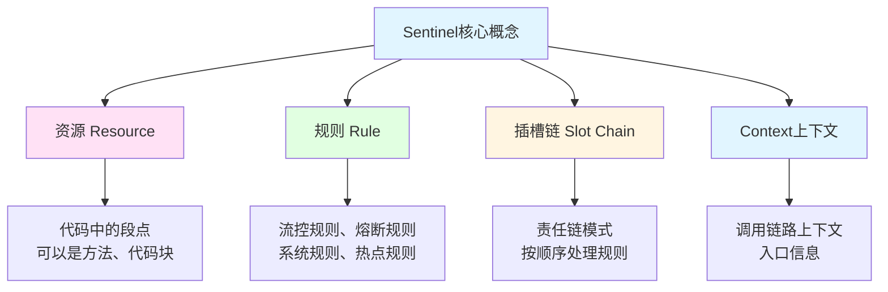
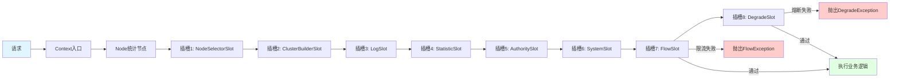

# Sentinel熔断限流降级

> **学习目标**：掌握微服务流量控制与保护机制
> **核心内容**：流量控制、熔断降级、系统保护、热点限流
> **预计时间**：7小时

## Sentinel概述

### 为什么需要Sentinel

```java
/**
 * 微服务面临的流量挑战
 */
public class FlowControlChallenges {
    public static void main(String[] args) {
        System.out.println("=== 微服务流量控制的核心问题 ===\n");

        System.out.println("1. 流量突增：");
        System.out.println("   问题：促销活动、热点新闻导致流量激增");
        System.out.println("   影响：服务雪崩、系统崩溃");
        System.out.println("   解决：Sentinel流量控制\n");

        System.out.println("2. 服务依赖：");
        System.out.println("   问题：依赖服务故障导致级联失败");
        System.out.println("   影响：整个系统不可用");
        System.out.println("   解决：Sentinel熔断降级\n");

        System.out.println("3. 慢调用：");
        System.out.println("   问题：某服务响应慢拖累整个调用链");
        System.out.println("   影响：线程池耗尽、超时");
        System.out.println("   解决：Sentinel慢调用比例熔断\n");

        System.out.println("4. 热点参数：");
        System.out.println("   问题：某个参数被频繁访问");
        System.out.println("   影响：数据库压力过大");
        System.out.println("   解决：Sentinel热点参数限流\n");

        System.out.println("5. 系统负载：");
        System.out.println("   问题：CPU、内存等资源不足");
        System.out.println("   影响：系统响应缓慢甚至宕机");
        System.out.println("   解决：Sentinel自适应保护\n");
    }
}
```

### Sentinel核心概念



### Sentinel工作原理



## 环境搭建

### 安装Sentinel Dashboard

```bash
1. 下载Sentinel Dashboard
wget https://github.com/alibaba/Sentinel/releases/download/1.8.6/sentinel-dashboard-1.8.6.jar

2. 启动Dashboard
java -Dserver.port=8080 -Dcsp.sentinel.dashboard.server=localhost:8080 \
     -Dproject.name=sentinel-dashboard \
     -jar sentinel-dashboard-1.8.6.jar

3. 访问控制台
http://localhost:8080
# 默认账号密码：sentinel/sentinel
```

### Docker方式部署

```yaml
# docker-compose.yml
version: '3.8'
services:
  sentinel-dashboard:
    image: bladex/sentinel-dashboard:1.8.6
    container_name: sentinel-dashboard
    ports:
      - "8080:8080"
    environment:
      - JAVA_OPTS=-Dserver.port=8080 -Dcsp.sentinel.app.type=1
```

### Maven依赖

```xml
<!-- pom.xml -->
<dependencies>
    <!-- Sentinel -->
    <dependency>
        <groupId>com.alibaba.cloud</groupId>
        <artifactId>spring-cloud-starter-alibaba-sentinel</artifactId>
    </dependency>

    <!-- Sentinel数据源-Nacos（持久化规则） -->
    <dependency>
        <groupId>com.alibaba.csp</groupId>
        <artifactId>sentinel-datasource-nacos</artifactId>
    </dependency>

    <!-- Sentinel整合OpenFeign -->
    <dependency>
        <groupId>org.springframework.cloud</groupId>
        <artifactId>spring-cloud-starter-openfeign</artifactId>
    </dependency>

    <!-- Actuator（健康检查） -->
    <dependency>
        <groupId>org.springframework.boot</groupId>
        <artifactId>spring-boot-starter-actuator</artifactId>
    </dependency>
</dependencies>

<dependencyManagement>
    <dependencies>
        <dependency>
            <groupId>com.alibaba.cloud</groupId>
            <artifactId>spring-cloud-alibaba-dependencies</artifactId>
            <version>2022.0.0.0</version>
            <type>pom</type>
            <scope>import</scope>
        </dependency>
    </dependencies>
</dependencyManagement>
```

### 配置文件

```yaml
# application.yml
spring:
  application:
    name: product-service
  cloud:
    nacos:
      discovery:
        server-addr: localhost:8848
    sentinel:
      transport:
        dashboard: localhost:8080  # Sentinel Dashboard地址
        port: 8719  # 与Dashboard通信的端口

      # 是否启用Sentinel
      enabled: true

      # 心跳配置
      heartbeat-client-interval: 10000  # 客户端心跳间隔（毫秒）

      # 懒加载（默认true，第一次访问时初始化）
      eager: true

      # Web配置
      web-context-unify: false  # 关闭Context统一
      filter:
        enabled: true  # 启用过滤器

      # Feign配置
      feign:
        enabled: true

      # 流控失败直接返回（不抛异常）
      block-page: /block  # 限流页面

      # 数据源配置（Nacos持久化）
      datasource:
        flow:
          nacos:
            server-addr: localhost:8848
            dataId: ${spring.application.name}-flow-rules
            groupId: SENTINEL_GROUP
            rule-type: flow

        degrade:
          nacos:
            server-addr: localhost:8848
            dataId: ${spring.application.name}-degrade-rules
            groupId: SENTINEL_GROUP
            rule-type: degrade

server:
  port: 8081

# Actuator配置
management:
  endpoints:
    web:
      exposure:
        include: '*'
```

## 流量控制

### @SentinelResource注解

```java
package com.example.product.controller;

import com.alibaba.csp.sentinel.annotation.SentinelResource;
import com.alibaba.csp.sentinel.slots.block.BlockException;
import org.springframework.web.bind.annotation.*;

import java.util.HashMap;
import java.util.Map;

/**
 * 商品Controller（使用Sentinel保护）
 */
@RestController
@RequestMapping("/api/products")
public class ProductController {

    /**
     * 基本用法：定义资源
     */
    @GetMapping("/{id}")
    @SentinelResource(value = "getProduct", blockHandler = "handleBlock")
    public Map<String, Object> getProduct(@PathVariable Long id) {
        Map<String, Object> product = new HashMap<>();
        product.put("id", id);
        product.put("name", "商品" + id);
        product.put("price", 99.99);
        product.put("stock", 100);

        return product;
    }

    /**
     * 限流降级处理方法
     * 注意：
     * 1. 访问修饰符必须是public
     * 2. 返回类型要与原方法一致
     * 3. 参数列表要和原方法一致，最后加BlockException
     */
    public Map<String, Object> handleBlock(Long id, BlockException ex) {
        Map<String, Object> result = new HashMap<>();
        result.put("code", 429);
        result.put("message", "系统繁忙，请稍后再试");
        result.put("productId", id);
        result.put("exception", ex.getClass().getSimpleName());

        return result;
    }

    /**
     * 同时处理限流和异常
     */
    @GetMapping("/detail/{id}")
    @SentinelResource(
        value = "getProductDetail",
        blockHandler = "handleBlockForDetail",
        fallback = "handleFallbackForDetail"
    )
    public Map<String, Object> getProductDetail(@PathVariable Long id) {
        // 模拟业务异常
        if (id < 0) {
            throw new IllegalArgumentException("商品ID不能为负数");
        }

        Map<String, Object> product = new HashMap<>();
        product.put("id", id);
        product.put("name", "商品" + id);
        product.put("detail", "商品详细信息");

        return product;
    }

    /**
     * 限流处理
     */
    public Map<String, Object> handleBlockForDetail(Long id, BlockException ex) {
        Map<String, Object> result = new HashMap<>();
        result.put("code", 429);
        result.put("message", "请求过于频繁，请稍后再试");
        return result;
    }

    /**
     * 异常降级处理
     */
    public Map<String, Object> handleFallbackForDetail(Long id, Throwable ex) {
        Map<String, Object> result = new HashMap<>();
        result.put("code", 500);
        result.put("message", "商品服务异常");
        result.put("productId", id);
        result.put("error", ex.getMessage());

        return result;
    }

    /**
     * 热点参数限流
     */
    @GetMapping("/hotspot")
    @SentinelResource(
        value = "hotspotProduct",
        blockHandler = "handleHotspot"
    )
    public Map<String, Object> hotspotProduct(@RequestParam("id") Long id) {
        Map<String, Object> product = new HashMap<>();
        product.put("id", id);
        product.put("name", "热点商品" + id);
        product.put("hot", true);

        return product;
    }

    public Map<String, Object> handleHotspot(Long id, BlockException ex) {
        Map<String, Object> result = new HashMap<>();
        result.put("code", 429);
        result.put("message", "热点商品访问频繁，请稍后再试");
        result.put("productId", id);

        return result;
    }
}
```

### 流控规则配置

```java
package com.example.product.config;

import com.alibaba.csp.sentinel.slots.block.RuleConstant;
import com.alibaba.csp.sentinel.slots.block.flow.FlowRule;
import com.alibaba.csp.sentinel.slots.block.flow.FlowRuleManager;
import org.springframework.context.annotation.Bean;
import org.springframework.context.annotation.Configuration;

import javax.annotation.PostConstruct;
import java.util.ArrayList;
import java.util.List;

/**
 * Sentinel流控规则配置
 */
@Configuration
public class SentinelRuleConfig {

    /**
     * 初始化流控规则
     */
    @PostConstruct
    public void initFlowRules() {
        List<FlowRule> rules = new ArrayList<>();

        // 规则1：getProduct资源 - QPS限流
        FlowRule rule1 = new FlowRule();
        rule1.setResource("getProduct");
        rule1.setGrade(RuleConstant.FLOW_GRADE_QPS);  // QPS限流
        rule1.setCount(10);  // 每秒最多10个请求
        rule1.setLimitApp("default");  // 所有应用
        rule1.setStrategy(RuleConstant.STRATEGY_DIRECT);  // 直接拒绝
        rule1.setControlBehavior(RuleConstant.CONTROL_BEHAVIOR_DEFAULT);  // 快速失败
        rules.add(rule1);

        // 规则2：getProductDetail资源 - 并发线程数限流
        FlowRule rule2 = new FlowRule();
        rule2.setResource("getProductDetail");
        rule2.setGrade(RuleConstant.FLOW_GRADE_THREAD);  // 线程数限流
        rule2.setCount(5);  // 最多5个线程
        rule2.setLimitApp("default");
        rule2.setStrategy(RuleConstant.STRATEGY_DIRECT);
        rules.add(rule2);

        // 规则3：hotspotProduct资源 - 预热方式
        FlowRule rule3 = new FlowRule();
        rule3.setResource("hotspotProduct");
        rule3.setGrade(RuleConstant.FLOW_GRADE_QPS);
        rule3.setCount(100);  // 阈值100
        rule3.setControlBehavior(RuleConstant.CONTROL_BEHAVIOR_WARM_UP);  // 预热
        rule3.setWarmUpPeriodSec(10);  // 预热时长10秒
        rules.add(rule3);

        // 规则4：均匀排队
        FlowRule rule4 = new FlowRule();
        rule4.setResource("getProduct");
        rule4.setGrade(RuleConstant.FLOW_GRADE_QPS);
        rule4.setCount(5);
        rule4.setControlBehavior(RuleConstant.CONTROL_BEHAVIOR_RATE_LIMITER);  // 匀速排队
        rule4.setMaxQueueingTimeMs(500);  // 超时时间500ms
        rules.add(rule4);

        FlowRuleManager.loadRules(rules);
    }
}
```

### 流控策略说明

```java
/**
 * Sentinel流控策略详解
 */
public class FlowControlStrategies {

    /*
    1. 流控模式（Strategy）
    ====================

    A. DIRECT（直接拒绝）
       - 默认模式
       - 请求达到阈值直接拒绝
       - 适用于：简单限流场景

    B. ASSOCIATE（关联限流）
       - 当关联资源达到阈值时，限流当前资源
       - 适用场景：优先保主要业务
       - 示例：支付接口压力大时，限流订单查询

    C. WARM_UP（预热）
       - 冷启动时长内，阈值从最小值缓慢增长到最大值
       - 适用于：秒杀系统、缓存系统
       - 示例：初始阈值10，10秒后达到100

    D. RATE_LIMITER（匀速排队）
       - 请求以均匀速度通过
       - 适用于：消息队列处理
       - 注意：不适合QPS很高的场景


    2. 流控效果（ControlBehavior）
    =============================

    A. CONTROL_BEHAVIOR_DEFAULT（快速失败）
       - 直接抛出FlowException
       - 系统吞吐量最大

    B. CONTROL_BEHAVIOR_WARM_UP（预热）
       - 冷启动保护
       - 避免瞬时流量冲击

    C. CONTROL_BEHAVIOR_RATE_LIMITER（匀速排队）
       - 请求排队通过
       - 间隔均匀
       - 超时时间可配置

    D. CONTROL_BEHAVIOR_WARM_UP_RATE_LIMITER（预热+排队）
       - 预热后排队
       - 适用于：大流量场景
    */
}
```

## 熔断降级

### 熔断策略

```java
package com.example.product.config;

import com.alibaba.csp.sentinel.slots.block.degrade.DegradeRule;
import com.alibaba.csp.sentinel.slots.block.degrade.DegradeRuleManager;
import org.springframework.context.annotation.Configuration;

import javax.annotation.PostConstruct;
import java.util.ArrayList;
import java.util.List;

/**
 * 熔断降级规则配置
 */
@Configuration
public class DegradeRuleConfig {

    @PostConstruct
    public void initDegradeRules() {
        List<DegradeRule> rules = new ArrayList<>();

        // 规则1：慢调用比例熔断
        DegradeRule rule1 = new DegradeRule();
        rule1.setResource("getProductDetail");
        rule1.setGrade(RuleConstant.DEGRADE_GRADE_SLOW_REQUEST_RATIO);  // 慢调用比例
        rule1.setCount(0.5);  // 慢调用比例阈值：50%
        rule1.setSlowRatioThreshold(100);  // 慢调用临界值：100ms
        rule1.setTimeWindow(10);  // 熔断时长：10秒
        rule1.setMinRequestAmount(5);  // 最小请求数：5个
        rule1.setStatIntervalMs(1000);  // 统计时长：1秒
        rules.add(rule1);

        // 规则2：异常比例熔断
        DegradeRule rule2 = new DegradeRule();
        rule2.setResource("getProductDetail");
        rule2.setGrade(RuleConstant.DEGRADE_GRADE_EXCEPTION_RATIO);  // 异常比例
        rule2.setCount(0.5);  // 异常比例阈值：50%
        rule2.setTimeWindow(10);  // 熔断时长：10秒
        rule2.setMinRequestAmount(5);  // 最小请求数
        rule2.setStatIntervalMs(1000);  // 统计时长
        rules.add(rule2);

        // 规则3：异常数熔断
        DegradeRule rule3 = new DegradeRule();
        rule3.setResource("hotspotProduct");
        rule3.setGrade(RuleConstant.DEGRADE_GRADE_EXCEPTION_COUNT);  // 异常数
        rule3.setCount(10);  // 异常数阈值：10个
        rule3.setTimeWindow(10);  // 熔断时长：10秒
        rule3.setMinRequestAmount(5);
        rule3.setStatIntervalMs(1000);
        rules.add(rule3);

        DegradeRuleManager.loadRules(rules);
    }
}
```

### 熔断规则说明

```java
/**
 * Sentinel熔断策略详解
 */
public class DegradeStrategies {

    /*
    1. 慢调用比例（SLOW_REQUEST_RATIO）
    ==================================

    熔断条件：
    - 统计时长内，慢调用比例超过阈值
    - 慢调用：响应时间 > slowRatioThreshold
    - 请求数 >= minRequestAmount

    熔断后：
    - 一定时间内（timeWindow）自动熔断
    - 时间过后进入半开状态
    - 半开状态：请求通过1个，成功则恢复，失败则继续熔断

    适用场景：
    - 依赖服务响应变慢
    - 数据库查询慢
    - 第三方API调用超时


    2. 异常比例（EXCEPTION_RATIO）
    ==============================

    熔断条件：
    - 统计时长内，异常比例超过阈值
    - 异常包括：Exception、Throwable
    - 请求数 >= minRequestAmount

    适用场景：
    - 服务不稳定
    - 业务逻辑异常多
    - 依赖服务故障


    3. 异常数（EXCEPTION_COUNT）
    ===========================

    熔断条件：
    - 统计时长内，异常数超过阈值
    - 请求数 >= minRequestAmount

    适用场景：
    - 严格的异常控制
    - 重要的业务接口


    熔断状态机：
    =========

    关闭（Closed）
       ↓ [达到阈值]
    打开（Open）
       ↓ [熔断时长到期]
    半开（Half-Open）
       ↓ [探测请求]
       ├─ 成功 → 关闭（Closed）
       └─ 失败 → 打开（Open）
    */
}
```

## 热点参数限流

### 热点规则配置

```java
package com.example.product.config;

import com.alibaba.csp.sentinel.slots.block.RuleConstant;
import com.alibaba.csp.sentinel.slots.block.flow.param.ParamFlowItem;
import com.alibaba.csp.sentinel.slots.block.flow.param.ParamFlowRule;
import com.alibaba.csp.sentinel.slots.block.flow.param.ParamFlowRuleManager;
import org.springframework.context.annotation.Configuration;

import javax.annotation.PostConstruct;
import java.util.ArrayList;
import java.util.Collections;
import java.util.List;

/**
 * 热点参数限流配置
 */
@Configuration
public class ParamFlowRuleConfig {

    @PostConstruct
    public void initParamFlowRules() {
        List<ParamFlowRule> rules = new ArrayList<>();

        // 规则1：热点商品限流
        ParamFlowRule rule1 = new ParamFlowRule();
        rule1.setResource("hotspotProduct");
        rule1.setGrade(RuleConstant.FLOW_GRADE_QPS);  // 限流阈值等级
        rule1.setParamIdx(0);  // 参数索引：第一个参数

        // 限流阈值：每秒10个请求
        rule1.setCount(10);

        // 参数类型：long
        rule1.setClassType(Long.class.getName());

        // 特殊参数配置：热点商品更严格的限流
        List<ParamFlowItem> paramItems = new ArrayList<>();

        // 商品ID为1的热点商品：限流5个/秒
        ParamFlowItem item1 = new ParamFlowItem();
        item1.setObject(String.valueOf(1));  // 参数值
        item1.setClassType(String.class.getName());
        item1.setCount(5);  // 更严格的阈值
        paramItems.add(item1);

        // 商品ID为2的热点商品：限流3个/秒
        ParamFlowItem item2 = new ParamFlowItem();
        item2.setObject(String.valueOf(2));
        item2.setClassType(String.class.getName());
        item2.setCount(3);
        paramItems.add(item2);

        rule1.setParamFlowItemList(paramItems);
        rules.add(rule1);

        ParamFlowRuleManager.loadRules(rules);
    }
}
```

### 热点参数使用

```java
package com.example.product.controller;

import com.alibaba.csp.sentinel.annotation.SentinelResource;
import com.alibaba.csp.sentinel.slots.block.BlockException;
import org.springframework.web.bind.annotation.*;

import java.util.HashMap;
import java.util.Map;

/**
 * 热点商品Controller
 */
@RestController
@RequestMapping("/api/hotspot")
public class HotspotController {

    /**
     * 热点商品查询
     * 必须使用@SentinelResource
     */
    @GetMapping("/product")
    @SentinelResource(
        value = "hotspotProduct",
        blockHandler = "handleHotspotBlock"
    )
    public Map<String, Object> getHotspotProduct(@RequestParam("id") Long id) {
        Map<String, Object> product = new HashMap<>();
        product.put("id", id);
        product.put("name", "热点商品" + id);
        product.put("price", 199.99);
        product.put("hotLevel", id == 1 ? "超级热点" : "一般热点");

        return product;
    }

    /**
     * 热点限流处理
     */
    public Map<String, Object> handleHotspotBlock(Long id, BlockException ex) {
        Map<String, Object> result = new HashMap<>();
        result.put("code", 429);
        result.put("message", "热点商品访问频繁，请稍后再试");
        result.put("productId", id);
        result.put("tip", "热门商品限流保护中");

        return result;
    }

    /**
     * 多参数热点限流
     */
    @GetMapping("/products")
    @SentinelResource(
        value = "hotspotProducts",
        blockHandler = "handleProductsBlock"
    )
    public Map<String, Object> getHotspotProducts(
            @RequestParam("id") Long id,
            @RequestParam("userId") Long userId) {

        Map<String, Object> result = new HashMap<>();
        result.put("productId", id);
        result.put("userId", userId);
        result.put("message", "查询成功");

        return result;
    }

    public Map<String, Object> handleProductsBlock(Long id, Long userId, BlockException ex) {
        Map<String, Object> result = new HashMap<>();
        result.put("code", 429);
        result.put("message", "请求过于频繁");
        result.put("productId", id);
        result.put("userId", userId);

        return result;
    }
}
```

## 系统自适应保护

### 系统保护规则

```java
package com.example.product.config;

import com.alibaba.csp.sentinel.slots.system.SystemRule;
import com.alibaba.csp.sentinel.slots.system.SystemRuleManager;
import org.springframework.context.annotation.Configuration;

import javax.annotation.PostConstruct;
import java.util.ArrayList;
import java.util.List;

/**
 * 系统保护规则配置
 */
@Configuration
public class SystemRuleConfig {

    @PostConstruct
    public void initSystemRules() {
        List<SystemRule> rules = new ArrayList<>();

        // 规则1：CPU使用率保护
        SystemRule rule1 = new SystemRule();
        rule1.setHighestSystemLoad(0.8);  // CPU使用率超过80%时触发
        rules.add(rule1);

        // 规则2：平均RT（响应时间）保护
        SystemRule rule2 = new SystemRule();
        rule2.setAvgRt(1000);  // 平均RT超过1000ms时触发
        rules.add(rule2);

        // 规则3：并发线程数保护
        SystemRule rule3 = new SystemRule();
        rule3.setMaxThread(500);  // 并发线程数超过500时触发
        rules.add(rule3);

        // 规则4：入口QPS保护
        SystemRule rule4 = new SystemRule();
        rule4.setQps(1000);  // QPS超过1000时触发
        rules.add(rule4);

        SystemRuleManager.loadRules(rules);
    }
}
```

### 系统保护说明

```java
/**
 * Sentinel系统保护策略
 */
public class SystemProtection {

    /*
    1. CPU使用率（highestSystemLoad）
    ================================

    规则：当系统CPU使用率超过阈值时，触发系统保护

    场景：
    - 系统负载过高
    - 大量计算任务

    建议：
    - 设置阈值为0.7-0.8
    - 保护系统不崩溃


    2. 平均RT（avgRt）
    ==================

    规则：当所有入口流量的平均RT超过阈值时，触发保护

    场景：
    - 数据库慢查询
    - 第三方服务响应慢

    建议：
    - 根据业务要求设置
    - 一般设置为1000-2000ms


    3. 并发线程数（maxThread）
    =========================

    规则：当并发线程数超过阈值时，触发保护

    场景：
    - 线程池耗尽
    - 大量阻塞操作

    建议：
    - 根据服务器配置设置
    - 一般设置为200-500


    4. 入口QPS（qps）
    ================

    规则：当所有入口QPS超过阈值时，触发保护

    场景：
    - 流量突增
    - DDoS攻击

    建议：
    - 根据系统容量设置
    - 预留20%buffer


    注意事项：
    =========
    - 系统规则对所有入口生效
    - 优先级高于流控规则
    - 用于保护系统整体稳定性
    - 建议：结合监控动态调整阈值
    */
}
```

## OpenFeign整合

### Feign接口定义

```java
package com.example.order.feign;

import com.alibaba.csp.sentinel.annotation.SentinelResource;
import org.springframework.cloud.openfeign.FeignClient;
import org.springframework.web.bind.annotation.*;

import java.util.Map;

/**
 * 商品服务Feign客户端
 */
@FeignClient(
    value = "product-service",
    fallback = ProductFeignClientFallback.class  // 降级处理类
)
public interface ProductFeignClient {

    /**
     * 获取商品信息
     */
    @GetMapping("/api/products/{id}")
    @SentinelResource(value = "getProduct", fallback = "fallback")
    Map<String, Object> getProduct(@PathVariable("id") Long id);

    /**
     * 获取商品详情
     */
    @GetMapping("/api/products/detail/{id}")
    @SentinelResource(value = "getProductDetail", fallback = "detailFallback")
    Map<String, Object> getProductDetail(@PathVariable("id") Long id);

    /**
     * 默认降级方法
     */
    default Map<String, Object> fallback(Long id) {
        return Map.of(
            "code", 503,
            "message", "商品服务暂时不可用",
            "productId", id
        );
    }

    /**
     * 详情降级方法
     */
    default Map<String, Object> detailFallback(Long id) {
        return Map.of(
            "code", 503,
            "message", "商品详情服务暂时不可用",
            "productId", id
        );
    }
}
```

### 降级处理类

```java
package com.example.order.feign;

import org.springframework.stereotype.Component;

import java.util.HashMap;
import java.util.Map;

/**
 * 商品服务降级处理
 */
@Component
public class ProductFeignClientFallback implements ProductFeignClient {

    @Override
    public Map<String, Object> getProduct(Long id) {
        Map<String, Object> fallback = new HashMap<>();
        fallback.put("code", 503);
        fallback.put("message", "商品服务降级响应");
        fallback.put("productId", id);
        fallback.put("tip", "请稍后再试");

        // 可以返回缓存数据或默认值
        fallback.put("cached", true);
        fallback.put("name", "商品" + id);
        fallback.put("price", 0.0);

        return fallback;
    }

    @Override
    public Map<String, Object> getProductDetail(Long id) {
        Map<String, Object> fallback = new HashMap<>();
        fallback.put("code", 503);
        fallback.put("message", "商品详情服务降级");
        fallback.put("productId", id);

        return fallback;
    }
}
```

### OrderService使用

```java
package com.example.order.service;

import com.example.order.feign.ProductFeignClient;
import org.springframework.beans.factory.annotation.Autowired;
import org.springframework.stereotype.Service;

import java.util.Map;

/**
 * 订单服务
 */
@Service
public class OrderService {

    @Autowired
    private ProductFeignClient productFeignClient;

    /**
     * 创建订单
     */
    public Map<String, Object> createOrder(Long productId, Integer quantity) {
        // 调用商品服务（自动降级）
        Map<String, Object> product = productFeignClient.getProduct(productId);

        // 检查商品是否可用
        if ((Integer) product.get("code") != 200) {
            throw new RuntimeException("商品服务不可用");
        }

        // 创建订单
        Map<String, Object> order = new java.util.HashMap<>();
        order.put("orderId", System.currentTimeMillis());
        order.put("product", product);
        order.put("quantity", quantity);
        order.put("totalAmount", (Double) product.get("price") * quantity);

        return order;
    }
}
```

## 规则持久化到Nacos

### 配置持久化

```yaml
# application.yml
spring:
  cloud:
    sentinel:
      datasource:
        # 流控规则
        flow:
          nacos:
            server-addr: localhost:8848
            dataId: ${spring.application.name}-flow-rules
            groupId: SENTINEL_GROUP
            rule-type: flow  # 流控规则

        # 熔断降级规则
        degrade:
          nacos:
            server-addr: localhost:8848
            dataId: ${spring.application.name}-degrade-rules
            groupId: SENTINEL_GROUP
            rule-type: degrade  # 降级规则

        # 热点参数规则
        param-flow:
          nacos:
            server-addr: localhost:8848
            dataId: ${spring.application.name}-param-rules
            groupId: SENTINEL_GROUP
            rule-type: param-flow  # 热点规则

        # 系统规则
        system:
          nacos:
            server-addr: localhost:8848
            dataId: ${spring.application.name}-system-rules
            groupId: SENTINEL_GROUP
            rule-type: authority  # 系统规则
```

### Nacos配置示例

**product-service-flow-rules（流控规则）**
```json
[
  {
    "resource": "getProduct",
    "limitApp": "default",
    "grade": 1,
    "count": 10,
    "strategy": 0,
    "controlBehavior": 0,
    "clusterMode": false
  }
]
```

**product-service-degrade-rules（熔断规则）**
```json
[
  {
    "resource": "getProductDetail",
    "grade": 0,
    "count": 0.5,
    "timeWindow": 10,
    "minRequestAmount": 5,
    "statIntervalMs": 1000,
    "slowRatioThreshold": 100
  }
]
```

**product-service-param-rules（热点规则）**
```json
[
  {
    "resource": "hotspotProduct",
    "grade": 1,
    "paramIdx": 0,
    "count": 10,
    "paramFlowItemList": [
      {
        "object": "1",
        "classType": "java.lang.String",
        "count": 5
      },
      {
        "object": "2",
        "classType": "java.lang.String",
        "count": 3
      }
    ]
  }
]
```

## 避坑指南

### 常见问题

```java
/**
 * Sentinel开发避坑指南
 */
public class SentinelPitfalls {

    /*
    ❌ 问题1: Sentinel Dashboard看不到服务
    ====================================
    原因：
    - 懒加载配置
    - 端口冲突
    - 网络不通

    ✅ 解决方案：
    1. 配置eager: true，启动时初始化
    spring.cloud.sentinel.eager=true

    2. 检查transport.port配置

    3. 调用一次接口触发初始化


    ❌ 问题2: @SentinelResource不生效
    ================================
    原因：
    - 注解扫描未启用
    - 方法不是public
    - 参数列表不匹配

    ✅ 解决方案：
    1. 确保添加了Sentinel依赖

    2. blockHandler方法：
    - 必须是public
    - 返回类型与原方法一致
    - 参数最后加BlockException

    3. fallback方法：
    - 参数最后加Throwable


    ❌ 问题3: 限流规则不生效
    =====================
    原因：
    - 资源名不匹配
    - 规则未加载
    - 阈值设置不合理

    ✅ 解决方案：
    1. 检查资源名是否一致

    2. 确认规则已加载：
    FlowRuleManager.getRules()

    3. 调整阈值：
    - 先宽松，后严格
    - 根据实际流量调整


    ❌ 问题4: Feign降级不生效
    =======================
    原因：
    - 未启用Sentinel整合
    - fallback类未注册为Bean

    ✅ 解决方案：
    1. 配置文件启用：
    feign.sentinel.enabled=true

    2. fallback类加@Component：
    @Component
    public class ProductFeignClientFallback {}


    ❌ 问题5: 熔断后无法恢复
    ======================
    原因：
    - timeWindow设置过长
    - 半开状态探测失败

    ✅ 解决方案：
    1. 缩短熔断时长：
    rule1.setTimeWindow(10);  // 10秒

    2. 检查服务是否恢复

    3. 查看熔断状态


    ❌ 问题6: 热点参数限流不生效
    =========================
    原因：
    - 参数索引错误
    - 参数类型不匹配

    ✅ 解决方案：
    1. 检查paramIdx：
    rule.setParamIdx(0);  // 第一个参数

    2. 参数类型要匹配：
    rule.setClassType(Long.class.getName());


    ❌ 问题7: 规则丢失
    ================
    原因：
    - 规则只在内存
    - 重启后丢失

    ✅ 解决方案：
    1. 持久化到Nacos：
    配置datasource.nacos

    2. 持久化到其他存储：
    - 文件
    - Redis
    - Apollo


    ❌ 问题8: 系统保护误触发
    ====================
    原因：
    - 阈值设置过低
    - 监控指标不准确

    ✅ 解决方案：
    1. 合理设置阈值
    - 根据压测结果
    - 预留安全buffer

    2. 排除系统进程：
    - 只监控应用本身
    - 调整统计策略
    */
}
```

### 企业级最佳实践

```java
/**
 * Sentinel企业级最佳实践
 */
public class SentinelBestPractices {

    /*
    1. 流控策略
    ===========
    ✅ 核心接口：QPS限流
    ✅ 并发操作：线程数限流
    ✅ 秒杀活动：预热模式
    ✅ 消息处理：匀速排队
    ✅ 关联接口：关联限流


    2. 熔断策略
    ===========
    ✅ 慢调用比例：保护RT
    ✅ 异常比例：保护可用性
    ✅ 异常数：严格控制
    ✅ 熔断时长：10-30秒
    ✅ 最小请求数：5-10个


    3. 降级处理
    ===========
    ✅ 返回默认值
    ✅ 返回缓存数据
    ✅ 友好提示信息
    ✅ 记录降级日志
    ✅ 监控降级频率


    4. 热点限流
    ===========
    ✅ 识别热点参数
    ✅ 设置不同阈值
    ✅ 动态调整规则
    ✅ 监控热点变化


    5. 系统保护
    ===========
    ✅ CPU: 70-80%
    ✅ RT: 1000ms
    ✅ 线程数: 200-500
    ✅ QPS: 根据容量设置


    6. 规则管理
    ===========
    ✅ 持久化规则到Nacos
    ✅ 版本管理
    ✅ 灰度发布
    ✅ 动态调整
    ✅ 定期review


    7. 监控告警
    ===========
    ✅ 监控QPS
    ✅ 监控RT
    ✅ 监控拒绝次数
    ✅ 监控熔断状态
    ✅ 配置告警规则
    */
}
```

## 实战练习

### 练习1：秒杀系统限流

```java
/*
需求：
1. 秒杀接口限流：预热模式
2. 订单接口限流：QPS控制
3. 支付接口熔断：异常比例
4. 库存服务降级：返回缓存

要求：
- 使用Sentinel Dashboard配置规则
- 规则持久化到Nacos
- 实现优雅降级
- 监控流量指标
*/
```

### 练习2：微服务链路保护

```java
/*
需求：
1. 网关层限流：总QPS控制
2. 服务层限流：每个服务独立限流
3. 接口层熔断：异常自动熔断
4. 方法层降级：局部降级

要求：
- 多层次保护
- Feign整合
- 系统规则
- 规则动态调整
*/
```

## 本章小结

### 学习成果检查

✅ **Sentinel基础**：核心概念、工作原理
✅ **流量控制**：QPS限流、线程数限流、流控策略
✅ **熔断降级**：慢调用、异常比例、异常数
✅ **热点限流**：热点参数识别、特殊参数限流
✅ **系统保护**：CPU、RT、线程数、QPS保护
✅ **OpenFeign整合**：服务降级、熔断

### 核心技术点

- **@SentinelResource**：定义资源和降级处理
- **FlowRule**：流控规则
- **DegradeRule**：熔断降级规则
- **ParamFlowRule**：热点参数限流
- **SystemRule**：系统保护规则
- **Sentinel Dashboard**：可视化控制台
- **Nacos持久化**：规则持久化到Nacos

### 下一步学习

- **第21章**：Seata分布式事务
- **第22章**：Spring Cloud Gateway网关
- **第26章**：实战项目 - 电商平台微服务版

---

**学习时间**：约7小时
**难度等级**：★★★★☆
**重要程度**：★★★★★（服务保护必备）
