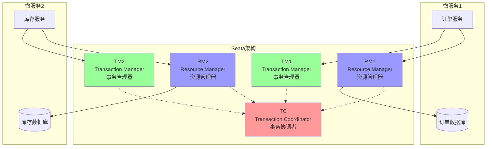

# Seata分布式事务

> **学习目标**：掌握分布式事务的解决方案和Seata的使用
> **核心内容**：分布式事务理论、Seata架构、AT/TCC/SAGA模式
> **预计时间**：8小时

## 分布式事务基础

### 什么是分布式事务

```java
/**
 * 分布式事务定义
 */
public class DistributedTransactionDefinition {

    /*
    分布式事务：
    在分布式系统中，涉及多个数据源或服务的事务操作。

    场景示例：
    1. 订单服务：创建订单
    2. 库存服务：扣减库存
    3. 账户服务：扣减余额

    三个操作要么全部成功，要么全部失败。

    与本地事务的区别：
    - 本地事务：单个数据库，ACID特性由数据库保证
    - 分布式事务：多个数据库/服务，需要额外机制保证一致性
    */

    public static void main(String[] args) {
        System.out.println("=== 分布式事务场景 ===\n");

        System.out.println("典型场景：");
        System.out.println("1. 电商下单：");
        System.out.println("   - 订单服务：创建订单");
        System.out.println("   - 库存服务：扣减库存");
        System.out.println("   - 支付服务：扣减余额\n");

        System.out.println("2. 跨行转账：");
        System.out.println("   - 银行A：扣款");
        System.out.println("   - 银行B：入账\n");

        System.out.println("3. 社交平台：");
        System.out.println("   - 用户服务：添加好友");
        System.out.println("   - 消息服务：发送通知");
        System.out.println("   - 动态服务：生成动态\n");

        System.out.println("挑战：");
        System.out.println("   - 网络不可靠");
        System.out.println("   - 服务可能宕机");
        System.out.println("   - 数据库隔离");
        System.out.println("   - 时序问题");
    }
}
```

### CAP理论与BASE理论

```java
/**
 * 分布式事务理论基础
 */
public class DistributedTransactionTheory {

    /*
    CAP理论：
    ========
    一个分布式系统最多同时满足以下三个特性中的两个：

    C - Consistency（一致性）：
        所有节点在同一时间看到的数据是一致的

    A - Availability（可用性）：
        系统提供的服务必须一直处于可用状态

    P - Partition Tolerance（分区容错性）：
        系统在遇到网络分区时，仍能正常运作

    CAP组合：
    1. CP：保证一致性和分区容错，牺牲可用性
       - 例子：Redis集群、Zookeeper
       - 场景：金融系统、配置中心

    2. AP：保证可用性和分区容错，牺牲一致性
       - 例子：Cassandra、DynamoDB
       - 场景：社交媒体、内容分发

    3. CA：保证一致性和可用性，牺牲分区容错
       - 现实中很难实现，因为网络分区不可避免


    BASE理论：
    =========
    是对CAP理论的补充，核心思想是最终一致性。

    BA - Basically Available（基本可用）：
        系统在出现故障时，允许损失部分可用性

    S - Soft State（软状态）：
        允许系统中的数据存在中间状态

    E - Eventually Consistent（最终一致性）：
        系统中的数据经过一段时间后，最终达到一致状态


    分布式事务解决方案对比：
    ========================
    1. 2PC/3PC：强一致性，性能差
    2. TCC：最终一致性，开发复杂
    3. 本地消息表：最终一致性，可靠性高
    4. MQ事务消息：最终一致性，性能好
    5. Seata AT模式：强一致性，对业务无侵入
    6. Seata TCC模式：最终一致性，性能好
    7. Seata SAGA模式：最终一致性，适合长事务
    */

    // 一致性级别示例
    public enum ConsistencyLevel {
        STRONG("强一致性", "Seata AT", "金融交易"),
        EVENTUAL("最终一致性", "MQ、TCC", "电商订单"),
        WEAK("弱一致性", "DNS", "内容分发");

        private final String name;
        private final String solution;
        private final String scenario;

        ConsistencyLevel(String name, String solution, String scenario) {
            this.name = name;
            this.solution = solution;
            this.scenario = scenario;
        }
    }
}
```

### 2PC与3PC协议

```java
/**
 * 两阶段提交和三阶段提交
 */
public class TwoAndThreePhaseCommit {

    /*
    2PC（Two-Phase Commit）两阶段提交：
    =================================
    准备阶段：
    1. 协调者向所有参与者发送准备请求
    2. 参与者执行事务但不提交
    3. 参与者回复Yes/No

    提交阶段：
    1. 如果所有参与者都回复Yes，协调者发送提交请求
    2. 如果有参与者回复No，协调者发送回滚请求
    3. 参与者执行提交或回滚

    优点：
    - 强一致性
    - 原理简单

    缺点：
    - 同步阻塞：所有参与者必须等待
    - 单点故障：协调者故障导致所有参与者阻塞
    - 数据不一致：协调者发送提交时部分参与者失败


    3PC（Three-Phase Commit）三阶段提交：
    ===================================
    相比2PC，增加了CanCommit阶段：

    CanCommit阶段：
    1. 协调者询问参与者是否可以提交
    2. 参与者根据自身情况回复Yes/No

    PreCommit阶段：
    1. 协调者发送预提交请求
    2. 参与者执行事务但不提交

    DoCommit阶段：
    1. 协调者发送提交请求
    2. 参与者执行提交

    优点：
    - 降低了阻塞时间
    - 在一定程度上解决了单点故障

    缺点：
    - 更加复杂
    - 性能更差
    */

    // 2PC示例
    public class TwoPhaseCommitExample {

        /**
         * 协调者
         */
        public class Coordinator {

            private List<Participant> participants;

            /**
             * 两阶段提交
             */
            public boolean twoPhaseCommit(Transaction transaction) {
                // 阶段1：准备阶段
                boolean allPrepared = true;
                for (Participant participant : participants) {
                    boolean prepared = participant.prepare(transaction);
                    if (!prepared) {
                        allPrepared = false;
                        break;
                    }
                }

                // 阶段2：提交或回滚
                if (allPrepared) {
                    // 所有参与者都准备好了，执行提交
                    for (Participant participant : participants) {
                        participant.commit(transaction);
                    }
                    return true;
                } else {
                    // 有参与者未准备好，执行回滚
                    for (Participant participant : participants) {
                        participant.rollback(transaction);
                    }
                    return false;
                }
            }
        }

        /**
         * 参与者接口
         */
        public interface Participant {
            boolean prepare(Transaction transaction);
            void commit(Transaction transaction);
            void rollback(Transaction transaction);
        }
    }
}
```

## Seata架构

### Seata核心概念



```java
/**
 * Seata核心组件
 */
public class SeataArchitecture {

    /*
    Seata三大角色：
    ==============

    1. TC (Transaction Coordinator) - 事务协调者
       - 维护全局事务的状态
       - 驱动全局事务的提交或回滚
       - Server端，需要独立部署

    2. TM (Transaction Manager) - 事务管理器
       - 定义全局事务的范围
       - 开始全局事务、提交或回滚全局事务
       - Client端，嵌入在应用程序中

    3. RM (Resource Manager) - 资源管理器
       - 管理分支事务的资源
       - 向TC注册分支事务
       - 汇报分支事务的状态
       - 驱动分支事务的提交或回滚
       - Client端，嵌入在应用程序中


    Seata工作流程：
    ==============
    1. TM向TC申请开启一个全局事务
    2. TC生成一个XID（全局事务ID）返回给TM
    3. TM将XID传播到所有的微服务
    4. RM向TC注册分支事务，并将其纳入XID对应的全局事务
    5. TM向TC发起针对XID的全局提交或回滚
    6. TC调度XID下的所有分支事务完成提交或回滚


    Seata支持模式：
    ==============
    1. AT模式：Auto Transaction，自动事务
       - 二阶段提交，对业务无侵入
       - 自动回滚
       - 适合大多数场景

    2. TCC模式：Try-Confirm-Cancel
       - 三阶段提交，需要业务实现
       - 性能好，灵活度高
       - 适合性能要求高的场景

    3. SAGA模式：长事务模式
       - 适合长事务
       - 通过状态机定义
       - 最终一致性
    */

    /**
     * XID结构
     */
    public class XID {
        /*
        XID格式：ip:port:transaction_id

        示例：192.168.1.100:8091:1234567890

        - ip: TC的IP地址
        - port: TC的端口
        - transaction_id: 全局事务ID
        */

        public static String getIpAddress(String xid) {
            return xid.split(":")[0];
        }

        public static String getPort(String xid) {
            return xid.split(":")[1];
        }

        public static String getTransactionId(String xid) {
            return xid.split(":")[2];
        }
    }
}
```

### Seata Server部署

```yaml
# docker-compose.yml
version: "3"
services:
  seata-server:
    image: seataio/seata-server:2.0.0
    container_name: seata-server
    ports:
      - "8091:8091"
      - "7091:7091"
    environment:
      - SEATA_PORT=8091
      - STORE_MODE=db
    volumes:
      - ./seata-config/registry.conf:/seata-server/resources/registry.conf
      - ./seata-config/file.conf:/seata-server/resources/file.conf
```

```conf
# registry.conf - 注册中心配置
registry {
  # file、nacos、eureka、redis、zk、consul、etcd3、sofa
  type = "nacos"

  nacos {
    application = "seata-server"
    serverAddr = "127.0.0.1:8848"
    group = "SEATA_GROUP"
    namespace = ""
    cluster = "default"
    username = "nacos"
    password = "nacos"
  }
}

config {
  # file、nacos、apollo、zk、consul、etcd3
  type = "nacos"

  nacos {
    serverAddr = "127.0.0.1:8848"
    namespace = ""
    group = "SEATA_GROUP"
    username = "nacos"
    password = "nacos"
    dataId = "seataServer.properties"
  }
}
```

```conf
# file.conf - 存储配置
store {
  mode = "db"

  db {
    datasource = "druid"
    dbType = "mysql"
    driverClassName = "com.mysql.jdbc.Driver"
    url = "jdbc:mysql://127.0.0.1:3306/seata?rewriteBatchedStatements=true"
    user = "mysql"
    password = "mysql"
    minConn = 5
    maxConn = 30
    globalTable = "global_table"
    branchTable = "branch_table"
    lockTable = "lock_table"
    maxWait = 5000
  }
}
```

## AT模式

### AT模式原理

```java
/**
 * AT模式详解
 */
public class ATModePrinciple {

    /*
    AT模式（Auto Transaction）：
    ===========================
    Seata的默认模式，对业务代码无侵入。

    核心机制：
    =========
    1. 一阶段：业务SQL执行 + 自动生成undo log
       - 解析SQL语义
       - 查询执行SQL前的数据（before image）
       - 执行业务SQL
       - 查询执行SQL后的数据（after image）
       - 生成undo log并插入undo_log表
       - 提交本地事务
       - 向TC汇报分支事务状态

    2. 二阶段：
       - 如果全局事务提交：异步删除undo log
       - 如果全局事务回滚：通过undo log回滚


    AT模式工作流程：
    ===============
    场景：扣减库存
    SQL: UPDATE inventory SET count = count - 10 WHERE id = 1

    一阶段（本地事务）：
    1. 查询before image: SELECT count FROM inventory WHERE id = 1
       -> before: {id: 1, count: 100}

    2. 执行业务SQL: UPDATE inventory SET count = count - 10 WHERE id = 1

    3. 查询after image: SELECT count FROM inventory WHERE id = 1
       -> after: {id: 1, count: 90}

    4. 生成undo log:
       {
         branchId: 1,
         xid: "xid",
         rollbackInfo: {
           beforeImage: {id: 1, count: 100},
           afterImage: {id: 1, count: 90},
           sqlType: "UPDATE",
           tableName: "inventory"
         }
       }

    5. 提交本地事务（业务SQL + undo log同时提交）

    二阶段（回滚）：
    如果需要回滚，执行：
    UPDATE inventory SET count = 100 WHERE id = 1

    二阶段（提交）：
    如果需要提交，删除undo log
    */

    // AT模式特点
    public class ATModeFeatures {

        /*
        优点：
        1. 对业务代码无侵入
        2. 二阶段提交非常快（只是删除undo log）
        3. 性能较好

        缺点：
        1. 需要数据库支持本地事务
        2. 隔离性默认是读未提交
        3. 存在脏写风险（需要全局锁）

        适用场景：
        1. 基于关系型数据库
        2. 大多数常规业务场景
        3. 对一致性要求不是特别高
        */
    }
}
```

### Spring Boot集成Seata AT

```xml
<!-- pom.xml -->
<dependencies>
    <!-- Seata Spring Boot Starter -->
    <dependency>
        <groupId>io.seata</groupId>
        <artifactId>seata-spring-boot-starter</artifactId>
        <version>2.0.0</version>
    </dependency>

    <!-- Nacos配置中心 -->
    <dependency>
        <groupId>com.alibaba.cloud</groupId>
        <artifactId>spring-cloud-starter-alibaba-nacos-config</artifactId>
    </dependency>

    <!-- Spring Cloud Alibaba Seata -->
    <dependency>
        <groupId>com.alibaba.cloud</groupId>
        <artifactId>spring-cloud-starter-alibaba-seata</artifactId>
    </dependency>
</dependencies>
```

```yaml
# application.yml
seata:
  enabled: true
  application-id: order-service
  tx-service-group: order-tx-group
  service:
    vgroup-mapping:
      order-tx-group: default
    grouplist:
      default: 127.0.0.1:8091
  registry:
    type: nacos
    nacos:
      server-addr: 127.0.0.1:8848
      namespace: ""
      group: SEATA_GROUP
      username: "nacos"
      password: "nacos"
  config:
    type: nacos
    nacos:
      server-addr: 127.0.0.1:8848
      namespace: ""
      group: SEATA_GROUP
      username: "nacos"
      password: "nacos"
```

### AT模式实战

```java
package com.example.seata.at;

import io.seata.spring.annotation.GlobalTransactional;
import org.springframework.beans.factory.annotation.Autowired;
import org.springframework.stereotype.Service;
import org.springframework.transaction.annotation.Transactional;

/**
 * 订单服务（AT模式）
 */
@Service
public class OrderServiceAT {

    @Autowired
    private OrderMapper orderMapper;

    @Autowired
    private InventoryFeignClient inventoryFeignClient;

    @Autowired
    private AccountFeignClient accountFeignClient;

    /**
     * 下单（分布式事务）
     * 使用@GlobalTransactional注解开启分布式事务
     */
    @GlobalTransactional(
        name = "create-order",  // 事务名称
        rollbackFor = Exception.class  // 回滚异常
    )
    public void createOrder(OrderCreateRequest request) {
        System.out.println("开始创建订单，XID: " + RootContext.getXID());

        // 1. 创建订单
        Order order = new Order();
        order.setUserId(request.getUserId());
        order.setProductId(request.getProductId());
        order.setCount(request.getCount());
        order.setAmount(request.getAmount());
        order.setStatus(OrderStatus.CREATED);
        orderMapper.insert(order);

        System.out.println("订单创建成功，订单ID: " + order.getId());

        // 2. 扣减库存（远程调用）
        inventoryFeignClient.deductStock(
            request.getProductId(),
            request.getCount()
        );

        System.out.println("库存扣减成功");

        // 3. 扣减余额（远程调用）
        accountFeignClient.deductBalance(
            request.getUserId(),
            request.getAmount()
        );

        System.out.println("余额扣减成功");

        // 4. 更新订单状态
        order.setStatus(OrderStatus.COMPLETED);
        orderMapper.updateById(order);

        System.out.println("订单完成");
    }

    /**
     * 库存服务（分支事务）
     */
    @Transactional
    public void deductStock(Long productId, Integer count) {
        System.out.println("扣减库存，XID: " + RootContext.getXID());

        // Seata会自动：
        // 1. 查询before image
        // 2. 执行业务SQL
        // 3. 查询after image
        // 4. 生成undo log
        // 5. 提交本地事务

        Inventory inventory = inventoryMapper.selectById(productId);
        if (inventory.getCount() < count) {
            throw new RuntimeException("库存不足");
        }

        inventory.setCount(inventory.getCount() - count);
        inventoryMapper.updateById(inventory);
    }

    /**
     * 账户服务（分支事务）
     */
    @Transactional
    public void deductBalance(Long userId, BigDecimal amount) {
        System.out.println("扣减余额，XID: " + RootContext.getXID());

        Account account = accountMapper.selectById(userId);
        if (account.getBalance().compareTo(amount) < 0) {
            throw new RuntimeException("余额不足");
        }

        account.setBalance(account.getBalance().subtract(amount));
        accountMapper.updateById(account);
    }
}
```

```sql
-- 需要在每个业务数据库创建undo_log表
CREATE TABLE IF NOT EXISTS `undo_log`
(
    `branch_id`     BIGINT       NOT NULL COMMENT 'branch transaction id',
    `xid`           VARCHAR(128) NOT NULL COMMENT 'global transaction id',
    `context`       VARCHAR(128) NOT NULL COMMENT 'undo_log context,such as serialization',
    `rollback_info` LONGBLOB     NOT NULL COMMENT 'rollback info',
    `log_status`    INT(11)      NOT NULL COMMENT '0:normal status,1:defense status',
    `log_created`   DATETIME     NOT NULL COMMENT 'create datetime',
    `log_modified`  DATETIME     NOT NULL COMMENT 'modify datetime',
    UNIQUE KEY `ux_undo_log` (`xid`, `branch_id`)
) ENGINE = InnoDB
  AUTO_INCREMENT = 1
  DEFAULT CHARSET = utf8mb4 COMMENT ='AT transaction undo log';
```

## TCC模式

### TCC模式原理

```java
/**
 * TCC模式详解
 */
public class TCCModePrinciple {

    /*
    TCC模式（Try-Confirm-Cancel）：
    ==============================
    一种柔性事务解决方案，需要业务实现三个接口。

    三个阶段：
    =========
    1. Try阶段：尝试执行
       - 完成业务检查
       - 资源预留（必须）
       - 可选操作：执行部分业务

    2. Confirm阶段：确认执行
       - Try成功后执行
       - 真正执行业务逻辑
       - 使用Try阶段预留的资源
       - 幂等性要求：多次调用结果一致

    3. Cancel阶段：取消执行
       - Try失败后执行
       - 释放Try阶段预留的资源
       - 幂等性要求：多次调用结果一致


    TCC与AT的区别：
    ==============
    AT模式：
    - 二阶段提交
    - 自动生成undo log
    - 对业务无侵入
    - 需要本地事务支持

    TCC模式：
    - 三阶段提交
    - 需要业务实现Try/Confirm/Cancel
    - 对业务有侵入
    - 不需要本地事务支持
    - 性能更好


    TCC设计要点：
    ============
    1. 空回滚：Cancel时Try未执行，仍需执行Cancel
    2. 悬挂：Cancel先于Try执行，需要识别并处理
    3. 幂等性：Confirm和Cancel必须幂等
    4. 资源预留：Try阶段必须预留资源
    */

    /**
     * TCC接口定义
     */
    public interface TCCService {

        /**
         * Try阶段：资源预留
         */
        @TwoPhaseBusinessAction(
            name = "inventoryTCC",
            commitMethod = "confirm",
            rollbackMethod = "cancel"
        )
        boolean tryDeductStock(
            BusinessActionContext context,
            @BusinessActionContextParameter(paramName = "productId") Long productId,
            @BusinessActionContextParameter(paramName = "count") Integer count
        );

        /**
         * Confirm阶段：确认扣减
         */
        boolean confirm(BusinessActionContext context);

        /**
         * Cancel阶段：取消扣减
         */
        boolean cancel(BusinessActionContext context);
    }
}
```

### TCC模式实战

```java
package com.example.seata.tcc;

import io.seata.rm.tcc.api.BusinessActionContext;
import io.seata.rm.tcc.api.BusinessActionContextParameter;
import io.seata.rm.tcc.api.TwoPhaseBusinessAction;
import org.springframework.beans.factory.annotation.Autowired;
import org.springframework.stereotype.Service;
import org.springframework.transaction.annotation.Transactional;

/**
 * 库存TCC服务
 */
@Service
public class InventoryTCCService {

    @Autowired
    private InventoryMapper inventoryMapper;

    @Autowired
    private InventoryReservedMapper inventoryReservedMapper;

    /**
     * Try阶段：资源预留
     */
    @TwoPhaseBusinessAction(
        name = "inventoryTCC",  // TCC Bean名称
        commitMethod = "confirm",  // Confirm方法名
        rollbackMethod = "cancel"  // Cancel方法名
    )
    @Transactional
    public boolean tryDeductStock(
        BusinessActionContext context,
        @BusinessActionContextParameter(paramName = "productId") Long productId,
        @BusinessActionContextParameter(paramName = "count") Integer count
    ) {
        String xid = context.getXid();
        System.out.println("Try阶段，XID: " + xid);

        // 1. 检查库存是否充足
        Inventory inventory = inventoryMapper.selectById(productId);
        if (inventory == null || inventory.getCount() < count) {
            throw new RuntimeException("库存不足");
        }

        // 2. 冻结库存（资源预留）
        InventoryReserved reserved = new InventoryReserved();
        reserved.setXid(xid);
        reserved.setProductId(productId);
        reserved.setCount(count);
        inventoryReservedMapper.insert(reserved);

        // 3. 预扣减库存（可选，也可以在Confirm阶段执行）
        inventory.setCount(inventory.getCount() - count);
        inventory.setFrozenCount(inventory.getFrozenCount() + count);
        inventoryMapper.updateById(inventory);

        return true;
    }

    /**
     * Confirm阶段：确认扣减
     */
    @Transactional
    public boolean confirm(BusinessActionContext context) {
        String xid = context.getXid();
        Long productId = (Long) context.getActionContext("productId");
        Integer count = (Integer) context.getActionContext("count");

        System.out.println("Confirm阶段，XID: " + xid);

        // 1. 获取冻结记录
        InventoryReserved reserved = inventoryReservedMapper.selectByXid(xid);
        if (reserved == null) {
            // 空回滚：没有冻结记录，说明Try未成功执行
            // 直接返回成功
            return true;
        }

        // 2. 删除冻结记录
        inventoryReservedMapper.deleteById(reserved.getId());

        // 3. 减少冻结数量（库存已在Try阶段扣减）
        Inventory inventory = inventoryMapper.selectById(productId);
        inventory.setFrozenCount(inventory.getFrozenCount() - count);
        inventoryMapper.updateById(inventory);

        return true;
    }

    /**
     * Cancel阶段：取消扣减
     */
    @Transactional
    public boolean cancel(BusinessActionContext context) {
        String xid = context.getXid();
        Long productId = (Long) context.getActionContext("productId");
        Integer count = (Integer) context.getActionContext("count");

        System.out.println("Cancel阶段，XID: " + xid);

        // 1. 获取冻结记录
        InventoryReserved reserved = inventoryReservedMapper.selectByXid(xid);
        if (reserved == null) {
            // 空回滚：没有冻结记录，说明Try未成功执行
            // 直接返回成功
            return true;
        }

        // 2. 删除冻结记录
        inventoryReservedMapper.deleteById(reserved.getId());

        // 3. 恢复库存
        Inventory inventory = inventoryMapper.selectById(productId);
        inventory.setCount(inventory.getCount() + count);
        inventory.setFrozenCount(inventory.getFrozenCount() - count);
        inventoryMapper.updateById(inventory);

        return true;
    }
}
```

```java
/**
 * 账户TCC服务
 */
@Service
public class AccountTCCService {

    @Autowired
    private AccountMapper accountMapper;

    @Autowired
    private AccountTransactionMapper accountTransactionMapper;

    /**
     * Try阶段：冻结余额
     */
    @TwoPhaseBusinessAction(
        name = "accountTCC",
        commitMethod = "confirm",
        rollbackMethod = "cancel"
    )
    @Transactional
    public boolean tryDeductBalance(
        BusinessActionContext context,
        @BusinessActionContextParameter(paramName = "userId") Long userId,
        @BusinessActionContextParameter(paramName = "amount") BigDecimal amount
    ) {
        String xid = context.getXid();
        System.out.println("Try阶段，XID: " + xid);

        // 1. 检查余额是否充足
        Account account = accountMapper.selectById(userId);
        if (account == null || account.getBalance().compareTo(amount) < 0) {
            throw new RuntimeException("余额不足");
        }

        // 2. 冻结余额
        AccountTransaction transaction = new AccountTransaction();
        transaction.setXid(xid);
        transaction.setUserId(userId);
        transaction.setAmount(amount);
        transaction.setType(TransactionType.FREEZE);
        accountTransactionMapper.insert(transaction);

        // 3. 扣减可用余额，增加冻结余额
        account.setBalance(account.getBalance().subtract(amount));
        account.setFrozenBalance(account.getFrozenBalance().add(amount));
        accountMapper.updateById(account);

        return true;
    }

    /**
     * Confirm阶段：确认扣减
     */
    @Transactional
    public boolean confirm(BusinessActionContext context) {
        String xid = context.getXid();
        Long userId = (Long) context.getActionContext("userId");
        BigDecimal amount = (BigDecimal) context.getActionContext("amount");

        System.out.println("Confirm阶段，XID: " + xid);

        // 1. 获取冻结记录
        AccountTransaction transaction = accountTransactionMapper.selectByXid(xid);
        if (transaction == null) {
            return true;  // 空回滚
        }

        // 2. 更新交易记录
        transaction.setType(TransactionType.DEDUCT);
        transaction.setStatus(TransactionStatus.COMPLETED);
        accountTransactionMapper.updateById(transaction);

        // 3. 减少冻结余额（余额已在Try阶段扣减）
        Account account = accountMapper.selectById(userId);
        account.setFrozenBalance(account.getFrozenBalance().subtract(amount));
        accountMapper.updateById(account);

        return true;
    }

    /**
     * Cancel阶段：取消扣减
     */
    @Transactional
    public boolean cancel(BusinessActionContext context) {
        String xid = context.getXid();
        Long userId = (Long) context.getActionContext("userId");
        BigDecimal amount = (BigDecimal) context.getActionContext("amount");

        System.out.println("Cancel阶段，XID: " + xid);

        // 1. 获取冻结记录
        AccountTransaction transaction = accountTransactionMapper.selectByXid(xid);
        if (transaction == null) {
            return true;  // 空回滚
        }

        // 2. 更新交易记录
        transaction.setStatus(TransactionStatus.CANCELLED);
        accountTransactionMapper.updateById(transaction);

        // 3. 恢复余额
        Account account = accountMapper.selectById(userId);
        account.setBalance(account.getBalance().add(amount));
        account.setFrozenBalance(account.getFrozenBalance().subtract(amount));
        accountMapper.updateById(account);

        return true;
    }
}
```

```java
/**
 * 订单服务（TCC模式）
 */
@Service
public class OrderServiceTCC {

    @Autowired
    private OrderMapper orderMapper;

    @Autowired
    private InventoryTCCService inventoryTCCService;

    @Autowired
    private AccountTCCService accountTCCService;

    /**
     * 下单（分布式事务）
     */
    @GlobalTransactional(name = "create-order-tcc", rollbackFor = Exception.class)
    public void createOrder(OrderCreateRequest request) {
        System.out.println("开始创建订单，XID: " + RootContext.getXID());

        // 1. 创建订单
        Order order = new Order();
        order.setUserId(request.getUserId());
        order.setProductId(request.getProductId());
        order.setCount(request.getCount());
        order.setAmount(request.getAmount());
        order.setStatus(OrderStatus.CREATED);
        orderMapper.insert(order);

        // 2. Try：扣减库存（资源预留）
        inventoryTCCService.tryDeductStock(
            null,  // Seata自动注入context
            request.getProductId(),
            request.getCount()
        );

        // 3. Try：扣减余额（资源预留）
        accountTCCService.tryDeductBalance(
            null,  // Seata自动注入context
            request.getUserId(),
            request.getAmount()
        );

        // 4. 更新订单状态
        order.setStatus(OrderStatus.COMPLETED);
        orderMapper.updateById(order);

        // 如果以上操作都成功，Seata自动调用Confirm
        // 如果有失败，Seata自动调用Cancel
    }
}
```

## SAGA模式

### SAGA模式原理

```java
/**
 * SAGA模式详解
 */
public class SAGAModePrinciple {

    /*
    SAGA模式：
    =========
    适合长事务的分布式事务解决方案。

    核心思想：
    将长事务拆分为多个本地短事务，由Saga事务协调器协调。

    正向流程：
    Service1完成 -> Service2完成 -> Service3完成

    补偿流程：
    如果Service3失败：
    Service2补偿 -> Service1补偿


    SAGA两种实现方式：
    =================
    1. 编排式（Choreography）：
       - 通过事件驱动
       - 每个服务监听事件并执行
       - 失败时发布补偿事件

    2. 协调式（Orchestration）：
       - 由协调器统一控制
       - 定义状态机
       - 更容易管理和监控


    SAGA vs TCC：
    ============
    SAGA：
    - 适合长事务（多个服务、多个步骤）
    - 补偿操作与业务逻辑分离
    - 最终一致性
    - 无法保证隔离性

    TCC：
    - 适合短事务（2-3个服务）
    - Try/Confirm/Cancel紧密耦合
    - 性能更好
    - 可保证隔离性
    */

    /**
     * SAGA状态定义
     */
    public enum SagaState {
        STARTED,      // 已开始
        COMPENSATING, // 补偿中
        COMPLETED,    // 已完成
        FAILED        // 失败
    }
}
```

### SAGA状态机实现

```java
package com.example.seata.saga;

import java.util.List;

/**
 * SAGA状态机定义
 */
public class OrderSagaState {

    /*
    状态机定义：
    ==========
    1. 创建订单
    2. 扣减库存
    3. 扣减余额
    4. 更新订单状态

    补偿操作：
    2. 恢复库存
    3. 恢复余额
    1. 取消订单
    */

    /**
     * SAGA步骤定义
     */
    public static class SagaStep {
        private String name;           // 步骤名称
        private String action;         // 执行动作
        private String compensate;     // 补偿动作

        // getters and setters
    }

    /**
     * 订单SAGA流程
     */
    public List<SagaStep> defineOrderSaga() {
        return List.of(
            // 步骤1：创建订单
            new SagaStep(
                "createOrder",
                "orderService.createOrder",
                "orderService.cancelOrder"
            ),

            // 步骤2：扣减库存
            new SagaStep(
                "deductStock",
                "inventoryService.deductStock",
                "inventoryService.addStock"
            ),

            // 步骤3：扣减余额
            new SagaStep(
                "deductBalance",
                "accountService.deductBalance",
                "accountService.addBalance"
            ),

            // 步骤4：更新订单状态
            new SagaStep(
                "updateOrderStatus",
                "orderService.updateStatus",
                null  // 最后一步不需要补偿
            )
        );
    }
}
```

```json
// saga状态机定义文件（saga_order.json）
{
  "Name": "OrderSaga",
  "Comment": "订单SAGA状态机",
  "Version": "0.0.1",
  "StartState": "CreateOrder",
  "States": {
    "CreateOrder": {
      "Type": "ServiceTask",
      "ServiceName": "orderService",
      "ServiceMethod": "createOrder",
      "CompensateState": "CancelOrder",
      "Next": "DeductStock",
      "Input": ["$input"],
      "Output": {
        "orderId": "$.orderId"
      }
    },
    "DeductStock": {
      "Type": "ServiceTask",
      "ServiceName": "inventoryService",
      "ServiceMethod": "deductStock",
      "CompensateState": "AddStock",
      "Next": "DeductBalance",
      "Input": ["$input.productId", "$input.count"],
      "Output": {
        "inventory": "$.inventory"
      }
    },
    "DeductBalance": {
      "Type": "ServiceTask",
      "ServiceName": "accountService",
      "ServiceMethod": "deductBalance",
      "CompensateState": "AddBalance",
      "Next": "UpdateOrderStatus",
      "Input": ["$input.userId", "$input.amount"],
      "Output": {
        "balance": "$.balance"
      }
    },
    "UpdateOrderStatus": {
      "Type": "ServiceTask",
      "ServiceName": "orderService",
      "ServiceMethod": "updateOrderStatus",
      "IsForCompensation": false,
      "Input": ["$.orderId"],
      "End": true
    },
    "CancelOrder": {
      "Type": "Compensation",
      "ServiceName": "orderService",
      "ServiceMethod": "cancelOrder",
      "Input": ["$.orderId"]
    },
    "AddStock": {
      "Type": "Compensation",
      "ServiceName": "inventoryService",
      "ServiceMethod": "addStock",
      "Input": ["$.productId", "$.count"]
    },
    "AddBalance": {
      "Type": "Compensation",
      "ServiceName": "accountService",
      "ServiceMethod": "addBalance",
      "Input": ["$.userId", "$.amount"]
    }
  }
}
```

```java
/**
 * 订单SAGA服务
 */
@Service
public class OrderSagaService {

    @Autowired
    private StateMachineEngine stateMachineEngine;

    /**
     * 使用SAGA下单
     */
    public void createOrderWithSaga(OrderCreateRequest request) {
        // 1. 构建输入参数
        Map<String, Object> startParams = new HashMap<>();
        startParams.put("userId", request.getUserId());
        startParams.put("productId", request.getProductId());
        startParams.put("count", request.getCount());
        startParams.put("amount", request.getAmount());

        // 2. 启动状态机
        StateMachineInstance instance = stateMachineEngine.start(
            "OrderSaga",        // 状态机名称
            null,              // 业务key
            startParams        // 输入参数
        );

        // 3. 等待执行完成
        if (instance.getStatus() == ExecutionStatus.SU) {
            System.out.println("订单创建成功");
        } else {
            System.out.println("订单创建失败: " + instance.getException());
        }
    }

    /**
     * 创建订单（SAGA步骤）
     */
    public void createOrder(Map<String, Object> params) {
        Order order = new Order();
        order.setUserId((Long) params.get("userId"));
        order.setProductId((Long) params.get("productId"));
        order.setStatus(OrderStatus.CREATED);
        orderMapper.insert(order);

        // 返回orderId供后续步骤使用
        return Map.of("orderId", order.getId());
    }

    /**
     * 取消订单（补偿步骤）
     */
    public void cancelOrder(Map<String, Object> params) {
        Long orderId = (Long) params.get("orderId");
        Order order = orderMapper.selectById(orderId);
        order.setStatus(OrderStatus.CANCELLED);
        orderMapper.updateById(order);
    }
}
```

## 避坑指南

### Seata常见问题

```java
/**
 * Seata常见陷阱
 */
public class SeataPitfalls {

    /*
    1. AT模式脏写问题
    ==================
    问题：两个全局事务同时修改同一行数据
    - 全局事务A：修改库存 100 -> 90
    - 全局事务B：修改库存 100 -> 95
    - 如果A回滚，B的修改也会被回滚

    解决：
    - Seata使用全局锁解决
    - 一阶段本地事务提交前，先获取全局锁
    - 如果全局锁被占用，等待重试

    配置：
    spring.cloud.alibaba.seata.enable-global-transaction=true


    2. AT模式读未提交问题
    =====================
    问题：AT模式默认隔离级别是读未提交
    - 全局事务A：修改库存 100 -> 90（未提交）
    - 全局事务B：读取库存为90
    - 全局事务A回滚，库存恢复为100
    - 全局事务B读到的是脏数据

    解决：
    - 方案1：SELECT ... FOR UPDATE（获取全局锁）
    - 方案2：使用Seata的隔离注解 @GlobalLock


    3. TCC空回滚问题
    ================
    问题：Cancel时Try未执行
    - Try执行超时，TC认为是失败
    - 触发Cancel
    - 但Try可能实际执行成功了

    解决：
    - Cancel阶段检查Try是否执行
    - 如果有冻结记录，正常Cancel
    - 如果没有冻结记录，直接返回成功（空回滚）


    4. TCC悬挂问题
    ==============
    问题：Cancel先于Try执行
    - Try执行超时
    - Cancel执行成功
    - Try才真正执行成功
    - 导致资源一直被占用

    解决：
    - Cancel阶段记录已取消标记
    - Try阶段检查是否有取消标记
    - 如果有，拒绝执行


    5. 性能问题
    ===========
    问题：Seata性能较差
    - AT模式：需要生成undo log，性能损耗20-30%
    - TCC模式：需要数据库操作次数增加
    - 锁竞争：全局锁导致等待

    解决：
    - 能不用分布式事务就不用
    - 优先使用最终一致性（MQ）
    - AT模式适合一般场景
    - TCC模式适合性能要求高的场景
    - 优化数据库索引，减少锁竞争
    */

    /**
     * 问题1：AT模式全局锁
     */
    @GlobalTransactional
    public void atWithGlobalLock() {
        // 正常执行，Seata自动获取全局锁
        orderMapper.updateById(order);

        // 如果需要手动获取全局锁
        inventoryMapper.selectForUpdate(productId);  // SELECT ... FOR UPDATE
        inventoryMapper.deductStock(productId, count);
    }

    /**
     * 问题2：AT模式隔离级别
     */
    @GlobalLock  // 全局锁注解
    @Transactional
    public Inventory queryInventoryWithLock(Long productId) {
        // 查询时获取全局锁，防止读到脏数据
        Inventory inventory = inventoryMapper.selectById(productId);
        return inventory;
    }

    /**
     * 问题3：TCC空回滚
     */
    public boolean cancel(BusinessActionContext context) {
        String xid = context.getXid();
        InventoryReserved reserved = inventoryReservedMapper.selectByXid(xid);

        if (reserved == null) {
            // 空回滚：Try未执行，直接返回成功
            return true;
        }

        // 正常Cancel逻辑
        // ...
        return true;
    }

    /**
     * 问题4：TCC悬挂
     */
    public boolean tryDeductStock(BusinessActionContext context, Long productId, Integer count) {
        String xid = context.getXid();

        // 检查是否已经Cancel
        InventoryReserved reserved = inventoryReservedMapper.selectByXid(xid);
        if (reserved != null && reserved.getStatus() == ReservedStatus.CANCELLED) {
            // 已经Cancel，拒绝Try（防止悬挂）
            return false;
        }

        // 正常Try逻辑
        // ...
        return true;
    }

    public boolean cancel(BusinessActionContext context) {
        String xid = context.getXid();

        InventoryReserved reserved = inventoryReservedMapper.selectByXid(xid);
        if (reserved == null) {
            // 插入取消记录（防止后续Try执行）
            reserved = new InventoryReserved();
            reserved.setXid(xid);
            reserved.setStatus(ReservedStatus.CANCELLED);
            inventoryReservedMapper.insert(reserved);
            return true;
        }

        // 正常Cancel逻辑
        // ...
        return true;
    }
}
```

## 最佳实践

### Seata使用建议

```java
/**
 * Seata最佳实践
 */
public class SeataBestPractices {

    /*
    1. 是否需要分布式事务
    =====================
    ❌ 不需要分布式事务的场景：
    - 单个服务内的操作
    - 可以容忍最终一致性的场景
    - 查询类操作

    ✅ 需要分布式事务的场景：
    - 跨服务的写操作
    - 强一致性要求
    - 金融交易

    2. 模式选择
    ==========
    AT模式：
    ✅ 基于关系型数据库
    ✅ 对业务无侵入
    ✅ 大多数常规场景
    ❌ 性能要求特别高

    TCC模式：
    ✅ 性能要求高
    ✅ 不基于关系型数据库
    ✅ 业务逻辑复杂
    ❌ 愿意编写Try/Confirm/Cancel

    SAGA模式：
    ✅ 长事务
    ✅ 业务流程复杂
    ✅ 最终一致性可接受
    ❌ 强一致性要求

    3. 性能优化
    ==========
    ✅ 缩小事务范围
    ✅ 优化SQL性能
    ✅ 减少锁竞争
    ✅ 使用连接池
    ✅ 合理设置超时时间

    4. 异常处理
    ==========
    ✅ 设置rollbackFor = Exception.class
    ✅ 捕获异常后重新抛出
    ✅ 合理使用重试机制
    ✅ 记录详细日志
    */

    /**
     * 最佳实践1：缩小事务范围
     */
    @GlobalTransactional
    public void createOrderOptimized(OrderCreateRequest request) {
        // ✅ 只包含必要的写操作
        Order order = buildOrder(request);
        orderMapper.insert(order);

        inventoryFeignClient.deductStock(request.getProductId(), request.getCount());
        accountFeignClient.deductBalance(request.getUserId(), request.getAmount());

        // ❌ 不要包含查询、缓存、消息发送等操作
        // List<Inventory> inventory = inventoryMapper.selectAll();  // 不要
        // redisTemplate.opsForValue().set(key, value);  // 不要
        // rocketMQTemplate.send(topic, message);  // 不要
    }

    /**
     * 最佳实践2：异常处理
     */
    @GlobalTransactional(rollbackFor = Exception.class)
    public void createOrderWithExceptionHandling(OrderCreateRequest request) {
        try {
            // 业务逻辑
            createOrder(request);

        } catch (BusinessException e) {
            // 业务异常，记录日志后重新抛出
            log.error("业务异常: {}", e.getMessage());
            throw e;  // 必须重新抛出，否则Seata不会回滚

        } catch (Exception e) {
            // 系统异常，记录日志后重新抛出
            log.error("系统异常", e);
            throw e;  // 必须重新抛出
        }
    }

    /**
     * 最佳实践3：TCC幂等性
     */
    public boolean confirm(BusinessActionContext context) {
        String xid = context.getXid();

        // 幂等性检查
        AccountTransaction transaction = accountTransactionMapper.selectByXid(xid);
        if (transaction != null && transaction.getStatus() == TransactionStatus.COMPLETED) {
            // 已完成，直接返回成功
            return true;
        }

        // 执行Confirm逻辑
        // ...

        // 更新状态
        transaction.setStatus(TransactionStatus.COMPLETED);
        accountTransactionMapper.updateById(transaction);

        return true;
    }
}
```

## 本章小结

### 学习成果检查

✅ **分布式事务理论**：CAP、BASE、2PC/3PC
✅ **Seata架构**：TC、TM、RM三角色
✅ **AT模式**：自动事务、undo log、全局锁
✅ **TCC模式**：Try/Confirm/Cancel、资源预留、幂等性
✅ **SAGA模式**：状态机、补偿机制、长事务
✅ **最佳实践**：模式选择、性能优化、异常处理

### 核心技术点

- **分布式事务理论**：CAP理论、BASE理论、2PC/3PC
- **Seata架构**：TC协调者、TM管理器、RM资源管理器
- **AT模式**：自动回滚、undo log、全局锁
- **TCC模式**：Try资源预留、Confirm确认、Cancel取消
- **SAGA模式**：状态机定义、补偿操作、长事务

### 下一步学习

- **第22章**：Spring Cloud Gateway网关
- **第26章**：电商平台微服务版

---

**学习时间**：约8小时
**难度等级**：★★★★☆
**重要程度**：★★★★★（分布式必学）
