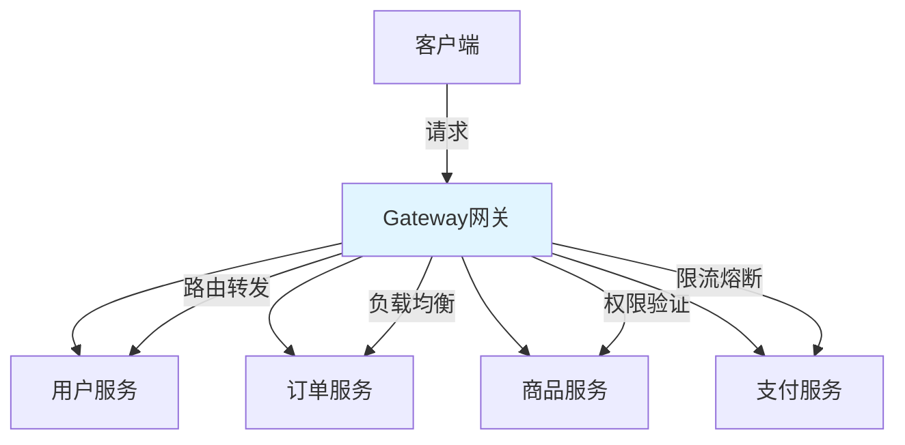

# Spring Cloud Gateway网关

> **学习目标**：掌握微服务网关的核心技术
> **核心内容**：Gateway核心概念、路由配置、断言过滤器、限流熔断、统一鉴权
> **预计时间**：5小时

## Gateway概述

### 什么是API网关



```java
/**
 * API网关核心概念
 */
public class APIGatewayConcept {

    /*
    ╔═════════════════════════════════════════════════════════════════╗
    ║                    API网关核心功能                              ║
    ╠═════════════════════════════════════════════════════════════════╣
    ║                                                                ║
    ║ 1. 路由转发                                                      ║
    ║    - 将外部请求转发到具体的微服务                                ║
    ║    - 支持多种路由匹配策略                                        ║
    ║    - 动态路由配置                                                ║
    ║                                                                ║
    ║ 2. 负载均衡                                                      ║
    ║    - 集成Ribbon/LoadBalancer                                    ║
    ║    - 支持多种负载均衡策略                                        ║
    ║    - 自动故障转移                                                ║
    ║                                                                ║
    ║ 3. 权限验证                                                      ║
    ║    - 统一的身份认证                                              ║
    ║    - 细粒度的权限控制                                            ║
    ║    - 集成OAuth2、JWT                                             ║
    ║                                                                ║
    ║ 4. 限流熔断                                                      ║
    ║    - 集成Resilience4j                                           ║
    ║    - 保护后端服务                                                ║
    ║    - 防止雪崩效应                                                ║
    ║                                                                ║
    ║ 5. 日志监控                                                      ║
    ║    - 统一的日志记录                                              ║
    ║    - 链路追踪集成                                                ║
    ║    - 指标监控                                                    ║
    ║                                                                ║
    ║ 6. 协议转换                                                      ║
    ║    - HTTP/HTTPS转换                                              ║
    ║    - WebSocket支持                                              ║
    ║                                                                ║
    ╚═════════════════════════════════════════════════════════════════╝
    */
}
```

### Gateway vs Zuul

```java
/**
 * Gateway vs Zuul对比
 */
public classGatewayVsZuul {

    /*
    ╔═════════════════════════════════════════════════════════════════╗
    ║              Gateway vs Zuul 1.x vs Zuul 2.x                    ║
    ╠═════════════════════════════════════════════════════════════════╣
    ║ 特性            │ Zuul 1.x │ Zuul 2.x │ Spring Cloud Gateway    ║
    ╠═════════════════════════════════════════════════════════════════╣
    ║ 架构            │ 阻塞式   │ 非阻塞式 │ 非阻塞式                  ║
    ║ 底层            │ Servlet  │ Netty    │ WebFlux+Netty           ║
    ║ 性能            │ 低       │ 高       │ 极高                     ║
    ║ 吞吐量          │ 中等     │ 高       │ 非常高                   ║
    ║ 资源消耗        │ 高       │ 中       │ 低                       ║
    ║ 动态路由        │ 支持     │ 支持     │ 强大支持                 ║
    ║ 集成难度        │ 简单     │ 复杂     │ 简单                     ║
    ║ Spring版本     │ 任意     │ 任意     │ Spring Boot 2.x/3.x     ║
    ║ 长连接          │ 差       │ 好       │ 优秀                     ║
    ║ 编程模型        │ 注解     │ 注解     │ 响应式                   ║
    ╚═════════════════════════════════════════════════════════════════╝

    推荐方案（2024-2026）：
    ===================
    • 新项目：使用Spring Cloud Gateway
    • 已有Zuul项目：可继续使用或逐步迁移
    • 高并发场景：优先选择Gateway
    • 需要WebSocket：选择Gateway
    */
}
```

## Gateway核心概念

### 三大核心组件

```java
/**
 * Gateway核心组件
 */
public class GatewayCoreComponents {

    /*
    ╔═════════════════════════════════════════════════════════════════╗
    ║                    Gateway三大核心组件                          ║
    ╠═════════════════════════════════════════════════════════════════╣
    ║                                                                ║
    ║ 1. Route（路由）                                               ║
    ║    ┌─────────────────────────────────────────────────────┐     ║
    ║    │  ID：路由唯一标识                                      │     ║
    ║    │  URI：目标URI（lb://service-id 或具体URL）              │     ║
    ║    │  Predicates：断言集合（匹配条件）                       │     ║
    ║    │  Filters：过滤器集合（请求/响应处理）                    │     ║
    ║    └─────────────────────────────────────────────────────┘     ║
    ║                                                                ║
    ║ 2. Predicate（断言）                                           ║
    ║    ┌─────────────────────────────────────────────────────┐     ║
    ║    │  Path：路径匹配                                        │     ║
    ║    │  Method：请求方法匹配                                   │     ║
    ║    │  Header：请求头匹配                                     │     ║
    ║    │  Query：参数匹配                                        │     ║
    ║    │  Cookie：Cookie匹配                                     │     ║
    ║    │  Time：时间匹配                                         │     ║
    ║    └─────────────────────────────────────────────────────┘     ║
    ║                                                                ║
    ║ 3. Filter（过滤器）                                           ║
    ║    ┌─────────────────────────────────────────────────────┐     ║
    ║    │  Pre Filter：前置过滤器（请求转发前）                  │     ║
    ║    │  Post Filter：后置过滤器（响应返回前）                 │     ║
    ║    │  全局过滤器：影响所有路由                               │     ║
    ║    │  局部过滤器：只影响特定路由                              │     ║
    ║    └─────────────────────────────────────────────────────┘     ║
    ║                                                                ║
    ╚═════════════════════════════════════════════════════════════════╝

    工作流程：
    =========
    1. 客户端发送请求到Gateway
    2. Gateway Handler Mapping匹配路由
    3. Gateway Web Handler处理请求
    4. 执行Pre Filter链
    5. 转发请求到后端服务
    6. 后端服务返回响应
    7. 执行Post Filter链
    8. 返回响应给客户端
    */
}
```

## Gateway快速入门

### Maven依赖

```xml
<!-- pom.xml -->
<?xml version="1.0" encoding="UTF-8"?>
<project xmlns="http://maven.apache.org/POM/4.0.0"
         xmlns:xsi="http://www.w3.org/2001/XMLSchema-instance"
         xsi:schemaLocation="http://maven.apache.org/POM/4.0.0
         https://maven.apache.org/xsd/maven-4.0.0.xsd">
    <modelVersion>4.0.0</modelVersion>

    <parent>
        <groupId>org.springframework.boot</groupId>
        <artifactId>spring-boot-starter-parent</artifactId>
        <version>3.2.0</version>
    </parent>

    <groupId>com.example</groupId>
    <artifactId>gateway-service</artifactId>
    <version>1.0.0</version>

    <properties>
        <java.version>17</java.version>
        <spring-cloud.version>2023.0.0</spring-cloud.version>
    </properties>

    <dependencies>
        <!-- Spring Cloud Gateway -->
        <dependency>
            <groupId>org.springframework.cloud</groupId>
            <artifactId>spring-cloud-starter-gateway</artifactId>
        </dependency>

        <!-- Nacos服务发现 -->
        <dependency>
            <groupId>com.alibaba.cloud</groupId>
            <artifactId>spring-cloud-starter-alibaba-nacos-discovery</artifactId>
        </dependency>

        <!-- Nacos配置中心 -->
        <dependency>
            <groupId>com.alibaba.cloud</groupId>
            <artifactId>spring-cloud-starter-alibaba-nacos-config</artifactId>
        </dependency>

        <!-- Redis（用于限流） -->
        <dependency>
            <groupId>org.springframework.boot</groupId>
            <artifactId>spring-boot-starter-data-redis-reactive</artifactId>
        </dependency>

        <!-- 监控 -->
        <dependency>
            <groupId>org.springframework.boot</groupId>
            <artifactId>spring-boot-starter-actuator</artifactId>
        </dependency>

        <!-- Lombok -->
        <dependency>
            <groupId>org.projectlombok</groupId>
            <artifactId>lombok</artifactId>
            <optional>true</optional>
        </dependency>
    </dependencies>

    <dependencyManagement>
        <dependencies>
            <dependency>
                <groupId>org.springframework.cloud</groupId>
                <artifactId>spring-cloud-dependencies</artifactId>
                <version>${spring-cloud.version}</version>
                <type>pom</type>
                <scope>import</scope>
            </dependency>
            <dependency>
                <groupId>com.alibaba.cloud</groupId>
                <artifactId>spring-cloud-alibaba-dependencies</artifactId>
                <version>2023.0.0.0</version>
                <type>pom</type>
                <scope>import</scope>
            </dependency>
        </dependencies>
    </dependencyManagement>
</project>
```

### 基础配置

```yaml
# application.yml
server:
  port: 9090

spring:
  application:
    name: gateway-service

  cloud:
    # Nacos服务发现
    nacos:
      discovery:
        server-addr: localhost:8848
        namespace: public
        group: DEFAULT_GROUP

    # Gateway配置
    gateway:
      # 路由配置
      routes:
        # 用户服务路由
        - id: user-service
          uri: lb://user-service
          predicates:
            - Path=/api/users/**
          filters:
            - StripPrefix=2

        # 订单服务路由
        - id: order-service
          uri: lb://order-service
          predicates:
            - Path=/api/orders/**
          filters:
            - StripPrefix=2

        # 商品服务路由
        - id: product-service
          uri: lb://product-service
          predicates:
            - Path=/api/products/**
          filters:
            - StripPrefix=2

      # 全局配置
      default-filters:
        - name: Retry
          args:
            retries: 3
            statuses: BAD_GATEWAY,SERVICE_UNAVAILABLE
            methods: GET,POST
            backoff:
              firstBackoff: 10ms
              maxBackoff: 50ms
              factor: 2
              basedOnPreviousValue: false

      # 跨域配置
      globalcors:
        corsConfigurations:
          '[/**]':
            allowedOriginPatterns: "*"
            allowedMethods:
              - GET
              - POST
              - PUT
              - DELETE
              - OPTIONS
            allowedHeaders: "*"
            allowCredentials: true
            maxAge: 3600

# Actuator配置
management:
  endpoints:
    web:
      exposure:
        include: gateway,health,info
  endpoint:
    health:
      show-details: always

# 日志配置
logging:
  level:
    org.springframework.cloud.gateway: DEBUG
    org.springframework.web.reactive: DEBUG
```

## 断言配置

### 内置断言

```java
package com.example.gateway.predicate;

import org.springframework.cloud.gateway.handler.predicate.*;
import org.springframework.context.annotation.*;
import org.springframework.stereotype.Component;
import java.time.*;
import java.time.ZoneId;
import java.util.*;

/**
 * Gateway断言配置
 */
@Configuration
public class GatewayPredicateConfig {

    /**
     * 路径断言
     */
    @Bean
    public RouteLocator customRouteLocator(RouteLocatorBuilder builder) {
        return builder.routes()
                // 1. Path断言：精确匹配
                .route("path-route-1", r -> r
                    .path("/api/users/**")
                    .uri("lb://user-service"))

                // 2. Path断言：多路径匹配
                .route("path-route-2", r -> r
                    .path("/api/users/**", "/api/profiles/**")
                    .uri("lb://user-service"))

                // 3. Method断言：请求方法
                .route("method-route", r -> r
                    .method("GET", "POST")
                    .and()
                    .path("/api/orders/**")
                    .uri("lb://order-service"))

                // 4. Header断言：请求头
                .route("header-route", r -> r
                    .header("X-Request-Id", "\\d+")
                    .and()
                    .path("/api/products/**")
                    .uri("lb://product-service"))

                // 5. Query断言：查询参数
                .route("query-route", r -> r
                    .query("version", "1.0")
                    .and()
                    .path("/api/**")
                    .uri("lb://default-service"))

                // 6. Cookie断言：Cookie匹配
                .route("cookie-route", r -> r
                    .cookie("session_id", ".*")
                    .path("/api/users/**")
                    .uri("lb://user-service"))

                // 7. Host断言：主机名
                .route("host-route", r -> r
                    .host("api.example.com", "**.example.com")
                    .uri("lb://api-service"))

                // 8. RemoteAddr断言：远程IP
                .route("ip-route", r -> r
                    .remoteAddr("192.168.1.0/24", "127.0.0.1")
                    .path("/admin/**")
                    .uri("lb://admin-service"))

                // 9. Before断言：时间之前
                .route("before-route", r -> r
                    .before(ZonedDateTime.now(ZoneId.of("UTC")).plusMinutes(10))
                    .path("/api/legacy/**")
                    .uri("lb://legacy-service"))

                // 10. After断言：时间之后
                .route("after-route", r -> r
                    .after(ZonedDateTime.now(ZoneId.of("UTC")))
                    .path("/api/v2/**")
                    .uri("lb://new-service"))

                // 11. Between断言：时间区间
                .route("between-route", r -> r
                    .between(
                        ZonedDateTime.now(ZoneId.of("UTC")),
                        ZonedDateTime.now(ZoneId.of("UTC")).plusHours(1)
                    )
                    .path("/api/promo/**")
                    .uri("lb://promo-service"))

                // 12. Weight断言：权重路由（金丝雀发布）
                .route("weight-route-a", r -> r
                    .weight("group1", 8)  // 80%流量
                    .and()
                    .path("/api/**")
                    .uri("lb://service-v1"))
                .route("weight-route-b", r -> r
                    .weight("group1", 2)  // 20%流量
                    .and()
                    .path("/api/**")
                    .uri("lb://service-v2"))

                .build();
    }
}
```

### 自定义断言

```java
package com.example.gateway.predicate;

import lombok.Data;
import org.springframework.cloud.gateway.handler.predicate.AbstractRoutePredicateFactory;
import org.springframework.stereotype.Component;
import org.springframework.web.server.ServerWebExchange;
import java.util.function.Predicate;

/**
 * 自定义断言：ApiVersion
 * 匹配请求头中的API版本
 */
@Component
public class ApiVersionRoutePredicateFactory
        extends AbstractRoutePredicateFactory<ApiVersionRoutePredicateFactory.Config> {

    public ApiVersionRoutePredicateFactory() {
        super(Config.class);
    }

    @Override
    public Predicate<ServerWebExchange> apply(Config config) {
        return exchange -> {
            String version = exchange.getRequest()
                .getHeaders()
                .getFirst(config.getHeaderName());

            return config.getVersion().equals(version);
        };
    }

    @Data
    public static class Config {
        private String headerName = "X-API-Version";
        private String version = "1.0";
    }
}
```

使用自定义断言：

```yaml
spring:
  cloud:
    gateway:
      routes:
        - id: api-v1
          uri: lb://service-v1
          predicates:
            - ApiVersion=1.0  # 使用自定义断言

        - id: api-v2
          uri: lb://service-v2
          predicates:
            - ApiVersion=2.0
```

## 过滤器配置

### 内置过滤器

```java
package com.example.gateway.filter;

import org.springframework.cloud.gateway.filter.*;
import org.springframework.context.annotation.*;
import org.springframework.stereotype.Component;

/**
 * Gateway过滤器配置
 */
@Configuration
public class GatewayFilterConfig {

    /**
     * 路由级别过滤器配置
     */
    @Bean
    public RouteLocator filterRouteLocator(RouteLocatorBuilder builder) {
        return builder.routes()
                // StripPrefix：去除路径前缀
                .route("strip-prefix-route", r -> r
                    .path("/api/v1/user-service/**")
                    .filters(f -> f
                        .stripPrefix(2)  // 去掉/api/v1，转发到user-service
                        .addRequestHeader("X-Custom-Header", "custom-value")
                    )
                    .uri("lb://user-service"))

                // AddRequestHeader：添加请求头
                .route("add-header-route", r -> r
                    .path("/api/orders/**")
                    .filters(f -> f
                        .addRequestHeader("X-Request-From", "gateway")
                        .addRequestHeader("X-Request-Id", "#{T(java.util.UUID).randomUUID()}")
                    )
                    .uri("lb://order-service"))

                // AddRequestParameter：添加请求参数
                .route("add-param-route", r -> r
                    .path("/api/products/**")
                    .filters(f -> f
                        .addRequestParameter("version", "1.0")
                        .addRequestParameter("source", "gateway")
                    )
                    .uri("lb://product-service"))

                // AddResponseHeader：添加响应头
                .route("response-header-route", r -> r
                    .path("/api/**")
                    .filters(f -> f
                        .addResponseHeader("X-Response-From", "gateway")
                        .addResponseHeader("X-Powered-By", "Spring Cloud Gateway")
                    )
                    .uri("lb://default-service"))

                // RedirectTo：重定向
                .route("redirect-route", r -> r
                    .path("/old-api/**")
                    .filters(f -> f
                        .redirect(302, "/new-api/${remaining_path}")
                    )
                    .uri("lb://default-service"))

                // SetPath：设置路径
                .route("set-path-route", r -> r
                    .path("/api/{segment}")
                    .filters(f -> f
                        .setPath("/${segment}")  // 替换路径
                    )
                    .uri("lb://default-service"))

                // SetStatus：设置响应状态码
                .route("set-status-route", r -> r
                    .path("/error/**")
                    .filters(f -> f
                        .setStatus(404)
                    )
                    .uri("lb://default-service"))

                // RewritePath：路径重写
                .route("rewrite-path-route", r -> r
                    .path("/api/v1/(?<segment>.*)")
                    .filters(f -> f
                        .rewritePath("/api/v1/(?<segment>.*)", "/${segment}")
                    )
                    .uri("lb://user-service"))

                // RequestRateLimiter：限流
                .route("rate-limit-route", r -> r
                    .path("/api/public/**")
                    .filters(f -> f
                        .requestRateLimiter(config -> config
                            .setRateLimiter(redisRateLimiter())
                            .setKeyResolver(userKeyResolver())
                        )
                    )
                    .uri("lb://public-service"))

                .build();
    }

    /**
     * Redis限流器
     */
    @Bean
    public RedisRateLimiter redisRateLimiter() {
        return new RedisRateLimiter(10, 20, 1);  // 每秒10个令牌，突发20个
    }

    /**
     * Key解析器：基于用户ID限流
     */
    @Bean
    public KeyResolver userKeyResolver() {
        return exchange -> exchange.getRequest()
            .getQueryParams()
            .getFirst("userId")
            .map(userId -> userId);
    }

    /**
     * Key解析器：基于IP限流
     */
    @Bean
    public KeyResolver ipKeyResolver() {
        return exchange -> Mono.just(
            exchange.getRequest()
                .getRemoteAddress()
                .getAddress()
                .getHostAddress()
        );
    }
}
```

### 全局过滤器

```java
package com.example.gateway.filter;

import lombok.extern.slf4j.Slf4j;
import org.springframework.cloud.gateway.filter.GatewayFilterChain;
import org.springframework.cloud.gateway.filter.GlobalFilter;
import org.springframework.core.Ordered;
import org.springframework.http.server.reactive.ServerHttpRequest;
import org.springframework.stereotype.Component;
import org.springframework.web.server.ServerWebExchange;
import reactor.core.publisher.Mono;

/**
 * 全局过滤器：添加请求头
 */
@Slf4j
@Component
public class AddHeaderGlobalFilter implements GlobalFilter, Ordered {

    @Override
    public Mono<Void> filter(ServerWebExchange exchange,
                             GatewayFilterChain chain) {
        log.info("执行全局过滤器：添加请求头");

        ServerHttpRequest request = exchange.getRequest().mutate()
                .header("X-Gateway-Timestamp", String.valueOf(System.currentTimeMillis()))
                .header("X-Gateway-Request-Id", generateRequestId())
                .build();

        return chain.filter(exchange.mutate().request(request).build());
    }

    @Override
    public int getOrder() {
        // 值越小优先级越高
        return -100;
    }

    private String generateRequestId() {
        return java.util.UUID.randomUUID().toString();
    }
}
```

```java
package com.example.gateway.filter;

import lombok.extern.slf4j.Slf4j;
import org.springframework.cloud.gateway.filter.GatewayFilterChain;
import org.springframework.cloud.gateway.filter.GlobalFilter;
import org.springframework.core.Ordered;
import org.springframework.http.HttpStatus;
import org.springframework.http.MediaType;
import org.springframework.stereotype.Component;
import org.springframework.web.server.ServerWebExchange;
import reactor.core.publisher.Mono;

/**
 * 全局过滤器：统一鉴权
 */
@Slf4j
@Component
public class AuthGlobalFilter implements GlobalFilter, Ordered {

    private static final String AUTH_TOKEN = "Authorization";

    @Override
    public Mono<Void> filter(ServerWebExchange exchange,
                             GatewayFilterChain chain) {
        String path = exchange.getRequest().getPath().value();

        // 白名单路径：不需要认证
        if (isWhiteList(path)) {
            return chain.filter(exchange);
        }

        // 检查Token
        String token = exchange.getRequest().getHeaders().getFirst(AUTH_TOKEN);

        if (token == null || token.isEmpty()) {
            log.warn("Token缺失：{}", path);
            return unauthorized(exchange);
        }

        // 验证Token
        if (!validateToken(token)) {
            log.warn("Token无效：{}", token);
            return unauthorized(exchange);
        }

        // Token有效，继续执行
        log.info("Token验证成功：{}", path);
        return chain.filter(exchange);
    }

    /**
     * 检查是否是白名单路径
     */
    private boolean isWhiteList(String path) {
        return path.startsWith("/api/public/")
            || path.startsWith("/actuator")
            || path.startsWith("/auth/login");
    }

    /**
     * 验证Token
     */
    private boolean validateToken(String token) {
        // TODO: 实际应该调用认证服务验证
        return token.startsWith("Bearer ") && token.length() > 10;
    }

    /**
     * 返回未授权
     */
    private Mono<Void> unauthorized(ServerWebExchange exchange) {
        exchange.getResponse().setStatusCode(HttpStatus.UNAUTHORIZED);
        exchange.getResponse().getHeaders().setContentType(MediaType.APPLICATION_JSON);

        String body = "{\"code\":401,\"message\":\"Unauthorized\"}";

        return exchange.getResponse().writeWith(
            Mono.just(exchange.getResponse().bufferFactory().wrap(body.getBytes()))
        );
    }

    @Override
    public int getOrder() {
        return -200;  // 优先级很高
    }
}
```

```java
package com.example.gateway.filter;

import lombok.extern.slf4j.Slf4j;
import org.springframework.cloud.gateway.filter.GatewayFilterChain;
import org.springframework.cloud.gateway.filter.GlobalFilter;
import org.springframework.core.Ordered;
import org.springframework.http.HttpStatus;
import org.springframework.stereotype.Component;
import org.springframework.web.server.ServerWebExchange;
import reactor.core.publisher.Mono;

/**
 * 全局过滤器：日志记录
 */
@Slf4j
@Component
public class LoggingGlobalFilter implements GlobalFilter, Ordered {

    @Override
    public Mono<Void> filter(ServerWebExchange exchange,
                             GatewayFilterChain chain) {
        long startTime = System.currentTimeMillis();

        String requestId = exchange.getRequest().getId();
        String method = exchange.getRequest().getMethod().name();
        String path = exchange.getRequest().getPath().value();

        log.info("请求开始：ID={}, Method={}, Path={}", requestId, method, path);

        return chain.filter(exchange).then(Mono.fromRunnable(() -> {
            long endTime = System.currentTimeMillis();
            long duration = endTime - startTime;

            HttpStatus statusCode = exchange.getResponse().getStatusCode();

            log.info("请求结束：ID={}, Method={}, Path={}, Status={}, Duration={}ms",
                requestId, method, path, statusCode, duration);
        }));
    }

    @Override
    public int getOrder() {
        return -300;  // 最先执行
    }
}
```

## 限流与熔断

### Redis限流配置

```yaml
spring:
  cloud:
    gateway:
      routes:
        - id: rate-limit-route
          uri: lb://product-service
          predicates:
            - Path=/api/products/**
          filters:
            - name: RequestRateLimiter
              args:
                # 使用Redis限流
                redis-rate-limiter.replenishRate: 10      # 每秒补充令牌数
                redis-rate-limiter.burstCapacity: 20      # 令牌桶容量
                redis-rate-limiter.requestedTokens: 1     # 每次请求消耗令牌数
                # Key解析器Bean名称
                key-resolver: "#{@ipKeyResolver}"

  # Redis配置
  data:
    redis:
      host: localhost
      port: 6379
      database: 0
      timeout: 3000ms
      lettuce:
        pool:
          max-active: 8
          max-idle: 8
          min-idle: 0
```

### Resilience4j熔断

```xml
<!-- pom.xml -->
<dependency>
    <groupId>org.springframework.cloud</groupId>
    <artifactId>spring-cloud-starter-circuitbreaker-reactor-resilience4j</artifactId>
</dependency>
```

```java
package com.example.gateway.circuitbreaker;

import org.springframework.cloud.gateway.filter.circuitbreaker.*;
import org.springframework.context.annotation.*;
import org.springframework.stereotype.Component;
import io.github.resilience4j.circuitbreaker.*;

/**
 * 熔断器配置
 */
@Configuration
public class CircuitBreakerConfig {

    /**
     * 自定义熔断器
     */
    @Bean
    public Customizer<ReactiveResilience4JCircuitBreakerFactory> defaultCustomizer() {
        return factory -> factory
            .configureDefault(id -> new Resilience4JConfigBuilder()
                .circuitBreakerConfig(CircuitBreakerConfig.ofDefaults()
                    .slidingWindowSize(10)       // 滑动窗口大小
                    .slidingWindowType(SlidingWindowType.COUNT_BASED)
                    .failureRateThreshold(50)   // 失败率阈值50%
                    .waitDurationInOpenState(java.time.Duration.ofSeconds(10))  // 熔断10秒
                    .permittedNumberOfCallsInHalfOpenState(5)  // 半开状态允许5次调用
                    .slowCallRateThreshold(50)  // 慢调用率阈值50%
                    .slowCallDurationThreshold(java.time.Duration.ofSeconds(3))  // 慢调用阈值3秒
                )
                .timeLimiterConfig(TimeLimiterConfig.ofDefaults()
                    .timeoutDuration(java.time.Duration.ofSeconds(5))  // 超时5秒
                )
                .build()
            );
    }

    /**
     * 自定义Fallback
     */
    @Bean
    public ReactiveResilience4JCircuitBreakerFallbackRegistry fallbackRegistry() {
        ReactiveResilience4JCircuitBreakerFallbackRegistry registry =
            new ReactiveResilience4JCircuitBreakerFallbackRegistry();

        // 为user-service添加Fallback
        registry.addFallbackHandler("user-service", throwable -> {
            log.error("user-service熔断", throwable);
            return Mono.just(getFallbackResponse("user-service"));
        });

        // 为order-service添加Fallback
        registry.addFallbackHandler("order-service", throwable -> {
            log.error("order-service熔断", throwable);
            return Mono.just(getFallbackResponse("order-service"));
        });

        return registry;
    }

    private String getFallbackResponse(String serviceName) {
        return String.format(
            "{\"code\":503,\"service\":\"%s\",\"message\":\"Service Unavailable\"}",
            serviceName
        );
    }
}
```

```yaml
spring:
  cloud:
    gateway:
      routes:
        - id: user-service-with-cb
          uri: lb://user-service
          predicates:
            - Path=/api/users/**
          filters:
            - name: CircuitBreaker
              args:
                name: user-service
                fallbackUri: forward:/fallback/user-service

        - id: order-service-with-cb
          uri: lb://order-service
          predicates:
            - Path=/api/orders/**
          filters:
            - name: CircuitBreaker
              args:
                name: order-service
                fallbackUri: forward:/fallback/order-service

# Resilience4j配置
resilience4j:
  circuitbreaker:
    configs:
      default:
        slidingWindowSize: 10
        slidingWindowType: COUNT_BASED
        failureRateThreshold: 50
        waitDurationInOpenState: 10s
        permittedNumberOfCallsInHalfOpenState: 5
        slowCallRateThreshold: 50
        slowCallDurationThreshold: 3s

  timelimiter:
    configs:
      default:
        timeoutDuration: 5s
```

## 动态路由

### Nacos动态路由

```java
package com.example.gateway.config;

import com.alibaba.cloud.nacos.NacosConfigProperties;
import com.alibaba.nacos.api.config.listener.Listener;
import lombok.extern.slf4j.Slf4j;
import org.springframework.beans.factory.annotation.Autowired;
import org.springframework.cloud.gateway.route.RouteDefinition;
import org.springframework.cloud.gateway.route.RouteDefinitionLocator;
import org.springframework.cloud.gateway.route.RouteDefinitionRepository;
import org.springframework.context.annotation.DependsOn;
import org.springframework.stereotype.Component;
import reactor.core.publisher.Flux;

import javax.annotation.PostConstruct;
import java.util.concurrent.ExecutorService;
import java.util.concurrent.Executors;

/**
 * Nacos动态路由配置
 */
@Slf4j
@Component
@DependsOn({"routeDefinitionRepository", "routeDefinitionLocator"})
public class NacosDynamicRouteConfig {

    @Autowired
    private NacosConfigProperties nacosConfigProperties;

    @Autowired
    private RouteDefinitionRepository routeDefinitionRepository;

    @Autowired
    private RouteDefinitionLocator routeDefinitionLocator;

    private static final String DATA_ID = "gateway-routes.json";
    private static final String GROUP = "GATEWAY_GROUP";

    @PostConstruct
    public void init() {
        try {
            log.info("开始监听Nacos配置：{}", DATA_ID);

            // 创建配置服务
            com.alibaba.nacos.api.config.ConfigService configService =
                com.alibaba.nacos.api.NacosFactory.createConfigService(
                    nacosConfigProperties.assembleConfigProperties()
                );

            // 获取初始配置
            String config = configService.getConfig(DATA_ID, GROUP, 5000);
            if (config != null) {
                log.info("获取到初始路由配置：{}", config);
                // 更新路由
                updateRoutes(config);
            }

            // 监听配置变化
            configService.addListener(DATA_ID, GROUP, new Listener() {
                @Override
                public void receiveConfigInfo(String configInfo) {
                    log.info("路由配置已更新");
                    updateRoutes(configInfo);
                }

                @Override
                public ExecutorService getExecutor() {
                    return Executors.newSingleThreadExecutor();
                }
            });

        } catch (Exception e) {
            log.error("Nacos动态路由配置失败", e);
        }
    }

    /**
     * 更新路由
     */
    private void updateRoutes(String configInfo) {
        try {
            // JSON解析路由配置
            List<RouteDefinition> routeDefinitions = parseRoutes(configInfo);

            // 清除现有路由
            routeDefinitionRepository.getRouteDefinitions()
                .flatMap(route -> routeDefinitionRepository.deleteRoute(
                    org.springframework.cloud.gateway.support.RouteDefinitionUtils
                        .normalizeRouteDefinition(route.getId())
                ))
                .collectList()
                .block();

            // 添加新路由
            routeDefinitions.forEach(routeDefinition -> {
                routeDefinitionRepository.save(Mono.just(routeDefinition)).subscribe();
            });

            log.info("路由更新成功，共{}条路由", routeDefinitions.size());

        } catch (Exception e) {
            log.error("更新路由失败", e);
        }
    }

    private List<RouteDefinition> parseRoutes(String config) {
        // TODO: 实现JSON到RouteDefinition的解析
        return new ArrayList<>();
    }
}
```

Nacos配置示例：

```json
[
  {
    "id": "user-service",
    "uri": "lb://user-service",
    "predicates": [
      {
        "name": "Path",
        "args": {
          "pattern": "/api/users/**"
        }
      }
    ],
    "filters": [
      {
        "name": "StripPrefix",
        "args": {
          "parts": 2
        }
      }
    ]
  }
]
```

## 最佳实践

### Gateway最佳实践

```java
/**
 * Gateway最佳实践
 */
public class GatewayBestPractices {

    /*
    ╔═════════════════════════════════════════════════════════════════╗
    ║                    Gateway最佳实践                             ║
    ╠═════════════════════════════════════════════════════════════════╣
    ║                                                                ║
    ║ 1. 路由设计                                                      ║
    ║    ✅ 统一路由前缀（/api/service-name/**）                     ║
    ║    ✅ 路径简洁明了                                               ║
    ║    ✅ 合理使用StripPrefix                                        ║
    ║    ✅ 路由ID要有意义                                             ║
    ║                                                                ║
    ║ 2. 断言配置                                                      ║
    ║    ✅ 优先使用Path断言                                          ║
    ║    ✅ 组合多个断言                                               ║
    ║    ✅ 自定义断言处理复杂逻辑                                      ║
    ║    ❌ 避免过度复杂的断言                                          ║
    ║                                                                ║
    ║ 3. 过滤器使用                                                    ║
    ║    ✅ 全局过滤器处理通用逻辑                                       ║
    ║    ✅ 局部过滤器处理特定路由                                       ║
    ║    ✅ 合理设置过滤器顺序                                          ║
    ║    ✅ 注意过滤器的性能影响                                        ║
    ║                                                                ║
    ║ 4. 限流熔断                                                      ║
    ║    ✅ 核心接口启用限流                                            ║
    ║    ✅ 配置合理的限流阈值                                          ║
    ║    ✅ 启用熔断保护后端                                            ║
    ║    ✅ 配置降级逻辑                                                ║
    ║                                                                ║
    ║ 5. 鉴权安全                                                      ║
    ║    ✅ 统一在网关鉴权                                              ║
    ║    ✅ JWT Token验证                                              ║
    ║    ✅ 配置白名单                                                 ║
    ║    ✅ 记录鉴权日志                                                ║
    ║                                                                ║
    ║ 6. 性能优化                                                      ║
    ║    ✅ 减少不必要的过滤器                                          ║
    ║    ✅ 使用缓存减少后端调用                                        ║
    ║    ✅ 合理配置线程池                                              ║
    ║    ✅ 监控Gateway性能                                            ║
    ║                                                                ║
    ║ 7. 监控告警                                                      ║
    ║    ✅ 集成Actuator监控                                            ║
    ║    ✅ 配置日志记录                                                ║
    ║    ✅ 集成链路追踪                                                ║
    ║    ✅ 设置告警阈值                                                ║
    ║                                                                ║
    ║ 8. 高可用                                                        ║
    ║    ✅ Gateway集群部署                                            ║
    ║    ✅ 使用Nacos实现服务发现                                      ║
    ║    ✅ 配置健康检查                                                ║
    ║    ✅ 实现优雅下线                                                ║
    ║                                                                ║
    ╚═════════════════════════════════════════════════════════════════╝
    */
}
```

### 避坑指南

```java
/**
 * Gateway避坑指南
 */
public class GatewayPitfalls {

    /*
    常见问题：
    ==========

    1. 跨域问题
    ----------
    问题：前端请求被CORS拦截
    解决：
    ✅ 配置globalcors
    ✅ 允许的Origin、Method、Header
    ✅ 设置maxAge

    2. 丢失请求头
    --------------
    问题：转发后丢失原始请求头
    解决：
    ✅ 检查过滤器是否删除了请求头
    ✅ 使用PreserveHostHeader过滤器
    ✅ 检查安全头配置

    3. 超时问题
    ----------
    问题：请求超时
    解决：
    ✅ 配置connect-timeout和response-timeout
    ✅ 后端服务设置合理的超时
    ✅ 考虑使用熔断器

    4. WebSocket不支持
    ------------------
    问题：WebSocket连接失败
    解决：
    ✅ Gateway原生支持WebSocket
    ✅ 检查负载均衡器配置
    ✅ 确保后端支持WebSocket

    5. 限流不生效
    ------------
    问题：限流配置无效
    解决：
    ✅ 检查Redis连接
    ✅ 确认KeyResolver配置
    ✅ 验证令牌桶配置

    6. 路由冲突
    ----------
    问题：多个路由匹配同一请求
    解决：
    ✅ 路由顺序很重要（越具体越靠前）
    ✅ 使用更精确的断言
    ✅ 避免通配符路由

    7. 顺序问题
    ----------
    问题：过滤器执行顺序不对
    解决：
    ✅ getOrder()返回值越小优先级越高
    ✅ 负数优先级高于正数
    ✅ GlobalFilter优先级高于GatewayFilter
    */
}
```

## 实战练习

### 练习1：完整Gateway网关

```java
/*
需求：
1. 搭建Gateway网关服务
2. 集成Nacos服务发现
3. 实现统一鉴权
4. 配置限流和熔断
5. 实现动态路由
6. 配置日志和监控

技术要求：
- Spring Cloud Gateway 4.x
- Nacos 2.x
- Redis 7.x
- Resilience4j
- Actuator

实现步骤：
1. 搭建Gateway项目
2. 配置Nacos服务发现
3. 实现JWT鉴权过滤器
4. 配置Redis限流
5. 配置Resilience4j熔断
6. 实现动态路由
7. 集成Actuator监控
*/
```

## 本章小结

### 学习成果检查

✅ **Gateway核心**：Route、Predicate、Filter
✅ **路由配置**：静态路由、动态路由
✅ **断言使用**：内置断言、自定义断言
✅ **过滤器使用**：内置过滤器、全局过滤器、自定义过滤器
✅ **限流熔断**：Redis限流、Resilience4j熔断
✅ **统一鉴权**：JWT Token验证、权限控制
✅ **Nacos集成**：服务发现、动态路由
✅ **最佳实践**：性能优化、避坑指南

### 核心技术点

- **Gateway**：微服务网关
- **Predicate**：路由断言
- **Filter**：请求过滤器
- **限流**：RequestRateLimiter
- **熔断**：Resilience4j
- **动态路由**：Nacos配置中心

### 下一步学习

- **第25章**：Skywalking链路追踪
- **第26章**：定时任务与异步处理
- **第27章**：日志管理与监控（ELK）

---

**学习时间**：约5小时
**难度等级**：★★★★☆
**重要程度**：★★★★★（微服务必学）
