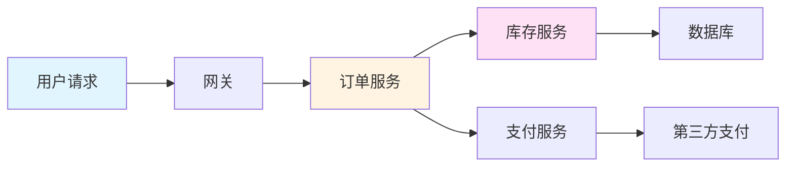
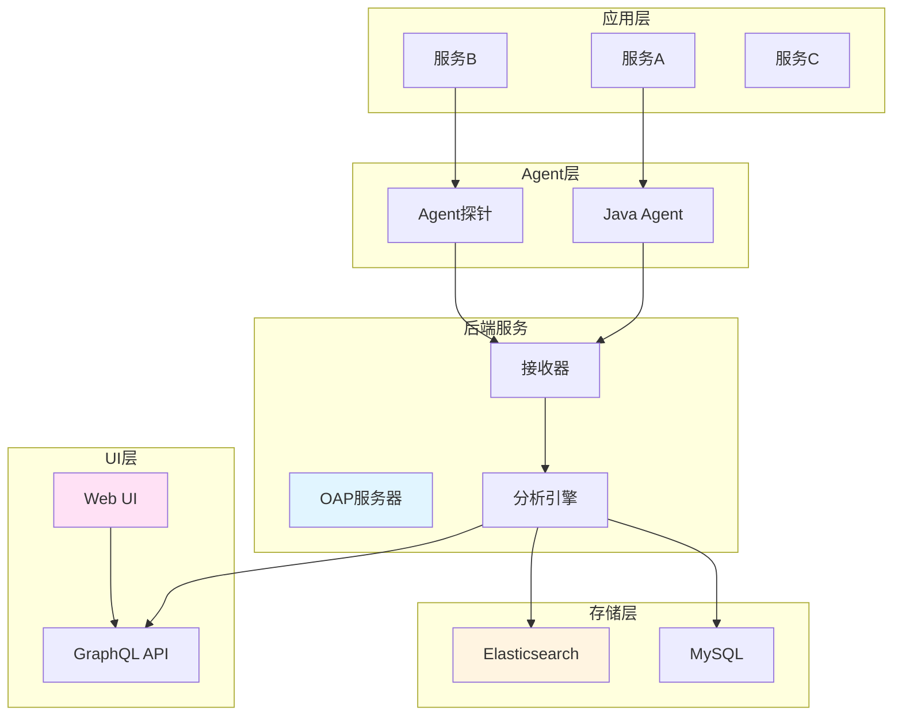
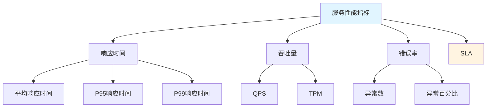

# Skywalking链路追踪

## 学习目标

完成本章后,你将能够:
- 理解APM和链路追踪的核心概念
- 掌握Skywalking 9.x的架构和部署
- 熟练配置Skywalking Agent
- 实现微服务全链路追踪
- 使用Skywalking进行性能监控和告警
- 关联日志分析排查问题

**预计学习时间**：6小时
**难度**：⭐⭐⭐ 中级
**前置知识**：完成前面所有章节的学习

## APM与链路追踪概述

### 什么是APM?

APM(Application Performance Monitoring)应用性能管理,是一套对应用系统进行实时监控、告警和分析的解决方案。

**核心能力**
- ✅ **应用性能监控**：响应时间、吞吐量、错误率
- ✅ **拓扑图展示**：服务依赖关系可视化
- ✅ **链路追踪**：请求在微服务间的完整调用链
- ✅ **异常分析**：自动捕获和分析异常
- ✅ **告警通知**：异常情况及时告警

### 分布式链路追踪概念

**核心概念**



**Trace(追踪)**: 一个请求在系统中的完整调用路径
**Span(跨度)**: 追踪中的基本工作单元,表示一个服务调用
**Segment(片段)**: Trace的一部分,包含多个Span
**Tag(标签)**: 键值对,用于标注Span的业务信息
**Log(日志)**: Span执行过程中的日志记录

## Skywalking架构

### 整体架构



**核心组件**
- **Agent**: 探针,采集应用数据
- **OAP**: Observability Analysis Platform,可观测性分析平台
- **Storage**: 存储链路和指标数据
- **Web UI**: 可视化界面

## Skywalking安装部署

### Docker Compose部署

```yaml
# docker-compose.yml
version: '3.8'

services:
  # Elasticsearch
  elasticsearch:
    image: docker.elastic.co/elasticsearch/elasticsearch:8.10.0
    container_name: elasticsearch
    environment:
      - discovery.type=single-node
      - ES_JAVA_OPTS=-Xms2g -Xmx2g
      - xpack.security.enabled=false
    ports:
      - "9200:9200"
    volumes:
      - elasticsearch_data:/usr/share/elasticsearch/data
    networks:
      - skywalking

  # Skywalking OAP
  oap:
    image: apache/skywalking-oap-server:9.5.0
    container_name: skywalking-oap
    depends_on:
      - elasticsearch
    environment:
      - SW_STORAGE=elasticsearch
      - SW_STORAGE_ES_CLUSTER_NODES=elasticsearch:9200
      - SW_ES_USER=
      - SW_ES_PASSWORD=
      - TZ=Asia/Shanghai
    ports:
      - "11800:11800" # gRPC端口
      - "12800:12800" # HTTP端口
    networks:
      - skywalking

  # Skywalking UI
  ui:
    image: apache/skywalking-ui:9.5.0
    container_name: skywalking-ui
    depends_on:
      - oap
    environment:
      - SW_OAP_ADDRESS=http://oap:12800
      - TZ=Asia/Shanghai
    ports:
      - "8080:8080"
    networks:
      - skywalking

volumes:
  elasticsearch_data:

networks:
  skywalking:
    driver: bridge
```

**启动命令**

```bash
# 启动Skywalking
docker-compose up -d

# 查看日志
docker-compose logs -f oap
docker-compose logs -f ui

# 访问UI
# http://localhost:8080
```

## Agent配置

### Java Agent配置

**下载Agent**

```bash
# 下载Skywalking Agent
wget https://archive.apache.org/dist/skywalking/9.5.0/apache-skywalking-java-agent-9.5.0.tgz

# 解压
tar -xzf apache-skywalking-java-agent-9.5.0.tgz
```

**Agent配置文件**

```properties
# skywalking/agent/config/agent.config

# 服务名称
agent.service_name=my-service

# OAP服务器地址(多个用逗号分隔)
agent.backend_service=localhost:11800

# 采样率(0-1,1表示100%采样)
agent.sample_n_per_3_secs=-1

# 日志级别
logging.level=INFO

# 插件配置
plugin.springmvc.collect_http_params=true
plugin.jdbc.trace_sql_parameters=true
plugin.kafka.SECURITY_PROTOCOL=PLAINTEXT
```

### Spring Boot集成Agent

**方式1: JVM启动参数**

```bash
# 开发环境IDEA配置
# Run -> Edit Configurations -> VM Options
-javaagent:/path/to/skywalking-agent.jar
-Dskywalking.agent.service_name=user-service
-Dskywalking.collector.backend_service=localhost:11800

# 生产环境启动脚本
java -javaagent:/path/to/skywalking-agent.jar \
     -Dskywalking.agent.service_name=user-service \
     -Dskywalking.collector.backend_service=skywalking-oap:11800 \
     -jar user-service.jar
```

**方式2: 环境变量**

```bash
# 设置环境变量
export JAVA_AGENT="-javaagent:/path/to/skywalking-agent.jar"
export SERVICE_NAME="-Dskywalking.agent.service_name=user-service"
export BACKEND_SERVICE="-Dskywalking.collector.backend_service=localhost:11800"

# 启动应用
java $JAVA_AGENT $SERVICE_NAME $BACKEND_SERVICE -jar app.jar
```

**方式3: Dockerfile**

```dockerfile
FROM openjdk:21-jdk-slim

# 复制Agent
COPY skywalking-agent /opt/skywalking-agent

# 复制应用
COPY app.jar /app.jar

# 启动命令
ENTRYPOINT ["java", \
    "-javaagent:/opt/skywalking-agent/skywalking-agent.jar", \
    "-Dskywalking.agent.service_name=user-service", \
    "-Dskywalking.collector.backend_service=skywalking-oap:11800", \
    "-jar", "/app.jar"]
```

### Kubernetes环境集成

**Deployment配置**

```yaml
apiVersion: apps/v1
kind: Deployment
metadata:
  name: user-service
spec:
  replicas: 3
  template:
    metadata:
      spec:
        containers:
          - name: user-service
            image: user-service:latest
            env:
              - name: JAVA_TOOL_OPTIONS
                value: >-
                  -javaagent:/skywalking/skywalking-agent.jar
                  -Dskywalking.agent.service_name=${POD_NAME}
                  -Dskywalking.collector.backend_service=skywalking-oap:11800
              - name: POD_NAME
                valueFrom:
                  fieldRef:
                    fieldPath: metadata.name
            volumeMounts:
              - name: skywalking-agent
                mountPath: /skywalking
                readOnly: true
        volumes:
          - name: skywalking-agent
            emptyDir: {}
          - name: skywalking-agent-files
            configMap:
              name: skywalking-agent
---
# 初始化Agent
apiVersion: v1
kind: ConfigMap
metadata:
  name: skywalking-agent
data:
  skywalking-agent.jar: |
    # Agent文件内容(base64编码后)
```

## 链路追踪实战

### 基础链路追踪

**Spring Boot应用自动追踪**

```java
package com.example.user.controller;

import org.springframework.web.bind.annotation.*;

/**
 * 用户控制器
 * Skywalking Agent会自动追踪所有HTTP请求
 */
@RestController
@RequestMapping("/api/users")
public class UserController {

    /**
     * 获取用户信息
     * 自动生成Trace和Span
     */
    @GetMapping("/{id}")
    public User getUser(@PathVariable Long id) {
        // 业务逻辑
        return userService.findById(id);
    }

    /**
     * 创建用户
     */
    @PostMapping
    public User createUser(@RequestBody User user) {
        return userService.save(user);
    }
}
```

### 自定义Span

**使用@Trace注解**

```java
package com.example.user.service;

import org.apache.skywalking.apm.toolkit.trace.Trace;
import org.springframework.stereotype.Service;

/**
 * 自定义Span追踪
 */
@Service
public class UserService {

    /**
     * 使用@Trace注解创建自定义Span
     */
    @Trace
    public User processUser(Long id) {
        // 这个方法会被追踪为独立的Span
        User user = findById(id);

        // 业务处理
        validateUser(user);
        enrichUser(user);

        return user;
    }

    /**
     * 为Span添加标签
     */
    @Trace
    public User findById(Long id) {
        // 添加自定义标签
        ActiveSpan.tag("user.id", String.valueOf(id));
        ActiveSpan.tag("operation", "findById");

        // 业务逻辑
        return userRepository.findById(id).orElse(null);
    }

    /**
     * 记录日志到Span
     */
    @Trace
    public void validateUser(User user) {
        if (user == null) {
            // 记录错误日志
            ActiveSpan.error("用户不存在");
            throw new RuntimeException("用户不存在");
        }
    }
}
```

### 跨服务追踪

**OpenFeign调用追踪**

```java
package com.example.order.feign;

import org.springframework.cloud.openfeign.FeignClient;

/**
 * Feign客户端
 * Skywalking Agent自动追踪Feign调用
 */
@FeignClient(name = "user-service")
public interface UserClient {

    /**
     * 调用用户服务
     * 自动传递Trace上下文
     */
    @GetMapping("/api/users/{id}")
    User getUser(@PathVariable("id") Long id);
}
```

**RestTemplate调用追踪**

```java
package com.example.order.service;

import org.springframework.stereotype.Service;
import org.springframework.web.client.RestTemplate;

/**
 * RestTemplate调用
 * Skywalking自动注入Trace上下文
 */
@Service
public class OrderService {

    private final RestTemplate restTemplate;

    public Order createOrder(Long userId, List<OrderItem> items) {
        // 调用用户服务
        User user = restTemplate.getForObject(
            "http://user-service/api/users/" + userId,
            User.class
        );

        // 创建订单
        Order order = new Order();
        order.setUserId(userId);
        order.setItems(items);

        return orderRepository.save(order);
    }
}
```

### 数据库调用追踪

**JPA/Hibernate追踪**

```java
package com.example.user.repository;

import org.springframework.data.jpa.repository.JpaRepository;
import org.springframework.stereotype.Repository;

/**
 * JPA Repository
 * Skywalking自动追踪SQL执行
 */
@Repository
public interface UserRepository extends JpaRepository<User, Long> {

    /**
     * 自动追踪查询SQL
     */
    Optional<User> findByUsername(String username);
}
```

**JDBC追踪配置**

```properties
# skywalking/agent/config/agent.config

# 启用JDBC追踪
plugin.jdbc.trace_sql_parameters=true

# 记录慢SQL(毫秒)
plugin.jdbc.slow_sql_threshold=1000

# SQL最大长度
plugin.jdbc.sql_body_max_length=2048
```

## 性能监控

### 服务监控指标

**核心指标**



**监控面板使用**

```java
package com.example.user.config;

import org.springframework.context.annotation.Configuration;

/**
 * Skywalking监控配置
 */
@Configuration
public class SkywalkingMonitorConfig {

    /**
     * 自定义监控指标
     */
    @Bean
    public MeterRegistryCustomizer<MeterRegistry> metricsCommonTags() {
        return registry -> registry.config()
            .commonTags("application", "user-service")
            .commonTags("region", System.getenv("REGION"));
    }
}
```

### 告警配置

**告警规则配置**

```yaml
# config/alarm-settings.yml

# 服务响应时间告警
rules:
  # 服务平均响应时间告警
  - name: Service_Response_Time_Rule
    metricsName: service_resp_time
    op: ">"
    threshold: 3000
    period: 10
    count: 3
    silence-period: 5
    message: 服务响应时间超过3秒

  # 服务成功率告警
  - name: Service_Success_Rate_Rule
    metricsName: service_success_rate
    op: "<"
    threshold: 0.95
    period: 10
    count: 3
    silence-period: 5
    message: 服务成功率低于95%

  # 服务SLA告警
  - name: Service_SLA_Rule
    metricsName: service_sla
    op: "<"
    threshold: 0.99
    period: 10
    count: 3
    silence-period: 5
    message: 服务SLA低于99%

# Webhook通知
webhooks:
  - http://your-webhook-url/alarm
```

**告警处理**

```java
package com.example.user.handler;

import org.springframework.stereotype.Component;

/**
 * 告警处理
 */
@Component
public class AlarmHandler {

    /**
     * 处理Skywalking告警
     */
    public void handleAlarm(AlarmMessage alarm) {
        // 1. 记录告警日志
        log.error("Skywalking告警: {}", alarm.getMessage());

        // 2. 发送钉钉通知
        sendDingTalkNotification(alarm);

        // 3. 发送邮件通知
        sendEmailNotification(alarm);

        // 4. 自动处理(如重启服务)
        if (alarm.getSeverity() == Severity.CRITICAL) {
            autoHandle(alarm);
        }
    }

    private void sendDingTalkNotification(AlarmMessage alarm) {
        // 发送钉钉通知
    }

    private void sendEmailNotification(AlarmMessage alarm) {
        // 发送邮件通知
    }

    private void autoHandle(AlarmMessage alarm) {
        // 自动处理逻辑
    }
}
```

## 日志关联

### Trace ID集成

**Logback配置**

```xml
<!-- logback-spring.xml -->
<configuration>
    <!-- 引入Skywalking pattern -->
    <appender name="CONSOLE" class="ch.qos.logback.core.ConsoleAppender">
        <encoder>
            <!-- 引用Trace ID -->
            <pattern>%d{yyyy-MM-dd HH:mm:ss.SSS} [%tid] [%thread] %-5level %logger{36} - %msg%n</pattern>
            <charset>UTF-8</charset>
        </encoder>
    </appender>

    <!-- Filebeat输出 -->
    <appender name="FILEBEAT" class="ch.qos.logback.core.rolling.RollingFileAppender">
        <file>/logs/app.log</file>
        <encoder>
            <!-- %tid会输出Skywalking Trace ID -->
            <pattern>{"time":"%d{yyyy-MM-dd HH:mm:ss.SSS","traceId":"%tid","level":"%-5level","logger":"%logger{36}","message":"%msg"}%n</pattern>
        </encoder>
        <rollingPolicy class="ch.qos.logback.core.rolling.TimeBasedRollingPolicy">
            <fileNamePattern>/logs/app.%d{yyyy-MM-dd}.log</fileNamePattern>
        </rollingPolicy>
    </appender>

    <root level="INFO">
        <appender-ref ref="CONSOLE" />
        <appender-ref ref="FILEBEAT" />
    </root>
</configuration>
```

**应用中使用Trace ID**

```java
package com.example.user.service;

import org.apache.skywalking.apm.toolkit.trace.TraceContext;
import org.springframework.stereotype.Service;
import lombok.extern.slf4j.Slf4j;

/**
 * 日志关联Trace ID
 */
@Slf4j
@Service
public class UserService {

    public User getUser(Long id) {
        // 获取当前Trace ID
        String traceId = TraceContext.traceId();

        // 记录日志,自动包含Trace ID
        log.info("查询用户, userId: {}, traceId: {}", id, traceId);

        try {
            User user = userRepository.findById(id).orElse(null);
            log.info("查询成功, user: {}", user);
            return user;
        } catch (Exception e) {
            // 异常日志也会包含Trace ID
            log.error("查询失败", e);
            throw e;
        }
    }
}
```

### ELK集成

**Filebeat配置**

```yaml
# filebeat.yml
filebeat.inputs:
  - type: log
    enabled: true
    paths:
      - /logs/app.log
    json.keys_under_root: true
    json.add_error_key: true
    fields:
      service: user-service
      env: prod

# 输出到Elasticsearch
output.elasticsearch:
  hosts: ["elasticsearch:9200"]
  indices:
    - index: "user-service-%{+yyyy.MM.dd}"
      when.equals:
        service: "user-service"

# 自定义索引模板
setup.template.name: "skywalking-logs"
setup.template.pattern: "skywalking-logs-*"
setup.template.enabled: false
```

**Kibana查询**

```json
// 通过Trace ID查询所有日志
{
  "query": {
    "match": {
      "traceId": "1234567890abcdef"
    }
  }
}

// 查询特定服务的错误日志
{
  "query": {
    "bool": {
      "must": [
        {"match": {"service": "user-service"}},
        {"match": {"level": "ERROR"}}
      ]
    }
  }
}
```

## 最佳实践

### 1. 合理的采样率

```properties
# 生产环境采样率配置
agent.sample_n_per_3_secs=-1  # 全量采样

# 高流量场景
agent.sample_n_per_3_secs=100  # 每3秒最多采样100个Trace
```

### 2. 过滤敏感数据

```properties
# skywalking/agent/config/agent.config

# 过滤HTTP参数中的敏感字段
agent.http.include_http_params_parameter_patterns=user.*,password.*

# 过滤SQL参数
plugin.jdbc.slow_sql_sql_parameters_filter=\*password\*,.*secret.*
```

### 3. 异步线程追踪

```java
package com.example.user.service;

import org.apache.skywalking.apm.toolkit.trace.TraceContext;
import org.springframework.scheduling.annotation.Async;
import org.springframework.stereotype.Service;

import java.util.concurrent.CompletableFuture;

/**
 * 异步场景追踪
 */
@Service
public class AsyncService {

    /**
     * 使用@Async追踪
     * 需要配置trace-cross-thread
     */
    @Async
    @Trace
    public CompletableFuture<User> getUserAsync(Long id) {
        // 异步方法自动传递Trace ID
        User user = userRepository.findById(id).orElse(null);
        return CompletableFuture.completedFuture(user);
    }

    /**
     * CompletableFuture追踪
     */
    public CompletableFuture<User> loadUser(Long id) {
        // 手动传递Trace ID
        String traceId = TraceContext.traceId();

        return CompletableFuture.supplyAsync(() -> {
            // 在新线程中恢复Trace上下文
            TraceContext.putTraceId(traceId);

            return userRepository.findById(id).orElse(null);
        });
    }
}
```

### 4. 性能优化

```properties
# Agent性能优化
# 减少不必要的插件
plugin.mounter.filters=-jdbc,-springmvc

# 降低日志级别
logging.level=ERROR

# 设置缓冲区大小
agent.remote_downloader_protocol_max_size=10485760
```

## 避坑指南

### 常见问题

**问题1: Agent加载失败**
```bash
# ❌ 错误:Agent路径错误
-javaagent:skywalking-agent.jar

# ✅ 正确:使用绝对路径
-javaagent:/opt/skywalking-agent/skywalking-agent.jar
```

**问题2: Trace ID不传递**
```properties
# 确保开启跨线程追踪
toolkit.trace.cross.thread=true
```

**问题3: 内存占用过高**
```bash
# 调整JVM参数
-Xms2g -Xmx2g -XX:MaxMetaspaceSize=256m
```

## 总结

本章深入讲解了Skywalking链路追踪的完整知识体系:

**核心知识点**
1. APM和链路追踪概念
2. Skywalking 9.x架构和部署
3. Agent配置和使用
4. 链路追踪实战
5. 性能监控和告警
6. 日志关联分析

**关键要点**
- Agent自动追踪,零侵入
- Trace ID关联日志排查问题
- 合理设置采样率和过滤规则
- 使用告警及时发现问题
- 结合ELK实现全链路日志分析

**下一章预告**

下一章我们将学习**定时任务与异步处理**,掌握Spring Task、Quartz和XXL-Job的使用技巧。

---

**上一章**：[Spring Cloud Gateway网关](./chapter-135) | **下一章**：[定时任务与异步处理](./chapter-137)
