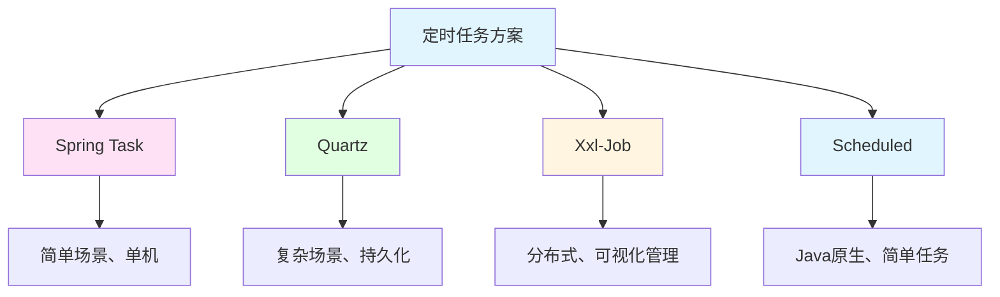

# 定时任务与异步处理

> **学习目标**：掌握企业级定时任务和异步处理技术
> **核心内容**：Spring Task、Quartz、分布式定时任务、异步执行
> **预计时间**：5小时

## 定时任务概述

### 定时任务应用场景

```java
/**
 * 定时任务应用场景
 */
public class ScheduledTaskScenarios {
    public static void main(String[] args) {
        System.out.println("=== 定时任务应用场景 ===\n");

        System.out.println("1. 数据同步：");
        System.out.println("   - 定时从其他系统同步数据");
        System.out.println("   - 数据库之间的数据同步\n");

        System.out.println("2. 报表生成：");
        System.out.println("   - 每日生成统计报表");
        System.out.println("   - 定期生成销售报告\n");

        System.out.println("3. 数据清理：");
        System.out.println("   - 清理过期数据");
        System.out.println("   - 清理临时文件\n");

        System.out.println("4. 消息推送：");
        System.out.println("   - 定时发送邮件/短信");
        System.out.println("   - 推送系统通知\n");

        System.out.println("5. 系统维护：");
        System.out.println("   - 定时备份数据");
        System.out.println("   - 系统健康检查\n");
    }
}
```

### 定时任务技术选型



## Spring Task

### 基本使用

```java
package com.example.task.config;

import org.springframework.context.annotation.Configuration;
import org.springframework.scheduling.annotation.EnableScheduling;

/**
 * 定时任务配置
 */
@Configuration
@EnableScheduling
public class TaskConfig {
}
```

```java
package com.example.task.service;

import org.springframework.scheduling.annotation.Scheduled;
import org.springframework.stereotype.Service;

import java.time.LocalDateTime;

/**
 * 定时任务服务
 */
@Service
public class ScheduledTaskService {

    /**
     * 固定延迟执行（上次执行完成后延迟指定时间）
     * delay = 5000ms = 5秒
     */
    @Scheduled(fixedDelay = 5000)
    public void fixedDelayTask() {
        System.out.println("固定延迟任务：" + LocalDateTime.now());
    }

    /**
     * 固定频率执行（每隔指定时间执行一次）
     * rate = 10000ms = 10秒
     */
    @Scheduled(fixedRate = 10000)
    public void fixedRateTask() {
        System.out.println("固定频率任务：" + LocalDateTime.now());
    }

    /**
     * Cron表达式
     * 每天凌晨1点执行
     */
    @Scheduled(cron = "0 0 1 * * ?")
    public void cronTask() {
        System.out.println("Cron任务：" + LocalDateTime.now());
        // 生成日报表
        generateDailyReport();
    }

    /**
     * 带初始延迟的定时任务
     * 初始延迟10秒，之后每5秒执行一次
     */
    @Scheduled(initialDelay = 10000, fixedRate = 5000)
    public void initialDelayTask() {
        System.out.println("初始延迟任务：" + LocalDateTime.now());
    }

    /**
     * Cron表达式示例
     */
    // 每秒执行
    @Scheduled(cron = "0/1 * * * * ?")
    public void everySecond() {}

    // 每分钟执行
    @Scheduled(cron = "0 * * * * ?")
    public void everyMinute() {}

    // 每小时执行
    @Scheduled(cron = "0 0 * * * ?")
    public void everyHour() {}

    // 每天上午10点执行
    @Scheduled(cron = "0 0 10 * * ?")
    public void dailyAt10AM() {}

    // 每周一上午10点执行
    @Scheduled(cron = "0 0 10 ? * MON")
    public void weeklyMonday() {}

    // 每月1号凌晨执行
    @Scheduled(cron = "0 0 0 1 * ?")
    public void monthlyFirstDay() {}

    private void generateDailyReport() {
        // 生成日报表逻辑
    }
}
```

### Cron表达式详解

```
Cron表达式格式：
秒 分 时 日 月 周 [年]

字段  允许值        允许特殊字符
秒    0-59         , - * /
分    0-59         , - * /
时    0-23         , - * /
日    1-31         , - * ? / L W
月    1-12         , - * /
周    1-7或SUN-SAT , - * ? / L #
年    1970-2099    , - *

特殊字符含义：
*  : 所有值
?  : 不指定值（日和周互斥，一个用?另一个用*）
-  : 范围（如1-5）
,  : 列举（如1,3,5）
/  : 间隔（如0/15每15秒）
L  : 最后（日最后、周最后）
W  : 工作日
#  : 第几个周几（如2#1第二个周一）

常用示例：
0 0 10 * * ?        每天10点
0 0/30 * * * ?      每30分钟
0 0 8-18 * * MON-FRI 工作日8点到18点每小时
0 0 0 1 * ?         每月1号凌晨
0 0 12 ? * SAT      每周六12点
```

## Quartz定时任务

### Maven依赖

```xml
<dependencies>
    <dependency>
        <groupId>org.springframework.boot</groupId>
        <artifactId>spring-boot-starter-quartz</artifactId>
    </dependency>
</dependencies>
```

### Quartz配置

```java
package com.example.quartz.config;

import org.springframework.context.annotation.Bean;
import org.springframework.context.annotation.Configuration;

/**
 * Quartz配置
 */
@Configuration
public class QuartzConfig {

    @Bean
    public QuartzConfig quartzConfig() {
        return new QuartzConfig();
    }
}
```

### Quartz Job

```java
package com.example.quartz.job;

import org.quartz.*;
import org.springframework.stereotype.Component;

/**
 * 数据清理Job
 */
@Component
@DisallowConcurrentExecution  // 禁止并发执行
public class DataCleanupJob implements Job {

    @Override
    public void execute(JobExecutionContext context) throws JobExecutionException {
        JobDataMap dataMap = context.getJobDetail().getJobDataMap();

        // 获取参数
        String tableName = dataMap.getString("tableName");
        int daysToKeep = dataMap.getInt("daysToKeep");

        System.out.println("清理表：" + tableName);
        System.out.println("保留天数：" + daysToKeep);

        try {
            // 执行数据清理
            cleanupData(tableName, daysToKeep);
        } catch (Exception e) {
            throw new JobExecutionException(e);
        }
    }

    private void cleanupData(String tableName, int daysToKeep) {
        // 数据清理逻辑
        String sql = "DELETE FROM " + tableName + " WHERE create_time < DATE_SUB(NOW(), INTERVAL ? DAY)";
        // jdbcTemplate.update(sql, daysToKeep);
    }
}

/**
 * 报表生成Job
 */
@Component
public class ReportGeneratorJob implements Job {

    @Override
    public void execute(JobExecutionContext context) throws JobExecutionException {
        System.out.println("生成报表：" + java.time.LocalDateTime.now());

        // 生成报表逻辑
        generateReport();
    }

    private void generateReport() {
        // 报表生成逻辑
    }
}
```

### Quartz Service

```java
package com.example.quartz.service;

import com.example.quartz.job.DataCleanupJob;
import org.quartz.*;
import org.springframework.beans.factory.annotation.Autowired;
import org.springframework.stereotype.Service;

import java.util.Date;

/**
 * Quartz服务
 */
@Service
public class QuartzService {

    @Autowired
    private Scheduler scheduler;

    /**
     * 创建定时任务
     */
    public void createJob(String jobName, String jobGroup,
                         String cronExpression, JobDataMap dataMap) throws Exception {

        // 创建JobDetail
        JobDetail jobDetail = JobBuilder.newJob(DataCleanupJob.class)
                .withIdentity(jobName, jobGroup)
                .setJobData(dataMap)
                .storeDurably()
                .build();

        // 创建Trigger
        Trigger trigger = TriggerBuilder.newTrigger()
                .withIdentity(jobName + "_trigger", jobGroup + "_trigger")
                .withSchedule(CronScheduleBuilder.cronSchedule(cronExpression))
                .build();

        // 注册任务
        scheduler.scheduleJob(jobDetail, trigger);

        // 启动调度器
        if (!scheduler.isStarted()) {
            scheduler.start();
        }
    }

    /**
     * 暂停任务
     */
    public void pauseJob(String jobName, String jobGroup) throws Exception {
        JobKey jobKey = JobKey.jobKey(jobName, jobGroup);
        scheduler.pauseJob(jobKey);
    }

    /**
     * 恢复任务
     */
    public void resumeJob(String jobName, String jobGroup) throws Exception {
        JobKey jobKey = JobKey.jobKey(jobName, jobGroup);
        scheduler.resumeJob(jobKey);
    }

    /**
     * 删除任务
     */
    public void deleteJob(String jobName, String jobGroup) throws Exception {
        JobKey jobKey = JobKey.jobKey(jobName, jobGroup);
        scheduler.deleteJob(jobKey);
    }

    /**
     * 立即执行任务
     */
    public void triggerJob(String jobName, String jobGroup) throws Exception {
        JobKey jobKey = JobKey.jobKey(jobName, jobGroup);
        scheduler.triggerJob(jobKey);
    }
}
```

## 异步处理

### 异步配置

```java
package com.example.async.config;

import org.springframework.context.annotation.Bean;
import org.springframework.context.annotation.Configuration;
import org.springframework.scheduling.annotation.EnableAsync;
import org.springframework.scheduling.concurrent.ThreadPoolTaskExecutor;

import java.util.concurrent.Executor;
import java.util.concurrent.ThreadPoolExecutor;

/**
 * 异步配置
 */
@Configuration
@EnableAsync
public class AsyncConfig {

    @Bean("taskExecutor")
    public Executor taskExecutor() {
        ThreadPoolTaskExecutor executor = new ThreadPoolTaskExecutor();

        // 核心线程数
        executor.setCorePoolSize(10);

        // 最大线程数
        executor.setMaxPoolSize(20);

        // 队列容量
        executor.setQueueCapacity(200);

        // 线程名前缀
        executor.setThreadNamePrefix("async-task-");

        // 拒绝策略
        executor.setRejectedExecutionHandler(new ThreadPoolExecutor.CallerRunsPolicy());

        // 等待所有任务完成后再关闭
        executor.setWaitForTasksToCompleteOnShutdown(true);

        // 等待时间
        executor.setAwaitTerminationSeconds(60);

        executor.initialize();
        return executor;
    }
}
```

### 异步服务

```java
package com.example.async.service;

import org.springframework.scheduling.annotation.Async;
import org.springframework.stereotype.Service;

import java.util.concurrent.CompletableFuture;

/**
 * 异步服务
 */
@Service
public class AsyncService {

    /**
     * 异步方法（无返回值）
     */
    @Async("taskExecutor")
    public void asyncMethodWithVoid() {
        System.out.println("异步执行：" + Thread.currentThread().getName());

        try {
            // 模拟耗时操作
            Thread.sleep(3000);
            System.out.println("异步任务完成");
        } catch (InterruptedException e) {
            Thread.currentThread().interrupt();
        }
    }

    /**
     * 异步方法（有返回值）
     */
    @Async("taskExecutor")
    public CompletableFuture<String> asyncMethodWithReturn() {
        System.out.println("异步执行（有返回值）：" + Thread.currentThread().getName());

        try {
            Thread.sleep(2000);
            return CompletableFuture.completedFuture("异步执行成功");
        } catch (InterruptedException e) {
            Thread.currentThread().interrupt();
            return CompletableFuture.failedFuture(e);
        }
    }

    /**
     * 异步发送邮件
     */
    @Async("taskExecutor")
    public void sendEmail(String to, String subject, String content) {
        System.out.println("发送邮件到：" + to);

        try {
            // 模拟发送邮件
            Thread.sleep(1000);
            System.out.println("邮件发送成功");
        } catch (InterruptedException e) {
            Thread.currentThread().interrupt();
            System.err.println("邮件发送失败：" + e.getMessage());
        }
    }

    /**
     * 异步处理订单
     */
    @Async("taskExecutor")
    public void processOrder(Long orderId) {
        System.out.println("处理订单：" + orderId);

        // 1. 扣减库存
        reduceStock(orderId);

        // 2. 发送通知
        sendNotification(orderId);

        // 3. 更新订单状态
        updateOrderStatus(orderId);
    }

    private void reduceStock(Long orderId) {
        System.out.println("扣减库存");
    }

    private void sendNotification(Long orderId) {
        System.out.println("发送通知");
    }

    private void updateOrderStatus(Long orderId) {
        System.out.println("更新订单状态");
    }
}
```

### 异步Controller

```java
package com.example.async.controller;

import com.example.async.service.AsyncService;
import org.springframework.beans.factory.annotation.Autowired;
import org.springframework.web.bind.annotation.*;

import java.util.concurrent.CompletableFuture;

/**
 * 异步控制器
 */
@RestController
@RequestMapping("/api/async")
public class AsyncController {

    @Autowired
    private AsyncService asyncService;

    /**
     * 异步执行（无返回值）
     */
    @PostMapping("/execute")
    public String executeAsync() {
        asyncService.asyncMethodWithVoid();
        return "异步任务已提交";
    }

    /**
     * 异步执行（有返回值）
     */
    @PostMapping("/execute-with-return")
    public CompletableFuture<String> executeAsyncWithReturn() {
        return asyncService.asyncMethodWithReturn();
    }

    /**
     * 异步发送邮件
     */
    @PostMapping("/send-email")
    public String sendEmail(@RequestParam String to,
                           @RequestParam String subject,
                           @RequestParam String content) {
        asyncService.sendEmail(to, subject, content);
        return "邮件已发送";
    }

    /**
     * 异步处理订单
     */
    @PostMapping("/process-order/{orderId}")
    public String processOrder(@PathVariable Long orderId) {
        asyncService.processOrder(orderId);
        return "订单处理中";
    }
}
```

## 分布式定时任务

### Xxl-Job集成

```xml
<dependency>
    <groupId>com.xuxueli</groupId>
    <artifactId>xxl-job-core</artifactId>
    <version>2.4.0</version>
</dependency>
```

```yaml
xxl:
  job:
    admin:
      addresses: http://localhost:8080/xxl-job-admin
    executor:
      appname: demo-job-executor
      address:
      ip:
      port: 9999
      logpath: ./xxl-job/jobhandler
      logretentiondays: 30
```

```java
package com.example.xxl.job;

import com.xxl.job.core.context.XxlJobHelper;
import com.xxl.job.core.handler.annotation.XxlJob;
import org.springframework.stereotype.Component;

/**
 * Xxl-Job任务
 */
@Component
public class XxlJobHandler {

    @XxlJob("demoJobHandler")
    public void demoJobHandler() throws Exception {
        XxlJobHelper.log("XXL-JOB, Hello World.");

        for (int i = 0; i < 5; i++) {
            XxlJobHelper.log("beat at:" + i);
            Thread.sleep(2000);
        }
    }

    @XxlJob("dataSyncJob")
    public void dataSyncJob() {
        // 数据同步任务
        String param = XxlJobHelper.getJobParam();
        XxlJobHelper.log("参数：" + param);

        try {
            // 执行数据同步
            syncData();

            XxlJobHelper.handleSuccess("数据同步成功");
        } catch (Exception e) {
            XxlJobHelper.handleFail("数据同步失败：" + e.getMessage());
        }
    }

    private void syncData() {
        // 数据同步逻辑
    }
}
```

## 最佳实践

### 定时任务最佳实践

```java
/**
 * 定时任务最佳实践
 */
public class ScheduledTaskBestPractices {

    /*
    1. 任务设计
    ==========
    ✅ 任务幂等性
    ✅ 异常处理
    ✅ 超时控制
    ✅ 日志记录
    ❌ 避免长时间运行

    2. 分布式环境
    ============
    ✅ 使用分布式锁
    ✅ 任务分片
    ✅ 失败转移
    ✅ 集群部署

    3. 监控告警
    ==========
    ✅ 任务执行监控
    ✅ 失败告警
    ✅ 性能监控
    ✅ 日志分析

    4. 异步处理
    ==========
    ✅ 合理设置线程池
    ✅ 线程池隔离
    ✅ 拒绝策略
    ✅ 优雅关闭

    5. 性能优化
    ==========
    ✅ 批量处理
    ✅ 分片处理
    ✅ 异步处理
    ✅ 缓存优化
    */
}
```

## 实战练习

### 练习1：订单超时处理

```java
/*
需求：
1. 每5分钟检查超时订单
2. 自动取消超时订单
3. 释放库存
4. 发送通知

要求：
- 使用Spring Task
- 实现幂等性
- 使用分布式锁
- 异步处理
*/
```

### 练习2：数据同步系统

```java
/*
需求：
1. 每天凌晨同步用户数据
2. 增量同步
3. 失败重试
4. 同步日志记录

要求：
- 使用Quartz
- 支持手动触发
- 分布式部署
- 监控告警
*/
```

## 本章小结

### 学习成果检查

✅ **Spring Task**：@Scheduled、Cron表达式
✅ **Quartz**：Job、Trigger、Scheduler
✅ **异步处理**：@Async、线程池配置
✅ **分布式任务**：Xxl-Job、分布式锁
✅ **任务管理**：暂停、恢复、删除
✅ **最佳实践**：幂等性、异常处理、监控

### 核心技术点

- **@Scheduled**：声明式定时任务
- **Quartz**：强大的调度框架
- **@Async**：异步方法执行
- **ThreadPoolTaskExecutor**：线程池配置
- **Xxl-Job**：分布式任务调度
- **分布式锁**：防止重复执行

### 下一步学习

- **第24章**：日志管理与监控
- **第25章**：单元测试与集成测试

---

**学习时间**：约5小时
**难度等级**：★★★★☆
**重要程度**：★★★★☆
