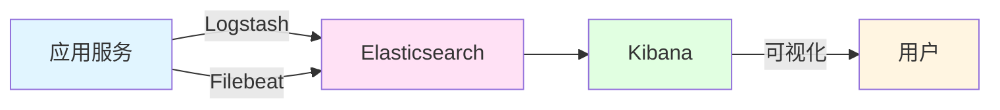

# 日志管理与监控

> **学习目标**：构建企业级日志和监控系统
> **核心内容**：SLF4J+Logback、ELK栈、Actuator监控
> **预计时间**：4小时

## 日志框架概述

### 日志框架对比

```java
/**
 * Java日志框架演进
 */
public class LoggingFrameworks {
    public static void main(String[] args) {
        System.out.println("=== Java日志框架 ===\n");

        System.out.println("1. JUL（Java Util Logging）：");
        System.out.println("   JDK自带，功能简单，不推荐\n");

        System.out.println("2. Log4j：");
        System.out.println("   经典框架，功能强大");
        System.out.println("   Log4j 2性能更好\n");

        System.out.println("3. Logback：");
        System.out.println("   Log4j改进版");
        System.out.println("   Spring Boot默认集成");
        System.out.println("   推荐使用\n");

        System.out.println("4. 日志门面（Facade）：");
        System.out.println("   SLF4J：适配各种日志实现");
        System.out.println("   Apache Commons Logging：较老\n");

        System.out.println("推荐组合：SLF4J + Logback");
    }
}
```

### 日志级别

```
日志级别（从低到高）：
TRACE  追踪信息
DEBUG  调试信息
INFO   一般信息
WARN   警告信息
ERROR  错误信息
FATAL  致命错误（Logback不支持）

使用规则：
- 开发环境：DEBUG
- 测试环境：INFO
- 生产环境：WARN
```

## Logback配置

### Maven依赖

```xml
<!-- pom.xml -->
<dependencies>
    <!-- Spring Boot Starter（已包含Logback） -->
    <dependency>
        <groupId>org.springframework.boot</groupId>
        <artifactId>spring-boot-starter-web</artifactId>
    </dependency>

    <!-- Logstash Logback编码 -->
    <dependency>
        <groupId>net.logstash.logback</groupId>
        <artifactId>logstash-logback-encoder</artifactId>
        <version>7.4</version>
    </dependency>
</dependencies>
```

### Logback配置文件

```xml
<!-- src/main/resources/logback-spring.xml -->
<?xml version="1.0" encoding="UTF-8"?>
<configuration>
    <!-- 引入Spring默认配置 -->
    <include resource="org/springframework/boot/logging/logback/defaults.xml"/>

    <!-- 定义日志存储路径 -->
    <property name="LOG_PATH" value="logs"/>
    <property name="APP_NAME" value="myapp"/>

    <!-- 定义日志格式 -->
    <property name="CONSOLE_LOG_PATTERN"
              value="%d{yyyy-MM-dd HH:mm:ss.SSS} [%thread] %-5level %logger{36} - %msg%n"/>

    <!-- Console输出 -->
    <appender name="CONSOLE" class="ch.qos.logback.core.ConsoleAppender">
        <encoder>
            <pattern>${CONSOLE_LOG_PATTERN}</pattern>
            <charset>UTF-8</charset>
        </encoder>
    </appender>

    <!-- 文件输出（所有日志） -->
    <appender name="FILE_ALL" class="ch.qos.logback.core.rolling.RollingFileAppender">
        <file>${LOG_PATH}/${APP_NAME}.log</file>
        <encoder>
            <pattern>%d{yyyy-MM-dd HH:mm:ss.SSS} [%thread] %-5level %logger{50} - %msg%n</pattern>
            <charset>UTF-8</charset>
        </encoder>

        <!-- 滚动策略 -->
        <rollingPolicy class="ch.qos.logback.core.rolling.TimeBasedRollingPolicy">
            <fileNamePattern>${LOG_PATH}/${APP_NAME}.%d{yyyy-MM-dd}.%i.log</fileNamePattern>
            <timeBasedFileNamingAndTriggeringPolicy class="ch.qos.logback.core.rolling.SizeAndTimeBasedFNATP">
                <maxFileSize>100MB</maxFileSize>
            </timeBasedFileNamingAndTriggeringPolicy>
            <maxHistory>30</maxHistory>
        </rollingPolicy>
    </appender>

    <!-- 错误日志单独输出 -->
    <appender name="FILE_ERROR" class="ch.qos.logback.core.rolling.RollingFileAppender">
        <file>${LOG_PATH}/${APP_NAME}-error.log</file>
        <filter class="ch.qos.logback.classic.filter.LevelFilter">
            <level>ERROR</level>
            <onMatch>ACCEPT</onMatch>
            <onMismatch>DENY</onMismatch>
        </filter>
        <encoder>
            <pattern>%d{yyyy-MM-dd HH:mm:ss.SSS} [%thread] %-5level %logger{50} - %msg%n</pattern>
            <charset>UTF-8</charset>
        </encoder>

        <rollingPolicy class="ch.qos.logback.core.rolling.TimeBasedRollingPolicy">
            <fileNamePattern>${LOG_PATH}/${APP_NAME}-error.%d{yyyy-MM-dd}.log</fileNamePattern>
            <maxHistory>30</maxHistory>
        </rollingPolicy>
    </appender>

    <!-- JSON格式输出（用于ELK） -->
    <appender name="LOGSTASH" class="ch.qos.logback.core.rolling.RollingFileAppender">
        <file>${LOG_PATH}/${APP_NAME}-json.log</file>
        <encoder class="net.logstash.logback.encoder.LogstashEncoder"/>
        <rollingPolicy class="ch.qos.logback.core.rolling.TimeBasedRollingPolicy">
            <fileNamePattern>${LOG_PATH}/${APP_NAME}-json.%d{yyyy-MM-dd}.log</fileNamePattern>
            <maxHistory>30</maxHistory>
        </rollingPolicy>
    </appender>

    <!-- 异步输出 -->
    <appender name="ASYNC_FILE" class="ch.qos.logback.classic.AsyncAppender">
        <discardingThreshold>0</discardingThreshold>
        <queueSize>512</queueSize>
        <appender-ref ref="FILE_ALL"/>
    </appender>

    <!-- Spring Profile配置 -->
    <springProfile name="dev">
        <root level="DEBUG">
            <appender-ref ref="CONSOLE"/>
            <appender-ref ref="ASYNC_FILE"/>
        </root>
    </springProfile>

    <springProfile name="prod">
        <root level="INFO">
            <appender-ref ref="CONSOLE"/>
            <appender-ref ref="ASYNC_FILE"/>
            <appender-ref ref="FILE_ERROR"/>
            <appender-ref ref="LOGSTASH"/>
        </root>
    </springProfile>

    <!-- 应用日志 -->
    <logger name="com.example" level="DEBUG"/>

    <!-- SQL日志 -->
    <logger name="org.springframework.jdbc" level="DEBUG"/>
    <logger name="org.hibernate.SQL" level="DEBUG"/>
    <logger name="org.hibernate.type.descriptor.sql.BasicBinder" level="TRACE"/>
</configuration>
```

### 日志使用

```java
package com.example.logging.service;

import lombok.extern.slf4j.Slf4j;
import org.springframework.stereotype.Service;

/**
 * 日志服务（使用Lombok的@Slf4j注解）
 */
@Slf4j
@Service
public class UserService {

    /**
     * 基本日志使用
     */
    public void logExample() {
        log.trace("追踪信息");
        log.debug("调试信息");
        log.info("一般信息");
        log.warn("警告信息");
        log.error("错误信息");
    }

    /**
     * 带参数的日志
     */
    public void logWithParameters(String username, Long userId) {
        log.info("用户登录：username={}, userId={}", username, userId);

        // 对象日志
        User user = new User();
        log.debug("用户信息：{}", user);
    }

    /**
     * 异常日志
     */
    public void logException() {
        try {
            // 业务逻辑
            doSomething();
        } catch (Exception e) {
            log.error("操作失败", e);
            // 或者
            log.error("操作失败：{}", e.getMessage(), e);
        }
    }

    /**
     * 性能日志
     */
    public void logPerformance() {
        long startTime = System.currentTimeMillis();

        try {
            // 业务逻辑
            doSomething();
        } finally {
            long endTime = System.currentTimeMillis();
            log.info("方法执行耗时：{}ms", endTime - startTime);
        }
    }

    /**
     * 业务日志
     */
    public void logBusiness() {
        log.info("订单创建：orderId={}, userId={}, amount={}",
                1001L, 2001L, 99.99);
    }

    private void doSomething() {
        // 业务逻辑
    }

    static class User {
        // 用户实体
    }
}
```

## ELK日志收集

### ELK架构



### Filebeat配置

```yaml
# filebeat.yml
filebeat.inputs:
  - type: log
    enabled: true
    paths:
      - /logs/myapp/*.log
    fields:
      app: myapp
      env: prod
    fields_under_root: true
    multiline:
      pattern: '^\d{4}-\d{2}-\d{2}'
      negate: true
      match: after

output.logstash:
  hosts: ["localhost:5044"]

processors:
  - drop_event:
      when:
        regexp:
          message: "^DEBUG"
```

### Logstash配置

```conf
# logstash.conf
input {
  beats {
    port => 5044
  }
}

filter {
  # 解析日志
  grok {
    match => {
      "message" => "%{TIMESTAMP_ISO8601:timestamp} \[%{DATA:thread}\] %{LOGLEVEL:level} %{DATA:logger} - %{GREEDYDATA:message}"
    }
  }

  # 解析JSON
  if [type] == "json" {
    json {
      source => "message"
    }
  }

  # 时间字段
  date {
    match => ["timestamp", "yyyy-MM-dd HH:mm:ss.SSS"]
  }
}

output {
  elasticsearch {
    hosts => ["localhost:9200"]
    index => "myapp-%{+YYYY.MM.dd}"
  }

  stdout { codec => rubydebug }
}
```

## Spring Boot Actuator

### Maven依赖

```xml
<dependency>
    <groupId>org.springframework.boot</groupId>
    <artifactId>spring-boot-starter-actuator</artifactId>
</dependency>
```

### 配置文件

```yaml
# application.yml
management:
  endpoints:
    web:
      exposure:
        include: "*"  # 暴露所有端点
      base-path: /actuator
  endpoint:
    health:
      show-details: always  # 显示详细信息
    metrics:
      enabled: true
  metrics:
    export:
      prometheus:
        enabled: true
```

### 自定义健康检查

```java
package com.example.monitoring.health;

import org.springframework.boot.actuate.health.Health;
import org.springframework.boot.actuate.health.HealthIndicator;
import org.springframework.stereotype.Component;

import java.util.concurrent.ThreadLocalRandom;

/**
 * 自定义健康检查
 */
@Component
public class CustomHealthIndicator implements HealthIndicator {

    @Override
    public Health health() {
        // 检查外部服务
        boolean isHealthy = checkExternalService();

        if (isHealthy) {
            return Health.up()
                    .withDetail("message", "服务正常")
                    .withDetail("timestamp", System.currentTimeMillis())
                    .build();
        } else {
            return Health.down()
                    .withDetail("message", "服务异常")
                    .withDetail("error", "连接超时")
                    .build();
        }
    }

    private boolean checkExternalService() {
        // 模拟检查
        return ThreadLocalRandom.current().nextBoolean();
    }
}
```

### 自定义Metrics

```java
package com.example.monitoring.metrics;

import io.micrometer.core.instrument.Counter;
import io.micrometer.core.instrument.MeterRegistry;
import org.springframework.beans.factory.annotation.Autowired;
import org.springframework.stereotype.Component;

/**
 * 自定义Metrics
 */
@Component
public class CustomMetrics {

    private final Counter orderCounter;
    private final MeterRegistry meterRegistry;

    @Autowired
    public CustomMetrics(MeterRegistry meterRegistry) {
        this.meterRegistry = meterRegistry;

        // 订单计数器
        this.orderCounter = Counter.builder("order.created")
                .description("订单创建数量")
                .tag("type", "product")
                .register(meterRegistry);
    }

    /**
     * 记录订单创建
     */
    public void recordOrderCreated() {
        orderCounter.increment();
    }

    /**
     * 记录自定义指标
     */
    public void recordCustomMetric(String name, double value, String... tags) {
        meterRegistry.gauge(name, value);
    }
}
```

## 最佳实践

### 日志最佳实践

```java
/**
 * 日志最佳实践
 */
public class LoggingBestPractices {

    /*
    1. 日志级别使用
    =============
    ✅ 生产环境使用INFO或WARN
    ✅ 开发环境使用DEBUG
    ✅ 关键业务使用INFO
    ✅ 异常使用ERROR
    ❌ 避免过度使用TRACE

    2. 日志内容
    ==========
    ✅ 包含关键信息（用户ID、订单ID）
    ✅ 参数和返回值（DEBUG级别）
    ✅ 异常堆栈（ERROR级别）
    ✅ 业务操作记录
    ❌ 避免敏感信息（密码、密钥）

    3. 日志格式
    ==========
    ✅ 统一格式
    ✅ JSON格式（便于分析）
    ✅ 包含时间戳
    ✅ 包含线程名
    ✅ 包含类名

    4. 性能考虑
    ==========
    ✅ 异步日志
    ✅ 合理的日志级别
    ✅ 避免日志过大
    ✅ 定期清理旧日志

    5. 监控告警
    ==========
    ✅ ERROR日志告警
    ✅ 异常频率监控
    ✅ 日志量监控
    ✅ 关键业务日志
    */
}
```

## 实战练习

### 练习1：完整日志系统

```java
/*
需求：
1. 配置Logback输出到文件
2. 按级别分类存储
3. 按日期滚动
4. JSON格式输出
5. 敏感信息脱敏

要求：
- 使用Logback
- 配置多个Appender
- 实现日志脱敏
- 集成ELK
*/
```

### 练习2：应用监控系统

```java
/*
需求：
1. 集成Actuator
2. 自定义健康检查
3. 自定义Metrics
4. Prometheus集成
5. Grafana可视化

要求：
- 配置Actuator端点
- 实现业务指标监控
- 配置Prometheus
- 配置Grafana仪表盘
*/
```

## 本章小结

### 学习成果检查

✅ **日志框架**：SLF4J、Logback
✅ **日志配置**：logback-spring.xml
✅ **日志级别**：TRACE、DEBUG、INFO、WARN、ERROR
✅ **ELK栈**：Elasticsearch、Logstash、Kibana
✅ **Actuator**：健康检查、Metrics
✅ **监控告警**：Prometheus、Grafana

### 核心技术点

- **SLF4J**：日志门面
- **Logback**：日志实现
- **ELK**：日志收集和分析
- **Actuator**：应用监控
- **Metrics**：指标统计
- **Grafana**：可视化

### 下一步学习

- **第25章**：单元测试与集成测试
- **第26章**：实战项目2：电商平台后端

---

**学习时间**：约4小时
**难度等级**：★★★☆☆
**重要程度**：★★★★☆
