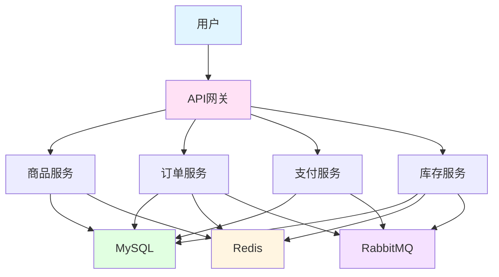
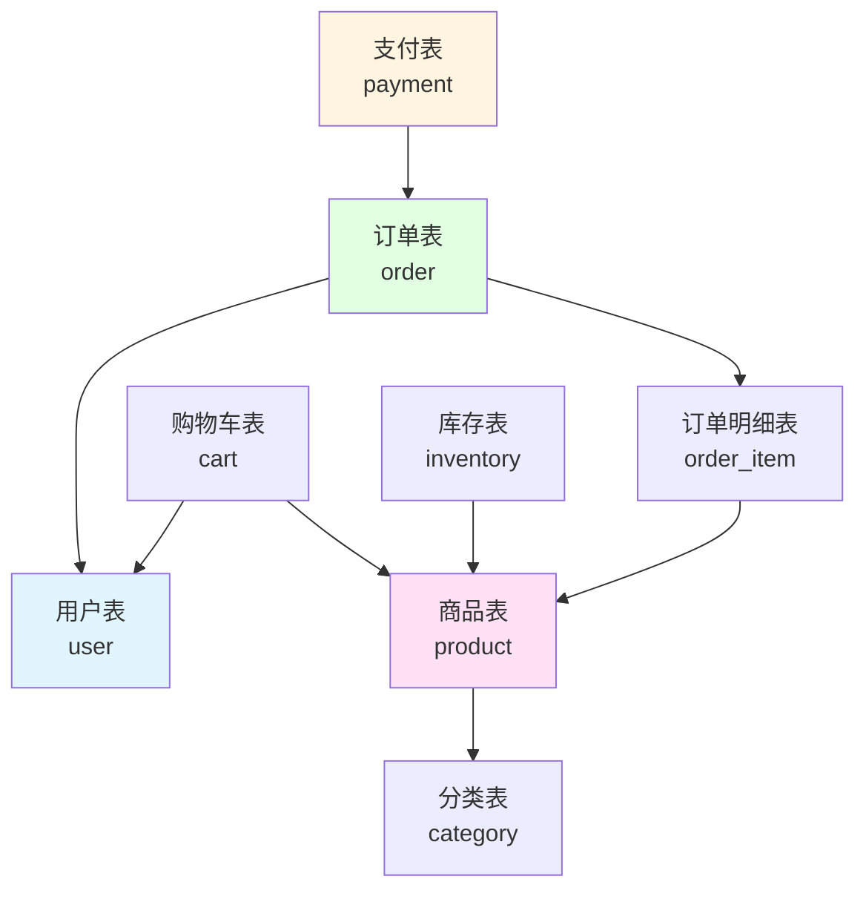

# 实战项目2：电商平台微服务版

> **学习目标**：综合运用所学知识构建电商平台后端
> **核心内容**：商品管理、订单系统、支付集成、库存管理
> **预计时间**：10小时

## 项目概述

### 项目简介

构建一个功能完整的电商平台后端系统，包含商品管理、购物车、订单、支付、库存等核心功能。



### 技术栈

- **框架**：Spring Boot 3.2
- **数据库**：MySQL 8.0 + Redis 7.0
- **消息队列**：RabbitMQ
- **安全**：Spring Security + JWT
- **ORM**：Spring Data JPA
- **文档**：Swagger/OpenAPI 3.0
- **构建**：Maven

### 功能模块

```java
/**
 * 电商平台功能模块
 */
public class ECommerceFeatures {
    public static void main(String[] args) {
        System.out.println("=== 电商平台功能模块 ===\n");

        System.out.println("1. 商品模块：");
        System.out.println("   - 商品CRUD");
        System.out.println("   - 商品分类");
        System.out.println("   - 商品搜索");
        System.out.println("   - 商品推荐\n");

        System.out.println("2. 购物车模块：");
        System.out.println("   - 添加商品");
        System.out.println("   - 修改数量");
        System.out.println("   - 删除商品");
        System.out.println("   - 购物车结算\n");

        System.out.println("3. 订单模块：");
        System.out.println("   - 创建订单");
        System.out.println("   - 订单支付");
        System.out.println("   - 订单状态流转");
        System.out.println("   - 订单查询\n");

        System.out.println("4. 支付模块：");
        System.out.println("   - 支付宝支付");
        System.out.println("   - 微信支付");
        System.out.println("   - 支付回调");
        System.out.println("   - 退款处理\n");

        System.out.println("5. 库存模块：");
        System.out.println("   - 库存扣减");
        System.out.println("   - 库存回滚");
        System.out.println("   - 库存预警");
        System.out.println("   - 秒杀库存\n");
    }
}
```

## 数据库设计

### ER图



### 核心表结构

```sql
-- 商品表
CREATE TABLE `product` (
  `id` BIGINT PRIMARY KEY AUTO_INCREMENT COMMENT '商品ID',
  `name` VARCHAR(200) NOT NULL COMMENT '商品名称',
  `subtitle` VARCHAR(300) COMMENT '商品副标题',
  `price` DECIMAL(10,2) NOT NULL COMMENT '价格',
  `stock` INT NOT NULL DEFAULT 0 COMMENT '库存',
  `sales` INT NOT NULL DEFAULT 0 COMMENT '销量',
  `category_id` BIGINT COMMENT '分类ID',
  `main_image` VARCHAR(500) COMMENT '主图',
  `detail` TEXT COMMENT '详情',
  `status` TINYINT NOT NULL DEFAULT 1 COMMENT '状态 1-上架 2-下架',
  `create_time` DATETIME DEFAULT CURRENT_TIMESTAMP,
  `update_time` DATETIME DEFAULT CURRENT_TIMESTAMP ON UPDATE CURRENT_TIMESTAMP,
  INDEX `idx_category` (`category_id`),
  INDEX `idx_status` (`status`)
) ENGINE=InnoDB DEFAULT CHARSET=utf8mb4 COMMENT='商品表';

-- 订单表
CREATE TABLE `order` (
  `id` BIGINT PRIMARY KEY AUTO_INCREMENT COMMENT '订单ID',
  `order_no` VARCHAR(50) NOT NULL UNIQUE COMMENT '订单号',
  `user_id` BIGINT NOT NULL COMMENT '用户ID',
  `total_amount` DECIMAL(10,2) NOT NULL COMMENT '总金额',
  `pay_amount` DECIMAL(10,2) NOT NULL COMMENT '实付金额',
  `status` TINYINT NOT NULL DEFAULT 1 COMMENT '状态 1-待支付 2-已支付 3-已发货 4-已完成 5-已取消',
  `receiver_name` VARCHAR(50) NOT NULL COMMENT '收货人',
  `receiver_phone` VARCHAR(20) NOT NULL COMMENT '收货电话',
  `receiver_address` VARCHAR(500) NOT NULL COMMENT '收货地址',
  `pay_time` DATETIME COMMENT '支付时间',
  `create_time` DATETIME DEFAULT CURRENT_TIMESTAMP,
  `update_time` DATETIME DEFAULT CURRENT_TIMESTAMP ON UPDATE CURRENT_TIMESTAMP,
  INDEX `idx_user` (`user_id`),
  INDEX `idx_order_no` (`order_no`),
  INDEX `idx_status` (`status`)
) ENGINE=InnoDB DEFAULT CHARSET=utf8mb4 COMMENT='订单表';

-- 订单明细表
CREATE TABLE `order_item` (
  `id` BIGINT PRIMARY KEY AUTO_INCREMENT,
  `order_id` BIGINT NOT NULL COMMENT '订单ID',
  `product_id` BIGINT NOT NULL COMMENT '商品ID',
  `product_name` VARCHAR(200) NOT NULL COMMENT '商品名称',
  `product_image` VARCHAR(500) COMMENT '商品图片',
  `price` DECIMAL(10,2) NOT NULL COMMENT '价格',
  `quantity` INT NOT NULL COMMENT '数量',
  `total_amount` DECIMAL(10,2) NOT NULL COMMENT '总金额',
  FOREIGN KEY (`order_id`) REFERENCES `order`(`id`),
  INDEX `idx_order` (`order_id`)
) ENGINE=InnoDB DEFAULT CHARSET=utf8mb4 COMMENT='订单明细表';

-- 库存表
CREATE TABLE `inventory` (
  `id` BIGINT PRIMARY KEY AUTO_INCREMENT,
  `product_id` BIGINT NOT NULL UNIQUE COMMENT '商品ID',
  `stock` INT NOT NULL DEFAULT 0 COMMENT '库存',
  `frozen_stock` INT NOT NULL DEFAULT 0 COMMENT '冻结库存',
  `version` INT NOT NULL DEFAULT 0 COMMENT '版本号（乐观锁）',
  `create_time` DATETIME DEFAULT CURRENT_TIMESTAMP,
  `update_time` DATETIME DEFAULT CURRENT_TIMESTAMP ON UPDATE CURRENT_TIMESTAMP,
  FOREIGN KEY (`product_id`) REFERENCES `product`(`id`),
  INDEX `idx_product` (`product_id`)
) ENGINE=InnoDB DEFAULT CHARSET=utf8mb4 COMMENT='库存表';

-- 支付表
CREATE TABLE `payment` (
  `id` BIGINT PRIMARY KEY AUTO_INCREMENT,
  `order_id` BIGINT NOT NULL COMMENT '订单ID',
  `payment_no` VARCHAR(50) NOT NULL UNIQUE COMMENT '支付单号',
  `payment_type` VARCHAR(20) NOT NULL COMMENT '支付类型 ALIPAY/WXPAY',
  `amount` DECIMAL(10,2) NOT NULL COMMENT '支付金额',
  `status` TINYINT NOT NULL DEFAULT 1 COMMENT '状态 1-待支付 2-支付成功 3-支付失败',
  `transaction_id` VARCHAR(100) COMMENT '第三方交易号',
  `pay_time` DATETIME COMMENT '支付时间',
  `create_time` DATETIME DEFAULT CURRENT_TIMESTAMP,
  `update_time` DATETIME DEFAULT CURRENT_TIMESTAMP ON UPDATE CURRENT_TIMESTAMP,
  FOREIGN KEY (`order_id`) REFERENCES `order`(`id`),
  INDEX `idx_order` (`order_id`),
  INDEX `idx_payment_no` (`payment_no`)
) ENGINE=InnoDB DEFAULT CHARSET=utf8mb4 COMMENT='支付表';
```

## 核心代码实现

### 商品服务

```java
package com.example.ecommerce.service;

import com.example.ecommerce.entity.Product;
import com.example.ecommerce.repository.ProductRepository;
import org.springframework.beans.factory.annotation.Autowired;
import org.springframework.cache.annotation.*;
import org.springframework.data.domain.*;
import org.springframework.stereotype.Service;
import org.springframework.transaction.annotation.Transactional;

/**
 * 商品服务
 */
@Service
public class ProductService {

    @Autowired
    private ProductRepository productRepository;

    /**
     * 创建商品
     */
    @CacheEvict(value = "products", allEntries = true)
    @Transactional
    public Product create(Product product) {
        return productRepository.save(product);
    }

    /**
     * 更新商品
     */
    @CachePut(value = "products", key = "#product.id")
    @Transactional
    public Product update(Product product) {
        return productRepository.save(product);
    }

    /**
     * 查询商品（缓存）
     */
    @Cacheable(value = "products", key = "#id")
    public Product findById(Long id) {
        return productRepository.findById(id)
                .orElseThrow(() -> new RuntimeException("商品不存在"));
    }

    /**
     * 分页查询商品
     */
    public Page<Product> findByPage(int page, int size) {
        Pageable pageable = PageRequest.of(page, size,
                Sort.by("createTime").descending());
        return productRepository.findAll(pageable);
    }

    /**
     * 搜索商品
     */
    public Page<Product> search(String keyword, int page, int size) {
        Pageable pageable = PageRequest.of(page, size);
        return productRepository.findByNameContaining(keyword, pageable);
    }

    /**
     * 扣减库存
     */
    @Transactional
    public boolean reduceStock(Long productId, int quantity) {
        Product product = findById(productId);

        if (product.getStock() < quantity) {
            return false;
        }

        product.setStock(product.getStock() - quantity);
        product.setSales(product.getSales() + quantity);

        productRepository.save(product);
        return true;
    }
}
```

### 订单服务

```java
package com.example.ecommerce.service;

import com.example.ecommerce.entity.*;
import com.example.ecommerce.repository.*;
import org.springframework.amqp.rabbit.core.RabbitTemplate;
import org.springframework.beans.factory.annotation.Autowired;
import org.springframework.data.redis.core.RedisTemplate;
import org.springframework.stereotype.Service;
import org.springframework.transaction.annotation.Transactional;

import java.math.BigDecimal;
import java.time.LocalDateTime;
import java.util.*;

/**
 * 订单服务
 */
@Service
public class OrderService {

    @Autowired
    private OrderRepository orderRepository;

    @Autowired
    private OrderItemRepository orderItemRepository;

    @Autowired
    private CartRepository cartRepository;

    @Autowired
    private ProductService productService;

    @Autowired
    private InventoryService inventoryService;

    @Autowired
    private RedisTemplate<String, Object> redisTemplate;

    @Autowired
    private RabbitTemplate rabbitTemplate;

    /**
     * 创建订单
     */
    @Transactional
    public Order createOrder(Long userId, List<CartItem> items, Address address) {
        // 1. 创建订单
        Order order = new Order();
        order.setOrderNo(generateOrderNo());
        order.setUserId(userId);
        order.setStatus(OrderStatus.PENDING_PAYMENT);
        order.setReceiverName(address.getName());
        order.setReceiverPhone(address.getPhone());
        order.setReceiverAddress(address.getAddress());

        // 2. 创建订单明细
        List<OrderItem> orderItems = new ArrayList<>();
        BigDecimal totalAmount = BigDecimal.ZERO;

        for (CartItem item : items) {
            Product product = productService.findById(item.getProductId());

            // 检查库存
            if (!inventoryService.checkAndLockStock(product.getId(), item.getQuantity())) {
                throw new RuntimeException("商品库存不足：" + product.getName());
            }

            OrderItem orderItem = new OrderItem();
            orderItem.setOrderId(order.getId());
            orderItem.setProductId(product.getId());
            orderItem.setProductName(product.getName());
            orderItem.setProductImage(product.getMainImage());
            orderItem.setPrice(product.getPrice());
            orderItem.setQuantity(item.getQuantity());
            orderItem.setTotalAmount(product.getPrice()
                    .multiply(new BigDecimal(item.getQuantity())));

            orderItems.add(orderItem);
            totalAmount = totalAmount.add(orderItem.getTotalAmount());
        }

        order.setTotalAmount(totalAmount);
        order.setPayAmount(totalAmount);

        // 3. 保存订单
        orderRepository.save(order);
        orderItemRepository.saveAll(orderItems);

        // 4. 清空购物车
        cartRepository.deleteByUserId(userId);

        // 5. 发送延迟消息（自动取消订单）
        rabbitTemplate.convertAndSend("order.exchange",
                "order.delay",
                order.getId(),
                message -> {
                    message.getMessageProperties().setDelay(30 * 60 * 1000); // 30分钟
                    return message;
                });

        return order;
    }

    /**
     * 取消订单
     */
    @Transactional
    public void cancelOrder(Long orderId) {
        Order order = orderRepository.findById(orderId)
                .orElseThrow(() -> new RuntimeException("订单不存在"));

        if (order.getStatus() != OrderStatus.PENDING_PAYMENT) {
            throw new RuntimeException("订单状态不允许取消");
        }

        order.setStatus(OrderStatus.CANCELLED);
        orderRepository.save(order);

        // 释放库存
        List<OrderItem> items = orderItemRepository.findByOrderId(orderId);
        items.forEach(item -> {
            inventoryService.unlockStock(item.getProductId(), item.getQuantity());
        });
    }

    /**
     * 支付成功
     */
    @Transactional
    public void paySuccess(Long orderId) {
        Order order = orderRepository.findById(orderId)
                .orElseThrow(() -> new RuntimeException("订单不存在"));

        if (order.getStatus() != OrderStatus.PENDING_PAYMENT) {
            throw new RuntimeException("订单状态异常");
        }

        order.setStatus(OrderStatus.PAID);
        order.setPayTime(LocalDateTime.now());
        orderRepository.save(order);

        // 扣减库存
        List<OrderItem> items = orderItemRepository.findByOrderId(orderId);
        items.forEach(item -> {
            inventoryService.confirmReduceStock(item.getProductId(), item.getQuantity());
        });

        // 发送消息
        rabbitTemplate.convertAndSend("order.exchange",
                "order.paid",
                order);
    }

    private String generateOrderNo() {
        return "ORD" + System.currentTimeMillis() +
               (int)(Math.random() * 10000);
    }
}
```

### 库存服务

```java
package com.example.ecommerce.service;

import com.example.ecommerce.entity.Inventory;
import com.example.ecommerce.repository.InventoryRepository;
import org.springframework.beans.factory.annotation.Autowired;
import org.springframework.data.redis.core.RedisTemplate;
import org.springframework.stereotype.Service;
import org.springframework.transaction.annotation.Transactional;

/**
 * 库存服务
 */
@Service
public class InventoryService {

    @Autowired
    private InventoryRepository inventoryRepository;

    @Autowired
    private RedisTemplate<String, Object> redisTemplate;

    /**
     * 检查并锁定库存
     */
    @Transactional
    public boolean checkAndLockStock(Long productId, int quantity) {
        // 使用Redis分布式锁
        String lockKey = "inventory:lock:" + productId;

        try {
            Boolean locked = redisTemplate.opsForValue()
                    .setIfAbsent(lockKey, "1", 10, java.util.concurrent.TimeUnit.SECONDS);

            if (Boolean.FALSE.equals(locked)) {
                return false;
            }

            Inventory inventory = inventoryRepository.findByProductId(productId);

            if (inventory.getStock() - inventory.getFrozenStock() < quantity) {
                return false;
            }

            // 增加冻结库存
            inventory.setFrozenStock(inventory.getFrozenStock() + quantity);
            inventoryRepository.save(inventory);

            return true;

        } finally {
            redisTemplate.delete(lockKey);
        }
    }

    /**
     * 确认扣减库存
     */
    @Transactional
    public void confirmReduceStock(Long productId, int quantity) {
        Inventory inventory = inventoryRepository.findByProductId(productId);

        // 减少冻结库存和实际库存
        inventory.setFrozenStock(inventory.getFrozenStock() - quantity);
        inventory.setStock(inventory.getStock() - quantity);
        inventoryRepository.save(inventory);

        // 更新Redis缓存
        redisTemplate.opsForValue().set("product:stock:" + productId,
                inventory.getStock());
    }

    /**
     * 释放库存
     */
    @Transactional
    public void unlockStock(Long productId, int quantity) {
        Inventory inventory = inventoryRepository.findByProductId(productId);

        // 减少冻结库存
        inventory.setFrozenStock(inventory.getFrozenStock() - quantity);
        inventoryRepository.save(inventory);
    }
}
```

### 支付服务

```java
package com.example.ecommerce.service;

import com.example.ecommerce.entity.Payment;
import com.example.ecommerce.entity.Order;
import com.example.ecommerce.repository.PaymentRepository;
import org.springframework.beans.factory.annotation.Autowired;
import org.springframework.stereotype.Service;
import org.springframework.transaction.annotation.Transactional;

import java.math.BigDecimal;
import java.time.LocalDateTime;

/**
 * 支付服务
 */
@Service
public class PaymentService {

    @Autowired
    private PaymentRepository paymentRepository;

    @Autowired
    private OrderService orderService;

    /**
     * 创建支付
     */
    @Transactional
    public Payment createPayment(Long orderId, String paymentType) {
        Order order = orderService.findById(orderId);

        Payment payment = new Payment();
        payment.setOrderId(orderId);
        payment.setPaymentNo(generatePaymentNo());
        payment.setPaymentType(paymentType);
        payment.setAmount(order.getPayAmount());
        payment.setStatus(PaymentStatus.PENDING);

        return paymentRepository.save(payment);
    }

    /**
     * 支付宝支付回调
     */
    @Transactional
    public void alipayCallback(String paymentNo, String transactionId) {
        Payment payment = paymentRepository.findByPaymentNo(paymentNo);

        if (payment == null) {
            throw new RuntimeException("支付单不存在");
        }

        if (payment.getStatus() == PaymentStatus.SUCCESS) {
            return; // 已处理
        }

        payment.setStatus(PaymentStatus.SUCCESS);
        payment.setTransactionId(transactionId);
        payment.setPayTime(LocalDateTime.now());
        paymentRepository.save(payment);

        // 更新订单状态
        orderService.paySuccess(payment.getOrderId());
    }

    /**
     * 退款
     */
    @Transactional
    public void refund(Long paymentId, BigDecimal amount) {
        Payment payment = paymentRepository.findById(paymentId)
                .orElseThrow(() -> new RuntimeException("支付单不存在"));

        if (payment.getStatus() != PaymentStatus.SUCCESS) {
            throw new RuntimeException("支付单状态异常");
        }

        if (amount.compareTo(payment.getAmount()) > 0) {
            throw new RuntimeException("退款金额超过支付金额");
        }

        // 调用第三方退款接口
        boolean success = callRefundAPI(payment, amount);

        if (success) {
            // 更新支付单状态
            // 记录退款流水
        }
    }

    private String generatePaymentNo() {
        return "PAY" + System.currentTimeMillis() +
               (int)(Math.random() * 10000);
    }

    private boolean callRefundAPI(Payment payment, BigDecimal amount) {
        // 调用支付宝/微信退款接口
        return true;
    }
}
```

## API接口

### Controller示例

```java
package com.example.ecommerce.controller;

import com.example.ecommerce.entity.*;
import com.example.ecommerce.service.*;
import org.springframework.beans.factory.annotation.Autowired;
import org.springframework.data.domain.*;
import org.springframework.web.bind.annotation.*;

/**
 * 商品Controller
 */
@RestController
@RequestMapping("/api/products")
public class ProductController {

    @Autowired
    private ProductService productService;

    @GetMapping("/{id}")
    public Result<Product> getById(@PathVariable Long id) {
        Product product = productService.findById(id);
        return Result.success(product);
    }

    @GetMapping
    public Result<Page<Product>> list(
            @RequestParam(defaultValue = "0") int page,
            @RequestParam(defaultValue = "10") int size) {
        Page<Product> products = productService.findByPage(page, size);
        return Result.success(products);
    }

    @GetMapping("/search")
    public Result<Page<Product>> search(
            @RequestParam String keyword,
            @RequestParam(defaultValue = "0") int page,
            @RequestParam(defaultValue = "10") int size) {
        Page<Product> products = productService.search(keyword, page, size);
        return Result.success(products);
    }
}

/**
 * 订单Controller
 */
@RestController
@RequestMapping("/api/orders")
public class OrderController {

    @Autowired
    private OrderService orderService;

    @PostMapping
    public Result<Order> create(@RequestBody CreateOrderRequest request) {
        Order order = orderService.createOrder(
                request.getUserId(),
                request.getItems(),
                request.getAddress()
        );
        return Result.success(order);
    }

    @GetMapping("/{id}")
    public Result<Order> getById(@PathVariable Long id) {
        Order order = orderService.findById(id);
        return Result.success(order);
    }

    @PostMapping("/{id}/cancel")
    public Result<Void> cancel(@PathVariable Long id) {
        orderService.cancelOrder(id);
        return Result.success();
    }
}

class Result<T> {
    private int code;
    private String message;
    private T data;

    public static <T> Result<T> success(T data) {
        Result<T> result = new Result<>();
        result.code = 200;
        result.message = "success";
        result.data = data;
        return result;
    }

    // getters and setters
}

class CreateOrderRequest {
    private Long userId;
    private List<CartItem> items;
    private Address address;

    // getters and setters
}
```

## 项目部署

### Docker部署

```dockerfile
# Dockerfile
FROM openjdk:17-jdk-slim

WORKDIR /app

COPY target/ecommerce.jar app.jar

EXPOSE 8080

ENTRYPOINT ["java", "-jar", "app.jar"]
```

```yaml
# docker-compose.yml
version: '3.8'

services:
  mysql:
    image: mysql:8.0
    environment:
      MYSQL_ROOT_PASSWORD: root
      MYSQL_DATABASE: ecommerce
    ports:
      - "3306:3306"
    volumes:
      - mysql-data:/var/lib/mysql

  redis:
    image: redis:7.0
    ports:
      - "6379:6379"
    volumes:
      - redis-data:/data

  rabbitmq:
    image: rabbitmq:3.12-management
    ports:
      - "5672:5672"
      - "15672:15672"
    environment:
      RABBITMQ_DEFAULT_USER: guest
      RABBITMQ_DEFAULT_PASS: guest

  app:
    build: .
    ports:
      - "8080:8080"
    depends_on:
      - mysql
      - redis
      - rabbitmq
    environment:
      SPRING_DATASOURCE_URL: jdbc:mysql://mysql:3306/ecommerce
      SPRING_REDIS_HOST: redis
      SPRING_RABBITMQ_HOST: rabbitmq

volumes:
  mysql-data:
  redis-data:
```

## 本章小结

### 项目总结

✅ **商品模块**：CRUD、分类、搜索
✅ **购物车模块**：添加、修改、删除、结算
✅ **订单模块**：创建、支付、状态流转
✅ **支付模块**：支付宝、微信支付集成
✅ **库存模块**：库存扣减、回滚、分布式锁
✅ **项目部署**：Docker、Docker Compose

### 技术亮点

- **Redis缓存**：商品信息缓存
- **分布式锁**：库存扣减
- **消息队列**：订单延迟取消
- **事务管理**：订单创建
- **乐观锁**：库存更新

### 下一步学习

- **第27章**：实战项目3：在线教育平台

---

**学习时间**：约10小时
**难度等级**：★★★★★
**重要程度**：★★★★★
