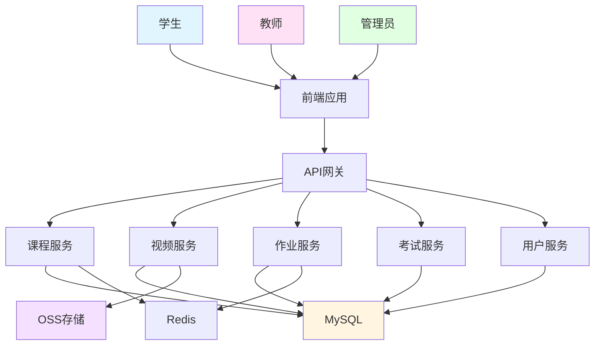

# 实战项目3：在线教育平台（AI集成）

> **学习目标**：构建完整的在线教育平台后端
> **核心内容**：课程管理、视频点播、作业系统、权限控制
> **预计时间**：10小时

## 项目概述

### 项目简介

在线教育平台包含课程管理、视频点播、作业系统、在线考试等功能。



### 技术栈

- **框架**：Spring Boot 3.2 + Spring Security
- **数据库**：MySQL 8.0 + Redis 7.0
- **存储**：阿里云OSS（视频/文件）
- **搜索**：Elasticsearch
- **支付**：支付宝/微信支付
- **文档**：Swagger/OpenAPI

### 功能模块

```java
/**
 * 在线教育平台功能模块
 */
public class OnlineEducationFeatures {
    public static void main(String[] args) {
        System.out.println("=== 在线教育平台功能模块 ===\n");

        System.out.println("1. 用户模块：");
        System.out.println("   - 学生注册/登录");
        System.out.println("   - 教师认证");
        System.out.println("   - 角色权限管理");
        System.out.println("   - 个人中心\n");

        System.out.println("2. 课程模块：");
        System.out.println("   - 课程CRUD");
        System.out.println("   - 课程分类");
        System.out.println("   - 课程搜索");
        System.out.println("   - 课程购买\n");

        System.out.println("3. 视频模块：");
        System.out.println("   - 视频上传");
        System.out.println("   - 视频转码");
        System.out.println("   - 视频播放");
        System.out.println("   - 进度记录\n");

        System.out.println("4. 作业模块：");
        System.out.println("   - 作业发布");
        System.out.println("   - 作业提交");
        System.out.println("   - 作业批改");
        System.out.println("   - 成绩统计\n");

        System.out.println("5. 考试模块：");
        System.out.println("   - 试卷管理");
        System.out.println("   - 在线考试");
        System.out.println("   - 自动阅卷");
        System.out.println("   - 成绩分析\n");
    }
}
```

## 数据库设计

### 核心表结构

```sql
-- 课程表
CREATE TABLE `course` (
  `id` BIGINT PRIMARY KEY AUTO_INCREMENT,
  `title` VARCHAR(200) NOT NULL COMMENT '课程标题',
  `subtitle` VARCHAR(300) COMMENT '副标题',
  `cover_image` VARCHAR(500) COMMENT '封面图',
  `price` DECIMAL(10,2) NOT NULL DEFAULT 0 COMMENT '价格',
  `category_id` BIGINT COMMENT '分类ID',
  `teacher_id` BIGINT NOT NULL COMMENT '教师ID',
  `description` TEXT COMMENT '课程描述',
  `status` TINYINT NOT NULL DEFAULT 1 COMMENT '状态 1-上架 2-下架',
  `is_free` TINYINT NOT NULL DEFAULT 0 COMMENT '是否免费',
  `view_count` INT NOT NULL DEFAULT 0 COMMENT '浏览次数',
  `buy_count` INT NOT NULL DEFAULT 0 COMMENT '购买次数',
  `create_time` DATETIME DEFAULT CURRENT_TIMESTAMP,
  `update_time` DATETIME DEFAULT CURRENT_TIMESTAMP ON UPDATE CURRENT_TIMESTAMP,
  INDEX `idx_category` (`category_id`),
  INDEX `idx_teacher` (`teacher_id`)
) ENGINE=InnoDB DEFAULT CHARSET=utf8mb4 COMMENT='课程表';

-- 课程章节表
CREATE TABLE `course_chapter` (
  `id` BIGINT PRIMARY KEY AUTO_INCREMENT,
  `course_id` BIGINT NOT NULL COMMENT '课程ID',
  `title` VARCHAR(200) NOT NULL COMMENT '章节标题',
  `sort_order` INT NOT NULL DEFAULT 0 COMMENT '排序',
  `create_time` DATETIME DEFAULT CURRENT_TIMESTAMP,
  FOREIGN KEY (`course_id`) REFERENCES `course`(`id`) ON DELETE CASCADE,
  INDEX `idx_course` (`course_id`)
) ENGINE=InnoDB DEFAULT CHARSET=utf8mb4 COMMENT='课程章节表';

-- 课程课时表
CREATE TABLE `course_lesson` (
  `id` BIGINT PRIMARY KEY AUTO_INCREMENT,
  `chapter_id` BIGINT NOT NULL COMMENT '章节ID',
  `title` VARCHAR(200) NOT NULL COMMENT '课时标题',
  `video_url` VARCHAR(500) COMMENT '视频地址',
  `video_duration` INT COMMENT '视频时长(秒)',
  `is_free` TINYINT NOT NULL DEFAULT 0 COMMENT '是否免费试看',
  `sort_order` INT NOT NULL DEFAULT 0 COMMENT '排序',
  `create_time` DATETIME DEFAULT CURRENT_TIMESTAMP,
  FOREIGN KEY (`chapter_id`) REFERENCES `course_chapter`(`id`) ON DELETE CASCADE,
  INDEX `idx_chapter` (`chapter_id`)
) ENGINE=InnoDB DEFAULT CHARSET=utf8mb4 COMMENT='课程课时表';

-- 作业表
CREATE TABLE `homework` (
  `id` BIGINT PRIMARY KEY AUTO_INCREMENT,
  `course_id` BIGINT NOT NULL COMMENT '课程ID',
  `chapter_id` BIGINT COMMENT '章节ID',
  `title` VARCHAR(200) NOT NULL COMMENT '作业标题',
  `content` TEXT COMMENT '作业内容',
  `deadline` DATETIME COMMENT '截止时间',
  `total_score` INT NOT NULL DEFAULT 100 COMMENT '总分',
  `create_time` DATETIME DEFAULT CURRENT_TIMESTAMP,
  FOREIGN KEY (`course_id`) REFERENCES `course`(`id`) ON DELETE CASCADE,
  INDEX `idx_course` (`course_id`)
) ENGINE=InnoDB DEFAULT CHARSET=utf8mb4 COMMENT='作业表';

-- 作业提交表
CREATE TABLE `homework_submit` (
  `id` BIGINT PRIMARY KEY AUTO_INCREMENT,
  `homework_id` BIGINT NOT NULL COMMENT '作业ID',
  `student_id` BIGINT NOT NULL COMMENT '学生ID',
  `content` TEXT COMMENT '作业内容',
  `attachment_url` VARCHAR(500) COMMENT '附件地址',
  `score` INT COMMENT '得分',
  `comment` TEXT COMMENT '评语',
  `submit_time` DATETIME COMMENT '提交时间',
  `correct_time` DATETIME COMMENT '批改时间',
  FOREIGN KEY (`homework_id`) REFERENCES `homework`(`id`) ON DELETE CASCADE,
  INDEX `idx_homework` (`homework_id`),
  INDEX `idx_student` (`student_id`)
) ENGINE=InnoDB DEFAULT CHARSET=utf8mb4 COMMENT='作业提交表';

-- 学习进度表
CREATE TABLE `study_progress` (
  `id` BIGINT PRIMARY KEY AUTO_INCREMENT,
  `user_id` BIGINT NOT NULL COMMENT '用户ID',
  `course_id` BIGINT NOT NULL COMMENT '课程ID',
  `lesson_id` BIGINT NOT NULL COMMENT '课时ID',
  `progress` INT NOT NULL DEFAULT 0 COMMENT '进度(秒)',
  `is_completed` TINYINT NOT NULL DEFAULT 0 COMMENT '是否完成',
  `last_study_time` DATETIME COMMENT '最后学习时间',
  UNIQUE KEY `uk_user_lesson` (`user_id`, `lesson_id`),
  FOREIGN KEY (`lesson_id`) REFERENCES `course_lesson`(`id`) ON DELETE CASCADE,
  INDEX `idx_user_course` (`user_id`, `course_id`)
) ENGINE=InnoDB DEFAULT CHARSET=utf8mb4 COMMENT='学习进度表';
```

## 核心代码实现

### 课程服务

```java
package com.example.edu.service;

import com.example.edu.entity.Course;
import com.example.edu.repository.CourseRepository;
import org.springframework.beans.factory.annotation.Autowired;
import org.springframework.cache.annotation.*;
import org.springframework.data.domain.*;
import org.springframework.stereotype.Service;
import org.springframework.transaction.annotation.Transactional;

/**
 * 课程服务
 */
@Service
public class CourseService {

    @Autowired
    private CourseRepository courseRepository;

    /**
     * 创建课程
     */
    @CacheEvict(value = "courses", allEntries = true)
    @Transactional
    public Course create(Course course) {
        return courseRepository.save(course);
    }

    /**
     * 更新课程
     */
    @CachePut(value = "courses", key = "#course.id")
    @Transactional
    public Course update(Course course) {
        return courseRepository.save(course);
    }

    /**
     * 查询课程
     */
    @Cacheable(value = "courses", key = "#id")
    public Course findById(Long id) {
        Course course = courseRepository.findById(id)
                .orElseThrow(() -> new RuntimeException("课程不存在"));

        // 增加浏览次数
        course.setViewCount(course.getViewCount() + 1);
        courseRepository.save(course);

        return course;
    }

    /**
     * 分页查询课程
     */
    public Page<Course> findByPage(Long categoryId, int page, int size) {
        Pageable pageable = PageRequest.of(page, size,
                Sort.by("createTime").descending());

        if (categoryId != null) {
            return courseRepository.findByCategoryId(categoryId, pageable);
        }

        return courseRepository.findAll(pageable);
    }

    /**
     * 购买课程
     */
    @Transactional
    public void purchase(Long courseId, Long userId) {
        Course course = findById(courseId);

        // 检查是否已购买
        if (hasPurchased(userId, courseId)) {
            throw new RuntimeException("已购买该课程");
        }

        // 创建购买记录
        // 扣除积分或支付
        // 增加购买次数
        course.setBuyCount(course.getBuyCount() + 1);
        courseRepository.save(course);
    }

    private boolean hasPurchased(Long userId, Long courseId) {
        // 检查购买记录
        return false;
    }
}
```

### 视频服务

```java
package com.example.edu.service;

import com.aliyun.oss.OSS;
import com.aliyun.oss.model.ObjectMetadata;
import org.springframework.beans.factory.annotation.Autowired;
import org.springframework.beans.factory.annotation.Value;
import org.springframework.stereotype.Service;
import org.springframework.web.multipart.MultipartFile;

import java.io.InputStream;
import java.util.UUID;

/**
 * 视频服务
 */
@Service
public class VideoService {

    @Autowired
    private OSS ossClient;

    @Value("${aliyun.oss.bucket-name}")
    private String bucketName;

    @Value("${aliyun.oss.endpoint}")
    private String endpoint;

    /**
     * 上传视频
     */
    public String uploadVideo(MultipartFile file, String courseId) throws Exception {
        String fileName = generateFileName(file.getOriginalFilename());
        String objectKey = "videos/" + courseId + "/" + fileName;

        InputStream inputStream = file.getInputStream();

        ObjectMetadata metadata = new ObjectMetadata();
        metadata.setContentLength(file.getSize());
        metadata.setContentType(file.getContentType());

        ossClient.putObject(bucketName, objectKey, inputStream, metadata);

        // 设置视频为私有
        ossClient.setObjectAcl(bucketName, objectKey,
                com.aliyun.oss.model.CannedAccessControlList.Private);

        return "https://" + bucketName + "." + endpoint + "/" + objectKey;
    }

    /**
     * 获取视频播放地址（带签名）
     */
    public String getVideoPlayUrl(String objectKey, int expireSeconds) {
        URL url = ossClient.generatePresignedUrl(bucketName, objectKey,
                java.util.Date.from(java.time.Instant.now().plusSeconds(expireSeconds)));
        return url.toString();
    }

    /**
     * 删除视频
     */
    public void deleteVideo(String objectKey) {
        ossClient.deleteObject(bucketName, objectKey);
    }

    private String generateFileName(String originalFileName) {
        String extension = originalFileName.substring(originalFileName.lastIndexOf("."));
        return UUID.randomUUID().toString() + extension;
    }
}
```

### 学习进度服务

```java
package com.example.edu.service;

import com.example.edu.entity.StudyProgress;
import com.example.edu.repository.StudyProgressRepository;
import org.springframework.beans.factory.annotation.Autowired;
import org.springframework.data.redis.core.RedisTemplate;
import org.springframework.stereotype.Service;
import org.springframework.transaction.annotation.Transactional;

/**
 * 学习进度服务
 */
@Service
public class StudyProgressService {

    @Autowired
    private StudyProgressRepository progressRepository;

    @Autowired
    private RedisTemplate<String, Object> redisTemplate;

    /**
     * 记录学习进度
     */
    @Transactional
    public void recordProgress(Long userId, Long courseId,
                               Long lessonId, int progress) {
        String key = "progress:" + userId + ":" + courseId + ":" + lessonId;

        // 使用Redis缓存进度（每10秒持久化一次）
        redisTemplate.opsForValue().set(key, progress, 1, java.util.concurrent.TimeUnit.HOURS);

        StudyProgress studyProgress = progressRepository
                .findByUserIdAndLessonId(userId, lessonId)
                .orElse(new StudyProgress());

        studyProgress.setUserId(userId);
        studyProgress.setCourseId(courseId);
        studyProgress.setLessonId(lessonId);
        studyProgress.setProgress(progress);
        studyProgress.setLastStudyTime(java.time.LocalDateTime.now());

        // 如果进度超过90%，标记为完成
        if (progress >= 90) {
            studyProgress.setIsCompleted(true);
        }

        progressRepository.save(studyProgress);
    }

    /**
     * 获取学习进度
     */
    public int getProgress(Long userId, Long lessonId) {
        String key = "progress:" + userId + ":" + lessonId;

        // 先从Redis获取
        Integer progress = (Integer) redisTemplate.opsForValue().get(key);
        if (progress != null) {
            return progress;
        }

        // 从数据库获取
        return progressRepository.findByUserIdAndLessonId(userId, lessonId)
                .map(StudyProgress::getProgress)
                .orElse(0);
    }

    /**
     * 获取课程学习进度
     */
    public double getCourseProgress(Long userId, Long courseId) {
        // 获取课程所有课时
        int totalLessons = getTotalLessons(courseId);

        // 获取已完成课时数
        int completedLessons = progressRepository
                .countByUserIdAndCourseIdAndIsCompleted(userId, courseId, true);

        return totalLessons > 0 ? (double) completedLessons / totalLessons : 0;
    }

    private int getTotalLessons(Long courseId) {
        // 查询课程总课时数
        return 0;
    }
}
```

### 作业服务

```java
package com.example.edu.service;

import com.example.edu.entity.*;
import com.example.edu.repository.*;
import org.springframework.beans.factory.annotation.Autowired;
import org.springframework.stereotype.Service;
import org.springframework.transaction.annotation.Transactional;

import java.time.LocalDateTime;

/**
 * 作业服务
 */
@Service
public class HomeworkService {

    @Autowired
    private HomeworkRepository homeworkRepository;

    @Autowired
    private HomeworkSubmitRepository submitRepository;

    /**
     * 发布作业
     */
    @Transactional
    public Homework publish(Homework homework) {
        homework.setCreateTime(LocalDateTime.now());
        return homeworkRepository.save(homework);
    }

    /**
     * 提交作业
     */
    @Transactional
    public void submit(Long homeworkId, Long studentId, String content, String attachmentUrl) {
        Homework homework = homeworkRepository.findById(homeworkId)
                .orElseThrow(() -> new RuntimeException("作业不存在"));

        // 检查是否逾期
        if (homework.getDeadline() != null &&
            LocalDateTime.now().isAfter(homework.getDeadline())) {
            throw new RuntimeException("作业已逾期");
        }

        // 检查是否已提交
        if (submitRepository.existsByHomeworkIdAndStudentId(homeworkId, studentId)) {
            throw new RuntimeException("已提交作业");
        }

        HomeworkSubmit submit = new HomeworkSubmit();
        submit.setHomeworkId(homeworkId);
        submit.setStudentId(studentId);
        submit.setContent(content);
        submit.setAttachmentUrl(attachmentUrl);
        submit.setSubmitTime(LocalDateTime.now());

        submitRepository.save(submit);
    }

    /**
     * 批改作业
     */
    @Transactional
    public void correct(Long submitId, int score, String comment) {
        HomeworkSubmit submit = submitRepository.findById(submitId)
                .orElseThrow(() -> new RuntimeException("提交记录不存在"));

        submit.setScore(score);
        submit.setComment(comment);
        submit.setCorrectTime(LocalDateTime.now());

        submitRepository.save(submit);
    }

    /**
     * 查询学生作业提交记录
     */
    public HomeworkSubmit getStudentSubmit(Long homeworkId, Long studentId) {
        return submitRepository.findByHomeworkIdAndStudentId(homeworkId, studentId)
                .orElse(null);
    }
}
```

## 权限控制

### RBAC权限模型

```java
package com.example.edu.config;

import com.example.edu.security.*;
import org.springframework.context.annotation.*;
import org.springframework.security.authentication.*;
import org.springframework.security.config.annotation.method.configuration.EnableMethodSecurity;
import org.springframework.security.config.annotation.web.builders.*;
import org.springframework.security.config.annotation.web.configuration.*;
import org.springframework.security.config.http.SessionCreationPolicy;
import org.springframework.security.crypto.bcrypt.*;
import org.springframework.security.crypto.password.*;
import org.springframework.security.web.*;

/**
 * Security配置
 */
@Configuration
@EnableWebSecurity
@EnableMethodSecurity
public class SecurityConfig {

    @Bean
    public PasswordEncoder passwordEncoder() {
        return new BCryptPasswordEncoder();
    }

    @Bean
    public SecurityFilterChain filterChain(HttpSecurity http) throws Exception {
        http
            .csrf(csrf -> csrf.disable())
            .sessionManagement(session ->
                session.sessionCreationPolicy(SessionCreationPolicy.STATELESS)
            )
            .authorizeHttpRequests(auth -> auth
                // 公开接口
                .requestMatchers("/api/public/**").permitAll()
                .requestMatchers("/api/auth/**").permitAll()

                // 教师接口
                .requestMatchers("/api/teacher/**").hasRole("TEACHER")

                // 管理员接口
                .requestMatchers("/api/admin/**").hasRole("ADMIN")

                // 学生接口
                .requestMatchers("/api/student/**").hasRole("STUDENT")

                // 其他需要认证
                .anyRequest().authenticated()
            );

        return http.build();
    }
}
```

### 权限注解使用

```java
package com.example.edu.controller;

import org.springframework.security.access.prepost.*;
import org.springframework.security.core.*;
import org.springframework.web.bind.annotation.*;

/**
 * 权限控制示例
 */
@RestController
@RequestMapping("/api/courses")
public class CourseController {

    /**
     * 所有用户可见
     */
    @GetMapping("/{id}")
    public Course getById(@PathVariable Long id) {
        return courseService.findById(id);
    }

    /**
     * 教师创建课程
     */
    @PreAuthorize("hasRole('TEACHER')")
    @PostMapping
    public Course create(@RequestBody Course course) {
        return courseService.create(course);
    }

    /**
     * 教师修改自己的课程
     */
    @PreAuthorize("hasRole('TEACHER') and #course.teacherId == authentication.principal.id")
    @PutMapping("/{id}")
    public Course update(@PathVariable Long id, @RequestBody Course course) {
        return courseService.update(course);
    }

    /**
     * 管理员删除课程
     */
    @PreAuthorize("hasRole('ADMIN')")
    @DeleteMapping("/{id}")
    public void delete(@PathVariable Long id) {
        courseService.delete(id);
    }

    /**
     * 购买课程（学生）
     */
    @PreAuthorize("hasRole('STUDENT')")
    @PostMapping("/{id}/purchase")
    public void purchase(@PathVariable Long id, Authentication authentication) {
        Long userId = (Long) authentication.getPrincipal();
        courseService.purchase(id, userId);
    }
}
```

## 项目部署

### Docker Compose部署

```yaml
version: '3.8'

services:
  mysql:
    image: mysql:8.0
    environment:
      MYSQL_ROOT_PASSWORD: root
      MYSQL_DATABASE: online_edu
    ports:
      - "3306:3306"
    volumes:
      - mysql-data:/var/lib/mysql

  redis:
    image: redis:7.0
    ports:
      - "6379:6379"

  elasticsearch:
    image: elasticsearch:8.0.0
    environment:
      - discovery.type=single-node
      - "ES_JAVA_OPTS=-Xms512m -Xmx512m"
    ports:
      - "9200:9200"

  app:
    build: .
    ports:
      - "8080:8080"
    depends_on:
      - mysql
      - redis
      - elasticsearch

volumes:
  mysql-data:
```

## 本章小结

### 项目总结

✅ **课程模块**：课程管理、章节课时
✅ **视频模块**：视频上传、点播、进度记录
✅ **作业模块**：发布、提交、批改
✅ **权限控制**：RBAC权限模型
✅ **OSS存储**：视频/文件存储
✅ **学习进度**：进度记录、统计

### 技术亮点

- **OSS集成**：视频上传和点播
- **Redis缓存**：学习进度缓存
- **权限控制**：@PreAuthorize注解
- **Elasticsearch**：课程搜索
- **异步处理**：视频转码

### 下一步学习

- **第28章**：实战项目4：微服务架构项目

---

**学习时间**：约10小时
**难度等级**：★★★★★
**重要程度**：★★★★★
