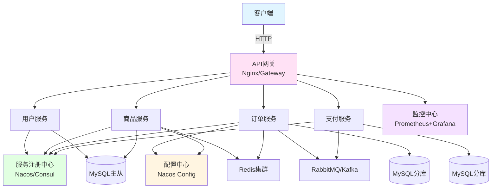

# 实战项目4：微服务架构完整系统

> **学习目标**：构建企业级微服务架构系统
> **核心内容**：服务拆分、Spring Cloud、服务治理、链路追踪
> **预计时间**：12小时

## 微服务概述

### 什么是微服务

```java
/**
 * 微服务架构对比
 */
public class MicroservicesComparison {
    public static void main(String[] args) {
        System.out.println("=== 单体应用 vs 微服务 ===\n");

        System.out.println("单体应用：");
        System.out.println("  优点：");
        System.out.println("    - 开发简单");
        System.out.println("    - 部署方便");
        System.out.println("    - 测试容易");
        System.out.println("  缺点：");
        System.out.println("    - 代码耦合度高");
        System.out.println("    - 扩展性差");
        System.out.println("    - 技术栈单一");
        System.out.println("    - 故障影响范围大\n");

        System.out.println("微服务架构：");
        System.out.println("  优点：");
        System.out.println("    - 服务独立部署");
        System.out.println("    - 技术栈灵活");
        System.out.println("    - 扩展性强");
        System.out.println("    - 故障隔离");
        System.out.println("  缺点：");
        System.out.println("    - 运维复杂");
        System.out.println("    - 分布式事务");
        System.out.println("    - 服务治理困难");
        System.out.println("    - 调用链路复杂\n");
    }
}
```

### 微服务架构图



## Spring Cloud技术栈

### 技术选型

```java
/**
 * Spring Cloud技术栈
 */
public class SpringCloudStack {
    public static void main(String[] args) {
        System.out.println("=== Spring Cloud技术栈 ===\n");

        System.out.println("1. 服务注册与发现：");
        System.out.println("   - Nacos（推荐）");
        System.out.println("   - Eureka（已停止维护）");
        System.out.println("   - Consul\n");

        System.out.println("2. 配置中心：");
        System.out.println("   - Nacos Config");
        System.out.println("   - Spring Cloud Config");
        System.out.println("   - Apollo\n");

        System.out.println("3. API网关：");
        System.out.println("   - Spring Cloud Gateway");
        System.out.println("   - Zuul（已停止维护）\n");

        System.out.println("4. 服务调用：");
        System.out.println("   - OpenFeign");
        System.out.println("   - LoadBalancer\n");

        System.out.println("5. 熔断降级：");
        System.out.println("   - Sentinel");
        System.out.println("   - Resilience4j\n");

        System.out.println("6. 链路追踪：");
        System.out.println("   - Spring Cloud Sleuth + Zipkin");
        System.out.println("   - SkyWalking\n");

        System.out.println("7. 分布式事务：");
        System.out.println("   - Seata");
        System.out.println("   - RocketMQ事务消息\n");
    }
}
```

## 项目结构

### 微服务拆分

```
microservices-project/
├── gateway/                    # API网关
│   └── gateway-service/
├── user-service/              # 用户服务
├── product-service/           # 商品服务
├── order-service/             # 订单服务
├── payment-service/           # 支付服务
├── common/                    # 公共模块
│   ├── common-api/            # 公共API
│   ├── common-domain/         # 公共领域模型
│   └── common-utils/          # 公共工具
└── docker-compose.yml         # Docker编排
```

## 服务注册中心

### Nacos配置

```xml
<!-- pom.xml -->
<dependencies>
    <dependency>
        <groupId>com.alibaba.cloud</groupId>
        <artifactId>spring-cloud-starter-alibaba-nacos-discovery</artifactId>
    </dependency>
    <dependency>
        <groupId>com.alibaba.cloud</groupId>
        <artifactId>spring-cloud-starter-alibaba-nacos-config</artifactId>
    </dependency>
</dependencies>
```

```yaml
# bootstrap.yml
spring:
  application:
    name: user-service
  cloud:
    nacos:
      server-addr: localhost:8848
      discovery:
        namespace: dev
        group: DEFAULT_GROUP
      config:
        namespace: dev
        group: DEFAULT_GROUP
        file-extension: yaml
```

```java
package com.example.user;

import org.springframework.boot.SpringApplication;
import org.springframework.boot.autoconfigure.SpringBootApplication;
import org.springframework.cloud.client.discovery.EnableDiscoveryClient;

/**
 * 用户服务启动类
 */
@SpringBootApplication
@EnableDiscoveryClient
public class UserServiceApplication {
    public static void main(String[] args) {
        SpringApplication.run(UserServiceApplication.class, args);
    }
}
```

## API网关

### Gateway配置

```xml
<dependency>
    <groupId>org.springframework.cloud</groupId>
    <artifactId>spring-cloud-starter-gateway</artifactId>
</dependency>
```

```yaml
# application.yml
spring:
  application:
    name: gateway-service
  cloud:
    nacos:
      discovery:
        server-addr: localhost:8848
    gateway:
      discovery:
        locator:
          enabled: true  # 开启服务发现
      routes:
        # 用户服务路由
        - id: user-service
          uri: lb://user-service
          predicates:
            - Path=/api/users/**
          filters:
            - StripPrefix=1

        # 商品服务路由
        - id: product-service
          uri: lb://product-service
          predicates:
            - Path=/api/products/**
          filters:
            - StripPrefix=1

        # 订单服务路由
        - id: order-service
          uri: lb://order-service
          predicates:
            - Path=/api/orders/**
          filters:
            - StripPrefix=1

      # 全局CORS配置
      globalcors:
        corsConfigurations:
          '[/**]':
            allowedOrigins: "*"
            allowedMethods:
              - GET
              - POST
              - PUT
              - DELETE
```

### Gateway全局过滤器

```java
package com.example.gateway.filter;

import org.springframework.cloud.gateway.filter.*;
import org.springframework.core.Ordered;
import org.springframework.http.*;
import org.springframework.stereotype.Component;
import reactor.core.publisher.Mono;

/**
 * 全局认证过滤器
 */
@Component
public class AuthFilter implements GlobalFilter, Ordered {

    @Override
    public Mono<Void> filter(ServerWebExchange exchange, GatewayFilterChain chain) {
        String path = exchange.getRequest().getURI().getPath();

        // 白名单路径
        if (isWhitePath(path)) {
            return chain.filter(exchange);
        }

        // 获取token
        String token = exchange.getRequest().getHeaders().getFirst("Authorization");

        if (token == null || !validateToken(token)) {
            ServerHttpResponse response = exchange.getResponse();
            response.setStatusCode(HttpStatus.UNAUTHORIZED);
            response.getHeaders().setContentType(MediaType.APPLICATION_JSON);

            String body = "{\"code\":401,\"message\":\"未认证\"}";
            DataBuffer buffer = response.bufferFactory().wrap(body.getBytes());
            return response.writeWith(Mono.just(buffer));
        }

        // 添加用户信息到请求头
        ServerHttpRequest mutatedRequest = exchange.getRequest().mutate()
                .header("X-User-Id", getUserIdFromToken(token))
                .build();

        return chain.filter(exchange.mutate().request(mutatedRequest).build());
    }

    @Override
    public int getOrder() {
        return -100;  // 优先级
    }

    private boolean isWhitePath(String path) {
        return path.contains("/api/auth/") ||
               path.contains("/api/public/");
    }

    private boolean validateToken(String token) {
        // Token验证逻辑
        return true;
    }

    private String getUserIdFromToken(String token) {
        // 从token获取用户ID
        return "1";
    }
}
```

## 服务调用

### OpenFeign配置

```xml
<dependency>
    <groupId>org.springframework.cloud</groupId>
    <artifactId>spring-cloud-starter-openfeign</artifactId>
</dependency>
```

```java
package com.example.order.feign;

import org.springframework.cloud.openfeign.*;
import org.springframework.web.bind.annotation.*;

/**
 * 用户服务Feign客户端
 */
@FeignClient(name = "user-service", path = "/api/users")
public interface UserFeignClient {

    @GetMapping("/{id}")
    UserDTO getById(@PathVariable("id") Long id);

    @PostMapping
    UserDTO create(@RequestBody UserDTO user);

    @GetMapping("/exists")
    Boolean existsByUsername(@RequestParam("username") String username);
}

/**
 * 商品服务Feign客户端
 */
@FeignClient(name = "product-service", path = "/api/products")
public interface ProductFeignClient {

    @GetMapping("/{id}")
    ProductDTO getById(@PathVariable("id") Long id);

    @PostMapping("/{id}/reduce-stock")
    Boolean reduceStock(@PathVariable("id") Long id,
                       @RequestParam("quantity") Integer quantity);
}
```

### Feign使用

```java
package com.example.order.service;

import com.example.order.feign.*;
import org.springframework.beans.factory.annotation.Autowired;
import org.springframework.stereotype.Service;

/**
 * 订单服务
 */
@Service
public class OrderService {

    @Autowired
    private UserFeignClient userFeignClient;

    @Autowired
    private ProductFeignClient productFeignClient;

    /**
     * 创建订单
     */
    public Order createOrder(Long userId, Long productId, Integer quantity) {
        // 调用用户服务
        UserDTO user = userFeignClient.getById(userId);
        if (user == null) {
            throw new RuntimeException("用户不存在");
        }

        // 调用商品服务
        ProductDTO product = productFeignClient.getById(productId);
        if (product == null) {
            throw new RuntimeException("商品不存在");
        }

        // 扣减库存
        Boolean success = productFeignClient.reduceStock(productId, quantity);
        if (!success) {
            throw new RuntimeException("库存不足");
        }

        // 创建订单
        Order order = new Order();
        order.setUserId(userId);
        order.setProductId(productId);
        order.setQuantity(quantity);
        order.setTotalAmount(product.getPrice().multiply(new BigDecimal(quantity)));

        return orderRepository.save(order);
    }
}
```

## 熔断降级

### Sentinel配置

```xml
<dependency>
    <groupId>com.alibaba.cloud</groupId>
    <artifactId>spring-cloud-starter-alibaba-sentinel</artifactId>
</dependency>
```

```yaml
spring:
  cloud:
    sentinel:
      transport:
        dashboard: localhost:8080  # Sentinel控制台
      eager: true  # 立即加载
```

### 限流规则

```java
package com.example.order.controller;

import com.alibaba.csp.sentinel.annotation.*;
import com.example.order.entity.*;
import com.example.order.service.*;
import org.springframework.beans.factory.annotation.*;
import org.springframework.web.bind.annotation.*;

/**
 * 订单Controller
 */
@RestController
@RequestMapping("/api/orders")
public class OrderController {

    @Autowired
    private OrderService orderService;

    /**
     * 限流：QPS=10
     */
    @GetMapping("/{id}")
    @SentinelResource(
        value = "getOrder",
        blockHandler = "handleBlock",
        fallback = "handleFallback"
    )
    public Order getById(@PathVariable Long id) {
        return orderService.findById(id);
    }

    /**
     * 限流：QPS=5
     */
    @PostMapping
    @SentinelResource(value = "createOrder",
            blockHandler = "handleCreateBlock")
    public Order create(@RequestBody Order order) {
        return orderService.create(order);
    }

    /**
     * 限流异常处理
     */
    public Order handleBlock(Long id, BlockException e) {
        return Order.builder().id(id).status("限流中").build();
    }

    /**
     * 降级处理
     */
    public Order handleFallback(Long id, Throwable e) {
        return Order.builder().id(id).status("服务降级").build();
    }

    public Order handleCreateBlock(Order order, BlockException e) {
        return Order.builder().status("创建订单限流").build();
    }
}
```

## 分布式事务

### Seata配置

```xml
<dependency>
    <groupId>com.alibaba.cloud</groupId>
    <artifactId>spring-cloud-starter-alibaba-seata</artifactId>
</dependency>
```

```yaml
seata:
  enabled: true
  application-id: order-service
  tx-service-group: my_test_tx_group
  service:
    vgroup-mapping:
      my_test_tx_group: default
    grouplist:
      default: localhost:8091
  registry:
    type: nacos
    nacos:
      server-addr: localhost:8848
      namespace: dev
      group: SEATA_GROUP
```

### 分布式事务使用

```java
package com.example.order.service;

import com.example.order.feign.*;
import io.seata.spring.annotation.*;
import org.springframework.beans.factory.annotation.*;
import org.springframework.stereotype.*;
import org.springframework.transaction.annotation.*;

/**
 * 订单服务（分布式事务）
 */
@Service
public class OrderService {

    @Autowired
    private OrderRepository orderRepository;

    @Autowired
    private ProductFeignClient productFeignClient;

    @Autowired
    private AccountFeignClient accountFeignClient;

    /**
     * 创建订单（全局事务）
     */
    @GlobalTransactional(name = "create-order", rollbackFor = Exception.class)
    public void createOrder(OrderDTO orderDTO) {
        // 1. 扣减账户余额
        accountFeignClient.deduct(orderDTO.getUserId(),
                                 orderDTO.getTotalAmount());

        // 2. 扣减库存
        productFeignClient.reduceStock(orderDTO.getProductId(),
                                      orderDTO.getQuantity());

        // 3. 创建订单
        Order order = new Order();
        order.setUserId(orderDTO.getUserId());
        order.setProductId(orderDTO.getProductId());
        order.setQuantity(orderDTO.getQuantity());
        order.setTotalAmount(orderDTO.getTotalAmount());

        orderRepository.save(order);

        // 如果出现异常，所有操作都会回滚
        if (orderDTO.getTotalAmount().compareTo(new BigDecimal("0")) < 0) {
            throw new RuntimeException("金额异常");
        }
    }
}
```

## 链路追踪

### Sleuth + Zipkin配置

```xml
<dependency>
    <groupId>org.springframework.cloud</groupId>
    <artifactId>spring-cloud-starter-sleuth</artifactId>
</dependency>
<dependency>
    <groupId>org.springframework.cloud</groupId>
    <artifactId>spring-cloud-sleuth-zipkin</artifactId>
</dependency>
```

```yaml
spring:
  sleuth:
    zipkin:
      base-url: http://localhost:9411
    sampler:
      probability: 1.0  # 采样率100%
```

## 配置中心

### Nacos Config配置

```yaml
# bootstrap.yml
spring:
  application:
    name: order-service
  cloud:
    nacos:
      config:
        server-addr: localhost:8848
        namespace: dev
        group: DEFAULT_GROUP
        file-extension: yaml
        shared-configs:
          - data-id: common.yaml
            group: DEFAULT_GROUP
            refresh: true
```

```yaml
# Nacos配置中心：order-service.yaml
spring:
  datasource:
    url: jdbc:mysql://localhost:3306/order_db
    username: root
    password: root

mybatis:
  mapper-locations: classpath:mapper/*.xml

logging:
  level:
    com.example.order: DEBUG
```

## Docker部署

### Docker Compose

```yaml
version: '3.8'

services:
  # Nacos
  nacos:
    image: nacos/nacos-server:v2.2.0
    environment:
      MODE: standalone
    ports:
      - "8848:8848"

  # MySQL
  mysql:
    image: mysql:8.0
    environment:
      MYSQL_ROOT_PASSWORD: root
    ports:
      - "3306:3306"
    volumes:
      - mysql-data:/var/lib/mysql

  # Redis
  redis:
    image: redis:7.0
    ports:
      - "6379:6379"

  # Sentinel
  sentinel:
    image: bladex/sentinel-dashboard:1.8.6
    ports:
      - "8080:8080"

  # Zipkin
  zipkin:
    image: openzipkin/zipkin:latest
    ports:
      - "9411:9411"

  # Seata
  seata:
    image: seataio/seata-server:1.6.0
    ports:
      - "8091:8091"
    environment:
      SEATA_PORT: 8091
      STORE_MODE: db

  # Gateway
  gateway:
    build: ./gateway/gateway-service
    ports:
      - "8080:8080"
    depends_on:
      - nacos

  # User Service
  user-service:
    build: ./user-service
    ports:
      - "8081:8081"
    depends_on:
      - nacos
      - mysql

  # Order Service
  order-service:
    build: ./order-service
    ports:
      - "8082:8082"
    depends_on:
      - nacos
      - mysql
      - seata

volumes:
  mysql-data:
```

## 最佳实践

### 微服务最佳实践

```java
/**
 * 微服务最佳实践
 */
public class MicroservicesBestPractices {

    /*
    1. 服务拆分
    ==========
    ✅ 按业务领域拆分
    ✅ 单一职责原则
    ✅ 服务独立部署
    ✅ 数据库分离
    ❌ 避免过度拆分

    2. 服务通信
    ==========
    ✅ 同步调用：OpenFeign
    ✅ 异步调用：消息队列
    ✅ 避免循环依赖
    ✅ 合理设置超时

    3. 数据一致性
    ============
    ✅ 强一致性：Seata
    ✅ 最终一致性：消息队列
    ✅ 本地事务：@Transactional
    ✅ 幂等性设计

    4. 服务治理
    ==========
    ✅ 服务注册发现：Nacos
    ✅ 负载均衡：LoadBalancer
    ✅ 熔断降级：Sentinel
    ✅ 限流保护：Sentinel

    5. 可观测性
    ==========
    ✅ 日志收集：ELK
    ✅ 链路追踪：Zipkin
    ✅ 监控告警：Prometheus
    ✅ 性能指标：Grafana

    6. 安全防护
    ==========
    ✅ 网关统一认证
    ✅ 服务间鉴权
    ✅ 数据加密
    ✅ 限流防刷
    */
}
```

## 本章小结

### 项目总结

✅ **服务拆分**：用户、商品、订单、支付服务
✅ **服务注册**：Nacos注册中心
✅ **API网关**：Spring Cloud Gateway
✅ **服务调用**：OpenFeign
✅ **熔断降级**：Sentinel
✅ **分布式事务**：Seata
✅ **链路追踪**：Sleuth + Zipkin
✅ **配置中心**：Nacos Config

### 核心技术点

- **Spring Cloud**：微服务全家桶
- **Nacos**：注册中心+配置中心
- **Gateway**：API网关
- **Feign**：声明式服务调用
- **Sentinel**：流量控制
- **Seata**：分布式事务
- **Zipkin**：链路追踪

### 学习完成

**恭喜！你已经完成了Java企业级开发的全部学习！**

**下一步建议**：
- 深入学习云原生技术（K8s、Docker）
- 学习DevOps（CI/CD、自动化运维）
- 关注新技术发展
- 实践更多项目

---

**学习时间**：约12小时
**难度等级**：★★★★★
**重要程度**：★★★★★

**整个Java教程（第1-28章）学习完成！** 🎉
